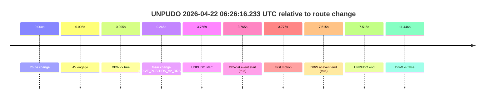
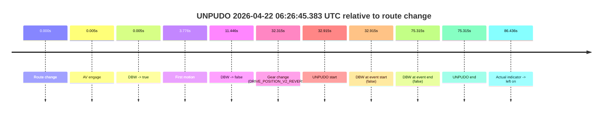
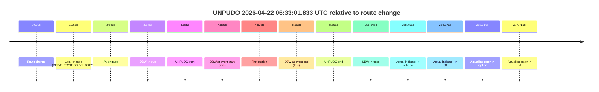
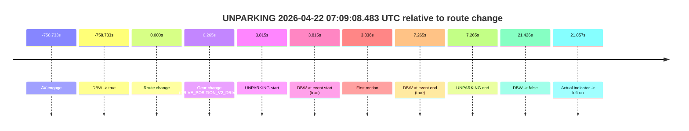
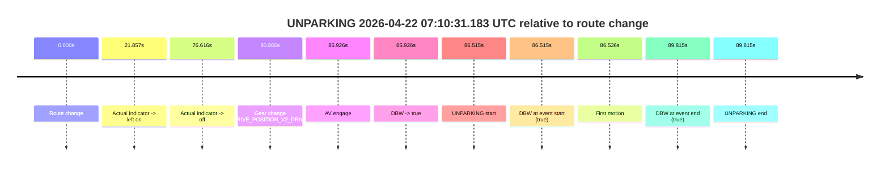
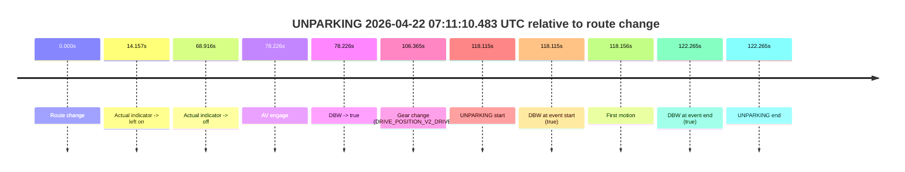

# Run Report: fme20012/2026-04-22--06-13-52--gen2-av-9d4af3b2-5820-4131-9962-82ddbe1b0720

| Field | Value |
|---|---|
| Run ID | `fme20012/2026-04-22--06-13-52--gen2-av-9d4af3b2-5820-4131-9962-82ddbe1b0720` |
| Date | `2026-04-22` |
| Model(s) | `eel-teal-outspoken` |
| Author | `zak` |
| Event count | `6` |

## unpudo 2026-04-22 06:26:16.233 UTC

| Field | Value |
|---|---|
| Model | `eel-teal-outspoken` |
| Author | `zak` |
| Run ID | `fme20012/2026-04-22--06-13-52--gen2-av-9d4af3b2-5820-4131-9962-82ddbe1b0720` |
| Date | `2026-04-22` |
| Time (UTC) | `06:26:16.233` |
| Event type | `unpudo` |
| Disengagement type | `none observed` |
| Route change | `found` |
| Console | [run](https://console.sso.wayve.ai/run/fme20012/2026-04-22--06-13-52--gen2-av-9d4af3b2-5820-4131-9962-82ddbe1b0720?id=&time-unixus=1776839176233288) |
| Foxglove | [segment](https://app.foxglove.dev/wayve-on-prem/p/prj_0dX18KZdVHg1fmmI/view?ds=foxglove-stream&ds.deviceName=fme20012&ds.start=2026-04-22T06%3A26%3A02.468282Z&ds.end=2026-04-22T06%3A26%3A33.914179Z&layoutId=lay_0e7VD4WIKDQGU73Y&time=2026-04-22T06%3A26%3A16.233288Z) |

### Event card: pass

- Pass: AV owns the credited unpudo from route change through the official unpudo window, the gear state is aligned at the anchor, and the vehicle moves without driver accelerator help in AV.

| Event | Time (UTC) | Delta from route change |
|---|---:|---:|
| Route change | 2026-04-22 06:26:12.468 | `0.000s` |
| AV engage | 2026-04-22 06:26:12.473 | `0.005s` |
| DBW -> true | 2026-04-22 06:26:12.473 | `0.005s` |
| Gear change (DRIVE_POSITION_V2_DRIVE) | 2026-04-22 06:26:12.733 | `0.265s` |
| UNPUDO start | 2026-04-22 06:26:16.233 | `3.765s` |
| DBW at event start (true) | 2026-04-22 06:26:16.233 | `3.765s` |
| First motion | 2026-04-22 06:26:16.244 | `3.776s` |
| DBW at event end (true) | 2026-04-22 06:26:19.983 | `7.515s` |
| UNPUDO end | 2026-04-22 06:26:19.983 | `7.515s` |
| DBW -> false | 2026-04-22 06:26:23.914 | `11.446s` |

| Metric | Value |
|---|---|
| Outcome | `pass` |
| Effective failure type | `none` |
| Route change status | `found` |
| DBW at event start | `true` |
| DBW at event end | `true` |
| Predicted gear at AV start | `DRIVE_POSITION_V2_PARK` |
| Actual gear at AV start | `DRIVE_POSITION_V2_PARK` |
| Predicted gear at event start | `DRIVE_POSITION_V2_DRIVE` |
| Actual gear at event start | `DRIVE_POSITION_V2_DRIVE` |
| Planned indicator direction | `INDICATORS_STATE_V2_LEFT_ON` |
| Controller indicator direction | `INDICATORS_STATE_V2_LEFT_ON` |
| Actual indicator direction | `INDICATORS_STATE_V2_OFF` |
| Actual indicator at maneuver end | `INDICATORS_STATE_V2_OFF` |
| Driver accel help in AV | `false` |
| Driver accel help timestamp | `n/a` |
| Max accel pedal pct in AV | `0.0%` |
| Max brake pedal pct in AV | `8.6%` |
| Max speed mps in AV | `3.881` |
| Success timing baseline | `route change` |
| Route -> AV | `0.005s` |
| AV -> event start | `3.760s` |
| AV -> first motion | `3.771s` |
| Success baseline -> event start | `3.765s` |
| Success baseline -> first motion | `3.776s` |
| AV duration before disengagement | `11.440s` |
| Trajectory waypoint count | `38` |
| Driving-plan step count | `11` |

The scored portion starts from the AV-owned window, not from the pre-AV setup. Route-change search in the stopped pre-event segment was `found`, with the baseline therefore set to route change. At the event anchor the model predicts `DRIVE_POSITION_V2_DRIVE` and the actual gear is `DRIVE_POSITION_V2_DRIVE`. The effective model outcome is `pass` because `the credited unpudo stays AV-owned through the official unpudo window.`

### Resolution

| Field | Value |
|---|---|
| Final outcome | `pass` |
| Do we agree with this label? | `yes` |
| Source disengagement type | `none observed` |
| Resolved effective failure type | `none` |
| Confidence | `high` |

## unpudo 2026-04-22 06:26:45.383 UTC

| Field | Value |
|---|---|
| Model | `eel-teal-outspoken` |
| Author | `zak` |
| Run ID | `fme20012/2026-04-22--06-13-52--gen2-av-9d4af3b2-5820-4131-9962-82ddbe1b0720` |
| Date | `2026-04-22` |
| Time (UTC) | `06:26:45.383` |
| Event type | `unpudo` |
| Disengagement type | `none observed` |
| Route change | `found` |
| Console | [run](https://console.sso.wayve.ai/run/fme20012/2026-04-22--06-13-52--gen2-av-9d4af3b2-5820-4131-9962-82ddbe1b0720?id=&time-unixus=1776839205383292) |
| Foxglove | [segment](https://app.foxglove.dev/wayve-on-prem/p/prj_0dX18KZdVHg1fmmI/view?ds=foxglove-stream&ds.deviceName=fme20012&ds.start=2026-04-22T06%3A26%3A02.468282Z&ds.end=2026-04-22T06%3A27%3A37.783300Z&layoutId=lay_0e7VD4WIKDQGU73Y&time=2026-04-22T06%3A26%3A45.383292Z) |

### Event card: fail

- Fail: the credited unpudo does not stay AV-owned. The event window starts with DBW false, and the maneuver outcome lands outside a clean AV-owned segment.

| Event | Time (UTC) | Delta from route change |
|---|---:|---:|
| Route change | 2026-04-22 06:26:12.468 | `0.000s` |
| AV engage | 2026-04-22 06:26:12.473 | `0.005s` |
| DBW -> true | 2026-04-22 06:26:12.473 | `0.005s` |
| First motion | 2026-04-22 06:26:16.244 | `3.776s` |
| DBW -> false | 2026-04-22 06:26:23.914 | `11.446s` |
| Gear change (DRIVE_POSITION_V2_REVERSE) | 2026-04-22 06:26:44.783 | `32.315s` |
| UNPUDO start | 2026-04-22 06:26:45.383 | `32.915s` |
| DBW at event start (false) | 2026-04-22 06:26:45.383 | `32.915s` |
| DBW at event end (false) | 2026-04-22 06:27:27.783 | `75.315s` |
| UNPUDO end | 2026-04-22 06:27:27.783 | `75.315s` |
| Actual indicator -> left on | 2026-04-22 06:27:38.904 | `86.436s` |

| Metric | Value |
|---|---|
| Outcome | `fail` |
| Effective failure type | `not_av_owned` |
| Route change status | `found` |
| DBW at event start | `false` |
| DBW at event end | `false` |
| Predicted gear at AV start | `DRIVE_POSITION_V2_PARK` |
| Actual gear at AV start | `DRIVE_POSITION_V2_PARK` |
| Predicted gear at event start | `DRIVE_POSITION_V2_REVERSE` |
| Actual gear at event start | `DRIVE_POSITION_V2_REVERSE` |
| Planned indicator direction | `INDICATORS_STATE_V2_OFF` |
| Controller indicator direction | `INDICATORS_STATE_V2_OFF` |
| Actual indicator direction | `INDICATORS_STATE_V2_OFF` |
| Actual indicator at maneuver end | `INDICATORS_STATE_V2_OFF` |
| Driver accel help in AV | `false` |
| Driver accel help timestamp | `n/a` |
| Max accel pedal pct in AV | `0.0%` |
| Max brake pedal pct in AV | `8.6%` |
| Max speed mps in AV | `3.942` |
| Success timing baseline | `route change` |
| Route -> AV | `0.005s` |
| AV -> event start | `32.910s` |
| AV -> first motion | `3.771s` |
| Success baseline -> event start | `32.915s` |
| Success baseline -> first motion | `3.776s` |
| AV duration before disengagement | `11.440s` |
| Trajectory waypoint count | `37` |
| Driving-plan step count | `11` |

The scored portion starts from the AV-owned window, not from the pre-AV setup. Route-change search in the stopped pre-event segment was `found`, with the baseline therefore set to route change. At the event anchor the model predicts `DRIVE_POSITION_V2_REVERSE` and the actual gear is `DRIVE_POSITION_V2_REVERSE`. The effective model outcome is `fail` because `not_av_owned.`

### Resolution

| Field | Value |
|---|---|
| Final outcome | `fail` |
| Do we agree with this label? | `yes` |
| Source disengagement type | `none observed` |
| Resolved effective failure type | `not_av_owned` |
| Confidence | `high` |

## unpudo 2026-04-22 06:33:01.833 UTC

| Field | Value |
|---|---|
| Model | `eel-teal-outspoken` |
| Author | `zak` |
| Run ID | `fme20012/2026-04-22--06-13-52--gen2-av-9d4af3b2-5820-4131-9962-82ddbe1b0720` |
| Date | `2026-04-22` |
| Time (UTC) | `06:33:01.833` |
| Event type | `unpudo` |
| Disengagement type | `none observed` |
| Route change | `found` |
| Console | [run](https://console.sso.wayve.ai/run/fme20012/2026-04-22--06-13-52--gen2-av-9d4af3b2-5820-4131-9962-82ddbe1b0720?id=&time-unixus=1776839581833298) |
| Foxglove | [segment](https://app.foxglove.dev/wayve-on-prem/p/prj_0dX18KZdVHg1fmmI/view?ds=foxglove-stream&ds.deviceName=fme20012&ds.start=2026-04-22T06%3A32%3A46.968289Z&ds.end=2026-04-22T06%3A37%3A23.814232Z&layoutId=lay_0e7VD4WIKDQGU73Y&time=2026-04-22T06%3A33%3A01.833298Z) |

### Event card: pass

- Pass: AV owns the credited unpudo from route change through the official unpudo window, the gear state is aligned at the anchor, and the vehicle moves without driver accelerator help in AV.

| Event | Time (UTC) | Delta from route change |
|---|---:|---:|
| Route change | 2026-04-22 06:32:56.968 | `0.000s` |
| Gear change (DRIVE_POSITION_V2_DRIVE) | 2026-04-22 06:32:58.233 | `1.265s` |
| AV engage | 2026-04-22 06:33:00.614 | `3.646s` |
| DBW -> true | 2026-04-22 06:33:00.614 | `3.646s` |
| UNPUDO start | 2026-04-22 06:33:01.833 | `4.865s` |
| DBW at event start (true) | 2026-04-22 06:33:01.833 | `4.865s` |
| First motion | 2026-04-22 06:33:01.844 | `4.876s` |
| DBW at event end (true) | 2026-04-22 06:33:05.533 | `8.565s` |
| UNPUDO end | 2026-04-22 06:33:05.533 | `8.565s` |
| DBW -> false | 2026-04-22 06:37:13.814 | `256.846s` |
| Actual indicator -> right on | 2026-04-22 06:37:15.724 | `258.756s` |
| Actual indicator -> off | 2026-04-22 06:37:21.344 | `264.376s` |
| Actual indicator -> right on | 2026-04-22 06:37:25.684 | `268.716s` |
| Actual indicator -> off | 2026-04-22 06:37:31.684 | `274.716s` |

| Metric | Value |
|---|---|
| Outcome | `pass` |
| Effective failure type | `none` |
| Route change status | `found` |
| DBW at event start | `true` |
| DBW at event end | `true` |
| Predicted gear at AV start | `DRIVE_POSITION_V2_DRIVE` |
| Actual gear at AV start | `DRIVE_POSITION_V2_DRIVE` |
| Predicted gear at event start | `DRIVE_POSITION_V2_DRIVE` |
| Actual gear at event start | `DRIVE_POSITION_V2_DRIVE` |
| Planned indicator direction | `INDICATORS_STATE_V2_OFF` |
| Controller indicator direction | `INDICATORS_STATE_V2_OFF` |
| Actual indicator direction | `INDICATORS_STATE_V2_OFF` |
| Actual indicator at maneuver end | `INDICATORS_STATE_V2_OFF` |
| Driver accel help in AV | `false` |
| Driver accel help timestamp | `n/a` |
| Max accel pedal pct in AV | `0.0%` |
| Max brake pedal pct in AV | `0.0%` |
| Max speed mps in AV | `3.725` |
| Success timing baseline | `route change` |
| Route -> AV | `3.646s` |
| AV -> event start | `1.219s` |
| AV -> first motion | `1.230s` |
| Success baseline -> event start | `4.865s` |
| Success baseline -> first motion | `4.876s` |
| AV duration before disengagement | `253.200s` |
| Trajectory waypoint count | `38` |
| Driving-plan step count | `11` |

The scored portion starts from the AV-owned window, not from the pre-AV setup. Route-change search in the stopped pre-event segment was `found`, with the baseline therefore set to route change. At the event anchor the model predicts `DRIVE_POSITION_V2_DRIVE` and the actual gear is `DRIVE_POSITION_V2_DRIVE`. The effective model outcome is `pass` because `the credited unpudo stays AV-owned through the official unpudo window.`

### Resolution

| Field | Value |
|---|---|
| Final outcome | `pass` |
| Do we agree with this label? | `yes` |
| Source disengagement type | `none observed` |
| Resolved effective failure type | `none` |
| Confidence | `high` |

## unparking 2026-04-22 07:09:08.483 UTC

| Field | Value |
|---|---|
| Model | `eel-teal-outspoken` |
| Author | `zak` |
| Run ID | `fme20012/2026-04-22--06-13-52--gen2-av-9d4af3b2-5820-4131-9962-82ddbe1b0720` |
| Date | `2026-04-22` |
| Time (UTC) | `07:09:08.483` |
| Event type | `unparking` |
| Disengagement type | `none observed` |
| Route change | `found` |
| Console | [run](https://console.sso.wayve.ai/run/fme20012/2026-04-22--06-13-52--gen2-av-9d4af3b2-5820-4131-9962-82ddbe1b0720?id=&time-unixus=1776841748483299) |
| Foxglove | [segment](https://app.foxglove.dev/wayve-on-prem/p/prj_0dX18KZdVHg1fmmI/view?ds=foxglove-stream&ds.deviceName=fme20012&ds.start=2026-04-22T06%3A56%3A15.935099Z&ds.end=2026-04-22T07%3A09%3A36.094059Z&layoutId=lay_0e7VD4WIKDQGU73Y&time=2026-04-22T07%3A09%3A08.483299Z) |

### Event card: pass

- Pass: AV owns the credited unparking through the official event window, the gear state is aligned at the anchor, and the vehicle moves without driver accelerator help in AV.

| Event | Time (UTC) | Delta from route change |
|---|---:|---:|
| AV engage | 2026-04-22 06:56:25.935 | `-758.733s` |
| DBW -> true | 2026-04-22 06:56:25.935 | `-758.733s` |
| Route change | 2026-04-22 07:09:04.668 | `0.000s` |
| Gear change (DRIVE_POSITION_V2_DRIVE) | 2026-04-22 07:09:04.933 | `0.265s` |
| UNPARKING start | 2026-04-22 07:09:08.483 | `3.815s` |
| DBW at event start (true) | 2026-04-22 07:09:08.483 | `3.815s` |
| First motion | 2026-04-22 07:09:08.504 | `3.836s` |
| DBW at event end (true) | 2026-04-22 07:09:11.933 | `7.265s` |
| UNPARKING end | 2026-04-22 07:09:11.933 | `7.265s` |
| DBW -> false | 2026-04-22 07:09:26.094 | `21.426s` |
| Actual indicator -> left on | 2026-04-22 07:09:26.525 | `21.857s` |

| Metric | Value |
|---|---|
| Outcome | `pass` |
| Effective failure type | `none` |
| Route change status | `found` |
| DBW at event start | `true` |
| DBW at event end | `true` |
| Predicted gear at AV start | `DRIVE_POSITION_V2_DRIVE` |
| Actual gear at AV start | `DRIVE_POSITION_V2_DRIVE` |
| Predicted gear at event start | `DRIVE_POSITION_V2_DRIVE` |
| Actual gear at event start | `DRIVE_POSITION_V2_DRIVE` |
| Planned indicator direction | `INDICATORS_STATE_V2_RIGHT_ON` |
| Controller indicator direction | `INDICATORS_STATE_V2_RIGHT_ON` |
| Actual indicator direction | `INDICATORS_STATE_V2_OFF` |
| Actual indicator at maneuver end | `INDICATORS_STATE_V2_OFF` |
| Driver accel help in AV | `false` |
| Driver accel help timestamp | `n/a` |
| Max accel pedal pct in AV | `0.0%` |
| Max brake pedal pct in AV | `0.0%` |
| Max speed mps in AV | `4.936` |
| Success timing baseline | `AV start` |
| Route -> AV | `-758.733s` |
| AV -> event start | `762.548s` |
| AV -> first motion | `762.569s` |
| Success baseline -> event start | `762.548s` |
| Success baseline -> first motion | `762.569s` |
| AV duration before disengagement | `780.159s` |
| Trajectory waypoint count | `37` |
| Driving-plan step count | `11` |

The scored portion starts from the AV-owned window, not from the pre-AV setup. Route-change search in the stopped pre-event segment was `found`, with the baseline therefore set to route change. At the event anchor the model predicts `DRIVE_POSITION_V2_DRIVE` and the actual gear is `DRIVE_POSITION_V2_DRIVE`. The effective model outcome is `pass` because `the credited maneuver stays AV-owned through the official event end.`

### Resolution

| Field | Value |
|---|---|
| Final outcome | `pass` |
| Do we agree with this label? | `yes` |
| Source disengagement type | `none observed` |
| Resolved effective failure type | `none` |
| Confidence | `high` |

## unparking 2026-04-22 07:10:31.183 UTC

| Field | Value |
|---|---|
| Model | `eel-teal-outspoken` |
| Author | `zak` |
| Run ID | `fme20012/2026-04-22--06-13-52--gen2-av-9d4af3b2-5820-4131-9962-82ddbe1b0720` |
| Date | `2026-04-22` |
| Time (UTC) | `07:10:31.183` |
| Event type | `unparking` |
| Disengagement type | `none observed` |
| Route change | `found` |
| Console | [run](https://console.sso.wayve.ai/run/fme20012/2026-04-22--06-13-52--gen2-av-9d4af3b2-5820-4131-9962-82ddbe1b0720?id=&time-unixus=1776841831183302) |
| Foxglove | [segment](https://app.foxglove.dev/wayve-on-prem/p/prj_0dX18KZdVHg1fmmI/view?ds=foxglove-stream&ds.deviceName=fme20012&ds.start=2026-04-22T07%3A08%3A54.668263Z&ds.end=2026-04-22T07%3A10%3A44.483319Z&layoutId=lay_0e7VD4WIKDQGU73Y&time=2026-04-22T07%3A10%3A31.183302Z) |

### Event card: pass

- Pass: AV owns the credited unparking through the official event window, the gear state is aligned at the anchor, and the vehicle moves without driver accelerator help in AV.

| Event | Time (UTC) | Delta from route change |
|---|---:|---:|
| Route change | 2026-04-22 07:09:04.668 | `0.000s` |
| Actual indicator -> left on | 2026-04-22 07:09:26.525 | `21.857s` |
| Actual indicator -> off | 2026-04-22 07:10:21.284 | `76.616s` |
| Gear change (DRIVE_POSITION_V2_DRIVE) | 2026-04-22 07:10:25.533 | `80.865s` |
| AV engage | 2026-04-22 07:10:30.594 | `85.926s` |
| DBW -> true | 2026-04-22 07:10:30.594 | `85.926s` |
| UNPARKING start | 2026-04-22 07:10:31.183 | `86.515s` |
| DBW at event start (true) | 2026-04-22 07:10:31.183 | `86.515s` |
| First motion | 2026-04-22 07:10:31.204 | `86.536s` |
| DBW at event end (true) | 2026-04-22 07:10:34.483 | `89.815s` |
| UNPARKING end | 2026-04-22 07:10:34.483 | `89.815s` |

| Metric | Value |
|---|---|
| Outcome | `pass` |
| Effective failure type | `none` |
| Route change status | `found` |
| DBW at event start | `true` |
| DBW at event end | `true` |
| Predicted gear at AV start | `DRIVE_POSITION_V2_DRIVE` |
| Actual gear at AV start | `DRIVE_POSITION_V2_DRIVE` |
| Predicted gear at event start | `DRIVE_POSITION_V2_DRIVE` |
| Actual gear at event start | `DRIVE_POSITION_V2_DRIVE` |
| Planned indicator direction | `INDICATORS_STATE_V2_RIGHT_ON` |
| Controller indicator direction | `INDICATORS_STATE_V2_RIGHT_ON` |
| Actual indicator direction | `INDICATORS_STATE_V2_OFF` |
| Actual indicator at maneuver end | `INDICATORS_STATE_V2_OFF` |
| Driver accel help in AV | `false` |
| Driver accel help timestamp | `n/a` |
| Max accel pedal pct in AV | `0.0%` |
| Max brake pedal pct in AV | `0.0%` |
| Max speed mps in AV | `5.506` |
| Success timing baseline | `route change` |
| Route -> AV | `85.926s` |
| AV -> event start | `0.589s` |
| AV -> first motion | `0.610s` |
| Success baseline -> event start | `86.515s` |
| Success baseline -> first motion | `86.536s` |
| AV duration before disengagement | `n/a` |
| Trajectory waypoint count | `37` |
| Driving-plan step count | `11` |

The scored portion starts from the AV-owned window, not from the pre-AV setup. Route-change search in the stopped pre-event segment was `found`, with the baseline therefore set to route change. At the event anchor the model predicts `DRIVE_POSITION_V2_DRIVE` and the actual gear is `DRIVE_POSITION_V2_DRIVE`. The effective model outcome is `pass` because `the credited maneuver stays AV-owned through the official event end.`

### Resolution

| Field | Value |
|---|---|
| Final outcome | `pass` |
| Do we agree with this label? | `yes` |
| Source disengagement type | `none observed` |
| Resolved effective failure type | `none` |
| Confidence | `high` |

## unparking 2026-04-22 07:11:10.483 UTC

| Field | Value |
|---|---|
| Model | `eel-teal-outspoken` |
| Author | `zak` |
| Run ID | `fme20012/2026-04-22--06-13-52--gen2-av-9d4af3b2-5820-4131-9962-82ddbe1b0720` |
| Date | `2026-04-22` |
| Time (UTC) | `07:11:10.483` |
| Event type | `unparking` |
| Disengagement type | `none observed` |
| Route change | `found` |
| Console | [run](https://console.sso.wayve.ai/run/fme20012/2026-04-22--06-13-52--gen2-av-9d4af3b2-5820-4131-9962-82ddbe1b0720?id=&time-unixus=1776841870483311) |
| Foxglove | [segment](https://app.foxglove.dev/wayve-on-prem/p/prj_0dX18KZdVHg1fmmI/view?ds=foxglove-stream&ds.deviceName=fme20012&ds.start=2026-04-22T07%3A09%3A02.368401Z&ds.end=2026-04-22T07%3A11%3A24.633302Z&layoutId=lay_0e7VD4WIKDQGU73Y&time=2026-04-22T07%3A11%3A10.483311Z) |

### Event card: pass

- Pass: AV owns the credited unparking through the official event window, the gear state is aligned at the anchor, and the vehicle moves without driver accelerator help in AV.

| Event | Time (UTC) | Delta from route change |
|---|---:|---:|
| Route change | 2026-04-22 07:09:12.368 | `0.000s` |
| Actual indicator -> left on | 2026-04-22 07:09:26.525 | `14.157s` |
| Actual indicator -> off | 2026-04-22 07:10:21.284 | `68.916s` |
| AV engage | 2026-04-22 07:10:30.594 | `78.226s` |
| DBW -> true | 2026-04-22 07:10:30.594 | `78.226s` |
| Gear change (DRIVE_POSITION_V2_DRIVE) | 2026-04-22 07:10:58.733 | `106.365s` |
| UNPARKING start | 2026-04-22 07:11:10.483 | `118.115s` |
| DBW at event start (true) | 2026-04-22 07:11:10.483 | `118.115s` |
| First motion | 2026-04-22 07:11:10.524 | `118.156s` |
| DBW at event end (true) | 2026-04-22 07:11:14.633 | `122.265s` |
| UNPARKING end | 2026-04-22 07:11:14.633 | `122.265s` |

| Metric | Value |
|---|---|
| Outcome | `pass` |
| Effective failure type | `none` |
| Route change status | `found` |
| DBW at event start | `true` |
| DBW at event end | `true` |
| Predicted gear at AV start | `DRIVE_POSITION_V2_DRIVE` |
| Actual gear at AV start | `DRIVE_POSITION_V2_DRIVE` |
| Predicted gear at event start | `DRIVE_POSITION_V2_DRIVE` |
| Actual gear at event start | `DRIVE_POSITION_V2_DRIVE` |
| Planned indicator direction | `INDICATORS_STATE_V2_RIGHT_ON` |
| Controller indicator direction | `INDICATORS_STATE_V2_RIGHT_ON` |
| Actual indicator direction | `INDICATORS_STATE_V2_OFF` |
| Actual indicator at maneuver end | `INDICATORS_STATE_V2_OFF` |
| Driver accel help in AV | `false` |
| Driver accel help timestamp | `n/a` |
| Max accel pedal pct in AV | `0.0%` |
| Max brake pedal pct in AV | `0.0%` |
| Max speed mps in AV | `4.422` |
| Success timing baseline | `route change` |
| Route -> AV | `78.226s` |
| AV -> event start | `39.889s` |
| AV -> first motion | `39.930s` |
| Success baseline -> event start | `118.115s` |
| Success baseline -> first motion | `118.156s` |
| AV duration before disengagement | `n/a` |
| Trajectory waypoint count | `37` |
| Driving-plan step count | `11` |

The scored portion starts from the AV-owned window, not from the pre-AV setup. Route-change search in the stopped pre-event segment was `found`, with the baseline therefore set to route change. At the event anchor the model predicts `DRIVE_POSITION_V2_DRIVE` and the actual gear is `DRIVE_POSITION_V2_DRIVE`. The effective model outcome is `pass` because `the credited maneuver stays AV-owned through the official event end.`

### Resolution

| Field | Value |
|---|---|
| Final outcome | `pass` |
| Do we agree with this label? | `yes` |
| Source disengagement type | `none observed` |
| Resolved effective failure type | `none` |
| Confidence | `high` |
