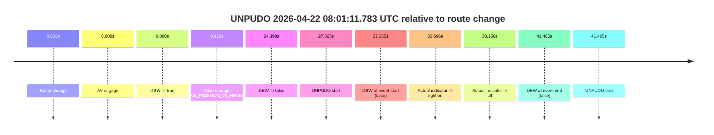
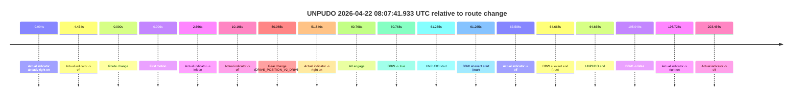
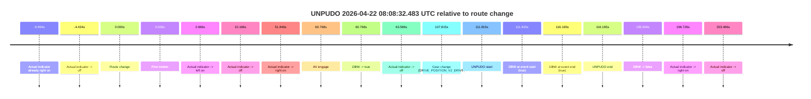
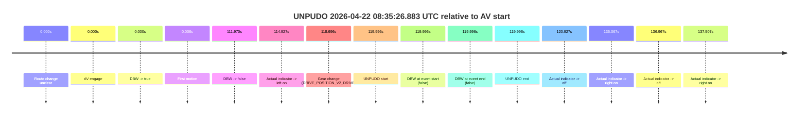

# Run Report: fme20012/2026-04-22--07-56-17--gen2-av-2da5b3d9-46fd-46bd-8a6d-d97301079887

| Field | Value |
|---|---|
| Run ID | `fme20012/2026-04-22--07-56-17--gen2-av-2da5b3d9-46fd-46bd-8a6d-d97301079887` |
| Date | `2026-04-22` |
| Model(s) | `eel-teal-outspoken` |
| Author | `zak` |
| Event count | `5` |

## unpudo 2026-04-22 08:01:11.783 UTC

| Field | Value |
|---|---|
| Model | `eel-teal-outspoken` |
| Author | `zak` |
| Run ID | `fme20012/2026-04-22--07-56-17--gen2-av-2da5b3d9-46fd-46bd-8a6d-d97301079887` |
| Date | `2026-04-22` |
| Time (UTC) | `08:01:11.783` |
| Event type | `unpudo` |
| Disengagement type | `none observed` |
| Route change | `found` |
| Console | [run](https://console.sso.wayve.ai/run/fme20012/2026-04-22--07-56-17--gen2-av-2da5b3d9-46fd-46bd-8a6d-d97301079887?id=&time-unixus=1776844871783296) |
| Foxglove | [segment](https://app.foxglove.dev/wayve-on-prem/p/prj_0dX18KZdVHg1fmmI/view?ds=foxglove-stream&ds.deviceName=fme20012&ds.start=2026-04-22T08%3A00%3A34.418389Z&ds.end=2026-04-22T08%3A01%3A35.883314Z&layoutId=lay_0e7VD4WIKDQGU73Y&time=2026-04-22T08%3A01%3A11.783296Z) |

### Event card: fail

- Fail: the credited unpudo does not stay AV-owned. The event window starts with DBW false, and the maneuver outcome lands outside a clean AV-owned segment.

| Event | Time (UTC) | Delta from route change |
|---|---:|---:|
| Route change | 2026-04-22 08:00:44.418 | `0.000s` |
| AV engage | 2026-04-22 08:00:44.426 | `0.008s` |
| DBW -> true | 2026-04-22 08:00:44.426 | `0.008s` |
| Gear change (DRIVE_POSITION_V2_REVERSE) | 2026-04-22 08:00:44.883 | `0.465s` |
| DBW -> false | 2026-04-22 08:01:08.816 | `24.398s` |
| UNPUDO start | 2026-04-22 08:01:11.783 | `27.365s` |
| DBW at event start (false) | 2026-04-22 08:01:11.783 | `27.365s` |
| Actual indicator -> right on | 2026-04-22 08:01:17.113 | `32.696s` |
| Actual indicator -> off | 2026-04-22 08:01:22.573 | `38.156s` |
| DBW at event end (false) | 2026-04-22 08:01:25.883 | `41.465s` |
| UNPUDO end | 2026-04-22 08:01:25.883 | `41.465s` |

| Metric | Value |
|---|---|
| Outcome | `fail` |
| Effective failure type | `not_av_owned` |
| Route change status | `found` |
| DBW at event start | `false` |
| DBW at event end | `false` |
| Predicted gear at AV start | `DRIVE_POSITION_V2_DRIVE` |
| Actual gear at AV start | `DRIVE_POSITION_V2_PARK` |
| Predicted gear at event start | `DRIVE_POSITION_V2_REVERSE` |
| Actual gear at event start | `DRIVE_POSITION_V2_REVERSE` |
| Planned indicator direction | `INDICATORS_STATE_V2_OFF` |
| Controller indicator direction | `INDICATORS_STATE_V2_OFF` |
| Actual indicator direction | `INDICATORS_STATE_V2_OFF` |
| Actual indicator at maneuver end | `INDICATORS_STATE_V2_OFF` |
| Driver accel help in AV | `false` |
| Driver accel help timestamp | `n/a` |
| Max accel pedal pct in AV | `0.0%` |
| Max brake pedal pct in AV | `8.0%` |
| Max speed mps in AV | `0.000` |
| Success timing baseline | `route change` |
| Route -> AV | `0.008s` |
| AV -> event start | `27.357s` |
| AV -> first motion | `n/a` |
| Success baseline -> event start | `27.365s` |
| Success baseline -> first motion | `n/a` |
| AV duration before disengagement | `24.390s` |
| Trajectory waypoint count | `36` |
| Driving-plan step count | `11` |

The scored portion starts from the AV-owned window, not from the pre-AV setup. Route-change search in the stopped pre-event segment was `found`, with the baseline therefore set to route change. At the event anchor the model predicts `DRIVE_POSITION_V2_REVERSE` and the actual gear is `DRIVE_POSITION_V2_REVERSE`. The effective model outcome is `fail` because `not_av_owned.`

### Resolution

| Field | Value |
|---|---|
| Final outcome | `fail` |
| Do we agree with this label? | `yes` |
| Source disengagement type | `none observed` |
| Resolved effective failure type | `not_av_owned` |
| Confidence | `high` |

## unpudo 2026-04-22 08:07:41.933 UTC

| Field | Value |
|---|---|
| Model | `eel-teal-outspoken` |
| Author | `zak` |
| Run ID | `fme20012/2026-04-22--07-56-17--gen2-av-2da5b3d9-46fd-46bd-8a6d-d97301079887` |
| Date | `2026-04-22` |
| Time (UTC) | `08:07:41.933` |
| Event type | `unpudo` |
| Disengagement type | `none observed` |
| Route change | `found` |
| Console | [run](https://console.sso.wayve.ai/run/fme20012/2026-04-22--07-56-17--gen2-av-2da5b3d9-46fd-46bd-8a6d-d97301079887?id=&time-unixus=1776845261933310) |
| Foxglove | [segment](https://app.foxglove.dev/wayve-on-prem/p/prj_0dX18KZdVHg1fmmI/view?ds=foxglove-stream&ds.deviceName=fme20012&ds.start=2026-04-22T08%3A06%3A30.668338Z&ds.end=2026-04-22T08%3A10%3A06.617089Z&layoutId=lay_0e7VD4WIKDQGU73Y&time=2026-04-22T08%3A07%3A41.933310Z) |

### Event card: pass

- Pass: AV owns the credited unpudo from route change through the official unpudo window, the gear state is aligned at the anchor, and the vehicle moves without driver accelerator help in AV.

| Event | Time (UTC) | Delta from route change |
|---|---:|---:|
| Actual indicator already right on | 2026-04-22 08:06:30.673 | `-9.994s` |
| Actual indicator -> off | 2026-04-22 08:06:36.233 | `-4.434s` |
| Route change | 2026-04-22 08:06:40.668 | `0.000s` |
| First motion | 2026-04-22 08:06:40.674 | `0.006s` |
| Actual indicator -> left on | 2026-04-22 08:06:43.334 | `2.666s` |
| Actual indicator -> off | 2026-04-22 08:06:50.834 | `10.166s` |
| Gear change (DRIVE_POSITION_V2_DRIVE) | 2026-04-22 08:07:30.733 | `50.065s` |
| Actual indicator -> right on | 2026-04-22 08:07:32.514 | `51.846s` |
| AV engage | 2026-04-22 08:07:41.436 | `60.768s` |
| DBW -> true | 2026-04-22 08:07:41.436 | `60.768s` |
| UNPUDO start | 2026-04-22 08:07:41.933 | `61.265s` |
| DBW at event start (true) | 2026-04-22 08:07:41.933 | `61.265s` |
| Actual indicator -> off | 2026-04-22 08:07:44.254 | `63.586s` |
| DBW at event end (true) | 2026-04-22 08:07:45.333 | `64.665s` |
| UNPUDO end | 2026-04-22 08:07:45.333 | `64.665s` |
| DBW -> false | 2026-04-22 08:09:56.617 | `195.949s` |
| Actual indicator -> right on | 2026-04-22 08:09:57.394 | `196.726s` |
| Actual indicator -> off | 2026-04-22 08:10:04.134 | `203.466s` |

| Metric | Value |
|---|---|
| Outcome | `pass` |
| Effective failure type | `none` |
| Route change status | `found` |
| DBW at event start | `true` |
| DBW at event end | `true` |
| Predicted gear at AV start | `DRIVE_POSITION_V2_DRIVE` |
| Actual gear at AV start | `DRIVE_POSITION_V2_DRIVE` |
| Predicted gear at event start | `DRIVE_POSITION_V2_DRIVE` |
| Actual gear at event start | `DRIVE_POSITION_V2_DRIVE` |
| Planned indicator direction | `INDICATORS_STATE_V2_RIGHT_ON` |
| Controller indicator direction | `INDICATORS_STATE_V2_RIGHT_ON` |
| Actual indicator direction | `INDICATORS_STATE_V2_RIGHT_ON` |
| Actual indicator at maneuver end | `INDICATORS_STATE_V2_OFF` |
| Driver accel help in AV | `false` |
| Driver accel help timestamp | `n/a` |
| Max accel pedal pct in AV | `0.0%` |
| Max brake pedal pct in AV | `0.0%` |
| Max speed mps in AV | `5.367` |
| Success timing baseline | `route change` |
| Route -> AV | `60.768s` |
| AV -> event start | `0.497s` |
| AV -> first motion | `-60.763s` |
| Success baseline -> event start | `61.265s` |
| Success baseline -> first motion | `0.006s` |
| AV duration before disengagement | `135.180s` |
| Trajectory waypoint count | `37` |
| Driving-plan step count | `11` |

The scored portion starts from the AV-owned window, not from the pre-AV setup. Route-change search in the stopped pre-event segment was `found`, with the baseline therefore set to route change. At the event anchor the model predicts `DRIVE_POSITION_V2_DRIVE` and the actual gear is `DRIVE_POSITION_V2_DRIVE`. The effective model outcome is `pass` because `the credited unpudo stays AV-owned through the official unpudo window.`

### Resolution

| Field | Value |
|---|---|
| Final outcome | `pass` |
| Do we agree with this label? | `yes` |
| Source disengagement type | `none observed` |
| Resolved effective failure type | `none` |
| Confidence | `high` |

## unpudo 2026-04-22 08:08:32.483 UTC

| Field | Value |
|---|---|
| Model | `eel-teal-outspoken` |
| Author | `zak` |
| Run ID | `fme20012/2026-04-22--07-56-17--gen2-av-2da5b3d9-46fd-46bd-8a6d-d97301079887` |
| Date | `2026-04-22` |
| Time (UTC) | `08:08:32.483` |
| Event type | `unpudo` |
| Disengagement type | `none observed` |
| Route change | `found` |
| Console | [run](https://console.sso.wayve.ai/run/fme20012/2026-04-22--07-56-17--gen2-av-2da5b3d9-46fd-46bd-8a6d-d97301079887?id=&time-unixus=1776845312483319) |
| Foxglove | [segment](https://app.foxglove.dev/wayve-on-prem/p/prj_0dX18KZdVHg1fmmI/view?ds=foxglove-stream&ds.deviceName=fme20012&ds.start=2026-04-22T08%3A06%3A30.668338Z&ds.end=2026-04-22T08%3A10%3A06.617089Z&layoutId=lay_0e7VD4WIKDQGU73Y&time=2026-04-22T08%3A08%3A32.483319Z) |

### Event card: pass

- Pass: AV owns the credited unpudo from route change through the official unpudo window, the gear state is aligned at the anchor, and the vehicle moves without driver accelerator help in AV.

| Event | Time (UTC) | Delta from route change |
|---|---:|---:|
| Actual indicator already right on | 2026-04-22 08:06:30.673 | `-9.994s` |
| Actual indicator -> off | 2026-04-22 08:06:36.233 | `-4.434s` |
| Route change | 2026-04-22 08:06:40.668 | `0.000s` |
| First motion | 2026-04-22 08:06:40.674 | `0.006s` |
| Actual indicator -> left on | 2026-04-22 08:06:43.334 | `2.666s` |
| Actual indicator -> off | 2026-04-22 08:06:50.834 | `10.166s` |
| Actual indicator -> right on | 2026-04-22 08:07:32.514 | `51.846s` |
| AV engage | 2026-04-22 08:07:41.436 | `60.768s` |
| DBW -> true | 2026-04-22 08:07:41.436 | `60.768s` |
| Actual indicator -> off | 2026-04-22 08:07:44.254 | `63.586s` |
| Gear change (DRIVE_POSITION_V2_DRIVE) | 2026-04-22 08:08:28.483 | `107.815s` |
| UNPUDO start | 2026-04-22 08:08:32.483 | `111.815s` |
| DBW at event start (true) | 2026-04-22 08:08:32.483 | `111.815s` |
| DBW at event end (true) | 2026-04-22 08:08:36.833 | `116.165s` |
| UNPUDO end | 2026-04-22 08:08:36.833 | `116.165s` |
| DBW -> false | 2026-04-22 08:09:56.617 | `195.949s` |
| Actual indicator -> right on | 2026-04-22 08:09:57.394 | `196.726s` |
| Actual indicator -> off | 2026-04-22 08:10:04.134 | `203.466s` |

| Metric | Value |
|---|---|
| Outcome | `pass` |
| Effective failure type | `none` |
| Route change status | `found` |
| DBW at event start | `true` |
| DBW at event end | `true` |
| Predicted gear at AV start | `DRIVE_POSITION_V2_DRIVE` |
| Actual gear at AV start | `DRIVE_POSITION_V2_DRIVE` |
| Predicted gear at event start | `DRIVE_POSITION_V2_DRIVE` |
| Actual gear at event start | `DRIVE_POSITION_V2_DRIVE` |
| Planned indicator direction | `INDICATORS_STATE_V2_RIGHT_ON` |
| Controller indicator direction | `INDICATORS_STATE_V2_RIGHT_ON` |
| Actual indicator direction | `INDICATORS_STATE_V2_OFF` |
| Actual indicator at maneuver end | `INDICATORS_STATE_V2_OFF` |
| Driver accel help in AV | `false` |
| Driver accel help timestamp | `n/a` |
| Max accel pedal pct in AV | `0.0%` |
| Max brake pedal pct in AV | `8.0%` |
| Max speed mps in AV | `6.678` |
| Success timing baseline | `route change` |
| Route -> AV | `60.768s` |
| AV -> event start | `51.047s` |
| AV -> first motion | `-60.763s` |
| Success baseline -> event start | `111.815s` |
| Success baseline -> first motion | `0.006s` |
| AV duration before disengagement | `135.180s` |
| Trajectory waypoint count | `36` |
| Driving-plan step count | `11` |

The scored portion starts from the AV-owned window, not from the pre-AV setup. Route-change search in the stopped pre-event segment was `found`, with the baseline therefore set to route change. At the event anchor the model predicts `DRIVE_POSITION_V2_DRIVE` and the actual gear is `DRIVE_POSITION_V2_DRIVE`. The effective model outcome is `pass` because `the credited unpudo stays AV-owned through the official unpudo window.`

### Resolution

| Field | Value |
|---|---|
| Final outcome | `pass` |
| Do we agree with this label? | `yes` |
| Source disengagement type | `none observed` |
| Resolved effective failure type | `none` |
| Confidence | `high` |

## unpudo 2026-04-22 08:11:42.733 UTC

| Field | Value |
|---|---|
| Model | `eel-teal-outspoken` |
| Author | `zak` |
| Run ID | `fme20012/2026-04-22--07-56-17--gen2-av-2da5b3d9-46fd-46bd-8a6d-d97301079887` |
| Date | `2026-04-22` |
| Time (UTC) | `08:11:42.733` |
| Event type | `unpudo` |
| Disengagement type | `none observed` |
| Route change | `found` |
| Console | [run](https://console.sso.wayve.ai/run/fme20012/2026-04-22--07-56-17--gen2-av-2da5b3d9-46fd-46bd-8a6d-d97301079887?id=&time-unixus=1776845502733298) |
| Foxglove | [segment](https://app.foxglove.dev/wayve-on-prem/p/prj_0dX18KZdVHg1fmmI/view?ds=foxglove-stream&ds.deviceName=fme20012&ds.start=2026-04-22T08%3A11%3A18.118267Z&ds.end=2026-04-22T08%3A12%3A05.533305Z&layoutId=lay_0e7VD4WIKDQGU73Y&time=2026-04-22T08%3A11%3A42.733298Z) |

### Event card: fail

- Fail: the credited unpudo does not stay AV-owned. The event window starts with DBW false, and the maneuver outcome lands outside a clean AV-owned segment.

| Event | Time (UTC) | Delta from route change |
|---|---:|---:|
| Route change | 2026-04-22 08:11:28.118 | `0.000s` |
| AV engage | 2026-04-22 08:11:28.126 | `0.008s` |
| DBW -> true | 2026-04-22 08:11:28.126 | `0.008s` |
| Gear change (DRIVE_POSITION_V2_REVERSE) | 2026-04-22 08:11:28.383 | `0.265s` |
| DBW -> false | 2026-04-22 08:11:35.837 | `7.719s` |
| UNPUDO start | 2026-04-22 08:11:42.733 | `14.615s` |
| DBW at event start (false) | 2026-04-22 08:11:42.733 | `14.615s` |
| Actual indicator -> right on | 2026-04-22 08:11:47.234 | `19.116s` |
| Actual indicator -> off | 2026-04-22 08:11:53.034 | `24.916s` |
| DBW at event end (true) | 2026-04-22 08:11:55.533 | `27.415s` |
| UNPUDO end | 2026-04-22 08:11:55.533 | `27.415s` |

| Metric | Value |
|---|---|
| Outcome | `fail` |
| Effective failure type | `not_av_owned` |
| Route change status | `found` |
| DBW at event start | `false` |
| DBW at event end | `true` |
| Predicted gear at AV start | `DRIVE_POSITION_V2_PARK` |
| Actual gear at AV start | `DRIVE_POSITION_V2_PARK` |
| Predicted gear at event start | `DRIVE_POSITION_V2_REVERSE` |
| Actual gear at event start | `DRIVE_POSITION_V2_REVERSE` |
| Planned indicator direction | `INDICATORS_STATE_V2_OFF` |
| Controller indicator direction | `INDICATORS_STATE_V2_OFF` |
| Actual indicator direction | `INDICATORS_STATE_V2_OFF` |
| Actual indicator at maneuver end | `INDICATORS_STATE_V2_OFF` |
| Driver accel help in AV | `false` |
| Driver accel help timestamp | `n/a` |
| Max accel pedal pct in AV | `0.0%` |
| Max brake pedal pct in AV | `11.3%` |
| Max speed mps in AV | `0.000` |
| Success timing baseline | `route change` |
| Route -> AV | `0.008s` |
| AV -> event start | `14.607s` |
| AV -> first motion | `n/a` |
| Success baseline -> event start | `14.615s` |
| Success baseline -> first motion | `n/a` |
| AV duration before disengagement | `7.711s` |
| Trajectory waypoint count | `37` |
| Driving-plan step count | `11` |

The scored portion starts from the AV-owned window, not from the pre-AV setup. Route-change search in the stopped pre-event segment was `found`, with the baseline therefore set to route change. At the event anchor the model predicts `DRIVE_POSITION_V2_REVERSE` and the actual gear is `DRIVE_POSITION_V2_REVERSE`. The effective model outcome is `fail` because `not_av_owned.`

### Resolution

| Field | Value |
|---|---|
| Final outcome | `fail` |
| Do we agree with this label? | `yes` |
| Source disengagement type | `none observed` |
| Resolved effective failure type | `not_av_owned` |
| Confidence | `high` |

## unpudo 2026-04-22 08:35:26.883 UTC

| Field | Value |
|---|---|
| Model | `eel-teal-outspoken` |
| Author | `zak` |
| Run ID | `fme20012/2026-04-22--07-56-17--gen2-av-2da5b3d9-46fd-46bd-8a6d-d97301079887` |
| Date | `2026-04-22` |
| Time (UTC) | `08:35:26.883` |
| Event type | `unpudo` |
| Disengagement type | `none observed` |
| Route change | `unclear` |
| Console | [run](https://console.sso.wayve.ai/run/fme20012/2026-04-22--07-56-17--gen2-av-2da5b3d9-46fd-46bd-8a6d-d97301079887?id=&time-unixus=1776846926883298) |
| Foxglove | [segment](https://app.foxglove.dev/wayve-on-prem/p/prj_0dX18KZdVHg1fmmI/view?ds=foxglove-stream&ds.deviceName=fme20012&ds.start=2026-04-22T08%3A33%3A16.887475Z&ds.end=2026-04-22T08%3A35%3A36.883298Z&layoutId=lay_0e7VD4WIKDQGU73Y&time=2026-04-22T08%3A35%3A26.883298Z) |

### Event card: fail

- Fail: the credited unpudo does not stay AV-owned. The event window starts with DBW false, and the maneuver outcome lands outside a clean AV-owned segment.

| Event | Time (UTC) | Delta from AV start |
|---|---:|---:|
| Route change unclear | 2026-04-22 08:33:26.887 | `0.000s` |
| AV engage | 2026-04-22 08:33:26.887 | `0.000s` |
| DBW -> true | 2026-04-22 08:33:26.887 | `0.000s` |
| First motion | 2026-04-22 08:33:26.893 | `0.006s` |
| DBW -> false | 2026-04-22 08:35:18.857 | `111.970s` |
| Actual indicator -> left on | 2026-04-22 08:35:21.814 | `114.927s` |
| Gear change (DRIVE_POSITION_V2_DRIVE) | 2026-04-22 08:35:25.583 | `118.696s` |
| UNPUDO start | 2026-04-22 08:35:26.883 | `119.996s` |
| DBW at event start (false) | 2026-04-22 08:35:26.883 | `119.996s` |
| DBW at event end (false) | 2026-04-22 08:35:26.883 | `119.996s` |
| UNPUDO end | 2026-04-22 08:35:26.883 | `119.996s` |
| Actual indicator -> off | 2026-04-22 08:35:27.814 | `120.927s` |
| Actual indicator -> right on | 2026-04-22 08:35:41.954 | `135.067s` |
| Actual indicator -> off | 2026-04-22 08:35:43.854 | `136.967s` |
| Actual indicator -> right on | 2026-04-22 08:35:44.394 | `137.507s` |

| Metric | Value |
|---|---|
| Outcome | `fail` |
| Effective failure type | `not_av_owned` |
| Route change status | `unclear` |
| DBW at event start | `false` |
| DBW at event end | `false` |
| Predicted gear at AV start | `DRIVE_POSITION_V2_DRIVE` |
| Actual gear at AV start | `DRIVE_POSITION_V2_DRIVE` |
| Predicted gear at event start | `DRIVE_POSITION_V2_DRIVE` |
| Actual gear at event start | `DRIVE_POSITION_V2_DRIVE` |
| Planned indicator direction | `INDICATORS_STATE_V2_OFF` |
| Controller indicator direction | `INDICATORS_STATE_V2_OFF` |
| Actual indicator direction | `INDICATORS_STATE_V2_LEFT_ON` |
| Actual indicator at maneuver end | `INDICATORS_STATE_V2_LEFT_ON` |
| Driver accel help in AV | `false` |
| Driver accel help timestamp | `n/a` |
| Max accel pedal pct in AV | `0.0%` |
| Max brake pedal pct in AV | `8.0%` |
| Max speed mps in AV | `4.939` |
| Success timing baseline | `AV start` |
| Route -> AV | `n/a` |
| AV -> event start | `119.996s` |
| AV -> first motion | `0.006s` |
| Success baseline -> event start | `119.996s` |
| Success baseline -> first motion | `0.006s` |
| AV duration before disengagement | `111.970s` |
| Trajectory waypoint count | `36` |
| Driving-plan step count | `11` |

The scored portion starts from the AV-owned window, not from the pre-AV setup. Route-change search in the stopped pre-event segment was `unclear`, with the baseline therefore set to AV start. At the event anchor the model predicts `DRIVE_POSITION_V2_DRIVE` and the actual gear is `DRIVE_POSITION_V2_DRIVE`. The effective model outcome is `fail` because `not_av_owned.`

### Resolution

| Field | Value |
|---|---|
| Final outcome | `fail` |
| Do we agree with this label? | `yes` |
| Source disengagement type | `none observed` |
| Resolved effective failure type | `not_av_owned` |
| Confidence | `medium` |
