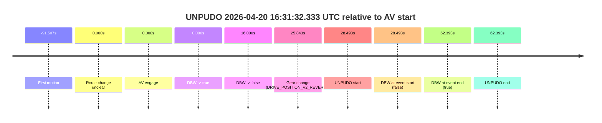
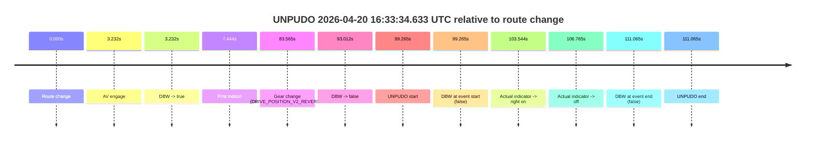
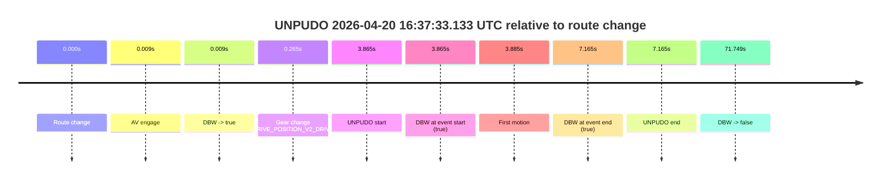
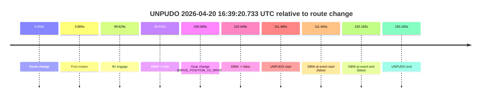

# Run Report: fme20014/2026-04-20--16-16-49--gen2-av-4ed3cd2d-b944-41bd-8b5f-25581cfab6ae

| Field | Value |
|---|---|
| Run ID | `fme20014/2026-04-20--16-16-49--gen2-av-4ed3cd2d-b944-41bd-8b5f-25581cfab6ae` |
| Date | `2026-04-20` |
| Model(s) | `eel-teal-outspoken` |
| Author | `zak` |
| Event count | `4` |

## unpudo 2026-04-20 16:31:32.333 UTC

| Field | Value |
|---|---|
| Model | `eel-teal-outspoken` |
| Author | `zak` |
| Run ID | `fme20014/2026-04-20--16-16-49--gen2-av-4ed3cd2d-b944-41bd-8b5f-25581cfab6ae` |
| Date | `2026-04-20` |
| Time (UTC) | `16:31:32.333` |
| Event type | `unpudo` |
| Disengagement type | `none observed` |
| Route change | `unclear` |
| Console | [run](https://console.sso.wayve.ai/run/fme20014/2026-04-20--16-16-49--gen2-av-4ed3cd2d-b944-41bd-8b5f-25581cfab6ae?id=&time-unixus=1776702692333299) |
| Foxglove | [segment](https://app.foxglove.dev/wayve-on-prem/p/prj_0dX18KZdVHg1fmmI/view?ds=foxglove-stream&ds.deviceName=fme20014&ds.start=2026-04-20T16%3A30%3A53.840024Z&ds.end=2026-04-20T16%3A32%3A16.233298Z&layoutId=lay_0e7VD4WIKDQGU73Y&time=2026-04-20T16%3A31%3A32.333299Z) |

### Event card: fail

- Fail: the credited unpudo does not stay AV-owned. The event window starts with DBW false, and the maneuver outcome lands outside a clean AV-owned segment.

| Event | Time (UTC) | Delta from AV start |
|---|---:|---:|
| First motion | 2026-04-20 16:29:32.333 | `-91.507s` |
| Route change unclear | 2026-04-20 16:31:03.840 | `0.000s` |
| AV engage | 2026-04-20 16:31:03.840 | `0.000s` |
| DBW -> true | 2026-04-20 16:31:03.840 | `0.000s` |
| DBW -> false | 2026-04-20 16:31:19.840 | `16.000s` |
| Gear change (DRIVE_POSITION_V2_REVERSE) | 2026-04-20 16:31:29.683 | `25.843s` |
| UNPUDO start | 2026-04-20 16:31:32.333 | `28.493s` |
| DBW at event start (false) | 2026-04-20 16:31:32.333 | `28.493s` |
| DBW at event end (true) | 2026-04-20 16:32:06.233 | `62.393s` |
| UNPUDO end | 2026-04-20 16:32:06.233 | `62.393s` |

| Metric | Value |
|---|---|
| Outcome | `fail` |
| Effective failure type | `completed_outside_av` |
| Route change status | `unclear` |
| DBW at event start | `false` |
| DBW at event end | `true` |
| Predicted gear at AV start | `DRIVE_POSITION_V2_DRIVE` |
| Actual gear at AV start | `DRIVE_POSITION_V2_DRIVE` |
| Predicted gear at event start | `DRIVE_POSITION_V2_REVERSE` |
| Actual gear at event start | `DRIVE_POSITION_V2_REVERSE` |
| Planned indicator direction | `INDICATORS_STATE_V2_OFF` |
| Controller indicator direction | `INDICATORS_STATE_V2_OFF` |
| Actual indicator direction | `INDICATORS_STATE_V2_OFF` |
| Actual indicator at maneuver end | `INDICATORS_STATE_V2_OFF` |
| Driver accel help in AV | `false` |
| Driver accel help timestamp | `n/a` |
| Max accel pedal pct in AV | `0.0%` |
| Max brake pedal pct in AV | `9.0%` |
| Max speed mps in AV | `5.361` |
| Success timing baseline | `AV start` |
| Route -> AV | `n/a` |
| AV -> event start | `28.493s` |
| AV -> first motion | `-91.507s` |
| Success baseline -> event start | `28.493s` |
| Success baseline -> first motion | `-91.507s` |
| AV duration before disengagement | `16.000s` |
| Trajectory waypoint count | `38` |
| Driving-plan step count | `11` |

The scored portion starts from the AV-owned window, not from the pre-AV setup. Route-change search in the stopped pre-event segment was `unclear`, with the baseline therefore set to AV start. At the event anchor the model predicts `DRIVE_POSITION_V2_REVERSE` and the actual gear is `DRIVE_POSITION_V2_REVERSE`. The effective model outcome is `fail` because `completed_outside_av.`

### Resolution

| Field | Value |
|---|---|
| Final outcome | `fail` |
| Do we agree with this label? | `yes` |
| Source disengagement type | `none observed` |
| Resolved effective failure type | `completed_outside_av` |
| Confidence | `medium` |

## unpudo 2026-04-20 16:33:34.633 UTC

| Field | Value |
|---|---|
| Model | `eel-teal-outspoken` |
| Author | `zak` |
| Run ID | `fme20014/2026-04-20--16-16-49--gen2-av-4ed3cd2d-b944-41bd-8b5f-25581cfab6ae` |
| Date | `2026-04-20` |
| Time (UTC) | `16:33:34.633` |
| Event type | `unpudo` |
| Disengagement type | `none observed` |
| Route change | `found` |
| Console | [run](https://console.sso.wayve.ai/run/fme20014/2026-04-20--16-16-49--gen2-av-4ed3cd2d-b944-41bd-8b5f-25581cfab6ae?id=&time-unixus=1776702814633318) |
| Foxglove | [segment](https://app.foxglove.dev/wayve-on-prem/p/prj_0dX18KZdVHg1fmmI/view?ds=foxglove-stream&ds.deviceName=fme20014&ds.start=2026-04-20T16%3A31%3A45.368240Z&ds.end=2026-04-20T16%3A33%3A56.433293Z&layoutId=lay_0e7VD4WIKDQGU73Y&time=2026-04-20T16%3A33%3A34.633318Z) |

### Event card: fail

- Fail: the credited unpudo does not stay AV-owned. The event window starts with DBW false, and the maneuver outcome lands outside a clean AV-owned segment.

| Event | Time (UTC) | Delta from route change |
|---|---:|---:|
| Route change | 2026-04-20 16:31:55.368 | `0.000s` |
| AV engage | 2026-04-20 16:31:58.600 | `3.232s` |
| DBW -> true | 2026-04-20 16:31:58.600 | `3.232s` |
| First motion | 2026-04-20 16:32:02.812 | `7.444s` |
| Gear change (DRIVE_POSITION_V2_REVERSE) | 2026-04-20 16:33:18.933 | `83.565s` |
| DBW -> false | 2026-04-20 16:33:28.380 | `93.012s` |
| UNPUDO start | 2026-04-20 16:33:34.633 | `99.265s` |
| DBW at event start (false) | 2026-04-20 16:33:34.633 | `99.265s` |
| Actual indicator -> right on | 2026-04-20 16:33:38.912 | `103.544s` |
| Actual indicator -> off | 2026-04-20 16:33:42.133 | `106.765s` |
| DBW at event end (false) | 2026-04-20 16:33:46.433 | `111.065s` |
| UNPUDO end | 2026-04-20 16:33:46.433 | `111.065s` |

| Metric | Value |
|---|---|
| Outcome | `fail` |
| Effective failure type | `not_av_owned` |
| Route change status | `found` |
| DBW at event start | `false` |
| DBW at event end | `false` |
| Predicted gear at AV start | `DRIVE_POSITION_V2_DRIVE` |
| Actual gear at AV start | `DRIVE_POSITION_V2_PARK` |
| Predicted gear at event start | `DRIVE_POSITION_V2_REVERSE` |
| Actual gear at event start | `DRIVE_POSITION_V2_REVERSE` |
| Planned indicator direction | `INDICATORS_STATE_V2_OFF` |
| Controller indicator direction | `INDICATORS_STATE_V2_OFF` |
| Actual indicator direction | `INDICATORS_STATE_V2_OFF` |
| Actual indicator at maneuver end | `INDICATORS_STATE_V2_OFF` |
| Driver accel help in AV | `false` |
| Driver accel help timestamp | `n/a` |
| Max accel pedal pct in AV | `0.0%` |
| Max brake pedal pct in AV | `12.8%` |
| Max speed mps in AV | `7.481` |
| Success timing baseline | `route change` |
| Route -> AV | `3.232s` |
| AV -> event start | `96.033s` |
| AV -> first motion | `4.212s` |
| Success baseline -> event start | `99.265s` |
| Success baseline -> first motion | `7.444s` |
| AV duration before disengagement | `89.781s` |
| Trajectory waypoint count | `38` |
| Driving-plan step count | `11` |

The scored portion starts from the AV-owned window, not from the pre-AV setup. Route-change search in the stopped pre-event segment was `found`, with the baseline therefore set to route change. At the event anchor the model predicts `DRIVE_POSITION_V2_REVERSE` and the actual gear is `DRIVE_POSITION_V2_REVERSE`. The effective model outcome is `fail` because `not_av_owned.`

### Resolution

| Field | Value |
|---|---|
| Final outcome | `fail` |
| Do we agree with this label? | `yes` |
| Source disengagement type | `none observed` |
| Resolved effective failure type | `not_av_owned` |
| Confidence | `high` |

## unpudo 2026-04-20 16:37:33.133 UTC

| Field | Value |
|---|---|
| Model | `eel-teal-outspoken` |
| Author | `zak` |
| Run ID | `fme20014/2026-04-20--16-16-49--gen2-av-4ed3cd2d-b944-41bd-8b5f-25581cfab6ae` |
| Date | `2026-04-20` |
| Time (UTC) | `16:37:33.133` |
| Event type | `unpudo` |
| Disengagement type | `none observed` |
| Route change | `found` |
| Console | [run](https://console.sso.wayve.ai/run/fme20014/2026-04-20--16-16-49--gen2-av-4ed3cd2d-b944-41bd-8b5f-25581cfab6ae?id=&time-unixus=1776703053133302) |
| Foxglove | [segment](https://app.foxglove.dev/wayve-on-prem/p/prj_0dX18KZdVHg1fmmI/view?ds=foxglove-stream&ds.deviceName=fme20014&ds.start=2026-04-20T16%3A37%3A19.268259Z&ds.end=2026-04-20T16%3A38%3A51.017183Z&layoutId=lay_0e7VD4WIKDQGU73Y&time=2026-04-20T16%3A37%3A33.133302Z) |

### Event card: pass

- Pass: AV owns the credited unpudo from route change through the official unpudo window, the gear state is aligned at the anchor, and the vehicle moves without driver accelerator help in AV.

| Event | Time (UTC) | Delta from route change |
|---|---:|---:|
| Route change | 2026-04-20 16:37:29.268 | `0.000s` |
| AV engage | 2026-04-20 16:37:29.277 | `0.009s` |
| DBW -> true | 2026-04-20 16:37:29.277 | `0.009s` |
| Gear change (DRIVE_POSITION_V2_DRIVE) | 2026-04-20 16:37:29.533 | `0.265s` |
| UNPUDO start | 2026-04-20 16:37:33.133 | `3.865s` |
| DBW at event start (true) | 2026-04-20 16:37:33.133 | `3.865s` |
| First motion | 2026-04-20 16:37:33.153 | `3.885s` |
| DBW at event end (true) | 2026-04-20 16:37:36.433 | `7.165s` |
| UNPUDO end | 2026-04-20 16:37:36.433 | `7.165s` |
| DBW -> false | 2026-04-20 16:38:41.017 | `71.749s` |

| Metric | Value |
|---|---|
| Outcome | `pass` |
| Effective failure type | `none` |
| Route change status | `found` |
| DBW at event start | `true` |
| DBW at event end | `true` |
| Predicted gear at AV start | `DRIVE_POSITION_V2_PARK` |
| Actual gear at AV start | `DRIVE_POSITION_V2_PARK` |
| Predicted gear at event start | `DRIVE_POSITION_V2_DRIVE` |
| Actual gear at event start | `DRIVE_POSITION_V2_DRIVE` |
| Planned indicator direction | `INDICATORS_STATE_V2_LEFT_ON` |
| Controller indicator direction | `INDICATORS_STATE_V2_LEFT_ON` |
| Actual indicator direction | `INDICATORS_STATE_V2_OFF` |
| Actual indicator at maneuver end | `INDICATORS_STATE_V2_OFF` |
| Driver accel help in AV | `false` |
| Driver accel help timestamp | `n/a` |
| Max accel pedal pct in AV | `0.0%` |
| Max brake pedal pct in AV | `8.0%` |
| Max speed mps in AV | `5.247` |
| Success timing baseline | `route change` |
| Route -> AV | `0.009s` |
| AV -> event start | `3.856s` |
| AV -> first motion | `3.876s` |
| Success baseline -> event start | `3.865s` |
| Success baseline -> first motion | `3.885s` |
| AV duration before disengagement | `71.740s` |
| Trajectory waypoint count | `37` |
| Driving-plan step count | `11` |

The scored portion starts from the AV-owned window, not from the pre-AV setup. Route-change search in the stopped pre-event segment was `found`, with the baseline therefore set to route change. At the event anchor the model predicts `DRIVE_POSITION_V2_DRIVE` and the actual gear is `DRIVE_POSITION_V2_DRIVE`. The effective model outcome is `pass` because `the credited unpudo stays AV-owned through the official unpudo window.`

### Resolution

| Field | Value |
|---|---|
| Final outcome | `pass` |
| Do we agree with this label? | `yes` |
| Source disengagement type | `none observed` |
| Resolved effective failure type | `none` |
| Confidence | `high` |

## unpudo 2026-04-20 16:39:20.733 UTC

| Field | Value |
|---|---|
| Model | `eel-teal-outspoken` |
| Author | `zak` |
| Run ID | `fme20014/2026-04-20--16-16-49--gen2-av-4ed3cd2d-b944-41bd-8b5f-25581cfab6ae` |
| Date | `2026-04-20` |
| Time (UTC) | `16:39:20.733` |
| Event type | `unpudo` |
| Disengagement type | `none observed` |
| Route change | `found` |
| Console | [run](https://console.sso.wayve.ai/run/fme20014/2026-04-20--16-16-49--gen2-av-4ed3cd2d-b944-41bd-8b5f-25581cfab6ae?id=&time-unixus=1776703160733293) |
| Foxglove | [segment](https://app.foxglove.dev/wayve-on-prem/p/prj_0dX18KZdVHg1fmmI/view?ds=foxglove-stream&ds.deviceName=fme20014&ds.start=2026-04-20T16%3A37%3A19.268259Z&ds.end=2026-04-20T16%3A40%3A09.433302Z&layoutId=lay_0e7VD4WIKDQGU73Y&time=2026-04-20T16%3A39%3A20.733293Z) |

### Event card: fail

- Fail: the credited unpudo does not stay AV-owned. The event window starts with DBW false, and the maneuver outcome lands outside a clean AV-owned segment.

| Event | Time (UTC) | Delta from route change |
|---|---:|---:|
| Route change | 2026-04-20 16:37:29.268 | `0.000s` |
| First motion | 2026-04-20 16:37:33.153 | `3.885s` |
| AV engage | 2026-04-20 16:39:08.897 | `99.629s` |
| DBW -> true | 2026-04-20 16:39:08.897 | `99.629s` |
| Gear change (DRIVE_POSITION_V2_DRIVE) | 2026-04-20 16:39:09.333 | `100.065s` |
| DBW -> false | 2026-04-20 16:39:19.717 | `110.449s` |
| UNPUDO start | 2026-04-20 16:39:20.733 | `111.465s` |
| DBW at event start (false) | 2026-04-20 16:39:20.733 | `111.465s` |
| DBW at event end (false) | 2026-04-20 16:39:59.433 | `150.165s` |
| UNPUDO end | 2026-04-20 16:39:59.433 | `150.165s` |

| Metric | Value |
|---|---|
| Outcome | `fail` |
| Effective failure type | `completed_outside_av` |
| Route change status | `found` |
| DBW at event start | `false` |
| DBW at event end | `false` |
| Predicted gear at AV start | `DRIVE_POSITION_V2_DRIVE` |
| Actual gear at AV start | `DRIVE_POSITION_V2_PARK` |
| Predicted gear at event start | `DRIVE_POSITION_V2_DRIVE` |
| Actual gear at event start | `DRIVE_POSITION_V2_DRIVE` |
| Planned indicator direction | `INDICATORS_STATE_V2_RIGHT_ON` |
| Controller indicator direction | `INDICATORS_STATE_V2_RIGHT_ON` |
| Actual indicator direction | `INDICATORS_STATE_V2_OFF` |
| Actual indicator at maneuver end | `INDICATORS_STATE_V2_OFF` |
| Driver accel help in AV | `false` |
| Driver accel help timestamp | `n/a` |
| Max accel pedal pct in AV | `0.0%` |
| Max brake pedal pct in AV | `8.0%` |
| Max speed mps in AV | `0.000` |
| Success timing baseline | `route change` |
| Route -> AV | `99.629s` |
| AV -> event start | `11.836s` |
| AV -> first motion | `-95.744s` |
| Success baseline -> event start | `111.465s` |
| Success baseline -> first motion | `3.885s` |
| AV duration before disengagement | `10.820s` |
| Trajectory waypoint count | `37` |
| Driving-plan step count | `11` |

The scored portion starts from the AV-owned window, not from the pre-AV setup. Route-change search in the stopped pre-event segment was `found`, with the baseline therefore set to route change. At the event anchor the model predicts `DRIVE_POSITION_V2_DRIVE` and the actual gear is `DRIVE_POSITION_V2_DRIVE`. The effective model outcome is `fail` because `completed_outside_av.`

### Resolution

| Field | Value |
|---|---|
| Final outcome | `fail` |
| Do we agree with this label? | `yes` |
| Source disengagement type | `none observed` |
| Resolved effective failure type | `completed_outside_av` |
| Confidence | `high` |
