# Run Report: fme20014/2026-04-21--07-08-10--gen2-av-46bdd422-a390-4198-add1-421dfc3071ab

| Field | Value |
|---|---|
| Run ID | `fme20014/2026-04-21--07-08-10--gen2-av-46bdd422-a390-4198-add1-421dfc3071ab` |
| Date | `2026-04-21` |
| Model(s) | `eel-teal-outspoken` |
| Author | `zak` |
| Event count | `17` |

## unpudo 2026-04-21 07:16:23.683 UTC

| Field | Value |
|---|---|
| Model | `eel-teal-outspoken` |
| Author | `zak` |
| Run ID | `fme20014/2026-04-21--07-08-10--gen2-av-46bdd422-a390-4198-add1-421dfc3071ab` |
| Date | `2026-04-21` |
| Time (UTC) | `07:16:23.683` |
| Event type | `unpudo` |
| Disengagement type | `none observed` |
| Route change | `found` |
| Console | [run](https://console.sso.wayve.ai/run/fme20014/2026-04-21--07-08-10--gen2-av-46bdd422-a390-4198-add1-421dfc3071ab?id=&time-unixus=1776755783683302) |
| Foxglove | [segment](https://app.foxglove.dev/wayve-on-prem/p/prj_0dX18KZdVHg1fmmI/view?ds=foxglove-stream&ds.deviceName=fme20014&ds.start=2026-04-21T07%3A14%3A37.068271Z&ds.end=2026-04-21T07%3A19%3A56.159439Z&layoutId=lay_0e7VD4WIKDQGU73Y&time=2026-04-21T07%3A16%3A23.683302Z) |

### Event card: pass

- Pass: AV owns the credited unpudo from route change through the official unpudo window, the gear state is aligned at the anchor, and the vehicle moves without driver accelerator help in AV.

| Event | Time (UTC) | Delta from route change |
|---|---:|---:|
| Route change | 2026-04-21 07:14:47.068 | `0.000s` |
| First motion | 2026-04-21 07:15:14.391 | `27.324s` |
| Actual indicator -> right on | 2026-04-21 07:15:51.511 | `64.443s` |
| Actual indicator -> off | 2026-04-21 07:15:57.572 | `70.504s` |
| AV engage | 2026-04-21 07:16:12.699 | `85.631s` |
| DBW -> true | 2026-04-21 07:16:12.699 | `85.631s` |
| Gear change (DRIVE_POSITION_V2_DRIVE) | 2026-04-21 07:16:17.083 | `90.015s` |
| Actual indicator -> left on | 2026-04-21 07:16:19.992 | `92.924s` |
| Actual indicator -> off | 2026-04-21 07:16:22.851 | `95.783s` |
| UNPUDO start | 2026-04-21 07:16:23.683 | `96.615s` |
| DBW at event start (true) | 2026-04-21 07:16:23.683 | `96.615s` |
| DBW at event end (true) | 2026-04-21 07:16:28.533 | `101.465s` |
| UNPUDO end | 2026-04-21 07:16:28.533 | `101.465s` |
| DBW -> false | 2026-04-21 07:19:46.159 | `299.091s` |
| Actual indicator -> left on | 2026-04-21 07:20:05.131 | `318.063s` |

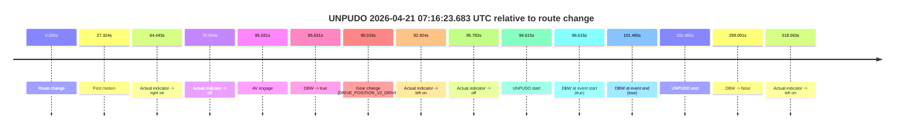

| Metric | Value |
|---|---|
| Outcome | `pass` |
| Effective failure type | `none` |
| Route change status | `found` |
| DBW at event start | `true` |
| DBW at event end | `true` |
| Predicted gear at AV start | `DRIVE_POSITION_V2_PARK` |
| Actual gear at AV start | `DRIVE_POSITION_V2_PARK` |
| Predicted gear at event start | `DRIVE_POSITION_V2_DRIVE` |
| Actual gear at event start | `DRIVE_POSITION_V2_DRIVE` |
| Planned indicator direction | `INDICATORS_STATE_V2_LEFT_ON` |
| Controller indicator direction | `INDICATORS_STATE_V2_LEFT_ON` |
| Actual indicator direction | `INDICATORS_STATE_V2_OFF` |
| Actual indicator at maneuver end | `INDICATORS_STATE_V2_OFF` |
| Driver accel help in AV | `false` |
| Driver accel help timestamp | `n/a` |
| Max accel pedal pct in AV | `0.0%` |
| Max brake pedal pct in AV | `8.0%` |
| Max speed mps in AV | `2.642` |
| Success timing baseline | `route change` |
| Route -> AV | `85.631s` |
| AV -> event start | `10.984s` |
| AV -> first motion | `-58.307s` |
| Success baseline -> event start | `96.615s` |
| Success baseline -> first motion | `27.324s` |
| AV duration before disengagement | `213.460s` |
| Trajectory waypoint count | `37` |
| Driving-plan step count | `11` |

The scored portion starts from the AV-owned window, not from the pre-AV setup. Route-change search in the stopped pre-event segment was `found`, with the baseline therefore set to route change. At the event anchor the model predicts `DRIVE_POSITION_V2_DRIVE` and the actual gear is `DRIVE_POSITION_V2_DRIVE`. The effective model outcome is `pass` because `the credited unpudo stays AV-owned through the official unpudo window.`

### Resolution

| Field | Value |
|---|---|
| Final outcome | `pass` |
| Do we agree with this label? | `yes` |
| Source disengagement type | `none observed` |
| Resolved effective failure type | `none` |
| Confidence | `high` |

## unpudo 2026-04-21 07:25:16.183 UTC

| Field | Value |
|---|---|
| Model | `eel-teal-outspoken` |
| Author | `zak` |
| Run ID | `fme20014/2026-04-21--07-08-10--gen2-av-46bdd422-a390-4198-add1-421dfc3071ab` |
| Date | `2026-04-21` |
| Time (UTC) | `07:25:16.183` |
| Event type | `unpudo` |
| Disengagement type | `none observed` |
| Route change | `found` |
| Console | [run](https://console.sso.wayve.ai/run/fme20014/2026-04-21--07-08-10--gen2-av-46bdd422-a390-4198-add1-421dfc3071ab?id=&time-unixus=1776756316183298) |
| Foxglove | [segment](https://app.foxglove.dev/wayve-on-prem/p/prj_0dX18KZdVHg1fmmI/view?ds=foxglove-stream&ds.deviceName=fme20014&ds.start=2026-04-21T07%3A25%3A02.168275Z&ds.end=2026-04-21T07%3A29%3A13.640326Z&layoutId=lay_0e7VD4WIKDQGU73Y&time=2026-04-21T07%3A25%3A16.183298Z) |

### Event card: pass

- Pass: AV owns the credited unpudo from route change through the official unpudo window, the gear state is aligned at the anchor, and the vehicle moves without driver accelerator help in AV.

| Event | Time (UTC) | Delta from route change |
|---|---:|---:|
| Route change | 2026-04-21 07:25:12.168 | `0.000s` |
| AV engage | 2026-04-21 07:25:12.169 | `0.001s` |
| DBW -> true | 2026-04-21 07:25:12.169 | `0.001s` |
| Gear change (DRIVE_POSITION_V2_DRIVE) | 2026-04-21 07:25:12.583 | `0.415s` |
| UNPUDO start | 2026-04-21 07:25:16.183 | `4.015s` |
| DBW at event start (true) | 2026-04-21 07:25:16.183 | `4.015s` |
| First motion | 2026-04-21 07:25:16.231 | `4.063s` |
| DBW at event end (true) | 2026-04-21 07:25:19.533 | `7.365s` |
| UNPUDO end | 2026-04-21 07:25:19.533 | `7.365s` |
| Actual indicator -> left on | 2026-04-21 07:27:25.071 | `132.903s` |
| Actual indicator -> off | 2026-04-21 07:27:27.191 | `135.023s` |
| Actual indicator -> right on | 2026-04-21 07:28:53.791 | `221.623s` |
| Actual indicator -> off | 2026-04-21 07:28:56.611 | `224.443s` |
| DBW -> false | 2026-04-21 07:29:03.640 | `231.472s` |

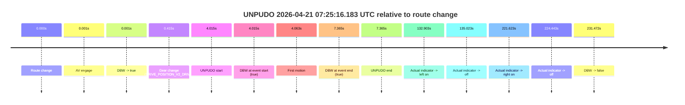

| Metric | Value |
|---|---|
| Outcome | `pass` |
| Effective failure type | `none` |
| Route change status | `found` |
| DBW at event start | `true` |
| DBW at event end | `true` |
| Predicted gear at AV start | `DRIVE_POSITION_V2_PARK` |
| Actual gear at AV start | `DRIVE_POSITION_V2_PARK` |
| Predicted gear at event start | `DRIVE_POSITION_V2_DRIVE` |
| Actual gear at event start | `DRIVE_POSITION_V2_DRIVE` |
| Planned indicator direction | `INDICATORS_STATE_V2_RIGHT_ON` |
| Controller indicator direction | `INDICATORS_STATE_V2_RIGHT_ON` |
| Actual indicator direction | `INDICATORS_STATE_V2_OFF` |
| Actual indicator at maneuver end | `INDICATORS_STATE_V2_OFF` |
| Driver accel help in AV | `false` |
| Driver accel help timestamp | `n/a` |
| Max accel pedal pct in AV | `0.0%` |
| Max brake pedal pct in AV | `9.0%` |
| Max speed mps in AV | `5.544` |
| Success timing baseline | `route change` |
| Route -> AV | `0.001s` |
| AV -> event start | `4.014s` |
| AV -> first motion | `4.062s` |
| Success baseline -> event start | `4.015s` |
| Success baseline -> first motion | `4.063s` |
| AV duration before disengagement | `231.471s` |
| Trajectory waypoint count | `37` |
| Driving-plan step count | `11` |

The scored portion starts from the AV-owned window, not from the pre-AV setup. Route-change search in the stopped pre-event segment was `found`, with the baseline therefore set to route change. At the event anchor the model predicts `DRIVE_POSITION_V2_DRIVE` and the actual gear is `DRIVE_POSITION_V2_DRIVE`. The effective model outcome is `pass` because `the credited unpudo stays AV-owned through the official unpudo window.`

### Resolution

| Field | Value |
|---|---|
| Final outcome | `pass` |
| Do we agree with this label? | `yes` |
| Source disengagement type | `none observed` |
| Resolved effective failure type | `none` |
| Confidence | `high` |

## unpudo 2026-04-21 07:27:47.433 UTC

| Field | Value |
|---|---|
| Model | `eel-teal-outspoken` |
| Author | `zak` |
| Run ID | `fme20014/2026-04-21--07-08-10--gen2-av-46bdd422-a390-4198-add1-421dfc3071ab` |
| Date | `2026-04-21` |
| Time (UTC) | `07:27:47.433` |
| Event type | `unpudo` |
| Disengagement type | `none observed` |
| Route change | `found` |
| Console | [run](https://console.sso.wayve.ai/run/fme20014/2026-04-21--07-08-10--gen2-av-46bdd422-a390-4198-add1-421dfc3071ab?id=&time-unixus=1776756467433286) |
| Foxglove | [segment](https://app.foxglove.dev/wayve-on-prem/p/prj_0dX18KZdVHg1fmmI/view?ds=foxglove-stream&ds.deviceName=fme20014&ds.start=2026-04-21T07%3A27%3A33.618371Z&ds.end=2026-04-21T07%3A29%3A13.640326Z&layoutId=lay_0e7VD4WIKDQGU73Y&time=2026-04-21T07%3A27%3A47.433286Z) |

### Event card: pass

- Pass: AV owns the credited unpudo from route change through the official unpudo window, the gear state is aligned at the anchor, and the vehicle moves without driver accelerator help in AV.

| Event | Time (UTC) | Delta from route change |
|---|---:|---:|
| Route change | 2026-04-21 07:27:43.618 | `0.000s` |
| AV engage | 2026-04-21 07:27:43.619 | `0.001s` |
| DBW -> true | 2026-04-21 07:27:43.619 | `0.001s` |
| Gear change (DRIVE_POSITION_V2_DRIVE) | 2026-04-21 07:27:43.883 | `0.265s` |
| UNPUDO start | 2026-04-21 07:27:47.433 | `3.815s` |
| DBW at event start (true) | 2026-04-21 07:27:47.433 | `3.815s` |
| First motion | 2026-04-21 07:27:47.491 | `3.873s` |
| DBW at event end (true) | 2026-04-21 07:27:50.883 | `7.265s` |
| UNPUDO end | 2026-04-21 07:27:50.883 | `7.265s` |
| Actual indicator -> right on | 2026-04-21 07:28:53.791 | `70.173s` |
| Actual indicator -> off | 2026-04-21 07:28:56.611 | `72.993s` |
| DBW -> false | 2026-04-21 07:29:03.640 | `80.022s` |

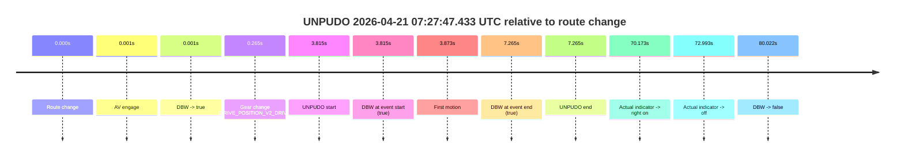

| Metric | Value |
|---|---|
| Outcome | `pass` |
| Effective failure type | `none` |
| Route change status | `found` |
| DBW at event start | `true` |
| DBW at event end | `true` |
| Predicted gear at AV start | `DRIVE_POSITION_V2_PARK` |
| Actual gear at AV start | `DRIVE_POSITION_V2_PARK` |
| Predicted gear at event start | `DRIVE_POSITION_V2_DRIVE` |
| Actual gear at event start | `DRIVE_POSITION_V2_DRIVE` |
| Planned indicator direction | `INDICATORS_STATE_V2_RIGHT_ON` |
| Controller indicator direction | `INDICATORS_STATE_V2_RIGHT_ON` |
| Actual indicator direction | `INDICATORS_STATE_V2_OFF` |
| Actual indicator at maneuver end | `INDICATORS_STATE_V2_OFF` |
| Driver accel help in AV | `false` |
| Driver accel help timestamp | `n/a` |
| Max accel pedal pct in AV | `0.0%` |
| Max brake pedal pct in AV | `10.7%` |
| Max speed mps in AV | `5.506` |
| Success timing baseline | `route change` |
| Route -> AV | `0.001s` |
| AV -> event start | `3.814s` |
| AV -> first motion | `3.872s` |
| Success baseline -> event start | `3.815s` |
| Success baseline -> first motion | `3.873s` |
| AV duration before disengagement | `80.021s` |
| Trajectory waypoint count | `38` |
| Driving-plan step count | `11` |

The scored portion starts from the AV-owned window, not from the pre-AV setup. Route-change search in the stopped pre-event segment was `found`, with the baseline therefore set to route change. At the event anchor the model predicts `DRIVE_POSITION_V2_DRIVE` and the actual gear is `DRIVE_POSITION_V2_DRIVE`. The effective model outcome is `pass` because `the credited unpudo stays AV-owned through the official unpudo window.`

### Resolution

| Field | Value |
|---|---|
| Final outcome | `pass` |
| Do we agree with this label? | `yes` |
| Source disengagement type | `none observed` |
| Resolved effective failure type | `none` |
| Confidence | `high` |

## unpudo 2026-04-21 07:40:34.733 UTC

| Field | Value |
|---|---|
| Model | `eel-teal-outspoken` |
| Author | `zak` |
| Run ID | `fme20014/2026-04-21--07-08-10--gen2-av-46bdd422-a390-4198-add1-421dfc3071ab` |
| Date | `2026-04-21` |
| Time (UTC) | `07:40:34.733` |
| Event type | `unpudo` |
| Disengagement type | `none observed` |
| Route change | `unclear` |
| Console | [run](https://console.sso.wayve.ai/run/fme20014/2026-04-21--07-08-10--gen2-av-46bdd422-a390-4198-add1-421dfc3071ab?id=&time-unixus=1776757234733309) |
| Foxglove | [segment](https://app.foxglove.dev/wayve-on-prem/p/prj_0dX18KZdVHg1fmmI/view?ds=foxglove-stream&ds.deviceName=fme20014&ds.start=2026-04-21T07%3A40%3A20.759191Z&ds.end=2026-04-21T07%3A44%3A06.179024Z&layoutId=lay_0e7VD4WIKDQGU73Y&time=2026-04-21T07%3A40%3A34.733309Z) |

### Event card: pass

- Pass: AV owns the credited unpudo from route change through the official unpudo window, the gear state is aligned at the anchor, and the vehicle moves without driver accelerator help in AV.

| Event | Time (UTC) | Delta from AV start |
|---|---:|---:|
| First motion | 2026-04-21 07:39:26.871 | `-63.888s` |
| Actual indicator already left on | 2026-04-21 07:40:24.751 | `-6.008s` |
| Route change unclear | 2026-04-21 07:40:30.759 | `0.000s` |
| AV engage | 2026-04-21 07:40:30.759 | `0.000s` |
| DBW -> true | 2026-04-21 07:40:30.759 | `0.000s` |
| Gear change (DRIVE_POSITION_V2_DRIVE) | 2026-04-21 07:40:31.183 | `0.424s` |
| Actual indicator -> off | 2026-04-21 07:40:33.611 | `2.853s` |
| UNPUDO start | 2026-04-21 07:40:34.733 | `3.974s` |
| DBW at event start (true) | 2026-04-21 07:40:34.733 | `3.974s` |
| DBW at event end (true) | 2026-04-21 07:40:38.133 | `7.374s` |
| UNPUDO end | 2026-04-21 07:40:38.133 | `7.374s` |
| DBW -> false | 2026-04-21 07:43:56.179 | `205.420s` |

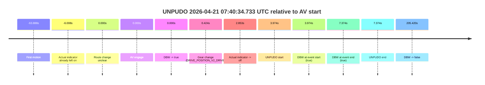

| Metric | Value |
|---|---|
| Outcome | `pass` |
| Effective failure type | `none` |
| Route change status | `unclear` |
| DBW at event start | `true` |
| DBW at event end | `true` |
| Predicted gear at AV start | `DRIVE_POSITION_V2_DRIVE` |
| Actual gear at AV start | `DRIVE_POSITION_V2_PARK` |
| Predicted gear at event start | `DRIVE_POSITION_V2_DRIVE` |
| Actual gear at event start | `DRIVE_POSITION_V2_DRIVE` |
| Planned indicator direction | `INDICATORS_STATE_V2_RIGHT_ON` |
| Controller indicator direction | `INDICATORS_STATE_V2_RIGHT_ON` |
| Actual indicator direction | `INDICATORS_STATE_V2_OFF` |
| Actual indicator at maneuver end | `INDICATORS_STATE_V2_OFF` |
| Driver accel help in AV | `false` |
| Driver accel help timestamp | `n/a` |
| Max accel pedal pct in AV | `0.0%` |
| Max brake pedal pct in AV | `8.0%` |
| Max speed mps in AV | `5.089` |
| Success timing baseline | `AV start` |
| Route -> AV | `n/a` |
| AV -> event start | `3.974s` |
| AV -> first motion | `-63.888s` |
| Success baseline -> event start | `3.974s` |
| Success baseline -> first motion | `-63.888s` |
| AV duration before disengagement | `205.420s` |
| Trajectory waypoint count | `38` |
| Driving-plan step count | `11` |

The scored portion starts from the AV-owned window, not from the pre-AV setup. Route-change search in the stopped pre-event segment was `unclear`, with the baseline therefore set to AV start. At the event anchor the model predicts `DRIVE_POSITION_V2_DRIVE` and the actual gear is `DRIVE_POSITION_V2_DRIVE`. The effective model outcome is `pass` because `the credited unpudo stays AV-owned through the official unpudo window.`

### Resolution

| Field | Value |
|---|---|
| Final outcome | `pass` |
| Do we agree with this label? | `yes` |
| Source disengagement type | `none observed` |
| Resolved effective failure type | `none` |
| Confidence | `medium` |

## unpudo 2026-04-21 08:00:36.033 UTC

| Field | Value |
|---|---|
| Model | `eel-teal-outspoken` |
| Author | `zak` |
| Run ID | `fme20014/2026-04-21--07-08-10--gen2-av-46bdd422-a390-4198-add1-421dfc3071ab` |
| Date | `2026-04-21` |
| Time (UTC) | `08:00:36.033` |
| Event type | `unpudo` |
| Disengagement type | `none observed` |
| Route change | `found` |
| Console | [run](https://console.sso.wayve.ai/run/fme20014/2026-04-21--07-08-10--gen2-av-46bdd422-a390-4198-add1-421dfc3071ab?id=&time-unixus=1776758436033292) |
| Foxglove | [segment](https://app.foxglove.dev/wayve-on-prem/p/prj_0dX18KZdVHg1fmmI/view?ds=foxglove-stream&ds.deviceName=fme20014&ds.start=2026-04-21T07%3A59%3A17.568279Z&ds.end=2026-04-21T08%3A01%3A08.533289Z&layoutId=lay_0e7VD4WIKDQGU73Y&time=2026-04-21T08%3A00%3A36.033292Z) |

### Event card: fail

- Fail: the credited unpudo does not stay AV-owned. The event window starts with DBW false, and the maneuver outcome lands outside a clean AV-owned segment.

| Event | Time (UTC) | Delta from route change |
|---|---:|---:|
| Route change | 2026-04-21 07:59:27.568 | `0.000s` |
| AV engage | 2026-04-21 07:59:27.569 | `0.001s` |
| DBW -> true | 2026-04-21 07:59:27.569 | `0.001s` |
| Actual indicator -> right on | 2026-04-21 07:59:35.531 | `7.963s` |
| First motion | 2026-04-21 08:00:05.811 | `38.243s` |
| Actual indicator -> off | 2026-04-21 08:00:16.031 | `48.463s` |
| DBW -> false | 2026-04-21 08:00:20.399 | `52.832s` |
| Gear change (DRIVE_POSITION_V2_REVERSE) | 2026-04-21 08:00:24.333 | `56.765s` |
| UNPUDO start | 2026-04-21 08:00:36.033 | `68.465s` |
| DBW at event start (false) | 2026-04-21 08:00:36.033 | `68.465s` |
| DBW at event end (false) | 2026-04-21 08:00:58.533 | `90.965s` |
| UNPUDO end | 2026-04-21 08:00:58.533 | `90.965s` |
| Actual indicator -> left on | 2026-04-21 08:01:02.191 | `94.624s` |
| Actual indicator -> off | 2026-04-21 08:01:05.571 | `98.003s` |

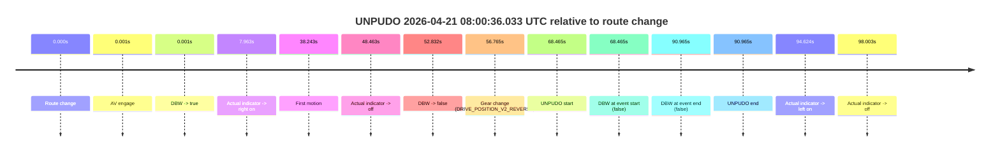

| Metric | Value |
|---|---|
| Outcome | `fail` |
| Effective failure type | `not_av_owned` |
| Route change status | `found` |
| DBW at event start | `false` |
| DBW at event end | `false` |
| Predicted gear at AV start | `DRIVE_POSITION_V2_DRIVE` |
| Actual gear at AV start | `DRIVE_POSITION_V2_DRIVE` |
| Predicted gear at event start | `DRIVE_POSITION_V2_REVERSE` |
| Actual gear at event start | `DRIVE_POSITION_V2_REVERSE` |
| Planned indicator direction | `INDICATORS_STATE_V2_OFF` |
| Controller indicator direction | `INDICATORS_STATE_V2_OFF` |
| Actual indicator direction | `INDICATORS_STATE_V2_OFF` |
| Actual indicator at maneuver end | `INDICATORS_STATE_V2_OFF` |
| Driver accel help in AV | `false` |
| Driver accel help timestamp | `n/a` |
| Max accel pedal pct in AV | `0.0%` |
| Max brake pedal pct in AV | `9.3%` |
| Max speed mps in AV | `2.258` |
| Success timing baseline | `route change` |
| Route -> AV | `0.001s` |
| AV -> event start | `68.464s` |
| AV -> first motion | `38.242s` |
| Success baseline -> event start | `68.465s` |
| Success baseline -> first motion | `38.243s` |
| AV duration before disengagement | `52.831s` |
| Trajectory waypoint count | `38` |
| Driving-plan step count | `11` |

The scored portion starts from the AV-owned window, not from the pre-AV setup. Route-change search in the stopped pre-event segment was `found`, with the baseline therefore set to route change. At the event anchor the model predicts `DRIVE_POSITION_V2_REVERSE` and the actual gear is `DRIVE_POSITION_V2_REVERSE`. The effective model outcome is `fail` because `not_av_owned.`

### Resolution

| Field | Value |
|---|---|
| Final outcome | `fail` |
| Do we agree with this label? | `yes` |
| Source disengagement type | `none observed` |
| Resolved effective failure type | `not_av_owned` |
| Confidence | `high` |

## unpudo 2026-04-21 08:18:34.833 UTC

| Field | Value |
|---|---|
| Model | `eel-teal-outspoken` |
| Author | `zak` |
| Run ID | `fme20014/2026-04-21--07-08-10--gen2-av-46bdd422-a390-4198-add1-421dfc3071ab` |
| Date | `2026-04-21` |
| Time (UTC) | `08:18:34.833` |
| Event type | `unpudo` |
| Disengagement type | `none observed` |
| Route change | `found` |
| Console | [run](https://console.sso.wayve.ai/run/fme20014/2026-04-21--07-08-10--gen2-av-46bdd422-a390-4198-add1-421dfc3071ab?id=&time-unixus=1776759514833305) |
| Foxglove | [segment](https://app.foxglove.dev/wayve-on-prem/p/prj_0dX18KZdVHg1fmmI/view?ds=foxglove-stream&ds.deviceName=fme20014&ds.start=2026-04-21T08%3A18%3A21.068268Z&ds.end=2026-04-21T08%3A22%3A37.959112Z&layoutId=lay_0e7VD4WIKDQGU73Y&time=2026-04-21T08%3A18%3A34.833305Z) |

### Event card: pass

- Pass: AV owns the credited unpudo from route change through the official unpudo window, the gear state is aligned at the anchor, and the vehicle moves without driver accelerator help in AV.

| Event | Time (UTC) | Delta from route change |
|---|---:|---:|
| Actual indicator already right on | 2026-04-21 08:18:21.071 | `-9.997s` |
| Actual indicator -> off | 2026-04-21 08:18:21.551 | `-9.517s` |
| Route change | 2026-04-21 08:18:31.068 | `0.000s` |
| AV engage | 2026-04-21 08:18:31.069 | `0.001s` |
| DBW -> true | 2026-04-21 08:18:31.069 | `0.001s` |
| Gear change (DRIVE_POSITION_V2_DRIVE) | 2026-04-21 08:18:31.283 | `0.215s` |
| UNPUDO start | 2026-04-21 08:18:34.833 | `3.765s` |
| DBW at event start (true) | 2026-04-21 08:18:34.833 | `3.765s` |
| First motion | 2026-04-21 08:18:34.871 | `3.803s` |
| DBW at event end (true) | 2026-04-21 08:18:38.133 | `7.065s` |
| UNPUDO end | 2026-04-21 08:18:38.133 | `7.065s` |
| DBW -> false | 2026-04-21 08:22:27.959 | `236.891s` |

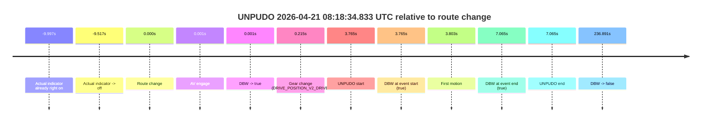

| Metric | Value |
|---|---|
| Outcome | `pass` |
| Effective failure type | `none` |
| Route change status | `found` |
| DBW at event start | `true` |
| DBW at event end | `true` |
| Predicted gear at AV start | `DRIVE_POSITION_V2_PARK` |
| Actual gear at AV start | `DRIVE_POSITION_V2_PARK` |
| Predicted gear at event start | `DRIVE_POSITION_V2_DRIVE` |
| Actual gear at event start | `DRIVE_POSITION_V2_DRIVE` |
| Planned indicator direction | `INDICATORS_STATE_V2_LEFT_ON` |
| Controller indicator direction | `INDICATORS_STATE_V2_LEFT_ON` |
| Actual indicator direction | `INDICATORS_STATE_V2_OFF` |
| Actual indicator at maneuver end | `INDICATORS_STATE_V2_OFF` |
| Driver accel help in AV | `false` |
| Driver accel help timestamp | `n/a` |
| Max accel pedal pct in AV | `0.0%` |
| Max brake pedal pct in AV | `8.0%` |
| Max speed mps in AV | `5.414` |
| Success timing baseline | `route change` |
| Route -> AV | `0.001s` |
| AV -> event start | `3.764s` |
| AV -> first motion | `3.802s` |
| Success baseline -> event start | `3.765s` |
| Success baseline -> first motion | `3.803s` |
| AV duration before disengagement | `236.890s` |
| Trajectory waypoint count | `38` |
| Driving-plan step count | `11` |

The scored portion starts from the AV-owned window, not from the pre-AV setup. Route-change search in the stopped pre-event segment was `found`, with the baseline therefore set to route change. At the event anchor the model predicts `DRIVE_POSITION_V2_DRIVE` and the actual gear is `DRIVE_POSITION_V2_DRIVE`. The effective model outcome is `pass` because `the credited unpudo stays AV-owned through the official unpudo window.`

### Resolution

| Field | Value |
|---|---|
| Final outcome | `pass` |
| Do we agree with this label? | `yes` |
| Source disengagement type | `none observed` |
| Resolved effective failure type | `none` |
| Confidence | `high` |

## unpudo 2026-04-21 08:22:28.633 UTC

| Field | Value |
|---|---|
| Model | `eel-teal-outspoken` |
| Author | `zak` |
| Run ID | `fme20014/2026-04-21--07-08-10--gen2-av-46bdd422-a390-4198-add1-421dfc3071ab` |
| Date | `2026-04-21` |
| Time (UTC) | `08:22:28.633` |
| Event type | `unpudo` |
| Disengagement type | `none observed` |
| Route change | `unclear` |
| Console | [run](https://console.sso.wayve.ai/run/fme20014/2026-04-21--07-08-10--gen2-av-46bdd422-a390-4198-add1-421dfc3071ab?id=&time-unixus=1776759748633318) |
| Foxglove | [segment](https://app.foxglove.dev/wayve-on-prem/p/prj_0dX18KZdVHg1fmmI/view?ds=foxglove-stream&ds.deviceName=fme20014&ds.start=2026-04-21T08%3A20%3A18.639051Z&ds.end=2026-04-21T08%3A22%3A42.983309Z&layoutId=lay_0e7VD4WIKDQGU73Y&time=2026-04-21T08%3A22%3A28.633318Z) |

### Event card: fail

- Fail: the credited unpudo does not stay AV-owned. The event window starts with DBW false, and the maneuver outcome lands outside a clean AV-owned segment.

| Event | Time (UTC) | Delta from AV start |
|---|---:|---:|
| Route change unclear | 2026-04-21 08:20:28.639 | `0.000s` |
| AV engage | 2026-04-21 08:20:28.639 | `0.000s` |
| DBW -> true | 2026-04-21 08:20:28.639 | `0.000s` |
| First motion | 2026-04-21 08:20:28.651 | `0.012s` |
| Gear change (DRIVE_POSITION_V2_DRIVE) | 2026-04-21 08:22:26.883 | `118.244s` |
| DBW -> false | 2026-04-21 08:22:27.959 | `119.320s` |
| UNPUDO start | 2026-04-21 08:22:28.633 | `119.994s` |
| DBW at event start (false) | 2026-04-21 08:22:28.633 | `119.994s` |
| DBW at event end (false) | 2026-04-21 08:22:32.983 | `124.344s` |
| UNPUDO end | 2026-04-21 08:22:32.983 | `124.344s` |
| Actual indicator -> right on | 2026-04-21 08:22:50.311 | `141.673s` |
| Actual indicator -> off | 2026-04-21 08:22:52.171 | `143.532s` |

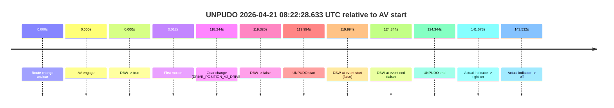

| Metric | Value |
|---|---|
| Outcome | `fail` |
| Effective failure type | `not_av_owned` |
| Route change status | `unclear` |
| DBW at event start | `false` |
| DBW at event end | `false` |
| Predicted gear at AV start | `DRIVE_POSITION_V2_DRIVE` |
| Actual gear at AV start | `DRIVE_POSITION_V2_DRIVE` |
| Predicted gear at event start | `DRIVE_POSITION_V2_DRIVE` |
| Actual gear at event start | `DRIVE_POSITION_V2_DRIVE` |
| Planned indicator direction | `INDICATORS_STATE_V2_OFF` |
| Controller indicator direction | `INDICATORS_STATE_V2_OFF` |
| Actual indicator direction | `INDICATORS_STATE_V2_OFF` |
| Actual indicator at maneuver end | `INDICATORS_STATE_V2_OFF` |
| Driver accel help in AV | `false` |
| Driver accel help timestamp | `n/a` |
| Max accel pedal pct in AV | `0.0%` |
| Max brake pedal pct in AV | `8.0%` |
| Max speed mps in AV | `7.528` |
| Success timing baseline | `AV start` |
| Route -> AV | `n/a` |
| AV -> event start | `119.994s` |
| AV -> first motion | `0.012s` |
| Success baseline -> event start | `119.994s` |
| Success baseline -> first motion | `0.012s` |
| AV duration before disengagement | `119.320s` |
| Trajectory waypoint count | `38` |
| Driving-plan step count | `11` |

The scored portion starts from the AV-owned window, not from the pre-AV setup. Route-change search in the stopped pre-event segment was `unclear`, with the baseline therefore set to AV start. At the event anchor the model predicts `DRIVE_POSITION_V2_DRIVE` and the actual gear is `DRIVE_POSITION_V2_DRIVE`. The effective model outcome is `fail` because `not_av_owned.`

### Resolution

| Field | Value |
|---|---|
| Final outcome | `fail` |
| Do we agree with this label? | `yes` |
| Source disengagement type | `none observed` |
| Resolved effective failure type | `not_av_owned` |
| Confidence | `medium` |

## unpudo 2026-04-21 08:31:47.183 UTC

| Field | Value |
|---|---|
| Model | `eel-teal-outspoken` |
| Author | `zak` |
| Run ID | `fme20014/2026-04-21--07-08-10--gen2-av-46bdd422-a390-4198-add1-421dfc3071ab` |
| Date | `2026-04-21` |
| Time (UTC) | `08:31:47.183` |
| Event type | `unpudo` |
| Disengagement type | `failed_to_slow` |
| Route change | `unclear` |
| Console | [run](https://console.sso.wayve.ai/run/fme20014/2026-04-21--07-08-10--gen2-av-46bdd422-a390-4198-add1-421dfc3071ab?id=&time-unixus=1776760307183302) |
| Foxglove | [segment](https://app.foxglove.dev/wayve-on-prem/p/prj_0dX18KZdVHg1fmmI/view?ds=foxglove-stream&ds.deviceName=fme20014&ds.start=2026-04-21T08%3A29%3A37.190122Z&ds.end=2026-04-21T08%3A32%3A49.733302Z&layoutId=lay_0e7VD4WIKDQGU73Y&time=2026-04-21T08%3A31%3A47.183302Z) |

### Event card: fail

- Fail: AV owns part of the segment, but the event still resolves as a model-performance failure under the AV-only scoring rule.

| Event | Time (UTC) | Delta from AV start |
|---|---:|---:|
| Route change unclear | 2026-04-21 08:29:47.190 | `0.000s` |
| AV engage | 2026-04-21 08:29:47.190 | `0.000s` |
| DBW -> true | 2026-04-21 08:29:47.190 | `0.000s` |
| First motion | 2026-04-21 08:29:47.191 | `0.001s` |
| DBW -> false | 2026-04-21 08:31:39.499 | `112.309s` |
| Gear change (DRIVE_POSITION_V2_REVERSE) | 2026-04-21 08:31:44.433 | `117.243s` |
| UNPUDO start | 2026-04-21 08:31:47.183 | `119.993s` |
| DBW at event start (false) | 2026-04-21 08:31:47.183 | `119.993s` |
| Actual indicator -> right on | 2026-04-21 08:32:18.111 | `150.921s` |
| DBW at event end (true) | 2026-04-21 08:32:39.733 | `172.543s` |
| UNPUDO end | 2026-04-21 08:32:39.733 | `172.543s` |
| Actual indicator -> off | 2026-04-21 08:32:41.911 | `174.721s` |

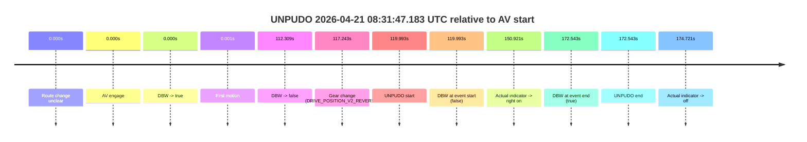

| Metric | Value |
|---|---|
| Outcome | `fail` |
| Effective failure type | `failed_to_slow` |
| Route change status | `unclear` |
| DBW at event start | `false` |
| DBW at event end | `true` |
| Predicted gear at AV start | `DRIVE_POSITION_V2_DRIVE` |
| Actual gear at AV start | `DRIVE_POSITION_V2_DRIVE` |
| Predicted gear at event start | `DRIVE_POSITION_V2_REVERSE` |
| Actual gear at event start | `DRIVE_POSITION_V2_REVERSE` |
| Planned indicator direction | `INDICATORS_STATE_V2_OFF` |
| Controller indicator direction | `INDICATORS_STATE_V2_OFF` |
| Actual indicator direction | `INDICATORS_STATE_V2_OFF` |
| Actual indicator at maneuver end | `INDICATORS_STATE_V2_RIGHT_ON` |
| Driver accel help in AV | `false` |
| Driver accel help timestamp | `n/a` |
| Max accel pedal pct in AV | `0.0%` |
| Max brake pedal pct in AV | `14.4%` |
| Max speed mps in AV | `6.728` |
| Success timing baseline | `AV start` |
| Route -> AV | `n/a` |
| AV -> event start | `119.993s` |
| AV -> first motion | `0.001s` |
| Success baseline -> event start | `119.993s` |
| Success baseline -> first motion | `0.001s` |
| AV duration before disengagement | `112.309s` |
| Trajectory waypoint count | `37` |
| Driving-plan step count | `11` |

The scored portion starts from the AV-owned window, not from the pre-AV setup. Route-change search in the stopped pre-event segment was `unclear`, with the baseline therefore set to AV start. At the event anchor the model predicts `DRIVE_POSITION_V2_REVERSE` and the actual gear is `DRIVE_POSITION_V2_REVERSE`. The effective model outcome is `fail` because `failed_to_slow.`

### Resolution

| Field | Value |
|---|---|
| Final outcome | `fail` |
| Do we agree with this label? | `yes` |
| Source disengagement type | `failed_to_slow` |
| Resolved effective failure type | `failed_to_slow` |
| Confidence | `medium` |

## unpudo 2026-04-21 08:50:36.233 UTC

| Field | Value |
|---|---|
| Model | `eel-teal-outspoken` |
| Author | `zak` |
| Run ID | `fme20014/2026-04-21--07-08-10--gen2-av-46bdd422-a390-4198-add1-421dfc3071ab` |
| Date | `2026-04-21` |
| Time (UTC) | `08:50:36.233` |
| Event type | `unpudo` |
| Disengagement type | `none observed` |
| Route change | `found` |
| Console | [run](https://console.sso.wayve.ai/run/fme20014/2026-04-21--07-08-10--gen2-av-46bdd422-a390-4198-add1-421dfc3071ab?id=&time-unixus=1776761436233303) |
| Foxglove | [segment](https://app.foxglove.dev/wayve-on-prem/p/prj_0dX18KZdVHg1fmmI/view?ds=foxglove-stream&ds.deviceName=fme20014&ds.start=2026-04-21T08%3A50%3A12.718323Z&ds.end=2026-04-21T08%3A55%3A21.180240Z&layoutId=lay_0e7VD4WIKDQGU73Y&time=2026-04-21T08%3A50%3A36.233303Z) |

### Event card: pass

- Pass: AV owns the credited unpudo from route change through the official unpudo window, the gear state is aligned at the anchor, and the vehicle moves without driver accelerator help in AV.

| Event | Time (UTC) | Delta from route change |
|---|---:|---:|
| Route change | 2026-04-21 08:50:22.718 | `0.000s` |
| AV engage | 2026-04-21 08:50:22.719 | `0.001s` |
| DBW -> true | 2026-04-21 08:50:22.719 | `0.001s` |
| Gear change (DRIVE_POSITION_V2_DRIVE) | 2026-04-21 08:50:22.983 | `0.265s` |
| UNPUDO start | 2026-04-21 08:50:36.233 | `13.515s` |
| DBW at event start (true) | 2026-04-21 08:50:36.233 | `13.515s` |
| First motion | 2026-04-21 08:50:36.271 | `13.553s` |
| DBW at event end (true) | 2026-04-21 08:50:39.733 | `17.015s` |
| UNPUDO end | 2026-04-21 08:50:39.733 | `17.015s` |
| DBW -> false | 2026-04-21 08:55:11.180 | `288.462s` |
| Actual indicator -> left on | 2026-04-21 08:55:12.631 | `289.913s` |
| Actual indicator -> off | 2026-04-21 08:55:16.211 | `293.493s` |
| Actual indicator -> left on | 2026-04-21 08:55:17.711 | `294.993s` |
| Actual indicator -> off | 2026-04-21 08:55:18.531 | `295.813s` |

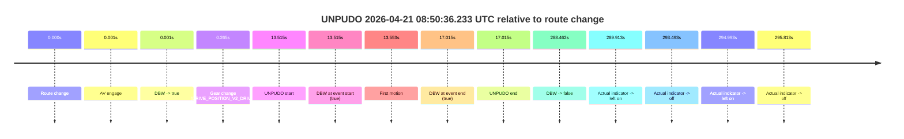

| Metric | Value |
|---|---|
| Outcome | `pass` |
| Effective failure type | `none` |
| Route change status | `found` |
| DBW at event start | `true` |
| DBW at event end | `true` |
| Predicted gear at AV start | `DRIVE_POSITION_V2_PARK` |
| Actual gear at AV start | `DRIVE_POSITION_V2_PARK` |
| Predicted gear at event start | `DRIVE_POSITION_V2_DRIVE` |
| Actual gear at event start | `DRIVE_POSITION_V2_DRIVE` |
| Planned indicator direction | `INDICATORS_STATE_V2_OFF` |
| Controller indicator direction | `INDICATORS_STATE_V2_OFF` |
| Actual indicator direction | `INDICATORS_STATE_V2_OFF` |
| Actual indicator at maneuver end | `INDICATORS_STATE_V2_OFF` |
| Driver accel help in AV | `false` |
| Driver accel help timestamp | `n/a` |
| Max accel pedal pct in AV | `0.0%` |
| Max brake pedal pct in AV | `8.0%` |
| Max speed mps in AV | `4.239` |
| Success timing baseline | `route change` |
| Route -> AV | `0.001s` |
| AV -> event start | `13.514s` |
| AV -> first motion | `13.552s` |
| Success baseline -> event start | `13.515s` |
| Success baseline -> first motion | `13.553s` |
| AV duration before disengagement | `288.461s` |
| Trajectory waypoint count | `38` |
| Driving-plan step count | `11` |

The scored portion starts from the AV-owned window, not from the pre-AV setup. Route-change search in the stopped pre-event segment was `found`, with the baseline therefore set to route change. At the event anchor the model predicts `DRIVE_POSITION_V2_DRIVE` and the actual gear is `DRIVE_POSITION_V2_DRIVE`. The effective model outcome is `pass` because `the credited unpudo stays AV-owned through the official unpudo window.`

### Resolution

| Field | Value |
|---|---|
| Final outcome | `pass` |
| Do we agree with this label? | `yes` |
| Source disengagement type | `none observed` |
| Resolved effective failure type | `none` |
| Confidence | `high` |

## unpudo 2026-04-21 08:54:39.783 UTC

| Field | Value |
|---|---|
| Model | `eel-teal-outspoken` |
| Author | `zak` |
| Run ID | `fme20014/2026-04-21--07-08-10--gen2-av-46bdd422-a390-4198-add1-421dfc3071ab` |
| Date | `2026-04-21` |
| Time (UTC) | `08:54:39.783` |
| Event type | `unpudo` |
| Disengagement type | `none observed` |
| Route change | `found` |
| Console | [run](https://console.sso.wayve.ai/run/fme20014/2026-04-21--07-08-10--gen2-av-46bdd422-a390-4198-add1-421dfc3071ab?id=&time-unixus=1776761679783314) |
| Foxglove | [segment](https://app.foxglove.dev/wayve-on-prem/p/prj_0dX18KZdVHg1fmmI/view?ds=foxglove-stream&ds.deviceName=fme20014&ds.start=2026-04-21T08%3A54%3A25.918243Z&ds.end=2026-04-21T08%3A55%3A21.180240Z&layoutId=lay_0e7VD4WIKDQGU73Y&time=2026-04-21T08%3A54%3A39.783314Z) |

### Event card: pass

- Pass: AV owns the credited unpudo from route change through the official unpudo window, the gear state is aligned at the anchor, and the vehicle moves without driver accelerator help in AV.

| Event | Time (UTC) | Delta from route change |
|---|---:|---:|
| Route change | 2026-04-21 08:54:35.918 | `0.000s` |
| AV engage | 2026-04-21 08:54:35.919 | `0.001s` |
| DBW -> true | 2026-04-21 08:54:35.919 | `0.001s` |
| Gear change (DRIVE_POSITION_V2_DRIVE) | 2026-04-21 08:54:36.233 | `0.315s` |
| UNPUDO start | 2026-04-21 08:54:39.783 | `3.865s` |
| DBW at event start (true) | 2026-04-21 08:54:39.783 | `3.865s` |
| First motion | 2026-04-21 08:54:39.811 | `3.893s` |
| DBW at event end (true) | 2026-04-21 08:54:43.083 | `7.165s` |
| UNPUDO end | 2026-04-21 08:54:43.083 | `7.165s` |
| DBW -> false | 2026-04-21 08:55:11.180 | `35.262s` |
| Actual indicator -> left on | 2026-04-21 08:55:12.631 | `36.713s` |
| Actual indicator -> off | 2026-04-21 08:55:16.211 | `40.293s` |
| Actual indicator -> left on | 2026-04-21 08:55:17.711 | `41.793s` |
| Actual indicator -> off | 2026-04-21 08:55:18.531 | `42.613s` |

| Metric | Value |
|---|---|
| Outcome | `pass` |
| Effective failure type | `none` |
| Route change status | `found` |
| DBW at event start | `true` |
| DBW at event end | `true` |
| Predicted gear at AV start | `DRIVE_POSITION_V2_PARK` |
| Actual gear at AV start | `DRIVE_POSITION_V2_PARK` |
| Predicted gear at event start | `DRIVE_POSITION_V2_DRIVE` |
| Actual gear at event start | `DRIVE_POSITION_V2_DRIVE` |
| Planned indicator direction | `INDICATORS_STATE_V2_OFF` |
| Controller indicator direction | `INDICATORS_STATE_V2_OFF` |
| Actual indicator direction | `INDICATORS_STATE_V2_OFF` |
| Actual indicator at maneuver end | `INDICATORS_STATE_V2_OFF` |
| Driver accel help in AV | `false` |
| Driver accel help timestamp | `n/a` |
| Max accel pedal pct in AV | `0.0%` |
| Max brake pedal pct in AV | `8.2%` |
| Max speed mps in AV | `5.442` |
| Success timing baseline | `route change` |
| Route -> AV | `0.001s` |
| AV -> event start | `3.864s` |
| AV -> first motion | `3.892s` |
| Success baseline -> event start | `3.865s` |
| Success baseline -> first motion | `3.893s` |
| AV duration before disengagement | `35.261s` |
| Trajectory waypoint count | `37` |
| Driving-plan step count | `11` |

The scored portion starts from the AV-owned window, not from the pre-AV setup. Route-change search in the stopped pre-event segment was `found`, with the baseline therefore set to route change. At the event anchor the model predicts `DRIVE_POSITION_V2_DRIVE` and the actual gear is `DRIVE_POSITION_V2_DRIVE`. The effective model outcome is `pass` because `the credited unpudo stays AV-owned through the official unpudo window.`

### Resolution

| Field | Value |
|---|---|
| Final outcome | `pass` |
| Do we agree with this label? | `yes` |
| Source disengagement type | `none observed` |
| Resolved effective failure type | `none` |
| Confidence | `high` |

## unpudo 2026-04-21 08:55:33.633 UTC

| Field | Value |
|---|---|
| Model | `eel-teal-outspoken` |
| Author | `zak` |
| Run ID | `fme20014/2026-04-21--07-08-10--gen2-av-46bdd422-a390-4198-add1-421dfc3071ab` |
| Date | `2026-04-21` |
| Time (UTC) | `08:55:33.633` |
| Event type | `unpudo` |
| Disengagement type | `none observed` |
| Route change | `found` |
| Console | [run](https://console.sso.wayve.ai/run/fme20014/2026-04-21--07-08-10--gen2-av-46bdd422-a390-4198-add1-421dfc3071ab?id=&time-unixus=1776761733633314) |
| Foxglove | [segment](https://app.foxglove.dev/wayve-on-prem/p/prj_0dX18KZdVHg1fmmI/view?ds=foxglove-stream&ds.deviceName=fme20014&ds.start=2026-04-21T08%3A54%3A25.918243Z&ds.end=2026-04-21T08%3A55%3A47.033301Z&layoutId=lay_0e7VD4WIKDQGU73Y&time=2026-04-21T08%3A55%3A33.633314Z) |

### Event card: fail

- Fail: the credited unpudo does not stay AV-owned. The event window starts with DBW false, and the maneuver outcome lands outside a clean AV-owned segment.

| Event | Time (UTC) | Delta from route change |
|---|---:|---:|
| Route change | 2026-04-21 08:54:35.918 | `0.000s` |
| First motion | 2026-04-21 08:54:39.811 | `3.893s` |
| Actual indicator -> left on | 2026-04-21 08:55:12.631 | `36.713s` |
| Actual indicator -> off | 2026-04-21 08:55:16.211 | `40.293s` |
| Actual indicator -> left on | 2026-04-21 08:55:17.711 | `41.793s` |
| Actual indicator -> off | 2026-04-21 08:55:18.531 | `42.613s` |
| AV engage | 2026-04-21 08:55:25.659 | `49.741s` |
| DBW -> true | 2026-04-21 08:55:25.659 | `49.741s` |
| Gear change (DRIVE_POSITION_V2_DRIVE) | 2026-04-21 08:55:30.133 | `54.215s` |
| DBW -> false | 2026-04-21 08:55:33.099 | `57.181s` |
| UNPUDO start | 2026-04-21 08:55:33.633 | `57.715s` |
| DBW at event start (false) | 2026-04-21 08:55:33.633 | `57.715s` |
| Actual indicator -> right on | 2026-04-21 08:55:35.271 | `59.353s` |
| DBW at event end (false) | 2026-04-21 08:55:37.033 | `61.115s` |
| UNPUDO end | 2026-04-21 08:55:37.033 | `61.115s` |
| Actual indicator -> off | 2026-04-21 08:55:44.211 | `68.293s` |

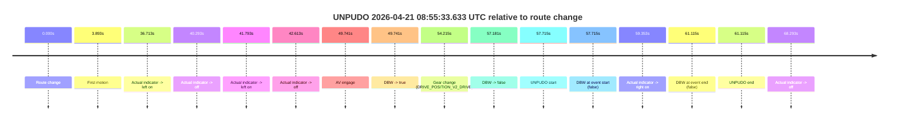

| Metric | Value |
|---|---|
| Outcome | `fail` |
| Effective failure type | `completed_outside_av` |
| Route change status | `found` |
| DBW at event start | `false` |
| DBW at event end | `false` |
| Predicted gear at AV start | `DRIVE_POSITION_V2_DRIVE` |
| Actual gear at AV start | `DRIVE_POSITION_V2_DRIVE` |
| Predicted gear at event start | `DRIVE_POSITION_V2_DRIVE` |
| Actual gear at event start | `DRIVE_POSITION_V2_DRIVE` |
| Planned indicator direction | `INDICATORS_STATE_V2_RIGHT_ON` |
| Controller indicator direction | `INDICATORS_STATE_V2_RIGHT_ON` |
| Actual indicator direction | `INDICATORS_STATE_V2_OFF` |
| Actual indicator at maneuver end | `INDICATORS_STATE_V2_RIGHT_ON` |
| Driver accel help in AV | `false` |
| Driver accel help timestamp | `n/a` |
| Max accel pedal pct in AV | `0.0%` |
| Max brake pedal pct in AV | `8.0%` |
| Max speed mps in AV | `0.000` |
| Success timing baseline | `route change` |
| Route -> AV | `49.741s` |
| AV -> event start | `7.974s` |
| AV -> first motion | `-45.848s` |
| Success baseline -> event start | `57.715s` |
| Success baseline -> first motion | `3.893s` |
| AV duration before disengagement | `7.440s` |
| Trajectory waypoint count | `38` |
| Driving-plan step count | `11` |

The scored portion starts from the AV-owned window, not from the pre-AV setup. Route-change search in the stopped pre-event segment was `found`, with the baseline therefore set to route change. At the event anchor the model predicts `DRIVE_POSITION_V2_DRIVE` and the actual gear is `DRIVE_POSITION_V2_DRIVE`. The effective model outcome is `fail` because `completed_outside_av.`

### Resolution

| Field | Value |
|---|---|
| Final outcome | `fail` |
| Do we agree with this label? | `yes` |
| Source disengagement type | `none observed` |
| Resolved effective failure type | `completed_outside_av` |
| Confidence | `high` |

## unpudo 2026-04-21 09:02:48.233 UTC

| Field | Value |
|---|---|
| Model | `eel-teal-outspoken` |
| Author | `zak` |
| Run ID | `fme20014/2026-04-21--07-08-10--gen2-av-46bdd422-a390-4198-add1-421dfc3071ab` |
| Date | `2026-04-21` |
| Time (UTC) | `09:02:48.233` |
| Event type | `unpudo` |
| Disengagement type | `none observed` |
| Route change | `found` |
| Console | [run](https://console.sso.wayve.ai/run/fme20014/2026-04-21--07-08-10--gen2-av-46bdd422-a390-4198-add1-421dfc3071ab?id=&time-unixus=1776762168233295) |
| Foxglove | [segment](https://app.foxglove.dev/wayve-on-prem/p/prj_0dX18KZdVHg1fmmI/view?ds=foxglove-stream&ds.deviceName=fme20014&ds.start=2026-04-21T09%3A02%3A31.818265Z&ds.end=2026-04-21T09%3A03%3A05.883301Z&layoutId=lay_0e7VD4WIKDQGU73Y&time=2026-04-21T09%3A02%3A48.233295Z) |

### Event card: fail

- Fail: this is a short AV stint rather than a durable model-owned maneuver. The vehicle never settles into a long enough AV-owned attempt to credit the model.

| Event | Time (UTC) | Delta from route change |
|---|---:|---:|
| Actual indicator already left on | 2026-04-21 09:02:31.831 | `-9.987s` |
| Route change | 2026-04-21 09:02:41.818 | `0.000s` |
| AV engage | 2026-04-21 09:02:41.819 | `0.001s` |
| DBW -> true | 2026-04-21 09:02:41.819 | `0.001s` |
| Actual indicator -> off | 2026-04-21 09:02:41.951 | `0.133s` |
| Gear change (DRIVE_POSITION_V2_DRIVE) | 2026-04-21 09:02:42.133 | `0.315s` |
| UNPUDO start | 2026-04-21 09:02:48.233 | `6.415s` |
| DBW at event start (true) | 2026-04-21 09:02:48.233 | `6.415s` |
| First motion | 2026-04-21 09:02:48.291 | `6.473s` |
| DBW -> false | 2026-04-21 09:02:48.760 | `6.942s` |
| DBW at event end (true) | 2026-04-21 09:02:55.883 | `14.065s` |
| UNPUDO end | 2026-04-21 09:02:55.883 | `14.065s` |

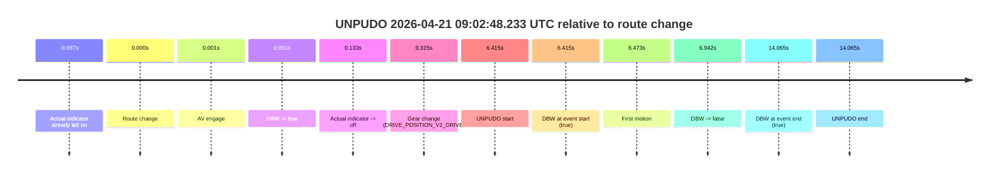

| Metric | Value |
|---|---|
| Outcome | `fail` |
| Effective failure type | `interrupted_handover` |
| Route change status | `found` |
| DBW at event start | `true` |
| DBW at event end | `true` |
| Predicted gear at AV start | `DRIVE_POSITION_V2_PARK` |
| Actual gear at AV start | `DRIVE_POSITION_V2_PARK` |
| Predicted gear at event start | `DRIVE_POSITION_V2_DRIVE` |
| Actual gear at event start | `DRIVE_POSITION_V2_DRIVE` |
| Planned indicator direction | `INDICATORS_STATE_V2_RIGHT_ON` |
| Controller indicator direction | `INDICATORS_STATE_V2_RIGHT_ON` |
| Actual indicator direction | `INDICATORS_STATE_V2_OFF` |
| Actual indicator at maneuver end | `INDICATORS_STATE_V2_OFF` |
| Driver accel help in AV | `false` |
| Driver accel help timestamp | `n/a` |
| Max accel pedal pct in AV | `0.0%` |
| Max brake pedal pct in AV | `8.0%` |
| Max speed mps in AV | `1.117` |
| Success timing baseline | `route change` |
| Route -> AV | `0.001s` |
| AV -> event start | `6.414s` |
| AV -> first motion | `6.472s` |
| Success baseline -> event start | `6.415s` |
| Success baseline -> first motion | `6.473s` |
| AV duration before disengagement | `6.941s` |
| Trajectory waypoint count | `38` |
| Driving-plan step count | `11` |

The scored portion starts from the AV-owned window, not from the pre-AV setup. Route-change search in the stopped pre-event segment was `found`, with the baseline therefore set to route change. At the event anchor the model predicts `DRIVE_POSITION_V2_DRIVE` and the actual gear is `DRIVE_POSITION_V2_DRIVE`. The effective model outcome is `fail` because `interrupted_handover.`

### Resolution

| Field | Value |
|---|---|
| Final outcome | `fail` |
| Do we agree with this label? | `yes` |
| Source disengagement type | `none observed` |
| Resolved effective failure type | `interrupted_handover` |
| Confidence | `high` |

## unpudo 2026-04-21 09:04:12.483 UTC

| Field | Value |
|---|---|
| Model | `eel-teal-outspoken` |
| Author | `zak` |
| Run ID | `fme20014/2026-04-21--07-08-10--gen2-av-46bdd422-a390-4198-add1-421dfc3071ab` |
| Date | `2026-04-21` |
| Time (UTC) | `09:04:12.483` |
| Event type | `unpudo` |
| Disengagement type | `none observed` |
| Route change | `found` |
| Console | [run](https://console.sso.wayve.ai/run/fme20014/2026-04-21--07-08-10--gen2-av-46bdd422-a390-4198-add1-421dfc3071ab?id=&time-unixus=1776762252483311) |
| Foxglove | [segment](https://app.foxglove.dev/wayve-on-prem/p/prj_0dX18KZdVHg1fmmI/view?ds=foxglove-stream&ds.deviceName=fme20014&ds.start=2026-04-21T09%3A02%3A31.818265Z&ds.end=2026-04-21T09%3A09%3A25.519049Z&layoutId=lay_0e7VD4WIKDQGU73Y&time=2026-04-21T09%3A04%3A12.483311Z) |

### Event card: pass

- Pass: AV owns the credited unpudo from route change through the official unpudo window, the gear state is aligned at the anchor, and the vehicle moves without driver accelerator help in AV.

| Event | Time (UTC) | Delta from route change |
|---|---:|---:|
| Actual indicator already left on | 2026-04-21 09:02:31.831 | `-9.987s` |
| Route change | 2026-04-21 09:02:41.818 | `0.000s` |
| Actual indicator -> off | 2026-04-21 09:02:41.951 | `0.133s` |
| First motion | 2026-04-21 09:02:48.291 | `6.473s` |
| AV engage | 2026-04-21 09:02:55.880 | `14.062s` |
| DBW -> true | 2026-04-21 09:02:55.880 | `14.062s` |
| Gear change (DRIVE_POSITION_V2_DRIVE) | 2026-04-21 09:04:08.933 | `87.115s` |
| UNPUDO start | 2026-04-21 09:04:12.483 | `90.665s` |
| DBW at event start (true) | 2026-04-21 09:04:12.483 | `90.665s` |
| DBW at event end (true) | 2026-04-21 09:04:15.783 | `93.965s` |
| UNPUDO end | 2026-04-21 09:04:15.783 | `93.965s` |
| Actual indicator -> left on | 2026-04-21 09:05:06.531 | `144.713s` |
| Actual indicator -> off | 2026-04-21 09:05:09.231 | `147.413s` |
| Actual indicator -> left on | 2026-04-21 09:08:34.691 | `352.873s` |
| Actual indicator -> off | 2026-04-21 09:08:39.171 | `357.354s` |
| DBW -> false | 2026-04-21 09:09:15.519 | `393.701s` |

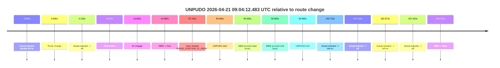

| Metric | Value |
|---|---|
| Outcome | `pass` |
| Effective failure type | `none` |
| Route change status | `found` |
| DBW at event start | `true` |
| DBW at event end | `true` |
| Predicted gear at AV start | `DRIVE_POSITION_V2_DRIVE` |
| Actual gear at AV start | `DRIVE_POSITION_V2_DRIVE` |
| Predicted gear at event start | `DRIVE_POSITION_V2_DRIVE` |
| Actual gear at event start | `DRIVE_POSITION_V2_DRIVE` |
| Planned indicator direction | `INDICATORS_STATE_V2_RIGHT_ON` |
| Controller indicator direction | `INDICATORS_STATE_V2_RIGHT_ON` |
| Actual indicator direction | `INDICATORS_STATE_V2_OFF` |
| Actual indicator at maneuver end | `INDICATORS_STATE_V2_OFF` |
| Driver accel help in AV | `false` |
| Driver accel help timestamp | `n/a` |
| Max accel pedal pct in AV | `0.0%` |
| Max brake pedal pct in AV | `13.0%` |
| Max speed mps in AV | `8.189` |
| Success timing baseline | `route change` |
| Route -> AV | `14.062s` |
| AV -> event start | `76.603s` |
| AV -> first motion | `-7.589s` |
| Success baseline -> event start | `90.665s` |
| Success baseline -> first motion | `6.473s` |
| AV duration before disengagement | `379.639s` |
| Trajectory waypoint count | `37` |
| Driving-plan step count | `11` |

The scored portion starts from the AV-owned window, not from the pre-AV setup. Route-change search in the stopped pre-event segment was `found`, with the baseline therefore set to route change. At the event anchor the model predicts `DRIVE_POSITION_V2_DRIVE` and the actual gear is `DRIVE_POSITION_V2_DRIVE`. The effective model outcome is `pass` because `the credited unpudo stays AV-owned through the official unpudo window.`

### Resolution

| Field | Value |
|---|---|
| Final outcome | `pass` |
| Do we agree with this label? | `yes` |
| Source disengagement type | `none observed` |
| Resolved effective failure type | `none` |
| Confidence | `high` |

## unpudo 2026-04-21 09:10:11.333 UTC

| Field | Value |
|---|---|
| Model | `eel-teal-outspoken` |
| Author | `zak` |
| Run ID | `fme20014/2026-04-21--07-08-10--gen2-av-46bdd422-a390-4198-add1-421dfc3071ab` |
| Date | `2026-04-21` |
| Time (UTC) | `09:10:11.333` |
| Event type | `unpudo` |
| Disengagement type | `none observed` |
| Route change | `found` |
| Console | [run](https://console.sso.wayve.ai/run/fme20014/2026-04-21--07-08-10--gen2-av-46bdd422-a390-4198-add1-421dfc3071ab?id=&time-unixus=1776762611333313) |
| Foxglove | [segment](https://app.foxglove.dev/wayve-on-prem/p/prj_0dX18KZdVHg1fmmI/view?ds=foxglove-stream&ds.deviceName=fme20014&ds.start=2026-04-21T09%3A09%3A41.368292Z&ds.end=2026-04-21T09%3A12%3A28.919475Z&layoutId=lay_0e7VD4WIKDQGU73Y&time=2026-04-21T09%3A10%3A11.333313Z) |

### Event card: pass

- Pass: AV owns the credited unpudo from route change through the official unpudo window, the gear state is aligned at the anchor, and the vehicle moves without driver accelerator help in AV.

| Event | Time (UTC) | Delta from route change |
|---|---:|---:|
| Route change | 2026-04-21 09:09:51.368 | `0.000s` |
| AV engage | 2026-04-21 09:10:07.379 | `16.011s` |
| DBW -> true | 2026-04-21 09:10:07.379 | `16.011s` |
| Gear change (DRIVE_POSITION_V2_DRIVE) | 2026-04-21 09:10:07.833 | `16.465s` |
| UNPUDO start | 2026-04-21 09:10:11.333 | `19.965s` |
| DBW at event start (true) | 2026-04-21 09:10:11.333 | `19.965s` |
| First motion | 2026-04-21 09:10:11.391 | `20.023s` |
| DBW at event end (true) | 2026-04-21 09:10:15.433 | `24.065s` |
| UNPUDO end | 2026-04-21 09:10:15.433 | `24.065s` |
| Actual indicator -> left on | 2026-04-21 09:11:13.211 | `81.843s` |
| Actual indicator -> off | 2026-04-21 09:11:15.091 | `83.723s` |
| Actual indicator -> right on | 2026-04-21 09:12:10.211 | `138.843s` |
| Actual indicator -> off | 2026-04-21 09:12:11.091 | `139.723s` |
| Actual indicator -> left on | 2026-04-21 09:12:15.611 | `144.243s` |
| Actual indicator -> off | 2026-04-21 09:12:17.011 | `145.643s` |
| DBW -> false | 2026-04-21 09:12:18.919 | `147.551s` |
| Actual indicator -> right on | 2026-04-21 09:12:20.811 | `149.443s` |
| Actual indicator -> off | 2026-04-21 09:12:22.691 | `151.323s` |
| Actual indicator -> left on | 2026-04-21 09:12:23.511 | `152.143s` |
| Actual indicator -> off | 2026-04-21 09:12:28.131 | `156.763s` |

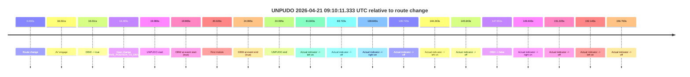

| Metric | Value |
|---|---|
| Outcome | `pass` |
| Effective failure type | `none` |
| Route change status | `found` |
| DBW at event start | `true` |
| DBW at event end | `true` |
| Predicted gear at AV start | `DRIVE_POSITION_V2_DRIVE` |
| Actual gear at AV start | `DRIVE_POSITION_V2_PARK` |
| Predicted gear at event start | `DRIVE_POSITION_V2_DRIVE` |
| Actual gear at event start | `DRIVE_POSITION_V2_DRIVE` |
| Planned indicator direction | `INDICATORS_STATE_V2_RIGHT_ON` |
| Controller indicator direction | `INDICATORS_STATE_V2_RIGHT_ON` |
| Actual indicator direction | `INDICATORS_STATE_V2_OFF` |
| Actual indicator at maneuver end | `INDICATORS_STATE_V2_OFF` |
| Driver accel help in AV | `false` |
| Driver accel help timestamp | `n/a` |
| Max accel pedal pct in AV | `0.0%` |
| Max brake pedal pct in AV | `8.0%` |
| Max speed mps in AV | `3.253` |
| Success timing baseline | `route change` |
| Route -> AV | `16.011s` |
| AV -> event start | `3.954s` |
| AV -> first motion | `4.012s` |
| Success baseline -> event start | `19.965s` |
| Success baseline -> first motion | `20.023s` |
| AV duration before disengagement | `131.540s` |
| Trajectory waypoint count | `38` |
| Driving-plan step count | `11` |

The scored portion starts from the AV-owned window, not from the pre-AV setup. Route-change search in the stopped pre-event segment was `found`, with the baseline therefore set to route change. At the event anchor the model predicts `DRIVE_POSITION_V2_DRIVE` and the actual gear is `DRIVE_POSITION_V2_DRIVE`. The effective model outcome is `pass` because `the credited unpudo stays AV-owned through the official unpudo window.`

### Resolution

| Field | Value |
|---|---|
| Final outcome | `pass` |
| Do we agree with this label? | `yes` |
| Source disengagement type | `none observed` |
| Resolved effective failure type | `none` |
| Confidence | `high` |

## unpudo 2026-04-21 09:22:36.483 UTC

| Field | Value |
|---|---|
| Model | `eel-teal-outspoken` |
| Author | `zak` |
| Run ID | `fme20014/2026-04-21--07-08-10--gen2-av-46bdd422-a390-4198-add1-421dfc3071ab` |
| Date | `2026-04-21` |
| Time (UTC) | `09:22:36.483` |
| Event type | `unpudo` |
| Disengagement type | `none observed` |
| Route change | `found` |
| Console | [run](https://console.sso.wayve.ai/run/fme20014/2026-04-21--07-08-10--gen2-av-46bdd422-a390-4198-add1-421dfc3071ab?id=&time-unixus=1776763356483312) |
| Foxglove | [segment](https://app.foxglove.dev/wayve-on-prem/p/prj_0dX18KZdVHg1fmmI/view?ds=foxglove-stream&ds.deviceName=fme20014&ds.start=2026-04-21T09%3A22%3A19.968246Z&ds.end=2026-04-21T09%3A22%3A49.883301Z&layoutId=lay_0e7VD4WIKDQGU73Y&time=2026-04-21T09%3A22%3A36.483312Z) |

### Event card: pass

- Pass: AV owns the credited unpudo from route change through the official unpudo window, the gear state is aligned at the anchor, and the vehicle moves without driver accelerator help in AV.

| Event | Time (UTC) | Delta from route change |
|---|---:|---:|
| Actual indicator already left on | 2026-04-21 09:22:19.971 | `-9.997s` |
| Actual indicator -> off | 2026-04-21 09:22:21.611 | `-8.357s` |
| Route change | 2026-04-21 09:22:29.968 | `0.000s` |
| AV engage | 2026-04-21 09:22:29.969 | `0.001s` |
| DBW -> true | 2026-04-21 09:22:29.969 | `0.001s` |
| Gear change (DRIVE_POSITION_V2_DRIVE) | 2026-04-21 09:22:30.333 | `0.365s` |
| UNPUDO start | 2026-04-21 09:22:36.483 | `6.515s` |
| DBW at event start (true) | 2026-04-21 09:22:36.483 | `6.515s` |
| First motion | 2026-04-21 09:22:36.531 | `6.563s` |
| DBW at event end (true) | 2026-04-21 09:22:39.883 | `9.915s` |
| UNPUDO end | 2026-04-21 09:22:39.883 | `9.915s` |

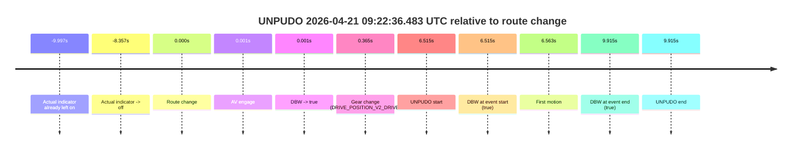

| Metric | Value |
|---|---|
| Outcome | `pass` |
| Effective failure type | `none` |
| Route change status | `found` |
| DBW at event start | `true` |
| DBW at event end | `true` |
| Predicted gear at AV start | `DRIVE_POSITION_V2_PARK` |
| Actual gear at AV start | `DRIVE_POSITION_V2_PARK` |
| Predicted gear at event start | `DRIVE_POSITION_V2_DRIVE` |
| Actual gear at event start | `DRIVE_POSITION_V2_DRIVE` |
| Planned indicator direction | `INDICATORS_STATE_V2_RIGHT_ON` |
| Controller indicator direction | `INDICATORS_STATE_V2_RIGHT_ON` |
| Actual indicator direction | `INDICATORS_STATE_V2_OFF` |
| Actual indicator at maneuver end | `INDICATORS_STATE_V2_OFF` |
| Driver accel help in AV | `false` |
| Driver accel help timestamp | `n/a` |
| Max accel pedal pct in AV | `0.0%` |
| Max brake pedal pct in AV | `9.8%` |
| Max speed mps in AV | `5.133` |
| Success timing baseline | `route change` |
| Route -> AV | `0.001s` |
| AV -> event start | `6.514s` |
| AV -> first motion | `6.562s` |
| Success baseline -> event start | `6.515s` |
| Success baseline -> first motion | `6.563s` |
| AV duration before disengagement | `n/a` |
| Trajectory waypoint count | `37` |
| Driving-plan step count | `11` |

The scored portion starts from the AV-owned window, not from the pre-AV setup. Route-change search in the stopped pre-event segment was `found`, with the baseline therefore set to route change. At the event anchor the model predicts `DRIVE_POSITION_V2_DRIVE` and the actual gear is `DRIVE_POSITION_V2_DRIVE`. The effective model outcome is `pass` because `the credited unpudo stays AV-owned through the official unpudo window.`

### Resolution

| Field | Value |
|---|---|
| Final outcome | `pass` |
| Do we agree with this label? | `yes` |
| Source disengagement type | `none observed` |
| Resolved effective failure type | `none` |
| Confidence | `high` |

## unpudo 2026-04-21 09:23:38.433 UTC

| Field | Value |
|---|---|
| Model | `eel-teal-outspoken` |
| Author | `zak` |
| Run ID | `fme20014/2026-04-21--07-08-10--gen2-av-46bdd422-a390-4198-add1-421dfc3071ab` |
| Date | `2026-04-21` |
| Time (UTC) | `09:23:38.433` |
| Event type | `unpudo` |
| Disengagement type | `none observed` |
| Route change | `found` |
| Console | [run](https://console.sso.wayve.ai/run/fme20014/2026-04-21--07-08-10--gen2-av-46bdd422-a390-4198-add1-421dfc3071ab?id=&time-unixus=1776763418433295) |
| Foxglove | [segment](https://app.foxglove.dev/wayve-on-prem/p/prj_0dX18KZdVHg1fmmI/view?ds=foxglove-stream&ds.deviceName=fme20014&ds.start=2026-04-21T09%3A22%3A19.968246Z&ds.end=2026-04-21T09%3A23%3A52.233317Z&layoutId=lay_0e7VD4WIKDQGU73Y&time=2026-04-21T09%3A23%3A38.433295Z) |

### Event card: pass

- Pass: AV owns the credited unpudo from route change through the official unpudo window, the gear state is aligned at the anchor, and the vehicle moves without driver accelerator help in AV.

| Event | Time (UTC) | Delta from route change |
|---|---:|---:|
| Actual indicator already left on | 2026-04-21 09:22:19.971 | `-9.997s` |
| Actual indicator -> off | 2026-04-21 09:22:21.611 | `-8.357s` |
| Route change | 2026-04-21 09:22:29.968 | `0.000s` |
| AV engage | 2026-04-21 09:22:29.969 | `0.001s` |
| DBW -> true | 2026-04-21 09:22:29.969 | `0.001s` |
| First motion | 2026-04-21 09:22:36.531 | `6.563s` |
| Actual indicator -> left on | 2026-04-21 09:23:17.351 | `47.383s` |
| Actual indicator -> off | 2026-04-21 09:23:22.031 | `52.063s` |
| Gear change (DRIVE_POSITION_V2_DRIVE) | 2026-04-21 09:23:34.833 | `64.865s` |
| UNPUDO start | 2026-04-21 09:23:38.433 | `68.465s` |
| DBW at event start (true) | 2026-04-21 09:23:38.433 | `68.465s` |
| DBW at event end (true) | 2026-04-21 09:23:42.233 | `72.265s` |
| UNPUDO end | 2026-04-21 09:23:42.233 | `72.265s` |

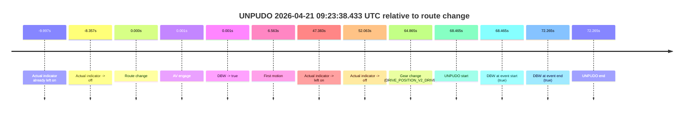

| Metric | Value |
|---|---|
| Outcome | `pass` |
| Effective failure type | `none` |
| Route change status | `found` |
| DBW at event start | `true` |
| DBW at event end | `true` |
| Predicted gear at AV start | `DRIVE_POSITION_V2_PARK` |
| Actual gear at AV start | `DRIVE_POSITION_V2_PARK` |
| Predicted gear at event start | `DRIVE_POSITION_V2_DRIVE` |
| Actual gear at event start | `DRIVE_POSITION_V2_DRIVE` |
| Planned indicator direction | `INDICATORS_STATE_V2_RIGHT_ON` |
| Controller indicator direction | `INDICATORS_STATE_V2_RIGHT_ON` |
| Actual indicator direction | `INDICATORS_STATE_V2_OFF` |
| Actual indicator at maneuver end | `INDICATORS_STATE_V2_OFF` |
| Driver accel help in AV | `false` |
| Driver accel help timestamp | `n/a` |
| Max accel pedal pct in AV | `0.0%` |
| Max brake pedal pct in AV | `12.9%` |
| Max speed mps in AV | `6.011` |
| Success timing baseline | `route change` |
| Route -> AV | `0.001s` |
| AV -> event start | `68.464s` |
| AV -> first motion | `6.562s` |
| Success baseline -> event start | `68.465s` |
| Success baseline -> first motion | `6.563s` |
| AV duration before disengagement | `n/a` |
| Trajectory waypoint count | `38` |
| Driving-plan step count | `11` |

The scored portion starts from the AV-owned window, not from the pre-AV setup. Route-change search in the stopped pre-event segment was `found`, with the baseline therefore set to route change. At the event anchor the model predicts `DRIVE_POSITION_V2_DRIVE` and the actual gear is `DRIVE_POSITION_V2_DRIVE`. The effective model outcome is `pass` because `the credited unpudo stays AV-owned through the official unpudo window.`

### Resolution

| Field | Value |
|---|---|
| Final outcome | `pass` |
| Do we agree with this label? | `yes` |
| Source disengagement type | `none observed` |
| Resolved effective failure type | `none` |
| Confidence | `high` |

## unparking 2026-04-21 09:24:57.583 UTC

| Field | Value |
|---|---|
| Model | `eel-teal-outspoken` |
| Author | `zak` |
| Run ID | `fme20014/2026-04-21--07-08-10--gen2-av-46bdd422-a390-4198-add1-421dfc3071ab` |
| Date | `2026-04-21` |
| Time (UTC) | `09:24:57.583` |
| Event type | `unparking` |
| Disengagement type | `none observed` |
| Route change | `found` |
| Console | [run](https://console.sso.wayve.ai/run/fme20014/2026-04-21--07-08-10--gen2-av-46bdd422-a390-4198-add1-421dfc3071ab?id=&time-unixus=1776763497583313) |
| Foxglove | [segment](https://app.foxglove.dev/wayve-on-prem/p/prj_0dX18KZdVHg1fmmI/view?ds=foxglove-stream&ds.deviceName=fme20014&ds.start=2026-04-21T09%3A22%3A12.639224Z&ds.end=2026-04-21T09%3A25%3A12.683297Z&layoutId=lay_0e7VD4WIKDQGU73Y&time=2026-04-21T09%3A24%3A57.583313Z) |

### Event card: pass

- Pass: AV owns the credited unparking through the official event window, the gear state is aligned at the anchor, and the vehicle moves without driver accelerator help in AV.

| Event | Time (UTC) | Delta from route change |
|---|---:|---:|
| AV engage | 2026-04-21 09:22:22.639 | `-71.829s` |
| DBW -> true | 2026-04-21 09:22:22.639 | `-71.829s` |
| Route change | 2026-04-21 09:23:34.468 | `0.000s` |
| Actual indicator -> left on | 2026-04-21 09:24:30.731 | `56.263s` |
| Actual indicator -> off | 2026-04-21 09:24:38.491 | `64.023s` |
| Gear change (DRIVE_POSITION_V2_DRIVE) | 2026-04-21 09:24:49.633 | `75.165s` |
| UNPARKING start | 2026-04-21 09:24:57.583 | `83.115s` |
| DBW at event start (true) | 2026-04-21 09:24:57.583 | `83.115s` |
| First motion | 2026-04-21 09:24:57.631 | `83.163s` |
| DBW at event end (true) | 2026-04-21 09:25:02.683 | `88.215s` |
| UNPARKING end | 2026-04-21 09:25:02.683 | `88.215s` |

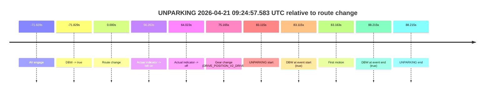

| Metric | Value |
|---|---|
| Outcome | `pass` |
| Effective failure type | `none` |
| Route change status | `found` |
| DBW at event start | `true` |
| DBW at event end | `true` |
| Predicted gear at AV start | `DRIVE_POSITION_V2_DRIVE` |
| Actual gear at AV start | `DRIVE_POSITION_V2_DRIVE` |
| Predicted gear at event start | `DRIVE_POSITION_V2_DRIVE` |
| Actual gear at event start | `DRIVE_POSITION_V2_DRIVE` |
| Planned indicator direction | `INDICATORS_STATE_V2_RIGHT_ON` |
| Controller indicator direction | `INDICATORS_STATE_V2_RIGHT_ON` |
| Actual indicator direction | `INDICATORS_STATE_V2_OFF` |
| Actual indicator at maneuver end | `INDICATORS_STATE_V2_OFF` |
| Driver accel help in AV | `false` |
| Driver accel help timestamp | `n/a` |
| Max accel pedal pct in AV | `0.0%` |
| Max brake pedal pct in AV | `0.0%` |
| Max speed mps in AV | `4.281` |
| Success timing baseline | `AV start` |
| Route -> AV | `-71.829s` |
| AV -> event start | `154.944s` |
| AV -> first motion | `154.992s` |
| Success baseline -> event start | `154.944s` |
| Success baseline -> first motion | `154.992s` |
| AV duration before disengagement | `n/a` |
| Trajectory waypoint count | `37` |
| Driving-plan step count | `11` |

The scored portion starts from the AV-owned window, not from the pre-AV setup. Route-change search in the stopped pre-event segment was `found`, with the baseline therefore set to route change. At the event anchor the model predicts `DRIVE_POSITION_V2_DRIVE` and the actual gear is `DRIVE_POSITION_V2_DRIVE`. The effective model outcome is `pass` because `the credited maneuver stays AV-owned through the official event end.`

### Resolution

| Field | Value |
|---|---|
| Final outcome | `pass` |
| Do we agree with this label? | `yes` |
| Source disengagement type | `none observed` |
| Resolved effective failure type | `none` |
| Confidence | `high` |
