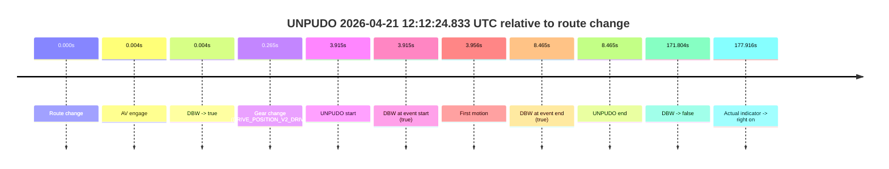
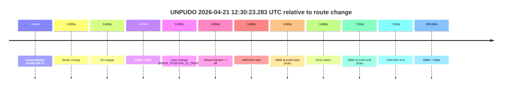
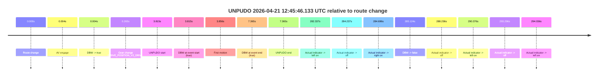
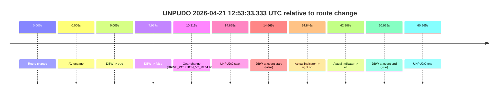
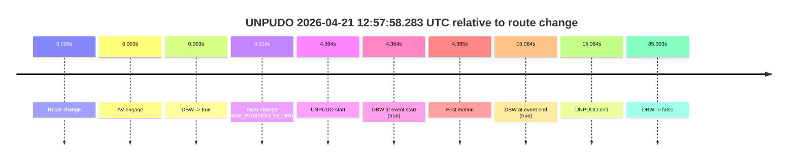
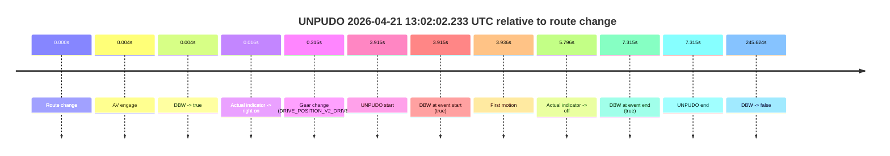
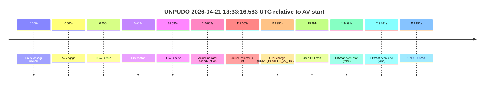

# Run Report: fme20014/2026-04-21--12-04-56--gen2-av-8cecbddf-a2db-46f2-884b-dee43e283993

| Field | Value |
|---|---|
| Run ID | `fme20014/2026-04-21--12-04-56--gen2-av-8cecbddf-a2db-46f2-884b-dee43e283993` |
| Date | `2026-04-21` |
| Model(s) | `eel-teal-outspoken` |
| Author | `zak` |
| Event count | `8` |

## unpudo 2026-04-21 12:12:24.833 UTC

| Field | Value |
|---|---|
| Model | `eel-teal-outspoken` |
| Author | `zak` |
| Run ID | `fme20014/2026-04-21--12-04-56--gen2-av-8cecbddf-a2db-46f2-884b-dee43e283993` |
| Date | `2026-04-21` |
| Time (UTC) | `12:12:24.833` |
| Event type | `unpudo` |
| Disengagement type | `none observed` |
| Route change | `found` |
| Console | [run](https://console.sso.wayve.ai/run/fme20014/2026-04-21--12-04-56--gen2-av-8cecbddf-a2db-46f2-884b-dee43e283993?id=&time-unixus=1776773544833313) |
| Foxglove | [segment](https://app.foxglove.dev/wayve-on-prem/p/prj_0dX18KZdVHg1fmmI/view?ds=foxglove-stream&ds.deviceName=fme20014&ds.start=2026-04-21T12%3A12%3A10.918325Z&ds.end=2026-04-21T12%3A15%3A22.722539Z&layoutId=lay_0e7VD4WIKDQGU73Y&time=2026-04-21T12%3A12%3A24.833313Z) |

### Event card: pass

- Pass: AV owns the credited unpudo from route change through the official unpudo window, the gear state is aligned at the anchor, and the vehicle moves without driver accelerator help in AV.

| Event | Time (UTC) | Delta from route change |
|---|---:|---:|
| Route change | 2026-04-21 12:12:20.918 | `0.000s` |
| AV engage | 2026-04-21 12:12:20.922 | `0.004s` |
| DBW -> true | 2026-04-21 12:12:20.922 | `0.004s` |
| Gear change (DRIVE_POSITION_V2_DRIVE) | 2026-04-21 12:12:21.183 | `0.265s` |
| UNPUDO start | 2026-04-21 12:12:24.833 | `3.915s` |
| DBW at event start (true) | 2026-04-21 12:12:24.833 | `3.915s` |
| First motion | 2026-04-21 12:12:24.874 | `3.956s` |
| DBW at event end (true) | 2026-04-21 12:12:29.383 | `8.465s` |
| UNPUDO end | 2026-04-21 12:12:29.383 | `8.465s` |
| DBW -> false | 2026-04-21 12:15:12.722 | `171.804s` |
| Actual indicator -> right on | 2026-04-21 12:15:18.834 | `177.916s` |

| Metric | Value |
|---|---|
| Outcome | `pass` |
| Effective failure type | `none` |
| Route change status | `found` |
| DBW at event start | `true` |
| DBW at event end | `true` |
| Predicted gear at AV start | `DRIVE_POSITION_V2_PARK` |
| Actual gear at AV start | `DRIVE_POSITION_V2_PARK` |
| Predicted gear at event start | `DRIVE_POSITION_V2_DRIVE` |
| Actual gear at event start | `DRIVE_POSITION_V2_DRIVE` |
| Planned indicator direction | `INDICATORS_STATE_V2_OFF` |
| Controller indicator direction | `INDICATORS_STATE_V2_OFF` |
| Actual indicator direction | `INDICATORS_STATE_V2_OFF` |
| Actual indicator at maneuver end | `INDICATORS_STATE_V2_OFF` |
| Driver accel help in AV | `false` |
| Driver accel help timestamp | `n/a` |
| Max accel pedal pct in AV | `0.0%` |
| Max brake pedal pct in AV | `19.2%` |
| Max speed mps in AV | `4.467` |
| Success timing baseline | `route change` |
| Route -> AV | `0.004s` |
| AV -> event start | `3.911s` |
| AV -> first motion | `3.952s` |
| Success baseline -> event start | `3.915s` |
| Success baseline -> first motion | `3.956s` |
| AV duration before disengagement | `171.800s` |
| Trajectory waypoint count | `38` |
| Driving-plan step count | `11` |

The scored portion starts from the AV-owned window, not from the pre-AV setup. Route-change search in the stopped pre-event segment was `found`, with the baseline therefore set to route change. At the event anchor the model predicts `DRIVE_POSITION_V2_DRIVE` and the actual gear is `DRIVE_POSITION_V2_DRIVE`. The effective model outcome is `pass` because `the credited unpudo stays AV-owned through the official unpudo window.`

### Resolution

| Field | Value |
|---|---|
| Final outcome | `pass` |
| Do we agree with this label? | `yes` |
| Source disengagement type | `none observed` |
| Resolved effective failure type | `none` |
| Confidence | `high` |

## unpudo 2026-04-21 12:30:23.283 UTC

| Field | Value |
|---|---|
| Model | `eel-teal-outspoken` |
| Author | `zak` |
| Run ID | `fme20014/2026-04-21--12-04-56--gen2-av-8cecbddf-a2db-46f2-884b-dee43e283993` |
| Date | `2026-04-21` |
| Time (UTC) | `12:30:23.283` |
| Event type | `unpudo` |
| Disengagement type | `none observed` |
| Route change | `found` |
| Console | [run](https://console.sso.wayve.ai/run/fme20014/2026-04-21--12-04-56--gen2-av-8cecbddf-a2db-46f2-884b-dee43e283993?id=&time-unixus=1776774623283306) |
| Foxglove | [segment](https://app.foxglove.dev/wayve-on-prem/p/prj_0dX18KZdVHg1fmmI/view?ds=foxglove-stream&ds.deviceName=fme20014&ds.start=2026-04-21T12%3A30%3A09.418321Z&ds.end=2026-04-21T12%3A35%3A25.263700Z&layoutId=lay_0e7VD4WIKDQGU73Y&time=2026-04-21T12%3A30%3A23.283306Z) |

### Event card: pass

- Pass: AV owns the credited unpudo from route change through the official unpudo window, the gear state is aligned at the anchor, and the vehicle moves without driver accelerator help in AV.

| Event | Time (UTC) | Delta from route change |
|---|---:|---:|
| Actual indicator already left on | 2026-04-21 12:30:09.434 | `-9.984s` |
| Route change | 2026-04-21 12:30:19.418 | `0.000s` |
| AV engage | 2026-04-21 12:30:19.422 | `0.004s` |
| DBW -> true | 2026-04-21 12:30:19.422 | `0.004s` |
| Gear change (DRIVE_POSITION_V2_DRIVE) | 2026-04-21 12:30:19.683 | `0.265s` |
| Actual indicator -> off | 2026-04-21 12:30:20.074 | `0.656s` |
| UNPUDO start | 2026-04-21 12:30:23.283 | `3.865s` |
| DBW at event start (true) | 2026-04-21 12:30:23.283 | `3.865s` |
| First motion | 2026-04-21 12:30:23.314 | `3.896s` |
| DBW at event end (true) | 2026-04-21 12:30:26.733 | `7.315s` |
| UNPUDO end | 2026-04-21 12:30:26.733 | `7.315s` |
| DBW -> false | 2026-04-21 12:35:15.263 | `295.845s` |

| Metric | Value |
|---|---|
| Outcome | `pass` |
| Effective failure type | `none` |
| Route change status | `found` |
| DBW at event start | `true` |
| DBW at event end | `true` |
| Predicted gear at AV start | `DRIVE_POSITION_V2_PARK` |
| Actual gear at AV start | `DRIVE_POSITION_V2_PARK` |
| Predicted gear at event start | `DRIVE_POSITION_V2_DRIVE` |
| Actual gear at event start | `DRIVE_POSITION_V2_DRIVE` |
| Planned indicator direction | `INDICATORS_STATE_V2_RIGHT_ON` |
| Controller indicator direction | `INDICATORS_STATE_V2_RIGHT_ON` |
| Actual indicator direction | `INDICATORS_STATE_V2_OFF` |
| Actual indicator at maneuver end | `INDICATORS_STATE_V2_OFF` |
| Driver accel help in AV | `false` |
| Driver accel help timestamp | `n/a` |
| Max accel pedal pct in AV | `0.0%` |
| Max brake pedal pct in AV | `8.0%` |
| Max speed mps in AV | `5.006` |
| Success timing baseline | `route change` |
| Route -> AV | `0.004s` |
| AV -> event start | `3.861s` |
| AV -> first motion | `3.892s` |
| Success baseline -> event start | `3.865s` |
| Success baseline -> first motion | `3.896s` |
| AV duration before disengagement | `295.841s` |
| Trajectory waypoint count | `37` |
| Driving-plan step count | `11` |

The scored portion starts from the AV-owned window, not from the pre-AV setup. Route-change search in the stopped pre-event segment was `found`, with the baseline therefore set to route change. At the event anchor the model predicts `DRIVE_POSITION_V2_DRIVE` and the actual gear is `DRIVE_POSITION_V2_DRIVE`. The effective model outcome is `pass` because `the credited unpudo stays AV-owned through the official unpudo window.`

### Resolution

| Field | Value |
|---|---|
| Final outcome | `pass` |
| Do we agree with this label? | `yes` |
| Source disengagement type | `none observed` |
| Resolved effective failure type | `none` |
| Confidence | `high` |

## unpudo 2026-04-21 12:45:46.133 UTC

| Field | Value |
|---|---|
| Model | `eel-teal-outspoken` |
| Author | `zak` |
| Run ID | `fme20014/2026-04-21--12-04-56--gen2-av-8cecbddf-a2db-46f2-884b-dee43e283993` |
| Date | `2026-04-21` |
| Time (UTC) | `12:45:46.133` |
| Event type | `unpudo` |
| Disengagement type | `none observed` |
| Route change | `found` |
| Console | [run](https://console.sso.wayve.ai/run/fme20014/2026-04-21--12-04-56--gen2-av-8cecbddf-a2db-46f2-884b-dee43e283993?id=&time-unixus=1776775546133310) |
| Foxglove | [segment](https://app.foxglove.dev/wayve-on-prem/p/prj_0dX18KZdVHg1fmmI/view?ds=foxglove-stream&ds.deviceName=fme20014&ds.start=2026-04-21T12%3A45%3A32.318279Z&ds.end=2026-04-21T12%3A50%3A37.442517Z&layoutId=lay_0e7VD4WIKDQGU73Y&time=2026-04-21T12%3A45%3A46.133310Z) |

### Event card: pass

- Pass: AV owns the credited unpudo from route change through the official unpudo window, the gear state is aligned at the anchor, and the vehicle moves without driver accelerator help in AV.

| Event | Time (UTC) | Delta from route change |
|---|---:|---:|
| Route change | 2026-04-21 12:45:42.318 | `0.000s` |
| AV engage | 2026-04-21 12:45:42.322 | `0.004s` |
| DBW -> true | 2026-04-21 12:45:42.322 | `0.004s` |
| Gear change (DRIVE_POSITION_V2_DRIVE) | 2026-04-21 12:45:42.583 | `0.265s` |
| UNPUDO start | 2026-04-21 12:45:46.133 | `3.815s` |
| DBW at event start (true) | 2026-04-21 12:45:46.133 | `3.815s` |
| First motion | 2026-04-21 12:45:46.174 | `3.856s` |
| DBW at event end (true) | 2026-04-21 12:45:49.683 | `7.365s` |
| UNPUDO end | 2026-04-21 12:45:49.683 | `7.365s` |
| Actual indicator -> left on | 2026-04-21 12:50:24.655 | `282.337s` |
| Actual indicator -> off | 2026-04-21 12:50:26.555 | `284.237s` |
| Actual indicator -> right on | 2026-04-21 12:50:27.014 | `284.696s` |
| DBW -> false | 2026-04-21 12:50:27.442 | `285.124s` |
| Actual indicator -> off | 2026-04-21 12:50:30.554 | `288.236s` |
| Actual indicator -> left on | 2026-04-21 12:50:32.694 | `290.376s` |
| Actual indicator -> off | 2026-04-21 12:50:35.614 | `293.296s` |
| Actual indicator -> left on | 2026-04-21 12:50:36.354 | `294.036s` |

| Metric | Value |
|---|---|
| Outcome | `pass` |
| Effective failure type | `none` |
| Route change status | `found` |
| DBW at event start | `true` |
| DBW at event end | `true` |
| Predicted gear at AV start | `DRIVE_POSITION_V2_PARK` |
| Actual gear at AV start | `DRIVE_POSITION_V2_PARK` |
| Predicted gear at event start | `DRIVE_POSITION_V2_DRIVE` |
| Actual gear at event start | `DRIVE_POSITION_V2_DRIVE` |
| Planned indicator direction | `INDICATORS_STATE_V2_RIGHT_ON` |
| Controller indicator direction | `INDICATORS_STATE_V2_RIGHT_ON` |
| Actual indicator direction | `INDICATORS_STATE_V2_OFF` |
| Actual indicator at maneuver end | `INDICATORS_STATE_V2_OFF` |
| Driver accel help in AV | `false` |
| Driver accel help timestamp | `n/a` |
| Max accel pedal pct in AV | `0.0%` |
| Max brake pedal pct in AV | `8.0%` |
| Max speed mps in AV | `4.356` |
| Success timing baseline | `route change` |
| Route -> AV | `0.004s` |
| AV -> event start | `3.811s` |
| AV -> first motion | `3.852s` |
| Success baseline -> event start | `3.815s` |
| Success baseline -> first motion | `3.856s` |
| AV duration before disengagement | `285.120s` |
| Trajectory waypoint count | `38` |
| Driving-plan step count | `11` |

The scored portion starts from the AV-owned window, not from the pre-AV setup. Route-change search in the stopped pre-event segment was `found`, with the baseline therefore set to route change. At the event anchor the model predicts `DRIVE_POSITION_V2_DRIVE` and the actual gear is `DRIVE_POSITION_V2_DRIVE`. The effective model outcome is `pass` because `the credited unpudo stays AV-owned through the official unpudo window.`

### Resolution

| Field | Value |
|---|---|
| Final outcome | `pass` |
| Do we agree with this label? | `yes` |
| Source disengagement type | `none observed` |
| Resolved effective failure type | `none` |
| Confidence | `high` |

## unpudo 2026-04-21 12:51:10.483 UTC

| Field | Value |
|---|---|
| Model | `eel-teal-outspoken` |
| Author | `zak` |
| Run ID | `fme20014/2026-04-21--12-04-56--gen2-av-8cecbddf-a2db-46f2-884b-dee43e283993` |
| Date | `2026-04-21` |
| Time (UTC) | `12:51:10.483` |
| Event type | `unpudo` |
| Disengagement type | `none observed` |
| Route change | `found` |
| Console | [run](https://console.sso.wayve.ai/run/fme20014/2026-04-21--12-04-56--gen2-av-8cecbddf-a2db-46f2-884b-dee43e283993?id=&time-unixus=1776775870483305) |
| Foxglove | [segment](https://app.foxglove.dev/wayve-on-prem/p/prj_0dX18KZdVHg1fmmI/view?ds=foxglove-stream&ds.deviceName=fme20014&ds.start=2026-04-21T12%3A50%3A56.618418Z&ds.end=2026-04-21T12%3A53%3A36.625007Z&layoutId=lay_0e7VD4WIKDQGU73Y&time=2026-04-21T12%3A51%3A10.483305Z) |

### Event card: pass

- Pass: AV owns the credited unpudo from route change through the official unpudo window, the gear state is aligned at the anchor, and the vehicle moves without driver accelerator help in AV.

| Event | Time (UTC) | Delta from route change |
|---|---:|---:|
| Route change | 2026-04-21 12:51:06.618 | `0.000s` |
| AV engage | 2026-04-21 12:51:06.622 | `0.004s` |
| DBW -> true | 2026-04-21 12:51:06.622 | `0.004s` |
| Gear change (DRIVE_POSITION_V2_DRIVE) | 2026-04-21 12:51:06.933 | `0.315s` |
| UNPUDO start | 2026-04-21 12:51:10.483 | `3.865s` |
| DBW at event start (true) | 2026-04-21 12:51:10.483 | `3.865s` |
| First motion | 2026-04-21 12:51:10.494 | `3.876s` |
| DBW at event end (true) | 2026-04-21 12:51:13.733 | `7.115s` |
| UNPUDO end | 2026-04-21 12:51:13.733 | `7.115s` |
| DBW -> false | 2026-04-21 12:53:26.625 | `140.007s` |

| Metric | Value |
|---|---|
| Outcome | `pass` |
| Effective failure type | `none` |
| Route change status | `found` |
| DBW at event start | `true` |
| DBW at event end | `true` |
| Predicted gear at AV start | `DRIVE_POSITION_V2_PARK` |
| Actual gear at AV start | `DRIVE_POSITION_V2_PARK` |
| Predicted gear at event start | `DRIVE_POSITION_V2_DRIVE` |
| Actual gear at event start | `DRIVE_POSITION_V2_DRIVE` |
| Planned indicator direction | `INDICATORS_STATE_V2_RIGHT_ON` |
| Controller indicator direction | `INDICATORS_STATE_V2_RIGHT_ON` |
| Actual indicator direction | `INDICATORS_STATE_V2_OFF` |
| Actual indicator at maneuver end | `INDICATORS_STATE_V2_OFF` |
| Driver accel help in AV | `false` |
| Driver accel help timestamp | `n/a` |
| Max accel pedal pct in AV | `0.0%` |
| Max brake pedal pct in AV | `8.2%` |
| Max speed mps in AV | `5.664` |
| Success timing baseline | `route change` |
| Route -> AV | `0.004s` |
| AV -> event start | `3.861s` |
| AV -> first motion | `3.871s` |
| Success baseline -> event start | `3.865s` |
| Success baseline -> first motion | `3.876s` |
| AV duration before disengagement | `140.002s` |
| Trajectory waypoint count | `37` |
| Driving-plan step count | `11` |

The scored portion starts from the AV-owned window, not from the pre-AV setup. Route-change search in the stopped pre-event segment was `found`, with the baseline therefore set to route change. At the event anchor the model predicts `DRIVE_POSITION_V2_DRIVE` and the actual gear is `DRIVE_POSITION_V2_DRIVE`. The effective model outcome is `pass` because `the credited unpudo stays AV-owned through the official unpudo window.`

### Resolution

| Field | Value |
|---|---|
| Final outcome | `pass` |
| Do we agree with this label? | `yes` |
| Source disengagement type | `none observed` |
| Resolved effective failure type | `none` |
| Confidence | `high` |

## unpudo 2026-04-21 12:53:33.333 UTC

| Field | Value |
|---|---|
| Model | `eel-teal-outspoken` |
| Author | `zak` |
| Run ID | `fme20014/2026-04-21--12-04-56--gen2-av-8cecbddf-a2db-46f2-884b-dee43e283993` |
| Date | `2026-04-21` |
| Time (UTC) | `12:53:33.333` |
| Event type | `unpudo` |
| Disengagement type | `none observed` |
| Route change | `found` |
| Console | [run](https://console.sso.wayve.ai/run/fme20014/2026-04-21--12-04-56--gen2-av-8cecbddf-a2db-46f2-884b-dee43e283993?id=&time-unixus=1776776013333300) |
| Foxglove | [segment](https://app.foxglove.dev/wayve-on-prem/p/prj_0dX18KZdVHg1fmmI/view?ds=foxglove-stream&ds.deviceName=fme20014&ds.start=2026-04-21T12%3A53%3A08.668276Z&ds.end=2026-04-21T12%3A54%3A29.633295Z&layoutId=lay_0e7VD4WIKDQGU73Y&time=2026-04-21T12%3A53%3A33.333300Z) |

### Event card: fail

- Fail: the credited unpudo does not stay AV-owned. The event window starts with DBW false, and the maneuver outcome lands outside a clean AV-owned segment.

| Event | Time (UTC) | Delta from route change |
|---|---:|---:|
| Route change | 2026-04-21 12:53:18.668 | `0.000s` |
| AV engage | 2026-04-21 12:53:18.672 | `0.005s` |
| DBW -> true | 2026-04-21 12:53:18.672 | `0.005s` |
| DBW -> false | 2026-04-21 12:53:26.625 | `7.957s` |
| Gear change (DRIVE_POSITION_V2_REVERSE) | 2026-04-21 12:53:28.883 | `10.215s` |
| UNPUDO start | 2026-04-21 12:53:33.333 | `14.665s` |
| DBW at event start (false) | 2026-04-21 12:53:33.333 | `14.665s` |
| Actual indicator -> right on | 2026-04-21 12:53:53.514 | `34.846s` |
| Actual indicator -> off | 2026-04-21 12:54:01.474 | `42.806s` |
| DBW at event end (true) | 2026-04-21 12:54:19.633 | `60.965s` |
| UNPUDO end | 2026-04-21 12:54:19.633 | `60.965s` |

| Metric | Value |
|---|---|
| Outcome | `fail` |
| Effective failure type | `not_av_owned` |
| Route change status | `found` |
| DBW at event start | `false` |
| DBW at event end | `true` |
| Predicted gear at AV start | `DRIVE_POSITION_V2_PARK` |
| Actual gear at AV start | `DRIVE_POSITION_V2_PARK` |
| Predicted gear at event start | `DRIVE_POSITION_V2_REVERSE` |
| Actual gear at event start | `DRIVE_POSITION_V2_REVERSE` |
| Planned indicator direction | `INDICATORS_STATE_V2_OFF` |
| Controller indicator direction | `INDICATORS_STATE_V2_OFF` |
| Actual indicator direction | `INDICATORS_STATE_V2_OFF` |
| Actual indicator at maneuver end | `INDICATORS_STATE_V2_OFF` |
| Driver accel help in AV | `false` |
| Driver accel help timestamp | `n/a` |
| Max accel pedal pct in AV | `0.0%` |
| Max brake pedal pct in AV | `9.2%` |
| Max speed mps in AV | `0.061` |
| Success timing baseline | `route change` |
| Route -> AV | `0.005s` |
| AV -> event start | `14.660s` |
| AV -> first motion | `n/a` |
| Success baseline -> event start | `14.665s` |
| Success baseline -> first motion | `n/a` |
| AV duration before disengagement | `7.952s` |
| Trajectory waypoint count | `38` |
| Driving-plan step count | `11` |

The scored portion starts from the AV-owned window, not from the pre-AV setup. Route-change search in the stopped pre-event segment was `found`, with the baseline therefore set to route change. At the event anchor the model predicts `DRIVE_POSITION_V2_REVERSE` and the actual gear is `DRIVE_POSITION_V2_REVERSE`. The effective model outcome is `fail` because `not_av_owned.`

### Resolution

| Field | Value |
|---|---|
| Final outcome | `fail` |
| Do we agree with this label? | `yes` |
| Source disengagement type | `none observed` |
| Resolved effective failure type | `not_av_owned` |
| Confidence | `high` |

## unpudo 2026-04-21 12:57:58.283 UTC

| Field | Value |
|---|---|
| Model | `eel-teal-outspoken` |
| Author | `zak` |
| Run ID | `fme20014/2026-04-21--12-04-56--gen2-av-8cecbddf-a2db-46f2-884b-dee43e283993` |
| Date | `2026-04-21` |
| Time (UTC) | `12:57:58.283` |
| Event type | `unpudo` |
| Disengagement type | `none observed` |
| Route change | `found` |
| Console | [run](https://console.sso.wayve.ai/run/fme20014/2026-04-21--12-04-56--gen2-av-8cecbddf-a2db-46f2-884b-dee43e283993?id=&time-unixus=1776776278283301) |
| Foxglove | [segment](https://app.foxglove.dev/wayve-on-prem/p/prj_0dX18KZdVHg1fmmI/view?ds=foxglove-stream&ds.deviceName=fme20014&ds.start=2026-04-21T12%3A57%3A43.919218Z&ds.end=2026-04-21T12%3A59%3A29.222542Z&layoutId=lay_0e7VD4WIKDQGU73Y&time=2026-04-21T12%3A57%3A58.283301Z) |

### Event card: pass

- Pass: AV owns the credited unpudo from route change through the official unpudo window, the gear state is aligned at the anchor, and the vehicle moves without driver accelerator help in AV.

| Event | Time (UTC) | Delta from route change |
|---|---:|---:|
| Route change | 2026-04-21 12:57:53.919 | `0.000s` |
| AV engage | 2026-04-21 12:57:53.922 | `0.003s` |
| DBW -> true | 2026-04-21 12:57:53.922 | `0.003s` |
| Gear change (DRIVE_POSITION_V2_DRIVE) | 2026-04-21 12:57:54.233 | `0.314s` |
| UNPUDO start | 2026-04-21 12:57:58.283 | `4.364s` |
| DBW at event start (true) | 2026-04-21 12:57:58.283 | `4.364s` |
| First motion | 2026-04-21 12:57:58.314 | `4.395s` |
| DBW at event end (true) | 2026-04-21 12:58:08.983 | `15.064s` |
| UNPUDO end | 2026-04-21 12:58:08.983 | `15.064s` |
| DBW -> false | 2026-04-21 12:59:19.222 | `85.303s` |

| Metric | Value |
|---|---|
| Outcome | `pass` |
| Effective failure type | `none` |
| Route change status | `found` |
| DBW at event start | `true` |
| DBW at event end | `true` |
| Predicted gear at AV start | `DRIVE_POSITION_V2_PARK` |
| Actual gear at AV start | `DRIVE_POSITION_V2_PARK` |
| Predicted gear at event start | `DRIVE_POSITION_V2_DRIVE` |
| Actual gear at event start | `DRIVE_POSITION_V2_DRIVE` |
| Planned indicator direction | `INDICATORS_STATE_V2_OFF` |
| Controller indicator direction | `INDICATORS_STATE_V2_OFF` |
| Actual indicator direction | `INDICATORS_STATE_V2_OFF` |
| Actual indicator at maneuver end | `INDICATORS_STATE_V2_OFF` |
| Driver accel help in AV | `false` |
| Driver accel help timestamp | `n/a` |
| Max accel pedal pct in AV | `0.0%` |
| Max brake pedal pct in AV | `8.0%` |
| Max speed mps in AV | `2.250` |
| Success timing baseline | `route change` |
| Route -> AV | `0.003s` |
| AV -> event start | `4.361s` |
| AV -> first motion | `4.392s` |
| Success baseline -> event start | `4.364s` |
| Success baseline -> first motion | `4.395s` |
| AV duration before disengagement | `85.300s` |
| Trajectory waypoint count | `37` |
| Driving-plan step count | `11` |

The scored portion starts from the AV-owned window, not from the pre-AV setup. Route-change search in the stopped pre-event segment was `found`, with the baseline therefore set to route change. At the event anchor the model predicts `DRIVE_POSITION_V2_DRIVE` and the actual gear is `DRIVE_POSITION_V2_DRIVE`. The effective model outcome is `pass` because `the credited unpudo stays AV-owned through the official unpudo window.`

### Resolution

| Field | Value |
|---|---|
| Final outcome | `pass` |
| Do we agree with this label? | `yes` |
| Source disengagement type | `none observed` |
| Resolved effective failure type | `none` |
| Confidence | `high` |

## unpudo 2026-04-21 13:02:02.233 UTC

| Field | Value |
|---|---|
| Model | `eel-teal-outspoken` |
| Author | `zak` |
| Run ID | `fme20014/2026-04-21--12-04-56--gen2-av-8cecbddf-a2db-46f2-884b-dee43e283993` |
| Date | `2026-04-21` |
| Time (UTC) | `13:02:02.233` |
| Event type | `unpudo` |
| Disengagement type | `none observed` |
| Route change | `found` |
| Console | [run](https://console.sso.wayve.ai/run/fme20014/2026-04-21--12-04-56--gen2-av-8cecbddf-a2db-46f2-884b-dee43e283993?id=&time-unixus=1776776522233290) |
| Foxglove | [segment](https://app.foxglove.dev/wayve-on-prem/p/prj_0dX18KZdVHg1fmmI/view?ds=foxglove-stream&ds.deviceName=fme20014&ds.start=2026-04-21T13%3A01%3A48.318293Z&ds.end=2026-04-21T13%3A06%3A13.942542Z&layoutId=lay_0e7VD4WIKDQGU73Y&time=2026-04-21T13%3A02%3A02.233290Z) |

### Event card: pass

- Pass: AV owns the credited unpudo from route change through the official unpudo window, the gear state is aligned at the anchor, and the vehicle moves without driver accelerator help in AV.

| Event | Time (UTC) | Delta from route change |
|---|---:|---:|
| Route change | 2026-04-21 13:01:58.318 | `0.000s` |
| AV engage | 2026-04-21 13:01:58.322 | `0.004s` |
| DBW -> true | 2026-04-21 13:01:58.322 | `0.004s` |
| Actual indicator -> right on | 2026-04-21 13:01:58.334 | `0.016s` |
| Gear change (DRIVE_POSITION_V2_DRIVE) | 2026-04-21 13:01:58.633 | `0.315s` |
| UNPUDO start | 2026-04-21 13:02:02.233 | `3.915s` |
| DBW at event start (true) | 2026-04-21 13:02:02.233 | `3.915s` |
| First motion | 2026-04-21 13:02:02.254 | `3.936s` |
| Actual indicator -> off | 2026-04-21 13:02:04.114 | `5.796s` |
| DBW at event end (true) | 2026-04-21 13:02:05.633 | `7.315s` |
| UNPUDO end | 2026-04-21 13:02:05.633 | `7.315s` |
| DBW -> false | 2026-04-21 13:06:03.942 | `245.624s` |

| Metric | Value |
|---|---|
| Outcome | `pass` |
| Effective failure type | `none` |
| Route change status | `found` |
| DBW at event start | `true` |
| DBW at event end | `true` |
| Predicted gear at AV start | `DRIVE_POSITION_V2_PARK` |
| Actual gear at AV start | `DRIVE_POSITION_V2_PARK` |
| Predicted gear at event start | `DRIVE_POSITION_V2_DRIVE` |
| Actual gear at event start | `DRIVE_POSITION_V2_DRIVE` |
| Planned indicator direction | `INDICATORS_STATE_V2_RIGHT_ON` |
| Controller indicator direction | `INDICATORS_STATE_V2_RIGHT_ON` |
| Actual indicator direction | `INDICATORS_STATE_V2_RIGHT_ON` |
| Actual indicator at maneuver end | `INDICATORS_STATE_V2_OFF` |
| Driver accel help in AV | `false` |
| Driver accel help timestamp | `n/a` |
| Max accel pedal pct in AV | `0.0%` |
| Max brake pedal pct in AV | `9.8%` |
| Max speed mps in AV | `5.125` |
| Success timing baseline | `route change` |
| Route -> AV | `0.004s` |
| AV -> event start | `3.911s` |
| AV -> first motion | `3.932s` |
| Success baseline -> event start | `3.915s` |
| Success baseline -> first motion | `3.936s` |
| AV duration before disengagement | `245.620s` |
| Trajectory waypoint count | `38` |
| Driving-plan step count | `11` |

The scored portion starts from the AV-owned window, not from the pre-AV setup. Route-change search in the stopped pre-event segment was `found`, with the baseline therefore set to route change. At the event anchor the model predicts `DRIVE_POSITION_V2_DRIVE` and the actual gear is `DRIVE_POSITION_V2_DRIVE`. The effective model outcome is `pass` because `the credited unpudo stays AV-owned through the official unpudo window.`

### Resolution

| Field | Value |
|---|---|
| Final outcome | `pass` |
| Do we agree with this label? | `yes` |
| Source disengagement type | `none observed` |
| Resolved effective failure type | `none` |
| Confidence | `high` |

## unpudo 2026-04-21 13:33:16.583 UTC

| Field | Value |
|---|---|
| Model | `eel-teal-outspoken` |
| Author | `zak` |
| Run ID | `fme20014/2026-04-21--12-04-56--gen2-av-8cecbddf-a2db-46f2-884b-dee43e283993` |
| Date | `2026-04-21` |
| Time (UTC) | `13:33:16.583` |
| Event type | `unpudo` |
| Disengagement type | `none observed` |
| Route change | `unclear` |
| Console | [run](https://console.sso.wayve.ai/run/fme20014/2026-04-21--12-04-56--gen2-av-8cecbddf-a2db-46f2-884b-dee43e283993?id=&time-unixus=1776778396583300) |
| Foxglove | [segment](https://app.foxglove.dev/wayve-on-prem/p/prj_0dX18KZdVHg1fmmI/view?ds=foxglove-stream&ds.deviceName=fme20014&ds.start=2026-04-21T13%3A31%3A06.591963Z&ds.end=2026-04-21T13%3A33%3A26.583300Z&layoutId=lay_0e7VD4WIKDQGU73Y&time=2026-04-21T13%3A33%3A16.583300Z) |

### Event card: fail

- Fail: the credited unpudo does not stay AV-owned. The event window starts with DBW false, and the maneuver outcome lands outside a clean AV-owned segment.

| Event | Time (UTC) | Delta from AV start |
|---|---:|---:|
| Route change unclear | 2026-04-21 13:31:16.591 | `0.000s` |
| AV engage | 2026-04-21 13:31:16.591 | `0.000s` |
| DBW -> true | 2026-04-21 13:31:16.591 | `0.000s` |
| First motion | 2026-04-21 13:31:16.594 | `0.003s` |
| DBW -> false | 2026-04-21 13:32:46.181 | `89.590s` |
| Actual indicator already left on | 2026-04-21 13:33:06.594 | `110.002s` |
| Actual indicator -> off | 2026-04-21 13:33:08.654 | `112.063s` |
| Gear change (DRIVE_POSITION_V2_DRIVE) | 2026-04-21 13:33:16.583 | `119.991s` |
| UNPUDO start | 2026-04-21 13:33:16.583 | `119.991s` |
| DBW at event start (false) | 2026-04-21 13:33:16.583 | `119.991s` |
| DBW at event end (false) | 2026-04-21 13:33:16.583 | `119.991s` |
| UNPUDO end | 2026-04-21 13:33:16.583 | `119.991s` |

| Metric | Value |
|---|---|
| Outcome | `fail` |
| Effective failure type | `not_av_owned` |
| Route change status | `unclear` |
| DBW at event start | `false` |
| DBW at event end | `false` |
| Predicted gear at AV start | `DRIVE_POSITION_V2_DRIVE` |
| Actual gear at AV start | `DRIVE_POSITION_V2_DRIVE` |
| Predicted gear at event start | `DRIVE_POSITION_V2_DRIVE` |
| Actual gear at event start | `DRIVE_POSITION_V2_DRIVE` |
| Planned indicator direction | `INDICATORS_STATE_V2_OFF` |
| Controller indicator direction | `INDICATORS_STATE_V2_OFF` |
| Actual indicator direction | `INDICATORS_STATE_V2_OFF` |
| Actual indicator at maneuver end | `INDICATORS_STATE_V2_OFF` |
| Driver accel help in AV | `false` |
| Driver accel help timestamp | `n/a` |
| Max accel pedal pct in AV | `0.0%` |
| Max brake pedal pct in AV | `8.0%` |
| Max speed mps in AV | `8.019` |
| Success timing baseline | `AV start` |
| Route -> AV | `n/a` |
| AV -> event start | `119.991s` |
| AV -> first motion | `0.003s` |
| Success baseline -> event start | `119.991s` |
| Success baseline -> first motion | `0.003s` |
| AV duration before disengagement | `89.590s` |
| Trajectory waypoint count | `37` |
| Driving-plan step count | `11` |

The scored portion starts from the AV-owned window, not from the pre-AV setup. Route-change search in the stopped pre-event segment was `unclear`, with the baseline therefore set to AV start. At the event anchor the model predicts `DRIVE_POSITION_V2_DRIVE` and the actual gear is `DRIVE_POSITION_V2_DRIVE`. The effective model outcome is `fail` because `not_av_owned.`

### Resolution

| Field | Value |
|---|---|
| Final outcome | `fail` |
| Do we agree with this label? | `yes` |
| Source disengagement type | `none observed` |
| Resolved effective failure type | `not_av_owned` |
| Confidence | `medium` |
