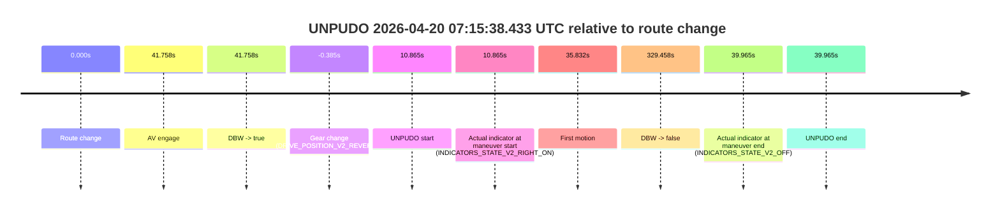
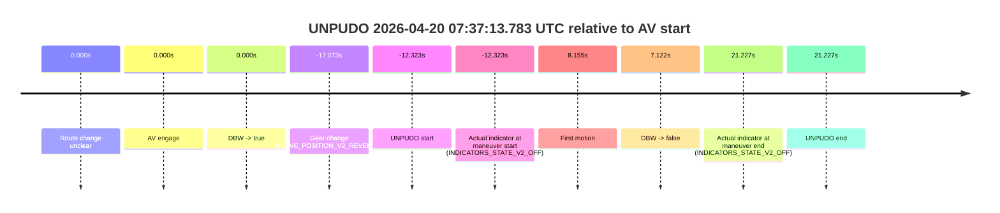
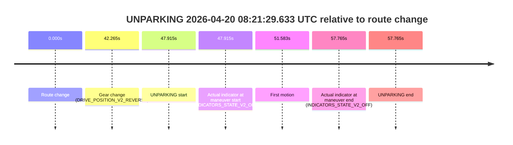

# Run Report: fme20018/2026-04-20--06-09-46--gen2-av-f3dff3a8-6b32-43f2-a280-52ddb467ac46

| Field | Value |
|---|---|
| Run ID | `fme20018/2026-04-20--06-09-46--gen2-av-f3dff3a8-6b32-43f2-a280-52ddb467ac46` |
| Date | `2026-04-20` |
| Model(s) | `pink-manta-ray-smooth` |
| Author | `guy.geva` |
| Event count | `14` |

## unpudo 2026-04-20 06:20:30.083 UTC

| Field | Value |
|---|---|
| Model | `pink-manta-ray-smooth` |
| Author | `guy.geva` |
| Run ID | `fme20018/2026-04-20--06-09-46--gen2-av-f3dff3a8-6b32-43f2-a280-52ddb467ac46` |
| Date | `2026-04-20` |
| Time (UTC) | `06:20:30.083` |
| Event type | `unpudo` |
| Disengagement type | `none observed` |
| Route change | `found` |
| Console | [run](https://console.sso.wayve.ai/run/fme20018/2026-04-20--06-09-46--gen2-av-f3dff3a8-6b32-43f2-a280-52ddb467ac46?id=&time-unixus=1776666030083314) |
| Foxglove | [segment](https://app.foxglove.dev/wayve-on-prem/p/prj_0dX18KZdVHg1fmmI/view?ds=foxglove-stream&ds.deviceName=fme20018&ds.start=2026-04-20T06%3A20%3A09.668290Z&ds.end=2026-04-20T06%3A23%3A23.527475Z&layoutId=lay_0e7VD4WIKDQGU73Y&time=2026-04-20T06%3A20%3A30.083314Z) |

### Event card: pass

- Pass: AV owns the credited unpudo through the official event window, the gear state is aligned at the anchor, and the vehicle moves without driver accelerator help in AV.

| Event | Time (UTC) | Delta from route change |
|---|---:|---:|
| Route change | 2026-04-20 06:20:19.668 | `0.000s` |
| AV engage | 2026-04-20 06:20:19.676 | `0.008s` |
| DBW -> true | 2026-04-20 06:20:19.676 | `0.008s` |
| Gear change (DRIVE_POSITION_V2_DRIVE) | 2026-04-20 06:20:19.983 | `0.315s` |
| UNPUDO start | 2026-04-20 06:20:30.083 | `10.415s` |
| Actual indicator at maneuver start (INDICATORS_STATE_V2_OFF) | 2026-04-20 06:20:30.083 | `10.415s` |
| First motion | 2026-04-20 06:20:30.120 | `10.453s` |
| DBW -> false | 2026-04-20 06:23:13.527 | `173.859s` |
| Actual indicator at maneuver end (INDICATORS_STATE_V2_OFF) | 2026-04-20 06:20:33.483 | `13.815s` |
| UNPUDO end | 2026-04-20 06:20:33.483 | `13.815s` |

| Metric | Value |
|---|---|
| Outcome | `pass` |
| Effective failure type | `none` |
| Route change status | `found` |
| DBW at event start | `true` |
| DBW at event end | `true` |
| Predicted gear at AV start | `DRIVE_POSITION_V2_PARK` |
| Actual gear at AV start | `DRIVE_POSITION_V2_PARK` |
| Predicted gear at event start | `DRIVE_POSITION_V2_DRIVE` |
| Actual gear at event start | `DRIVE_POSITION_V2_DRIVE` |
| Planned indicator direction | `INDICATORS_STATE_V2_RIGHT_ON` |
| Controller indicator direction | `INDICATORS_STATE_V2_RIGHT_ON` |
| Actual indicator direction | `INDICATORS_STATE_V2_OFF` |
| Actual indicator at maneuver end | `INDICATORS_STATE_V2_OFF` |
| Driver accel help in AV | `false` |
| Driver accel help timestamp | `n/a` |
| Max accel pedal pct in AV | `0.0%` |
| Max brake pedal pct in AV | `10.2%` |
| Max speed mps in AV | `5.114` |
| Route -> AV | `0.008s` |
| AV -> event start | `10.407s` |
| AV -> first motion | `10.445s` |
| AV duration before disengagement | `173.851s` |
| Trajectory waypoint count | `36` |
| Driving-plan step count | `11` |

The scored portion starts from the AV-owned window, not from the pre-AV setup. Route-change search in the stopped pre-event segment was `found`, with the baseline therefore set to route change. At the event anchor the model predicts `DRIVE_POSITION_V2_DRIVE` and the actual gear is `DRIVE_POSITION_V2_DRIVE`. The effective model outcome is `pass` because `the credited maneuver stays AV-owned through the official event end`.

### Resolution

| Field | Value |
|---|---|
| Final outcome | `pass` |
| Do we agree with this label? | `yes` |
| Source disengagement type | `none observed` |
| Resolved effective failure type | `none` |
| Confidence | `high` |

## unpudo 2026-04-20 06:27:53.883 UTC

| Field | Value |
|---|---|
| Model | `pink-manta-ray-smooth` |
| Author | `guy.geva` |
| Run ID | `fme20018/2026-04-20--06-09-46--gen2-av-f3dff3a8-6b32-43f2-a280-52ddb467ac46` |
| Date | `2026-04-20` |
| Time (UTC) | `06:27:53.883` |
| Event type | `unpudo` |
| Disengagement type | `none observed` |
| Route change | `found` |
| Console | [run](https://console.sso.wayve.ai/run/fme20018/2026-04-20--06-09-46--gen2-av-f3dff3a8-6b32-43f2-a280-52ddb467ac46?id=&time-unixus=1776666473883302) |
| Foxglove | [segment](https://app.foxglove.dev/wayve-on-prem/p/prj_0dX18KZdVHg1fmmI/view?ds=foxglove-stream&ds.deviceName=fme20018&ds.start=2026-04-20T06%3A27%3A37.669273Z&ds.end=2026-04-20T06%3A32%3A53.107045Z&layoutId=lay_0e7VD4WIKDQGU73Y&time=2026-04-20T06%3A27%3A53.883302Z) |

### Event card: accidental

- Accidental: AV ownership is present for less than `2s`, so this is treated as an accidental brush with the maneuver rather than a meaningful model attempt.

| Event | Time (UTC) | Delta from route change |
|---|---:|---:|
| Route change | 2026-04-20 06:27:47.669 | `0.000s` |
| AV engage | 2026-04-20 06:28:03.886 | `16.217s` |
| DBW -> true | 2026-04-20 06:28:03.886 | `16.217s` |
| Gear change (DRIVE_POSITION_V2_DRIVE) | 2026-04-20 06:27:48.083 | `0.414s` |
| UNPUDO start | 2026-04-20 06:27:53.883 | `6.214s` |
| Actual indicator at maneuver start (INDICATORS_STATE_V2_OFF) | 2026-04-20 06:27:53.883 | `6.214s` |
| First motion | 2026-04-20 06:27:53.921 | `6.252s` |
| DBW -> false | 2026-04-20 06:32:43.107 | `295.438s` |
| Actual indicator at maneuver end (INDICATORS_STATE_V2_OFF) | 2026-04-20 06:28:00.683 | `13.014s` |
| UNPUDO end | 2026-04-20 06:28:00.683 | `13.014s` |

| Metric | Value |
|---|---|
| Outcome | `accidental` |
| Effective failure type | `none` |
| Route change status | `found` |
| DBW at event start | `false` |
| DBW at event end | `false` |
| Predicted gear at AV start | `DRIVE_POSITION_V2_DRIVE` |
| Actual gear at AV start | `DRIVE_POSITION_V2_DRIVE` |
| Predicted gear at event start | `DRIVE_POSITION_V2_DRIVE` |
| Actual gear at event start | `DRIVE_POSITION_V2_DRIVE` |
| Planned indicator direction | `INDICATORS_STATE_V2_RIGHT_ON` |
| Controller indicator direction | `INDICATORS_STATE_V2_RIGHT_ON` |
| Actual indicator direction | `INDICATORS_STATE_V2_OFF` |
| Actual indicator at maneuver end | `INDICATORS_STATE_V2_OFF` |
| Driver accel help in AV | `false` |
| Driver accel help timestamp | `n/a` |
| Max accel pedal pct in AV | `0.0%` |
| Max brake pedal pct in AV | `0.0%` |
| Max speed mps in AV | `0.000` |
| Route -> AV | `16.217s` |
| AV -> event start | `-10.003s` |
| AV -> first motion | `-9.965s` |
| AV duration before disengagement | `279.221s` |
| Trajectory waypoint count | `36` |
| Driving-plan step count | `11` |

The scored portion starts from the AV-owned window, not from the pre-AV setup. Route-change search in the stopped pre-event segment was `found`, with the baseline therefore set to route change. At the event anchor the model predicts `DRIVE_POSITION_V2_DRIVE` and the actual gear is `DRIVE_POSITION_V2_DRIVE`. The effective model outcome is `accidental` because `the AV-owned portion is shorter than 2s`.

### Resolution

| Field | Value |
|---|---|
| Final outcome | `accidental` |
| Do we agree with this label? | `yes` |
| Source disengagement type | `none observed` |
| Resolved effective failure type | `none` |
| Confidence | `high` |

## unpudo 2026-04-20 06:47:05.783 UTC

| Field | Value |
|---|---|
| Model | `pink-manta-ray-smooth` |
| Author | `guy.geva` |
| Run ID | `fme20018/2026-04-20--06-09-46--gen2-av-f3dff3a8-6b32-43f2-a280-52ddb467ac46` |
| Date | `2026-04-20` |
| Time (UTC) | `06:47:05.783` |
| Event type | `unpudo` |
| Disengagement type | `none observed` |
| Route change | `found` |
| Console | [run](https://console.sso.wayve.ai/run/fme20018/2026-04-20--06-09-46--gen2-av-f3dff3a8-6b32-43f2-a280-52ddb467ac46?id=&time-unixus=1776667625783312) |
| Foxglove | [segment](https://app.foxglove.dev/wayve-on-prem/p/prj_0dX18KZdVHg1fmmI/view?ds=foxglove-stream&ds.deviceName=fme20018&ds.start=2026-04-20T06%3A46%3A44.118300Z&ds.end=2026-04-20T06%3A52%3A59.467236Z&layoutId=lay_0e7VD4WIKDQGU73Y&time=2026-04-20T06%3A47%3A05.783312Z) |

### Event card: accidental

- Accidental: AV ownership is present for less than `2s`, so this is treated as an accidental brush with the maneuver rather than a meaningful model attempt.

| Event | Time (UTC) | Delta from route change |
|---|---:|---:|
| Route change | 2026-04-20 06:46:54.118 | `0.000s` |
| AV engage | 2026-04-20 06:47:15.806 | `21.688s` |
| DBW -> true | 2026-04-20 06:47:15.806 | `21.688s` |
| Gear change (DRIVE_POSITION_V2_DRIVE) | 2026-04-20 06:46:54.983 | `0.865s` |
| UNPUDO start | 2026-04-20 06:47:05.783 | `11.665s` |
| Actual indicator at maneuver start (INDICATORS_STATE_V2_OFF) | 2026-04-20 06:47:05.783 | `11.665s` |
| First motion | 2026-04-20 06:47:05.800 | `11.683s` |
| DBW -> false | 2026-04-20 06:52:49.467 | `355.349s` |
| Actual indicator at maneuver end (INDICATORS_STATE_V2_OFF) | 2026-04-20 06:47:13.583 | `19.465s` |
| UNPUDO end | 2026-04-20 06:47:13.583 | `19.465s` |

| Metric | Value |
|---|---|
| Outcome | `accidental` |
| Effective failure type | `none` |
| Route change status | `found` |
| DBW at event start | `false` |
| DBW at event end | `false` |
| Predicted gear at AV start | `DRIVE_POSITION_V2_DRIVE` |
| Actual gear at AV start | `DRIVE_POSITION_V2_DRIVE` |
| Predicted gear at event start | `DRIVE_POSITION_V2_DRIVE` |
| Actual gear at event start | `DRIVE_POSITION_V2_DRIVE` |
| Planned indicator direction | `INDICATORS_STATE_V2_RIGHT_ON` |
| Controller indicator direction | `INDICATORS_STATE_V2_RIGHT_ON` |
| Actual indicator direction | `INDICATORS_STATE_V2_OFF` |
| Actual indicator at maneuver end | `INDICATORS_STATE_V2_OFF` |
| Driver accel help in AV | `false` |
| Driver accel help timestamp | `n/a` |
| Max accel pedal pct in AV | `0.0%` |
| Max brake pedal pct in AV | `0.0%` |
| Max speed mps in AV | `0.000` |
| Route -> AV | `21.688s` |
| AV -> event start | `-10.023s` |
| AV -> first motion | `-10.005s` |
| AV duration before disengagement | `333.661s` |
| Trajectory waypoint count | `34` |
| Driving-plan step count | `11` |

The scored portion starts from the AV-owned window, not from the pre-AV setup. Route-change search in the stopped pre-event segment was `found`, with the baseline therefore set to route change. At the event anchor the model predicts `DRIVE_POSITION_V2_DRIVE` and the actual gear is `DRIVE_POSITION_V2_DRIVE`. The effective model outcome is `accidental` because `the AV-owned portion is shorter than 2s`.

### Resolution

| Field | Value |
|---|---|
| Final outcome | `accidental` |
| Do we agree with this label? | `yes` |
| Source disengagement type | `none observed` |
| Resolved effective failure type | `none` |
| Confidence | `high` |

## unpudo 2026-04-20 06:51:41.383 UTC

| Field | Value |
|---|---|
| Model | `pink-manta-ray-smooth` |
| Author | `guy.geva` |
| Run ID | `fme20018/2026-04-20--06-09-46--gen2-av-f3dff3a8-6b32-43f2-a280-52ddb467ac46` |
| Date | `2026-04-20` |
| Time (UTC) | `06:51:41.383` |
| Event type | `unpudo` |
| Disengagement type | `none observed` |
| Route change | `found` |
| Console | [run](https://console.sso.wayve.ai/run/fme20018/2026-04-20--06-09-46--gen2-av-f3dff3a8-6b32-43f2-a280-52ddb467ac46?id=&time-unixus=1776667901383303) |
| Foxglove | [segment](https://app.foxglove.dev/wayve-on-prem/p/prj_0dX18KZdVHg1fmmI/view?ds=foxglove-stream&ds.deviceName=fme20018&ds.start=2026-04-20T06%3A47%3A05.806318Z&ds.end=2026-04-20T06%3A52%3A59.467236Z&layoutId=lay_0e7VD4WIKDQGU73Y&time=2026-04-20T06%3A51%3A41.383303Z) |

### Event card: pass

- Pass: AV owns the credited unpudo through the official event window, the gear state is aligned at the anchor, and the vehicle moves without driver accelerator help in AV.

| Event | Time (UTC) | Delta from route change |
|---|---:|---:|
| Route change | 2026-04-20 06:50:41.768 | `0.000s` |
| AV engage | 2026-04-20 06:47:15.806 | `-205.962s` |
| DBW -> true | 2026-04-20 06:47:15.806 | `-205.962s` |
| Gear change (DRIVE_POSITION_V2_DRIVE) | 2026-04-20 06:51:36.083 | `54.315s` |
| UNPUDO start | 2026-04-20 06:51:41.383 | `59.615s` |
| Actual indicator at maneuver start (INDICATORS_STATE_V2_OFF) | 2026-04-20 06:51:41.383 | `59.615s` |
| First motion | 2026-04-20 06:51:41.421 | `59.653s` |
| DBW -> false | 2026-04-20 06:52:49.467 | `127.699s` |
| Actual indicator at maneuver end (INDICATORS_STATE_V2_OFF) | 2026-04-20 06:51:44.783 | `63.015s` |
| UNPUDO end | 2026-04-20 06:51:44.783 | `63.015s` |

| Metric | Value |
|---|---|
| Outcome | `pass` |
| Effective failure type | `none` |
| Route change status | `found` |
| DBW at event start | `true` |
| DBW at event end | `true` |
| Predicted gear at AV start | `DRIVE_POSITION_V2_DRIVE` |
| Actual gear at AV start | `DRIVE_POSITION_V2_DRIVE` |
| Predicted gear at event start | `DRIVE_POSITION_V2_DRIVE` |
| Actual gear at event start | `DRIVE_POSITION_V2_DRIVE` |
| Planned indicator direction | `INDICATORS_STATE_V2_RIGHT_ON` |
| Controller indicator direction | `INDICATORS_STATE_V2_RIGHT_ON` |
| Actual indicator direction | `INDICATORS_STATE_V2_OFF` |
| Actual indicator at maneuver end | `INDICATORS_STATE_V2_OFF` |
| Driver accel help in AV | `false` |
| Driver accel help timestamp | `n/a` |
| Max accel pedal pct in AV | `0.0%` |
| Max brake pedal pct in AV | `16.0%` |
| Max speed mps in AV | `8.900` |
| Route -> AV | `-205.962s` |
| AV -> event start | `265.577s` |
| AV -> first motion | `265.615s` |
| AV duration before disengagement | `333.661s` |
| Trajectory waypoint count | `36` |
| Driving-plan step count | `11` |

The scored portion starts from the AV-owned window, not from the pre-AV setup. Route-change search in the stopped pre-event segment was `found`, with the baseline therefore set to route change. At the event anchor the model predicts `DRIVE_POSITION_V2_DRIVE` and the actual gear is `DRIVE_POSITION_V2_DRIVE`. The effective model outcome is `pass` because `the credited maneuver stays AV-owned through the official event end`.

### Resolution

| Field | Value |
|---|---|
| Final outcome | `pass` |
| Do we agree with this label? | `yes` |
| Source disengagement type | `none observed` |
| Resolved effective failure type | `none` |
| Confidence | `high` |

## unpudo 2026-04-20 06:52:50.083 UTC

| Field | Value |
|---|---|
| Model | `pink-manta-ray-smooth` |
| Author | `guy.geva` |
| Run ID | `fme20018/2026-04-20--06-09-46--gen2-av-f3dff3a8-6b32-43f2-a280-52ddb467ac46` |
| Date | `2026-04-20` |
| Time (UTC) | `06:52:50.083` |
| Event type | `unpudo` |
| Disengagement type | `none observed` |
| Route change | `found` |
| Console | [run](https://console.sso.wayve.ai/run/fme20018/2026-04-20--06-09-46--gen2-av-f3dff3a8-6b32-43f2-a280-52ddb467ac46?id=&time-unixus=1776667970083316) |
| Foxglove | [segment](https://app.foxglove.dev/wayve-on-prem/p/prj_0dX18KZdVHg1fmmI/view?ds=foxglove-stream&ds.deviceName=fme20018&ds.start=2026-04-20T06%3A51%3A30.118280Z&ds.end=2026-04-20T06%3A54%3A38.728210Z&layoutId=lay_0e7VD4WIKDQGU73Y&time=2026-04-20T06%3A52%3A50.083316Z) |

### Event card: accidental

- Accidental: AV ownership is present for less than `2s`, so this is treated as an accidental brush with the maneuver rather than a meaningful model attempt.

| Event | Time (UTC) | Delta from route change |
|---|---:|---:|
| Route change | 2026-04-20 06:51:40.118 | `0.000s` |
| AV engage | 2026-04-20 06:53:00.066 | `79.948s` |
| DBW -> true | 2026-04-20 06:53:00.066 | `79.948s` |
| Gear change (DRIVE_POSITION_V2_DRIVE) | 2026-04-20 06:52:42.483 | `62.365s` |
| UNPUDO start | 2026-04-20 06:52:50.083 | `69.965s` |
| Actual indicator at maneuver start (INDICATORS_STATE_V2_OFF) | 2026-04-20 06:52:50.083 | `69.965s` |
| First motion | 2026-04-20 06:52:50.100 | `69.983s` |
| DBW -> false | 2026-04-20 06:54:28.728 | `168.610s` |
| Actual indicator at maneuver end (INDICATORS_STATE_V2_OFF) | 2026-04-20 06:52:55.233 | `75.115s` |
| UNPUDO end | 2026-04-20 06:52:55.233 | `75.115s` |

| Metric | Value |
|---|---|
| Outcome | `accidental` |
| Effective failure type | `none` |
| Route change status | `found` |
| DBW at event start | `false` |
| DBW at event end | `false` |
| Predicted gear at AV start | `DRIVE_POSITION_V2_DRIVE` |
| Actual gear at AV start | `DRIVE_POSITION_V2_DRIVE` |
| Predicted gear at event start | `DRIVE_POSITION_V2_DRIVE` |
| Actual gear at event start | `DRIVE_POSITION_V2_DRIVE` |
| Planned indicator direction | `INDICATORS_STATE_V2_RIGHT_ON` |
| Controller indicator direction | `INDICATORS_STATE_V2_RIGHT_ON` |
| Actual indicator direction | `INDICATORS_STATE_V2_OFF` |
| Actual indicator at maneuver end | `INDICATORS_STATE_V2_OFF` |
| Driver accel help in AV | `false` |
| Driver accel help timestamp | `n/a` |
| Max accel pedal pct in AV | `0.0%` |
| Max brake pedal pct in AV | `0.0%` |
| Max speed mps in AV | `0.000` |
| Route -> AV | `79.948s` |
| AV -> event start | `-9.983s` |
| AV -> first motion | `-9.965s` |
| AV duration before disengagement | `88.662s` |
| Trajectory waypoint count | `36` |
| Driving-plan step count | `11` |

The scored portion starts from the AV-owned window, not from the pre-AV setup. Route-change search in the stopped pre-event segment was `found`, with the baseline therefore set to route change. At the event anchor the model predicts `DRIVE_POSITION_V2_DRIVE` and the actual gear is `DRIVE_POSITION_V2_DRIVE`. The effective model outcome is `accidental` because `the AV-owned portion is shorter than 2s`.

### Resolution

| Field | Value |
|---|---|
| Final outcome | `accidental` |
| Do we agree with this label? | `yes` |
| Source disengagement type | `none observed` |
| Resolved effective failure type | `none` |
| Confidence | `high` |

## unpudo 2026-04-20 06:54:52.933 UTC

| Field | Value |
|---|---|
| Model | `pink-manta-ray-smooth` |
| Author | `guy.geva` |
| Run ID | `fme20018/2026-04-20--06-09-46--gen2-av-f3dff3a8-6b32-43f2-a280-52ddb467ac46` |
| Date | `2026-04-20` |
| Time (UTC) | `06:54:52.933` |
| Event type | `unpudo` |
| Disengagement type | `none observed` |
| Route change | `found` |
| Console | [run](https://console.sso.wayve.ai/run/fme20018/2026-04-20--06-09-46--gen2-av-f3dff3a8-6b32-43f2-a280-52ddb467ac46?id=&time-unixus=1776668092933317) |
| Foxglove | [segment](https://app.foxglove.dev/wayve-on-prem/p/prj_0dX18KZdVHg1fmmI/view?ds=foxglove-stream&ds.deviceName=fme20018&ds.start=2026-04-20T06%3A54%3A32.818297Z&ds.end=2026-04-20T06%3A55%3A45.046891Z&layoutId=lay_0e7VD4WIKDQGU73Y&time=2026-04-20T06%3A54%3A52.933317Z) |

### Event card: accidental

- Accidental: AV ownership is present for less than `2s`, so this is treated as an accidental brush with the maneuver rather than a meaningful model attempt.

| Event | Time (UTC) | Delta from route change |
|---|---:|---:|
| Route change | 2026-04-20 06:54:42.818 | `0.000s` |
| AV engage | 2026-04-20 06:55:00.127 | `17.309s` |
| DBW -> true | 2026-04-20 06:55:00.127 | `17.309s` |
| Gear change (DRIVE_POSITION_V2_DRIVE) | 2026-04-20 06:54:43.083 | `0.265s` |
| UNPUDO start | 2026-04-20 06:54:52.933 | `10.115s` |
| Actual indicator at maneuver start (INDICATORS_STATE_V2_RIGHT_ON) | 2026-04-20 06:54:52.933 | `10.115s` |
| First motion | 2026-04-20 06:54:53.040 | `10.222s` |
| DBW -> false | 2026-04-20 06:55:35.046 | `52.229s` |
| Actual indicator at maneuver end (INDICATORS_STATE_V2_OFF) | 2026-04-20 06:54:58.433 | `15.615s` |
| UNPUDO end | 2026-04-20 06:54:58.433 | `15.615s` |

| Metric | Value |
|---|---|
| Outcome | `accidental` |
| Effective failure type | `none` |
| Route change status | `found` |
| DBW at event start | `false` |
| DBW at event end | `false` |
| Predicted gear at AV start | `DRIVE_POSITION_V2_DRIVE` |
| Actual gear at AV start | `DRIVE_POSITION_V2_DRIVE` |
| Predicted gear at event start | `DRIVE_POSITION_V2_DRIVE` |
| Actual gear at event start | `DRIVE_POSITION_V2_DRIVE` |
| Planned indicator direction | `INDICATORS_STATE_V2_RIGHT_ON` |
| Controller indicator direction | `INDICATORS_STATE_V2_RIGHT_ON` |
| Actual indicator direction | `INDICATORS_STATE_V2_RIGHT_ON` |
| Actual indicator at maneuver end | `INDICATORS_STATE_V2_OFF` |
| Driver accel help in AV | `false` |
| Driver accel help timestamp | `n/a` |
| Max accel pedal pct in AV | `0.0%` |
| Max brake pedal pct in AV | `0.0%` |
| Max speed mps in AV | `0.000` |
| Route -> AV | `17.309s` |
| AV -> event start | `-7.194s` |
| AV -> first motion | `-7.087s` |
| AV duration before disengagement | `34.920s` |
| Trajectory waypoint count | `35` |
| Driving-plan step count | `11` |

The scored portion starts from the AV-owned window, not from the pre-AV setup. Route-change search in the stopped pre-event segment was `found`, with the baseline therefore set to route change. At the event anchor the model predicts `DRIVE_POSITION_V2_DRIVE` and the actual gear is `DRIVE_POSITION_V2_DRIVE`. The effective model outcome is `accidental` because `the AV-owned portion is shorter than 2s`.

### Resolution

| Field | Value |
|---|---|
| Final outcome | `accidental` |
| Do we agree with this label? | `yes` |
| Source disengagement type | `none observed` |
| Resolved effective failure type | `none` |
| Confidence | `high` |

## unpudo 2026-04-20 06:57:41.883 UTC

| Field | Value |
|---|---|
| Model | `pink-manta-ray-smooth` |
| Author | `guy.geva` |
| Run ID | `fme20018/2026-04-20--06-09-46--gen2-av-f3dff3a8-6b32-43f2-a280-52ddb467ac46` |
| Date | `2026-04-20` |
| Time (UTC) | `06:57:41.883` |
| Event type | `unpudo` |
| Disengagement type | `none observed` |
| Route change | `found` |
| Console | [run](https://console.sso.wayve.ai/run/fme20018/2026-04-20--06-09-46--gen2-av-f3dff3a8-6b32-43f2-a280-52ddb467ac46?id=&time-unixus=1776668261883320) |
| Foxglove | [segment](https://app.foxglove.dev/wayve-on-prem/p/prj_0dX18KZdVHg1fmmI/view?ds=foxglove-stream&ds.deviceName=fme20018&ds.start=2026-04-20T06%3A57%3A24.026349Z&ds.end=2026-04-20T07%3A00%3A35.266188Z&layoutId=lay_0e7VD4WIKDQGU73Y&time=2026-04-20T06%3A57%3A41.883320Z) |

### Event card: pass

- Pass: AV owns the credited unpudo through the official event window, the gear state is aligned at the anchor, and the vehicle moves without driver accelerator help in AV.

| Event | Time (UTC) | Delta from route change |
|---|---:|---:|
| Route change | 2026-04-20 06:57:38.018 | `0.000s` |
| AV engage | 2026-04-20 06:57:34.026 | `-3.992s` |
| DBW -> true | 2026-04-20 06:57:34.026 | `-3.992s` |
| Gear change (DRIVE_POSITION_V2_DRIVE) | 2026-04-20 06:57:38.283 | `0.265s` |
| UNPUDO start | 2026-04-20 06:57:41.883 | `3.865s` |
| Actual indicator at maneuver start (INDICATORS_STATE_V2_OFF) | 2026-04-20 06:57:41.883 | `3.865s` |
| First motion | 2026-04-20 06:57:41.920 | `3.903s` |
| DBW -> false | 2026-04-20 07:00:25.266 | `167.248s` |
| Actual indicator at maneuver end (INDICATORS_STATE_V2_OFF) | 2026-04-20 06:57:46.283 | `8.265s` |
| UNPUDO end | 2026-04-20 06:57:46.283 | `8.265s` |

| Metric | Value |
|---|---|
| Outcome | `pass` |
| Effective failure type | `none` |
| Route change status | `found` |
| DBW at event start | `true` |
| DBW at event end | `true` |
| Predicted gear at AV start | `DRIVE_POSITION_V2_PARK` |
| Actual gear at AV start | `DRIVE_POSITION_V2_DRIVE` |
| Predicted gear at event start | `DRIVE_POSITION_V2_DRIVE` |
| Actual gear at event start | `DRIVE_POSITION_V2_DRIVE` |
| Planned indicator direction | `INDICATORS_STATE_V2_RIGHT_ON` |
| Controller indicator direction | `INDICATORS_STATE_V2_RIGHT_ON` |
| Actual indicator direction | `INDICATORS_STATE_V2_OFF` |
| Actual indicator at maneuver end | `INDICATORS_STATE_V2_OFF` |
| Driver accel help in AV | `false` |
| Driver accel help timestamp | `n/a` |
| Max accel pedal pct in AV | `0.0%` |
| Max brake pedal pct in AV | `8.0%` |
| Max speed mps in AV | `3.614` |
| Route -> AV | `-3.992s` |
| AV -> event start | `7.857s` |
| AV -> first motion | `7.895s` |
| AV duration before disengagement | `171.240s` |
| Trajectory waypoint count | `36` |
| Driving-plan step count | `11` |

The scored portion starts from the AV-owned window, not from the pre-AV setup. Route-change search in the stopped pre-event segment was `found`, with the baseline therefore set to route change. At the event anchor the model predicts `DRIVE_POSITION_V2_DRIVE` and the actual gear is `DRIVE_POSITION_V2_DRIVE`. The effective model outcome is `pass` because `the credited maneuver stays AV-owned through the official event end`.

### Resolution

| Field | Value |
|---|---|
| Final outcome | `pass` |
| Do we agree with this label? | `yes` |
| Source disengagement type | `none observed` |
| Resolved effective failure type | `none` |
| Confidence | `high` |

## unpudo 2026-04-20 07:12:08.083 UTC

| Field | Value |
|---|---|
| Model | `pink-manta-ray-smooth` |
| Author | `guy.geva` |
| Run ID | `fme20018/2026-04-20--06-09-46--gen2-av-f3dff3a8-6b32-43f2-a280-52ddb467ac46` |
| Date | `2026-04-20` |
| Time (UTC) | `07:12:08.083` |
| Event type | `unpudo` |
| Disengagement type | `none observed` |
| Route change | `unclear` |
| Console | [run](https://console.sso.wayve.ai/run/fme20018/2026-04-20--06-09-46--gen2-av-f3dff3a8-6b32-43f2-a280-52ddb467ac46?id=&time-unixus=1776669128083289) |
| Foxglove | [segment](https://app.foxglove.dev/wayve-on-prem/p/prj_0dX18KZdVHg1fmmI/view?ds=foxglove-stream&ds.deviceName=fme20018&ds.start=2026-04-20T07%3A11%3A55.433308Z&ds.end=2026-04-20T07%3A15%3A22.446212Z&layoutId=lay_0e7VD4WIKDQGU73Y&time=2026-04-20T07%3A12%3A08.083289Z) |

### Event card: non-av

- Non-AV: the detected unpudo starts outside AV ownership, so it is kept for coverage but excluded from model success / failure scoring.

| Event | Time (UTC) | Delta from AV start |
|---|---:|---:|
| Route change unclear | 2026-04-20 07:12:20.826 | `0.000s` |
| AV engage | 2026-04-20 07:12:20.826 | `0.000s` |
| DBW -> true | 2026-04-20 07:12:20.826 | `0.000s` |
| Gear change (DRIVE_POSITION_V2_DRIVE) | 2026-04-20 07:12:05.433 | `-15.393s` |
| UNPUDO start | 2026-04-20 07:12:08.083 | `-12.743s` |
| Actual indicator at maneuver start (INDICATORS_STATE_V2_OFF) | 2026-04-20 07:12:08.083 | `-12.743s` |
| First motion | 2026-04-20 07:12:08.421 | `-12.405s` |
| DBW -> false | 2026-04-20 07:15:12.446 | `171.620s` |
| Actual indicator at maneuver end (INDICATORS_STATE_V2_RIGHT_ON) | 2026-04-20 07:12:58.983 | `38.157s` |
| UNPUDO end | 2026-04-20 07:12:58.983 | `38.157s` |

| Metric | Value |
|---|---|
| Outcome | `non-av` |
| Effective failure type | `none` |
| Route change status | `unclear` |
| DBW at event start | `false` |
| DBW at event end | `true` |
| Predicted gear at AV start | `DRIVE_POSITION_V2_PARK` |
| Actual gear at AV start | `DRIVE_POSITION_V2_DRIVE` |
| Predicted gear at event start | `DRIVE_POSITION_V2_DRIVE` |
| Actual gear at event start | `DRIVE_POSITION_V2_DRIVE` |
| Planned indicator direction | `INDICATORS_STATE_V2_LEFT_ON` |
| Controller indicator direction | `INDICATORS_STATE_V2_LEFT_ON` |
| Actual indicator direction | `INDICATORS_STATE_V2_OFF` |
| Actual indicator at maneuver end | `INDICATORS_STATE_V2_RIGHT_ON` |
| Driver accel help in AV | `false` |
| Driver accel help timestamp | `n/a` |
| Max accel pedal pct in AV | `0.0%` |
| Max brake pedal pct in AV | `8.0%` |
| Max speed mps in AV | `4.147` |
| Route -> AV | `n/a` |
| AV -> event start | `-12.743s` |
| AV -> first motion | `-12.405s` |
| AV duration before disengagement | `171.620s` |
| Trajectory waypoint count | `36` |
| Driving-plan step count | `11` |

The scored portion starts from the AV-owned window, not from the pre-AV setup. Route-change search in the stopped pre-event segment was `unclear`, with the baseline therefore set to AV start. At the event anchor the model predicts `DRIVE_POSITION_V2_DRIVE` and the actual gear is `DRIVE_POSITION_V2_DRIVE`. The effective model outcome is `non-av` because `the event does not begin in AV ownership`.

### Resolution

| Field | Value |
|---|---|
| Final outcome | `non-av` |
| Do we agree with this label? | `yes` |
| Source disengagement type | `none observed` |
| Resolved effective failure type | `none` |
| Confidence | `medium` |

## unpudo 2026-04-20 07:15:38.433 UTC

| Field | Value |
|---|---|
| Model | `pink-manta-ray-smooth` |
| Author | `guy.geva` |
| Run ID | `fme20018/2026-04-20--06-09-46--gen2-av-f3dff3a8-6b32-43f2-a280-52ddb467ac46` |
| Date | `2026-04-20` |
| Time (UTC) | `07:15:38.433` |
| Event type | `unpudo` |
| Disengagement type | `none observed` |
| Route change | `found` |
| Console | [run](https://console.sso.wayve.ai/run/fme20018/2026-04-20--06-09-46--gen2-av-f3dff3a8-6b32-43f2-a280-52ddb467ac46?id=&time-unixus=1776669338433296) |
| Foxglove | [segment](https://app.foxglove.dev/wayve-on-prem/p/prj_0dX18KZdVHg1fmmI/view?ds=foxglove-stream&ds.deviceName=fme20018&ds.start=2026-04-20T07%3A15%3A17.183313Z&ds.end=2026-04-20T07%3A21%3A07.026315Z&layoutId=lay_0e7VD4WIKDQGU73Y&time=2026-04-20T07%3A15%3A38.433296Z) |

### Event card: accidental

- Accidental: AV ownership is present for less than `2s`, so this is treated as an accidental brush with the maneuver rather than a meaningful model attempt.

| Event | Time (UTC) | Delta from route change |
|---|---:|---:|
| Route change | 2026-04-20 07:15:27.568 | `0.000s` |
| AV engage | 2026-04-20 07:16:09.326 | `41.758s` |
| DBW -> true | 2026-04-20 07:16:09.326 | `41.758s` |
| Gear change (DRIVE_POSITION_V2_REVERSE) | 2026-04-20 07:15:27.183 | `-0.385s` |
| UNPUDO start | 2026-04-20 07:15:38.433 | `10.865s` |
| Actual indicator at maneuver start (INDICATORS_STATE_V2_RIGHT_ON) | 2026-04-20 07:15:38.433 | `10.865s` |
| First motion | 2026-04-20 07:16:03.400 | `35.832s` |
| DBW -> false | 2026-04-20 07:20:57.026 | `329.458s` |
| Actual indicator at maneuver end (INDICATORS_STATE_V2_OFF) | 2026-04-20 07:16:07.533 | `39.965s` |
| UNPUDO end | 2026-04-20 07:16:07.533 | `39.965s` |

| Metric | Value |
|---|---|
| Outcome | `accidental` |
| Effective failure type | `none` |
| Route change status | `found` |
| DBW at event start | `false` |
| DBW at event end | `false` |
| Predicted gear at AV start | `DRIVE_POSITION_V2_DRIVE` |
| Actual gear at AV start | `DRIVE_POSITION_V2_DRIVE` |
| Predicted gear at event start | `DRIVE_POSITION_V2_REVERSE` |
| Actual gear at event start | `DRIVE_POSITION_V2_REVERSE` |
| Planned indicator direction | `INDICATORS_STATE_V2_OFF` |
| Controller indicator direction | `INDICATORS_STATE_V2_OFF` |
| Actual indicator direction | `INDICATORS_STATE_V2_RIGHT_ON` |
| Actual indicator at maneuver end | `INDICATORS_STATE_V2_OFF` |
| Driver accel help in AV | `false` |
| Driver accel help timestamp | `n/a` |
| Max accel pedal pct in AV | `0.0%` |
| Max brake pedal pct in AV | `0.0%` |
| Max speed mps in AV | `0.000` |
| Route -> AV | `41.758s` |
| AV -> event start | `-30.893s` |
| AV -> first motion | `-5.925s` |
| AV duration before disengagement | `287.700s` |
| Trajectory waypoint count | `35` |
| Driving-plan step count | `11` |

The scored portion starts from the AV-owned window, not from the pre-AV setup. Route-change search in the stopped pre-event segment was `found`, with the baseline therefore set to route change. At the event anchor the model predicts `DRIVE_POSITION_V2_REVERSE` and the actual gear is `DRIVE_POSITION_V2_REVERSE`. The effective model outcome is `accidental` because `the AV-owned portion is shorter than 2s`.

### Resolution

| Field | Value |
|---|---|
| Final outcome | `accidental` |
| Do we agree with this label? | `yes` |
| Source disengagement type | `none observed` |
| Resolved effective failure type | `none` |
| Confidence | `high` |

## unpudo 2026-04-20 07:32:47.833 UTC

| Field | Value |
|---|---|
| Model | `pink-manta-ray-smooth` |
| Author | `guy.geva` |
| Run ID | `fme20018/2026-04-20--06-09-46--gen2-av-f3dff3a8-6b32-43f2-a280-52ddb467ac46` |
| Date | `2026-04-20` |
| Time (UTC) | `07:32:47.833` |
| Event type | `unpudo` |
| Disengagement type | `none observed` |
| Route change | `found` |
| Console | [run](https://console.sso.wayve.ai/run/fme20018/2026-04-20--06-09-46--gen2-av-f3dff3a8-6b32-43f2-a280-52ddb467ac46?id=&time-unixus=1776670367833293) |
| Foxglove | [segment](https://app.foxglove.dev/wayve-on-prem/p/prj_0dX18KZdVHg1fmmI/view?ds=foxglove-stream&ds.deviceName=fme20018&ds.start=2026-04-20T07%3A32%3A23.668253Z&ds.end=2026-04-20T07%3A37%3A22.086335Z&layoutId=lay_0e7VD4WIKDQGU73Y&time=2026-04-20T07%3A32%3A47.833293Z) |

### Event card: accidental

- Accidental: AV ownership is present for less than `2s`, so this is treated as an accidental brush with the maneuver rather than a meaningful model attempt.

| Event | Time (UTC) | Delta from route change |
|---|---:|---:|
| Route change | 2026-04-20 07:32:33.668 | `0.000s` |
| AV engage | 2026-04-20 07:33:03.646 | `29.978s` |
| DBW -> true | 2026-04-20 07:33:03.646 | `29.978s` |
| Gear change (DRIVE_POSITION_V2_DRIVE) | 2026-04-20 07:32:45.283 | `11.615s` |
| UNPUDO start | 2026-04-20 07:32:47.833 | `14.165s` |
| Actual indicator at maneuver start (INDICATORS_STATE_V2_RIGHT_ON) | 2026-04-20 07:32:47.833 | `14.165s` |
| First motion | 2026-04-20 07:32:47.921 | `14.253s` |
| DBW -> false | 2026-04-20 07:37:12.086 | `278.418s` |
| Actual indicator at maneuver end (INDICATORS_STATE_V2_OFF) | 2026-04-20 07:32:52.733 | `19.065s` |
| UNPUDO end | 2026-04-20 07:32:52.733 | `19.065s` |

| Metric | Value |
|---|---|
| Outcome | `accidental` |
| Effective failure type | `none` |
| Route change status | `found` |
| DBW at event start | `false` |
| DBW at event end | `false` |
| Predicted gear at AV start | `DRIVE_POSITION_V2_DRIVE` |
| Actual gear at AV start | `DRIVE_POSITION_V2_PARK` |
| Predicted gear at event start | `DRIVE_POSITION_V2_DRIVE` |
| Actual gear at event start | `DRIVE_POSITION_V2_DRIVE` |
| Planned indicator direction | `INDICATORS_STATE_V2_RIGHT_ON` |
| Controller indicator direction | `INDICATORS_STATE_V2_RIGHT_ON` |
| Actual indicator direction | `INDICATORS_STATE_V2_RIGHT_ON` |
| Actual indicator at maneuver end | `INDICATORS_STATE_V2_OFF` |
| Driver accel help in AV | `false` |
| Driver accel help timestamp | `n/a` |
| Max accel pedal pct in AV | `0.0%` |
| Max brake pedal pct in AV | `0.0%` |
| Max speed mps in AV | `0.000` |
| Route -> AV | `29.978s` |
| AV -> event start | `-15.813s` |
| AV -> first motion | `-15.725s` |
| AV duration before disengagement | `248.440s` |
| Trajectory waypoint count | `35` |
| Driving-plan step count | `11` |

The scored portion starts from the AV-owned window, not from the pre-AV setup. Route-change search in the stopped pre-event segment was `found`, with the baseline therefore set to route change. At the event anchor the model predicts `DRIVE_POSITION_V2_DRIVE` and the actual gear is `DRIVE_POSITION_V2_DRIVE`. The effective model outcome is `accidental` because `the AV-owned portion is shorter than 2s`.

### Resolution

| Field | Value |
|---|---|
| Final outcome | `accidental` |
| Do we agree with this label? | `yes` |
| Source disengagement type | `none observed` |
| Resolved effective failure type | `none` |
| Confidence | `high` |

## unpudo 2026-04-20 07:37:13.783 UTC

| Field | Value |
|---|---|
| Model | `pink-manta-ray-smooth` |
| Author | `guy.geva` |
| Run ID | `fme20018/2026-04-20--06-09-46--gen2-av-f3dff3a8-6b32-43f2-a280-52ddb467ac46` |
| Date | `2026-04-20` |
| Time (UTC) | `07:37:13.783` |
| Event type | `unpudo` |
| Disengagement type | `none observed` |
| Route change | `unclear` |
| Console | [run](https://console.sso.wayve.ai/run/fme20018/2026-04-20--06-09-46--gen2-av-f3dff3a8-6b32-43f2-a280-52ddb467ac46?id=&time-unixus=1776670633783312) |
| Foxglove | [segment](https://app.foxglove.dev/wayve-on-prem/p/prj_0dX18KZdVHg1fmmI/view?ds=foxglove-stream&ds.deviceName=fme20018&ds.start=2026-04-20T07%3A36%3A59.033307Z&ds.end=2026-04-20T07%3A37%3A57.333298Z&layoutId=lay_0e7VD4WIKDQGU73Y&time=2026-04-20T07%3A37%3A13.783312Z) |

### Event card: non-av

- Non-AV: the detected unpudo starts outside AV ownership, so it is kept for coverage but excluded from model success / failure scoring.

| Event | Time (UTC) | Delta from AV start |
|---|---:|---:|
| Route change unclear | 2026-04-20 07:37:26.106 | `0.000s` |
| AV engage | 2026-04-20 07:37:26.106 | `0.000s` |
| DBW -> true | 2026-04-20 07:37:26.106 | `0.000s` |
| Gear change (DRIVE_POSITION_V2_REVERSE) | 2026-04-20 07:37:09.033 | `-17.073s` |
| UNPUDO start | 2026-04-20 07:37:13.783 | `-12.323s` |
| Actual indicator at maneuver start (INDICATORS_STATE_V2_OFF) | 2026-04-20 07:37:13.783 | `-12.323s` |
| First motion | 2026-04-20 07:37:34.260 | `8.155s` |
| DBW -> false | 2026-04-20 07:37:33.228 | `7.122s` |
| Actual indicator at maneuver end (INDICATORS_STATE_V2_OFF) | 2026-04-20 07:37:47.333 | `21.227s` |
| UNPUDO end | 2026-04-20 07:37:47.333 | `21.227s` |

| Metric | Value |
|---|---|
| Outcome | `non-av` |
| Effective failure type | `none` |
| Route change status | `unclear` |
| DBW at event start | `false` |
| DBW at event end | `false` |
| Predicted gear at AV start | `DRIVE_POSITION_V2_DRIVE` |
| Actual gear at AV start | `DRIVE_POSITION_V2_PARK` |
| Predicted gear at event start | `DRIVE_POSITION_V2_REVERSE` |
| Actual gear at event start | `DRIVE_POSITION_V2_REVERSE` |
| Planned indicator direction | `INDICATORS_STATE_V2_LEFT_ON` |
| Controller indicator direction | `INDICATORS_STATE_V2_LEFT_ON` |
| Actual indicator direction | `INDICATORS_STATE_V2_OFF` |
| Actual indicator at maneuver end | `INDICATORS_STATE_V2_OFF` |
| Driver accel help in AV | `false` |
| Driver accel help timestamp | `n/a` |
| Max accel pedal pct in AV | `0.0%` |
| Max brake pedal pct in AV | `8.0%` |
| Max speed mps in AV | `0.000` |
| Route -> AV | `n/a` |
| AV -> event start | `-12.323s` |
| AV -> first motion | `8.155s` |
| AV duration before disengagement | `7.122s` |
| Trajectory waypoint count | `36` |
| Driving-plan step count | `11` |

The scored portion starts from the AV-owned window, not from the pre-AV setup. Route-change search in the stopped pre-event segment was `unclear`, with the baseline therefore set to AV start. At the event anchor the model predicts `DRIVE_POSITION_V2_REVERSE` and the actual gear is `DRIVE_POSITION_V2_REVERSE`. The effective model outcome is `non-av` because `the event does not begin in AV ownership`.

### Resolution

| Field | Value |
|---|---|
| Final outcome | `non-av` |
| Do we agree with this label? | `yes` |
| Source disengagement type | `none observed` |
| Resolved effective failure type | `none` |
| Confidence | `medium` |

## unpudo 2026-04-20 07:47:41.083 UTC

| Field | Value |
|---|---|
| Model | `pink-manta-ray-smooth` |
| Author | `guy.geva` |
| Run ID | `fme20018/2026-04-20--06-09-46--gen2-av-f3dff3a8-6b32-43f2-a280-52ddb467ac46` |
| Date | `2026-04-20` |
| Time (UTC) | `07:47:41.083` |
| Event type | `unpudo` |
| Disengagement type | `none observed` |
| Route change | `found` |
| Console | [run](https://console.sso.wayve.ai/run/fme20018/2026-04-20--06-09-46--gen2-av-f3dff3a8-6b32-43f2-a280-52ddb467ac46?id=&time-unixus=1776671261083313) |
| Foxglove | [segment](https://app.foxglove.dev/wayve-on-prem/p/prj_0dX18KZdVHg1fmmI/view?ds=foxglove-stream&ds.deviceName=fme20018&ds.start=2026-04-20T07%3A41%3A54.167329Z&ds.end=2026-04-20T07%3A50%3A59.427350Z&layoutId=lay_0e7VD4WIKDQGU73Y&time=2026-04-20T07%3A47%3A41.083313Z) |

### Event card: pass

- Pass: AV owns the credited unpudo through the official event window, the gear state is aligned at the anchor, and the vehicle moves without driver accelerator help in AV.

| Event | Time (UTC) | Delta from route change |
|---|---:|---:|
| Route change | 2026-04-20 07:47:36.518 | `0.000s` |
| AV engage | 2026-04-20 07:42:04.167 | `-332.351s` |
| DBW -> true | 2026-04-20 07:42:04.167 | `-332.351s` |
| Gear change (DRIVE_POSITION_V2_DRIVE) | 2026-04-20 07:47:36.833 | `0.315s` |
| UNPUDO start | 2026-04-20 07:47:41.083 | `4.565s` |
| Actual indicator at maneuver start (INDICATORS_STATE_V2_OFF) | 2026-04-20 07:47:41.083 | `4.565s` |
| First motion | 2026-04-20 07:47:41.141 | `4.623s` |
| DBW -> false | 2026-04-20 07:50:49.427 | `192.909s` |
| Actual indicator at maneuver end (INDICATORS_STATE_V2_OFF) | 2026-04-20 07:47:44.483 | `7.965s` |
| UNPUDO end | 2026-04-20 07:47:44.483 | `7.965s` |

| Metric | Value |
|---|---|
| Outcome | `pass` |
| Effective failure type | `none` |
| Route change status | `found` |
| DBW at event start | `true` |
| DBW at event end | `true` |
| Predicted gear at AV start | `DRIVE_POSITION_V2_DRIVE` |
| Actual gear at AV start | `DRIVE_POSITION_V2_DRIVE` |
| Predicted gear at event start | `DRIVE_POSITION_V2_DRIVE` |
| Actual gear at event start | `DRIVE_POSITION_V2_DRIVE` |
| Planned indicator direction | `INDICATORS_STATE_V2_RIGHT_ON` |
| Controller indicator direction | `INDICATORS_STATE_V2_RIGHT_ON` |
| Actual indicator direction | `INDICATORS_STATE_V2_OFF` |
| Actual indicator at maneuver end | `INDICATORS_STATE_V2_OFF` |
| Driver accel help in AV | `false` |
| Driver accel help timestamp | `n/a` |
| Max accel pedal pct in AV | `0.0%` |
| Max brake pedal pct in AV | `9.1%` |
| Max speed mps in AV | `8.611` |
| Route -> AV | `-332.351s` |
| AV -> event start | `336.916s` |
| AV -> first motion | `336.974s` |
| AV duration before disengagement | `525.260s` |
| Trajectory waypoint count | `36` |
| Driving-plan step count | `11` |

The scored portion starts from the AV-owned window, not from the pre-AV setup. Route-change search in the stopped pre-event segment was `found`, with the baseline therefore set to route change. At the event anchor the model predicts `DRIVE_POSITION_V2_DRIVE` and the actual gear is `DRIVE_POSITION_V2_DRIVE`. The effective model outcome is `pass` because `the credited maneuver stays AV-owned through the official event end`.

### Resolution

| Field | Value |
|---|---|
| Final outcome | `pass` |
| Do we agree with this label? | `yes` |
| Source disengagement type | `none observed` |
| Resolved effective failure type | `none` |
| Confidence | `high` |

## unpudo 2026-04-20 07:52:10.383 UTC

| Field | Value |
|---|---|
| Model | `pink-manta-ray-smooth` |
| Author | `guy.geva` |
| Run ID | `fme20018/2026-04-20--06-09-46--gen2-av-f3dff3a8-6b32-43f2-a280-52ddb467ac46` |
| Date | `2026-04-20` |
| Time (UTC) | `07:52:10.383` |
| Event type | `unpudo` |
| Disengagement type | `none observed` |
| Route change | `found` |
| Console | [run](https://console.sso.wayve.ai/run/fme20018/2026-04-20--06-09-46--gen2-av-f3dff3a8-6b32-43f2-a280-52ddb467ac46?id=&time-unixus=1776671530383306) |
| Foxglove | [segment](https://app.foxglove.dev/wayve-on-prem/p/prj_0dX18KZdVHg1fmmI/view?ds=foxglove-stream&ds.deviceName=fme20018&ds.start=2026-04-20T07%3A51%3A33.418262Z&ds.end=2026-04-20T07%3A52%3A58.847479Z&layoutId=lay_0e7VD4WIKDQGU73Y&time=2026-04-20T07%3A52%3A10.383306Z) |

### Event card: accidental

- Accidental: AV ownership is present for less than `2s`, so this is treated as an accidental brush with the maneuver rather than a meaningful model attempt.

| Event | Time (UTC) | Delta from route change |
|---|---:|---:|
| Route change | 2026-04-20 07:51:43.418 | `0.000s` |
| AV engage | 2026-04-20 07:52:16.267 | `32.849s` |
| DBW -> true | 2026-04-20 07:52:16.267 | `32.849s` |
| Gear change (DRIVE_POSITION_V2_DRIVE) | 2026-04-20 07:52:01.933 | `18.515s` |
| UNPUDO start | 2026-04-20 07:52:10.383 | `26.965s` |
| Actual indicator at maneuver start (INDICATORS_STATE_V2_OFF) | 2026-04-20 07:52:10.383 | `26.965s` |
| First motion | 2026-04-20 07:52:10.420 | `27.003s` |
| DBW -> false | 2026-04-20 07:52:48.847 | `65.429s` |
| Actual indicator at maneuver end (INDICATORS_STATE_V2_OFF) | 2026-04-20 07:52:14.983 | `31.565s` |
| UNPUDO end | 2026-04-20 07:52:14.983 | `31.565s` |

| Metric | Value |
|---|---|
| Outcome | `accidental` |
| Effective failure type | `none` |
| Route change status | `found` |
| DBW at event start | `false` |
| DBW at event end | `false` |
| Predicted gear at AV start | `DRIVE_POSITION_V2_DRIVE` |
| Actual gear at AV start | `DRIVE_POSITION_V2_DRIVE` |
| Predicted gear at event start | `DRIVE_POSITION_V2_DRIVE` |
| Actual gear at event start | `DRIVE_POSITION_V2_DRIVE` |
| Planned indicator direction | `INDICATORS_STATE_V2_RIGHT_ON` |
| Controller indicator direction | `INDICATORS_STATE_V2_RIGHT_ON` |
| Actual indicator direction | `INDICATORS_STATE_V2_OFF` |
| Actual indicator at maneuver end | `INDICATORS_STATE_V2_OFF` |
| Driver accel help in AV | `false` |
| Driver accel help timestamp | `n/a` |
| Max accel pedal pct in AV | `0.0%` |
| Max brake pedal pct in AV | `0.0%` |
| Max speed mps in AV | `0.000` |
| Route -> AV | `32.849s` |
| AV -> event start | `-5.884s` |
| AV -> first motion | `-5.847s` |
| AV duration before disengagement | `32.580s` |
| Trajectory waypoint count | `34` |
| Driving-plan step count | `11` |

The scored portion starts from the AV-owned window, not from the pre-AV setup. Route-change search in the stopped pre-event segment was `found`, with the baseline therefore set to route change. At the event anchor the model predicts `DRIVE_POSITION_V2_DRIVE` and the actual gear is `DRIVE_POSITION_V2_DRIVE`. The effective model outcome is `accidental` because `the AV-owned portion is shorter than 2s`.

### Resolution

| Field | Value |
|---|---|
| Final outcome | `accidental` |
| Do we agree with this label? | `yes` |
| Source disengagement type | `none observed` |
| Resolved effective failure type | `none` |
| Confidence | `high` |

## unparking 2026-04-20 08:21:29.633 UTC

| Field | Value |
|---|---|
| Model | `pink-manta-ray-smooth` |
| Author | `guy.geva` |
| Run ID | `fme20018/2026-04-20--06-09-46--gen2-av-f3dff3a8-6b32-43f2-a280-52ddb467ac46` |
| Date | `2026-04-20` |
| Time (UTC) | `08:21:29.633` |
| Event type | `unparking` |
| Disengagement type | `none observed` |
| Route change | `found` |
| Console | [run](https://console.sso.wayve.ai/run/fme20018/2026-04-20--06-09-46--gen2-av-f3dff3a8-6b32-43f2-a280-52ddb467ac46?id=&time-unixus=1776673289633297) |
| Foxglove | [segment](https://app.foxglove.dev/wayve-on-prem/p/prj_0dX18KZdVHg1fmmI/view?ds=foxglove-stream&ds.deviceName=fme20018&ds.start=2026-04-20T08%3A20%3A31.718240Z&ds.end=2026-04-20T08%3A21%3A49.483303Z&layoutId=lay_0e7VD4WIKDQGU73Y&time=2026-04-20T08%3A21%3A29.633297Z) |

### Event card: non-av

- Non-AV: the detected unparking starts outside AV ownership, so it is kept for coverage but excluded from model success / failure scoring.

| Event | Time (UTC) | Delta from route change |
|---|---:|---:|
| Route change | 2026-04-20 08:20:41.718 | `0.000s` |
| Gear change (DRIVE_POSITION_V2_REVERSE) | 2026-04-20 08:21:23.983 | `42.265s` |
| UNPARKING start | 2026-04-20 08:21:29.633 | `47.915s` |
| Actual indicator at maneuver start (INDICATORS_STATE_V2_OFF) | 2026-04-20 08:21:29.633 | `47.915s` |
| First motion | 2026-04-20 08:21:33.301 | `51.583s` |
| Actual indicator at maneuver end (INDICATORS_STATE_V2_OFF) | 2026-04-20 08:21:39.483 | `57.765s` |
| UNPARKING end | 2026-04-20 08:21:39.483 | `57.765s` |

| Metric | Value |
|---|---|
| Outcome | `non-av` |
| Effective failure type | `none` |
| Route change status | `found` |
| DBW at event start | `false` |
| DBW at event end | `false` |
| Predicted gear at AV start | `n/a` |
| Actual gear at AV start | `n/a` |
| Predicted gear at event start | `DRIVE_POSITION_V2_REVERSE` |
| Actual gear at event start | `DRIVE_POSITION_V2_REVERSE` |
| Planned indicator direction | `INDICATORS_STATE_V2_RIGHT_ON` |
| Controller indicator direction | `INDICATORS_STATE_V2_RIGHT_ON` |
| Actual indicator direction | `INDICATORS_STATE_V2_OFF` |
| Actual indicator at maneuver end | `INDICATORS_STATE_V2_OFF` |
| Driver accel help in AV | `false` |
| Driver accel help timestamp | `n/a` |
| Max accel pedal pct in AV | `0.0%` |
| Max brake pedal pct in AV | `0.0%` |
| Max speed mps in AV | `0.000` |
| Route -> AV | `n/a` |
| AV -> event start | `n/a` |
| AV -> first motion | `n/a` |
| AV duration before disengagement | `n/a` |
| Trajectory waypoint count | `37` |
| Driving-plan step count | `11` |

The scored portion starts from the AV-owned window, not from the pre-AV setup. Route-change search in the stopped pre-event segment was `found`, with the baseline therefore set to route change. At the event anchor the model predicts `DRIVE_POSITION_V2_REVERSE` and the actual gear is `DRIVE_POSITION_V2_REVERSE`. The effective model outcome is `non-av` because `the event does not begin in AV ownership`.

### Resolution

| Field | Value |
|---|---|
| Final outcome | `non-av` |
| Do we agree with this label? | `yes` |
| Source disengagement type | `none observed` |
| Resolved effective failure type | `none` |
| Confidence | `high` |
