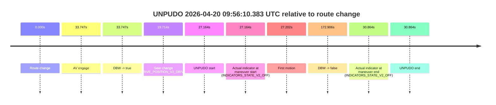
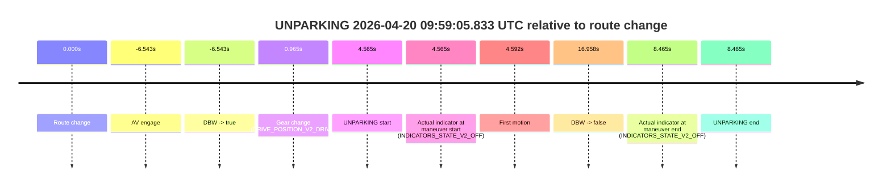
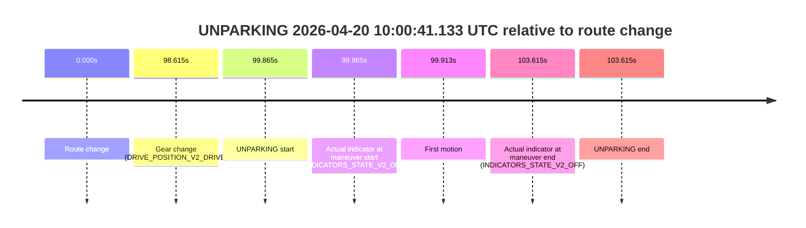

# Run Report: fme20018/2026-04-20--09-00-37--gen2-av-9d3948fe-361b-43bf-ba1a-bcfeb17f087f

| Field | Value |
|---|---|
| Run ID | `fme20018/2026-04-20--09-00-37--gen2-av-9d3948fe-361b-43bf-ba1a-bcfeb17f087f` |
| Date | `2026-04-20` |
| Model(s) | `pink-manta-ray-smooth` |
| Author | `guy.geva` |
| Event count | `3` |

## unpudo 2026-04-20 09:56:10.383 UTC

| Field | Value |
|---|---|
| Model | `pink-manta-ray-smooth` |
| Author | `guy.geva` |
| Run ID | `fme20018/2026-04-20--09-00-37--gen2-av-9d3948fe-361b-43bf-ba1a-bcfeb17f087f` |
| Date | `2026-04-20` |
| Time (UTC) | `09:56:10.383` |
| Event type | `unpudo` |
| Disengagement type | `none observed` |
| Route change | `found` |
| Console | [run](https://console.sso.wayve.ai/run/fme20018/2026-04-20--09-00-37--gen2-av-9d3948fe-361b-43bf-ba1a-bcfeb17f087f?id=&time-unixus=1776678970383317) |
| Foxglove | [segment](https://app.foxglove.dev/wayve-on-prem/p/prj_0dX18KZdVHg1fmmI/view?ds=foxglove-stream&ds.deviceName=fme20018&ds.start=2026-04-20T09%3A55%3A33.219010Z&ds.end=2026-04-20T09%3A58%3A46.125124Z&layoutId=lay_0e7VD4WIKDQGU73Y&time=2026-04-20T09%3A56%3A10.383317Z) |

### Event card: non-av

- Non-AV: there is no AV-owned portion anywhere inside the detected unpudo timeline, so it is kept for coverage but excluded from model success / failure scoring.

| Event | Time (UTC) | Delta from route change |
|---|---:|---:|
| Route change | 2026-04-20 09:55:43.219 | `0.000s` |
| AV engage | 2026-04-20 09:56:16.965 | `33.747s` |
| DBW -> true | 2026-04-20 09:56:16.965 | `33.747s` |
| Gear change (DRIVE_POSITION_V2_DRIVE) | 2026-04-20 09:56:02.933 | `19.714s` |
| UNPUDO start | 2026-04-20 09:56:10.383 | `27.164s` |
| Actual indicator at maneuver start (INDICATORS_STATE_V2_OFF) | 2026-04-20 09:56:10.383 | `27.164s` |
| First motion | 2026-04-20 09:56:10.421 | `27.202s` |
| DBW -> false | 2026-04-20 09:58:36.125 | `172.906s` |
| Actual indicator at maneuver end (INDICATORS_STATE_V2_OFF) | 2026-04-20 09:56:14.083 | `30.864s` |
| UNPUDO end | 2026-04-20 09:56:14.083 | `30.864s` |

| Metric | Value |
|---|---|
| Outcome | `non-av` |
| Effective failure type | `none` |
| Route change status | `found` |
| DBW at event start | `false` |
| DBW at event end | `false` |
| Predicted gear at AV start | `DRIVE_POSITION_V2_DRIVE` |
| Actual gear at AV start | `DRIVE_POSITION_V2_DRIVE` |
| Predicted gear at event start | `DRIVE_POSITION_V2_DRIVE` |
| Actual gear at event start | `DRIVE_POSITION_V2_DRIVE` |
| Planned indicator direction | `INDICATORS_STATE_V2_RIGHT_ON` |
| Controller indicator direction | `INDICATORS_STATE_V2_RIGHT_ON` |
| Actual indicator direction | `INDICATORS_STATE_V2_OFF` |
| Actual indicator at maneuver end | `INDICATORS_STATE_V2_OFF` |
| Driver accel help in AV | `false` |
| Driver accel help timestamp | `n/a` |
| Max accel pedal pct in AV | `0.0%` |
| Max brake pedal pct in AV | `0.0%` |
| Max speed mps in AV | `0.000` |
| Route -> AV | `33.747s` |
| AV -> event start | `-6.582s` |
| AV -> first motion | `-6.544s` |
| AV duration before disengagement | `139.159s` |
| Trajectory waypoint count | `34` |
| Driving-plan step count | `11` |

The scored portion starts from the AV-owned window, not from the pre-AV setup. Route-change search in the stopped pre-event segment was `found`, with the baseline therefore set to route change. At the event anchor the model predicts `DRIVE_POSITION_V2_DRIVE` and the actual gear is `DRIVE_POSITION_V2_DRIVE`. The effective model outcome is `non-av` because `there is no AV-owned overlap inside the event timeline`.

### Resolution

| Field | Value |
|---|---|
| Final outcome | `non-av` |
| Do we agree with this label? | `yes` |
| Source disengagement type | `none observed` |
| Resolved effective failure type | `none` |
| Confidence | `high` |

## unparking 2026-04-20 09:59:05.833 UTC

| Field | Value |
|---|---|
| Model | `pink-manta-ray-smooth` |
| Author | `guy.geva` |
| Run ID | `fme20018/2026-04-20--09-00-37--gen2-av-9d3948fe-361b-43bf-ba1a-bcfeb17f087f` |
| Date | `2026-04-20` |
| Time (UTC) | `09:59:05.833` |
| Event type | `unparking` |
| Disengagement type | `none observed` |
| Route change | `found` |
| Console | [run](https://console.sso.wayve.ai/run/fme20018/2026-04-20--09-00-37--gen2-av-9d3948fe-361b-43bf-ba1a-bcfeb17f087f?id=&time-unixus=1776679145833296) |
| Foxglove | [segment](https://app.foxglove.dev/wayve-on-prem/p/prj_0dX18KZdVHg1fmmI/view?ds=foxglove-stream&ds.deviceName=fme20018&ds.start=2026-04-20T09%3A58%3A44.725225Z&ds.end=2026-04-20T09%3A59%3A28.226202Z&layoutId=lay_0e7VD4WIKDQGU73Y&time=2026-04-20T09%3A59%3A05.833296Z) |

### Event card: pass

- Pass: AV owns the credited unparking through the official event window, the gear state is aligned at the anchor, and the vehicle moves without driver accelerator help in AV.

| Event | Time (UTC) | Delta from route change |
|---|---:|---:|
| Route change | 2026-04-20 09:59:01.268 | `0.000s` |
| AV engage | 2026-04-20 09:58:54.725 | `-6.543s` |
| DBW -> true | 2026-04-20 09:58:54.725 | `-6.543s` |
| Gear change (DRIVE_POSITION_V2_DRIVE) | 2026-04-20 09:59:02.233 | `0.965s` |
| UNPARKING start | 2026-04-20 09:59:05.833 | `4.565s` |
| Actual indicator at maneuver start (INDICATORS_STATE_V2_OFF) | 2026-04-20 09:59:05.833 | `4.565s` |
| First motion | 2026-04-20 09:59:05.860 | `4.592s` |
| DBW -> false | 2026-04-20 09:59:18.226 | `16.958s` |
| Actual indicator at maneuver end (INDICATORS_STATE_V2_OFF) | 2026-04-20 09:59:09.733 | `8.465s` |
| UNPARKING end | 2026-04-20 09:59:09.733 | `8.465s` |

| Metric | Value |
|---|---|
| Outcome | `pass` |
| Effective failure type | `none` |
| Route change status | `found` |
| DBW at event start | `true` |
| DBW at event end | `true` |
| Predicted gear at AV start | `DRIVE_POSITION_V2_REVERSE` |
| Actual gear at AV start | `DRIVE_POSITION_V2_DRIVE` |
| Predicted gear at event start | `DRIVE_POSITION_V2_DRIVE` |
| Actual gear at event start | `DRIVE_POSITION_V2_DRIVE` |
| Planned indicator direction | `INDICATORS_STATE_V2_LEFT_ON` |
| Controller indicator direction | `INDICATORS_STATE_V2_LEFT_ON` |
| Actual indicator direction | `INDICATORS_STATE_V2_OFF` |
| Actual indicator at maneuver end | `INDICATORS_STATE_V2_OFF` |
| Driver accel help in AV | `false` |
| Driver accel help timestamp | `n/a` |
| Max accel pedal pct in AV | `0.0%` |
| Max brake pedal pct in AV | `0.0%` |
| Max speed mps in AV | `4.531` |
| Route -> AV | `-6.543s` |
| AV -> event start | `11.108s` |
| AV -> first motion | `11.136s` |
| AV duration before disengagement | `23.501s` |
| Trajectory waypoint count | `37` |
| Driving-plan step count | `11` |

The scored portion starts from the AV-owned window, not from the pre-AV setup. Route-change search in the stopped pre-event segment was `found`, with the baseline therefore set to route change. At the event anchor the model predicts `DRIVE_POSITION_V2_DRIVE` and the actual gear is `DRIVE_POSITION_V2_DRIVE`. The effective model outcome is `pass` because `the credited maneuver stays AV-owned through the official event end`.

### Resolution

| Field | Value |
|---|---|
| Final outcome | `pass` |
| Do we agree with this label? | `yes` |
| Source disengagement type | `none observed` |
| Resolved effective failure type | `none` |
| Confidence | `high` |

## unparking 2026-04-20 10:00:41.133 UTC

| Field | Value |
|---|---|
| Model | `pink-manta-ray-smooth` |
| Author | `guy.geva` |
| Run ID | `fme20018/2026-04-20--09-00-37--gen2-av-9d3948fe-361b-43bf-ba1a-bcfeb17f087f` |
| Date | `2026-04-20` |
| Time (UTC) | `10:00:41.133` |
| Event type | `unparking` |
| Disengagement type | `none observed` |
| Route change | `found` |
| Console | [run](https://console.sso.wayve.ai/run/fme20018/2026-04-20--09-00-37--gen2-av-9d3948fe-361b-43bf-ba1a-bcfeb17f087f?id=&time-unixus=1776679241133312) |
| Foxglove | [segment](https://app.foxglove.dev/wayve-on-prem/p/prj_0dX18KZdVHg1fmmI/view?ds=foxglove-stream&ds.deviceName=fme20018&ds.start=2026-04-20T09%3A58%3A51.268266Z&ds.end=2026-04-20T10%3A00%3A54.883324Z&layoutId=lay_0e7VD4WIKDQGU73Y&time=2026-04-20T10%3A00%3A41.133312Z) |

### Event card: non-av

- Non-AV: there is no AV-owned portion anywhere inside the detected unparking timeline, so it is kept for coverage but excluded from model success / failure scoring.

| Event | Time (UTC) | Delta from route change |
|---|---:|---:|
| Route change | 2026-04-20 09:59:01.268 | `0.000s` |
| Gear change (DRIVE_POSITION_V2_DRIVE) | 2026-04-20 10:00:39.883 | `98.615s` |
| UNPARKING start | 2026-04-20 10:00:41.133 | `99.865s` |
| Actual indicator at maneuver start (INDICATORS_STATE_V2_OFF) | 2026-04-20 10:00:41.133 | `99.865s` |
| First motion | 2026-04-20 10:00:41.181 | `99.913s` |
| Actual indicator at maneuver end (INDICATORS_STATE_V2_OFF) | 2026-04-20 10:00:44.883 | `103.615s` |
| UNPARKING end | 2026-04-20 10:00:44.883 | `103.615s` |

| Metric | Value |
|---|---|
| Outcome | `non-av` |
| Effective failure type | `none` |
| Route change status | `found` |
| DBW at event start | `false` |
| DBW at event end | `false` |
| Predicted gear at AV start | `n/a` |
| Actual gear at AV start | `n/a` |
| Predicted gear at event start | `DRIVE_POSITION_V2_DRIVE` |
| Actual gear at event start | `DRIVE_POSITION_V2_DRIVE` |
| Planned indicator direction | `INDICATORS_STATE_V2_OFF` |
| Controller indicator direction | `INDICATORS_STATE_V2_OFF` |
| Actual indicator direction | `INDICATORS_STATE_V2_OFF` |
| Actual indicator at maneuver end | `INDICATORS_STATE_V2_OFF` |
| Driver accel help in AV | `false` |
| Driver accel help timestamp | `n/a` |
| Max accel pedal pct in AV | `0.0%` |
| Max brake pedal pct in AV | `0.0%` |
| Max speed mps in AV | `0.000` |
| Route -> AV | `n/a` |
| AV -> event start | `n/a` |
| AV -> first motion | `n/a` |
| AV duration before disengagement | `n/a` |
| Trajectory waypoint count | `35` |
| Driving-plan step count | `11` |

The scored portion starts from the AV-owned window, not from the pre-AV setup. Route-change search in the stopped pre-event segment was `found`, with the baseline therefore set to route change. At the event anchor the model predicts `DRIVE_POSITION_V2_DRIVE` and the actual gear is `DRIVE_POSITION_V2_DRIVE`. The effective model outcome is `non-av` because `there is no AV-owned overlap inside the event timeline`.

### Resolution

| Field | Value |
|---|---|
| Final outcome | `non-av` |
| Do we agree with this label? | `yes` |
| Source disengagement type | `none observed` |
| Resolved effective failure type | `none` |
| Confidence | `high` |
