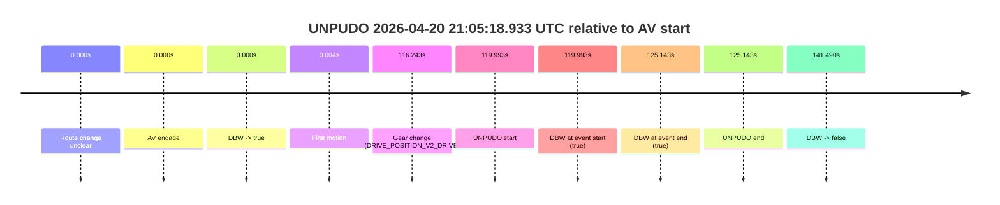
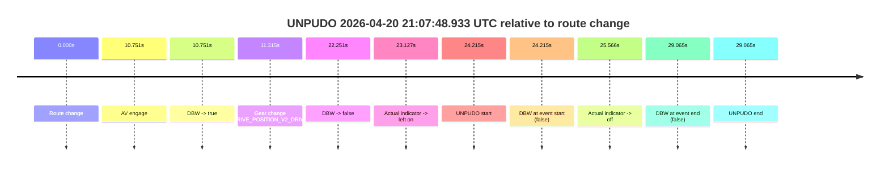
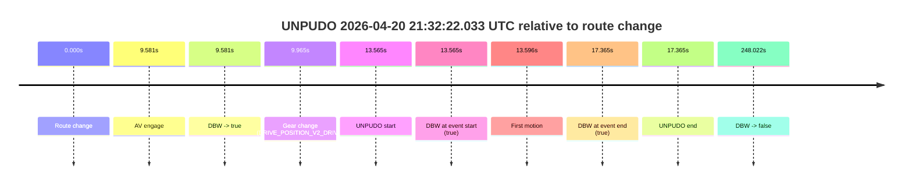
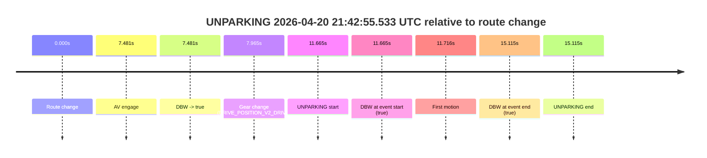

# Run Report: fme20018/2026-04-20--20-25-52--gen2-av-bde726d1-f8d5-44e8-bb18-1148d67fb8fa

| Field | Value |
|---|---|
| Run ID | `fme20018/2026-04-20--20-25-52--gen2-av-bde726d1-f8d5-44e8-bb18-1148d67fb8fa` |
| Date | `2026-04-20` |
| Model(s) | `eel-teal-outspoken` |
| Author | `zak` |
| Event count | `5` |

## unpudo 2026-04-20 20:46:32.033 UTC

| Field | Value |
|---|---|
| Model | `eel-teal-outspoken` |
| Author | `zak` |
| Run ID | `fme20018/2026-04-20--20-25-52--gen2-av-bde726d1-f8d5-44e8-bb18-1148d67fb8fa` |
| Date | `2026-04-20` |
| Time (UTC) | `20:46:32.033` |
| Event type | `unpudo` |
| Disengagement type | `none observed` |
| Route change | `found` |
| Console | [run](https://console.sso.wayve.ai/run/fme20018/2026-04-20--20-25-52--gen2-av-bde726d1-f8d5-44e8-bb18-1148d67fb8fa?id=&time-unixus=1776717992033312) |
| Foxglove | [segment](https://app.foxglove.dev/wayve-on-prem/p/prj_0dX18KZdVHg1fmmI/view?ds=foxglove-stream&ds.deviceName=fme20018&ds.start=2026-04-20T20%3A45%3A56.568283Z&ds.end=2026-04-20T20%3A49%3A53.189446Z&layoutId=lay_0e7VD4WIKDQGU73Y&time=2026-04-20T20%3A46%3A32.033312Z) |

### Event card: pass

- Pass: AV owns the credited unpudo from route change through the official unpudo window, the gear state is aligned at the anchor, and the vehicle moves without driver accelerator help in AV.

| Event | Time (UTC) | Delta from route change |
|---|---:|---:|
| Route change | 2026-04-20 20:46:06.568 | `0.000s` |
| AV engage | 2026-04-20 20:46:28.009 | `21.441s` |
| DBW -> true | 2026-04-20 20:46:28.009 | `21.441s` |
| Gear change (DRIVE_POSITION_V2_DRIVE) | 2026-04-20 20:46:28.483 | `21.915s` |
| UNPUDO start | 2026-04-20 20:46:32.033 | `25.465s` |
| DBW at event start (true) | 2026-04-20 20:46:32.033 | `25.465s` |
| First motion | 2026-04-20 20:46:32.084 | `25.516s` |
| DBW at event end (true) | 2026-04-20 20:46:35.433 | `28.865s` |
| UNPUDO end | 2026-04-20 20:46:35.433 | `28.865s` |
| DBW -> false | 2026-04-20 20:49:43.189 | `216.621s` |

| Metric | Value |
|---|---|
| Outcome | `pass` |
| Effective failure type | `none` |
| Route change status | `found` |
| DBW at event start | `true` |
| DBW at event end | `true` |
| Predicted gear at AV start | `DRIVE_POSITION_V2_DRIVE` |
| Actual gear at AV start | `DRIVE_POSITION_V2_PARK` |
| Predicted gear at event start | `DRIVE_POSITION_V2_DRIVE` |
| Actual gear at event start | `DRIVE_POSITION_V2_DRIVE` |
| Planned indicator direction | `INDICATORS_STATE_V2_RIGHT_ON` |
| Controller indicator direction | `INDICATORS_STATE_V2_RIGHT_ON` |
| Actual indicator direction | `INDICATORS_STATE_V2_OFF` |
| Actual indicator at maneuver end | `INDICATORS_STATE_V2_OFF` |
| Driver accel help in AV | `false` |
| Driver accel help timestamp | `n/a` |
| Max accel pedal pct in AV | `0.0%` |
| Max brake pedal pct in AV | `8.0%` |
| Max speed mps in AV | `5.386` |
| Success timing baseline | `route change` |
| Route -> AV | `21.441s` |
| AV -> event start | `4.024s` |
| AV -> first motion | `4.075s` |
| Success baseline -> event start | `25.465s` |
| Success baseline -> first motion | `25.516s` |
| AV duration before disengagement | `195.180s` |
| Trajectory waypoint count | `36` |
| Driving-plan step count | `11` |

The scored portion starts from the AV-owned window, not from the pre-AV setup. Route-change search in the stopped pre-event segment was `found`, with the baseline therefore set to route change. At the event anchor the model predicts `DRIVE_POSITION_V2_DRIVE` and the actual gear is `DRIVE_POSITION_V2_DRIVE`. The effective model outcome is `pass` because `the credited unpudo stays AV-owned through the official unpudo window.`

### Resolution

| Field | Value |
|---|---|
| Final outcome | `pass` |
| Do we agree with this label? | `yes` |
| Source disengagement type | `none observed` |
| Resolved effective failure type | `none` |
| Confidence | `high` |

## unpudo 2026-04-20 21:05:18.933 UTC

| Field | Value |
|---|---|
| Model | `eel-teal-outspoken` |
| Author | `zak` |
| Run ID | `fme20018/2026-04-20--20-25-52--gen2-av-bde726d1-f8d5-44e8-bb18-1148d67fb8fa` |
| Date | `2026-04-20` |
| Time (UTC) | `21:05:18.933` |
| Event type | `unpudo` |
| Disengagement type | `none observed` |
| Route change | `unclear` |
| Console | [run](https://console.sso.wayve.ai/run/fme20018/2026-04-20--20-25-52--gen2-av-bde726d1-f8d5-44e8-bb18-1148d67fb8fa?id=&time-unixus=1776719118933306) |
| Foxglove | [segment](https://app.foxglove.dev/wayve-on-prem/p/prj_0dX18KZdVHg1fmmI/view?ds=foxglove-stream&ds.deviceName=fme20018&ds.start=2026-04-20T21%3A03%3A08.940651Z&ds.end=2026-04-20T21%3A05%3A50.430956Z&layoutId=lay_0e7VD4WIKDQGU73Y&time=2026-04-20T21%3A05%3A18.933306Z) |

### Event card: pass

- Pass: AV owns the credited unpudo from route change through the official unpudo window, the gear state is aligned at the anchor, and the vehicle moves without driver accelerator help in AV.

| Event | Time (UTC) | Delta from AV start |
|---|---:|---:|
| Route change unclear | 2026-04-20 21:03:18.940 | `0.000s` |
| AV engage | 2026-04-20 21:03:18.940 | `0.000s` |
| DBW -> true | 2026-04-20 21:03:18.940 | `0.000s` |
| First motion | 2026-04-20 21:03:18.944 | `0.004s` |
| Gear change (DRIVE_POSITION_V2_DRIVE) | 2026-04-20 21:05:15.183 | `116.243s` |
| UNPUDO start | 2026-04-20 21:05:18.933 | `119.993s` |
| DBW at event start (true) | 2026-04-20 21:05:18.933 | `119.993s` |
| DBW at event end (true) | 2026-04-20 21:05:24.083 | `125.143s` |
| UNPUDO end | 2026-04-20 21:05:24.083 | `125.143s` |
| DBW -> false | 2026-04-20 21:05:40.430 | `141.490s` |

| Metric | Value |
|---|---|
| Outcome | `pass` |
| Effective failure type | `none` |
| Route change status | `unclear` |
| DBW at event start | `true` |
| DBW at event end | `true` |
| Predicted gear at AV start | `DRIVE_POSITION_V2_DRIVE` |
| Actual gear at AV start | `DRIVE_POSITION_V2_DRIVE` |
| Predicted gear at event start | `DRIVE_POSITION_V2_DRIVE` |
| Actual gear at event start | `DRIVE_POSITION_V2_DRIVE` |
| Planned indicator direction | `INDICATORS_STATE_V2_RIGHT_ON` |
| Controller indicator direction | `INDICATORS_STATE_V2_RIGHT_ON` |
| Actual indicator direction | `INDICATORS_STATE_V2_OFF` |
| Actual indicator at maneuver end | `INDICATORS_STATE_V2_OFF` |
| Driver accel help in AV | `false` |
| Driver accel help timestamp | `n/a` |
| Max accel pedal pct in AV | `0.0%` |
| Max brake pedal pct in AV | `14.2%` |
| Max speed mps in AV | `7.719` |
| Success timing baseline | `AV start` |
| Route -> AV | `n/a` |
| AV -> event start | `119.993s` |
| AV -> first motion | `0.004s` |
| Success baseline -> event start | `119.993s` |
| Success baseline -> first motion | `0.004s` |
| AV duration before disengagement | `141.490s` |
| Trajectory waypoint count | `36` |
| Driving-plan step count | `11` |

The scored portion starts from the AV-owned window, not from the pre-AV setup. Route-change search in the stopped pre-event segment was `unclear`, with the baseline therefore set to AV start. At the event anchor the model predicts `DRIVE_POSITION_V2_DRIVE` and the actual gear is `DRIVE_POSITION_V2_DRIVE`. The effective model outcome is `pass` because `the credited unpudo stays AV-owned through the official unpudo window.`

### Resolution

| Field | Value |
|---|---|
| Final outcome | `pass` |
| Do we agree with this label? | `yes` |
| Source disengagement type | `none observed` |
| Resolved effective failure type | `none` |
| Confidence | `medium` |

## unpudo 2026-04-20 21:07:48.933 UTC

| Field | Value |
|---|---|
| Model | `eel-teal-outspoken` |
| Author | `zak` |
| Run ID | `fme20018/2026-04-20--20-25-52--gen2-av-bde726d1-f8d5-44e8-bb18-1148d67fb8fa` |
| Date | `2026-04-20` |
| Time (UTC) | `21:07:48.933` |
| Event type | `unpudo` |
| Disengagement type | `none observed` |
| Route change | `found` |
| Console | [run](https://console.sso.wayve.ai/run/fme20018/2026-04-20--20-25-52--gen2-av-bde726d1-f8d5-44e8-bb18-1148d67fb8fa?id=&time-unixus=1776719268933309) |
| Foxglove | [segment](https://app.foxglove.dev/wayve-on-prem/p/prj_0dX18KZdVHg1fmmI/view?ds=foxglove-stream&ds.deviceName=fme20018&ds.start=2026-04-20T21%3A07%3A14.718238Z&ds.end=2026-04-20T21%3A08%3A03.783310Z&layoutId=lay_0e7VD4WIKDQGU73Y&time=2026-04-20T21%3A07%3A48.933309Z) |

### Event card: fail

- Fail: the credited unpudo does not stay AV-owned. The event window starts with DBW false, and the maneuver outcome lands outside a clean AV-owned segment.

| Event | Time (UTC) | Delta from route change |
|---|---:|---:|
| Route change | 2026-04-20 21:07:24.718 | `0.000s` |
| AV engage | 2026-04-20 21:07:35.469 | `10.751s` |
| DBW -> true | 2026-04-20 21:07:35.469 | `10.751s` |
| Gear change (DRIVE_POSITION_V2_DRIVE) | 2026-04-20 21:07:36.033 | `11.315s` |
| DBW -> false | 2026-04-20 21:07:46.969 | `22.251s` |
| Actual indicator -> left on | 2026-04-20 21:07:47.844 | `23.127s` |
| UNPUDO start | 2026-04-20 21:07:48.933 | `24.215s` |
| DBW at event start (false) | 2026-04-20 21:07:48.933 | `24.215s` |
| Actual indicator -> off | 2026-04-20 21:07:50.284 | `25.566s` |
| DBW at event end (false) | 2026-04-20 21:07:53.783 | `29.065s` |
| UNPUDO end | 2026-04-20 21:07:53.783 | `29.065s` |

| Metric | Value |
|---|---|
| Outcome | `fail` |
| Effective failure type | `not_av_owned` |
| Route change status | `found` |
| DBW at event start | `false` |
| DBW at event end | `false` |
| Predicted gear at AV start | `DRIVE_POSITION_V2_DRIVE` |
| Actual gear at AV start | `DRIVE_POSITION_V2_PARK` |
| Predicted gear at event start | `DRIVE_POSITION_V2_DRIVE` |
| Actual gear at event start | `DRIVE_POSITION_V2_DRIVE` |
| Planned indicator direction | `INDICATORS_STATE_V2_LEFT_ON` |
| Controller indicator direction | `INDICATORS_STATE_V2_LEFT_ON` |
| Actual indicator direction | `INDICATORS_STATE_V2_LEFT_ON` |
| Actual indicator at maneuver end | `INDICATORS_STATE_V2_OFF` |
| Driver accel help in AV | `false` |
| Driver accel help timestamp | `n/a` |
| Max accel pedal pct in AV | `0.0%` |
| Max brake pedal pct in AV | `8.5%` |
| Max speed mps in AV | `0.000` |
| Success timing baseline | `route change` |
| Route -> AV | `10.751s` |
| AV -> event start | `13.464s` |
| AV -> first motion | `n/a` |
| Success baseline -> event start | `24.215s` |
| Success baseline -> first motion | `n/a` |
| AV duration before disengagement | `11.500s` |
| Trajectory waypoint count | `38` |
| Driving-plan step count | `11` |

The scored portion starts from the AV-owned window, not from the pre-AV setup. Route-change search in the stopped pre-event segment was `found`, with the baseline therefore set to route change. At the event anchor the model predicts `DRIVE_POSITION_V2_DRIVE` and the actual gear is `DRIVE_POSITION_V2_DRIVE`. The effective model outcome is `fail` because `not_av_owned.`

### Resolution

| Field | Value |
|---|---|
| Final outcome | `fail` |
| Do we agree with this label? | `yes` |
| Source disengagement type | `none observed` |
| Resolved effective failure type | `not_av_owned` |
| Confidence | `high` |

## unpudo 2026-04-20 21:32:22.033 UTC

| Field | Value |
|---|---|
| Model | `eel-teal-outspoken` |
| Author | `zak` |
| Run ID | `fme20018/2026-04-20--20-25-52--gen2-av-bde726d1-f8d5-44e8-bb18-1148d67fb8fa` |
| Date | `2026-04-20` |
| Time (UTC) | `21:32:22.033` |
| Event type | `unpudo` |
| Disengagement type | `none observed` |
| Route change | `found` |
| Console | [run](https://console.sso.wayve.ai/run/fme20018/2026-04-20--20-25-52--gen2-av-bde726d1-f8d5-44e8-bb18-1148d67fb8fa?id=&time-unixus=1776720742033306) |
| Foxglove | [segment](https://app.foxglove.dev/wayve-on-prem/p/prj_0dX18KZdVHg1fmmI/view?ds=foxglove-stream&ds.deviceName=fme20018&ds.start=2026-04-20T21%3A31%3A58.468388Z&ds.end=2026-04-20T21%3A36%3A26.490669Z&layoutId=lay_0e7VD4WIKDQGU73Y&time=2026-04-20T21%3A32%3A22.033306Z) |

### Event card: pass

- Pass: AV owns the credited unpudo from route change through the official unpudo window, the gear state is aligned at the anchor, and the vehicle moves without driver accelerator help in AV.

| Event | Time (UTC) | Delta from route change |
|---|---:|---:|
| Route change | 2026-04-20 21:32:08.468 | `0.000s` |
| AV engage | 2026-04-20 21:32:18.049 | `9.581s` |
| DBW -> true | 2026-04-20 21:32:18.049 | `9.581s` |
| Gear change (DRIVE_POSITION_V2_DRIVE) | 2026-04-20 21:32:18.433 | `9.965s` |
| UNPUDO start | 2026-04-20 21:32:22.033 | `13.565s` |
| DBW at event start (true) | 2026-04-20 21:32:22.033 | `13.565s` |
| First motion | 2026-04-20 21:32:22.064 | `13.596s` |
| DBW at event end (true) | 2026-04-20 21:32:25.833 | `17.365s` |
| UNPUDO end | 2026-04-20 21:32:25.833 | `17.365s` |
| DBW -> false | 2026-04-20 21:36:16.490 | `248.022s` |

| Metric | Value |
|---|---|
| Outcome | `pass` |
| Effective failure type | `none` |
| Route change status | `found` |
| DBW at event start | `true` |
| DBW at event end | `true` |
| Predicted gear at AV start | `DRIVE_POSITION_V2_PARK` |
| Actual gear at AV start | `DRIVE_POSITION_V2_PARK` |
| Predicted gear at event start | `DRIVE_POSITION_V2_DRIVE` |
| Actual gear at event start | `DRIVE_POSITION_V2_DRIVE` |
| Planned indicator direction | `INDICATORS_STATE_V2_RIGHT_ON` |
| Controller indicator direction | `INDICATORS_STATE_V2_RIGHT_ON` |
| Actual indicator direction | `INDICATORS_STATE_V2_OFF` |
| Actual indicator at maneuver end | `INDICATORS_STATE_V2_OFF` |
| Driver accel help in AV | `false` |
| Driver accel help timestamp | `n/a` |
| Max accel pedal pct in AV | `0.0%` |
| Max brake pedal pct in AV | `9.5%` |
| Max speed mps in AV | `3.417` |
| Success timing baseline | `route change` |
| Route -> AV | `9.581s` |
| AV -> event start | `3.984s` |
| AV -> first motion | `4.015s` |
| Success baseline -> event start | `13.565s` |
| Success baseline -> first motion | `13.596s` |
| AV duration before disengagement | `238.441s` |
| Trajectory waypoint count | `38` |
| Driving-plan step count | `11` |

The scored portion starts from the AV-owned window, not from the pre-AV setup. Route-change search in the stopped pre-event segment was `found`, with the baseline therefore set to route change. At the event anchor the model predicts `DRIVE_POSITION_V2_DRIVE` and the actual gear is `DRIVE_POSITION_V2_DRIVE`. The effective model outcome is `pass` because `the credited unpudo stays AV-owned through the official unpudo window.`

### Resolution

| Field | Value |
|---|---|
| Final outcome | `pass` |
| Do we agree with this label? | `yes` |
| Source disengagement type | `none observed` |
| Resolved effective failure type | `none` |
| Confidence | `high` |

## unparking 2026-04-20 21:42:55.533 UTC

| Field | Value |
|---|---|
| Model | `eel-teal-outspoken` |
| Author | `zak` |
| Run ID | `fme20018/2026-04-20--20-25-52--gen2-av-bde726d1-f8d5-44e8-bb18-1148d67fb8fa` |
| Date | `2026-04-20` |
| Time (UTC) | `21:42:55.533` |
| Event type | `unparking` |
| Disengagement type | `none observed` |
| Route change | `found` |
| Console | [run](https://console.sso.wayve.ai/run/fme20018/2026-04-20--20-25-52--gen2-av-bde726d1-f8d5-44e8-bb18-1148d67fb8fa?id=&time-unixus=1776721375533320) |
| Foxglove | [segment](https://app.foxglove.dev/wayve-on-prem/p/prj_0dX18KZdVHg1fmmI/view?ds=foxglove-stream&ds.deviceName=fme20018&ds.start=2026-04-20T21%3A42%3A33.868472Z&ds.end=2026-04-20T21%3A43%3A08.983297Z&layoutId=lay_0e7VD4WIKDQGU73Y&time=2026-04-20T21%3A42%3A55.533320Z) |

### Event card: pass

- Pass: AV owns the credited unparking through the official event window, the gear state is aligned at the anchor, and the vehicle moves without driver accelerator help in AV.

| Event | Time (UTC) | Delta from route change |
|---|---:|---:|
| Route change | 2026-04-20 21:42:43.868 | `0.000s` |
| AV engage | 2026-04-20 21:42:51.349 | `7.481s` |
| DBW -> true | 2026-04-20 21:42:51.349 | `7.481s` |
| Gear change (DRIVE_POSITION_V2_DRIVE) | 2026-04-20 21:42:51.833 | `7.965s` |
| UNPARKING start | 2026-04-20 21:42:55.533 | `11.665s` |
| DBW at event start (true) | 2026-04-20 21:42:55.533 | `11.665s` |
| First motion | 2026-04-20 21:42:55.584 | `11.716s` |
| DBW at event end (true) | 2026-04-20 21:42:58.983 | `15.115s` |
| UNPARKING end | 2026-04-20 21:42:58.983 | `15.115s` |

| Metric | Value |
|---|---|
| Outcome | `pass` |
| Effective failure type | `none` |
| Route change status | `found` |
| DBW at event start | `true` |
| DBW at event end | `true` |
| Predicted gear at AV start | `DRIVE_POSITION_V2_DRIVE` |
| Actual gear at AV start | `DRIVE_POSITION_V2_PARK` |
| Predicted gear at event start | `DRIVE_POSITION_V2_DRIVE` |
| Actual gear at event start | `DRIVE_POSITION_V2_DRIVE` |
| Planned indicator direction | `INDICATORS_STATE_V2_RIGHT_ON` |
| Controller indicator direction | `INDICATORS_STATE_V2_RIGHT_ON` |
| Actual indicator direction | `INDICATORS_STATE_V2_OFF` |
| Actual indicator at maneuver end | `INDICATORS_STATE_V2_OFF` |
| Driver accel help in AV | `false` |
| Driver accel help timestamp | `n/a` |
| Max accel pedal pct in AV | `0.0%` |
| Max brake pedal pct in AV | `0.0%` |
| Max speed mps in AV | `4.836` |
| Success timing baseline | `route change` |
| Route -> AV | `7.481s` |
| AV -> event start | `4.183s` |
| AV -> first motion | `4.235s` |
| Success baseline -> event start | `11.665s` |
| Success baseline -> first motion | `11.716s` |
| AV duration before disengagement | `n/a` |
| Trajectory waypoint count | `38` |
| Driving-plan step count | `11` |

The scored portion starts from the AV-owned window, not from the pre-AV setup. Route-change search in the stopped pre-event segment was `found`, with the baseline therefore set to route change. At the event anchor the model predicts `DRIVE_POSITION_V2_DRIVE` and the actual gear is `DRIVE_POSITION_V2_DRIVE`. The effective model outcome is `pass` because `the credited maneuver stays AV-owned through the official event end.`

### Resolution

| Field | Value |
|---|---|
| Final outcome | `pass` |
| Do we agree with this label? | `yes` |
| Source disengagement type | `none observed` |
| Resolved effective failure type | `none` |
| Confidence | `high` |
