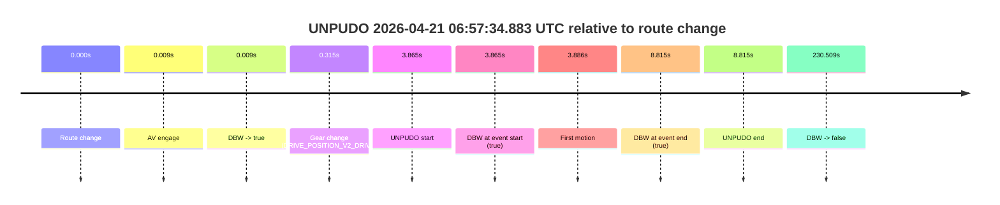
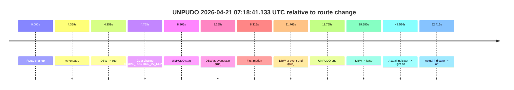
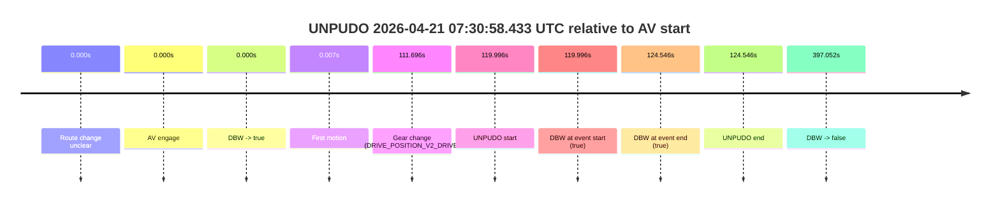
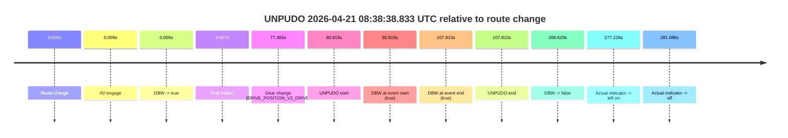
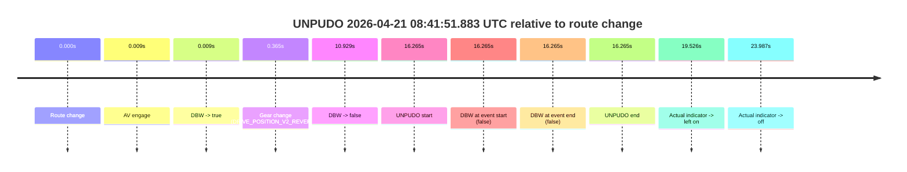
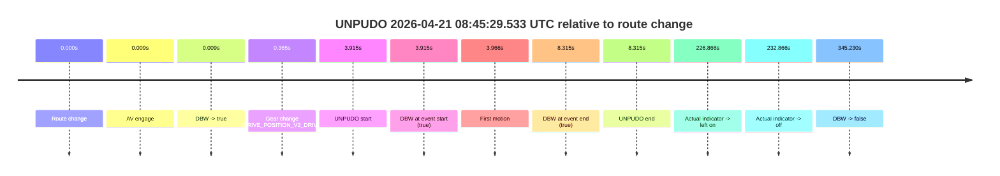
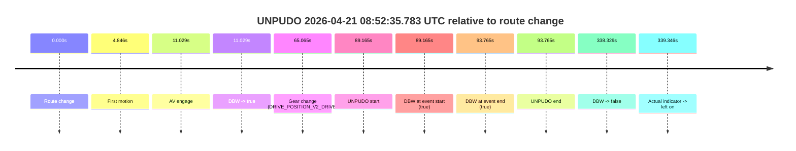
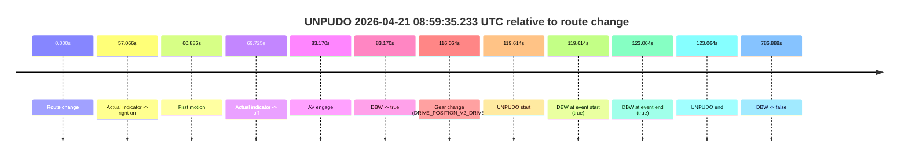
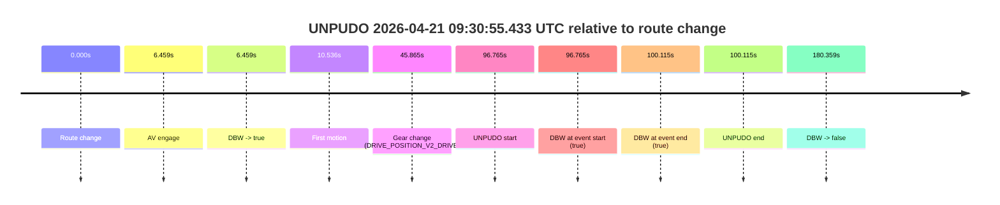

# Run Report: fme20018/2026-04-21--06-51-38--gen2-av-3b338e2e-43c9-46a2-8a76-6d485e5558ee

| Field | Value |
|---|---|
| Run ID | `fme20018/2026-04-21--06-51-38--gen2-av-3b338e2e-43c9-46a2-8a76-6d485e5558ee` |
| Date | `2026-04-21` |
| Model(s) | `eel-teal-outspoken` |
| Author | `zak` |
| Event count | `15` |

## unpudo 2026-04-21 06:57:34.883 UTC

| Field | Value |
|---|---|
| Model | `eel-teal-outspoken` |
| Author | `zak` |
| Run ID | `fme20018/2026-04-21--06-51-38--gen2-av-3b338e2e-43c9-46a2-8a76-6d485e5558ee` |
| Date | `2026-04-21` |
| Time (UTC) | `06:57:34.883` |
| Event type | `unpudo` |
| Disengagement type | `none observed` |
| Route change | `found` |
| Console | [run](https://console.sso.wayve.ai/run/fme20018/2026-04-21--06-51-38--gen2-av-3b338e2e-43c9-46a2-8a76-6d485e5558ee?id=&time-unixus=1776754654883294) |
| Foxglove | [segment](https://app.foxglove.dev/wayve-on-prem/p/prj_0dX18KZdVHg1fmmI/view?ds=foxglove-stream&ds.deviceName=fme20018&ds.start=2026-04-21T06%3A57%3A21.018340Z&ds.end=2026-04-21T07%3A01%3A31.527255Z&layoutId=lay_0e7VD4WIKDQGU73Y&time=2026-04-21T06%3A57%3A34.883294Z) |

### Event card: pass

- Pass: AV owns the credited unpudo from route change through the official unpudo window, the gear state is aligned at the anchor, and the vehicle moves without driver accelerator help in AV.

| Event | Time (UTC) | Delta from route change |
|---|---:|---:|
| Route change | 2026-04-21 06:57:31.018 | `0.000s` |
| AV engage | 2026-04-21 06:57:31.027 | `0.009s` |
| DBW -> true | 2026-04-21 06:57:31.027 | `0.009s` |
| Gear change (DRIVE_POSITION_V2_DRIVE) | 2026-04-21 06:57:31.333 | `0.315s` |
| UNPUDO start | 2026-04-21 06:57:34.883 | `3.865s` |
| DBW at event start (true) | 2026-04-21 06:57:34.883 | `3.865s` |
| First motion | 2026-04-21 06:57:34.904 | `3.886s` |
| DBW at event end (true) | 2026-04-21 06:57:39.833 | `8.815s` |
| UNPUDO end | 2026-04-21 06:57:39.833 | `8.815s` |
| DBW -> false | 2026-04-21 07:01:21.527 | `230.509s` |

| Metric | Value |
|---|---|
| Outcome | `pass` |
| Effective failure type | `none` |
| Route change status | `found` |
| DBW at event start | `true` |
| DBW at event end | `true` |
| Predicted gear at AV start | `DRIVE_POSITION_V2_PARK` |
| Actual gear at AV start | `DRIVE_POSITION_V2_PARK` |
| Predicted gear at event start | `DRIVE_POSITION_V2_DRIVE` |
| Actual gear at event start | `DRIVE_POSITION_V2_DRIVE` |
| Planned indicator direction | `INDICATORS_STATE_V2_RIGHT_ON` |
| Controller indicator direction | `INDICATORS_STATE_V2_RIGHT_ON` |
| Actual indicator direction | `INDICATORS_STATE_V2_OFF` |
| Actual indicator at maneuver end | `INDICATORS_STATE_V2_OFF` |
| Driver accel help in AV | `false` |
| Driver accel help timestamp | `n/a` |
| Max accel pedal pct in AV | `0.0%` |
| Max brake pedal pct in AV | `9.9%` |
| Max speed mps in AV | `2.822` |
| Success timing baseline | `route change` |
| Route -> AV | `0.009s` |
| AV -> event start | `3.856s` |
| AV -> first motion | `3.877s` |
| Success baseline -> event start | `3.865s` |
| Success baseline -> first motion | `3.886s` |
| AV duration before disengagement | `230.500s` |
| Trajectory waypoint count | `36` |
| Driving-plan step count | `11` |

The scored portion starts from the AV-owned window, not from the pre-AV setup. Route-change search in the stopped pre-event segment was `found`, with the baseline therefore set to route change. At the event anchor the model predicts `DRIVE_POSITION_V2_DRIVE` and the actual gear is `DRIVE_POSITION_V2_DRIVE`. The effective model outcome is `pass` because `the credited unpudo stays AV-owned through the official unpudo window.`

### Resolution

| Field | Value |
|---|---|
| Final outcome | `pass` |
| Do we agree with this label? | `yes` |
| Source disengagement type | `none observed` |
| Resolved effective failure type | `none` |
| Confidence | `high` |

## unpudo 2026-04-21 07:12:40.133 UTC

| Field | Value |
|---|---|
| Model | `eel-teal-outspoken` |
| Author | `zak` |
| Run ID | `fme20018/2026-04-21--06-51-38--gen2-av-3b338e2e-43c9-46a2-8a76-6d485e5558ee` |
| Date | `2026-04-21` |
| Time (UTC) | `07:12:40.133` |
| Event type | `unpudo` |
| Disengagement type | `none observed` |
| Route change | `found` |
| Console | [run](https://console.sso.wayve.ai/run/fme20018/2026-04-21--06-51-38--gen2-av-3b338e2e-43c9-46a2-8a76-6d485e5558ee?id=&time-unixus=1776755560133304) |
| Foxglove | [segment](https://app.foxglove.dev/wayve-on-prem/p/prj_0dX18KZdVHg1fmmI/view?ds=foxglove-stream&ds.deviceName=fme20018&ds.start=2026-04-21T07%3A12%3A19.268461Z&ds.end=2026-04-21T07%3A18%3A17.008039Z&layoutId=lay_0e7VD4WIKDQGU73Y&time=2026-04-21T07%3A12%3A40.133304Z) |

### Event card: pass

- Pass: AV owns the credited unpudo from route change through the official unpudo window, the gear state is aligned at the anchor, and the vehicle moves without driver accelerator help in AV.

| Event | Time (UTC) | Delta from route change |
|---|---:|---:|
| Route change | 2026-04-21 07:12:29.268 | `0.000s` |
| AV engage | 2026-04-21 07:12:35.267 | `5.999s` |
| DBW -> true | 2026-04-21 07:12:35.267 | `5.999s` |
| Gear change (DRIVE_POSITION_V2_DRIVE) | 2026-04-21 07:12:35.733 | `6.465s` |
| UNPUDO start | 2026-04-21 07:12:40.133 | `10.865s` |
| DBW at event start (true) | 2026-04-21 07:12:40.133 | `10.865s` |
| First motion | 2026-04-21 07:12:40.224 | `10.956s` |
| DBW at event end (true) | 2026-04-21 07:12:44.733 | `15.465s` |
| UNPUDO end | 2026-04-21 07:12:44.733 | `15.465s` |
| DBW -> false | 2026-04-21 07:18:07.008 | `337.740s` |

| Metric | Value |
|---|---|
| Outcome | `pass` |
| Effective failure type | `none` |
| Route change status | `found` |
| DBW at event start | `true` |
| DBW at event end | `true` |
| Predicted gear at AV start | `DRIVE_POSITION_V2_DRIVE` |
| Actual gear at AV start | `DRIVE_POSITION_V2_PARK` |
| Predicted gear at event start | `DRIVE_POSITION_V2_DRIVE` |
| Actual gear at event start | `DRIVE_POSITION_V2_DRIVE` |
| Planned indicator direction | `INDICATORS_STATE_V2_RIGHT_ON` |
| Controller indicator direction | `INDICATORS_STATE_V2_RIGHT_ON` |
| Actual indicator direction | `INDICATORS_STATE_V2_OFF` |
| Actual indicator at maneuver end | `INDICATORS_STATE_V2_OFF` |
| Driver accel help in AV | `false` |
| Driver accel help timestamp | `n/a` |
| Max accel pedal pct in AV | `0.0%` |
| Max brake pedal pct in AV | `8.0%` |
| Max speed mps in AV | `3.025` |
| Success timing baseline | `route change` |
| Route -> AV | `5.999s` |
| AV -> event start | `4.866s` |
| AV -> first motion | `4.957s` |
| Success baseline -> event start | `10.865s` |
| Success baseline -> first motion | `10.956s` |
| AV duration before disengagement | `331.741s` |
| Trajectory waypoint count | `37` |
| Driving-plan step count | `11` |

The scored portion starts from the AV-owned window, not from the pre-AV setup. Route-change search in the stopped pre-event segment was `found`, with the baseline therefore set to route change. At the event anchor the model predicts `DRIVE_POSITION_V2_DRIVE` and the actual gear is `DRIVE_POSITION_V2_DRIVE`. The effective model outcome is `pass` because `the credited unpudo stays AV-owned through the official unpudo window.`

### Resolution

| Field | Value |
|---|---|
| Final outcome | `pass` |
| Do we agree with this label? | `yes` |
| Source disengagement type | `none observed` |
| Resolved effective failure type | `none` |
| Confidence | `high` |

## unpudo 2026-04-21 07:18:41.133 UTC

| Field | Value |
|---|---|
| Model | `eel-teal-outspoken` |
| Author | `zak` |
| Run ID | `fme20018/2026-04-21--06-51-38--gen2-av-3b338e2e-43c9-46a2-8a76-6d485e5558ee` |
| Date | `2026-04-21` |
| Time (UTC) | `07:18:41.133` |
| Event type | `unpudo` |
| Disengagement type | `none observed` |
| Route change | `found` |
| Console | [run](https://console.sso.wayve.ai/run/fme20018/2026-04-21--06-51-38--gen2-av-3b338e2e-43c9-46a2-8a76-6d485e5558ee?id=&time-unixus=1776755921133295) |
| Foxglove | [segment](https://app.foxglove.dev/wayve-on-prem/p/prj_0dX18KZdVHg1fmmI/view?ds=foxglove-stream&ds.deviceName=fme20018&ds.start=2026-04-21T07%3A18%3A22.868267Z&ds.end=2026-04-21T07%3A19%3A22.448070Z&layoutId=lay_0e7VD4WIKDQGU73Y&time=2026-04-21T07%3A18%3A41.133295Z) |

### Event card: pass

- Pass: AV owns the credited unpudo from route change through the official unpudo window, the gear state is aligned at the anchor, and the vehicle moves without driver accelerator help in AV.

| Event | Time (UTC) | Delta from route change |
|---|---:|---:|
| Route change | 2026-04-21 07:18:32.868 | `0.000s` |
| AV engage | 2026-04-21 07:18:37.227 | `4.359s` |
| DBW -> true | 2026-04-21 07:18:37.227 | `4.359s` |
| Gear change (DRIVE_POSITION_V2_DRIVE) | 2026-04-21 07:18:37.633 | `4.765s` |
| UNPUDO start | 2026-04-21 07:18:41.133 | `8.265s` |
| DBW at event start (true) | 2026-04-21 07:18:41.133 | `8.265s` |
| First motion | 2026-04-21 07:18:41.184 | `8.316s` |
| DBW at event end (true) | 2026-04-21 07:18:44.633 | `11.765s` |
| UNPUDO end | 2026-04-21 07:18:44.633 | `11.765s` |
| DBW -> false | 2026-04-21 07:19:12.448 | `39.580s` |
| Actual indicator -> right on | 2026-04-21 07:19:15.384 | `42.516s` |
| Actual indicator -> off | 2026-04-21 07:19:25.284 | `52.416s` |

| Metric | Value |
|---|---|
| Outcome | `pass` |
| Effective failure type | `none` |
| Route change status | `found` |
| DBW at event start | `true` |
| DBW at event end | `true` |
| Predicted gear at AV start | `DRIVE_POSITION_V2_DRIVE` |
| Actual gear at AV start | `DRIVE_POSITION_V2_PARK` |
| Predicted gear at event start | `DRIVE_POSITION_V2_DRIVE` |
| Actual gear at event start | `DRIVE_POSITION_V2_DRIVE` |
| Planned indicator direction | `INDICATORS_STATE_V2_OFF` |
| Controller indicator direction | `INDICATORS_STATE_V2_OFF` |
| Actual indicator direction | `INDICATORS_STATE_V2_OFF` |
| Actual indicator at maneuver end | `INDICATORS_STATE_V2_OFF` |
| Driver accel help in AV | `false` |
| Driver accel help timestamp | `n/a` |
| Max accel pedal pct in AV | `0.0%` |
| Max brake pedal pct in AV | `8.0%` |
| Max speed mps in AV | `4.725` |
| Success timing baseline | `route change` |
| Route -> AV | `4.359s` |
| AV -> event start | `3.906s` |
| AV -> first motion | `3.957s` |
| Success baseline -> event start | `8.265s` |
| Success baseline -> first motion | `8.316s` |
| AV duration before disengagement | `35.221s` |
| Trajectory waypoint count | `36` |
| Driving-plan step count | `11` |

The scored portion starts from the AV-owned window, not from the pre-AV setup. Route-change search in the stopped pre-event segment was `found`, with the baseline therefore set to route change. At the event anchor the model predicts `DRIVE_POSITION_V2_DRIVE` and the actual gear is `DRIVE_POSITION_V2_DRIVE`. The effective model outcome is `pass` because `the credited unpudo stays AV-owned through the official unpudo window.`

### Resolution

| Field | Value |
|---|---|
| Final outcome | `pass` |
| Do we agree with this label? | `yes` |
| Source disengagement type | `none observed` |
| Resolved effective failure type | `none` |
| Confidence | `high` |

## unpudo 2026-04-21 07:23:47.833 UTC

| Field | Value |
|---|---|
| Model | `eel-teal-outspoken` |
| Author | `zak` |
| Run ID | `fme20018/2026-04-21--06-51-38--gen2-av-3b338e2e-43c9-46a2-8a76-6d485e5558ee` |
| Date | `2026-04-21` |
| Time (UTC) | `07:23:47.833` |
| Event type | `unpudo` |
| Disengagement type | `none observed` |
| Route change | `found` |
| Console | [run](https://console.sso.wayve.ai/run/fme20018/2026-04-21--06-51-38--gen2-av-3b338e2e-43c9-46a2-8a76-6d485e5558ee?id=&time-unixus=1776756227833303) |
| Foxglove | [segment](https://app.foxglove.dev/wayve-on-prem/p/prj_0dX18KZdVHg1fmmI/view?ds=foxglove-stream&ds.deviceName=fme20018&ds.start=2026-04-21T07%3A23%3A28.718284Z&ds.end=2026-04-21T07%3A35%3A45.489131Z&layoutId=lay_0e7VD4WIKDQGU73Y&time=2026-04-21T07%3A23%3A47.833303Z) |

### Event card: pass

- Pass: AV owns the credited unpudo from route change through the official unpudo window, the gear state is aligned at the anchor, and the vehicle moves without driver accelerator help in AV.

| Event | Time (UTC) | Delta from route change |
|---|---:|---:|
| Route change | 2026-04-21 07:23:38.718 | `0.000s` |
| AV engage | 2026-04-21 07:23:43.087 | `4.369s` |
| DBW -> true | 2026-04-21 07:23:43.087 | `4.369s` |
| Gear change (DRIVE_POSITION_V2_DRIVE) | 2026-04-21 07:23:43.433 | `4.715s` |
| UNPUDO start | 2026-04-21 07:23:47.833 | `9.115s` |
| DBW at event start (true) | 2026-04-21 07:23:47.833 | `9.115s` |
| First motion | 2026-04-21 07:23:47.884 | `9.166s` |
| DBW at event end (true) | 2026-04-21 07:23:51.583 | `12.865s` |
| UNPUDO end | 2026-04-21 07:23:51.583 | `12.865s` |
| DBW -> false | 2026-04-21 07:35:35.489 | `716.771s` |

| Metric | Value |
|---|---|
| Outcome | `pass` |
| Effective failure type | `none` |
| Route change status | `found` |
| DBW at event start | `true` |
| DBW at event end | `true` |
| Predicted gear at AV start | `DRIVE_POSITION_V2_DRIVE` |
| Actual gear at AV start | `DRIVE_POSITION_V2_PARK` |
| Predicted gear at event start | `DRIVE_POSITION_V2_DRIVE` |
| Actual gear at event start | `DRIVE_POSITION_V2_DRIVE` |
| Planned indicator direction | `INDICATORS_STATE_V2_LEFT_ON` |
| Controller indicator direction | `INDICATORS_STATE_V2_LEFT_ON` |
| Actual indicator direction | `INDICATORS_STATE_V2_OFF` |
| Actual indicator at maneuver end | `INDICATORS_STATE_V2_OFF` |
| Driver accel help in AV | `false` |
| Driver accel help timestamp | `n/a` |
| Max accel pedal pct in AV | `0.0%` |
| Max brake pedal pct in AV | `8.0%` |
| Max speed mps in AV | `4.783` |
| Success timing baseline | `route change` |
| Route -> AV | `4.369s` |
| AV -> event start | `4.746s` |
| AV -> first motion | `4.797s` |
| Success baseline -> event start | `9.115s` |
| Success baseline -> first motion | `9.166s` |
| AV duration before disengagement | `712.402s` |
| Trajectory waypoint count | `37` |
| Driving-plan step count | `11` |

The scored portion starts from the AV-owned window, not from the pre-AV setup. Route-change search in the stopped pre-event segment was `found`, with the baseline therefore set to route change. At the event anchor the model predicts `DRIVE_POSITION_V2_DRIVE` and the actual gear is `DRIVE_POSITION_V2_DRIVE`. The effective model outcome is `pass` because `the credited unpudo stays AV-owned through the official unpudo window.`

### Resolution

| Field | Value |
|---|---|
| Final outcome | `pass` |
| Do we agree with this label? | `yes` |
| Source disengagement type | `none observed` |
| Resolved effective failure type | `none` |
| Confidence | `high` |

## unpudo 2026-04-21 07:30:58.433 UTC

| Field | Value |
|---|---|
| Model | `eel-teal-outspoken` |
| Author | `zak` |
| Run ID | `fme20018/2026-04-21--06-51-38--gen2-av-3b338e2e-43c9-46a2-8a76-6d485e5558ee` |
| Date | `2026-04-21` |
| Time (UTC) | `07:30:58.433` |
| Event type | `unpudo` |
| Disengagement type | `none observed` |
| Route change | `unclear` |
| Console | [run](https://console.sso.wayve.ai/run/fme20018/2026-04-21--06-51-38--gen2-av-3b338e2e-43c9-46a2-8a76-6d485e5558ee?id=&time-unixus=1776756658433296) |
| Foxglove | [segment](https://app.foxglove.dev/wayve-on-prem/p/prj_0dX18KZdVHg1fmmI/view?ds=foxglove-stream&ds.deviceName=fme20018&ds.start=2026-04-21T07%3A28%3A48.437241Z&ds.end=2026-04-21T07%3A35%3A45.489131Z&layoutId=lay_0e7VD4WIKDQGU73Y&time=2026-04-21T07%3A30%3A58.433296Z) |

### Event card: pass

- Pass: AV owns the credited unpudo from route change through the official unpudo window, the gear state is aligned at the anchor, and the vehicle moves without driver accelerator help in AV.

| Event | Time (UTC) | Delta from AV start |
|---|---:|---:|
| Route change unclear | 2026-04-21 07:28:58.437 | `0.000s` |
| AV engage | 2026-04-21 07:28:58.437 | `0.000s` |
| DBW -> true | 2026-04-21 07:28:58.437 | `0.000s` |
| First motion | 2026-04-21 07:28:58.444 | `0.007s` |
| Gear change (DRIVE_POSITION_V2_DRIVE) | 2026-04-21 07:30:50.133 | `111.696s` |
| UNPUDO start | 2026-04-21 07:30:58.433 | `119.996s` |
| DBW at event start (true) | 2026-04-21 07:30:58.433 | `119.996s` |
| DBW at event end (true) | 2026-04-21 07:31:02.983 | `124.546s` |
| UNPUDO end | 2026-04-21 07:31:02.983 | `124.546s` |
| DBW -> false | 2026-04-21 07:35:35.489 | `397.052s` |

| Metric | Value |
|---|---|
| Outcome | `pass` |
| Effective failure type | `none` |
| Route change status | `unclear` |
| DBW at event start | `true` |
| DBW at event end | `true` |
| Predicted gear at AV start | `DRIVE_POSITION_V2_DRIVE` |
| Actual gear at AV start | `DRIVE_POSITION_V2_DRIVE` |
| Predicted gear at event start | `DRIVE_POSITION_V2_DRIVE` |
| Actual gear at event start | `DRIVE_POSITION_V2_DRIVE` |
| Planned indicator direction | `INDICATORS_STATE_V2_RIGHT_ON` |
| Controller indicator direction | `INDICATORS_STATE_V2_RIGHT_ON` |
| Actual indicator direction | `INDICATORS_STATE_V2_OFF` |
| Actual indicator at maneuver end | `INDICATORS_STATE_V2_OFF` |
| Driver accel help in AV | `false` |
| Driver accel help timestamp | `n/a` |
| Max accel pedal pct in AV | `0.0%` |
| Max brake pedal pct in AV | `8.2%` |
| Max speed mps in AV | `6.622` |
| Success timing baseline | `AV start` |
| Route -> AV | `n/a` |
| AV -> event start | `119.996s` |
| AV -> first motion | `0.007s` |
| Success baseline -> event start | `119.996s` |
| Success baseline -> first motion | `0.007s` |
| AV duration before disengagement | `397.052s` |
| Trajectory waypoint count | `37` |
| Driving-plan step count | `11` |

The scored portion starts from the AV-owned window, not from the pre-AV setup. Route-change search in the stopped pre-event segment was `unclear`, with the baseline therefore set to AV start. At the event anchor the model predicts `DRIVE_POSITION_V2_DRIVE` and the actual gear is `DRIVE_POSITION_V2_DRIVE`. The effective model outcome is `pass` because `the credited unpudo stays AV-owned through the official unpudo window.`

### Resolution

| Field | Value |
|---|---|
| Final outcome | `pass` |
| Do we agree with this label? | `yes` |
| Source disengagement type | `none observed` |
| Resolved effective failure type | `none` |
| Confidence | `medium` |

## unpudo 2026-04-21 08:37:27.733 UTC

| Field | Value |
|---|---|
| Model | `eel-teal-outspoken` |
| Author | `zak` |
| Run ID | `fme20018/2026-04-21--06-51-38--gen2-av-3b338e2e-43c9-46a2-8a76-6d485e5558ee` |
| Date | `2026-04-21` |
| Time (UTC) | `08:37:27.733` |
| Event type | `unpudo` |
| Disengagement type | `none observed` |
| Route change | `found` |
| Console | [run](https://console.sso.wayve.ai/run/fme20018/2026-04-21--06-51-38--gen2-av-3b338e2e-43c9-46a2-8a76-6d485e5558ee?id=&time-unixus=1776760647733326) |
| Foxglove | [segment](https://app.foxglove.dev/wayve-on-prem/p/prj_0dX18KZdVHg1fmmI/view?ds=foxglove-stream&ds.deviceName=fme20018&ds.start=2026-04-21T08%3A37%3A07.918348Z&ds.end=2026-04-21T08%3A41%3A56.547258Z&layoutId=lay_0e7VD4WIKDQGU73Y&time=2026-04-21T08%3A37%3A27.733326Z) |

### Event card: pass

- Pass: AV owns the credited unpudo from route change through the official unpudo window, the gear state is aligned at the anchor, and the vehicle moves without driver accelerator help in AV.

| Event | Time (UTC) | Delta from route change |
|---|---:|---:|
| Route change | 2026-04-21 08:37:17.918 | `0.000s` |
| AV engage | 2026-04-21 08:37:17.927 | `0.009s` |
| DBW -> true | 2026-04-21 08:37:17.927 | `0.009s` |
| Gear change (DRIVE_POSITION_V2_DRIVE) | 2026-04-21 08:37:18.283 | `0.365s` |
| UNPUDO start | 2026-04-21 08:37:27.733 | `9.815s` |
| DBW at event start (true) | 2026-04-21 08:37:27.733 | `9.815s` |
| First motion | 2026-04-21 08:37:27.785 | `9.867s` |
| DBW at event end (true) | 2026-04-21 08:37:32.133 | `14.215s` |
| UNPUDO end | 2026-04-21 08:37:32.133 | `14.215s` |
| DBW -> false | 2026-04-21 08:41:46.547 | `268.629s` |
| Actual indicator -> left on | 2026-04-21 08:41:55.144 | `277.226s` |
| Actual indicator -> off | 2026-04-21 08:41:59.604 | `281.686s` |

| Metric | Value |
|---|---|
| Outcome | `pass` |
| Effective failure type | `none` |
| Route change status | `found` |
| DBW at event start | `true` |
| DBW at event end | `true` |
| Predicted gear at AV start | `DRIVE_POSITION_V2_PARK` |
| Actual gear at AV start | `DRIVE_POSITION_V2_PARK` |
| Predicted gear at event start | `DRIVE_POSITION_V2_DRIVE` |
| Actual gear at event start | `DRIVE_POSITION_V2_DRIVE` |
| Planned indicator direction | `INDICATORS_STATE_V2_RIGHT_ON` |
| Controller indicator direction | `INDICATORS_STATE_V2_RIGHT_ON` |
| Actual indicator direction | `INDICATORS_STATE_V2_OFF` |
| Actual indicator at maneuver end | `INDICATORS_STATE_V2_OFF` |
| Driver accel help in AV | `false` |
| Driver accel help timestamp | `n/a` |
| Max accel pedal pct in AV | `0.0%` |
| Max brake pedal pct in AV | `8.0%` |
| Max speed mps in AV | `4.928` |
| Success timing baseline | `route change` |
| Route -> AV | `0.009s` |
| AV -> event start | `9.806s` |
| AV -> first motion | `9.858s` |
| Success baseline -> event start | `9.815s` |
| Success baseline -> first motion | `9.867s` |
| AV duration before disengagement | `268.620s` |
| Trajectory waypoint count | `37` |
| Driving-plan step count | `11` |

The scored portion starts from the AV-owned window, not from the pre-AV setup. Route-change search in the stopped pre-event segment was `found`, with the baseline therefore set to route change. At the event anchor the model predicts `DRIVE_POSITION_V2_DRIVE` and the actual gear is `DRIVE_POSITION_V2_DRIVE`. The effective model outcome is `pass` because `the credited unpudo stays AV-owned through the official unpudo window.`

### Resolution

| Field | Value |
|---|---|
| Final outcome | `pass` |
| Do we agree with this label? | `yes` |
| Source disengagement type | `none observed` |
| Resolved effective failure type | `none` |
| Confidence | `high` |

## unpudo 2026-04-21 08:38:38.833 UTC

| Field | Value |
|---|---|
| Model | `eel-teal-outspoken` |
| Author | `zak` |
| Run ID | `fme20018/2026-04-21--06-51-38--gen2-av-3b338e2e-43c9-46a2-8a76-6d485e5558ee` |
| Date | `2026-04-21` |
| Time (UTC) | `08:38:38.833` |
| Event type | `unpudo` |
| Disengagement type | `none observed` |
| Route change | `found` |
| Console | [run](https://console.sso.wayve.ai/run/fme20018/2026-04-21--06-51-38--gen2-av-3b338e2e-43c9-46a2-8a76-6d485e5558ee?id=&time-unixus=1776760718833323) |
| Foxglove | [segment](https://app.foxglove.dev/wayve-on-prem/p/prj_0dX18KZdVHg1fmmI/view?ds=foxglove-stream&ds.deviceName=fme20018&ds.start=2026-04-21T08%3A37%3A07.918348Z&ds.end=2026-04-21T08%3A41%3A56.547258Z&layoutId=lay_0e7VD4WIKDQGU73Y&time=2026-04-21T08%3A38%3A38.833323Z) |

### Event card: pass

- Pass: AV owns the credited unpudo from route change through the official unpudo window, the gear state is aligned at the anchor, and the vehicle moves without driver accelerator help in AV.

| Event | Time (UTC) | Delta from route change |
|---|---:|---:|
| Route change | 2026-04-21 08:37:17.918 | `0.000s` |
| AV engage | 2026-04-21 08:37:17.927 | `0.009s` |
| DBW -> true | 2026-04-21 08:37:17.927 | `0.009s` |
| First motion | 2026-04-21 08:37:27.785 | `9.867s` |
| Gear change (DRIVE_POSITION_V2_DRIVE) | 2026-04-21 08:38:35.283 | `77.365s` |
| UNPUDO start | 2026-04-21 08:38:38.833 | `80.915s` |
| DBW at event start (true) | 2026-04-21 08:38:38.833 | `80.915s` |
| DBW at event end (true) | 2026-04-21 08:39:05.733 | `107.815s` |
| UNPUDO end | 2026-04-21 08:39:05.733 | `107.815s` |
| DBW -> false | 2026-04-21 08:41:46.547 | `268.629s` |
| Actual indicator -> left on | 2026-04-21 08:41:55.144 | `277.226s` |
| Actual indicator -> off | 2026-04-21 08:41:59.604 | `281.686s` |

| Metric | Value |
|---|---|
| Outcome | `pass` |
| Effective failure type | `none` |
| Route change status | `found` |
| DBW at event start | `true` |
| DBW at event end | `true` |
| Predicted gear at AV start | `DRIVE_POSITION_V2_PARK` |
| Actual gear at AV start | `DRIVE_POSITION_V2_PARK` |
| Predicted gear at event start | `DRIVE_POSITION_V2_DRIVE` |
| Actual gear at event start | `DRIVE_POSITION_V2_DRIVE` |
| Planned indicator direction | `INDICATORS_STATE_V2_RIGHT_ON` |
| Controller indicator direction | `INDICATORS_STATE_V2_RIGHT_ON` |
| Actual indicator direction | `INDICATORS_STATE_V2_OFF` |
| Actual indicator at maneuver end | `INDICATORS_STATE_V2_OFF` |
| Driver accel help in AV | `false` |
| Driver accel help timestamp | `n/a` |
| Max accel pedal pct in AV | `0.0%` |
| Max brake pedal pct in AV | `14.2%` |
| Max speed mps in AV | `7.919` |
| Success timing baseline | `route change` |
| Route -> AV | `0.009s` |
| AV -> event start | `80.906s` |
| AV -> first motion | `9.858s` |
| Success baseline -> event start | `80.915s` |
| Success baseline -> first motion | `9.867s` |
| AV duration before disengagement | `268.620s` |
| Trajectory waypoint count | `37` |
| Driving-plan step count | `11` |

The scored portion starts from the AV-owned window, not from the pre-AV setup. Route-change search in the stopped pre-event segment was `found`, with the baseline therefore set to route change. At the event anchor the model predicts `DRIVE_POSITION_V2_DRIVE` and the actual gear is `DRIVE_POSITION_V2_DRIVE`. The effective model outcome is `pass` because `the credited unpudo stays AV-owned through the official unpudo window.`

### Resolution

| Field | Value |
|---|---|
| Final outcome | `pass` |
| Do we agree with this label? | `yes` |
| Source disengagement type | `none observed` |
| Resolved effective failure type | `none` |
| Confidence | `high` |

## unpudo 2026-04-21 08:41:51.883 UTC

| Field | Value |
|---|---|
| Model | `eel-teal-outspoken` |
| Author | `zak` |
| Run ID | `fme20018/2026-04-21--06-51-38--gen2-av-3b338e2e-43c9-46a2-8a76-6d485e5558ee` |
| Date | `2026-04-21` |
| Time (UTC) | `08:41:51.883` |
| Event type | `unpudo` |
| Disengagement type | `none observed` |
| Route change | `found` |
| Console | [run](https://console.sso.wayve.ai/run/fme20018/2026-04-21--06-51-38--gen2-av-3b338e2e-43c9-46a2-8a76-6d485e5558ee?id=&time-unixus=1776760911883315) |
| Foxglove | [segment](https://app.foxglove.dev/wayve-on-prem/p/prj_0dX18KZdVHg1fmmI/view?ds=foxglove-stream&ds.deviceName=fme20018&ds.start=2026-04-21T08%3A41%3A25.618299Z&ds.end=2026-04-21T08%3A42%3A01.883315Z&layoutId=lay_0e7VD4WIKDQGU73Y&time=2026-04-21T08%3A41%3A51.883315Z) |

### Event card: fail

- Fail: the credited unpudo does not stay AV-owned. The event window starts with DBW false, and the maneuver outcome lands outside a clean AV-owned segment.

| Event | Time (UTC) | Delta from route change |
|---|---:|---:|
| Route change | 2026-04-21 08:41:35.618 | `0.000s` |
| AV engage | 2026-04-21 08:41:35.627 | `0.009s` |
| DBW -> true | 2026-04-21 08:41:35.627 | `0.009s` |
| Gear change (DRIVE_POSITION_V2_REVERSE) | 2026-04-21 08:41:35.983 | `0.365s` |
| DBW -> false | 2026-04-21 08:41:46.547 | `10.929s` |
| UNPUDO start | 2026-04-21 08:41:51.883 | `16.265s` |
| DBW at event start (false) | 2026-04-21 08:41:51.883 | `16.265s` |
| DBW at event end (false) | 2026-04-21 08:41:51.883 | `16.265s` |
| UNPUDO end | 2026-04-21 08:41:51.883 | `16.265s` |
| Actual indicator -> left on | 2026-04-21 08:41:55.144 | `19.526s` |
| Actual indicator -> off | 2026-04-21 08:41:59.604 | `23.987s` |

| Metric | Value |
|---|---|
| Outcome | `fail` |
| Effective failure type | `not_av_owned` |
| Route change status | `found` |
| DBW at event start | `false` |
| DBW at event end | `false` |
| Predicted gear at AV start | `DRIVE_POSITION_V2_PARK` |
| Actual gear at AV start | `DRIVE_POSITION_V2_PARK` |
| Predicted gear at event start | `DRIVE_POSITION_V2_REVERSE` |
| Actual gear at event start | `DRIVE_POSITION_V2_REVERSE` |
| Planned indicator direction | `INDICATORS_STATE_V2_OFF` |
| Controller indicator direction | `INDICATORS_STATE_V2_OFF` |
| Actual indicator direction | `INDICATORS_STATE_V2_OFF` |
| Actual indicator at maneuver end | `INDICATORS_STATE_V2_OFF` |
| Driver accel help in AV | `false` |
| Driver accel help timestamp | `n/a` |
| Max accel pedal pct in AV | `0.0%` |
| Max brake pedal pct in AV | `8.0%` |
| Max speed mps in AV | `0.000` |
| Success timing baseline | `route change` |
| Route -> AV | `0.009s` |
| AV -> event start | `16.256s` |
| AV -> first motion | `n/a` |
| Success baseline -> event start | `16.265s` |
| Success baseline -> first motion | `n/a` |
| AV duration before disengagement | `10.920s` |
| Trajectory waypoint count | `36` |
| Driving-plan step count | `11` |

The scored portion starts from the AV-owned window, not from the pre-AV setup. Route-change search in the stopped pre-event segment was `found`, with the baseline therefore set to route change. At the event anchor the model predicts `DRIVE_POSITION_V2_REVERSE` and the actual gear is `DRIVE_POSITION_V2_REVERSE`. The effective model outcome is `fail` because `not_av_owned.`

### Resolution

| Field | Value |
|---|---|
| Final outcome | `fail` |
| Do we agree with this label? | `yes` |
| Source disengagement type | `none observed` |
| Resolved effective failure type | `not_av_owned` |
| Confidence | `high` |

## unpudo 2026-04-21 08:42:12.433 UTC

| Field | Value |
|---|---|
| Model | `eel-teal-outspoken` |
| Author | `zak` |
| Run ID | `fme20018/2026-04-21--06-51-38--gen2-av-3b338e2e-43c9-46a2-8a76-6d485e5558ee` |
| Date | `2026-04-21` |
| Time (UTC) | `08:42:12.433` |
| Event type | `unpudo` |
| Disengagement type | `none observed` |
| Route change | `found` |
| Console | [run](https://console.sso.wayve.ai/run/fme20018/2026-04-21--06-51-38--gen2-av-3b338e2e-43c9-46a2-8a76-6d485e5558ee?id=&time-unixus=1776760932433300) |
| Foxglove | [segment](https://app.foxglove.dev/wayve-on-prem/p/prj_0dX18KZdVHg1fmmI/view?ds=foxglove-stream&ds.deviceName=fme20018&ds.start=2026-04-21T08%3A41%3A25.618299Z&ds.end=2026-04-21T08%3A43%3A00.047308Z&layoutId=lay_0e7VD4WIKDQGU73Y&time=2026-04-21T08%3A42%3A12.433300Z) |

### Event card: pass

- Pass: AV owns the credited unpudo from route change through the official unpudo window, the gear state is aligned at the anchor, and the vehicle moves without driver accelerator help in AV.

| Event | Time (UTC) | Delta from route change |
|---|---:|---:|
| Route change | 2026-04-21 08:41:35.618 | `0.000s` |
| Actual indicator -> left on | 2026-04-21 08:41:55.144 | `19.526s` |
| First motion | 2026-04-21 08:41:56.264 | `20.646s` |
| Actual indicator -> off | 2026-04-21 08:41:59.604 | `23.987s` |
| AV engage | 2026-04-21 08:42:08.487 | `32.869s` |
| DBW -> true | 2026-04-21 08:42:08.487 | `32.869s` |
| Gear change (DRIVE_POSITION_V2_DRIVE) | 2026-04-21 08:42:08.883 | `33.265s` |
| UNPUDO start | 2026-04-21 08:42:12.433 | `36.815s` |
| DBW at event start (true) | 2026-04-21 08:42:12.433 | `36.815s` |
| DBW at event end (true) | 2026-04-21 08:42:19.833 | `44.215s` |
| UNPUDO end | 2026-04-21 08:42:19.833 | `44.215s` |
| DBW -> false | 2026-04-21 08:42:50.047 | `74.429s` |

| Metric | Value |
|---|---|
| Outcome | `pass` |
| Effective failure type | `none` |
| Route change status | `found` |
| DBW at event start | `true` |
| DBW at event end | `true` |
| Predicted gear at AV start | `DRIVE_POSITION_V2_DRIVE` |
| Actual gear at AV start | `DRIVE_POSITION_V2_PARK` |
| Predicted gear at event start | `DRIVE_POSITION_V2_DRIVE` |
| Actual gear at event start | `DRIVE_POSITION_V2_DRIVE` |
| Planned indicator direction | `INDICATORS_STATE_V2_OFF` |
| Controller indicator direction | `INDICATORS_STATE_V2_OFF` |
| Actual indicator direction | `INDICATORS_STATE_V2_OFF` |
| Actual indicator at maneuver end | `INDICATORS_STATE_V2_OFF` |
| Driver accel help in AV | `false` |
| Driver accel help timestamp | `n/a` |
| Max accel pedal pct in AV | `0.0%` |
| Max brake pedal pct in AV | `8.0%` |
| Max speed mps in AV | `2.711` |
| Success timing baseline | `route change` |
| Route -> AV | `32.869s` |
| AV -> event start | `3.946s` |
| AV -> first motion | `-12.223s` |
| Success baseline -> event start | `36.815s` |
| Success baseline -> first motion | `20.646s` |
| AV duration before disengagement | `41.560s` |
| Trajectory waypoint count | `37` |
| Driving-plan step count | `11` |

The scored portion starts from the AV-owned window, not from the pre-AV setup. Route-change search in the stopped pre-event segment was `found`, with the baseline therefore set to route change. At the event anchor the model predicts `DRIVE_POSITION_V2_DRIVE` and the actual gear is `DRIVE_POSITION_V2_DRIVE`. The effective model outcome is `pass` because `the credited unpudo stays AV-owned through the official unpudo window.`

### Resolution

| Field | Value |
|---|---|
| Final outcome | `pass` |
| Do we agree with this label? | `yes` |
| Source disengagement type | `none observed` |
| Resolved effective failure type | `none` |
| Confidence | `high` |

## unpudo 2026-04-21 08:45:29.533 UTC

| Field | Value |
|---|---|
| Model | `eel-teal-outspoken` |
| Author | `zak` |
| Run ID | `fme20018/2026-04-21--06-51-38--gen2-av-3b338e2e-43c9-46a2-8a76-6d485e5558ee` |
| Date | `2026-04-21` |
| Time (UTC) | `08:45:29.533` |
| Event type | `unpudo` |
| Disengagement type | `none observed` |
| Route change | `found` |
| Console | [run](https://console.sso.wayve.ai/run/fme20018/2026-04-21--06-51-38--gen2-av-3b338e2e-43c9-46a2-8a76-6d485e5558ee?id=&time-unixus=1776761129533308) |
| Foxglove | [segment](https://app.foxglove.dev/wayve-on-prem/p/prj_0dX18KZdVHg1fmmI/view?ds=foxglove-stream&ds.deviceName=fme20018&ds.start=2026-04-21T08%3A45%3A15.618277Z&ds.end=2026-04-21T08%3A51%3A20.847939Z&layoutId=lay_0e7VD4WIKDQGU73Y&time=2026-04-21T08%3A45%3A29.533308Z) |

### Event card: pass

- Pass: AV owns the credited unpudo from route change through the official unpudo window, the gear state is aligned at the anchor, and the vehicle moves without driver accelerator help in AV.

| Event | Time (UTC) | Delta from route change |
|---|---:|---:|
| Route change | 2026-04-21 08:45:25.618 | `0.000s` |
| AV engage | 2026-04-21 08:45:25.627 | `0.009s` |
| DBW -> true | 2026-04-21 08:45:25.627 | `0.009s` |
| Gear change (DRIVE_POSITION_V2_DRIVE) | 2026-04-21 08:45:25.983 | `0.365s` |
| UNPUDO start | 2026-04-21 08:45:29.533 | `3.915s` |
| DBW at event start (true) | 2026-04-21 08:45:29.533 | `3.915s` |
| First motion | 2026-04-21 08:45:29.584 | `3.966s` |
| DBW at event end (true) | 2026-04-21 08:45:33.933 | `8.315s` |
| UNPUDO end | 2026-04-21 08:45:33.933 | `8.315s` |
| Actual indicator -> left on | 2026-04-21 08:49:12.484 | `226.866s` |
| Actual indicator -> off | 2026-04-21 08:49:18.484 | `232.866s` |
| DBW -> false | 2026-04-21 08:51:10.847 | `345.230s` |

| Metric | Value |
|---|---|
| Outcome | `pass` |
| Effective failure type | `none` |
| Route change status | `found` |
| DBW at event start | `true` |
| DBW at event end | `true` |
| Predicted gear at AV start | `DRIVE_POSITION_V2_PARK` |
| Actual gear at AV start | `DRIVE_POSITION_V2_PARK` |
| Predicted gear at event start | `DRIVE_POSITION_V2_DRIVE` |
| Actual gear at event start | `DRIVE_POSITION_V2_DRIVE` |
| Planned indicator direction | `INDICATORS_STATE_V2_RIGHT_ON` |
| Controller indicator direction | `INDICATORS_STATE_V2_RIGHT_ON` |
| Actual indicator direction | `INDICATORS_STATE_V2_OFF` |
| Actual indicator at maneuver end | `INDICATORS_STATE_V2_OFF` |
| Driver accel help in AV | `false` |
| Driver accel help timestamp | `n/a` |
| Max accel pedal pct in AV | `0.0%` |
| Max brake pedal pct in AV | `8.0%` |
| Max speed mps in AV | `4.172` |
| Success timing baseline | `route change` |
| Route -> AV | `0.009s` |
| AV -> event start | `3.906s` |
| AV -> first motion | `3.957s` |
| Success baseline -> event start | `3.915s` |
| Success baseline -> first motion | `3.966s` |
| AV duration before disengagement | `345.221s` |
| Trajectory waypoint count | `37` |
| Driving-plan step count | `11` |

The scored portion starts from the AV-owned window, not from the pre-AV setup. Route-change search in the stopped pre-event segment was `found`, with the baseline therefore set to route change. At the event anchor the model predicts `DRIVE_POSITION_V2_DRIVE` and the actual gear is `DRIVE_POSITION_V2_DRIVE`. The effective model outcome is `pass` because `the credited unpudo stays AV-owned through the official unpudo window.`

### Resolution

| Field | Value |
|---|---|
| Final outcome | `pass` |
| Do we agree with this label? | `yes` |
| Source disengagement type | `none observed` |
| Resolved effective failure type | `none` |
| Confidence | `high` |

## unpudo 2026-04-21 08:52:35.783 UTC

| Field | Value |
|---|---|
| Model | `eel-teal-outspoken` |
| Author | `zak` |
| Run ID | `fme20018/2026-04-21--06-51-38--gen2-av-3b338e2e-43c9-46a2-8a76-6d485e5558ee` |
| Date | `2026-04-21` |
| Time (UTC) | `08:52:35.783` |
| Event type | `unpudo` |
| Disengagement type | `none observed` |
| Route change | `found` |
| Console | [run](https://console.sso.wayve.ai/run/fme20018/2026-04-21--06-51-38--gen2-av-3b338e2e-43c9-46a2-8a76-6d485e5558ee?id=&time-unixus=1776761555783300) |
| Foxglove | [segment](https://app.foxglove.dev/wayve-on-prem/p/prj_0dX18KZdVHg1fmmI/view?ds=foxglove-stream&ds.deviceName=fme20018&ds.start=2026-04-21T08%3A50%3A56.618274Z&ds.end=2026-04-21T08%3A56%3A54.947245Z&layoutId=lay_0e7VD4WIKDQGU73Y&time=2026-04-21T08%3A52%3A35.783300Z) |

### Event card: pass

- Pass: AV owns the credited unpudo from route change through the official unpudo window, the gear state is aligned at the anchor, and the vehicle moves without driver accelerator help in AV.

| Event | Time (UTC) | Delta from route change |
|---|---:|---:|
| Route change | 2026-04-21 08:51:06.618 | `0.000s` |
| First motion | 2026-04-21 08:51:11.464 | `4.846s` |
| AV engage | 2026-04-21 08:51:17.647 | `11.029s` |
| DBW -> true | 2026-04-21 08:51:17.647 | `11.029s` |
| Gear change (DRIVE_POSITION_V2_DRIVE) | 2026-04-21 08:52:11.683 | `65.065s` |
| UNPUDO start | 2026-04-21 08:52:35.783 | `89.165s` |
| DBW at event start (true) | 2026-04-21 08:52:35.783 | `89.165s` |
| DBW at event end (true) | 2026-04-21 08:52:40.383 | `93.765s` |
| UNPUDO end | 2026-04-21 08:52:40.383 | `93.765s` |
| DBW -> false | 2026-04-21 08:56:44.947 | `338.329s` |
| Actual indicator -> left on | 2026-04-21 08:56:45.964 | `339.346s` |

| Metric | Value |
|---|---|
| Outcome | `pass` |
| Effective failure type | `none` |
| Route change status | `found` |
| DBW at event start | `true` |
| DBW at event end | `true` |
| Predicted gear at AV start | `DRIVE_POSITION_V2_DRIVE` |
| Actual gear at AV start | `DRIVE_POSITION_V2_DRIVE` |
| Predicted gear at event start | `DRIVE_POSITION_V2_DRIVE` |
| Actual gear at event start | `DRIVE_POSITION_V2_DRIVE` |
| Planned indicator direction | `INDICATORS_STATE_V2_LEFT_ON` |
| Controller indicator direction | `INDICATORS_STATE_V2_LEFT_ON` |
| Actual indicator direction | `INDICATORS_STATE_V2_OFF` |
| Actual indicator at maneuver end | `INDICATORS_STATE_V2_OFF` |
| Driver accel help in AV | `false` |
| Driver accel help timestamp | `n/a` |
| Max accel pedal pct in AV | `0.0%` |
| Max brake pedal pct in AV | `13.9%` |
| Max speed mps in AV | `8.156` |
| Success timing baseline | `route change` |
| Route -> AV | `11.029s` |
| AV -> event start | `78.136s` |
| AV -> first motion | `-6.183s` |
| Success baseline -> event start | `89.165s` |
| Success baseline -> first motion | `4.846s` |
| AV duration before disengagement | `327.300s` |
| Trajectory waypoint count | `36` |
| Driving-plan step count | `11` |

The scored portion starts from the AV-owned window, not from the pre-AV setup. Route-change search in the stopped pre-event segment was `found`, with the baseline therefore set to route change. At the event anchor the model predicts `DRIVE_POSITION_V2_DRIVE` and the actual gear is `DRIVE_POSITION_V2_DRIVE`. The effective model outcome is `pass` because `the credited unpudo stays AV-owned through the official unpudo window.`

### Resolution

| Field | Value |
|---|---|
| Final outcome | `pass` |
| Do we agree with this label? | `yes` |
| Source disengagement type | `none observed` |
| Resolved effective failure type | `none` |
| Confidence | `high` |

## unpudo 2026-04-21 08:59:35.233 UTC

| Field | Value |
|---|---|
| Model | `eel-teal-outspoken` |
| Author | `zak` |
| Run ID | `fme20018/2026-04-21--06-51-38--gen2-av-3b338e2e-43c9-46a2-8a76-6d485e5558ee` |
| Date | `2026-04-21` |
| Time (UTC) | `08:59:35.233` |
| Event type | `unpudo` |
| Disengagement type | `none observed` |
| Route change | `found` |
| Console | [run](https://console.sso.wayve.ai/run/fme20018/2026-04-21--06-51-38--gen2-av-3b338e2e-43c9-46a2-8a76-6d485e5558ee?id=&time-unixus=1776761975233307) |
| Foxglove | [segment](https://app.foxglove.dev/wayve-on-prem/p/prj_0dX18KZdVHg1fmmI/view?ds=foxglove-stream&ds.deviceName=fme20018&ds.start=2026-04-21T08%3A57%3A25.618846Z&ds.end=2026-04-21T09%3A10%3A52.507335Z&layoutId=lay_0e7VD4WIKDQGU73Y&time=2026-04-21T08%3A59%3A35.233307Z) |

### Event card: pass

- Pass: AV owns the credited unpudo from route change through the official unpudo window, the gear state is aligned at the anchor, and the vehicle moves without driver accelerator help in AV.

| Event | Time (UTC) | Delta from route change |
|---|---:|---:|
| Route change | 2026-04-21 08:57:35.618 | `0.000s` |
| Actual indicator -> right on | 2026-04-21 08:58:32.684 | `57.066s` |
| First motion | 2026-04-21 08:58:36.504 | `60.886s` |
| Actual indicator -> off | 2026-04-21 08:58:45.344 | `69.725s` |
| AV engage | 2026-04-21 08:58:58.788 | `83.170s` |
| DBW -> true | 2026-04-21 08:58:58.788 | `83.170s` |
| Gear change (DRIVE_POSITION_V2_DRIVE) | 2026-04-21 08:59:31.683 | `116.064s` |
| UNPUDO start | 2026-04-21 08:59:35.233 | `119.614s` |
| DBW at event start (true) | 2026-04-21 08:59:35.233 | `119.614s` |
| DBW at event end (true) | 2026-04-21 08:59:38.683 | `123.064s` |
| UNPUDO end | 2026-04-21 08:59:38.683 | `123.064s` |
| DBW -> false | 2026-04-21 09:10:42.507 | `786.888s` |

| Metric | Value |
|---|---|
| Outcome | `pass` |
| Effective failure type | `none` |
| Route change status | `found` |
| DBW at event start | `true` |
| DBW at event end | `true` |
| Predicted gear at AV start | `DRIVE_POSITION_V2_DRIVE` |
| Actual gear at AV start | `DRIVE_POSITION_V2_DRIVE` |
| Predicted gear at event start | `DRIVE_POSITION_V2_DRIVE` |
| Actual gear at event start | `DRIVE_POSITION_V2_DRIVE` |
| Planned indicator direction | `INDICATORS_STATE_V2_RIGHT_ON` |
| Controller indicator direction | `INDICATORS_STATE_V2_RIGHT_ON` |
| Actual indicator direction | `INDICATORS_STATE_V2_OFF` |
| Actual indicator at maneuver end | `INDICATORS_STATE_V2_OFF` |
| Driver accel help in AV | `false` |
| Driver accel help timestamp | `n/a` |
| Max accel pedal pct in AV | `0.0%` |
| Max brake pedal pct in AV | `15.9%` |
| Max speed mps in AV | `6.278` |
| Success timing baseline | `route change` |
| Route -> AV | `83.170s` |
| AV -> event start | `36.445s` |
| AV -> first motion | `-22.284s` |
| Success baseline -> event start | `119.614s` |
| Success baseline -> first motion | `60.886s` |
| AV duration before disengagement | `703.719s` |
| Trajectory waypoint count | `37` |
| Driving-plan step count | `11` |

The scored portion starts from the AV-owned window, not from the pre-AV setup. Route-change search in the stopped pre-event segment was `found`, with the baseline therefore set to route change. At the event anchor the model predicts `DRIVE_POSITION_V2_DRIVE` and the actual gear is `DRIVE_POSITION_V2_DRIVE`. The effective model outcome is `pass` because `the credited unpudo stays AV-owned through the official unpudo window.`

### Resolution

| Field | Value |
|---|---|
| Final outcome | `pass` |
| Do we agree with this label? | `yes` |
| Source disengagement type | `none observed` |
| Resolved effective failure type | `none` |
| Confidence | `high` |

## unpudo 2026-04-21 09:29:29.183 UTC

| Field | Value |
|---|---|
| Model | `eel-teal-outspoken` |
| Author | `zak` |
| Run ID | `fme20018/2026-04-21--06-51-38--gen2-av-3b338e2e-43c9-46a2-8a76-6d485e5558ee` |
| Date | `2026-04-21` |
| Time (UTC) | `09:29:29.183` |
| Event type | `unpudo` |
| Disengagement type | `none observed` |
| Route change | `found` |
| Console | [run](https://console.sso.wayve.ai/run/fme20018/2026-04-21--06-51-38--gen2-av-3b338e2e-43c9-46a2-8a76-6d485e5558ee?id=&time-unixus=1776763769183292) |
| Foxglove | [segment](https://app.foxglove.dev/wayve-on-prem/p/prj_0dX18KZdVHg1fmmI/view?ds=foxglove-stream&ds.deviceName=fme20018&ds.start=2026-04-21T09%3A29%3A08.668479Z&ds.end=2026-04-21T09%3A32%3A29.027939Z&layoutId=lay_0e7VD4WIKDQGU73Y&time=2026-04-21T09%3A29%3A29.183292Z) |

### Event card: pass

- Pass: AV owns the credited unpudo from route change through the official unpudo window, the gear state is aligned at the anchor, and the vehicle moves without driver accelerator help in AV.

| Event | Time (UTC) | Delta from route change |
|---|---:|---:|
| Route change | 2026-04-21 09:29:18.668 | `0.000s` |
| AV engage | 2026-04-21 09:29:25.127 | `6.459s` |
| DBW -> true | 2026-04-21 09:29:25.127 | `6.459s` |
| Gear change (DRIVE_POSITION_V2_DRIVE) | 2026-04-21 09:29:25.633 | `6.965s` |
| UNPUDO start | 2026-04-21 09:29:29.183 | `10.515s` |
| DBW at event start (true) | 2026-04-21 09:29:29.183 | `10.515s` |
| First motion | 2026-04-21 09:29:29.204 | `10.536s` |
| DBW at event end (true) | 2026-04-21 09:29:32.633 | `13.965s` |
| UNPUDO end | 2026-04-21 09:29:32.633 | `13.965s` |
| DBW -> false | 2026-04-21 09:32:19.027 | `180.359s` |

| Metric | Value |
|---|---|
| Outcome | `pass` |
| Effective failure type | `none` |
| Route change status | `found` |
| DBW at event start | `true` |
| DBW at event end | `true` |
| Predicted gear at AV start | `DRIVE_POSITION_V2_DRIVE` |
| Actual gear at AV start | `DRIVE_POSITION_V2_PARK` |
| Predicted gear at event start | `DRIVE_POSITION_V2_DRIVE` |
| Actual gear at event start | `DRIVE_POSITION_V2_DRIVE` |
| Planned indicator direction | `INDICATORS_STATE_V2_RIGHT_ON` |
| Controller indicator direction | `INDICATORS_STATE_V2_RIGHT_ON` |
| Actual indicator direction | `INDICATORS_STATE_V2_OFF` |
| Actual indicator at maneuver end | `INDICATORS_STATE_V2_OFF` |
| Driver accel help in AV | `false` |
| Driver accel help timestamp | `n/a` |
| Max accel pedal pct in AV | `0.0%` |
| Max brake pedal pct in AV | `8.8%` |
| Max speed mps in AV | `5.211` |
| Success timing baseline | `route change` |
| Route -> AV | `6.459s` |
| AV -> event start | `4.056s` |
| AV -> first motion | `4.077s` |
| Success baseline -> event start | `10.515s` |
| Success baseline -> first motion | `10.536s` |
| AV duration before disengagement | `173.900s` |
| Trajectory waypoint count | `36` |
| Driving-plan step count | `11` |

The scored portion starts from the AV-owned window, not from the pre-AV setup. Route-change search in the stopped pre-event segment was `found`, with the baseline therefore set to route change. At the event anchor the model predicts `DRIVE_POSITION_V2_DRIVE` and the actual gear is `DRIVE_POSITION_V2_DRIVE`. The effective model outcome is `pass` because `the credited unpudo stays AV-owned through the official unpudo window.`

### Resolution

| Field | Value |
|---|---|
| Final outcome | `pass` |
| Do we agree with this label? | `yes` |
| Source disengagement type | `none observed` |
| Resolved effective failure type | `none` |
| Confidence | `high` |

## unpudo 2026-04-21 09:30:55.433 UTC

| Field | Value |
|---|---|
| Model | `eel-teal-outspoken` |
| Author | `zak` |
| Run ID | `fme20018/2026-04-21--06-51-38--gen2-av-3b338e2e-43c9-46a2-8a76-6d485e5558ee` |
| Date | `2026-04-21` |
| Time (UTC) | `09:30:55.433` |
| Event type | `unpudo` |
| Disengagement type | `none observed` |
| Route change | `found` |
| Console | [run](https://console.sso.wayve.ai/run/fme20018/2026-04-21--06-51-38--gen2-av-3b338e2e-43c9-46a2-8a76-6d485e5558ee?id=&time-unixus=1776763855433301) |
| Foxglove | [segment](https://app.foxglove.dev/wayve-on-prem/p/prj_0dX18KZdVHg1fmmI/view?ds=foxglove-stream&ds.deviceName=fme20018&ds.start=2026-04-21T09%3A29%3A08.668479Z&ds.end=2026-04-21T09%3A32%3A29.027939Z&layoutId=lay_0e7VD4WIKDQGU73Y&time=2026-04-21T09%3A30%3A55.433301Z) |

### Event card: pass

- Pass: AV owns the credited unpudo from route change through the official unpudo window, the gear state is aligned at the anchor, and the vehicle moves without driver accelerator help in AV.

| Event | Time (UTC) | Delta from route change |
|---|---:|---:|
| Route change | 2026-04-21 09:29:18.668 | `0.000s` |
| AV engage | 2026-04-21 09:29:25.127 | `6.459s` |
| DBW -> true | 2026-04-21 09:29:25.127 | `6.459s` |
| First motion | 2026-04-21 09:29:29.204 | `10.536s` |
| Gear change (DRIVE_POSITION_V2_DRIVE) | 2026-04-21 09:30:04.533 | `45.865s` |
| UNPUDO start | 2026-04-21 09:30:55.433 | `96.765s` |
| DBW at event start (true) | 2026-04-21 09:30:55.433 | `96.765s` |
| DBW at event end (true) | 2026-04-21 09:30:58.783 | `100.115s` |
| UNPUDO end | 2026-04-21 09:30:58.783 | `100.115s` |
| DBW -> false | 2026-04-21 09:32:19.027 | `180.359s` |

| Metric | Value |
|---|---|
| Outcome | `pass` |
| Effective failure type | `none` |
| Route change status | `found` |
| DBW at event start | `true` |
| DBW at event end | `true` |
| Predicted gear at AV start | `DRIVE_POSITION_V2_DRIVE` |
| Actual gear at AV start | `DRIVE_POSITION_V2_PARK` |
| Predicted gear at event start | `DRIVE_POSITION_V2_DRIVE` |
| Actual gear at event start | `DRIVE_POSITION_V2_DRIVE` |
| Planned indicator direction | `INDICATORS_STATE_V2_OFF` |
| Controller indicator direction | `INDICATORS_STATE_V2_OFF` |
| Actual indicator direction | `INDICATORS_STATE_V2_OFF` |
| Actual indicator at maneuver end | `INDICATORS_STATE_V2_OFF` |
| Driver accel help in AV | `false` |
| Driver accel help timestamp | `n/a` |
| Max accel pedal pct in AV | `0.0%` |
| Max brake pedal pct in AV | `8.8%` |
| Max speed mps in AV | `8.642` |
| Success timing baseline | `route change` |
| Route -> AV | `6.459s` |
| AV -> event start | `90.306s` |
| AV -> first motion | `4.077s` |
| Success baseline -> event start | `96.765s` |
| Success baseline -> first motion | `10.536s` |
| AV duration before disengagement | `173.900s` |
| Trajectory waypoint count | `36` |
| Driving-plan step count | `11` |

The scored portion starts from the AV-owned window, not from the pre-AV setup. Route-change search in the stopped pre-event segment was `found`, with the baseline therefore set to route change. At the event anchor the model predicts `DRIVE_POSITION_V2_DRIVE` and the actual gear is `DRIVE_POSITION_V2_DRIVE`. The effective model outcome is `pass` because `the credited unpudo stays AV-owned through the official unpudo window.`

### Resolution

| Field | Value |
|---|---|
| Final outcome | `pass` |
| Do we agree with this label? | `yes` |
| Source disengagement type | `none observed` |
| Resolved effective failure type | `none` |
| Confidence | `high` |

## unpudo 2026-04-21 09:35:39.533 UTC

| Field | Value |
|---|---|
| Model | `eel-teal-outspoken` |
| Author | `zak` |
| Run ID | `fme20018/2026-04-21--06-51-38--gen2-av-3b338e2e-43c9-46a2-8a76-6d485e5558ee` |
| Date | `2026-04-21` |
| Time (UTC) | `09:35:39.533` |
| Event type | `unpudo` |
| Disengagement type | `none observed` |
| Route change | `found` |
| Console | [run](https://console.sso.wayve.ai/run/fme20018/2026-04-21--06-51-38--gen2-av-3b338e2e-43c9-46a2-8a76-6d485e5558ee?id=&time-unixus=1776764139533308) |
| Foxglove | [segment](https://app.foxglove.dev/wayve-on-prem/p/prj_0dX18KZdVHg1fmmI/view?ds=foxglove-stream&ds.deviceName=fme20018&ds.start=2026-04-21T09%3A33%3A31.018249Z&ds.end=2026-04-21T09%3A38%3A35.947215Z&layoutId=lay_0e7VD4WIKDQGU73Y&time=2026-04-21T09%3A35%3A39.533308Z) |

### Event card: pass

- Pass: AV owns the credited unpudo from route change through the official unpudo window, the gear state is aligned at the anchor, and the vehicle moves without driver accelerator help in AV.

| Event | Time (UTC) | Delta from route change |
|---|---:|---:|
| Route change | 2026-04-21 09:33:41.018 | `0.000s` |
| First motion | 2026-04-21 09:33:47.184 | `6.166s` |
| Actual indicator -> right on | 2026-04-21 09:34:11.284 | `30.266s` |
| Actual indicator -> off | 2026-04-21 09:34:22.124 | `41.106s` |
| AV engage | 2026-04-21 09:34:32.148 | `51.130s` |
| DBW -> true | 2026-04-21 09:34:32.148 | `51.130s` |
| Gear change (DRIVE_POSITION_V2_DRIVE) | 2026-04-21 09:35:35.933 | `114.915s` |
| UNPUDO start | 2026-04-21 09:35:39.533 | `118.515s` |
| DBW at event start (true) | 2026-04-21 09:35:39.533 | `118.515s` |
| DBW at event end (true) | 2026-04-21 09:35:43.033 | `122.015s` |
| UNPUDO end | 2026-04-21 09:35:43.033 | `122.015s` |
| DBW -> false | 2026-04-21 09:38:25.947 | `284.929s` |

| Metric | Value |
|---|---|
| Outcome | `pass` |
| Effective failure type | `none` |
| Route change status | `found` |
| DBW at event start | `true` |
| DBW at event end | `true` |
| Predicted gear at AV start | `DRIVE_POSITION_V2_DRIVE` |
| Actual gear at AV start | `DRIVE_POSITION_V2_DRIVE` |
| Predicted gear at event start | `DRIVE_POSITION_V2_DRIVE` |
| Actual gear at event start | `DRIVE_POSITION_V2_DRIVE` |
| Planned indicator direction | `INDICATORS_STATE_V2_RIGHT_ON` |
| Controller indicator direction | `INDICATORS_STATE_V2_RIGHT_ON` |
| Actual indicator direction | `INDICATORS_STATE_V2_OFF` |
| Actual indicator at maneuver end | `INDICATORS_STATE_V2_OFF` |
| Driver accel help in AV | `false` |
| Driver accel help timestamp | `n/a` |
| Max accel pedal pct in AV | `0.0%` |
| Max brake pedal pct in AV | `13.4%` |
| Max speed mps in AV | `8.042` |
| Success timing baseline | `route change` |
| Route -> AV | `51.130s` |
| AV -> event start | `67.385s` |
| AV -> first motion | `-44.964s` |
| Success baseline -> event start | `118.515s` |
| Success baseline -> first motion | `6.166s` |
| AV duration before disengagement | `233.799s` |
| Trajectory waypoint count | `37` |
| Driving-plan step count | `11` |

The scored portion starts from the AV-owned window, not from the pre-AV setup. Route-change search in the stopped pre-event segment was `found`, with the baseline therefore set to route change. At the event anchor the model predicts `DRIVE_POSITION_V2_DRIVE` and the actual gear is `DRIVE_POSITION_V2_DRIVE`. The effective model outcome is `pass` because `the credited unpudo stays AV-owned through the official unpudo window.`

### Resolution

| Field | Value |
|---|---|
| Final outcome | `pass` |
| Do we agree with this label? | `yes` |
| Source disengagement type | `none observed` |
| Resolved effective failure type | `none` |
| Confidence | `high` |
