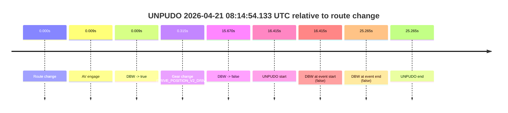
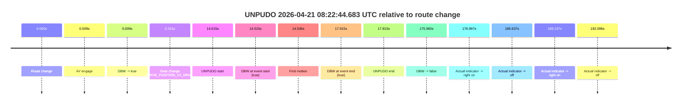
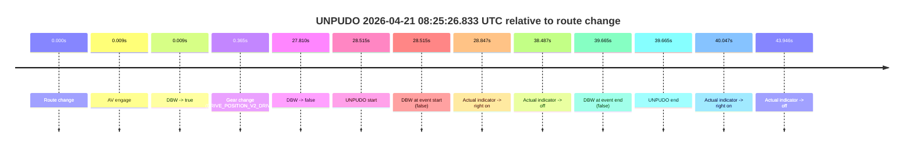
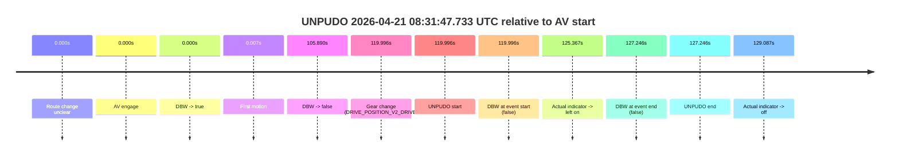
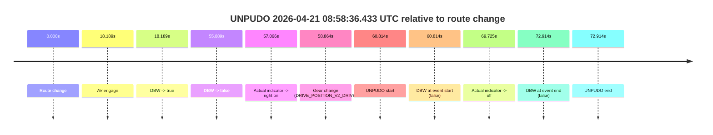
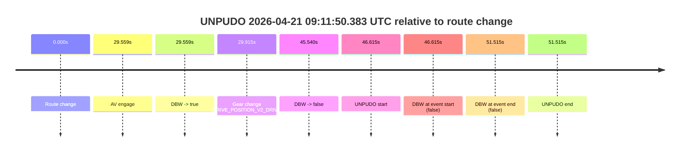
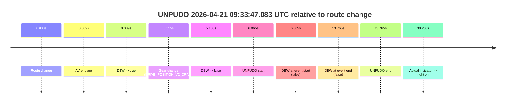

# Run Report: fme20018/2026-04-21--06-51-38--gen2-av-3b338e2e-43c9-46a2-8a76-6d485e5558ee

| Field | Value |
|---|---|
| Run ID | `fme20018/2026-04-21--06-51-38--gen2-av-3b338e2e-43c9-46a2-8a76-6d485e5558ee` |
| Date | `2026-04-21` |
| Model(s) | `pink-manta-ray-smooth` |
| Author | `guy.geva` |
| Event count | `12` |

## unpudo 2026-04-21 08:05:38.433 UTC

| Field | Value |
|---|---|
| Model | `pink-manta-ray-smooth` |
| Author | `guy.geva` |
| Run ID | `fme20018/2026-04-21--06-51-38--gen2-av-3b338e2e-43c9-46a2-8a76-6d485e5558ee` |
| Date | `2026-04-21` |
| Time (UTC) | `08:05:38.433` |
| Event type | `unpudo` |
| Disengagement type | `none observed` |
| Route change | `found` |
| Console | [run](https://console.sso.wayve.ai/run/fme20018/2026-04-21--06-51-38--gen2-av-3b338e2e-43c9-46a2-8a76-6d485e5558ee?id=&time-unixus=1776758738433300) |
| Foxglove | [segment](https://app.foxglove.dev/wayve-on-prem/p/prj_0dX18KZdVHg1fmmI/view?ds=foxglove-stream&ds.deviceName=fme20018&ds.start=2026-04-21T08%3A05%3A02.968687Z&ds.end=2026-04-21T08%3A05%3A52.733303Z&layoutId=lay_0e7VD4WIKDQGU73Y&time=2026-04-21T08%3A05%3A38.433300Z) |

### Event card: fail

- Fail: the credited unpudo does not stay AV-owned. The event window starts with DBW false, and the maneuver outcome lands outside a clean AV-owned segment.

| Event | Time (UTC) | Delta from route change |
|---|---:|---:|
| Route change | 2026-04-21 08:05:12.968 | `0.000s` |
| AV engage | 2026-04-21 08:05:26.607 | `13.639s` |
| DBW -> true | 2026-04-21 08:05:26.607 | `13.639s` |
| Gear change (DRIVE_POSITION_V2_DRIVE) | 2026-04-21 08:05:27.133 | `14.165s` |
| DBW -> false | 2026-04-21 08:05:37.768 | `24.799s` |
| UNPUDO start | 2026-04-21 08:05:38.433 | `25.465s` |
| DBW at event start (false) | 2026-04-21 08:05:38.433 | `25.465s` |
| DBW at event end (false) | 2026-04-21 08:05:42.733 | `29.765s` |
| UNPUDO end | 2026-04-21 08:05:42.733 | `29.765s` |

| Metric | Value |
|---|---|
| Outcome | `fail` |
| Effective failure type | `not_av_owned` |
| Route change status | `found` |
| DBW at event start | `false` |
| DBW at event end | `false` |
| Predicted gear at AV start | `DRIVE_POSITION_V2_DRIVE` |
| Actual gear at AV start | `DRIVE_POSITION_V2_PARK` |
| Predicted gear at event start | `DRIVE_POSITION_V2_DRIVE` |
| Actual gear at event start | `DRIVE_POSITION_V2_DRIVE` |
| Planned indicator direction | `INDICATORS_STATE_V2_RIGHT_ON` |
| Controller indicator direction | `INDICATORS_STATE_V2_RIGHT_ON` |
| Actual indicator direction | `INDICATORS_STATE_V2_OFF` |
| Actual indicator at maneuver end | `INDICATORS_STATE_V2_OFF` |
| Driver accel help in AV | `false` |
| Driver accel help timestamp | `n/a` |
| Max accel pedal pct in AV | `0.0%` |
| Max brake pedal pct in AV | `8.4%` |
| Max speed mps in AV | `0.000` |
| Success timing baseline | `route change` |
| Route -> AV | `13.639s` |
| AV -> event start | `11.826s` |
| AV -> first motion | `n/a` |
| Success baseline -> event start | `25.465s` |
| Success baseline -> first motion | `n/a` |
| AV duration before disengagement | `11.161s` |
| Trajectory waypoint count | `35` |
| Driving-plan step count | `11` |

The scored portion starts from the AV-owned window, not from the pre-AV setup. Route-change search in the stopped pre-event segment was `found`, with the baseline therefore set to route change. At the event anchor the model predicts `DRIVE_POSITION_V2_DRIVE` and the actual gear is `DRIVE_POSITION_V2_DRIVE`. The effective model outcome is `fail` because `not_av_owned.`

### Resolution

| Field | Value |
|---|---|
| Final outcome | `fail` |
| Do we agree with this label? | `yes` |
| Source disengagement type | `none observed` |
| Resolved effective failure type | `not_av_owned` |
| Confidence | `high` |

## unpudo 2026-04-21 08:09:44.733 UTC

| Field | Value |
|---|---|
| Model | `pink-manta-ray-smooth` |
| Author | `guy.geva` |
| Run ID | `fme20018/2026-04-21--06-51-38--gen2-av-3b338e2e-43c9-46a2-8a76-6d485e5558ee` |
| Date | `2026-04-21` |
| Time (UTC) | `08:09:44.733` |
| Event type | `unpudo` |
| Disengagement type | `none observed` |
| Route change | `found` |
| Console | [run](https://console.sso.wayve.ai/run/fme20018/2026-04-21--06-51-38--gen2-av-3b338e2e-43c9-46a2-8a76-6d485e5558ee?id=&time-unixus=1776758984733320) |
| Foxglove | [segment](https://app.foxglove.dev/wayve-on-prem/p/prj_0dX18KZdVHg1fmmI/view?ds=foxglove-stream&ds.deviceName=fme20018&ds.start=2026-04-21T08%3A09%3A27.418275Z&ds.end=2026-04-21T08%3A15%3A03.388613Z&layoutId=lay_0e7VD4WIKDQGU73Y&time=2026-04-21T08%3A09%3A44.733320Z) |

### Event card: pass

- Pass: AV owns the credited unpudo from route change through the official unpudo window, the gear state is aligned at the anchor, and the vehicle moves without driver accelerator help in AV.

| Event | Time (UTC) | Delta from route change |
|---|---:|---:|
| Route change | 2026-04-21 08:09:37.418 | `0.000s` |
| AV engage | 2026-04-21 08:09:37.827 | `0.409s` |
| DBW -> true | 2026-04-21 08:09:37.827 | `0.409s` |
| Gear change (DRIVE_POSITION_V2_DRIVE) | 2026-04-21 08:09:38.283 | `0.865s` |
| UNPUDO start | 2026-04-21 08:09:44.733 | `7.315s` |
| DBW at event start (true) | 2026-04-21 08:09:44.733 | `7.315s` |
| First motion | 2026-04-21 08:09:44.824 | `7.406s` |
| DBW at event end (true) | 2026-04-21 08:09:48.483 | `11.065s` |
| UNPUDO end | 2026-04-21 08:09:48.483 | `11.065s` |
| DBW -> false | 2026-04-21 08:14:53.388 | `315.970s` |

| Metric | Value |
|---|---|
| Outcome | `pass` |
| Effective failure type | `none` |
| Route change status | `found` |
| DBW at event start | `true` |
| DBW at event end | `true` |
| Predicted gear at AV start | `DRIVE_POSITION_V2_DRIVE` |
| Actual gear at AV start | `DRIVE_POSITION_V2_PARK` |
| Predicted gear at event start | `DRIVE_POSITION_V2_DRIVE` |
| Actual gear at event start | `DRIVE_POSITION_V2_DRIVE` |
| Planned indicator direction | `INDICATORS_STATE_V2_OFF` |
| Controller indicator direction | `INDICATORS_STATE_V2_OFF` |
| Actual indicator direction | `INDICATORS_STATE_V2_OFF` |
| Actual indicator at maneuver end | `INDICATORS_STATE_V2_OFF` |
| Driver accel help in AV | `false` |
| Driver accel help timestamp | `n/a` |
| Max accel pedal pct in AV | `0.0%` |
| Max brake pedal pct in AV | `8.0%` |
| Max speed mps in AV | `4.808` |
| Success timing baseline | `route change` |
| Route -> AV | `0.409s` |
| AV -> event start | `6.906s` |
| AV -> first motion | `6.997s` |
| Success baseline -> event start | `7.315s` |
| Success baseline -> first motion | `7.406s` |
| AV duration before disengagement | `315.561s` |
| Trajectory waypoint count | `35` |
| Driving-plan step count | `11` |

The scored portion starts from the AV-owned window, not from the pre-AV setup. Route-change search in the stopped pre-event segment was `found`, with the baseline therefore set to route change. At the event anchor the model predicts `DRIVE_POSITION_V2_DRIVE` and the actual gear is `DRIVE_POSITION_V2_DRIVE`. The effective model outcome is `pass` because `the credited unpudo stays AV-owned through the official unpudo window.`

### Resolution

| Field | Value |
|---|---|
| Final outcome | `pass` |
| Do we agree with this label? | `yes` |
| Source disengagement type | `none observed` |
| Resolved effective failure type | `none` |
| Confidence | `high` |

## unpudo 2026-04-21 08:14:54.133 UTC

| Field | Value |
|---|---|
| Model | `pink-manta-ray-smooth` |
| Author | `guy.geva` |
| Run ID | `fme20018/2026-04-21--06-51-38--gen2-av-3b338e2e-43c9-46a2-8a76-6d485e5558ee` |
| Date | `2026-04-21` |
| Time (UTC) | `08:14:54.133` |
| Event type | `unpudo` |
| Disengagement type | `none observed` |
| Route change | `found` |
| Console | [run](https://console.sso.wayve.ai/run/fme20018/2026-04-21--06-51-38--gen2-av-3b338e2e-43c9-46a2-8a76-6d485e5558ee?id=&time-unixus=1776759294133313) |
| Foxglove | [segment](https://app.foxglove.dev/wayve-on-prem/p/prj_0dX18KZdVHg1fmmI/view?ds=foxglove-stream&ds.deviceName=fme20018&ds.start=2026-04-21T08%3A14%3A27.718275Z&ds.end=2026-04-21T08%3A15%3A12.983297Z&layoutId=lay_0e7VD4WIKDQGU73Y&time=2026-04-21T08%3A14%3A54.133313Z) |

### Event card: fail

- Fail: the credited unpudo does not stay AV-owned. The event window starts with DBW false, and the maneuver outcome lands outside a clean AV-owned segment.

| Event | Time (UTC) | Delta from route change |
|---|---:|---:|
| Route change | 2026-04-21 08:14:37.718 | `0.000s` |
| AV engage | 2026-04-21 08:14:37.727 | `0.009s` |
| DBW -> true | 2026-04-21 08:14:37.727 | `0.009s` |
| Gear change (DRIVE_POSITION_V2_DRIVE) | 2026-04-21 08:14:38.033 | `0.315s` |
| DBW -> false | 2026-04-21 08:14:53.388 | `15.670s` |
| UNPUDO start | 2026-04-21 08:14:54.133 | `16.415s` |
| DBW at event start (false) | 2026-04-21 08:14:54.133 | `16.415s` |
| DBW at event end (false) | 2026-04-21 08:15:02.983 | `25.265s` |
| UNPUDO end | 2026-04-21 08:15:02.983 | `25.265s` |

| Metric | Value |
|---|---|
| Outcome | `fail` |
| Effective failure type | `not_av_owned` |
| Route change status | `found` |
| DBW at event start | `false` |
| DBW at event end | `false` |
| Predicted gear at AV start | `DRIVE_POSITION_V2_PARK` |
| Actual gear at AV start | `DRIVE_POSITION_V2_PARK` |
| Predicted gear at event start | `DRIVE_POSITION_V2_DRIVE` |
| Actual gear at event start | `DRIVE_POSITION_V2_DRIVE` |
| Planned indicator direction | `INDICATORS_STATE_V2_LEFT_ON` |
| Controller indicator direction | `INDICATORS_STATE_V2_LEFT_ON` |
| Actual indicator direction | `INDICATORS_STATE_V2_OFF` |
| Actual indicator at maneuver end | `INDICATORS_STATE_V2_OFF` |
| Driver accel help in AV | `false` |
| Driver accel help timestamp | `n/a` |
| Max accel pedal pct in AV | `0.0%` |
| Max brake pedal pct in AV | `9.4%` |
| Max speed mps in AV | `0.000` |
| Success timing baseline | `route change` |
| Route -> AV | `0.009s` |
| AV -> event start | `16.406s` |
| AV -> first motion | `n/a` |
| Success baseline -> event start | `16.415s` |
| Success baseline -> first motion | `n/a` |
| AV duration before disengagement | `15.661s` |
| Trajectory waypoint count | `35` |
| Driving-plan step count | `11` |

The scored portion starts from the AV-owned window, not from the pre-AV setup. Route-change search in the stopped pre-event segment was `found`, with the baseline therefore set to route change. At the event anchor the model predicts `DRIVE_POSITION_V2_DRIVE` and the actual gear is `DRIVE_POSITION_V2_DRIVE`. The effective model outcome is `fail` because `not_av_owned.`

### Resolution

| Field | Value |
|---|---|
| Final outcome | `fail` |
| Do we agree with this label? | `yes` |
| Source disengagement type | `none observed` |
| Resolved effective failure type | `not_av_owned` |
| Confidence | `high` |

## unpudo 2026-04-21 08:22:44.683 UTC

| Field | Value |
|---|---|
| Model | `pink-manta-ray-smooth` |
| Author | `guy.geva` |
| Run ID | `fme20018/2026-04-21--06-51-38--gen2-av-3b338e2e-43c9-46a2-8a76-6d485e5558ee` |
| Date | `2026-04-21` |
| Time (UTC) | `08:22:44.683` |
| Event type | `unpudo` |
| Disengagement type | `none observed` |
| Route change | `found` |
| Console | [run](https://console.sso.wayve.ai/run/fme20018/2026-04-21--06-51-38--gen2-av-3b338e2e-43c9-46a2-8a76-6d485e5558ee?id=&time-unixus=1776759764683303) |
| Foxglove | [segment](https://app.foxglove.dev/wayve-on-prem/p/prj_0dX18KZdVHg1fmmI/view?ds=foxglove-stream&ds.deviceName=fme20018&ds.start=2026-04-21T08%3A22%3A20.168270Z&ds.end=2026-04-21T08%3A25%3A36.128070Z&layoutId=lay_0e7VD4WIKDQGU73Y&time=2026-04-21T08%3A22%3A44.683303Z) |

### Event card: pass

- Pass: AV owns the credited unpudo from route change through the official unpudo window, the gear state is aligned at the anchor, and the vehicle moves without driver accelerator help in AV.

| Event | Time (UTC) | Delta from route change |
|---|---:|---:|
| Route change | 2026-04-21 08:22:30.168 | `0.000s` |
| AV engage | 2026-04-21 08:22:30.177 | `0.009s` |
| DBW -> true | 2026-04-21 08:22:30.177 | `0.009s` |
| Gear change (DRIVE_POSITION_V2_DRIVE) | 2026-04-21 08:22:30.483 | `0.315s` |
| UNPUDO start | 2026-04-21 08:22:44.683 | `14.515s` |
| DBW at event start (true) | 2026-04-21 08:22:44.683 | `14.515s` |
| First motion | 2026-04-21 08:22:44.704 | `14.536s` |
| DBW at event end (true) | 2026-04-21 08:22:48.083 | `17.915s` |
| UNPUDO end | 2026-04-21 08:22:48.083 | `17.915s` |
| DBW -> false | 2026-04-21 08:25:26.128 | `175.960s` |
| Actual indicator -> right on | 2026-04-21 08:25:27.164 | `176.997s` |
| Actual indicator -> off | 2026-04-21 08:25:36.805 | `186.637s` |
| Actual indicator -> right on | 2026-04-21 08:25:38.365 | `188.197s` |
| Actual indicator -> off | 2026-04-21 08:25:42.264 | `192.096s` |

| Metric | Value |
|---|---|
| Outcome | `pass` |
| Effective failure type | `none` |
| Route change status | `found` |
| DBW at event start | `true` |
| DBW at event end | `true` |
| Predicted gear at AV start | `DRIVE_POSITION_V2_PARK` |
| Actual gear at AV start | `DRIVE_POSITION_V2_PARK` |
| Predicted gear at event start | `DRIVE_POSITION_V2_DRIVE` |
| Actual gear at event start | `DRIVE_POSITION_V2_DRIVE` |
| Planned indicator direction | `INDICATORS_STATE_V2_RIGHT_ON` |
| Controller indicator direction | `INDICATORS_STATE_V2_RIGHT_ON` |
| Actual indicator direction | `INDICATORS_STATE_V2_OFF` |
| Actual indicator at maneuver end | `INDICATORS_STATE_V2_OFF` |
| Driver accel help in AV | `false` |
| Driver accel help timestamp | `n/a` |
| Max accel pedal pct in AV | `0.0%` |
| Max brake pedal pct in AV | `8.0%` |
| Max speed mps in AV | `4.794` |
| Success timing baseline | `route change` |
| Route -> AV | `0.009s` |
| AV -> event start | `14.506s` |
| AV -> first motion | `14.527s` |
| Success baseline -> event start | `14.515s` |
| Success baseline -> first motion | `14.536s` |
| AV duration before disengagement | `175.951s` |
| Trajectory waypoint count | `36` |
| Driving-plan step count | `11` |

The scored portion starts from the AV-owned window, not from the pre-AV setup. Route-change search in the stopped pre-event segment was `found`, with the baseline therefore set to route change. At the event anchor the model predicts `DRIVE_POSITION_V2_DRIVE` and the actual gear is `DRIVE_POSITION_V2_DRIVE`. The effective model outcome is `pass` because `the credited unpudo stays AV-owned through the official unpudo window.`

### Resolution

| Field | Value |
|---|---|
| Final outcome | `pass` |
| Do we agree with this label? | `yes` |
| Source disengagement type | `none observed` |
| Resolved effective failure type | `none` |
| Confidence | `high` |

## unpudo 2026-04-21 08:25:26.833 UTC

| Field | Value |
|---|---|
| Model | `pink-manta-ray-smooth` |
| Author | `guy.geva` |
| Run ID | `fme20018/2026-04-21--06-51-38--gen2-av-3b338e2e-43c9-46a2-8a76-6d485e5558ee` |
| Date | `2026-04-21` |
| Time (UTC) | `08:25:26.833` |
| Event type | `unpudo` |
| Disengagement type | `none observed` |
| Route change | `found` |
| Console | [run](https://console.sso.wayve.ai/run/fme20018/2026-04-21--06-51-38--gen2-av-3b338e2e-43c9-46a2-8a76-6d485e5558ee?id=&time-unixus=1776759926833313) |
| Foxglove | [segment](https://app.foxglove.dev/wayve-on-prem/p/prj_0dX18KZdVHg1fmmI/view?ds=foxglove-stream&ds.deviceName=fme20018&ds.start=2026-04-21T08%3A24%3A48.318306Z&ds.end=2026-04-21T08%3A25%3A47.983302Z&layoutId=lay_0e7VD4WIKDQGU73Y&time=2026-04-21T08%3A25%3A26.833313Z) |

### Event card: fail

- Fail: the credited unpudo does not stay AV-owned. The event window starts with DBW false, and the maneuver outcome lands outside a clean AV-owned segment.

| Event | Time (UTC) | Delta from route change |
|---|---:|---:|
| Route change | 2026-04-21 08:24:58.318 | `0.000s` |
| AV engage | 2026-04-21 08:24:58.327 | `0.009s` |
| DBW -> true | 2026-04-21 08:24:58.327 | `0.009s` |
| Gear change (DRIVE_POSITION_V2_DRIVE) | 2026-04-21 08:24:58.683 | `0.365s` |
| DBW -> false | 2026-04-21 08:25:26.128 | `27.810s` |
| UNPUDO start | 2026-04-21 08:25:26.833 | `28.515s` |
| DBW at event start (false) | 2026-04-21 08:25:26.833 | `28.515s` |
| Actual indicator -> right on | 2026-04-21 08:25:27.164 | `28.847s` |
| Actual indicator -> off | 2026-04-21 08:25:36.805 | `38.487s` |
| DBW at event end (false) | 2026-04-21 08:25:37.983 | `39.665s` |
| UNPUDO end | 2026-04-21 08:25:37.983 | `39.665s` |
| Actual indicator -> right on | 2026-04-21 08:25:38.365 | `40.047s` |
| Actual indicator -> off | 2026-04-21 08:25:42.264 | `43.946s` |

| Metric | Value |
|---|---|
| Outcome | `fail` |
| Effective failure type | `not_av_owned` |
| Route change status | `found` |
| DBW at event start | `false` |
| DBW at event end | `false` |
| Predicted gear at AV start | `DRIVE_POSITION_V2_PARK` |
| Actual gear at AV start | `DRIVE_POSITION_V2_PARK` |
| Predicted gear at event start | `DRIVE_POSITION_V2_DRIVE` |
| Actual gear at event start | `DRIVE_POSITION_V2_DRIVE` |
| Planned indicator direction | `INDICATORS_STATE_V2_RIGHT_ON` |
| Controller indicator direction | `INDICATORS_STATE_V2_RIGHT_ON` |
| Actual indicator direction | `INDICATORS_STATE_V2_OFF` |
| Actual indicator at maneuver end | `INDICATORS_STATE_V2_OFF` |
| Driver accel help in AV | `false` |
| Driver accel help timestamp | `n/a` |
| Max accel pedal pct in AV | `0.0%` |
| Max brake pedal pct in AV | `8.0%` |
| Max speed mps in AV | `0.000` |
| Success timing baseline | `route change` |
| Route -> AV | `0.009s` |
| AV -> event start | `28.506s` |
| AV -> first motion | `n/a` |
| Success baseline -> event start | `28.515s` |
| Success baseline -> first motion | `n/a` |
| AV duration before disengagement | `27.801s` |
| Trajectory waypoint count | `35` |
| Driving-plan step count | `11` |

The scored portion starts from the AV-owned window, not from the pre-AV setup. Route-change search in the stopped pre-event segment was `found`, with the baseline therefore set to route change. At the event anchor the model predicts `DRIVE_POSITION_V2_DRIVE` and the actual gear is `DRIVE_POSITION_V2_DRIVE`. The effective model outcome is `fail` because `not_av_owned.`

### Resolution

| Field | Value |
|---|---|
| Final outcome | `fail` |
| Do we agree with this label? | `yes` |
| Source disengagement type | `none observed` |
| Resolved effective failure type | `not_av_owned` |
| Confidence | `high` |

## unpudo 2026-04-21 08:31:47.733 UTC

| Field | Value |
|---|---|
| Model | `pink-manta-ray-smooth` |
| Author | `guy.geva` |
| Run ID | `fme20018/2026-04-21--06-51-38--gen2-av-3b338e2e-43c9-46a2-8a76-6d485e5558ee` |
| Date | `2026-04-21` |
| Time (UTC) | `08:31:47.733` |
| Event type | `unpudo` |
| Disengagement type | `none observed` |
| Route change | `unclear` |
| Console | [run](https://console.sso.wayve.ai/run/fme20018/2026-04-21--06-51-38--gen2-av-3b338e2e-43c9-46a2-8a76-6d485e5558ee?id=&time-unixus=1776760307733324) |
| Foxglove | [segment](https://app.foxglove.dev/wayve-on-prem/p/prj_0dX18KZdVHg1fmmI/view?ds=foxglove-stream&ds.deviceName=fme20018&ds.start=2026-04-21T08%3A29%3A37.737433Z&ds.end=2026-04-21T08%3A32%3A04.983309Z&layoutId=lay_0e7VD4WIKDQGU73Y&time=2026-04-21T08%3A31%3A47.733324Z) |

### Event card: fail

- Fail: the credited unpudo does not stay AV-owned. The event window starts with DBW false, and the maneuver outcome lands outside a clean AV-owned segment.

| Event | Time (UTC) | Delta from AV start |
|---|---:|---:|
| Route change unclear | 2026-04-21 08:29:47.737 | `0.000s` |
| AV engage | 2026-04-21 08:29:47.737 | `0.000s` |
| DBW -> true | 2026-04-21 08:29:47.737 | `0.000s` |
| First motion | 2026-04-21 08:29:47.744 | `0.007s` |
| DBW -> false | 2026-04-21 08:31:33.627 | `105.890s` |
| Gear change (DRIVE_POSITION_V2_DRIVE) | 2026-04-21 08:31:47.733 | `119.996s` |
| UNPUDO start | 2026-04-21 08:31:47.733 | `119.996s` |
| DBW at event start (false) | 2026-04-21 08:31:47.733 | `119.996s` |
| Actual indicator -> left on | 2026-04-21 08:31:53.104 | `125.367s` |
| DBW at event end (false) | 2026-04-21 08:31:54.983 | `127.246s` |
| UNPUDO end | 2026-04-21 08:31:54.983 | `127.246s` |
| Actual indicator -> off | 2026-04-21 08:31:56.824 | `129.087s` |

| Metric | Value |
|---|---|
| Outcome | `fail` |
| Effective failure type | `not_av_owned` |
| Route change status | `unclear` |
| DBW at event start | `false` |
| DBW at event end | `false` |
| Predicted gear at AV start | `DRIVE_POSITION_V2_DRIVE` |
| Actual gear at AV start | `DRIVE_POSITION_V2_DRIVE` |
| Predicted gear at event start | `DRIVE_POSITION_V2_REVERSE` |
| Actual gear at event start | `DRIVE_POSITION_V2_DRIVE` |
| Planned indicator direction | `INDICATORS_STATE_V2_OFF` |
| Controller indicator direction | `INDICATORS_STATE_V2_OFF` |
| Actual indicator direction | `INDICATORS_STATE_V2_OFF` |
| Actual indicator at maneuver end | `INDICATORS_STATE_V2_LEFT_ON` |
| Driver accel help in AV | `false` |
| Driver accel help timestamp | `n/a` |
| Max accel pedal pct in AV | `0.0%` |
| Max brake pedal pct in AV | `8.0%` |
| Max speed mps in AV | `8.092` |
| Success timing baseline | `AV start` |
| Route -> AV | `n/a` |
| AV -> event start | `119.996s` |
| AV -> first motion | `0.007s` |
| Success baseline -> event start | `119.996s` |
| Success baseline -> first motion | `0.007s` |
| AV duration before disengagement | `105.890s` |
| Trajectory waypoint count | `37` |
| Driving-plan step count | `11` |

The scored portion starts from the AV-owned window, not from the pre-AV setup. Route-change search in the stopped pre-event segment was `unclear`, with the baseline therefore set to AV start. At the event anchor the model predicts `DRIVE_POSITION_V2_REVERSE` and the actual gear is `DRIVE_POSITION_V2_DRIVE`. The effective model outcome is `fail` because `not_av_owned.`

### Resolution

| Field | Value |
|---|---|
| Final outcome | `fail` |
| Do we agree with this label? | `yes` |
| Source disengagement type | `none observed` |
| Resolved effective failure type | `not_av_owned` |
| Confidence | `medium` |

## unpudo 2026-04-21 08:32:33.733 UTC

| Field | Value |
|---|---|
| Model | `pink-manta-ray-smooth` |
| Author | `guy.geva` |
| Run ID | `fme20018/2026-04-21--06-51-38--gen2-av-3b338e2e-43c9-46a2-8a76-6d485e5558ee` |
| Date | `2026-04-21` |
| Time (UTC) | `08:32:33.733` |
| Event type | `unpudo` |
| Disengagement type | `none observed` |
| Route change | `found` |
| Console | [run](https://console.sso.wayve.ai/run/fme20018/2026-04-21--06-51-38--gen2-av-3b338e2e-43c9-46a2-8a76-6d485e5558ee?id=&time-unixus=1776760353733298) |
| Foxglove | [segment](https://app.foxglove.dev/wayve-on-prem/p/prj_0dX18KZdVHg1fmmI/view?ds=foxglove-stream&ds.deviceName=fme20018&ds.start=2026-04-21T08%3A32%3A01.368820Z&ds.end=2026-04-21T08%3A32%3A48.933316Z&layoutId=lay_0e7VD4WIKDQGU73Y&time=2026-04-21T08%3A32%3A33.733298Z) |

### Event card: fail

- Fail: the credited unpudo does not stay AV-owned. The event window starts with DBW false, and the maneuver outcome lands outside a clean AV-owned segment.

| Event | Time (UTC) | Delta from route change |
|---|---:|---:|
| Route change | 2026-04-21 08:32:11.368 | `0.000s` |
| AV engage | 2026-04-21 08:32:26.927 | `15.559s` |
| DBW -> true | 2026-04-21 08:32:26.927 | `15.559s` |
| Gear change (DRIVE_POSITION_V2_DRIVE) | 2026-04-21 08:32:27.483 | `16.114s` |
| DBW -> false | 2026-04-21 08:32:33.028 | `21.660s` |
| UNPUDO start | 2026-04-21 08:32:33.733 | `22.364s` |
| DBW at event start (false) | 2026-04-21 08:32:33.733 | `22.364s` |
| DBW at event end (false) | 2026-04-21 08:32:38.933 | `27.564s` |
| UNPUDO end | 2026-04-21 08:32:38.933 | `27.564s` |

| Metric | Value |
|---|---|
| Outcome | `fail` |
| Effective failure type | `not_av_owned` |
| Route change status | `found` |
| DBW at event start | `false` |
| DBW at event end | `false` |
| Predicted gear at AV start | `DRIVE_POSITION_V2_DRIVE` |
| Actual gear at AV start | `DRIVE_POSITION_V2_PARK` |
| Predicted gear at event start | `DRIVE_POSITION_V2_DRIVE` |
| Actual gear at event start | `DRIVE_POSITION_V2_DRIVE` |
| Planned indicator direction | `INDICATORS_STATE_V2_RIGHT_ON` |
| Controller indicator direction | `INDICATORS_STATE_V2_RIGHT_ON` |
| Actual indicator direction | `INDICATORS_STATE_V2_OFF` |
| Actual indicator at maneuver end | `INDICATORS_STATE_V2_OFF` |
| Driver accel help in AV | `false` |
| Driver accel help timestamp | `n/a` |
| Max accel pedal pct in AV | `0.0%` |
| Max brake pedal pct in AV | `8.0%` |
| Max speed mps in AV | `0.000` |
| Success timing baseline | `route change` |
| Route -> AV | `15.559s` |
| AV -> event start | `6.806s` |
| AV -> first motion | `n/a` |
| Success baseline -> event start | `22.364s` |
| Success baseline -> first motion | `n/a` |
| AV duration before disengagement | `6.102s` |
| Trajectory waypoint count | `35` |
| Driving-plan step count | `11` |

The scored portion starts from the AV-owned window, not from the pre-AV setup. Route-change search in the stopped pre-event segment was `found`, with the baseline therefore set to route change. At the event anchor the model predicts `DRIVE_POSITION_V2_DRIVE` and the actual gear is `DRIVE_POSITION_V2_DRIVE`. The effective model outcome is `fail` because `not_av_owned.`

### Resolution

| Field | Value |
|---|---|
| Final outcome | `fail` |
| Do we agree with this label? | `yes` |
| Source disengagement type | `none observed` |
| Resolved effective failure type | `not_av_owned` |
| Confidence | `high` |

## unpudo 2026-04-21 08:51:11.433 UTC

| Field | Value |
|---|---|
| Model | `pink-manta-ray-smooth` |
| Author | `guy.geva` |
| Run ID | `fme20018/2026-04-21--06-51-38--gen2-av-3b338e2e-43c9-46a2-8a76-6d485e5558ee` |
| Date | `2026-04-21` |
| Time (UTC) | `08:51:11.433` |
| Event type | `unpudo` |
| Disengagement type | `none observed` |
| Route change | `found` |
| Console | [run](https://console.sso.wayve.ai/run/fme20018/2026-04-21--06-51-38--gen2-av-3b338e2e-43c9-46a2-8a76-6d485e5558ee?id=&time-unixus=1776761471433295) |
| Foxglove | [segment](https://app.foxglove.dev/wayve-on-prem/p/prj_0dX18KZdVHg1fmmI/view?ds=foxglove-stream&ds.deviceName=fme20018&ds.start=2026-04-21T08%3A50%3A56.618274Z&ds.end=2026-04-21T08%3A51%3A25.433298Z&layoutId=lay_0e7VD4WIKDQGU73Y&time=2026-04-21T08%3A51%3A11.433295Z) |

### Event card: fail

- Fail: the credited unpudo does not stay AV-owned. The event window starts with DBW false, and the maneuver outcome lands outside a clean AV-owned segment.

| Event | Time (UTC) | Delta from route change |
|---|---:|---:|
| Route change | 2026-04-21 08:51:06.618 | `0.000s` |
| AV engage | 2026-04-21 08:51:06.627 | `0.009s` |
| DBW -> true | 2026-04-21 08:51:06.627 | `0.009s` |
| Gear change (DRIVE_POSITION_V2_DRIVE) | 2026-04-21 08:51:06.983 | `0.365s` |
| DBW -> false | 2026-04-21 08:51:10.847 | `4.230s` |
| UNPUDO start | 2026-04-21 08:51:11.433 | `4.815s` |
| DBW at event start (false) | 2026-04-21 08:51:11.433 | `4.815s` |
| DBW at event end (false) | 2026-04-21 08:51:15.433 | `8.815s` |
| UNPUDO end | 2026-04-21 08:51:15.433 | `8.815s` |

| Metric | Value |
|---|---|
| Outcome | `fail` |
| Effective failure type | `not_av_owned` |
| Route change status | `found` |
| DBW at event start | `false` |
| DBW at event end | `false` |
| Predicted gear at AV start | `DRIVE_POSITION_V2_PARK` |
| Actual gear at AV start | `DRIVE_POSITION_V2_PARK` |
| Predicted gear at event start | `DRIVE_POSITION_V2_DRIVE` |
| Actual gear at event start | `DRIVE_POSITION_V2_DRIVE` |
| Planned indicator direction | `INDICATORS_STATE_V2_LEFT_ON` |
| Controller indicator direction | `INDICATORS_STATE_V2_LEFT_ON` |
| Actual indicator direction | `INDICATORS_STATE_V2_OFF` |
| Actual indicator at maneuver end | `INDICATORS_STATE_V2_OFF` |
| Driver accel help in AV | `false` |
| Driver accel help timestamp | `n/a` |
| Max accel pedal pct in AV | `0.0%` |
| Max brake pedal pct in AV | `8.0%` |
| Max speed mps in AV | `0.000` |
| Success timing baseline | `route change` |
| Route -> AV | `0.009s` |
| AV -> event start | `4.806s` |
| AV -> first motion | `n/a` |
| Success baseline -> event start | `4.815s` |
| Success baseline -> first motion | `n/a` |
| AV duration before disengagement | `4.221s` |
| Trajectory waypoint count | `37` |
| Driving-plan step count | `11` |

The scored portion starts from the AV-owned window, not from the pre-AV setup. Route-change search in the stopped pre-event segment was `found`, with the baseline therefore set to route change. At the event anchor the model predicts `DRIVE_POSITION_V2_DRIVE` and the actual gear is `DRIVE_POSITION_V2_DRIVE`. The effective model outcome is `fail` because `not_av_owned.`

### Resolution

| Field | Value |
|---|---|
| Final outcome | `fail` |
| Do we agree with this label? | `yes` |
| Source disengagement type | `none observed` |
| Resolved effective failure type | `not_av_owned` |
| Confidence | `high` |

## unpudo 2026-04-21 08:58:36.433 UTC

| Field | Value |
|---|---|
| Model | `pink-manta-ray-smooth` |
| Author | `guy.geva` |
| Run ID | `fme20018/2026-04-21--06-51-38--gen2-av-3b338e2e-43c9-46a2-8a76-6d485e5558ee` |
| Date | `2026-04-21` |
| Time (UTC) | `08:58:36.433` |
| Event type | `unpudo` |
| Disengagement type | `none observed` |
| Route change | `found` |
| Console | [run](https://console.sso.wayve.ai/run/fme20018/2026-04-21--06-51-38--gen2-av-3b338e2e-43c9-46a2-8a76-6d485e5558ee?id=&time-unixus=1776761916433309) |
| Foxglove | [segment](https://app.foxglove.dev/wayve-on-prem/p/prj_0dX18KZdVHg1fmmI/view?ds=foxglove-stream&ds.deviceName=fme20018&ds.start=2026-04-21T08%3A57%3A25.618846Z&ds.end=2026-04-21T08%3A58%3A58.533302Z&layoutId=lay_0e7VD4WIKDQGU73Y&time=2026-04-21T08%3A58%3A36.433309Z) |

### Event card: fail

- Fail: the credited unpudo does not stay AV-owned. The event window starts with DBW false, and the maneuver outcome lands outside a clean AV-owned segment.

| Event | Time (UTC) | Delta from route change |
|---|---:|---:|
| Route change | 2026-04-21 08:57:35.618 | `0.000s` |
| AV engage | 2026-04-21 08:57:53.807 | `18.189s` |
| DBW -> true | 2026-04-21 08:57:53.807 | `18.189s` |
| DBW -> false | 2026-04-21 08:58:31.507 | `55.889s` |
| Actual indicator -> right on | 2026-04-21 08:58:32.684 | `57.066s` |
| Gear change (DRIVE_POSITION_V2_DRIVE) | 2026-04-21 08:58:34.483 | `58.864s` |
| UNPUDO start | 2026-04-21 08:58:36.433 | `60.814s` |
| DBW at event start (false) | 2026-04-21 08:58:36.433 | `60.814s` |
| Actual indicator -> off | 2026-04-21 08:58:45.344 | `69.725s` |
| DBW at event end (false) | 2026-04-21 08:58:48.533 | `72.914s` |
| UNPUDO end | 2026-04-21 08:58:48.533 | `72.914s` |

| Metric | Value |
|---|---|
| Outcome | `fail` |
| Effective failure type | `not_av_owned` |
| Route change status | `found` |
| DBW at event start | `false` |
| DBW at event end | `false` |
| Predicted gear at AV start | `DRIVE_POSITION_V2_PARK` |
| Actual gear at AV start | `DRIVE_POSITION_V2_REVERSE` |
| Predicted gear at event start | `DRIVE_POSITION_V2_DRIVE` |
| Actual gear at event start | `DRIVE_POSITION_V2_DRIVE` |
| Planned indicator direction | `INDICATORS_STATE_V2_OFF` |
| Controller indicator direction | `INDICATORS_STATE_V2_OFF` |
| Actual indicator direction | `INDICATORS_STATE_V2_RIGHT_ON` |
| Actual indicator at maneuver end | `INDICATORS_STATE_V2_OFF` |
| Driver accel help in AV | `false` |
| Driver accel help timestamp | `n/a` |
| Max accel pedal pct in AV | `0.0%` |
| Max brake pedal pct in AV | `8.0%` |
| Max speed mps in AV | `0.000` |
| Success timing baseline | `route change` |
| Route -> AV | `18.189s` |
| AV -> event start | `42.626s` |
| AV -> first motion | `n/a` |
| Success baseline -> event start | `60.814s` |
| Success baseline -> first motion | `n/a` |
| AV duration before disengagement | `37.701s` |
| Trajectory waypoint count | `35` |
| Driving-plan step count | `11` |

The scored portion starts from the AV-owned window, not from the pre-AV setup. Route-change search in the stopped pre-event segment was `found`, with the baseline therefore set to route change. At the event anchor the model predicts `DRIVE_POSITION_V2_DRIVE` and the actual gear is `DRIVE_POSITION_V2_DRIVE`. The effective model outcome is `fail` because `not_av_owned.`

### Resolution

| Field | Value |
|---|---|
| Final outcome | `fail` |
| Do we agree with this label? | `yes` |
| Source disengagement type | `none observed` |
| Resolved effective failure type | `not_av_owned` |
| Confidence | `high` |

## unpudo 2026-04-21 09:04:55.983 UTC

| Field | Value |
|---|---|
| Model | `pink-manta-ray-smooth` |
| Author | `guy.geva` |
| Run ID | `fme20018/2026-04-21--06-51-38--gen2-av-3b338e2e-43c9-46a2-8a76-6d485e5558ee` |
| Date | `2026-04-21` |
| Time (UTC) | `09:04:55.983` |
| Event type | `unpudo` |
| Disengagement type | `none observed` |
| Route change | `found` |
| Console | [run](https://console.sso.wayve.ai/run/fme20018/2026-04-21--06-51-38--gen2-av-3b338e2e-43c9-46a2-8a76-6d485e5558ee?id=&time-unixus=1776762295983314) |
| Foxglove | [segment](https://app.foxglove.dev/wayve-on-prem/p/prj_0dX18KZdVHg1fmmI/view?ds=foxglove-stream&ds.deviceName=fme20018&ds.start=2026-04-21T09%3A04%3A42.068255Z&ds.end=2026-04-21T09%3A10%3A52.507335Z&layoutId=lay_0e7VD4WIKDQGU73Y&time=2026-04-21T09%3A04%3A55.983314Z) |

### Event card: pass

- Pass: AV owns the credited unpudo from route change through the official unpudo window, the gear state is aligned at the anchor, and the vehicle moves without driver accelerator help in AV.

| Event | Time (UTC) | Delta from route change |
|---|---:|---:|
| Route change | 2026-04-21 09:04:52.068 | `0.000s` |
| AV engage | 2026-04-21 09:04:52.077 | `0.009s` |
| DBW -> true | 2026-04-21 09:04:52.077 | `0.009s` |
| Gear change (DRIVE_POSITION_V2_DRIVE) | 2026-04-21 09:04:52.433 | `0.365s` |
| UNPUDO start | 2026-04-21 09:04:55.983 | `3.915s` |
| DBW at event start (true) | 2026-04-21 09:04:55.983 | `3.915s` |
| First motion | 2026-04-21 09:04:56.024 | `3.956s` |
| DBW at event end (true) | 2026-04-21 09:04:59.433 | `7.365s` |
| UNPUDO end | 2026-04-21 09:04:59.433 | `7.365s` |
| DBW -> false | 2026-04-21 09:10:42.507 | `350.439s` |

| Metric | Value |
|---|---|
| Outcome | `pass` |
| Effective failure type | `none` |
| Route change status | `found` |
| DBW at event start | `true` |
| DBW at event end | `true` |
| Predicted gear at AV start | `DRIVE_POSITION_V2_PARK` |
| Actual gear at AV start | `DRIVE_POSITION_V2_PARK` |
| Predicted gear at event start | `DRIVE_POSITION_V2_DRIVE` |
| Actual gear at event start | `DRIVE_POSITION_V2_DRIVE` |
| Planned indicator direction | `INDICATORS_STATE_V2_RIGHT_ON` |
| Controller indicator direction | `INDICATORS_STATE_V2_RIGHT_ON` |
| Actual indicator direction | `INDICATORS_STATE_V2_OFF` |
| Actual indicator at maneuver end | `INDICATORS_STATE_V2_OFF` |
| Driver accel help in AV | `false` |
| Driver accel help timestamp | `n/a` |
| Max accel pedal pct in AV | `0.0%` |
| Max brake pedal pct in AV | `8.0%` |
| Max speed mps in AV | `4.689` |
| Success timing baseline | `route change` |
| Route -> AV | `0.009s` |
| AV -> event start | `3.906s` |
| AV -> first motion | `3.947s` |
| Success baseline -> event start | `3.915s` |
| Success baseline -> first motion | `3.956s` |
| AV duration before disengagement | `350.430s` |
| Trajectory waypoint count | `36` |
| Driving-plan step count | `11` |

The scored portion starts from the AV-owned window, not from the pre-AV setup. Route-change search in the stopped pre-event segment was `found`, with the baseline therefore set to route change. At the event anchor the model predicts `DRIVE_POSITION_V2_DRIVE` and the actual gear is `DRIVE_POSITION_V2_DRIVE`. The effective model outcome is `pass` because `the credited unpudo stays AV-owned through the official unpudo window.`

### Resolution

| Field | Value |
|---|---|
| Final outcome | `pass` |
| Do we agree with this label? | `yes` |
| Source disengagement type | `none observed` |
| Resolved effective failure type | `none` |
| Confidence | `high` |

## unpudo 2026-04-21 09:11:50.383 UTC

| Field | Value |
|---|---|
| Model | `pink-manta-ray-smooth` |
| Author | `guy.geva` |
| Run ID | `fme20018/2026-04-21--06-51-38--gen2-av-3b338e2e-43c9-46a2-8a76-6d485e5558ee` |
| Date | `2026-04-21` |
| Time (UTC) | `09:11:50.383` |
| Event type | `unpudo` |
| Disengagement type | `none observed` |
| Route change | `found` |
| Console | [run](https://console.sso.wayve.ai/run/fme20018/2026-04-21--06-51-38--gen2-av-3b338e2e-43c9-46a2-8a76-6d485e5558ee?id=&time-unixus=1776762710383307) |
| Foxglove | [segment](https://app.foxglove.dev/wayve-on-prem/p/prj_0dX18KZdVHg1fmmI/view?ds=foxglove-stream&ds.deviceName=fme20018&ds.start=2026-04-21T09%3A10%3A53.768307Z&ds.end=2026-04-21T09%3A12%3A05.283300Z&layoutId=lay_0e7VD4WIKDQGU73Y&time=2026-04-21T09%3A11%3A50.383307Z) |

### Event card: fail

- Fail: the credited unpudo does not stay AV-owned. The event window starts with DBW false, and the maneuver outcome lands outside a clean AV-owned segment.

| Event | Time (UTC) | Delta from route change |
|---|---:|---:|
| Route change | 2026-04-21 09:11:03.768 | `0.000s` |
| AV engage | 2026-04-21 09:11:33.327 | `29.559s` |
| DBW -> true | 2026-04-21 09:11:33.327 | `29.559s` |
| Gear change (DRIVE_POSITION_V2_DRIVE) | 2026-04-21 09:11:33.683 | `29.915s` |
| DBW -> false | 2026-04-21 09:11:49.308 | `45.540s` |
| UNPUDO start | 2026-04-21 09:11:50.383 | `46.615s` |
| DBW at event start (false) | 2026-04-21 09:11:50.383 | `46.615s` |
| DBW at event end (false) | 2026-04-21 09:11:55.283 | `51.515s` |
| UNPUDO end | 2026-04-21 09:11:55.283 | `51.515s` |

| Metric | Value |
|---|---|
| Outcome | `fail` |
| Effective failure type | `not_av_owned` |
| Route change status | `found` |
| DBW at event start | `false` |
| DBW at event end | `false` |
| Predicted gear at AV start | `DRIVE_POSITION_V2_DRIVE` |
| Actual gear at AV start | `DRIVE_POSITION_V2_PARK` |
| Predicted gear at event start | `DRIVE_POSITION_V2_DRIVE` |
| Actual gear at event start | `DRIVE_POSITION_V2_DRIVE` |
| Planned indicator direction | `INDICATORS_STATE_V2_RIGHT_ON` |
| Controller indicator direction | `INDICATORS_STATE_V2_RIGHT_ON` |
| Actual indicator direction | `INDICATORS_STATE_V2_OFF` |
| Actual indicator at maneuver end | `INDICATORS_STATE_V2_OFF` |
| Driver accel help in AV | `false` |
| Driver accel help timestamp | `n/a` |
| Max accel pedal pct in AV | `0.0%` |
| Max brake pedal pct in AV | `8.0%` |
| Max speed mps in AV | `0.000` |
| Success timing baseline | `route change` |
| Route -> AV | `29.559s` |
| AV -> event start | `17.056s` |
| AV -> first motion | `n/a` |
| Success baseline -> event start | `46.615s` |
| Success baseline -> first motion | `n/a` |
| AV duration before disengagement | `15.981s` |
| Trajectory waypoint count | `36` |
| Driving-plan step count | `11` |

The scored portion starts from the AV-owned window, not from the pre-AV setup. Route-change search in the stopped pre-event segment was `found`, with the baseline therefore set to route change. At the event anchor the model predicts `DRIVE_POSITION_V2_DRIVE` and the actual gear is `DRIVE_POSITION_V2_DRIVE`. The effective model outcome is `fail` because `not_av_owned.`

### Resolution

| Field | Value |
|---|---|
| Final outcome | `fail` |
| Do we agree with this label? | `yes` |
| Source disengagement type | `none observed` |
| Resolved effective failure type | `not_av_owned` |
| Confidence | `high` |

## unpudo 2026-04-21 09:33:47.083 UTC

| Field | Value |
|---|---|
| Model | `pink-manta-ray-smooth` |
| Author | `guy.geva` |
| Run ID | `fme20018/2026-04-21--06-51-38--gen2-av-3b338e2e-43c9-46a2-8a76-6d485e5558ee` |
| Date | `2026-04-21` |
| Time (UTC) | `09:33:47.083` |
| Event type | `unpudo` |
| Disengagement type | `none observed` |
| Route change | `found` |
| Console | [run](https://console.sso.wayve.ai/run/fme20018/2026-04-21--06-51-38--gen2-av-3b338e2e-43c9-46a2-8a76-6d485e5558ee?id=&time-unixus=1776764027083308) |
| Foxglove | [segment](https://app.foxglove.dev/wayve-on-prem/p/prj_0dX18KZdVHg1fmmI/view?ds=foxglove-stream&ds.deviceName=fme20018&ds.start=2026-04-21T09%3A33%3A31.018249Z&ds.end=2026-04-21T09%3A34%3A04.783320Z&layoutId=lay_0e7VD4WIKDQGU73Y&time=2026-04-21T09%3A33%3A47.083308Z) |

### Event card: fail

- Fail: the credited unpudo does not stay AV-owned. The event window starts with DBW false, and the maneuver outcome lands outside a clean AV-owned segment.

| Event | Time (UTC) | Delta from route change |
|---|---:|---:|
| Route change | 2026-04-21 09:33:41.018 | `0.000s` |
| AV engage | 2026-04-21 09:33:41.027 | `0.009s` |
| DBW -> true | 2026-04-21 09:33:41.027 | `0.009s` |
| Gear change (DRIVE_POSITION_V2_DRIVE) | 2026-04-21 09:33:41.333 | `0.315s` |
| DBW -> false | 2026-04-21 09:33:46.126 | `5.108s` |
| UNPUDO start | 2026-04-21 09:33:47.083 | `6.065s` |
| DBW at event start (false) | 2026-04-21 09:33:47.083 | `6.065s` |
| DBW at event end (false) | 2026-04-21 09:33:54.783 | `13.765s` |
| UNPUDO end | 2026-04-21 09:33:54.783 | `13.765s` |
| Actual indicator -> right on | 2026-04-21 09:34:11.284 | `30.266s` |

| Metric | Value |
|---|---|
| Outcome | `fail` |
| Effective failure type | `not_av_owned` |
| Route change status | `found` |
| DBW at event start | `false` |
| DBW at event end | `false` |
| Predicted gear at AV start | `DRIVE_POSITION_V2_PARK` |
| Actual gear at AV start | `DRIVE_POSITION_V2_PARK` |
| Predicted gear at event start | `DRIVE_POSITION_V2_DRIVE` |
| Actual gear at event start | `DRIVE_POSITION_V2_DRIVE` |
| Planned indicator direction | `INDICATORS_STATE_V2_OFF` |
| Controller indicator direction | `INDICATORS_STATE_V2_OFF` |
| Actual indicator direction | `INDICATORS_STATE_V2_OFF` |
| Actual indicator at maneuver end | `INDICATORS_STATE_V2_OFF` |
| Driver accel help in AV | `false` |
| Driver accel help timestamp | `n/a` |
| Max accel pedal pct in AV | `0.0%` |
| Max brake pedal pct in AV | `8.0%` |
| Max speed mps in AV | `0.000` |
| Success timing baseline | `route change` |
| Route -> AV | `0.009s` |
| AV -> event start | `6.056s` |
| AV -> first motion | `n/a` |
| Success baseline -> event start | `6.065s` |
| Success baseline -> first motion | `n/a` |
| AV duration before disengagement | `5.099s` |
| Trajectory waypoint count | `36` |
| Driving-plan step count | `11` |

The scored portion starts from the AV-owned window, not from the pre-AV setup. Route-change search in the stopped pre-event segment was `found`, with the baseline therefore set to route change. At the event anchor the model predicts `DRIVE_POSITION_V2_DRIVE` and the actual gear is `DRIVE_POSITION_V2_DRIVE`. The effective model outcome is `fail` because `not_av_owned.`

### Resolution

| Field | Value |
|---|---|
| Final outcome | `fail` |
| Do we agree with this label? | `yes` |
| Source disengagement type | `none observed` |
| Resolved effective failure type | `not_av_owned` |
| Confidence | `high` |
