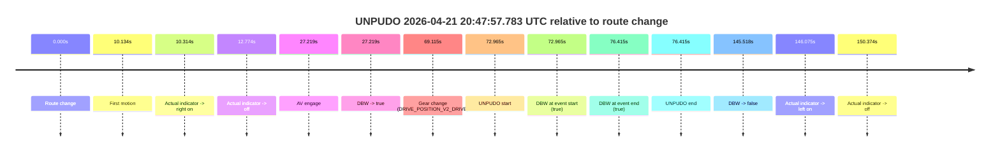
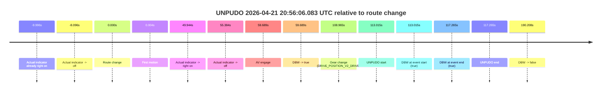
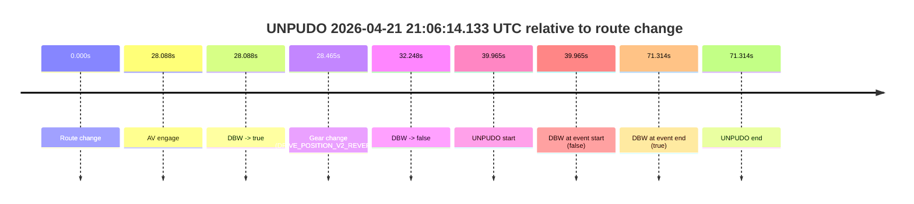

# Run Report: fme20018/2026-04-21--20-26-11--gen2-av-c4a8e9b9-98b0-4dc2-ac2b-0fded51c1291

| Field | Value |
|---|---|
| Run ID | `fme20018/2026-04-21--20-26-11--gen2-av-c4a8e9b9-98b0-4dc2-ac2b-0fded51c1291` |
| Date | `2026-04-21` |
| Model(s) | `eel-teal-outspoken` |
| Author | `zak` |
| Event count | `4` |

## unpudo 2026-04-21 20:44:35.683 UTC

| Field | Value |
|---|---|
| Model | `eel-teal-outspoken` |
| Author | `zak` |
| Run ID | `fme20018/2026-04-21--20-26-11--gen2-av-c4a8e9b9-98b0-4dc2-ac2b-0fded51c1291` |
| Date | `2026-04-21` |
| Time (UTC) | `20:44:35.683` |
| Event type | `unpudo` |
| Disengagement type | `none observed` |
| Route change | `found` |
| Console | [run](https://console.sso.wayve.ai/run/fme20018/2026-04-21--20-26-11--gen2-av-c4a8e9b9-98b0-4dc2-ac2b-0fded51c1291?id=&time-unixus=1776804275683291) |
| Foxglove | [segment](https://app.foxglove.dev/wayve-on-prem/p/prj_0dX18KZdVHg1fmmI/view?ds=foxglove-stream&ds.deviceName=fme20018&ds.start=2026-04-21T20%3A44%3A21.818257Z&ds.end=2026-04-21T20%3A47%3A04.516751Z&layoutId=lay_0e7VD4WIKDQGU73Y&time=2026-04-21T20%3A44%3A35.683291Z) |

### Event card: pass

- Pass: AV owns the credited unpudo from route change through the official unpudo window, the gear state is aligned at the anchor, and the vehicle moves without driver accelerator help in AV.

| Event | Time (UTC) | Delta from route change |
|---|---:|---:|
| Route change | 2026-04-21 20:44:31.818 | `0.000s` |
| AV engage | 2026-04-21 20:44:31.826 | `0.008s` |
| DBW -> true | 2026-04-21 20:44:31.826 | `0.008s` |
| Gear change (DRIVE_POSITION_V2_DRIVE) | 2026-04-21 20:44:32.133 | `0.315s` |
| UNPUDO start | 2026-04-21 20:44:35.683 | `3.865s` |
| DBW at event start (true) | 2026-04-21 20:44:35.683 | `3.865s` |
| First motion | 2026-04-21 20:44:35.732 | `3.914s` |
| DBW at event end (true) | 2026-04-21 20:44:39.033 | `7.215s` |
| UNPUDO end | 2026-04-21 20:44:39.033 | `7.215s` |
| DBW -> false | 2026-04-21 20:46:54.516 | `142.698s` |
| Actual indicator -> right on | 2026-04-21 20:46:55.132 | `143.314s` |
| Actual indicator -> off | 2026-04-21 20:46:57.592 | `145.774s` |

| Metric | Value |
|---|---|
| Outcome | `pass` |
| Effective failure type | `none` |
| Route change status | `found` |
| DBW at event start | `true` |
| DBW at event end | `true` |
| Predicted gear at AV start | `DRIVE_POSITION_V2_PARK` |
| Actual gear at AV start | `DRIVE_POSITION_V2_PARK` |
| Predicted gear at event start | `DRIVE_POSITION_V2_DRIVE` |
| Actual gear at event start | `DRIVE_POSITION_V2_DRIVE` |
| Planned indicator direction | `INDICATORS_STATE_V2_RIGHT_ON` |
| Controller indicator direction | `INDICATORS_STATE_V2_RIGHT_ON` |
| Actual indicator direction | `INDICATORS_STATE_V2_OFF` |
| Actual indicator at maneuver end | `INDICATORS_STATE_V2_OFF` |
| Driver accel help in AV | `false` |
| Driver accel help timestamp | `n/a` |
| Max accel pedal pct in AV | `0.0%` |
| Max brake pedal pct in AV | `8.0%` |
| Max speed mps in AV | `5.378` |
| Success timing baseline | `route change` |
| Route -> AV | `0.008s` |
| AV -> event start | `3.857s` |
| AV -> first motion | `3.906s` |
| Success baseline -> event start | `3.865s` |
| Success baseline -> first motion | `3.914s` |
| AV duration before disengagement | `142.690s` |
| Trajectory waypoint count | `36` |
| Driving-plan step count | `11` |

The scored portion starts from the AV-owned window, not from the pre-AV setup. Route-change search in the stopped pre-event segment was `found`, with the baseline therefore set to route change. At the event anchor the model predicts `DRIVE_POSITION_V2_DRIVE` and the actual gear is `DRIVE_POSITION_V2_DRIVE`. The effective model outcome is `pass` because `the credited unpudo stays AV-owned through the official unpudo window.`

### Resolution

| Field | Value |
|---|---|
| Final outcome | `pass` |
| Do we agree with this label? | `yes` |
| Source disengagement type | `none observed` |
| Resolved effective failure type | `none` |
| Confidence | `high` |

## unpudo 2026-04-21 20:47:57.783 UTC

| Field | Value |
|---|---|
| Model | `eel-teal-outspoken` |
| Author | `zak` |
| Run ID | `fme20018/2026-04-21--20-26-11--gen2-av-c4a8e9b9-98b0-4dc2-ac2b-0fded51c1291` |
| Date | `2026-04-21` |
| Time (UTC) | `20:47:57.783` |
| Event type | `unpudo` |
| Disengagement type | `none observed` |
| Route change | `found` |
| Console | [run](https://console.sso.wayve.ai/run/fme20018/2026-04-21--20-26-11--gen2-av-c4a8e9b9-98b0-4dc2-ac2b-0fded51c1291?id=&time-unixus=1776804477783314) |
| Foxglove | [segment](https://app.foxglove.dev/wayve-on-prem/p/prj_0dX18KZdVHg1fmmI/view?ds=foxglove-stream&ds.deviceName=fme20018&ds.start=2026-04-21T20%3A46%3A34.818245Z&ds.end=2026-04-21T20%3A49%3A20.336326Z&layoutId=lay_0e7VD4WIKDQGU73Y&time=2026-04-21T20%3A47%3A57.783314Z) |

### Event card: pass

- Pass: AV owns the credited unpudo from route change through the official unpudo window, the gear state is aligned at the anchor, and the vehicle moves without driver accelerator help in AV.

| Event | Time (UTC) | Delta from route change |
|---|---:|---:|
| Route change | 2026-04-21 20:46:44.818 | `0.000s` |
| First motion | 2026-04-21 20:46:54.952 | `10.134s` |
| Actual indicator -> right on | 2026-04-21 20:46:55.132 | `10.314s` |
| Actual indicator -> off | 2026-04-21 20:46:57.592 | `12.774s` |
| AV engage | 2026-04-21 20:47:12.037 | `27.219s` |
| DBW -> true | 2026-04-21 20:47:12.037 | `27.219s` |
| Gear change (DRIVE_POSITION_V2_DRIVE) | 2026-04-21 20:47:53.933 | `69.115s` |
| UNPUDO start | 2026-04-21 20:47:57.783 | `72.965s` |
| DBW at event start (true) | 2026-04-21 20:47:57.783 | `72.965s` |
| DBW at event end (true) | 2026-04-21 20:48:01.233 | `76.415s` |
| UNPUDO end | 2026-04-21 20:48:01.233 | `76.415s` |
| DBW -> false | 2026-04-21 20:49:10.336 | `145.518s` |
| Actual indicator -> left on | 2026-04-21 20:49:10.893 | `146.075s` |
| Actual indicator -> off | 2026-04-21 20:49:15.192 | `150.374s` |

| Metric | Value |
|---|---|
| Outcome | `pass` |
| Effective failure type | `none` |
| Route change status | `found` |
| DBW at event start | `true` |
| DBW at event end | `true` |
| Predicted gear at AV start | `DRIVE_POSITION_V2_DRIVE` |
| Actual gear at AV start | `DRIVE_POSITION_V2_DRIVE` |
| Predicted gear at event start | `DRIVE_POSITION_V2_DRIVE` |
| Actual gear at event start | `DRIVE_POSITION_V2_DRIVE` |
| Planned indicator direction | `INDICATORS_STATE_V2_RIGHT_ON` |
| Controller indicator direction | `INDICATORS_STATE_V2_RIGHT_ON` |
| Actual indicator direction | `INDICATORS_STATE_V2_OFF` |
| Actual indicator at maneuver end | `INDICATORS_STATE_V2_OFF` |
| Driver accel help in AV | `false` |
| Driver accel help timestamp | `n/a` |
| Max accel pedal pct in AV | `0.0%` |
| Max brake pedal pct in AV | `21.6%` |
| Max speed mps in AV | `8.044` |
| Success timing baseline | `route change` |
| Route -> AV | `27.219s` |
| AV -> event start | `45.746s` |
| AV -> first motion | `-17.085s` |
| Success baseline -> event start | `72.965s` |
| Success baseline -> first motion | `10.134s` |
| AV duration before disengagement | `118.299s` |
| Trajectory waypoint count | `36` |
| Driving-plan step count | `11` |

The scored portion starts from the AV-owned window, not from the pre-AV setup. Route-change search in the stopped pre-event segment was `found`, with the baseline therefore set to route change. At the event anchor the model predicts `DRIVE_POSITION_V2_DRIVE` and the actual gear is `DRIVE_POSITION_V2_DRIVE`. The effective model outcome is `pass` because `the credited unpudo stays AV-owned through the official unpudo window.`

### Resolution

| Field | Value |
|---|---|
| Final outcome | `pass` |
| Do we agree with this label? | `yes` |
| Source disengagement type | `none observed` |
| Resolved effective failure type | `none` |
| Confidence | `high` |

## unpudo 2026-04-21 20:56:06.083 UTC

| Field | Value |
|---|---|
| Model | `eel-teal-outspoken` |
| Author | `zak` |
| Run ID | `fme20018/2026-04-21--20-26-11--gen2-av-c4a8e9b9-98b0-4dc2-ac2b-0fded51c1291` |
| Date | `2026-04-21` |
| Time (UTC) | `20:56:06.083` |
| Event type | `unpudo` |
| Disengagement type | `none observed` |
| Route change | `found` |
| Console | [run](https://console.sso.wayve.ai/run/fme20018/2026-04-21--20-26-11--gen2-av-c4a8e9b9-98b0-4dc2-ac2b-0fded51c1291?id=&time-unixus=1776804966083314) |
| Foxglove | [segment](https://app.foxglove.dev/wayve-on-prem/p/prj_0dX18KZdVHg1fmmI/view?ds=foxglove-stream&ds.deviceName=fme20018&ds.start=2026-04-21T20%3A54%3A03.068293Z&ds.end=2026-04-21T20%3A57%3A33.276450Z&layoutId=lay_0e7VD4WIKDQGU73Y&time=2026-04-21T20%3A56%3A06.083314Z) |

### Event card: pass

- Pass: AV owns the credited unpudo from route change through the official unpudo window, the gear state is aligned at the anchor, and the vehicle moves without driver accelerator help in AV.

| Event | Time (UTC) | Delta from route change |
|---|---:|---:|
| Actual indicator already right on | 2026-04-21 20:54:03.072 | `-9.996s` |
| Actual indicator -> off | 2026-04-21 20:54:04.972 | `-8.096s` |
| Route change | 2026-04-21 20:54:13.068 | `0.000s` |
| First motion | 2026-04-21 20:54:13.072 | `0.004s` |
| Actual indicator -> right on | 2026-04-21 20:55:03.012 | `49.944s` |
| Actual indicator -> off | 2026-04-21 20:55:08.452 | `55.384s` |
| AV engage | 2026-04-21 20:55:12.757 | `59.689s` |
| DBW -> true | 2026-04-21 20:55:12.757 | `59.689s` |
| Gear change (DRIVE_POSITION_V2_DRIVE) | 2026-04-21 20:56:02.033 | `108.965s` |
| UNPUDO start | 2026-04-21 20:56:06.083 | `113.015s` |
| DBW at event start (true) | 2026-04-21 20:56:06.083 | `113.015s` |
| DBW at event end (true) | 2026-04-21 20:56:10.333 | `117.265s` |
| UNPUDO end | 2026-04-21 20:56:10.333 | `117.265s` |
| DBW -> false | 2026-04-21 20:57:23.276 | `190.208s` |

| Metric | Value |
|---|---|
| Outcome | `pass` |
| Effective failure type | `none` |
| Route change status | `found` |
| DBW at event start | `true` |
| DBW at event end | `true` |
| Predicted gear at AV start | `DRIVE_POSITION_V2_DRIVE` |
| Actual gear at AV start | `DRIVE_POSITION_V2_DRIVE` |
| Predicted gear at event start | `DRIVE_POSITION_V2_DRIVE` |
| Actual gear at event start | `DRIVE_POSITION_V2_DRIVE` |
| Planned indicator direction | `INDICATORS_STATE_V2_RIGHT_ON` |
| Controller indicator direction | `INDICATORS_STATE_V2_RIGHT_ON` |
| Actual indicator direction | `INDICATORS_STATE_V2_OFF` |
| Actual indicator at maneuver end | `INDICATORS_STATE_V2_OFF` |
| Driver accel help in AV | `false` |
| Driver accel help timestamp | `n/a` |
| Max accel pedal pct in AV | `0.0%` |
| Max brake pedal pct in AV | `12.2%` |
| Max speed mps in AV | `7.344` |
| Success timing baseline | `route change` |
| Route -> AV | `59.689s` |
| AV -> event start | `53.326s` |
| AV -> first motion | `-59.685s` |
| Success baseline -> event start | `113.015s` |
| Success baseline -> first motion | `0.004s` |
| AV duration before disengagement | `130.519s` |
| Trajectory waypoint count | `36` |
| Driving-plan step count | `11` |

The scored portion starts from the AV-owned window, not from the pre-AV setup. Route-change search in the stopped pre-event segment was `found`, with the baseline therefore set to route change. At the event anchor the model predicts `DRIVE_POSITION_V2_DRIVE` and the actual gear is `DRIVE_POSITION_V2_DRIVE`. The effective model outcome is `pass` because `the credited unpudo stays AV-owned through the official unpudo window.`

### Resolution

| Field | Value |
|---|---|
| Final outcome | `pass` |
| Do we agree with this label? | `yes` |
| Source disengagement type | `none observed` |
| Resolved effective failure type | `none` |
| Confidence | `high` |

## unpudo 2026-04-21 21:06:14.133 UTC

| Field | Value |
|---|---|
| Model | `eel-teal-outspoken` |
| Author | `zak` |
| Run ID | `fme20018/2026-04-21--20-26-11--gen2-av-c4a8e9b9-98b0-4dc2-ac2b-0fded51c1291` |
| Date | `2026-04-21` |
| Time (UTC) | `21:06:14.133` |
| Event type | `unpudo` |
| Disengagement type | `none observed` |
| Route change | `found` |
| Console | [run](https://console.sso.wayve.ai/run/fme20018/2026-04-21--20-26-11--gen2-av-c4a8e9b9-98b0-4dc2-ac2b-0fded51c1291?id=&time-unixus=1776805574133294) |
| Foxglove | [segment](https://app.foxglove.dev/wayve-on-prem/p/prj_0dX18KZdVHg1fmmI/view?ds=foxglove-stream&ds.deviceName=fme20018&ds.start=2026-04-21T21%3A05%3A24.168793Z&ds.end=2026-04-21T21%3A06%3A55.483293Z&layoutId=lay_0e7VD4WIKDQGU73Y&time=2026-04-21T21%3A06%3A14.133294Z) |

### Event card: fail

- Fail: the credited unpudo does not stay AV-owned. The event window starts with DBW false, and the maneuver outcome lands outside a clean AV-owned segment.

| Event | Time (UTC) | Delta from route change |
|---|---:|---:|
| Route change | 2026-04-21 21:05:34.168 | `0.000s` |
| AV engage | 2026-04-21 21:06:02.256 | `28.088s` |
| DBW -> true | 2026-04-21 21:06:02.256 | `28.088s` |
| Gear change (DRIVE_POSITION_V2_REVERSE) | 2026-04-21 21:06:02.633 | `28.465s` |
| DBW -> false | 2026-04-21 21:06:06.417 | `32.248s` |
| UNPUDO start | 2026-04-21 21:06:14.133 | `39.965s` |
| DBW at event start (false) | 2026-04-21 21:06:14.133 | `39.965s` |
| DBW at event end (true) | 2026-04-21 21:06:45.483 | `71.314s` |
| UNPUDO end | 2026-04-21 21:06:45.483 | `71.314s` |

| Metric | Value |
|---|---|
| Outcome | `fail` |
| Effective failure type | `not_av_owned` |
| Route change status | `found` |
| DBW at event start | `false` |
| DBW at event end | `true` |
| Predicted gear at AV start | `DRIVE_POSITION_V2_PARK` |
| Actual gear at AV start | `DRIVE_POSITION_V2_PARK` |
| Predicted gear at event start | `DRIVE_POSITION_V2_REVERSE` |
| Actual gear at event start | `DRIVE_POSITION_V2_REVERSE` |
| Planned indicator direction | `INDICATORS_STATE_V2_OFF` |
| Controller indicator direction | `INDICATORS_STATE_V2_OFF` |
| Actual indicator direction | `INDICATORS_STATE_V2_OFF` |
| Actual indicator at maneuver end | `INDICATORS_STATE_V2_OFF` |
| Driver accel help in AV | `false` |
| Driver accel help timestamp | `n/a` |
| Max accel pedal pct in AV | `0.0%` |
| Max brake pedal pct in AV | `8.0%` |
| Max speed mps in AV | `0.000` |
| Success timing baseline | `route change` |
| Route -> AV | `28.088s` |
| AV -> event start | `11.877s` |
| AV -> first motion | `n/a` |
| Success baseline -> event start | `39.965s` |
| Success baseline -> first motion | `n/a` |
| AV duration before disengagement | `4.160s` |
| Trajectory waypoint count | `37` |
| Driving-plan step count | `11` |

The scored portion starts from the AV-owned window, not from the pre-AV setup. Route-change search in the stopped pre-event segment was `found`, with the baseline therefore set to route change. At the event anchor the model predicts `DRIVE_POSITION_V2_REVERSE` and the actual gear is `DRIVE_POSITION_V2_REVERSE`. The effective model outcome is `fail` because `not_av_owned.`

### Resolution

| Field | Value |
|---|---|
| Final outcome | `fail` |
| Do we agree with this label? | `yes` |
| Source disengagement type | `none observed` |
| Resolved effective failure type | `not_av_owned` |
| Confidence | `high` |
