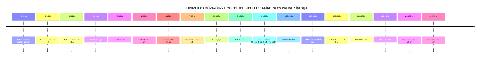
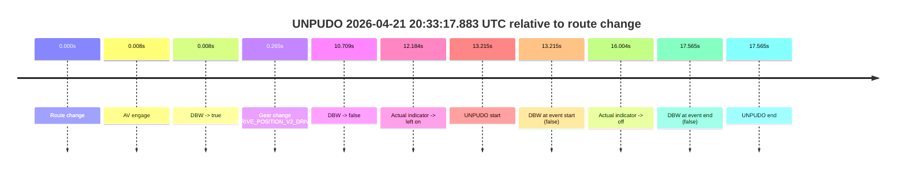
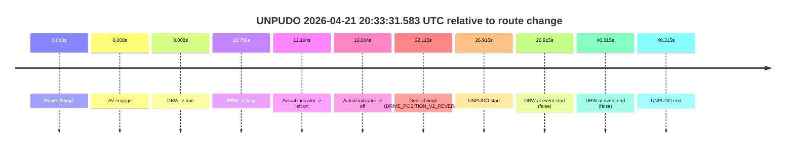
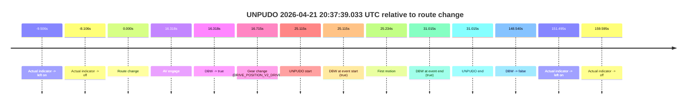
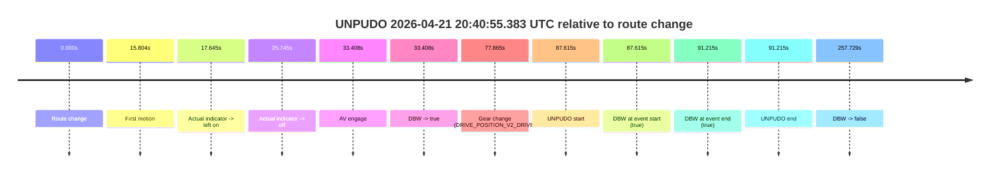
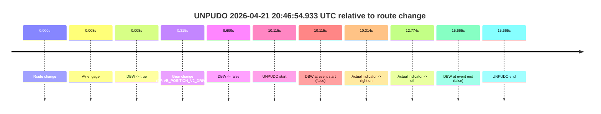
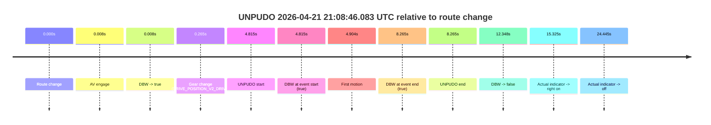

# Run Report: fme20018/2026-04-21--20-26-11--gen2-av-c4a8e9b9-98b0-4dc2-ac2b-0fded51c1291

| Field | Value |
|---|---|
| Run ID | `fme20018/2026-04-21--20-26-11--gen2-av-c4a8e9b9-98b0-4dc2-ac2b-0fded51c1291` |
| Date | `2026-04-21` |
| Model(s) | `pink-manta-ray-smooth` |
| Author | `guy.geva` |
| Event count | `7` |

## unpudo 2026-04-21 20:31:03.583 UTC

| Field | Value |
|---|---|
| Model | `pink-manta-ray-smooth` |
| Author | `guy.geva` |
| Run ID | `fme20018/2026-04-21--20-26-11--gen2-av-c4a8e9b9-98b0-4dc2-ac2b-0fded51c1291` |
| Date | `2026-04-21` |
| Time (UTC) | `20:31:03.583` |
| Event type | `unpudo` |
| Disengagement type | `none observed` |
| Route change | `found` |
| Console | [run](https://console.sso.wayve.ai/run/fme20018/2026-04-21--20-26-11--gen2-av-c4a8e9b9-98b0-4dc2-ac2b-0fded51c1291?id=&time-unixus=1776803463583299) |
| Foxglove | [segment](https://app.foxglove.dev/wayve-on-prem/p/prj_0dX18KZdVHg1fmmI/view?ds=foxglove-stream&ds.deviceName=fme20018&ds.start=2026-04-21T20%3A29%3A09.968518Z&ds.end=2026-04-21T20%3A33%3A25.376983Z&layoutId=lay_0e7VD4WIKDQGU73Y&time=2026-04-21T20%3A31%3A03.583299Z) |

### Event card: pass

- Pass: AV owns the credited unpudo from route change through the official unpudo window, the gear state is aligned at the anchor, and the vehicle moves without driver accelerator help in AV.

| Event | Time (UTC) | Delta from route change |
|---|---:|---:|
| Actual indicator already right on | 2026-04-21 20:29:09.972 | `-9.996s` |
| Actual indicator -> off | 2026-04-21 20:29:14.833 | `-5.135s` |
| Actual indicator -> left on | 2026-04-21 20:29:19.652 | `-0.316s` |
| Route change | 2026-04-21 20:29:19.968 | `0.000s` |
| First motion | 2026-04-21 20:29:19.972 | `0.004s` |
| Actual indicator -> off | 2026-04-21 20:29:22.332 | `2.364s` |
| Actual indicator -> left on | 2026-04-21 20:29:23.133 | `3.165s` |
| Actual indicator -> off | 2026-04-21 20:29:27.032 | `7.064s` |
| AV engage | 2026-04-21 20:30:54.336 | `94.368s` |
| DBW -> true | 2026-04-21 20:30:54.336 | `94.368s` |
| Gear change (DRIVE_POSITION_V2_DRIVE) | 2026-04-21 20:30:54.833 | `94.865s` |
| UNPUDO start | 2026-04-21 20:31:03.583 | `103.615s` |
| DBW at event start (true) | 2026-04-21 20:31:03.583 | `103.615s` |
| DBW at event end (true) | 2026-04-21 20:31:08.333 | `108.365s` |
| UNPUDO end | 2026-04-21 20:31:08.333 | `108.365s` |
| DBW -> false | 2026-04-21 20:33:15.376 | `235.408s` |
| Actual indicator -> left on | 2026-04-21 20:33:16.852 | `236.884s` |
| Actual indicator -> off | 2026-04-21 20:33:20.672 | `240.704s` |

| Metric | Value |
|---|---|
| Outcome | `pass` |
| Effective failure type | `none` |
| Route change status | `found` |
| DBW at event start | `true` |
| DBW at event end | `true` |
| Predicted gear at AV start | `DRIVE_POSITION_V2_REVERSE` |
| Actual gear at AV start | `DRIVE_POSITION_V2_PARK` |
| Predicted gear at event start | `DRIVE_POSITION_V2_DRIVE` |
| Actual gear at event start | `DRIVE_POSITION_V2_DRIVE` |
| Planned indicator direction | `INDICATORS_STATE_V2_RIGHT_ON` |
| Controller indicator direction | `INDICATORS_STATE_V2_RIGHT_ON` |
| Actual indicator direction | `INDICATORS_STATE_V2_OFF` |
| Actual indicator at maneuver end | `INDICATORS_STATE_V2_OFF` |
| Driver accel help in AV | `false` |
| Driver accel help timestamp | `n/a` |
| Max accel pedal pct in AV | `0.0%` |
| Max brake pedal pct in AV | `8.3%` |
| Max speed mps in AV | `3.697` |
| Success timing baseline | `route change` |
| Route -> AV | `94.368s` |
| AV -> event start | `9.247s` |
| AV -> first motion | `-94.364s` |
| Success baseline -> event start | `103.615s` |
| Success baseline -> first motion | `0.004s` |
| AV duration before disengagement | `141.040s` |
| Trajectory waypoint count | `36` |
| Driving-plan step count | `11` |

The scored portion starts from the AV-owned window, not from the pre-AV setup. Route-change search in the stopped pre-event segment was `found`, with the baseline therefore set to route change. At the event anchor the model predicts `DRIVE_POSITION_V2_DRIVE` and the actual gear is `DRIVE_POSITION_V2_DRIVE`. The effective model outcome is `pass` because `the credited unpudo stays AV-owned through the official unpudo window.`

### Resolution

| Field | Value |
|---|---|
| Final outcome | `pass` |
| Do we agree with this label? | `yes` |
| Source disengagement type | `none observed` |
| Resolved effective failure type | `none` |
| Confidence | `high` |

## unpudo 2026-04-21 20:33:17.883 UTC

| Field | Value |
|---|---|
| Model | `pink-manta-ray-smooth` |
| Author | `guy.geva` |
| Run ID | `fme20018/2026-04-21--20-26-11--gen2-av-c4a8e9b9-98b0-4dc2-ac2b-0fded51c1291` |
| Date | `2026-04-21` |
| Time (UTC) | `20:33:17.883` |
| Event type | `unpudo` |
| Disengagement type | `none observed` |
| Route change | `found` |
| Console | [run](https://console.sso.wayve.ai/run/fme20018/2026-04-21--20-26-11--gen2-av-c4a8e9b9-98b0-4dc2-ac2b-0fded51c1291?id=&time-unixus=1776803597883304) |
| Foxglove | [segment](https://app.foxglove.dev/wayve-on-prem/p/prj_0dX18KZdVHg1fmmI/view?ds=foxglove-stream&ds.deviceName=fme20018&ds.start=2026-04-21T20%3A32%3A54.668282Z&ds.end=2026-04-21T20%3A33%3A32.233306Z&layoutId=lay_0e7VD4WIKDQGU73Y&time=2026-04-21T20%3A33%3A17.883304Z) |

### Event card: fail

- Fail: the credited unpudo does not stay AV-owned. The event window starts with DBW false, and the maneuver outcome lands outside a clean AV-owned segment.

| Event | Time (UTC) | Delta from route change |
|---|---:|---:|
| Route change | 2026-04-21 20:33:04.668 | `0.000s` |
| AV engage | 2026-04-21 20:33:04.676 | `0.008s` |
| DBW -> true | 2026-04-21 20:33:04.676 | `0.008s` |
| Gear change (DRIVE_POSITION_V2_DRIVE) | 2026-04-21 20:33:04.933 | `0.265s` |
| DBW -> false | 2026-04-21 20:33:15.376 | `10.709s` |
| Actual indicator -> left on | 2026-04-21 20:33:16.852 | `12.184s` |
| UNPUDO start | 2026-04-21 20:33:17.883 | `13.215s` |
| DBW at event start (false) | 2026-04-21 20:33:17.883 | `13.215s` |
| Actual indicator -> off | 2026-04-21 20:33:20.672 | `16.004s` |
| DBW at event end (false) | 2026-04-21 20:33:22.233 | `17.565s` |
| UNPUDO end | 2026-04-21 20:33:22.233 | `17.565s` |

| Metric | Value |
|---|---|
| Outcome | `fail` |
| Effective failure type | `not_av_owned` |
| Route change status | `found` |
| DBW at event start | `false` |
| DBW at event end | `false` |
| Predicted gear at AV start | `DRIVE_POSITION_V2_PARK` |
| Actual gear at AV start | `DRIVE_POSITION_V2_PARK` |
| Predicted gear at event start | `DRIVE_POSITION_V2_DRIVE` |
| Actual gear at event start | `DRIVE_POSITION_V2_DRIVE` |
| Planned indicator direction | `INDICATORS_STATE_V2_LEFT_ON` |
| Controller indicator direction | `INDICATORS_STATE_V2_LEFT_ON` |
| Actual indicator direction | `INDICATORS_STATE_V2_LEFT_ON` |
| Actual indicator at maneuver end | `INDICATORS_STATE_V2_OFF` |
| Driver accel help in AV | `false` |
| Driver accel help timestamp | `n/a` |
| Max accel pedal pct in AV | `0.0%` |
| Max brake pedal pct in AV | `9.6%` |
| Max speed mps in AV | `0.000` |
| Success timing baseline | `route change` |
| Route -> AV | `0.008s` |
| AV -> event start | `13.207s` |
| AV -> first motion | `n/a` |
| Success baseline -> event start | `13.215s` |
| Success baseline -> first motion | `n/a` |
| AV duration before disengagement | `10.700s` |
| Trajectory waypoint count | `36` |
| Driving-plan step count | `11` |

The scored portion starts from the AV-owned window, not from the pre-AV setup. Route-change search in the stopped pre-event segment was `found`, with the baseline therefore set to route change. At the event anchor the model predicts `DRIVE_POSITION_V2_DRIVE` and the actual gear is `DRIVE_POSITION_V2_DRIVE`. The effective model outcome is `fail` because `not_av_owned.`

### Resolution

| Field | Value |
|---|---|
| Final outcome | `fail` |
| Do we agree with this label? | `yes` |
| Source disengagement type | `none observed` |
| Resolved effective failure type | `not_av_owned` |
| Confidence | `high` |

## unpudo 2026-04-21 20:33:31.583 UTC

| Field | Value |
|---|---|
| Model | `pink-manta-ray-smooth` |
| Author | `guy.geva` |
| Run ID | `fme20018/2026-04-21--20-26-11--gen2-av-c4a8e9b9-98b0-4dc2-ac2b-0fded51c1291` |
| Date | `2026-04-21` |
| Time (UTC) | `20:33:31.583` |
| Event type | `unpudo` |
| Disengagement type | `none observed` |
| Route change | `found` |
| Console | [run](https://console.sso.wayve.ai/run/fme20018/2026-04-21--20-26-11--gen2-av-c4a8e9b9-98b0-4dc2-ac2b-0fded51c1291?id=&time-unixus=1776803611583292) |
| Foxglove | [segment](https://app.foxglove.dev/wayve-on-prem/p/prj_0dX18KZdVHg1fmmI/view?ds=foxglove-stream&ds.deviceName=fme20018&ds.start=2026-04-21T20%3A32%3A54.668282Z&ds.end=2026-04-21T20%3A33%3A54.983307Z&layoutId=lay_0e7VD4WIKDQGU73Y&time=2026-04-21T20%3A33%3A31.583292Z) |

### Event card: fail

- Fail: the credited unpudo does not stay AV-owned. The event window starts with DBW false, and the maneuver outcome lands outside a clean AV-owned segment.

| Event | Time (UTC) | Delta from route change |
|---|---:|---:|
| Route change | 2026-04-21 20:33:04.668 | `0.000s` |
| AV engage | 2026-04-21 20:33:04.676 | `0.008s` |
| DBW -> true | 2026-04-21 20:33:04.676 | `0.008s` |
| DBW -> false | 2026-04-21 20:33:15.376 | `10.709s` |
| Actual indicator -> left on | 2026-04-21 20:33:16.852 | `12.184s` |
| Actual indicator -> off | 2026-04-21 20:33:20.672 | `16.004s` |
| Gear change (DRIVE_POSITION_V2_REVERSE) | 2026-04-21 20:33:26.783 | `22.115s` |
| UNPUDO start | 2026-04-21 20:33:31.583 | `26.915s` |
| DBW at event start (false) | 2026-04-21 20:33:31.583 | `26.915s` |
| DBW at event end (false) | 2026-04-21 20:33:44.983 | `40.315s` |
| UNPUDO end | 2026-04-21 20:33:44.983 | `40.315s` |

| Metric | Value |
|---|---|
| Outcome | `fail` |
| Effective failure type | `not_av_owned` |
| Route change status | `found` |
| DBW at event start | `false` |
| DBW at event end | `false` |
| Predicted gear at AV start | `DRIVE_POSITION_V2_PARK` |
| Actual gear at AV start | `DRIVE_POSITION_V2_PARK` |
| Predicted gear at event start | `DRIVE_POSITION_V2_REVERSE` |
| Actual gear at event start | `DRIVE_POSITION_V2_REVERSE` |
| Planned indicator direction | `INDICATORS_STATE_V2_OFF` |
| Controller indicator direction | `INDICATORS_STATE_V2_OFF` |
| Actual indicator direction | `INDICATORS_STATE_V2_OFF` |
| Actual indicator at maneuver end | `INDICATORS_STATE_V2_OFF` |
| Driver accel help in AV | `false` |
| Driver accel help timestamp | `n/a` |
| Max accel pedal pct in AV | `0.0%` |
| Max brake pedal pct in AV | `9.6%` |
| Max speed mps in AV | `0.000` |
| Success timing baseline | `route change` |
| Route -> AV | `0.008s` |
| AV -> event start | `26.907s` |
| AV -> first motion | `n/a` |
| Success baseline -> event start | `26.915s` |
| Success baseline -> first motion | `n/a` |
| AV duration before disengagement | `10.700s` |
| Trajectory waypoint count | `36` |
| Driving-plan step count | `11` |

The scored portion starts from the AV-owned window, not from the pre-AV setup. Route-change search in the stopped pre-event segment was `found`, with the baseline therefore set to route change. At the event anchor the model predicts `DRIVE_POSITION_V2_REVERSE` and the actual gear is `DRIVE_POSITION_V2_REVERSE`. The effective model outcome is `fail` because `not_av_owned.`

### Resolution

| Field | Value |
|---|---|
| Final outcome | `fail` |
| Do we agree with this label? | `yes` |
| Source disengagement type | `none observed` |
| Resolved effective failure type | `not_av_owned` |
| Confidence | `high` |

## unpudo 2026-04-21 20:37:39.033 UTC

| Field | Value |
|---|---|
| Model | `pink-manta-ray-smooth` |
| Author | `guy.geva` |
| Run ID | `fme20018/2026-04-21--20-26-11--gen2-av-c4a8e9b9-98b0-4dc2-ac2b-0fded51c1291` |
| Date | `2026-04-21` |
| Time (UTC) | `20:37:39.033` |
| Event type | `unpudo` |
| Disengagement type | `none observed` |
| Route change | `found` |
| Console | [run](https://console.sso.wayve.ai/run/fme20018/2026-04-21--20-26-11--gen2-av-c4a8e9b9-98b0-4dc2-ac2b-0fded51c1291?id=&time-unixus=1776803859033305) |
| Foxglove | [segment](https://app.foxglove.dev/wayve-on-prem/p/prj_0dX18KZdVHg1fmmI/view?ds=foxglove-stream&ds.deviceName=fme20018&ds.start=2026-04-21T20%3A37%3A03.918235Z&ds.end=2026-04-21T20%3A39%3A52.458140Z&layoutId=lay_0e7VD4WIKDQGU73Y&time=2026-04-21T20%3A37%3A39.033305Z) |

### Event card: pass

- Pass: AV owns the credited unpudo from route change through the official unpudo window, the gear state is aligned at the anchor, and the vehicle moves without driver accelerator help in AV.

| Event | Time (UTC) | Delta from route change |
|---|---:|---:|
| Actual indicator -> left on | 2026-04-21 20:37:04.412 | `-9.506s` |
| Actual indicator -> off | 2026-04-21 20:37:05.812 | `-8.106s` |
| Route change | 2026-04-21 20:37:13.918 | `0.000s` |
| AV engage | 2026-04-21 20:37:30.236 | `16.318s` |
| DBW -> true | 2026-04-21 20:37:30.236 | `16.318s` |
| Gear change (DRIVE_POSITION_V2_DRIVE) | 2026-04-21 20:37:30.633 | `16.715s` |
| UNPUDO start | 2026-04-21 20:37:39.033 | `25.115s` |
| DBW at event start (true) | 2026-04-21 20:37:39.033 | `25.115s` |
| First motion | 2026-04-21 20:37:39.152 | `25.234s` |
| DBW at event end (true) | 2026-04-21 20:37:44.933 | `31.015s` |
| UNPUDO end | 2026-04-21 20:37:44.933 | `31.015s` |
| DBW -> false | 2026-04-21 20:39:42.458 | `148.540s` |
| Actual indicator -> left on | 2026-04-21 20:39:45.413 | `151.495s` |
| Actual indicator -> off | 2026-04-21 20:39:53.513 | `159.595s` |

| Metric | Value |
|---|---|
| Outcome | `pass` |
| Effective failure type | `none` |
| Route change status | `found` |
| DBW at event start | `true` |
| DBW at event end | `true` |
| Predicted gear at AV start | `DRIVE_POSITION_V2_REVERSE` |
| Actual gear at AV start | `DRIVE_POSITION_V2_PARK` |
| Predicted gear at event start | `DRIVE_POSITION_V2_DRIVE` |
| Actual gear at event start | `DRIVE_POSITION_V2_DRIVE` |
| Planned indicator direction | `INDICATORS_STATE_V2_RIGHT_ON` |
| Controller indicator direction | `INDICATORS_STATE_V2_RIGHT_ON` |
| Actual indicator direction | `INDICATORS_STATE_V2_OFF` |
| Actual indicator at maneuver end | `INDICATORS_STATE_V2_OFF` |
| Driver accel help in AV | `false` |
| Driver accel help timestamp | `n/a` |
| Max accel pedal pct in AV | `0.0%` |
| Max brake pedal pct in AV | `9.4%` |
| Max speed mps in AV | `3.819` |
| Success timing baseline | `route change` |
| Route -> AV | `16.318s` |
| AV -> event start | `8.797s` |
| AV -> first motion | `8.916s` |
| Success baseline -> event start | `25.115s` |
| Success baseline -> first motion | `25.234s` |
| AV duration before disengagement | `132.222s` |
| Trajectory waypoint count | `35` |
| Driving-plan step count | `11` |

The scored portion starts from the AV-owned window, not from the pre-AV setup. Route-change search in the stopped pre-event segment was `found`, with the baseline therefore set to route change. At the event anchor the model predicts `DRIVE_POSITION_V2_DRIVE` and the actual gear is `DRIVE_POSITION_V2_DRIVE`. The effective model outcome is `pass` because `the credited unpudo stays AV-owned through the official unpudo window.`

### Resolution

| Field | Value |
|---|---|
| Final outcome | `pass` |
| Do we agree with this label? | `yes` |
| Source disengagement type | `none observed` |
| Resolved effective failure type | `none` |
| Confidence | `high` |

## unpudo 2026-04-21 20:40:55.383 UTC

| Field | Value |
|---|---|
| Model | `pink-manta-ray-smooth` |
| Author | `guy.geva` |
| Run ID | `fme20018/2026-04-21--20-26-11--gen2-av-c4a8e9b9-98b0-4dc2-ac2b-0fded51c1291` |
| Date | `2026-04-21` |
| Time (UTC) | `20:40:55.383` |
| Event type | `unpudo` |
| Disengagement type | `none observed` |
| Route change | `found` |
| Console | [run](https://console.sso.wayve.ai/run/fme20018/2026-04-21--20-26-11--gen2-av-c4a8e9b9-98b0-4dc2-ac2b-0fded51c1291?id=&time-unixus=1776804055383312) |
| Foxglove | [segment](https://app.foxglove.dev/wayve-on-prem/p/prj_0dX18KZdVHg1fmmI/view?ds=foxglove-stream&ds.deviceName=fme20018&ds.start=2026-04-21T20%3A39%3A17.768260Z&ds.end=2026-04-21T20%3A43%3A55.497436Z&layoutId=lay_0e7VD4WIKDQGU73Y&time=2026-04-21T20%3A40%3A55.383312Z) |

### Event card: pass

- Pass: AV owns the credited unpudo from route change through the official unpudo window, the gear state is aligned at the anchor, and the vehicle moves without driver accelerator help in AV.

| Event | Time (UTC) | Delta from route change |
|---|---:|---:|
| Route change | 2026-04-21 20:39:27.768 | `0.000s` |
| First motion | 2026-04-21 20:39:43.572 | `15.804s` |
| Actual indicator -> left on | 2026-04-21 20:39:45.413 | `17.645s` |
| Actual indicator -> off | 2026-04-21 20:39:53.513 | `25.745s` |
| AV engage | 2026-04-21 20:40:01.176 | `33.408s` |
| DBW -> true | 2026-04-21 20:40:01.176 | `33.408s` |
| Gear change (DRIVE_POSITION_V2_DRIVE) | 2026-04-21 20:40:45.633 | `77.865s` |
| UNPUDO start | 2026-04-21 20:40:55.383 | `87.615s` |
| DBW at event start (true) | 2026-04-21 20:40:55.383 | `87.615s` |
| DBW at event end (true) | 2026-04-21 20:40:58.983 | `91.215s` |
| UNPUDO end | 2026-04-21 20:40:58.983 | `91.215s` |
| DBW -> false | 2026-04-21 20:43:45.497 | `257.729s` |

| Metric | Value |
|---|---|
| Outcome | `pass` |
| Effective failure type | `none` |
| Route change status | `found` |
| DBW at event start | `true` |
| DBW at event end | `true` |
| Predicted gear at AV start | `DRIVE_POSITION_V2_DRIVE` |
| Actual gear at AV start | `DRIVE_POSITION_V2_DRIVE` |
| Predicted gear at event start | `DRIVE_POSITION_V2_DRIVE` |
| Actual gear at event start | `DRIVE_POSITION_V2_DRIVE` |
| Planned indicator direction | `INDICATORS_STATE_V2_RIGHT_ON` |
| Controller indicator direction | `INDICATORS_STATE_V2_RIGHT_ON` |
| Actual indicator direction | `INDICATORS_STATE_V2_OFF` |
| Actual indicator at maneuver end | `INDICATORS_STATE_V2_OFF` |
| Driver accel help in AV | `false` |
| Driver accel help timestamp | `n/a` |
| Max accel pedal pct in AV | `0.0%` |
| Max brake pedal pct in AV | `8.0%` |
| Max speed mps in AV | `7.992` |
| Success timing baseline | `route change` |
| Route -> AV | `33.408s` |
| AV -> event start | `54.207s` |
| AV -> first motion | `-17.604s` |
| Success baseline -> event start | `87.615s` |
| Success baseline -> first motion | `15.804s` |
| AV duration before disengagement | `224.321s` |
| Trajectory waypoint count | `36` |
| Driving-plan step count | `11` |

The scored portion starts from the AV-owned window, not from the pre-AV setup. Route-change search in the stopped pre-event segment was `found`, with the baseline therefore set to route change. At the event anchor the model predicts `DRIVE_POSITION_V2_DRIVE` and the actual gear is `DRIVE_POSITION_V2_DRIVE`. The effective model outcome is `pass` because `the credited unpudo stays AV-owned through the official unpudo window.`

### Resolution

| Field | Value |
|---|---|
| Final outcome | `pass` |
| Do we agree with this label? | `yes` |
| Source disengagement type | `none observed` |
| Resolved effective failure type | `none` |
| Confidence | `high` |

## unpudo 2026-04-21 20:46:54.933 UTC

| Field | Value |
|---|---|
| Model | `pink-manta-ray-smooth` |
| Author | `guy.geva` |
| Run ID | `fme20018/2026-04-21--20-26-11--gen2-av-c4a8e9b9-98b0-4dc2-ac2b-0fded51c1291` |
| Date | `2026-04-21` |
| Time (UTC) | `20:46:54.933` |
| Event type | `unpudo` |
| Disengagement type | `none observed` |
| Route change | `found` |
| Console | [run](https://console.sso.wayve.ai/run/fme20018/2026-04-21--20-26-11--gen2-av-c4a8e9b9-98b0-4dc2-ac2b-0fded51c1291?id=&time-unixus=1776804414933318) |
| Foxglove | [segment](https://app.foxglove.dev/wayve-on-prem/p/prj_0dX18KZdVHg1fmmI/view?ds=foxglove-stream&ds.deviceName=fme20018&ds.start=2026-04-21T20%3A46%3A34.818245Z&ds.end=2026-04-21T20%3A47%3A10.483304Z&layoutId=lay_0e7VD4WIKDQGU73Y&time=2026-04-21T20%3A46%3A54.933318Z) |

### Event card: fail

- Fail: the credited unpudo does not stay AV-owned. The event window starts with DBW false, and the maneuver outcome lands outside a clean AV-owned segment.

| Event | Time (UTC) | Delta from route change |
|---|---:|---:|
| Route change | 2026-04-21 20:46:44.818 | `0.000s` |
| AV engage | 2026-04-21 20:46:44.826 | `0.008s` |
| DBW -> true | 2026-04-21 20:46:44.826 | `0.008s` |
| Gear change (DRIVE_POSITION_V2_DRIVE) | 2026-04-21 20:46:45.133 | `0.315s` |
| DBW -> false | 2026-04-21 20:46:54.516 | `9.699s` |
| UNPUDO start | 2026-04-21 20:46:54.933 | `10.115s` |
| DBW at event start (false) | 2026-04-21 20:46:54.933 | `10.115s` |
| Actual indicator -> right on | 2026-04-21 20:46:55.132 | `10.314s` |
| Actual indicator -> off | 2026-04-21 20:46:57.592 | `12.774s` |
| DBW at event end (false) | 2026-04-21 20:47:00.483 | `15.665s` |
| UNPUDO end | 2026-04-21 20:47:00.483 | `15.665s` |

| Metric | Value |
|---|---|
| Outcome | `fail` |
| Effective failure type | `not_av_owned` |
| Route change status | `found` |
| DBW at event start | `false` |
| DBW at event end | `false` |
| Predicted gear at AV start | `DRIVE_POSITION_V2_PARK` |
| Actual gear at AV start | `DRIVE_POSITION_V2_PARK` |
| Predicted gear at event start | `DRIVE_POSITION_V2_DRIVE` |
| Actual gear at event start | `DRIVE_POSITION_V2_DRIVE` |
| Planned indicator direction | `INDICATORS_STATE_V2_LEFT_ON` |
| Controller indicator direction | `INDICATORS_STATE_V2_LEFT_ON` |
| Actual indicator direction | `INDICATORS_STATE_V2_OFF` |
| Actual indicator at maneuver end | `INDICATORS_STATE_V2_OFF` |
| Driver accel help in AV | `false` |
| Driver accel help timestamp | `n/a` |
| Max accel pedal pct in AV | `0.0%` |
| Max brake pedal pct in AV | `8.0%` |
| Max speed mps in AV | `0.000` |
| Success timing baseline | `route change` |
| Route -> AV | `0.008s` |
| AV -> event start | `10.107s` |
| AV -> first motion | `n/a` |
| Success baseline -> event start | `10.115s` |
| Success baseline -> first motion | `n/a` |
| AV duration before disengagement | `9.690s` |
| Trajectory waypoint count | `37` |
| Driving-plan step count | `11` |

The scored portion starts from the AV-owned window, not from the pre-AV setup. Route-change search in the stopped pre-event segment was `found`, with the baseline therefore set to route change. At the event anchor the model predicts `DRIVE_POSITION_V2_DRIVE` and the actual gear is `DRIVE_POSITION_V2_DRIVE`. The effective model outcome is `fail` because `not_av_owned.`

### Resolution

| Field | Value |
|---|---|
| Final outcome | `fail` |
| Do we agree with this label? | `yes` |
| Source disengagement type | `none observed` |
| Resolved effective failure type | `not_av_owned` |
| Confidence | `high` |

## unpudo 2026-04-21 21:08:46.083 UTC

| Field | Value |
|---|---|
| Model | `pink-manta-ray-smooth` |
| Author | `guy.geva` |
| Run ID | `fme20018/2026-04-21--20-26-11--gen2-av-c4a8e9b9-98b0-4dc2-ac2b-0fded51c1291` |
| Date | `2026-04-21` |
| Time (UTC) | `21:08:46.083` |
| Event type | `unpudo` |
| Disengagement type | `none observed` |
| Route change | `found` |
| Console | [run](https://console.sso.wayve.ai/run/fme20018/2026-04-21--20-26-11--gen2-av-c4a8e9b9-98b0-4dc2-ac2b-0fded51c1291?id=&time-unixus=1776805726083298) |
| Foxglove | [segment](https://app.foxglove.dev/wayve-on-prem/p/prj_0dX18KZdVHg1fmmI/view?ds=foxglove-stream&ds.deviceName=fme20018&ds.start=2026-04-21T21%3A08%3A31.268261Z&ds.end=2026-04-21T21%3A09%3A03.615804Z&layoutId=lay_0e7VD4WIKDQGU73Y&time=2026-04-21T21%3A08%3A46.083298Z) |

### Event card: pass

- Pass: AV owns the credited unpudo from route change through the official unpudo window, the gear state is aligned at the anchor, and the vehicle moves without driver accelerator help in AV.

| Event | Time (UTC) | Delta from route change |
|---|---:|---:|
| Route change | 2026-04-21 21:08:41.268 | `0.000s` |
| AV engage | 2026-04-21 21:08:41.276 | `0.008s` |
| DBW -> true | 2026-04-21 21:08:41.276 | `0.008s` |
| Gear change (DRIVE_POSITION_V2_DRIVE) | 2026-04-21 21:08:41.533 | `0.265s` |
| UNPUDO start | 2026-04-21 21:08:46.083 | `4.815s` |
| DBW at event start (true) | 2026-04-21 21:08:46.083 | `4.815s` |
| First motion | 2026-04-21 21:08:46.172 | `4.904s` |
| DBW at event end (true) | 2026-04-21 21:08:49.533 | `8.265s` |
| UNPUDO end | 2026-04-21 21:08:49.533 | `8.265s` |
| DBW -> false | 2026-04-21 21:08:53.615 | `12.348s` |
| Actual indicator -> right on | 2026-04-21 21:08:56.592 | `15.325s` |
| Actual indicator -> off | 2026-04-21 21:09:05.713 | `24.445s` |

| Metric | Value |
|---|---|
| Outcome | `pass` |
| Effective failure type | `none` |
| Route change status | `found` |
| DBW at event start | `true` |
| DBW at event end | `true` |
| Predicted gear at AV start | `DRIVE_POSITION_V2_PARK` |
| Actual gear at AV start | `DRIVE_POSITION_V2_PARK` |
| Predicted gear at event start | `DRIVE_POSITION_V2_DRIVE` |
| Actual gear at event start | `DRIVE_POSITION_V2_DRIVE` |
| Planned indicator direction | `INDICATORS_STATE_V2_RIGHT_ON` |
| Controller indicator direction | `INDICATORS_STATE_V2_RIGHT_ON` |
| Actual indicator direction | `INDICATORS_STATE_V2_OFF` |
| Actual indicator at maneuver end | `INDICATORS_STATE_V2_OFF` |
| Driver accel help in AV | `false` |
| Driver accel help timestamp | `n/a` |
| Max accel pedal pct in AV | `0.0%` |
| Max brake pedal pct in AV | `11.2%` |
| Max speed mps in AV | `5.472` |
| Success timing baseline | `route change` |
| Route -> AV | `0.008s` |
| AV -> event start | `4.807s` |
| AV -> first motion | `4.896s` |
| Success baseline -> event start | `4.815s` |
| Success baseline -> first motion | `4.904s` |
| AV duration before disengagement | `12.339s` |
| Trajectory waypoint count | `36` |
| Driving-plan step count | `11` |

The scored portion starts from the AV-owned window, not from the pre-AV setup. Route-change search in the stopped pre-event segment was `found`, with the baseline therefore set to route change. At the event anchor the model predicts `DRIVE_POSITION_V2_DRIVE` and the actual gear is `DRIVE_POSITION_V2_DRIVE`. The effective model outcome is `pass` because `the credited unpudo stays AV-owned through the official unpudo window.`

### Resolution

| Field | Value |
|---|---|
| Final outcome | `pass` |
| Do we agree with this label? | `yes` |
| Source disengagement type | `none observed` |
| Resolved effective failure type | `none` |
| Confidence | `high` |
