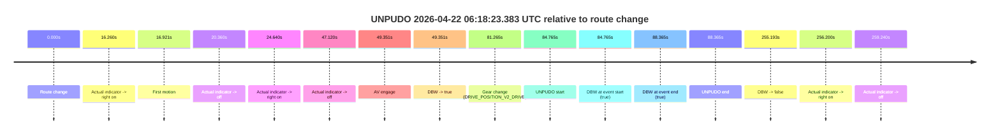
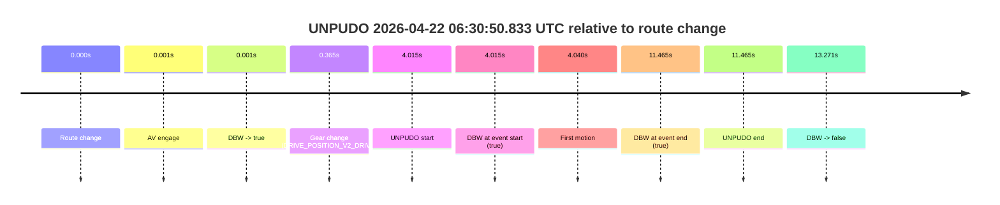
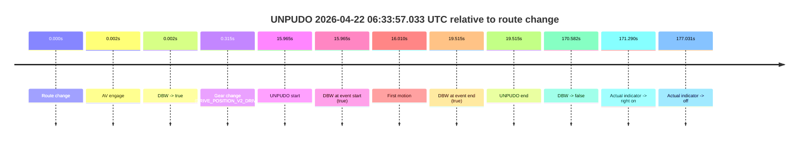
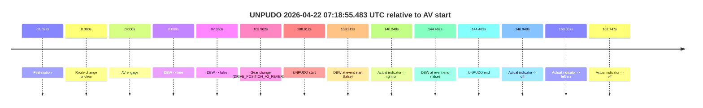

# Run Report: fme20018/2026-04-22--06-05-20--gen2-av-fac905d8-4d29-4535-814b-562af90b07e7

| Field | Value |
|---|---|
| Run ID | `fme20018/2026-04-22--06-05-20--gen2-av-fac905d8-4d29-4535-814b-562af90b07e7` |
| Date | `2026-04-22` |
| Model(s) | `eel-teal-outspoken` |
| Author | `zak` |
| Event count | `5` |

## unpudo 2026-04-22 06:18:23.383 UTC

| Field | Value |
|---|---|
| Model | `eel-teal-outspoken` |
| Author | `zak` |
| Run ID | `fme20018/2026-04-22--06-05-20--gen2-av-fac905d8-4d29-4535-814b-562af90b07e7` |
| Date | `2026-04-22` |
| Time (UTC) | `06:18:23.383` |
| Event type | `unpudo` |
| Disengagement type | `none observed` |
| Route change | `found` |
| Console | [run](https://console.sso.wayve.ai/run/fme20018/2026-04-22--06-05-20--gen2-av-fac905d8-4d29-4535-814b-562af90b07e7?id=&time-unixus=1776838703383289) |
| Foxglove | [segment](https://app.foxglove.dev/wayve-on-prem/p/prj_0dX18KZdVHg1fmmI/view?ds=foxglove-stream&ds.deviceName=fme20018&ds.start=2026-04-22T06%3A16%3A48.618239Z&ds.end=2026-04-22T06%3A21%3A23.810802Z&layoutId=lay_0e7VD4WIKDQGU73Y&time=2026-04-22T06%3A18%3A23.383289Z) |

### Event card: pass

- Pass: AV owns the credited unpudo from route change through the official unpudo window, the gear state is aligned at the anchor, and the vehicle moves without driver accelerator help in AV.

| Event | Time (UTC) | Delta from route change |
|---|---:|---:|
| Route change | 2026-04-22 06:16:58.618 | `0.000s` |
| Actual indicator -> right on | 2026-04-22 06:17:14.878 | `16.260s` |
| First motion | 2026-04-22 06:17:15.538 | `16.921s` |
| Actual indicator -> off | 2026-04-22 06:17:18.978 | `20.360s` |
| Actual indicator -> right on | 2026-04-22 06:17:23.258 | `24.640s` |
| Actual indicator -> off | 2026-04-22 06:17:45.738 | `47.120s` |
| AV engage | 2026-04-22 06:17:47.969 | `49.351s` |
| DBW -> true | 2026-04-22 06:17:47.969 | `49.351s` |
| Gear change (DRIVE_POSITION_V2_DRIVE) | 2026-04-22 06:18:19.883 | `81.265s` |
| UNPUDO start | 2026-04-22 06:18:23.383 | `84.765s` |
| DBW at event start (true) | 2026-04-22 06:18:23.383 | `84.765s` |
| DBW at event end (true) | 2026-04-22 06:18:26.983 | `88.365s` |
| UNPUDO end | 2026-04-22 06:18:26.983 | `88.365s` |
| DBW -> false | 2026-04-22 06:21:13.810 | `255.193s` |
| Actual indicator -> right on | 2026-04-22 06:21:14.818 | `256.200s` |
| Actual indicator -> off | 2026-04-22 06:21:17.858 | `259.240s` |

| Metric | Value |
|---|---|
| Outcome | `pass` |
| Effective failure type | `none` |
| Route change status | `found` |
| DBW at event start | `true` |
| DBW at event end | `true` |
| Predicted gear at AV start | `DRIVE_POSITION_V2_DRIVE` |
| Actual gear at AV start | `DRIVE_POSITION_V2_DRIVE` |
| Predicted gear at event start | `DRIVE_POSITION_V2_DRIVE` |
| Actual gear at event start | `DRIVE_POSITION_V2_DRIVE` |
| Planned indicator direction | `INDICATORS_STATE_V2_RIGHT_ON` |
| Controller indicator direction | `INDICATORS_STATE_V2_RIGHT_ON` |
| Actual indicator direction | `INDICATORS_STATE_V2_OFF` |
| Actual indicator at maneuver end | `INDICATORS_STATE_V2_OFF` |
| Driver accel help in AV | `false` |
| Driver accel help timestamp | `n/a` |
| Max accel pedal pct in AV | `0.0%` |
| Max brake pedal pct in AV | `14.6%` |
| Max speed mps in AV | `7.606` |
| Success timing baseline | `route change` |
| Route -> AV | `49.351s` |
| AV -> event start | `35.414s` |
| AV -> first motion | `-32.431s` |
| Success baseline -> event start | `84.765s` |
| Success baseline -> first motion | `16.921s` |
| AV duration before disengagement | `205.841s` |
| Trajectory waypoint count | `37` |
| Driving-plan step count | `11` |

The scored portion starts from the AV-owned window, not from the pre-AV setup. Route-change search in the stopped pre-event segment was `found`, with the baseline therefore set to route change. At the event anchor the model predicts `DRIVE_POSITION_V2_DRIVE` and the actual gear is `DRIVE_POSITION_V2_DRIVE`. The effective model outcome is `pass` because `the credited unpudo stays AV-owned through the official unpudo window.`

### Resolution

| Field | Value |
|---|---|
| Final outcome | `pass` |
| Do we agree with this label? | `yes` |
| Source disengagement type | `none observed` |
| Resolved effective failure type | `none` |
| Confidence | `high` |

## unpudo 2026-04-22 06:30:50.833 UTC

| Field | Value |
|---|---|
| Model | `eel-teal-outspoken` |
| Author | `zak` |
| Run ID | `fme20018/2026-04-22--06-05-20--gen2-av-fac905d8-4d29-4535-814b-562af90b07e7` |
| Date | `2026-04-22` |
| Time (UTC) | `06:30:50.833` |
| Event type | `unpudo` |
| Disengagement type | `none observed` |
| Route change | `found` |
| Console | [run](https://console.sso.wayve.ai/run/fme20018/2026-04-22--06-05-20--gen2-av-fac905d8-4d29-4535-814b-562af90b07e7?id=&time-unixus=1776839450833293) |
| Foxglove | [segment](https://app.foxglove.dev/wayve-on-prem/p/prj_0dX18KZdVHg1fmmI/view?ds=foxglove-stream&ds.deviceName=fme20018&ds.start=2026-04-22T06%3A30%3A36.818253Z&ds.end=2026-04-22T06%3A31%3A10.089450Z&layoutId=lay_0e7VD4WIKDQGU73Y&time=2026-04-22T06%3A30%3A50.833293Z) |

### Event card: pass

- Pass: AV owns the credited unpudo from route change through the official unpudo window, the gear state is aligned at the anchor, and the vehicle moves without driver accelerator help in AV.

| Event | Time (UTC) | Delta from route change |
|---|---:|---:|
| Route change | 2026-04-22 06:30:46.818 | `0.000s` |
| AV engage | 2026-04-22 06:30:46.819 | `0.001s` |
| DBW -> true | 2026-04-22 06:30:46.819 | `0.001s` |
| Gear change (DRIVE_POSITION_V2_DRIVE) | 2026-04-22 06:30:47.183 | `0.365s` |
| UNPUDO start | 2026-04-22 06:30:50.833 | `4.015s` |
| DBW at event start (true) | 2026-04-22 06:30:50.833 | `4.015s` |
| First motion | 2026-04-22 06:30:50.858 | `4.040s` |
| DBW at event end (true) | 2026-04-22 06:30:58.283 | `11.465s` |
| UNPUDO end | 2026-04-22 06:30:58.283 | `11.465s` |
| DBW -> false | 2026-04-22 06:31:00.089 | `13.271s` |

| Metric | Value |
|---|---|
| Outcome | `pass` |
| Effective failure type | `none` |
| Route change status | `found` |
| DBW at event start | `true` |
| DBW at event end | `true` |
| Predicted gear at AV start | `DRIVE_POSITION_V2_PARK` |
| Actual gear at AV start | `DRIVE_POSITION_V2_PARK` |
| Predicted gear at event start | `DRIVE_POSITION_V2_DRIVE` |
| Actual gear at event start | `DRIVE_POSITION_V2_DRIVE` |
| Planned indicator direction | `INDICATORS_STATE_V2_RIGHT_ON` |
| Controller indicator direction | `INDICATORS_STATE_V2_RIGHT_ON` |
| Actual indicator direction | `INDICATORS_STATE_V2_OFF` |
| Actual indicator at maneuver end | `INDICATORS_STATE_V2_OFF` |
| Driver accel help in AV | `false` |
| Driver accel help timestamp | `n/a` |
| Max accel pedal pct in AV | `0.0%` |
| Max brake pedal pct in AV | `14.6%` |
| Max speed mps in AV | `2.264` |
| Success timing baseline | `route change` |
| Route -> AV | `0.001s` |
| AV -> event start | `4.014s` |
| AV -> first motion | `4.039s` |
| Success baseline -> event start | `4.015s` |
| Success baseline -> first motion | `4.040s` |
| AV duration before disengagement | `13.270s` |
| Trajectory waypoint count | `38` |
| Driving-plan step count | `11` |

The scored portion starts from the AV-owned window, not from the pre-AV setup. Route-change search in the stopped pre-event segment was `found`, with the baseline therefore set to route change. At the event anchor the model predicts `DRIVE_POSITION_V2_DRIVE` and the actual gear is `DRIVE_POSITION_V2_DRIVE`. The effective model outcome is `pass` because `the credited unpudo stays AV-owned through the official unpudo window.`

### Resolution

| Field | Value |
|---|---|
| Final outcome | `pass` |
| Do we agree with this label? | `yes` |
| Source disengagement type | `none observed` |
| Resolved effective failure type | `none` |
| Confidence | `high` |

## unpudo 2026-04-22 06:33:57.033 UTC

| Field | Value |
|---|---|
| Model | `eel-teal-outspoken` |
| Author | `zak` |
| Run ID | `fme20018/2026-04-22--06-05-20--gen2-av-fac905d8-4d29-4535-814b-562af90b07e7` |
| Date | `2026-04-22` |
| Time (UTC) | `06:33:57.033` |
| Event type | `unpudo` |
| Disengagement type | `none observed` |
| Route change | `found` |
| Console | [run](https://console.sso.wayve.ai/run/fme20018/2026-04-22--06-05-20--gen2-av-fac905d8-4d29-4535-814b-562af90b07e7?id=&time-unixus=1776839637033315) |
| Foxglove | [segment](https://app.foxglove.dev/wayve-on-prem/p/prj_0dX18KZdVHg1fmmI/view?ds=foxglove-stream&ds.deviceName=fme20018&ds.start=2026-04-22T06%3A33%3A31.068259Z&ds.end=2026-04-22T06%3A36%3A41.650487Z&layoutId=lay_0e7VD4WIKDQGU73Y&time=2026-04-22T06%3A33%3A57.033315Z) |

### Event card: pass

- Pass: AV owns the credited unpudo from route change through the official unpudo window, the gear state is aligned at the anchor, and the vehicle moves without driver accelerator help in AV.

| Event | Time (UTC) | Delta from route change |
|---|---:|---:|
| Route change | 2026-04-22 06:33:41.068 | `0.000s` |
| AV engage | 2026-04-22 06:33:41.069 | `0.002s` |
| DBW -> true | 2026-04-22 06:33:41.069 | `0.002s` |
| Gear change (DRIVE_POSITION_V2_DRIVE) | 2026-04-22 06:33:41.383 | `0.315s` |
| UNPUDO start | 2026-04-22 06:33:57.033 | `15.965s` |
| DBW at event start (true) | 2026-04-22 06:33:57.033 | `15.965s` |
| First motion | 2026-04-22 06:33:57.078 | `16.010s` |
| DBW at event end (true) | 2026-04-22 06:34:00.583 | `19.515s` |
| UNPUDO end | 2026-04-22 06:34:00.583 | `19.515s` |
| DBW -> false | 2026-04-22 06:36:31.650 | `170.582s` |
| Actual indicator -> right on | 2026-04-22 06:36:32.358 | `171.290s` |
| Actual indicator -> off | 2026-04-22 06:36:38.099 | `177.031s` |

| Metric | Value |
|---|---|
| Outcome | `pass` |
| Effective failure type | `none` |
| Route change status | `found` |
| DBW at event start | `true` |
| DBW at event end | `true` |
| Predicted gear at AV start | `DRIVE_POSITION_V2_PARK` |
| Actual gear at AV start | `DRIVE_POSITION_V2_PARK` |
| Predicted gear at event start | `DRIVE_POSITION_V2_DRIVE` |
| Actual gear at event start | `DRIVE_POSITION_V2_DRIVE` |
| Planned indicator direction | `INDICATORS_STATE_V2_LEFT_ON` |
| Controller indicator direction | `INDICATORS_STATE_V2_LEFT_ON` |
| Actual indicator direction | `INDICATORS_STATE_V2_OFF` |
| Actual indicator at maneuver end | `INDICATORS_STATE_V2_OFF` |
| Driver accel help in AV | `false` |
| Driver accel help timestamp | `n/a` |
| Max accel pedal pct in AV | `0.0%` |
| Max brake pedal pct in AV | `9.3%` |
| Max speed mps in AV | `5.217` |
| Success timing baseline | `route change` |
| Route -> AV | `0.002s` |
| AV -> event start | `15.963s` |
| AV -> first motion | `16.008s` |
| Success baseline -> event start | `15.965s` |
| Success baseline -> first motion | `16.010s` |
| AV duration before disengagement | `170.581s` |
| Trajectory waypoint count | `38` |
| Driving-plan step count | `11` |

The scored portion starts from the AV-owned window, not from the pre-AV setup. Route-change search in the stopped pre-event segment was `found`, with the baseline therefore set to route change. At the event anchor the model predicts `DRIVE_POSITION_V2_DRIVE` and the actual gear is `DRIVE_POSITION_V2_DRIVE`. The effective model outcome is `pass` because `the credited unpudo stays AV-owned through the official unpudo window.`

### Resolution

| Field | Value |
|---|---|
| Final outcome | `pass` |
| Do we agree with this label? | `yes` |
| Source disengagement type | `none observed` |
| Resolved effective failure type | `none` |
| Confidence | `high` |

## unpudo 2026-04-22 07:10:21.783 UTC

| Field | Value |
|---|---|
| Model | `eel-teal-outspoken` |
| Author | `zak` |
| Run ID | `fme20018/2026-04-22--06-05-20--gen2-av-fac905d8-4d29-4535-814b-562af90b07e7` |
| Date | `2026-04-22` |
| Time (UTC) | `07:10:21.783` |
| Event type | `unpudo` |
| Disengagement type | `none observed` |
| Route change | `found` |
| Console | [run](https://console.sso.wayve.ai/run/fme20018/2026-04-22--06-05-20--gen2-av-fac905d8-4d29-4535-814b-562af90b07e7?id=&time-unixus=1776841821783307) |
| Foxglove | [segment](https://app.foxglove.dev/wayve-on-prem/p/prj_0dX18KZdVHg1fmmI/view?ds=foxglove-stream&ds.deviceName=fme20018&ds.start=2026-04-22T07%3A10%3A07.868332Z&ds.end=2026-04-22T07%3A12%3A26.229517Z&layoutId=lay_0e7VD4WIKDQGU73Y&time=2026-04-22T07%3A10%3A21.783307Z) |

### Event card: pass

- Pass: AV owns the credited unpudo from route change through the official unpudo window, the gear state is aligned at the anchor, and the vehicle moves without driver accelerator help in AV.

| Event | Time (UTC) | Delta from route change |
|---|---:|---:|
| Route change | 2026-04-22 07:10:17.868 | `0.000s` |
| AV engage | 2026-04-22 07:10:17.869 | `0.001s` |
| DBW -> true | 2026-04-22 07:10:17.869 | `0.001s` |
| Gear change (DRIVE_POSITION_V2_DRIVE) | 2026-04-22 07:10:18.183 | `0.315s` |
| UNPUDO start | 2026-04-22 07:10:21.783 | `3.915s` |
| DBW at event start (true) | 2026-04-22 07:10:21.783 | `3.915s` |
| First motion | 2026-04-22 07:10:21.818 | `3.950s` |
| DBW at event end (true) | 2026-04-22 07:10:25.383 | `7.515s` |
| UNPUDO end | 2026-04-22 07:10:25.383 | `7.515s` |
| DBW -> false | 2026-04-22 07:12:16.229 | `118.361s` |
| Actual indicator -> right on | 2026-04-22 07:12:17.098 | `119.231s` |
| Actual indicator -> off | 2026-04-22 07:12:26.098 | `128.231s` |

| Metric | Value |
|---|---|
| Outcome | `pass` |
| Effective failure type | `none` |
| Route change status | `found` |
| DBW at event start | `true` |
| DBW at event end | `true` |
| Predicted gear at AV start | `DRIVE_POSITION_V2_PARK` |
| Actual gear at AV start | `DRIVE_POSITION_V2_PARK` |
| Predicted gear at event start | `DRIVE_POSITION_V2_DRIVE` |
| Actual gear at event start | `DRIVE_POSITION_V2_DRIVE` |
| Planned indicator direction | `INDICATORS_STATE_V2_LEFT_ON` |
| Controller indicator direction | `INDICATORS_STATE_V2_LEFT_ON` |
| Actual indicator direction | `INDICATORS_STATE_V2_OFF` |
| Actual indicator at maneuver end | `INDICATORS_STATE_V2_OFF` |
| Driver accel help in AV | `false` |
| Driver accel help timestamp | `n/a` |
| Max accel pedal pct in AV | `0.0%` |
| Max brake pedal pct in AV | `8.0%` |
| Max speed mps in AV | `4.208` |
| Success timing baseline | `route change` |
| Route -> AV | `0.001s` |
| AV -> event start | `3.914s` |
| AV -> first motion | `3.949s` |
| Success baseline -> event start | `3.915s` |
| Success baseline -> first motion | `3.950s` |
| AV duration before disengagement | `118.360s` |
| Trajectory waypoint count | `37` |
| Driving-plan step count | `11` |

The scored portion starts from the AV-owned window, not from the pre-AV setup. Route-change search in the stopped pre-event segment was `found`, with the baseline therefore set to route change. At the event anchor the model predicts `DRIVE_POSITION_V2_DRIVE` and the actual gear is `DRIVE_POSITION_V2_DRIVE`. The effective model outcome is `pass` because `the credited unpudo stays AV-owned through the official unpudo window.`

### Resolution

| Field | Value |
|---|---|
| Final outcome | `pass` |
| Do we agree with this label? | `yes` |
| Source disengagement type | `none observed` |
| Resolved effective failure type | `none` |
| Confidence | `high` |

## unpudo 2026-04-22 07:18:55.483 UTC

| Field | Value |
|---|---|
| Model | `eel-teal-outspoken` |
| Author | `zak` |
| Run ID | `fme20018/2026-04-22--06-05-20--gen2-av-fac905d8-4d29-4535-814b-562af90b07e7` |
| Date | `2026-04-22` |
| Time (UTC) | `07:18:55.483` |
| Event type | `unpudo` |
| Disengagement type | `none observed` |
| Route change | `unclear` |
| Console | [run](https://console.sso.wayve.ai/run/fme20018/2026-04-22--06-05-20--gen2-av-fac905d8-4d29-4535-814b-562af90b07e7?id=&time-unixus=1776842335483291) |
| Foxglove | [segment](https://app.foxglove.dev/wayve-on-prem/p/prj_0dX18KZdVHg1fmmI/view?ds=foxglove-stream&ds.deviceName=fme20018&ds.start=2026-04-22T07%3A16%3A56.570883Z&ds.end=2026-04-22T07%3A19%3A41.033296Z&layoutId=lay_0e7VD4WIKDQGU73Y&time=2026-04-22T07%3A18%3A55.483291Z) |

### Event card: fail

- Fail: the credited unpudo does not stay AV-owned. The event window starts with DBW false, and the maneuver outcome lands outside a clean AV-owned segment.

| Event | Time (UTC) | Delta from AV start |
|---|---:|---:|
| First motion | 2026-04-22 07:16:55.498 | `-11.072s` |
| Route change unclear | 2026-04-22 07:17:06.570 | `0.000s` |
| AV engage | 2026-04-22 07:17:06.570 | `0.000s` |
| DBW -> true | 2026-04-22 07:17:06.570 | `0.000s` |
| DBW -> false | 2026-04-22 07:18:43.930 | `97.360s` |
| Gear change (DRIVE_POSITION_V2_REVERSE) | 2026-04-22 07:18:50.533 | `103.962s` |
| UNPUDO start | 2026-04-22 07:18:55.483 | `108.912s` |
| DBW at event start (false) | 2026-04-22 07:18:55.483 | `108.912s` |
| Actual indicator -> right on | 2026-04-22 07:19:26.818 | `140.248s` |
| DBW at event end (false) | 2026-04-22 07:19:31.033 | `144.462s` |
| UNPUDO end | 2026-04-22 07:19:31.033 | `144.462s` |
| Actual indicator -> off | 2026-04-22 07:19:33.518 | `146.948s` |
| Actual indicator -> left on | 2026-04-22 07:19:46.578 | `160.007s` |
| Actual indicator -> off | 2026-04-22 07:19:49.318 | `162.747s` |

| Metric | Value |
|---|---|
| Outcome | `fail` |
| Effective failure type | `completed_outside_av` |
| Route change status | `unclear` |
| DBW at event start | `false` |
| DBW at event end | `false` |
| Predicted gear at AV start | `DRIVE_POSITION_V2_DRIVE` |
| Actual gear at AV start | `DRIVE_POSITION_V2_DRIVE` |
| Predicted gear at event start | `DRIVE_POSITION_V2_REVERSE` |
| Actual gear at event start | `DRIVE_POSITION_V2_REVERSE` |
| Planned indicator direction | `INDICATORS_STATE_V2_OFF` |
| Controller indicator direction | `INDICATORS_STATE_V2_OFF` |
| Actual indicator direction | `INDICATORS_STATE_V2_OFF` |
| Actual indicator at maneuver end | `INDICATORS_STATE_V2_RIGHT_ON` |
| Driver accel help in AV | `false` |
| Driver accel help timestamp | `n/a` |
| Max accel pedal pct in AV | `0.0%` |
| Max brake pedal pct in AV | `7.7%` |
| Max speed mps in AV | `7.086` |
| Success timing baseline | `AV start` |
| Route -> AV | `n/a` |
| AV -> event start | `108.912s` |
| AV -> first motion | `-11.072s` |
| Success baseline -> event start | `108.912s` |
| Success baseline -> first motion | `-11.072s` |
| AV duration before disengagement | `97.360s` |
| Trajectory waypoint count | `37` |
| Driving-plan step count | `11` |

The scored portion starts from the AV-owned window, not from the pre-AV setup. Route-change search in the stopped pre-event segment was `unclear`, with the baseline therefore set to AV start. At the event anchor the model predicts `DRIVE_POSITION_V2_REVERSE` and the actual gear is `DRIVE_POSITION_V2_REVERSE`. The effective model outcome is `fail` because `completed_outside_av.`

### Resolution

| Field | Value |
|---|---|
| Final outcome | `fail` |
| Do we agree with this label? | `yes` |
| Source disengagement type | `none observed` |
| Resolved effective failure type | `completed_outside_av` |
| Confidence | `medium` |
