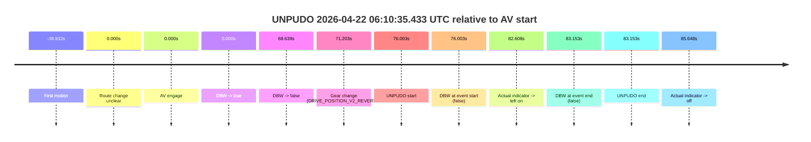
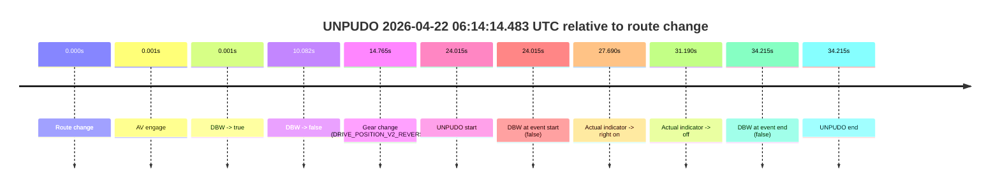
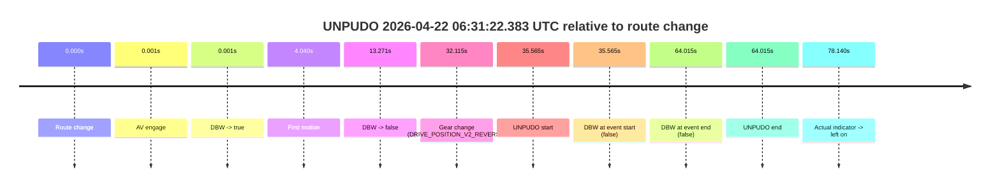
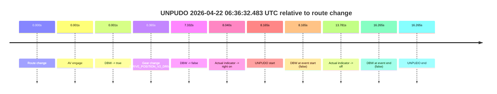
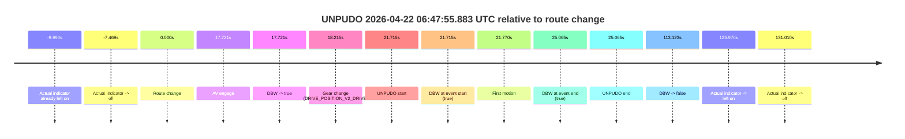
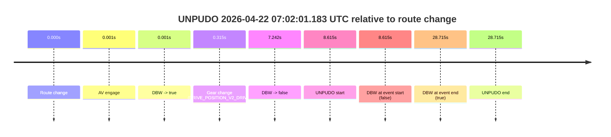
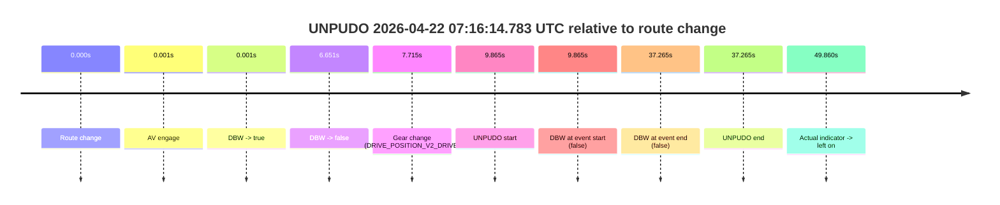

# Run Report: fme20018/2026-04-22--06-05-20--gen2-av-fac905d8-4d29-4535-814b-562af90b07e7

| Field | Value |
|---|---|
| Run ID | `fme20018/2026-04-22--06-05-20--gen2-av-fac905d8-4d29-4535-814b-562af90b07e7` |
| Date | `2026-04-22` |
| Model(s) | `pink-manta-ray-smooth` |
| Author | `guy.geva` |
| Event count | `8` |

## unpudo 2026-04-22 06:10:35.433 UTC

| Field | Value |
|---|---|
| Model | `pink-manta-ray-smooth` |
| Author | `guy.geva` |
| Run ID | `fme20018/2026-04-22--06-05-20--gen2-av-fac905d8-4d29-4535-814b-562af90b07e7` |
| Date | `2026-04-22` |
| Time (UTC) | `06:10:35.433` |
| Event type | `unpudo` |
| Disengagement type | `none observed` |
| Route change | `unclear` |
| Console | [run](https://console.sso.wayve.ai/run/fme20018/2026-04-22--06-05-20--gen2-av-fac905d8-4d29-4535-814b-562af90b07e7?id=&time-unixus=1776838235433293) |
| Foxglove | [segment](https://app.foxglove.dev/wayve-on-prem/p/prj_0dX18KZdVHg1fmmI/view?ds=foxglove-stream&ds.deviceName=fme20018&ds.start=2026-04-22T06%3A09%3A09.430596Z&ds.end=2026-04-22T06%3A10%3A52.583288Z&layoutId=lay_0e7VD4WIKDQGU73Y&time=2026-04-22T06%3A10%3A35.433293Z) |

### Event card: fail

- Fail: the credited unpudo does not stay AV-owned. The event window starts with DBW false, and the maneuver outcome lands outside a clean AV-owned segment.

| Event | Time (UTC) | Delta from AV start |
|---|---:|---:|
| First motion | 2026-04-22 06:08:40.498 | `-38.932s` |
| Route change unclear | 2026-04-22 06:09:19.430 | `0.000s` |
| AV engage | 2026-04-22 06:09:19.430 | `0.000s` |
| DBW -> true | 2026-04-22 06:09:19.430 | `0.000s` |
| DBW -> false | 2026-04-22 06:10:28.069 | `68.639s` |
| Gear change (DRIVE_POSITION_V2_REVERSE) | 2026-04-22 06:10:30.633 | `71.203s` |
| UNPUDO start | 2026-04-22 06:10:35.433 | `76.003s` |
| DBW at event start (false) | 2026-04-22 06:10:35.433 | `76.003s` |
| Actual indicator -> left on | 2026-04-22 06:10:42.038 | `82.608s` |
| DBW at event end (false) | 2026-04-22 06:10:42.583 | `83.153s` |
| UNPUDO end | 2026-04-22 06:10:42.583 | `83.153s` |
| Actual indicator -> off | 2026-04-22 06:10:45.079 | `85.648s` |

| Metric | Value |
|---|---|
| Outcome | `fail` |
| Effective failure type | `completed_outside_av` |
| Route change status | `unclear` |
| DBW at event start | `false` |
| DBW at event end | `false` |
| Predicted gear at AV start | `DRIVE_POSITION_V2_DRIVE` |
| Actual gear at AV start | `DRIVE_POSITION_V2_DRIVE` |
| Predicted gear at event start | `DRIVE_POSITION_V2_REVERSE` |
| Actual gear at event start | `DRIVE_POSITION_V2_REVERSE` |
| Planned indicator direction | `INDICATORS_STATE_V2_OFF` |
| Controller indicator direction | `INDICATORS_STATE_V2_OFF` |
| Actual indicator direction | `INDICATORS_STATE_V2_OFF` |
| Actual indicator at maneuver end | `INDICATORS_STATE_V2_LEFT_ON` |
| Driver accel help in AV | `false` |
| Driver accel help timestamp | `n/a` |
| Max accel pedal pct in AV | `0.0%` |
| Max brake pedal pct in AV | `15.7%` |
| Max speed mps in AV | `7.933` |
| Success timing baseline | `AV start` |
| Route -> AV | `n/a` |
| AV -> event start | `76.003s` |
| AV -> first motion | `-38.932s` |
| Success baseline -> event start | `76.003s` |
| Success baseline -> first motion | `-38.932s` |
| AV duration before disengagement | `68.639s` |
| Trajectory waypoint count | `36` |
| Driving-plan step count | `11` |

The scored portion starts from the AV-owned window, not from the pre-AV setup. Route-change search in the stopped pre-event segment was `unclear`, with the baseline therefore set to AV start. At the event anchor the model predicts `DRIVE_POSITION_V2_REVERSE` and the actual gear is `DRIVE_POSITION_V2_REVERSE`. The effective model outcome is `fail` because `completed_outside_av.`

### Resolution

| Field | Value |
|---|---|
| Final outcome | `fail` |
| Do we agree with this label? | `yes` |
| Source disengagement type | `none observed` |
| Resolved effective failure type | `completed_outside_av` |
| Confidence | `medium` |

## unpudo 2026-04-22 06:11:14.333 UTC

| Field | Value |
|---|---|
| Model | `pink-manta-ray-smooth` |
| Author | `guy.geva` |
| Run ID | `fme20018/2026-04-22--06-05-20--gen2-av-fac905d8-4d29-4535-814b-562af90b07e7` |
| Date | `2026-04-22` |
| Time (UTC) | `06:11:14.333` |
| Event type | `unpudo` |
| Disengagement type | `none observed` |
| Route change | `found` |
| Console | [run](https://console.sso.wayve.ai/run/fme20018/2026-04-22--06-05-20--gen2-av-fac905d8-4d29-4535-814b-562af90b07e7?id=&time-unixus=1776838274333300) |
| Foxglove | [segment](https://app.foxglove.dev/wayve-on-prem/p/prj_0dX18KZdVHg1fmmI/view?ds=foxglove-stream&ds.deviceName=fme20018&ds.start=2026-04-22T06%3A10%3A46.468400Z&ds.end=2026-04-22T06%3A11%3A28.683304Z&layoutId=lay_0e7VD4WIKDQGU73Y&time=2026-04-22T06%3A11%3A14.333300Z) |

### Event card: fail

- Fail: the credited unpudo does not stay AV-owned. The event window starts with DBW false, and the maneuver outcome lands outside a clean AV-owned segment.

| Event | Time (UTC) | Delta from route change |
|---|---:|---:|
| Route change | 2026-04-22 06:10:56.468 | `0.000s` |
| AV engage | 2026-04-22 06:11:06.269 | `9.801s` |
| DBW -> true | 2026-04-22 06:11:06.269 | `9.801s` |
| Gear change (DRIVE_POSITION_V2_DRIVE) | 2026-04-22 06:11:06.783 | `10.315s` |
| DBW -> false | 2026-04-22 06:11:13.650 | `17.182s` |
| Actual indicator -> right on | 2026-04-22 06:11:14.178 | `17.710s` |
| UNPUDO start | 2026-04-22 06:11:14.333 | `17.865s` |
| DBW at event start (false) | 2026-04-22 06:11:14.333 | `17.865s` |
| Actual indicator -> off | 2026-04-22 06:11:17.478 | `21.010s` |
| DBW at event end (false) | 2026-04-22 06:11:18.683 | `22.215s` |
| UNPUDO end | 2026-04-22 06:11:18.683 | `22.215s` |

| Metric | Value |
|---|---|
| Outcome | `fail` |
| Effective failure type | `not_av_owned` |
| Route change status | `found` |
| DBW at event start | `false` |
| DBW at event end | `false` |
| Predicted gear at AV start | `DRIVE_POSITION_V2_DRIVE` |
| Actual gear at AV start | `DRIVE_POSITION_V2_PARK` |
| Predicted gear at event start | `DRIVE_POSITION_V2_DRIVE` |
| Actual gear at event start | `DRIVE_POSITION_V2_DRIVE` |
| Planned indicator direction | `INDICATORS_STATE_V2_RIGHT_ON` |
| Controller indicator direction | `INDICATORS_STATE_V2_RIGHT_ON` |
| Actual indicator direction | `INDICATORS_STATE_V2_RIGHT_ON` |
| Actual indicator at maneuver end | `INDICATORS_STATE_V2_OFF` |
| Driver accel help in AV | `false` |
| Driver accel help timestamp | `n/a` |
| Max accel pedal pct in AV | `0.0%` |
| Max brake pedal pct in AV | `10.0%` |
| Max speed mps in AV | `0.000` |
| Success timing baseline | `route change` |
| Route -> AV | `9.801s` |
| AV -> event start | `8.064s` |
| AV -> first motion | `n/a` |
| Success baseline -> event start | `17.865s` |
| Success baseline -> first motion | `n/a` |
| AV duration before disengagement | `7.381s` |
| Trajectory waypoint count | `36` |
| Driving-plan step count | `11` |

The scored portion starts from the AV-owned window, not from the pre-AV setup. Route-change search in the stopped pre-event segment was `found`, with the baseline therefore set to route change. At the event anchor the model predicts `DRIVE_POSITION_V2_DRIVE` and the actual gear is `DRIVE_POSITION_V2_DRIVE`. The effective model outcome is `fail` because `not_av_owned.`

### Resolution

| Field | Value |
|---|---|
| Final outcome | `fail` |
| Do we agree with this label? | `yes` |
| Source disengagement type | `none observed` |
| Resolved effective failure type | `not_av_owned` |
| Confidence | `high` |

## unpudo 2026-04-22 06:14:14.483 UTC

| Field | Value |
|---|---|
| Model | `pink-manta-ray-smooth` |
| Author | `guy.geva` |
| Run ID | `fme20018/2026-04-22--06-05-20--gen2-av-fac905d8-4d29-4535-814b-562af90b07e7` |
| Date | `2026-04-22` |
| Time (UTC) | `06:14:14.483` |
| Event type | `unpudo` |
| Disengagement type | `none observed` |
| Route change | `found` |
| Console | [run](https://console.sso.wayve.ai/run/fme20018/2026-04-22--06-05-20--gen2-av-fac905d8-4d29-4535-814b-562af90b07e7?id=&time-unixus=1776838454483292) |
| Foxglove | [segment](https://app.foxglove.dev/wayve-on-prem/p/prj_0dX18KZdVHg1fmmI/view?ds=foxglove-stream&ds.deviceName=fme20018&ds.start=2026-04-22T06%3A13%3A40.468456Z&ds.end=2026-04-22T06%3A14%3A34.683311Z&layoutId=lay_0e7VD4WIKDQGU73Y&time=2026-04-22T06%3A14%3A14.483292Z) |

### Event card: fail

- Fail: the credited unpudo does not stay AV-owned. The event window starts with DBW false, and the maneuver outcome lands outside a clean AV-owned segment.

| Event | Time (UTC) | Delta from route change |
|---|---:|---:|
| Route change | 2026-04-22 06:13:50.468 | `0.000s` |
| AV engage | 2026-04-22 06:13:50.469 | `0.001s` |
| DBW -> true | 2026-04-22 06:13:50.469 | `0.001s` |
| DBW -> false | 2026-04-22 06:14:00.550 | `10.082s` |
| Gear change (DRIVE_POSITION_V2_REVERSE) | 2026-04-22 06:14:05.233 | `14.765s` |
| UNPUDO start | 2026-04-22 06:14:14.483 | `24.015s` |
| DBW at event start (false) | 2026-04-22 06:14:14.483 | `24.015s` |
| Actual indicator -> right on | 2026-04-22 06:14:18.158 | `27.690s` |
| Actual indicator -> off | 2026-04-22 06:14:21.658 | `31.190s` |
| DBW at event end (false) | 2026-04-22 06:14:24.683 | `34.215s` |
| UNPUDO end | 2026-04-22 06:14:24.683 | `34.215s` |

| Metric | Value |
|---|---|
| Outcome | `fail` |
| Effective failure type | `not_av_owned` |
| Route change status | `found` |
| DBW at event start | `false` |
| DBW at event end | `false` |
| Predicted gear at AV start | `DRIVE_POSITION_V2_PARK` |
| Actual gear at AV start | `DRIVE_POSITION_V2_PARK` |
| Predicted gear at event start | `DRIVE_POSITION_V2_REVERSE` |
| Actual gear at event start | `DRIVE_POSITION_V2_REVERSE` |
| Planned indicator direction | `INDICATORS_STATE_V2_RIGHT_ON` |
| Controller indicator direction | `INDICATORS_STATE_V2_RIGHT_ON` |
| Actual indicator direction | `INDICATORS_STATE_V2_OFF` |
| Actual indicator at maneuver end | `INDICATORS_STATE_V2_OFF` |
| Driver accel help in AV | `false` |
| Driver accel help timestamp | `n/a` |
| Max accel pedal pct in AV | `0.0%` |
| Max brake pedal pct in AV | `8.0%` |
| Max speed mps in AV | `0.000` |
| Success timing baseline | `route change` |
| Route -> AV | `0.001s` |
| AV -> event start | `24.014s` |
| AV -> first motion | `n/a` |
| Success baseline -> event start | `24.015s` |
| Success baseline -> first motion | `n/a` |
| AV duration before disengagement | `10.081s` |
| Trajectory waypoint count | `37` |
| Driving-plan step count | `11` |

The scored portion starts from the AV-owned window, not from the pre-AV setup. Route-change search in the stopped pre-event segment was `found`, with the baseline therefore set to route change. At the event anchor the model predicts `DRIVE_POSITION_V2_REVERSE` and the actual gear is `DRIVE_POSITION_V2_REVERSE`. The effective model outcome is `fail` because `not_av_owned.`

### Resolution

| Field | Value |
|---|---|
| Final outcome | `fail` |
| Do we agree with this label? | `yes` |
| Source disengagement type | `none observed` |
| Resolved effective failure type | `not_av_owned` |
| Confidence | `high` |

## unpudo 2026-04-22 06:31:22.383 UTC

| Field | Value |
|---|---|
| Model | `pink-manta-ray-smooth` |
| Author | `guy.geva` |
| Run ID | `fme20018/2026-04-22--06-05-20--gen2-av-fac905d8-4d29-4535-814b-562af90b07e7` |
| Date | `2026-04-22` |
| Time (UTC) | `06:31:22.383` |
| Event type | `unpudo` |
| Disengagement type | `none observed` |
| Route change | `found` |
| Console | [run](https://console.sso.wayve.ai/run/fme20018/2026-04-22--06-05-20--gen2-av-fac905d8-4d29-4535-814b-562af90b07e7?id=&time-unixus=1776839482383296) |
| Foxglove | [segment](https://app.foxglove.dev/wayve-on-prem/p/prj_0dX18KZdVHg1fmmI/view?ds=foxglove-stream&ds.deviceName=fme20018&ds.start=2026-04-22T06%3A30%3A36.818253Z&ds.end=2026-04-22T06%3A32%3A00.833304Z&layoutId=lay_0e7VD4WIKDQGU73Y&time=2026-04-22T06%3A31%3A22.383296Z) |

### Event card: fail

- Fail: the credited unpudo does not stay AV-owned. The event window starts with DBW false, and the maneuver outcome lands outside a clean AV-owned segment.

| Event | Time (UTC) | Delta from route change |
|---|---:|---:|
| Route change | 2026-04-22 06:30:46.818 | `0.000s` |
| AV engage | 2026-04-22 06:30:46.819 | `0.001s` |
| DBW -> true | 2026-04-22 06:30:46.819 | `0.001s` |
| First motion | 2026-04-22 06:30:50.858 | `4.040s` |
| DBW -> false | 2026-04-22 06:31:00.089 | `13.271s` |
| Gear change (DRIVE_POSITION_V2_REVERSE) | 2026-04-22 06:31:18.933 | `32.115s` |
| UNPUDO start | 2026-04-22 06:31:22.383 | `35.565s` |
| DBW at event start (false) | 2026-04-22 06:31:22.383 | `35.565s` |
| DBW at event end (false) | 2026-04-22 06:31:50.833 | `64.015s` |
| UNPUDO end | 2026-04-22 06:31:50.833 | `64.015s` |
| Actual indicator -> left on | 2026-04-22 06:32:04.958 | `78.140s` |

| Metric | Value |
|---|---|
| Outcome | `fail` |
| Effective failure type | `not_av_owned` |
| Route change status | `found` |
| DBW at event start | `false` |
| DBW at event end | `false` |
| Predicted gear at AV start | `DRIVE_POSITION_V2_PARK` |
| Actual gear at AV start | `DRIVE_POSITION_V2_PARK` |
| Predicted gear at event start | `DRIVE_POSITION_V2_REVERSE` |
| Actual gear at event start | `DRIVE_POSITION_V2_REVERSE` |
| Planned indicator direction | `INDICATORS_STATE_V2_OFF` |
| Controller indicator direction | `INDICATORS_STATE_V2_OFF` |
| Actual indicator direction | `INDICATORS_STATE_V2_OFF` |
| Actual indicator at maneuver end | `INDICATORS_STATE_V2_OFF` |
| Driver accel help in AV | `false` |
| Driver accel help timestamp | `n/a` |
| Max accel pedal pct in AV | `0.0%` |
| Max brake pedal pct in AV | `14.6%` |
| Max speed mps in AV | `2.903` |
| Success timing baseline | `route change` |
| Route -> AV | `0.001s` |
| AV -> event start | `35.564s` |
| AV -> first motion | `4.039s` |
| Success baseline -> event start | `35.565s` |
| Success baseline -> first motion | `4.040s` |
| AV duration before disengagement | `13.270s` |
| Trajectory waypoint count | `37` |
| Driving-plan step count | `11` |

The scored portion starts from the AV-owned window, not from the pre-AV setup. Route-change search in the stopped pre-event segment was `found`, with the baseline therefore set to route change. At the event anchor the model predicts `DRIVE_POSITION_V2_REVERSE` and the actual gear is `DRIVE_POSITION_V2_REVERSE`. The effective model outcome is `fail` because `not_av_owned.`

### Resolution

| Field | Value |
|---|---|
| Final outcome | `fail` |
| Do we agree with this label? | `yes` |
| Source disengagement type | `none observed` |
| Resolved effective failure type | `not_av_owned` |
| Confidence | `high` |

## unpudo 2026-04-22 06:36:32.483 UTC

| Field | Value |
|---|---|
| Model | `pink-manta-ray-smooth` |
| Author | `guy.geva` |
| Run ID | `fme20018/2026-04-22--06-05-20--gen2-av-fac905d8-4d29-4535-814b-562af90b07e7` |
| Date | `2026-04-22` |
| Time (UTC) | `06:36:32.483` |
| Event type | `unpudo` |
| Disengagement type | `none observed` |
| Route change | `found` |
| Console | [run](https://console.sso.wayve.ai/run/fme20018/2026-04-22--06-05-20--gen2-av-fac905d8-4d29-4535-814b-562af90b07e7?id=&time-unixus=1776839792483307) |
| Foxglove | [segment](https://app.foxglove.dev/wayve-on-prem/p/prj_0dX18KZdVHg1fmmI/view?ds=foxglove-stream&ds.deviceName=fme20018&ds.start=2026-04-22T06%3A36%3A14.318346Z&ds.end=2026-04-22T06%3A36%3A50.583313Z&layoutId=lay_0e7VD4WIKDQGU73Y&time=2026-04-22T06%3A36%3A32.483307Z) |

### Event card: fail

- Fail: the credited unpudo does not stay AV-owned. The event window starts with DBW false, and the maneuver outcome lands outside a clean AV-owned segment.

| Event | Time (UTC) | Delta from route change |
|---|---:|---:|
| Route change | 2026-04-22 06:36:24.318 | `0.000s` |
| AV engage | 2026-04-22 06:36:24.319 | `0.001s` |
| DBW -> true | 2026-04-22 06:36:24.319 | `0.001s` |
| Gear change (DRIVE_POSITION_V2_DRIVE) | 2026-04-22 06:36:24.683 | `0.365s` |
| DBW -> false | 2026-04-22 06:36:31.650 | `7.332s` |
| Actual indicator -> right on | 2026-04-22 06:36:32.358 | `8.040s` |
| UNPUDO start | 2026-04-22 06:36:32.483 | `8.165s` |
| DBW at event start (false) | 2026-04-22 06:36:32.483 | `8.165s` |
| Actual indicator -> off | 2026-04-22 06:36:38.099 | `13.781s` |
| DBW at event end (false) | 2026-04-22 06:36:40.583 | `16.265s` |
| UNPUDO end | 2026-04-22 06:36:40.583 | `16.265s` |

| Metric | Value |
|---|---|
| Outcome | `fail` |
| Effective failure type | `not_av_owned` |
| Route change status | `found` |
| DBW at event start | `false` |
| DBW at event end | `false` |
| Predicted gear at AV start | `DRIVE_POSITION_V2_PARK` |
| Actual gear at AV start | `DRIVE_POSITION_V2_PARK` |
| Predicted gear at event start | `DRIVE_POSITION_V2_DRIVE` |
| Actual gear at event start | `DRIVE_POSITION_V2_DRIVE` |
| Planned indicator direction | `INDICATORS_STATE_V2_OFF` |
| Controller indicator direction | `INDICATORS_STATE_V2_OFF` |
| Actual indicator direction | `INDICATORS_STATE_V2_RIGHT_ON` |
| Actual indicator at maneuver end | `INDICATORS_STATE_V2_OFF` |
| Driver accel help in AV | `false` |
| Driver accel help timestamp | `n/a` |
| Max accel pedal pct in AV | `0.0%` |
| Max brake pedal pct in AV | `8.6%` |
| Max speed mps in AV | `0.000` |
| Success timing baseline | `route change` |
| Route -> AV | `0.001s` |
| AV -> event start | `8.164s` |
| AV -> first motion | `n/a` |
| Success baseline -> event start | `8.165s` |
| Success baseline -> first motion | `n/a` |
| AV duration before disengagement | `7.331s` |
| Trajectory waypoint count | `37` |
| Driving-plan step count | `11` |

The scored portion starts from the AV-owned window, not from the pre-AV setup. Route-change search in the stopped pre-event segment was `found`, with the baseline therefore set to route change. At the event anchor the model predicts `DRIVE_POSITION_V2_DRIVE` and the actual gear is `DRIVE_POSITION_V2_DRIVE`. The effective model outcome is `fail` because `not_av_owned.`

### Resolution

| Field | Value |
|---|---|
| Final outcome | `fail` |
| Do we agree with this label? | `yes` |
| Source disengagement type | `none observed` |
| Resolved effective failure type | `not_av_owned` |
| Confidence | `high` |

## unpudo 2026-04-22 06:47:55.883 UTC

| Field | Value |
|---|---|
| Model | `pink-manta-ray-smooth` |
| Author | `guy.geva` |
| Run ID | `fme20018/2026-04-22--06-05-20--gen2-av-fac905d8-4d29-4535-814b-562af90b07e7` |
| Date | `2026-04-22` |
| Time (UTC) | `06:47:55.883` |
| Event type | `unpudo` |
| Disengagement type | `none observed` |
| Route change | `found` |
| Console | [run](https://console.sso.wayve.ai/run/fme20018/2026-04-22--06-05-20--gen2-av-fac905d8-4d29-4535-814b-562af90b07e7?id=&time-unixus=1776840475883309) |
| Foxglove | [segment](https://app.foxglove.dev/wayve-on-prem/p/prj_0dX18KZdVHg1fmmI/view?ds=foxglove-stream&ds.deviceName=fme20018&ds.start=2026-04-22T06%3A47%3A24.168279Z&ds.end=2026-04-22T06%3A49%3A37.290779Z&layoutId=lay_0e7VD4WIKDQGU73Y&time=2026-04-22T06%3A47%3A55.883309Z) |

### Event card: pass

- Pass: AV owns the credited unpudo from route change through the official unpudo window, the gear state is aligned at the anchor, and the vehicle moves without driver accelerator help in AV.

| Event | Time (UTC) | Delta from route change |
|---|---:|---:|
| Actual indicator already left on | 2026-04-22 06:47:24.178 | `-9.990s` |
| Actual indicator -> off | 2026-04-22 06:47:26.699 | `-7.469s` |
| Route change | 2026-04-22 06:47:34.168 | `0.000s` |
| AV engage | 2026-04-22 06:47:51.889 | `17.721s` |
| DBW -> true | 2026-04-22 06:47:51.889 | `17.721s` |
| Gear change (DRIVE_POSITION_V2_DRIVE) | 2026-04-22 06:47:52.383 | `18.215s` |
| UNPUDO start | 2026-04-22 06:47:55.883 | `21.715s` |
| DBW at event start (true) | 2026-04-22 06:47:55.883 | `21.715s` |
| First motion | 2026-04-22 06:47:55.938 | `21.770s` |
| DBW at event end (true) | 2026-04-22 06:47:59.233 | `25.065s` |
| UNPUDO end | 2026-04-22 06:47:59.233 | `25.065s` |
| DBW -> false | 2026-04-22 06:49:27.290 | `113.123s` |
| Actual indicator -> left on | 2026-04-22 06:49:40.138 | `125.970s` |
| Actual indicator -> off | 2026-04-22 06:49:45.178 | `131.010s` |

| Metric | Value |
|---|---|
| Outcome | `pass` |
| Effective failure type | `none` |
| Route change status | `found` |
| DBW at event start | `true` |
| DBW at event end | `true` |
| Predicted gear at AV start | `DRIVE_POSITION_V2_DRIVE` |
| Actual gear at AV start | `DRIVE_POSITION_V2_PARK` |
| Predicted gear at event start | `DRIVE_POSITION_V2_DRIVE` |
| Actual gear at event start | `DRIVE_POSITION_V2_DRIVE` |
| Planned indicator direction | `INDICATORS_STATE_V2_RIGHT_ON` |
| Controller indicator direction | `INDICATORS_STATE_V2_RIGHT_ON` |
| Actual indicator direction | `INDICATORS_STATE_V2_OFF` |
| Actual indicator at maneuver end | `INDICATORS_STATE_V2_OFF` |
| Driver accel help in AV | `false` |
| Driver accel help timestamp | `n/a` |
| Max accel pedal pct in AV | `0.0%` |
| Max brake pedal pct in AV | `8.0%` |
| Max speed mps in AV | `5.114` |
| Success timing baseline | `route change` |
| Route -> AV | `17.721s` |
| AV -> event start | `3.994s` |
| AV -> first motion | `4.049s` |
| Success baseline -> event start | `21.715s` |
| Success baseline -> first motion | `21.770s` |
| AV duration before disengagement | `95.401s` |
| Trajectory waypoint count | `37` |
| Driving-plan step count | `11` |

The scored portion starts from the AV-owned window, not from the pre-AV setup. Route-change search in the stopped pre-event segment was `found`, with the baseline therefore set to route change. At the event anchor the model predicts `DRIVE_POSITION_V2_DRIVE` and the actual gear is `DRIVE_POSITION_V2_DRIVE`. The effective model outcome is `pass` because `the credited unpudo stays AV-owned through the official unpudo window.`

### Resolution

| Field | Value |
|---|---|
| Final outcome | `pass` |
| Do we agree with this label? | `yes` |
| Source disengagement type | `none observed` |
| Resolved effective failure type | `none` |
| Confidence | `high` |

## unpudo 2026-04-22 07:02:01.183 UTC

| Field | Value |
|---|---|
| Model | `pink-manta-ray-smooth` |
| Author | `guy.geva` |
| Run ID | `fme20018/2026-04-22--06-05-20--gen2-av-fac905d8-4d29-4535-814b-562af90b07e7` |
| Date | `2026-04-22` |
| Time (UTC) | `07:02:01.183` |
| Event type | `unpudo` |
| Disengagement type | `none observed` |
| Route change | `found` |
| Console | [run](https://console.sso.wayve.ai/run/fme20018/2026-04-22--06-05-20--gen2-av-fac905d8-4d29-4535-814b-562af90b07e7?id=&time-unixus=1776841321183307) |
| Foxglove | [segment](https://app.foxglove.dev/wayve-on-prem/p/prj_0dX18KZdVHg1fmmI/view?ds=foxglove-stream&ds.deviceName=fme20018&ds.start=2026-04-22T07%3A01%3A42.568266Z&ds.end=2026-04-22T07%3A02%3A31.283291Z&layoutId=lay_0e7VD4WIKDQGU73Y&time=2026-04-22T07%3A02%3A01.183307Z) |

### Event card: fail

- Fail: the credited unpudo does not stay AV-owned. The event window starts with DBW false, and the maneuver outcome lands outside a clean AV-owned segment.

| Event | Time (UTC) | Delta from route change |
|---|---:|---:|
| Route change | 2026-04-22 07:01:52.568 | `0.000s` |
| AV engage | 2026-04-22 07:01:52.569 | `0.001s` |
| DBW -> true | 2026-04-22 07:01:52.569 | `0.001s` |
| Gear change (DRIVE_POSITION_V2_DRIVE) | 2026-04-22 07:01:52.883 | `0.315s` |
| DBW -> false | 2026-04-22 07:01:59.810 | `7.242s` |
| UNPUDO start | 2026-04-22 07:02:01.183 | `8.615s` |
| DBW at event start (false) | 2026-04-22 07:02:01.183 | `8.615s` |
| DBW at event end (true) | 2026-04-22 07:02:21.283 | `28.715s` |
| UNPUDO end | 2026-04-22 07:02:21.283 | `28.715s` |

| Metric | Value |
|---|---|
| Outcome | `fail` |
| Effective failure type | `not_av_owned` |
| Route change status | `found` |
| DBW at event start | `false` |
| DBW at event end | `true` |
| Predicted gear at AV start | `DRIVE_POSITION_V2_PARK` |
| Actual gear at AV start | `DRIVE_POSITION_V2_PARK` |
| Predicted gear at event start | `DRIVE_POSITION_V2_DRIVE` |
| Actual gear at event start | `DRIVE_POSITION_V2_DRIVE` |
| Planned indicator direction | `INDICATORS_STATE_V2_OFF` |
| Controller indicator direction | `INDICATORS_STATE_V2_OFF` |
| Actual indicator direction | `INDICATORS_STATE_V2_OFF` |
| Actual indicator at maneuver end | `INDICATORS_STATE_V2_OFF` |
| Driver accel help in AV | `false` |
| Driver accel help timestamp | `n/a` |
| Max accel pedal pct in AV | `0.0%` |
| Max brake pedal pct in AV | `8.0%` |
| Max speed mps in AV | `0.000` |
| Success timing baseline | `route change` |
| Route -> AV | `0.001s` |
| AV -> event start | `8.614s` |
| AV -> first motion | `n/a` |
| Success baseline -> event start | `8.615s` |
| Success baseline -> first motion | `n/a` |
| AV duration before disengagement | `7.240s` |
| Trajectory waypoint count | `37` |
| Driving-plan step count | `11` |

The scored portion starts from the AV-owned window, not from the pre-AV setup. Route-change search in the stopped pre-event segment was `found`, with the baseline therefore set to route change. At the event anchor the model predicts `DRIVE_POSITION_V2_DRIVE` and the actual gear is `DRIVE_POSITION_V2_DRIVE`. The effective model outcome is `fail` because `not_av_owned.`

### Resolution

| Field | Value |
|---|---|
| Final outcome | `fail` |
| Do we agree with this label? | `yes` |
| Source disengagement type | `none observed` |
| Resolved effective failure type | `not_av_owned` |
| Confidence | `high` |

## unpudo 2026-04-22 07:16:14.783 UTC

| Field | Value |
|---|---|
| Model | `pink-manta-ray-smooth` |
| Author | `guy.geva` |
| Run ID | `fme20018/2026-04-22--06-05-20--gen2-av-fac905d8-4d29-4535-814b-562af90b07e7` |
| Date | `2026-04-22` |
| Time (UTC) | `07:16:14.783` |
| Event type | `unpudo` |
| Disengagement type | `none observed` |
| Route change | `found` |
| Console | [run](https://console.sso.wayve.ai/run/fme20018/2026-04-22--06-05-20--gen2-av-fac905d8-4d29-4535-814b-562af90b07e7?id=&time-unixus=1776842174783294) |
| Foxglove | [segment](https://app.foxglove.dev/wayve-on-prem/p/prj_0dX18KZdVHg1fmmI/view?ds=foxglove-stream&ds.deviceName=fme20018&ds.start=2026-04-22T07%3A15%3A54.918245Z&ds.end=2026-04-22T07%3A16%3A52.183289Z&layoutId=lay_0e7VD4WIKDQGU73Y&time=2026-04-22T07%3A16%3A14.783294Z) |

### Event card: fail

- Fail: the credited unpudo does not stay AV-owned. The event window starts with DBW false, and the maneuver outcome lands outside a clean AV-owned segment.

| Event | Time (UTC) | Delta from route change |
|---|---:|---:|
| Route change | 2026-04-22 07:16:04.918 | `0.000s` |
| AV engage | 2026-04-22 07:16:04.919 | `0.001s` |
| DBW -> true | 2026-04-22 07:16:04.919 | `0.001s` |
| DBW -> false | 2026-04-22 07:16:11.569 | `6.651s` |
| Gear change (DRIVE_POSITION_V2_DRIVE) | 2026-04-22 07:16:12.633 | `7.715s` |
| UNPUDO start | 2026-04-22 07:16:14.783 | `9.865s` |
| DBW at event start (false) | 2026-04-22 07:16:14.783 | `9.865s` |
| DBW at event end (false) | 2026-04-22 07:16:42.183 | `37.265s` |
| UNPUDO end | 2026-04-22 07:16:42.183 | `37.265s` |
| Actual indicator -> left on | 2026-04-22 07:16:54.778 | `49.860s` |

| Metric | Value |
|---|---|
| Outcome | `fail` |
| Effective failure type | `not_av_owned` |
| Route change status | `found` |
| DBW at event start | `false` |
| DBW at event end | `false` |
| Predicted gear at AV start | `DRIVE_POSITION_V2_PARK` |
| Actual gear at AV start | `DRIVE_POSITION_V2_PARK` |
| Predicted gear at event start | `DRIVE_POSITION_V2_DRIVE` |
| Actual gear at event start | `DRIVE_POSITION_V2_DRIVE` |
| Planned indicator direction | `INDICATORS_STATE_V2_OFF` |
| Controller indicator direction | `INDICATORS_STATE_V2_OFF` |
| Actual indicator direction | `INDICATORS_STATE_V2_OFF` |
| Actual indicator at maneuver end | `INDICATORS_STATE_V2_OFF` |
| Driver accel help in AV | `false` |
| Driver accel help timestamp | `n/a` |
| Max accel pedal pct in AV | `0.0%` |
| Max brake pedal pct in AV | `8.0%` |
| Max speed mps in AV | `0.000` |
| Success timing baseline | `route change` |
| Route -> AV | `0.001s` |
| AV -> event start | `9.864s` |
| AV -> first motion | `n/a` |
| Success baseline -> event start | `9.865s` |
| Success baseline -> first motion | `n/a` |
| AV duration before disengagement | `6.650s` |
| Trajectory waypoint count | `37` |
| Driving-plan step count | `11` |

The scored portion starts from the AV-owned window, not from the pre-AV setup. Route-change search in the stopped pre-event segment was `found`, with the baseline therefore set to route change. At the event anchor the model predicts `DRIVE_POSITION_V2_DRIVE` and the actual gear is `DRIVE_POSITION_V2_DRIVE`. The effective model outcome is `fail` because `not_av_owned.`

### Resolution

| Field | Value |
|---|---|
| Final outcome | `fail` |
| Do we agree with this label? | `yes` |
| Source disengagement type | `none observed` |
| Resolved effective failure type | `not_av_owned` |
| Confidence | `high` |
