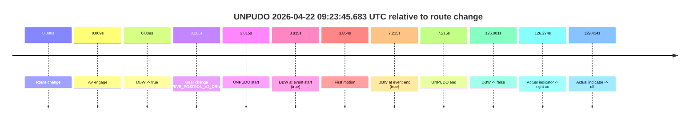
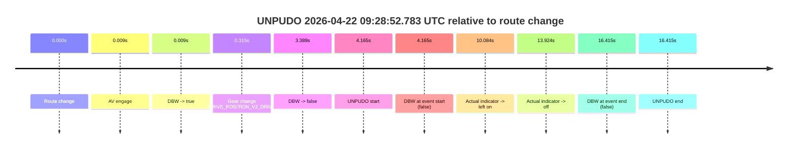
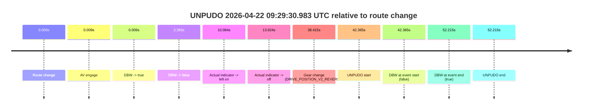
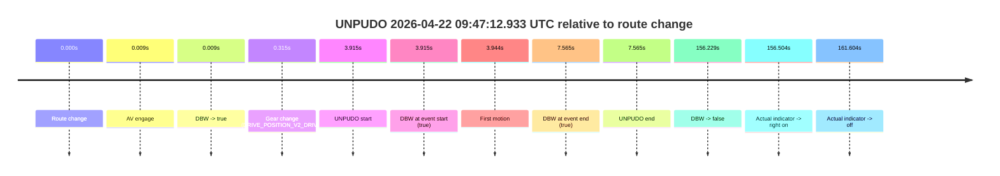
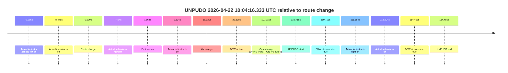

# Run Report: fme20018/2026-04-22--08-27-39--gen2-av-59ad9a97-e9da-47d0-aea4-c5a4ad0055d0

| Field | Value |
|---|---|
| Run ID | `fme20018/2026-04-22--08-27-39--gen2-av-59ad9a97-e9da-47d0-aea4-c5a4ad0055d0` |
| Date | `2026-04-22` |
| Model(s) | `eel-teal-outspoken` |
| Author | `zak` |
| Event count | `6` |

## unpudo 2026-04-22 09:23:45.683 UTC

| Field | Value |
|---|---|
| Model | `eel-teal-outspoken` |
| Author | `zak` |
| Run ID | `fme20018/2026-04-22--08-27-39--gen2-av-59ad9a97-e9da-47d0-aea4-c5a4ad0055d0` |
| Date | `2026-04-22` |
| Time (UTC) | `09:23:45.683` |
| Event type | `unpudo` |
| Disengagement type | `none observed` |
| Route change | `found` |
| Console | [run](https://console.sso.wayve.ai/run/fme20018/2026-04-22--08-27-39--gen2-av-59ad9a97-e9da-47d0-aea4-c5a4ad0055d0?id=&time-unixus=1776849825683295) |
| Foxglove | [segment](https://app.foxglove.dev/wayve-on-prem/p/prj_0dX18KZdVHg1fmmI/view?ds=foxglove-stream&ds.deviceName=fme20018&ds.start=2026-04-22T09%3A23%3A31.868281Z&ds.end=2026-04-22T09%3A25%3A57.869339Z&layoutId=lay_0e7VD4WIKDQGU73Y&time=2026-04-22T09%3A23%3A45.683295Z) |

### Event card: pass

- Pass: AV owns the credited unpudo from route change through the official unpudo window, the gear state is aligned at the anchor, and the vehicle moves without driver accelerator help in AV.

| Event | Time (UTC) | Delta from route change |
|---|---:|---:|
| Route change | 2026-04-22 09:23:41.868 | `0.000s` |
| AV engage | 2026-04-22 09:23:41.877 | `0.009s` |
| DBW -> true | 2026-04-22 09:23:41.877 | `0.009s` |
| Gear change (DRIVE_POSITION_V2_DRIVE) | 2026-04-22 09:23:42.133 | `0.265s` |
| UNPUDO start | 2026-04-22 09:23:45.683 | `3.815s` |
| DBW at event start (true) | 2026-04-22 09:23:45.683 | `3.815s` |
| First motion | 2026-04-22 09:23:45.721 | `3.854s` |
| DBW at event end (true) | 2026-04-22 09:23:49.083 | `7.215s` |
| UNPUDO end | 2026-04-22 09:23:49.083 | `7.215s` |
| DBW -> false | 2026-04-22 09:25:47.869 | `126.001s` |
| Actual indicator -> right on | 2026-04-22 09:25:48.141 | `126.274s` |
| Actual indicator -> off | 2026-04-22 09:25:51.281 | `129.414s` |

| Metric | Value |
|---|---|
| Outcome | `pass` |
| Effective failure type | `none` |
| Route change status | `found` |
| DBW at event start | `true` |
| DBW at event end | `true` |
| Predicted gear at AV start | `DRIVE_POSITION_V2_PARK` |
| Actual gear at AV start | `DRIVE_POSITION_V2_PARK` |
| Predicted gear at event start | `DRIVE_POSITION_V2_DRIVE` |
| Actual gear at event start | `DRIVE_POSITION_V2_DRIVE` |
| Planned indicator direction | `INDICATORS_STATE_V2_RIGHT_ON` |
| Controller indicator direction | `INDICATORS_STATE_V2_OFF` |
| Actual indicator direction | `INDICATORS_STATE_V2_OFF` |
| Actual indicator at maneuver end | `INDICATORS_STATE_V2_OFF` |
| Driver accel help in AV | `false` |
| Driver accel help timestamp | `n/a` |
| Max accel pedal pct in AV | `0.0%` |
| Max brake pedal pct in AV | `8.0%` |
| Max speed mps in AV | `4.703` |
| Success timing baseline | `route change` |
| Route -> AV | `0.009s` |
| AV -> event start | `3.806s` |
| AV -> first motion | `3.845s` |
| Success baseline -> event start | `3.815s` |
| Success baseline -> first motion | `3.854s` |
| AV duration before disengagement | `125.992s` |
| Trajectory waypoint count | `36` |
| Driving-plan step count | `11` |

The scored portion starts from the AV-owned window, not from the pre-AV setup. Route-change search in the stopped pre-event segment was `found`, with the baseline therefore set to route change. At the event anchor the model predicts `DRIVE_POSITION_V2_DRIVE` and the actual gear is `DRIVE_POSITION_V2_DRIVE`. The effective model outcome is `pass` because `the credited unpudo stays AV-owned through the official unpudo window.`

### Resolution

| Field | Value |
|---|---|
| Final outcome | `pass` |
| Do we agree with this label? | `yes` |
| Source disengagement type | `none observed` |
| Resolved effective failure type | `none` |
| Confidence | `high` |

## unpudo 2026-04-22 09:28:52.783 UTC

| Field | Value |
|---|---|
| Model | `eel-teal-outspoken` |
| Author | `zak` |
| Run ID | `fme20018/2026-04-22--08-27-39--gen2-av-59ad9a97-e9da-47d0-aea4-c5a4ad0055d0` |
| Date | `2026-04-22` |
| Time (UTC) | `09:28:52.783` |
| Event type | `unpudo` |
| Disengagement type | `none observed` |
| Route change | `found` |
| Console | [run](https://console.sso.wayve.ai/run/fme20018/2026-04-22--08-27-39--gen2-av-59ad9a97-e9da-47d0-aea4-c5a4ad0055d0?id=&time-unixus=1776850132783296) |
| Foxglove | [segment](https://app.foxglove.dev/wayve-on-prem/p/prj_0dX18KZdVHg1fmmI/view?ds=foxglove-stream&ds.deviceName=fme20018&ds.start=2026-04-22T09%3A28%3A38.618238Z&ds.end=2026-04-22T09%3A29%3A15.033310Z&layoutId=lay_0e7VD4WIKDQGU73Y&time=2026-04-22T09%3A28%3A52.783296Z) |

### Event card: fail

- Fail: the credited unpudo does not stay AV-owned. The event window starts with DBW false, and the maneuver outcome lands outside a clean AV-owned segment.

| Event | Time (UTC) | Delta from route change |
|---|---:|---:|
| Route change | 2026-04-22 09:28:48.618 | `0.000s` |
| AV engage | 2026-04-22 09:28:48.627 | `0.009s` |
| DBW -> true | 2026-04-22 09:28:48.627 | `0.009s` |
| Gear change (DRIVE_POSITION_V2_DRIVE) | 2026-04-22 09:28:48.933 | `0.315s` |
| DBW -> false | 2026-04-22 09:28:52.006 | `3.389s` |
| UNPUDO start | 2026-04-22 09:28:52.783 | `4.165s` |
| DBW at event start (false) | 2026-04-22 09:28:52.783 | `4.165s` |
| Actual indicator -> left on | 2026-04-22 09:28:58.701 | `10.084s` |
| Actual indicator -> off | 2026-04-22 09:29:02.542 | `13.924s` |
| DBW at event end (false) | 2026-04-22 09:29:05.033 | `16.415s` |
| UNPUDO end | 2026-04-22 09:29:05.033 | `16.415s` |

| Metric | Value |
|---|---|
| Outcome | `fail` |
| Effective failure type | `not_av_owned` |
| Route change status | `found` |
| DBW at event start | `false` |
| DBW at event end | `false` |
| Predicted gear at AV start | `DRIVE_POSITION_V2_PARK` |
| Actual gear at AV start | `DRIVE_POSITION_V2_PARK` |
| Predicted gear at event start | `DRIVE_POSITION_V2_DRIVE` |
| Actual gear at event start | `DRIVE_POSITION_V2_DRIVE` |
| Planned indicator direction | `INDICATORS_STATE_V2_OFF` |
| Controller indicator direction | `INDICATORS_STATE_V2_OFF` |
| Actual indicator direction | `INDICATORS_STATE_V2_OFF` |
| Actual indicator at maneuver end | `INDICATORS_STATE_V2_OFF` |
| Driver accel help in AV | `false` |
| Driver accel help timestamp | `n/a` |
| Max accel pedal pct in AV | `0.0%` |
| Max brake pedal pct in AV | `11.7%` |
| Max speed mps in AV | `0.000` |
| Success timing baseline | `route change` |
| Route -> AV | `0.009s` |
| AV -> event start | `4.156s` |
| AV -> first motion | `n/a` |
| Success baseline -> event start | `4.165s` |
| Success baseline -> first motion | `n/a` |
| AV duration before disengagement | `3.380s` |
| Trajectory waypoint count | `36` |
| Driving-plan step count | `11` |

The scored portion starts from the AV-owned window, not from the pre-AV setup. Route-change search in the stopped pre-event segment was `found`, with the baseline therefore set to route change. At the event anchor the model predicts `DRIVE_POSITION_V2_DRIVE` and the actual gear is `DRIVE_POSITION_V2_DRIVE`. The effective model outcome is `fail` because `not_av_owned.`

### Resolution

| Field | Value |
|---|---|
| Final outcome | `fail` |
| Do we agree with this label? | `yes` |
| Source disengagement type | `none observed` |
| Resolved effective failure type | `not_av_owned` |
| Confidence | `high` |

## unpudo 2026-04-22 09:29:30.983 UTC

| Field | Value |
|---|---|
| Model | `eel-teal-outspoken` |
| Author | `zak` |
| Run ID | `fme20018/2026-04-22--08-27-39--gen2-av-59ad9a97-e9da-47d0-aea4-c5a4ad0055d0` |
| Date | `2026-04-22` |
| Time (UTC) | `09:29:30.983` |
| Event type | `unpudo` |
| Disengagement type | `none observed` |
| Route change | `found` |
| Console | [run](https://console.sso.wayve.ai/run/fme20018/2026-04-22--08-27-39--gen2-av-59ad9a97-e9da-47d0-aea4-c5a4ad0055d0?id=&time-unixus=1776850170983304) |
| Foxglove | [segment](https://app.foxglove.dev/wayve-on-prem/p/prj_0dX18KZdVHg1fmmI/view?ds=foxglove-stream&ds.deviceName=fme20018&ds.start=2026-04-22T09%3A28%3A38.618238Z&ds.end=2026-04-22T09%3A29%3A50.833313Z&layoutId=lay_0e7VD4WIKDQGU73Y&time=2026-04-22T09%3A29%3A30.983304Z) |

### Event card: fail

- Fail: the credited unpudo does not stay AV-owned. The event window starts with DBW false, and the maneuver outcome lands outside a clean AV-owned segment.

| Event | Time (UTC) | Delta from route change |
|---|---:|---:|
| Route change | 2026-04-22 09:28:48.618 | `0.000s` |
| AV engage | 2026-04-22 09:28:48.627 | `0.009s` |
| DBW -> true | 2026-04-22 09:28:48.627 | `0.009s` |
| DBW -> false | 2026-04-22 09:28:52.006 | `3.389s` |
| Actual indicator -> left on | 2026-04-22 09:28:58.701 | `10.084s` |
| Actual indicator -> off | 2026-04-22 09:29:02.542 | `13.924s` |
| Gear change (DRIVE_POSITION_V2_REVERSE) | 2026-04-22 09:29:27.033 | `38.415s` |
| UNPUDO start | 2026-04-22 09:29:30.983 | `42.365s` |
| DBW at event start (false) | 2026-04-22 09:29:30.983 | `42.365s` |
| DBW at event end (true) | 2026-04-22 09:29:40.833 | `52.215s` |
| UNPUDO end | 2026-04-22 09:29:40.833 | `52.215s` |

| Metric | Value |
|---|---|
| Outcome | `fail` |
| Effective failure type | `not_av_owned` |
| Route change status | `found` |
| DBW at event start | `false` |
| DBW at event end | `true` |
| Predicted gear at AV start | `DRIVE_POSITION_V2_PARK` |
| Actual gear at AV start | `DRIVE_POSITION_V2_PARK` |
| Predicted gear at event start | `DRIVE_POSITION_V2_REVERSE` |
| Actual gear at event start | `DRIVE_POSITION_V2_REVERSE` |
| Planned indicator direction | `INDICATORS_STATE_V2_OFF` |
| Controller indicator direction | `INDICATORS_STATE_V2_OFF` |
| Actual indicator direction | `INDICATORS_STATE_V2_OFF` |
| Actual indicator at maneuver end | `INDICATORS_STATE_V2_OFF` |
| Driver accel help in AV | `false` |
| Driver accel help timestamp | `n/a` |
| Max accel pedal pct in AV | `0.0%` |
| Max brake pedal pct in AV | `11.7%` |
| Max speed mps in AV | `0.000` |
| Success timing baseline | `route change` |
| Route -> AV | `0.009s` |
| AV -> event start | `42.356s` |
| AV -> first motion | `n/a` |
| Success baseline -> event start | `42.365s` |
| Success baseline -> first motion | `n/a` |
| AV duration before disengagement | `3.380s` |
| Trajectory waypoint count | `36` |
| Driving-plan step count | `11` |

The scored portion starts from the AV-owned window, not from the pre-AV setup. Route-change search in the stopped pre-event segment was `found`, with the baseline therefore set to route change. At the event anchor the model predicts `DRIVE_POSITION_V2_REVERSE` and the actual gear is `DRIVE_POSITION_V2_REVERSE`. The effective model outcome is `fail` because `not_av_owned.`

### Resolution

| Field | Value |
|---|---|
| Final outcome | `fail` |
| Do we agree with this label? | `yes` |
| Source disengagement type | `none observed` |
| Resolved effective failure type | `not_av_owned` |
| Confidence | `high` |

## unpudo 2026-04-22 09:40:27.383 UTC

| Field | Value |
|---|---|
| Model | `eel-teal-outspoken` |
| Author | `zak` |
| Run ID | `fme20018/2026-04-22--08-27-39--gen2-av-59ad9a97-e9da-47d0-aea4-c5a4ad0055d0` |
| Date | `2026-04-22` |
| Time (UTC) | `09:40:27.383` |
| Event type | `unpudo` |
| Disengagement type | `none observed` |
| Route change | `found` |
| Console | [run](https://console.sso.wayve.ai/run/fme20018/2026-04-22--08-27-39--gen2-av-59ad9a97-e9da-47d0-aea4-c5a4ad0055d0?id=&time-unixus=1776850827383317) |
| Foxglove | [segment](https://app.foxglove.dev/wayve-on-prem/p/prj_0dX18KZdVHg1fmmI/view?ds=foxglove-stream&ds.deviceName=fme20018&ds.start=2026-04-22T09%3A38%3A46.668242Z&ds.end=2026-04-22T09%3A41%3A41.566996Z&layoutId=lay_0e7VD4WIKDQGU73Y&time=2026-04-22T09%3A40%3A27.383317Z) |

### Event card: pass

- Pass: AV owns the credited unpudo from route change through the official unpudo window, the gear state is aligned at the anchor, and the vehicle moves without driver accelerator help in AV.

| Event | Time (UTC) | Delta from route change |
|---|---:|---:|
| Actual indicator already left on | 2026-04-22 09:38:46.682 | `-9.986s` |
| Actual indicator -> off | 2026-04-22 09:38:47.001 | `-9.666s` |
| Route change | 2026-04-22 09:38:56.668 | `0.000s` |
| AV engage | 2026-04-22 09:38:59.587 | `2.919s` |
| DBW -> true | 2026-04-22 09:38:59.587 | `2.919s` |
| First motion | 2026-04-22 09:39:03.681 | `7.014s` |
| Gear change (DRIVE_POSITION_V2_DRIVE) | 2026-04-22 09:40:23.833 | `87.165s` |
| UNPUDO start | 2026-04-22 09:40:27.383 | `90.715s` |
| DBW at event start (true) | 2026-04-22 09:40:27.383 | `90.715s` |
| DBW at event end (true) | 2026-04-22 09:40:30.683 | `94.015s` |
| UNPUDO end | 2026-04-22 09:40:30.683 | `94.015s` |
| DBW -> false | 2026-04-22 09:41:31.566 | `154.899s` |
| Actual indicator -> left on | 2026-04-22 09:41:47.562 | `170.894s` |

| Metric | Value |
|---|---|
| Outcome | `pass` |
| Effective failure type | `none` |
| Route change status | `found` |
| DBW at event start | `true` |
| DBW at event end | `true` |
| Predicted gear at AV start | `DRIVE_POSITION_V2_DRIVE` |
| Actual gear at AV start | `DRIVE_POSITION_V2_PARK` |
| Predicted gear at event start | `DRIVE_POSITION_V2_DRIVE` |
| Actual gear at event start | `DRIVE_POSITION_V2_DRIVE` |
| Planned indicator direction | `INDICATORS_STATE_V2_RIGHT_ON` |
| Controller indicator direction | `INDICATORS_STATE_V2_RIGHT_ON` |
| Actual indicator direction | `INDICATORS_STATE_V2_OFF` |
| Actual indicator at maneuver end | `INDICATORS_STATE_V2_OFF` |
| Driver accel help in AV | `false` |
| Driver accel help timestamp | `n/a` |
| Max accel pedal pct in AV | `0.0%` |
| Max brake pedal pct in AV | `16.8%` |
| Max speed mps in AV | `8.131` |
| Success timing baseline | `route change` |
| Route -> AV | `2.919s` |
| AV -> event start | `87.796s` |
| AV -> first motion | `4.095s` |
| Success baseline -> event start | `90.715s` |
| Success baseline -> first motion | `7.014s` |
| AV duration before disengagement | `151.980s` |
| Trajectory waypoint count | `36` |
| Driving-plan step count | `11` |

The scored portion starts from the AV-owned window, not from the pre-AV setup. Route-change search in the stopped pre-event segment was `found`, with the baseline therefore set to route change. At the event anchor the model predicts `DRIVE_POSITION_V2_DRIVE` and the actual gear is `DRIVE_POSITION_V2_DRIVE`. The effective model outcome is `pass` because `the credited unpudo stays AV-owned through the official unpudo window.`

### Resolution

| Field | Value |
|---|---|
| Final outcome | `pass` |
| Do we agree with this label? | `yes` |
| Source disengagement type | `none observed` |
| Resolved effective failure type | `none` |
| Confidence | `high` |

## unpudo 2026-04-22 09:47:12.933 UTC

| Field | Value |
|---|---|
| Model | `eel-teal-outspoken` |
| Author | `zak` |
| Run ID | `fme20018/2026-04-22--08-27-39--gen2-av-59ad9a97-e9da-47d0-aea4-c5a4ad0055d0` |
| Date | `2026-04-22` |
| Time (UTC) | `09:47:12.933` |
| Event type | `unpudo` |
| Disengagement type | `none observed` |
| Route change | `found` |
| Console | [run](https://console.sso.wayve.ai/run/fme20018/2026-04-22--08-27-39--gen2-av-59ad9a97-e9da-47d0-aea4-c5a4ad0055d0?id=&time-unixus=1776851232933305) |
| Foxglove | [segment](https://app.foxglove.dev/wayve-on-prem/p/prj_0dX18KZdVHg1fmmI/view?ds=foxglove-stream&ds.deviceName=fme20018&ds.start=2026-04-22T09%3A46%3A59.018250Z&ds.end=2026-04-22T09%3A49%3A55.247312Z&layoutId=lay_0e7VD4WIKDQGU73Y&time=2026-04-22T09%3A47%3A12.933305Z) |

### Event card: pass

- Pass: AV owns the credited unpudo from route change through the official unpudo window, the gear state is aligned at the anchor, and the vehicle moves without driver accelerator help in AV.

| Event | Time (UTC) | Delta from route change |
|---|---:|---:|
| Route change | 2026-04-22 09:47:09.018 | `0.000s` |
| AV engage | 2026-04-22 09:47:09.027 | `0.009s` |
| DBW -> true | 2026-04-22 09:47:09.027 | `0.009s` |
| Gear change (DRIVE_POSITION_V2_DRIVE) | 2026-04-22 09:47:09.333 | `0.315s` |
| UNPUDO start | 2026-04-22 09:47:12.933 | `3.915s` |
| DBW at event start (true) | 2026-04-22 09:47:12.933 | `3.915s` |
| First motion | 2026-04-22 09:47:12.961 | `3.944s` |
| DBW at event end (true) | 2026-04-22 09:47:16.583 | `7.565s` |
| UNPUDO end | 2026-04-22 09:47:16.583 | `7.565s` |
| DBW -> false | 2026-04-22 09:49:45.247 | `156.229s` |
| Actual indicator -> right on | 2026-04-22 09:49:45.521 | `156.504s` |
| Actual indicator -> off | 2026-04-22 09:49:50.622 | `161.604s` |

| Metric | Value |
|---|---|
| Outcome | `pass` |
| Effective failure type | `none` |
| Route change status | `found` |
| DBW at event start | `true` |
| DBW at event end | `true` |
| Predicted gear at AV start | `DRIVE_POSITION_V2_PARK` |
| Actual gear at AV start | `DRIVE_POSITION_V2_PARK` |
| Predicted gear at event start | `DRIVE_POSITION_V2_DRIVE` |
| Actual gear at event start | `DRIVE_POSITION_V2_DRIVE` |
| Planned indicator direction | `INDICATORS_STATE_V2_RIGHT_ON` |
| Controller indicator direction | `INDICATORS_STATE_V2_RIGHT_ON` |
| Actual indicator direction | `INDICATORS_STATE_V2_OFF` |
| Actual indicator at maneuver end | `INDICATORS_STATE_V2_OFF` |
| Driver accel help in AV | `false` |
| Driver accel help timestamp | `n/a` |
| Max accel pedal pct in AV | `0.0%` |
| Max brake pedal pct in AV | `8.0%` |
| Max speed mps in AV | `5.194` |
| Success timing baseline | `route change` |
| Route -> AV | `0.009s` |
| AV -> event start | `3.906s` |
| AV -> first motion | `3.935s` |
| Success baseline -> event start | `3.915s` |
| Success baseline -> first motion | `3.944s` |
| AV duration before disengagement | `156.220s` |
| Trajectory waypoint count | `37` |
| Driving-plan step count | `11` |

The scored portion starts from the AV-owned window, not from the pre-AV setup. Route-change search in the stopped pre-event segment was `found`, with the baseline therefore set to route change. At the event anchor the model predicts `DRIVE_POSITION_V2_DRIVE` and the actual gear is `DRIVE_POSITION_V2_DRIVE`. The effective model outcome is `pass` because `the credited unpudo stays AV-owned through the official unpudo window.`

### Resolution

| Field | Value |
|---|---|
| Final outcome | `pass` |
| Do we agree with this label? | `yes` |
| Source disengagement type | `none observed` |
| Resolved effective failure type | `none` |
| Confidence | `high` |

## unpudo 2026-04-22 10:04:16.333 UTC

| Field | Value |
|---|---|
| Model | `eel-teal-outspoken` |
| Author | `zak` |
| Run ID | `fme20018/2026-04-22--08-27-39--gen2-av-59ad9a97-e9da-47d0-aea4-c5a4ad0055d0` |
| Date | `2026-04-22` |
| Time (UTC) | `10:04:16.333` |
| Event type | `unpudo` |
| Disengagement type | `none observed` |
| Route change | `found` |
| Console | [run](https://console.sso.wayve.ai/run/fme20018/2026-04-22--08-27-39--gen2-av-59ad9a97-e9da-47d0-aea4-c5a4ad0055d0?id=&time-unixus=1776852256333318) |
| Foxglove | [segment](https://app.foxglove.dev/wayve-on-prem/p/prj_0dX18KZdVHg1fmmI/view?ds=foxglove-stream&ds.deviceName=fme20018&ds.start=2026-04-22T10%3A02%3A15.618262Z&ds.end=2026-04-22T10%3A04%3A30.083307Z&layoutId=lay_0e7VD4WIKDQGU73Y&time=2026-04-22T10%3A04%3A16.333318Z) |

### Event card: pass

- Pass: AV owns the credited unpudo from route change through the official unpudo window, the gear state is aligned at the anchor, and the vehicle moves without driver accelerator help in AV.

| Event | Time (UTC) | Delta from route change |
|---|---:|---:|
| Actual indicator already left on | 2026-04-22 10:02:15.622 | `-9.995s` |
| Actual indicator -> off | 2026-04-22 10:02:17.141 | `-8.476s` |
| Route change | 2026-04-22 10:02:25.618 | `0.000s` |
| Actual indicator -> right on | 2026-04-22 10:02:33.041 | `7.424s` |
| First motion | 2026-04-22 10:02:33.182 | `7.564s` |
| Actual indicator -> off | 2026-04-22 10:02:34.922 | `9.304s` |
| AV engage | 2026-04-22 10:03:01.948 | `36.330s` |
| DBW -> true | 2026-04-22 10:03:01.948 | `36.330s` |
| Gear change (DRIVE_POSITION_V2_DRIVE) | 2026-04-22 10:04:12.733 | `107.115s` |
| UNPUDO start | 2026-04-22 10:04:16.333 | `110.715s` |
| DBW at event start (true) | 2026-04-22 10:04:16.333 | `110.715s` |
| Actual indicator -> right on | 2026-04-22 10:04:17.001 | `111.384s` |
| Actual indicator -> off | 2026-04-22 10:04:18.821 | `113.204s` |
| DBW at event end (true) | 2026-04-22 10:04:20.083 | `114.465s` |
| UNPUDO end | 2026-04-22 10:04:20.083 | `114.465s` |

| Metric | Value |
|---|---|
| Outcome | `pass` |
| Effective failure type | `none` |
| Route change status | `found` |
| DBW at event start | `true` |
| DBW at event end | `true` |
| Predicted gear at AV start | `DRIVE_POSITION_V2_DRIVE` |
| Actual gear at AV start | `DRIVE_POSITION_V2_DRIVE` |
| Predicted gear at event start | `DRIVE_POSITION_V2_DRIVE` |
| Actual gear at event start | `DRIVE_POSITION_V2_DRIVE` |
| Planned indicator direction | `INDICATORS_STATE_V2_RIGHT_ON` |
| Controller indicator direction | `INDICATORS_STATE_V2_RIGHT_ON` |
| Actual indicator direction | `INDICATORS_STATE_V2_OFF` |
| Actual indicator at maneuver end | `INDICATORS_STATE_V2_OFF` |
| Driver accel help in AV | `false` |
| Driver accel help timestamp | `n/a` |
| Max accel pedal pct in AV | `0.0%` |
| Max brake pedal pct in AV | `18.2%` |
| Max speed mps in AV | `7.092` |
| Success timing baseline | `route change` |
| Route -> AV | `36.330s` |
| AV -> event start | `74.385s` |
| AV -> first motion | `-28.766s` |
| Success baseline -> event start | `110.715s` |
| Success baseline -> first motion | `7.564s` |
| AV duration before disengagement | `n/a` |
| Trajectory waypoint count | `37` |
| Driving-plan step count | `11` |

The scored portion starts from the AV-owned window, not from the pre-AV setup. Route-change search in the stopped pre-event segment was `found`, with the baseline therefore set to route change. At the event anchor the model predicts `DRIVE_POSITION_V2_DRIVE` and the actual gear is `DRIVE_POSITION_V2_DRIVE`. The effective model outcome is `pass` because `the credited unpudo stays AV-owned through the official unpudo window.`

### Resolution

| Field | Value |
|---|---|
| Final outcome | `pass` |
| Do we agree with this label? | `yes` |
| Source disengagement type | `none observed` |
| Resolved effective failure type | `none` |
| Confidence | `high` |
