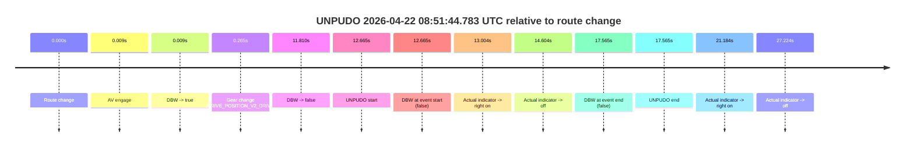
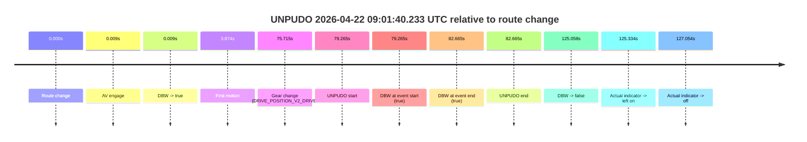
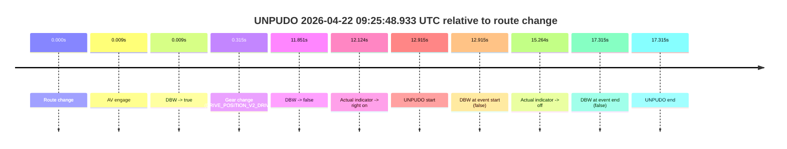
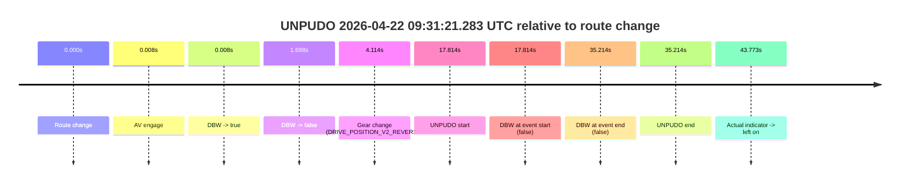
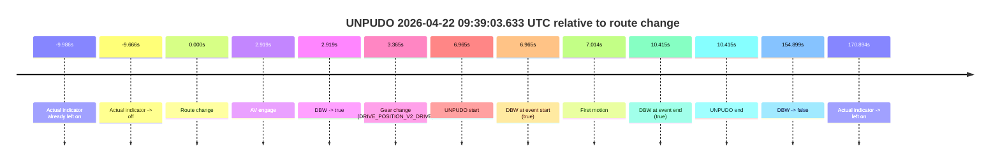
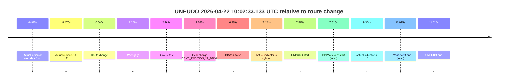
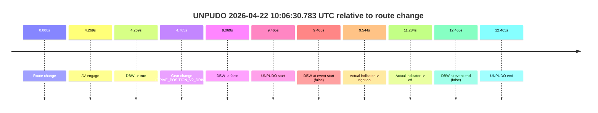

# Run Report: fme20018/2026-04-22--08-27-39--gen2-av-59ad9a97-e9da-47d0-aea4-c5a4ad0055d0

| Field | Value |
|---|---|
| Run ID | `fme20018/2026-04-22--08-27-39--gen2-av-59ad9a97-e9da-47d0-aea4-c5a4ad0055d0` |
| Date | `2026-04-22` |
| Model(s) | `pink-manta-ray-smooth` |
| Author | `guy.geva` |
| Event count | `8` |

## unpudo 2026-04-22 08:51:44.783 UTC

| Field | Value |
|---|---|
| Model | `pink-manta-ray-smooth` |
| Author | `guy.geva` |
| Run ID | `fme20018/2026-04-22--08-27-39--gen2-av-59ad9a97-e9da-47d0-aea4-c5a4ad0055d0` |
| Date | `2026-04-22` |
| Time (UTC) | `08:51:44.783` |
| Event type | `unpudo` |
| Disengagement type | `none observed` |
| Route change | `found` |
| Console | [run](https://console.sso.wayve.ai/run/fme20018/2026-04-22--08-27-39--gen2-av-59ad9a97-e9da-47d0-aea4-c5a4ad0055d0?id=&time-unixus=1776847904783319) |
| Foxglove | [segment](https://app.foxglove.dev/wayve-on-prem/p/prj_0dX18KZdVHg1fmmI/view?ds=foxglove-stream&ds.deviceName=fme20018&ds.start=2026-04-22T08%3A51%3A22.118254Z&ds.end=2026-04-22T08%3A51%3A59.683300Z&layoutId=lay_0e7VD4WIKDQGU73Y&time=2026-04-22T08%3A51%3A44.783319Z) |

### Event card: fail

- Fail: the credited unpudo does not stay AV-owned. The event window starts with DBW false, and the maneuver outcome lands outside a clean AV-owned segment.

| Event | Time (UTC) | Delta from route change |
|---|---:|---:|
| Route change | 2026-04-22 08:51:32.118 | `0.000s` |
| AV engage | 2026-04-22 08:51:32.127 | `0.009s` |
| DBW -> true | 2026-04-22 08:51:32.127 | `0.009s` |
| Gear change (DRIVE_POSITION_V2_DRIVE) | 2026-04-22 08:51:32.383 | `0.265s` |
| DBW -> false | 2026-04-22 08:51:43.927 | `11.810s` |
| UNPUDO start | 2026-04-22 08:51:44.783 | `12.665s` |
| DBW at event start (false) | 2026-04-22 08:51:44.783 | `12.665s` |
| Actual indicator -> right on | 2026-04-22 08:51:45.121 | `13.004s` |
| Actual indicator -> off | 2026-04-22 08:51:46.721 | `14.604s` |
| DBW at event end (false) | 2026-04-22 08:51:49.683 | `17.565s` |
| UNPUDO end | 2026-04-22 08:51:49.683 | `17.565s` |
| Actual indicator -> right on | 2026-04-22 08:51:53.301 | `21.184s` |
| Actual indicator -> off | 2026-04-22 08:51:59.341 | `27.224s` |

| Metric | Value |
|---|---|
| Outcome | `fail` |
| Effective failure type | `not_av_owned` |
| Route change status | `found` |
| DBW at event start | `false` |
| DBW at event end | `false` |
| Predicted gear at AV start | `DRIVE_POSITION_V2_PARK` |
| Actual gear at AV start | `DRIVE_POSITION_V2_PARK` |
| Predicted gear at event start | `DRIVE_POSITION_V2_DRIVE` |
| Actual gear at event start | `DRIVE_POSITION_V2_DRIVE` |
| Planned indicator direction | `INDICATORS_STATE_V2_RIGHT_ON` |
| Controller indicator direction | `INDICATORS_STATE_V2_RIGHT_ON` |
| Actual indicator direction | `INDICATORS_STATE_V2_OFF` |
| Actual indicator at maneuver end | `INDICATORS_STATE_V2_OFF` |
| Driver accel help in AV | `false` |
| Driver accel help timestamp | `n/a` |
| Max accel pedal pct in AV | `0.0%` |
| Max brake pedal pct in AV | `15.4%` |
| Max speed mps in AV | `0.000` |
| Success timing baseline | `route change` |
| Route -> AV | `0.009s` |
| AV -> event start | `12.656s` |
| AV -> first motion | `n/a` |
| Success baseline -> event start | `12.665s` |
| Success baseline -> first motion | `n/a` |
| AV duration before disengagement | `11.801s` |
| Trajectory waypoint count | `36` |
| Driving-plan step count | `11` |

The scored portion starts from the AV-owned window, not from the pre-AV setup. Route-change search in the stopped pre-event segment was `found`, with the baseline therefore set to route change. At the event anchor the model predicts `DRIVE_POSITION_V2_DRIVE` and the actual gear is `DRIVE_POSITION_V2_DRIVE`. The effective model outcome is `fail` because `not_av_owned.`

### Resolution

| Field | Value |
|---|---|
| Final outcome | `fail` |
| Do we agree with this label? | `yes` |
| Source disengagement type | `none observed` |
| Resolved effective failure type | `not_av_owned` |
| Confidence | `high` |

## unpudo 2026-04-22 09:01:40.233 UTC

| Field | Value |
|---|---|
| Model | `pink-manta-ray-smooth` |
| Author | `guy.geva` |
| Run ID | `fme20018/2026-04-22--08-27-39--gen2-av-59ad9a97-e9da-47d0-aea4-c5a4ad0055d0` |
| Date | `2026-04-22` |
| Time (UTC) | `09:01:40.233` |
| Event type | `unpudo` |
| Disengagement type | `none observed` |
| Route change | `found` |
| Console | [run](https://console.sso.wayve.ai/run/fme20018/2026-04-22--08-27-39--gen2-av-59ad9a97-e9da-47d0-aea4-c5a4ad0055d0?id=&time-unixus=1776848500233305) |
| Foxglove | [segment](https://app.foxglove.dev/wayve-on-prem/p/prj_0dX18KZdVHg1fmmI/view?ds=foxglove-stream&ds.deviceName=fme20018&ds.start=2026-04-22T09%3A00%3A10.968256Z&ds.end=2026-04-22T09%3A02%3A36.026348Z&layoutId=lay_0e7VD4WIKDQGU73Y&time=2026-04-22T09%3A01%3A40.233305Z) |

### Event card: pass

- Pass: AV owns the credited unpudo from route change through the official unpudo window, the gear state is aligned at the anchor, and the vehicle moves without driver accelerator help in AV.

| Event | Time (UTC) | Delta from route change |
|---|---:|---:|
| Route change | 2026-04-22 09:00:20.968 | `0.000s` |
| AV engage | 2026-04-22 09:00:20.977 | `0.009s` |
| DBW -> true | 2026-04-22 09:00:20.977 | `0.009s` |
| First motion | 2026-04-22 09:00:24.841 | `3.874s` |
| Gear change (DRIVE_POSITION_V2_DRIVE) | 2026-04-22 09:01:36.683 | `75.715s` |
| UNPUDO start | 2026-04-22 09:01:40.233 | `79.265s` |
| DBW at event start (true) | 2026-04-22 09:01:40.233 | `79.265s` |
| DBW at event end (true) | 2026-04-22 09:01:43.633 | `82.665s` |
| UNPUDO end | 2026-04-22 09:01:43.633 | `82.665s` |
| DBW -> false | 2026-04-22 09:02:26.026 | `125.058s` |
| Actual indicator -> left on | 2026-04-22 09:02:26.302 | `125.334s` |
| Actual indicator -> off | 2026-04-22 09:02:28.021 | `127.054s` |

| Metric | Value |
|---|---|
| Outcome | `pass` |
| Effective failure type | `none` |
| Route change status | `found` |
| DBW at event start | `true` |
| DBW at event end | `true` |
| Predicted gear at AV start | `DRIVE_POSITION_V2_PARK` |
| Actual gear at AV start | `DRIVE_POSITION_V2_PARK` |
| Predicted gear at event start | `DRIVE_POSITION_V2_DRIVE` |
| Actual gear at event start | `DRIVE_POSITION_V2_DRIVE` |
| Planned indicator direction | `INDICATORS_STATE_V2_RIGHT_ON` |
| Controller indicator direction | `INDICATORS_STATE_V2_RIGHT_ON` |
| Actual indicator direction | `INDICATORS_STATE_V2_OFF` |
| Actual indicator at maneuver end | `INDICATORS_STATE_V2_OFF` |
| Driver accel help in AV | `false` |
| Driver accel help timestamp | `n/a` |
| Max accel pedal pct in AV | `0.0%` |
| Max brake pedal pct in AV | `8.4%` |
| Max speed mps in AV | `8.167` |
| Success timing baseline | `route change` |
| Route -> AV | `0.009s` |
| AV -> event start | `79.256s` |
| AV -> first motion | `3.865s` |
| Success baseline -> event start | `79.265s` |
| Success baseline -> first motion | `3.874s` |
| AV duration before disengagement | `125.049s` |
| Trajectory waypoint count | `35` |
| Driving-plan step count | `11` |

The scored portion starts from the AV-owned window, not from the pre-AV setup. Route-change search in the stopped pre-event segment was `found`, with the baseline therefore set to route change. At the event anchor the model predicts `DRIVE_POSITION_V2_DRIVE` and the actual gear is `DRIVE_POSITION_V2_DRIVE`. The effective model outcome is `pass` because `the credited unpudo stays AV-owned through the official unpudo window.`

### Resolution

| Field | Value |
|---|---|
| Final outcome | `pass` |
| Do we agree with this label? | `yes` |
| Source disengagement type | `none observed` |
| Resolved effective failure type | `none` |
| Confidence | `high` |

## unpudo 2026-04-22 09:25:48.933 UTC

| Field | Value |
|---|---|
| Model | `pink-manta-ray-smooth` |
| Author | `guy.geva` |
| Run ID | `fme20018/2026-04-22--08-27-39--gen2-av-59ad9a97-e9da-47d0-aea4-c5a4ad0055d0` |
| Date | `2026-04-22` |
| Time (UTC) | `09:25:48.933` |
| Event type | `unpudo` |
| Disengagement type | `none observed` |
| Route change | `found` |
| Console | [run](https://console.sso.wayve.ai/run/fme20018/2026-04-22--08-27-39--gen2-av-59ad9a97-e9da-47d0-aea4-c5a4ad0055d0?id=&time-unixus=1776849948933320) |
| Foxglove | [segment](https://app.foxglove.dev/wayve-on-prem/p/prj_0dX18KZdVHg1fmmI/view?ds=foxglove-stream&ds.deviceName=fme20018&ds.start=2026-04-22T09%3A25%3A26.018266Z&ds.end=2026-04-22T09%3A26%3A03.333315Z&layoutId=lay_0e7VD4WIKDQGU73Y&time=2026-04-22T09%3A25%3A48.933320Z) |

### Event card: fail

- Fail: the credited unpudo does not stay AV-owned. The event window starts with DBW false, and the maneuver outcome lands outside a clean AV-owned segment.

| Event | Time (UTC) | Delta from route change |
|---|---:|---:|
| Route change | 2026-04-22 09:25:36.018 | `0.000s` |
| AV engage | 2026-04-22 09:25:36.027 | `0.009s` |
| DBW -> true | 2026-04-22 09:25:36.027 | `0.009s` |
| Gear change (DRIVE_POSITION_V2_DRIVE) | 2026-04-22 09:25:36.333 | `0.315s` |
| DBW -> false | 2026-04-22 09:25:47.869 | `11.851s` |
| Actual indicator -> right on | 2026-04-22 09:25:48.141 | `12.124s` |
| UNPUDO start | 2026-04-22 09:25:48.933 | `12.915s` |
| DBW at event start (false) | 2026-04-22 09:25:48.933 | `12.915s` |
| Actual indicator -> off | 2026-04-22 09:25:51.281 | `15.264s` |
| DBW at event end (false) | 2026-04-22 09:25:53.333 | `17.315s` |
| UNPUDO end | 2026-04-22 09:25:53.333 | `17.315s` |

| Metric | Value |
|---|---|
| Outcome | `fail` |
| Effective failure type | `not_av_owned` |
| Route change status | `found` |
| DBW at event start | `false` |
| DBW at event end | `false` |
| Predicted gear at AV start | `DRIVE_POSITION_V2_PARK` |
| Actual gear at AV start | `DRIVE_POSITION_V2_PARK` |
| Predicted gear at event start | `DRIVE_POSITION_V2_DRIVE` |
| Actual gear at event start | `DRIVE_POSITION_V2_DRIVE` |
| Planned indicator direction | `INDICATORS_STATE_V2_RIGHT_ON` |
| Controller indicator direction | `INDICATORS_STATE_V2_RIGHT_ON` |
| Actual indicator direction | `INDICATORS_STATE_V2_RIGHT_ON` |
| Actual indicator at maneuver end | `INDICATORS_STATE_V2_OFF` |
| Driver accel help in AV | `false` |
| Driver accel help timestamp | `n/a` |
| Max accel pedal pct in AV | `0.0%` |
| Max brake pedal pct in AV | `8.0%` |
| Max speed mps in AV | `0.000` |
| Success timing baseline | `route change` |
| Route -> AV | `0.009s` |
| AV -> event start | `12.906s` |
| AV -> first motion | `n/a` |
| Success baseline -> event start | `12.915s` |
| Success baseline -> first motion | `n/a` |
| AV duration before disengagement | `11.842s` |
| Trajectory waypoint count | `35` |
| Driving-plan step count | `11` |

The scored portion starts from the AV-owned window, not from the pre-AV setup. Route-change search in the stopped pre-event segment was `found`, with the baseline therefore set to route change. At the event anchor the model predicts `DRIVE_POSITION_V2_DRIVE` and the actual gear is `DRIVE_POSITION_V2_DRIVE`. The effective model outcome is `fail` because `not_av_owned.`

### Resolution

| Field | Value |
|---|---|
| Final outcome | `fail` |
| Do we agree with this label? | `yes` |
| Source disengagement type | `none observed` |
| Resolved effective failure type | `not_av_owned` |
| Confidence | `high` |

## unpudo 2026-04-22 09:31:21.283 UTC

| Field | Value |
|---|---|
| Model | `pink-manta-ray-smooth` |
| Author | `guy.geva` |
| Run ID | `fme20018/2026-04-22--08-27-39--gen2-av-59ad9a97-e9da-47d0-aea4-c5a4ad0055d0` |
| Date | `2026-04-22` |
| Time (UTC) | `09:31:21.283` |
| Event type | `unpudo` |
| Disengagement type | `none observed` |
| Route change | `found` |
| Console | [run](https://console.sso.wayve.ai/run/fme20018/2026-04-22--08-27-39--gen2-av-59ad9a97-e9da-47d0-aea4-c5a4ad0055d0?id=&time-unixus=1776850281283291) |
| Foxglove | [segment](https://app.foxglove.dev/wayve-on-prem/p/prj_0dX18KZdVHg1fmmI/view?ds=foxglove-stream&ds.deviceName=fme20018&ds.start=2026-04-22T09%3A30%3A53.469401Z&ds.end=2026-04-22T09%3A31%3A48.683320Z&layoutId=lay_0e7VD4WIKDQGU73Y&time=2026-04-22T09%3A31%3A21.283291Z) |

### Event card: accidental

- Accidental: AV ownership is present for less than `2s`, so this is treated as an accidental brush with the maneuver rather than a meaningful model attempt.

| Event | Time (UTC) | Delta from route change |
|---|---:|---:|
| Route change | 2026-04-22 09:31:03.469 | `0.000s` |
| AV engage | 2026-04-22 09:31:03.477 | `0.008s` |
| DBW -> true | 2026-04-22 09:31:03.477 | `0.008s` |
| DBW -> false | 2026-04-22 09:31:05.167 | `1.698s` |
| Gear change (DRIVE_POSITION_V2_REVERSE) | 2026-04-22 09:31:07.583 | `4.114s` |
| UNPUDO start | 2026-04-22 09:31:21.283 | `17.814s` |
| DBW at event start (false) | 2026-04-22 09:31:21.283 | `17.814s` |
| DBW at event end (false) | 2026-04-22 09:31:38.683 | `35.214s` |
| UNPUDO end | 2026-04-22 09:31:38.683 | `35.214s` |
| Actual indicator -> left on | 2026-04-22 09:31:47.242 | `43.773s` |

| Metric | Value |
|---|---|
| Outcome | `accidental` |
| Effective failure type | `none` |
| Route change status | `found` |
| DBW at event start | `false` |
| DBW at event end | `false` |
| Predicted gear at AV start | `DRIVE_POSITION_V2_PARK` |
| Actual gear at AV start | `DRIVE_POSITION_V2_PARK` |
| Predicted gear at event start | `DRIVE_POSITION_V2_REVERSE` |
| Actual gear at event start | `DRIVE_POSITION_V2_REVERSE` |
| Planned indicator direction | `INDICATORS_STATE_V2_OFF` |
| Controller indicator direction | `INDICATORS_STATE_V2_OFF` |
| Actual indicator direction | `INDICATORS_STATE_V2_OFF` |
| Actual indicator at maneuver end | `INDICATORS_STATE_V2_OFF` |
| Driver accel help in AV | `false` |
| Driver accel help timestamp | `n/a` |
| Max accel pedal pct in AV | `0.0%` |
| Max brake pedal pct in AV | `8.7%` |
| Max speed mps in AV | `0.000` |
| Success timing baseline | `route change` |
| Route -> AV | `0.008s` |
| AV -> event start | `17.806s` |
| AV -> first motion | `n/a` |
| Success baseline -> event start | `17.814s` |
| Success baseline -> first motion | `n/a` |
| AV duration before disengagement | `1.690s` |
| Trajectory waypoint count | `37` |
| Driving-plan step count | `11` |

The scored portion starts from the AV-owned window, not from the pre-AV setup. Route-change search in the stopped pre-event segment was `found`, with the baseline therefore set to route change. At the event anchor the model predicts `DRIVE_POSITION_V2_REVERSE` and the actual gear is `DRIVE_POSITION_V2_REVERSE`. The effective model outcome is `accidental` because `the AV-owned portion is shorter than 2s.`

### Resolution

| Field | Value |
|---|---|
| Final outcome | `accidental` |
| Do we agree with this label? | `yes` |
| Source disengagement type | `none observed` |
| Resolved effective failure type | `none` |
| Confidence | `high` |

## unpudo 2026-04-22 09:39:03.633 UTC

| Field | Value |
|---|---|
| Model | `pink-manta-ray-smooth` |
| Author | `guy.geva` |
| Run ID | `fme20018/2026-04-22--08-27-39--gen2-av-59ad9a97-e9da-47d0-aea4-c5a4ad0055d0` |
| Date | `2026-04-22` |
| Time (UTC) | `09:39:03.633` |
| Event type | `unpudo` |
| Disengagement type | `none observed` |
| Route change | `found` |
| Console | [run](https://console.sso.wayve.ai/run/fme20018/2026-04-22--08-27-39--gen2-av-59ad9a97-e9da-47d0-aea4-c5a4ad0055d0?id=&time-unixus=1776850743633309) |
| Foxglove | [segment](https://app.foxglove.dev/wayve-on-prem/p/prj_0dX18KZdVHg1fmmI/view?ds=foxglove-stream&ds.deviceName=fme20018&ds.start=2026-04-22T09%3A38%3A46.668242Z&ds.end=2026-04-22T09%3A41%3A41.566996Z&layoutId=lay_0e7VD4WIKDQGU73Y&time=2026-04-22T09%3A39%3A03.633309Z) |

### Event card: pass

- Pass: AV owns the credited unpudo from route change through the official unpudo window, the gear state is aligned at the anchor, and the vehicle moves without driver accelerator help in AV.

| Event | Time (UTC) | Delta from route change |
|---|---:|---:|
| Actual indicator already left on | 2026-04-22 09:38:46.682 | `-9.986s` |
| Actual indicator -> off | 2026-04-22 09:38:47.001 | `-9.666s` |
| Route change | 2026-04-22 09:38:56.668 | `0.000s` |
| AV engage | 2026-04-22 09:38:59.587 | `2.919s` |
| DBW -> true | 2026-04-22 09:38:59.587 | `2.919s` |
| Gear change (DRIVE_POSITION_V2_DRIVE) | 2026-04-22 09:39:00.033 | `3.365s` |
| UNPUDO start | 2026-04-22 09:39:03.633 | `6.965s` |
| DBW at event start (true) | 2026-04-22 09:39:03.633 | `6.965s` |
| First motion | 2026-04-22 09:39:03.681 | `7.014s` |
| DBW at event end (true) | 2026-04-22 09:39:07.083 | `10.415s` |
| UNPUDO end | 2026-04-22 09:39:07.083 | `10.415s` |
| DBW -> false | 2026-04-22 09:41:31.566 | `154.899s` |
| Actual indicator -> left on | 2026-04-22 09:41:47.562 | `170.894s` |

| Metric | Value |
|---|---|
| Outcome | `pass` |
| Effective failure type | `none` |
| Route change status | `found` |
| DBW at event start | `true` |
| DBW at event end | `true` |
| Predicted gear at AV start | `DRIVE_POSITION_V2_DRIVE` |
| Actual gear at AV start | `DRIVE_POSITION_V2_PARK` |
| Predicted gear at event start | `DRIVE_POSITION_V2_DRIVE` |
| Actual gear at event start | `DRIVE_POSITION_V2_DRIVE` |
| Planned indicator direction | `INDICATORS_STATE_V2_RIGHT_ON` |
| Controller indicator direction | `INDICATORS_STATE_V2_RIGHT_ON` |
| Actual indicator direction | `INDICATORS_STATE_V2_OFF` |
| Actual indicator at maneuver end | `INDICATORS_STATE_V2_OFF` |
| Driver accel help in AV | `false` |
| Driver accel help timestamp | `n/a` |
| Max accel pedal pct in AV | `0.0%` |
| Max brake pedal pct in AV | `8.0%` |
| Max speed mps in AV | `5.128` |
| Success timing baseline | `route change` |
| Route -> AV | `2.919s` |
| AV -> event start | `4.046s` |
| AV -> first motion | `4.095s` |
| Success baseline -> event start | `6.965s` |
| Success baseline -> first motion | `7.014s` |
| AV duration before disengagement | `151.980s` |
| Trajectory waypoint count | `35` |
| Driving-plan step count | `11` |

The scored portion starts from the AV-owned window, not from the pre-AV setup. Route-change search in the stopped pre-event segment was `found`, with the baseline therefore set to route change. At the event anchor the model predicts `DRIVE_POSITION_V2_DRIVE` and the actual gear is `DRIVE_POSITION_V2_DRIVE`. The effective model outcome is `pass` because `the credited unpudo stays AV-owned through the official unpudo window.`

### Resolution

| Field | Value |
|---|---|
| Final outcome | `pass` |
| Do we agree with this label? | `yes` |
| Source disengagement type | `none observed` |
| Resolved effective failure type | `none` |
| Confidence | `high` |

## unpudo 2026-04-22 09:49:45.983 UTC

| Field | Value |
|---|---|
| Model | `pink-manta-ray-smooth` |
| Author | `guy.geva` |
| Run ID | `fme20018/2026-04-22--08-27-39--gen2-av-59ad9a97-e9da-47d0-aea4-c5a4ad0055d0` |
| Date | `2026-04-22` |
| Time (UTC) | `09:49:45.983` |
| Event type | `unpudo` |
| Disengagement type | `none observed` |
| Route change | `found` |
| Console | [run](https://console.sso.wayve.ai/run/fme20018/2026-04-22--08-27-39--gen2-av-59ad9a97-e9da-47d0-aea4-c5a4ad0055d0?id=&time-unixus=1776851385983311) |
| Foxglove | [segment](https://app.foxglove.dev/wayve-on-prem/p/prj_0dX18KZdVHg1fmmI/view?ds=foxglove-stream&ds.deviceName=fme20018&ds.start=2026-04-22T09%3A49%3A22.518250Z&ds.end=2026-04-22T09%3A50%3A01.483318Z&layoutId=lay_0e7VD4WIKDQGU73Y&time=2026-04-22T09%3A49%3A45.983311Z) |

### Event card: fail

- Fail: the credited unpudo does not stay AV-owned. The event window starts with DBW false, and the maneuver outcome lands outside a clean AV-owned segment.

| Event | Time (UTC) | Delta from route change |
|---|---:|---:|
| Route change | 2026-04-22 09:49:32.518 | `0.000s` |
| AV engage | 2026-04-22 09:49:32.527 | `0.009s` |
| DBW -> true | 2026-04-22 09:49:32.527 | `0.009s` |
| Gear change (DRIVE_POSITION_V2_DRIVE) | 2026-04-22 09:49:32.833 | `0.315s` |
| DBW -> false | 2026-04-22 09:49:45.247 | `12.729s` |
| Actual indicator -> right on | 2026-04-22 09:49:45.521 | `13.004s` |
| UNPUDO start | 2026-04-22 09:49:45.983 | `13.465s` |
| DBW at event start (false) | 2026-04-22 09:49:45.983 | `13.465s` |
| Actual indicator -> off | 2026-04-22 09:49:50.622 | `18.104s` |
| DBW at event end (false) | 2026-04-22 09:49:51.483 | `18.965s` |
| UNPUDO end | 2026-04-22 09:49:51.483 | `18.965s` |

| Metric | Value |
|---|---|
| Outcome | `fail` |
| Effective failure type | `not_av_owned` |
| Route change status | `found` |
| DBW at event start | `false` |
| DBW at event end | `false` |
| Predicted gear at AV start | `DRIVE_POSITION_V2_PARK` |
| Actual gear at AV start | `DRIVE_POSITION_V2_NEUTRAL` |
| Predicted gear at event start | `DRIVE_POSITION_V2_DRIVE` |
| Actual gear at event start | `DRIVE_POSITION_V2_DRIVE` |
| Planned indicator direction | `INDICATORS_STATE_V2_RIGHT_ON` |
| Controller indicator direction | `INDICATORS_STATE_V2_RIGHT_ON` |
| Actual indicator direction | `INDICATORS_STATE_V2_RIGHT_ON` |
| Actual indicator at maneuver end | `INDICATORS_STATE_V2_OFF` |
| Driver accel help in AV | `false` |
| Driver accel help timestamp | `n/a` |
| Max accel pedal pct in AV | `0.0%` |
| Max brake pedal pct in AV | `8.0%` |
| Max speed mps in AV | `0.000` |
| Success timing baseline | `route change` |
| Route -> AV | `0.009s` |
| AV -> event start | `13.456s` |
| AV -> first motion | `n/a` |
| Success baseline -> event start | `13.465s` |
| Success baseline -> first motion | `n/a` |
| AV duration before disengagement | `12.720s` |
| Trajectory waypoint count | `36` |
| Driving-plan step count | `11` |

The scored portion starts from the AV-owned window, not from the pre-AV setup. Route-change search in the stopped pre-event segment was `found`, with the baseline therefore set to route change. At the event anchor the model predicts `DRIVE_POSITION_V2_DRIVE` and the actual gear is `DRIVE_POSITION_V2_DRIVE`. The effective model outcome is `fail` because `not_av_owned.`

### Resolution

| Field | Value |
|---|---|
| Final outcome | `fail` |
| Do we agree with this label? | `yes` |
| Source disengagement type | `none observed` |
| Resolved effective failure type | `not_av_owned` |
| Confidence | `high` |

## unpudo 2026-04-22 10:02:33.133 UTC

| Field | Value |
|---|---|
| Model | `pink-manta-ray-smooth` |
| Author | `guy.geva` |
| Run ID | `fme20018/2026-04-22--08-27-39--gen2-av-59ad9a97-e9da-47d0-aea4-c5a4ad0055d0` |
| Date | `2026-04-22` |
| Time (UTC) | `10:02:33.133` |
| Event type | `unpudo` |
| Disengagement type | `none observed` |
| Route change | `found` |
| Console | [run](https://console.sso.wayve.ai/run/fme20018/2026-04-22--08-27-39--gen2-av-59ad9a97-e9da-47d0-aea4-c5a4ad0055d0?id=&time-unixus=1776852153133292) |
| Foxglove | [segment](https://app.foxglove.dev/wayve-on-prem/p/prj_0dX18KZdVHg1fmmI/view?ds=foxglove-stream&ds.deviceName=fme20018&ds.start=2026-04-22T10%3A02%3A15.618262Z&ds.end=2026-04-22T10%3A02%3A46.633305Z&layoutId=lay_0e7VD4WIKDQGU73Y&time=2026-04-22T10%3A02%3A33.133292Z) |

### Event card: fail

- Fail: the credited unpudo does not stay AV-owned. The event window starts with DBW false, and the maneuver outcome lands outside a clean AV-owned segment.

| Event | Time (UTC) | Delta from route change |
|---|---:|---:|
| Actual indicator already left on | 2026-04-22 10:02:15.622 | `-9.995s` |
| Actual indicator -> off | 2026-04-22 10:02:17.141 | `-8.476s` |
| Route change | 2026-04-22 10:02:25.618 | `0.000s` |
| AV engage | 2026-04-22 10:02:27.887 | `2.269s` |
| DBW -> true | 2026-04-22 10:02:27.887 | `2.269s` |
| Gear change (DRIVE_POSITION_V2_DRIVE) | 2026-04-22 10:02:28.383 | `2.765s` |
| DBW -> false | 2026-04-22 10:02:32.607 | `6.989s` |
| Actual indicator -> right on | 2026-04-22 10:02:33.041 | `7.424s` |
| UNPUDO start | 2026-04-22 10:02:33.133 | `7.515s` |
| DBW at event start (false) | 2026-04-22 10:02:33.133 | `7.515s` |
| Actual indicator -> off | 2026-04-22 10:02:34.922 | `9.304s` |
| DBW at event end (false) | 2026-04-22 10:02:36.633 | `11.015s` |
| UNPUDO end | 2026-04-22 10:02:36.633 | `11.015s` |

| Metric | Value |
|---|---|
| Outcome | `fail` |
| Effective failure type | `not_av_owned` |
| Route change status | `found` |
| DBW at event start | `false` |
| DBW at event end | `false` |
| Predicted gear at AV start | `DRIVE_POSITION_V2_DRIVE` |
| Actual gear at AV start | `DRIVE_POSITION_V2_PARK` |
| Predicted gear at event start | `DRIVE_POSITION_V2_DRIVE` |
| Actual gear at event start | `DRIVE_POSITION_V2_DRIVE` |
| Planned indicator direction | `INDICATORS_STATE_V2_RIGHT_ON` |
| Controller indicator direction | `INDICATORS_STATE_V2_RIGHT_ON` |
| Actual indicator direction | `INDICATORS_STATE_V2_RIGHT_ON` |
| Actual indicator at maneuver end | `INDICATORS_STATE_V2_OFF` |
| Driver accel help in AV | `false` |
| Driver accel help timestamp | `n/a` |
| Max accel pedal pct in AV | `0.0%` |
| Max brake pedal pct in AV | `8.0%` |
| Max speed mps in AV | `0.000` |
| Success timing baseline | `route change` |
| Route -> AV | `2.269s` |
| AV -> event start | `5.246s` |
| AV -> first motion | `n/a` |
| Success baseline -> event start | `7.515s` |
| Success baseline -> first motion | `n/a` |
| AV duration before disengagement | `4.721s` |
| Trajectory waypoint count | `37` |
| Driving-plan step count | `11` |

The scored portion starts from the AV-owned window, not from the pre-AV setup. Route-change search in the stopped pre-event segment was `found`, with the baseline therefore set to route change. At the event anchor the model predicts `DRIVE_POSITION_V2_DRIVE` and the actual gear is `DRIVE_POSITION_V2_DRIVE`. The effective model outcome is `fail` because `not_av_owned.`

### Resolution

| Field | Value |
|---|---|
| Final outcome | `fail` |
| Do we agree with this label? | `yes` |
| Source disengagement type | `none observed` |
| Resolved effective failure type | `not_av_owned` |
| Confidence | `high` |

## unpudo 2026-04-22 10:06:30.783 UTC

| Field | Value |
|---|---|
| Model | `pink-manta-ray-smooth` |
| Author | `guy.geva` |
| Run ID | `fme20018/2026-04-22--08-27-39--gen2-av-59ad9a97-e9da-47d0-aea4-c5a4ad0055d0` |
| Date | `2026-04-22` |
| Time (UTC) | `10:06:30.783` |
| Event type | `unpudo` |
| Disengagement type | `none observed` |
| Route change | `found` |
| Console | [run](https://console.sso.wayve.ai/run/fme20018/2026-04-22--08-27-39--gen2-av-59ad9a97-e9da-47d0-aea4-c5a4ad0055d0?id=&time-unixus=1776852390783315) |
| Foxglove | [segment](https://app.foxglove.dev/wayve-on-prem/p/prj_0dX18KZdVHg1fmmI/view?ds=foxglove-stream&ds.deviceName=fme20018&ds.start=2026-04-22T10%3A06%3A11.318388Z&ds.end=2026-04-22T10%3A06%3A43.783296Z&layoutId=lay_0e7VD4WIKDQGU73Y&time=2026-04-22T10%3A06%3A30.783315Z) |

### Event card: fail

- Fail: the credited unpudo does not stay AV-owned. The event window starts with DBW false, and the maneuver outcome lands outside a clean AV-owned segment.

| Event | Time (UTC) | Delta from route change |
|---|---:|---:|
| Route change | 2026-04-22 10:06:21.318 | `0.000s` |
| AV engage | 2026-04-22 10:06:25.587 | `4.269s` |
| DBW -> true | 2026-04-22 10:06:25.587 | `4.269s` |
| Gear change (DRIVE_POSITION_V2_DRIVE) | 2026-04-22 10:06:26.083 | `4.765s` |
| DBW -> false | 2026-04-22 10:06:30.386 | `9.069s` |
| UNPUDO start | 2026-04-22 10:06:30.783 | `9.465s` |
| DBW at event start (false) | 2026-04-22 10:06:30.783 | `9.465s` |
| Actual indicator -> right on | 2026-04-22 10:06:30.861 | `9.544s` |
| Actual indicator -> off | 2026-04-22 10:06:32.602 | `11.284s` |
| DBW at event end (false) | 2026-04-22 10:06:33.783 | `12.465s` |
| UNPUDO end | 2026-04-22 10:06:33.783 | `12.465s` |

| Metric | Value |
|---|---|
| Outcome | `fail` |
| Effective failure type | `not_av_owned` |
| Route change status | `found` |
| DBW at event start | `false` |
| DBW at event end | `false` |
| Predicted gear at AV start | `DRIVE_POSITION_V2_DRIVE` |
| Actual gear at AV start | `DRIVE_POSITION_V2_PARK` |
| Predicted gear at event start | `DRIVE_POSITION_V2_DRIVE` |
| Actual gear at event start | `DRIVE_POSITION_V2_DRIVE` |
| Planned indicator direction | `INDICATORS_STATE_V2_RIGHT_ON` |
| Controller indicator direction | `INDICATORS_STATE_V2_RIGHT_ON` |
| Actual indicator direction | `INDICATORS_STATE_V2_OFF` |
| Actual indicator at maneuver end | `INDICATORS_STATE_V2_OFF` |
| Driver accel help in AV | `false` |
| Driver accel help timestamp | `n/a` |
| Max accel pedal pct in AV | `0.0%` |
| Max brake pedal pct in AV | `8.0%` |
| Max speed mps in AV | `0.000` |
| Success timing baseline | `route change` |
| Route -> AV | `4.269s` |
| AV -> event start | `5.196s` |
| AV -> first motion | `n/a` |
| Success baseline -> event start | `9.465s` |
| Success baseline -> first motion | `n/a` |
| AV duration before disengagement | `4.800s` |
| Trajectory waypoint count | `36` |
| Driving-plan step count | `11` |

The scored portion starts from the AV-owned window, not from the pre-AV setup. Route-change search in the stopped pre-event segment was `found`, with the baseline therefore set to route change. At the event anchor the model predicts `DRIVE_POSITION_V2_DRIVE` and the actual gear is `DRIVE_POSITION_V2_DRIVE`. The effective model outcome is `fail` because `not_av_owned.`

### Resolution

| Field | Value |
|---|---|
| Final outcome | `fail` |
| Do we agree with this label? | `yes` |
| Source disengagement type | `none observed` |
| Resolved effective failure type | `not_av_owned` |
| Confidence | `high` |
