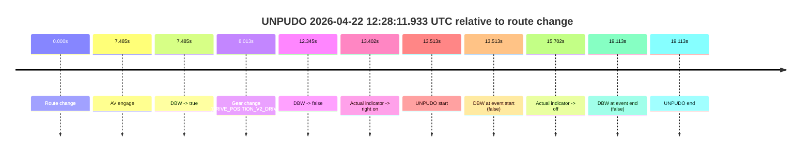
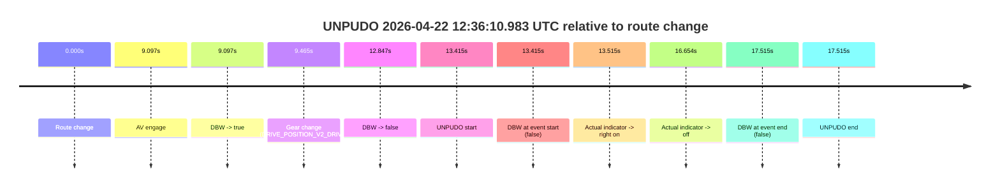

# Run Report: fme20018/2026-04-22--11-49-25--gen2-av-3941ddaf-bcdc-4027-8704-4a13f3321966

| Field | Value |
|---|---|
| Run ID | `fme20018/2026-04-22--11-49-25--gen2-av-3941ddaf-bcdc-4027-8704-4a13f3321966` |
| Date | `2026-04-22` |
| Model(s) | `pink-manta-ray-smooth` |
| Author | `guy.geva` |
| Event count | `3` |

## unpudo 2026-04-22 12:28:11.933 UTC

| Field | Value |
|---|---|
| Model | `pink-manta-ray-smooth` |
| Author | `guy.geva` |
| Run ID | `fme20018/2026-04-22--11-49-25--gen2-av-3941ddaf-bcdc-4027-8704-4a13f3321966` |
| Date | `2026-04-22` |
| Time (UTC) | `12:28:11.933` |
| Event type | `unpudo` |
| Disengagement type | `none observed` |
| Route change | `found` |
| Console | [run](https://console.sso.wayve.ai/run/fme20018/2026-04-22--11-49-25--gen2-av-3941ddaf-bcdc-4027-8704-4a13f3321966?id=&time-unixus=1776860891933302) |
| Foxglove | [segment](https://app.foxglove.dev/wayve-on-prem/p/prj_0dX18KZdVHg1fmmI/view?ds=foxglove-stream&ds.deviceName=fme20018&ds.start=2026-04-22T12%3A27%3A48.420156Z&ds.end=2026-04-22T12%3A28%3A27.533302Z&layoutId=lay_0e7VD4WIKDQGU73Y&time=2026-04-22T12%3A28%3A11.933302Z) |

### Event card: fail

- Fail: the credited unpudo does not stay AV-owned. The event window starts with DBW false, and the maneuver outcome lands outside a clean AV-owned segment.

| Event | Time (UTC) | Delta from route change |
|---|---:|---:|
| Route change | 2026-04-22 12:27:58.420 | `0.000s` |
| AV engage | 2026-04-22 12:28:05.904 | `7.485s` |
| DBW -> true | 2026-04-22 12:28:05.904 | `7.485s` |
| Gear change (DRIVE_POSITION_V2_DRIVE) | 2026-04-22 12:28:06.433 | `8.013s` |
| DBW -> false | 2026-04-22 12:28:10.765 | `12.345s` |
| Actual indicator -> right on | 2026-04-22 12:28:11.822 | `13.402s` |
| UNPUDO start | 2026-04-22 12:28:11.933 | `13.513s` |
| DBW at event start (false) | 2026-04-22 12:28:11.933 | `13.513s` |
| Actual indicator -> off | 2026-04-22 12:28:14.121 | `15.702s` |
| DBW at event end (false) | 2026-04-22 12:28:17.533 | `19.113s` |
| UNPUDO end | 2026-04-22 12:28:17.533 | `19.113s` |

| Metric | Value |
|---|---|
| Outcome | `fail` |
| Effective failure type | `not_av_owned` |
| Route change status | `found` |
| DBW at event start | `false` |
| DBW at event end | `false` |
| Predicted gear at AV start | `DRIVE_POSITION_V2_DRIVE` |
| Actual gear at AV start | `DRIVE_POSITION_V2_PARK` |
| Predicted gear at event start | `DRIVE_POSITION_V2_DRIVE` |
| Actual gear at event start | `DRIVE_POSITION_V2_DRIVE` |
| Planned indicator direction | `INDICATORS_STATE_V2_RIGHT_ON` |
| Controller indicator direction | `INDICATORS_STATE_V2_RIGHT_ON` |
| Actual indicator direction | `INDICATORS_STATE_V2_RIGHT_ON` |
| Actual indicator at maneuver end | `INDICATORS_STATE_V2_OFF` |
| Driver accel help in AV | `false` |
| Driver accel help timestamp | `n/a` |
| Max accel pedal pct in AV | `0.0%` |
| Max brake pedal pct in AV | `8.0%` |
| Max speed mps in AV | `0.000` |
| Success timing baseline | `route change` |
| Route -> AV | `7.485s` |
| AV -> event start | `6.028s` |
| AV -> first motion | `n/a` |
| Success baseline -> event start | `13.513s` |
| Success baseline -> first motion | `n/a` |
| AV duration before disengagement | `4.861s` |
| Trajectory waypoint count | `35` |
| Driving-plan step count | `11` |

The scored portion starts from the AV-owned window, not from the pre-AV setup. Route-change search in the stopped pre-event segment was `found`, with the baseline therefore set to route change. At the event anchor the model predicts `DRIVE_POSITION_V2_DRIVE` and the actual gear is `DRIVE_POSITION_V2_DRIVE`. The effective model outcome is `fail` because `not_av_owned.`

### Resolution

| Field | Value |
|---|---|
| Final outcome | `fail` |
| Do we agree with this label? | `yes` |
| Source disengagement type | `none observed` |
| Resolved effective failure type | `not_av_owned` |
| Confidence | `high` |

## unpudo 2026-04-22 12:32:35.283 UTC

| Field | Value |
|---|---|
| Model | `pink-manta-ray-smooth` |
| Author | `guy.geva` |
| Run ID | `fme20018/2026-04-22--11-49-25--gen2-av-3941ddaf-bcdc-4027-8704-4a13f3321966` |
| Date | `2026-04-22` |
| Time (UTC) | `12:32:35.283` |
| Event type | `unpudo` |
| Disengagement type | `none observed` |
| Route change | `found` |
| Console | [run](https://console.sso.wayve.ai/run/fme20018/2026-04-22--11-49-25--gen2-av-3941ddaf-bcdc-4027-8704-4a13f3321966?id=&time-unixus=1776861155283298) |
| Foxglove | [segment](https://app.foxglove.dev/wayve-on-prem/p/prj_0dX18KZdVHg1fmmI/view?ds=foxglove-stream&ds.deviceName=fme20018&ds.start=2026-04-22T12%3A32%3A16.218757Z&ds.end=2026-04-22T12%3A32%3A49.133299Z&layoutId=lay_0e7VD4WIKDQGU73Y&time=2026-04-22T12%3A32%3A35.283298Z) |

### Event card: fail

- Fail: the credited unpudo does not stay AV-owned. The event window starts with DBW false, and the maneuver outcome lands outside a clean AV-owned segment.

| Event | Time (UTC) | Delta from route change |
|---|---:|---:|
| Route change | 2026-04-22 12:32:26.218 | `0.000s` |
| AV engage | 2026-04-22 12:32:26.225 | `0.006s` |
| DBW -> true | 2026-04-22 12:32:26.225 | `0.006s` |
| Gear change (DRIVE_POSITION_V2_DRIVE) | 2026-04-22 12:32:29.733 | `3.515s` |
| DBW -> false | 2026-04-22 12:32:34.525 | `8.307s` |
| Actual indicator -> right on | 2026-04-22 12:32:34.942 | `8.724s` |
| UNPUDO start | 2026-04-22 12:32:35.283 | `9.065s` |
| DBW at event start (false) | 2026-04-22 12:32:35.283 | `9.065s` |
| Actual indicator -> off | 2026-04-22 12:32:37.702 | `11.483s` |
| DBW at event end (false) | 2026-04-22 12:32:39.133 | `12.915s` |
| UNPUDO end | 2026-04-22 12:32:39.133 | `12.915s` |

| Metric | Value |
|---|---|
| Outcome | `fail` |
| Effective failure type | `not_av_owned` |
| Route change status | `found` |
| DBW at event start | `false` |
| DBW at event end | `false` |
| Predicted gear at AV start | `DRIVE_POSITION_V2_PARK` |
| Actual gear at AV start | `DRIVE_POSITION_V2_PARK` |
| Predicted gear at event start | `DRIVE_POSITION_V2_DRIVE` |
| Actual gear at event start | `DRIVE_POSITION_V2_DRIVE` |
| Planned indicator direction | `INDICATORS_STATE_V2_LEFT_ON` |
| Controller indicator direction | `INDICATORS_STATE_V2_LEFT_ON` |
| Actual indicator direction | `INDICATORS_STATE_V2_RIGHT_ON` |
| Actual indicator at maneuver end | `INDICATORS_STATE_V2_OFF` |
| Driver accel help in AV | `false` |
| Driver accel help timestamp | `n/a` |
| Max accel pedal pct in AV | `0.0%` |
| Max brake pedal pct in AV | `9.9%` |
| Max speed mps in AV | `0.000` |
| Success timing baseline | `route change` |
| Route -> AV | `0.006s` |
| AV -> event start | `9.058s` |
| AV -> first motion | `n/a` |
| Success baseline -> event start | `9.065s` |
| Success baseline -> first motion | `n/a` |
| AV duration before disengagement | `8.301s` |
| Trajectory waypoint count | `36` |
| Driving-plan step count | `11` |

The scored portion starts from the AV-owned window, not from the pre-AV setup. Route-change search in the stopped pre-event segment was `found`, with the baseline therefore set to route change. At the event anchor the model predicts `DRIVE_POSITION_V2_DRIVE` and the actual gear is `DRIVE_POSITION_V2_DRIVE`. The effective model outcome is `fail` because `not_av_owned.`

### Resolution

| Field | Value |
|---|---|
| Final outcome | `fail` |
| Do we agree with this label? | `yes` |
| Source disengagement type | `none observed` |
| Resolved effective failure type | `not_av_owned` |
| Confidence | `high` |

## unpudo 2026-04-22 12:36:10.983 UTC

| Field | Value |
|---|---|
| Model | `pink-manta-ray-smooth` |
| Author | `guy.geva` |
| Run ID | `fme20018/2026-04-22--11-49-25--gen2-av-3941ddaf-bcdc-4027-8704-4a13f3321966` |
| Date | `2026-04-22` |
| Time (UTC) | `12:36:10.983` |
| Event type | `unpudo` |
| Disengagement type | `none observed` |
| Route change | `found` |
| Console | [run](https://console.sso.wayve.ai/run/fme20018/2026-04-22--11-49-25--gen2-av-3941ddaf-bcdc-4027-8704-4a13f3321966?id=&time-unixus=1776861370983304) |
| Foxglove | [segment](https://app.foxglove.dev/wayve-on-prem/p/prj_0dX18KZdVHg1fmmI/view?ds=foxglove-stream&ds.deviceName=fme20018&ds.start=2026-04-22T12%3A35%3A47.568362Z&ds.end=2026-04-22T12%3A36%3A25.083313Z&layoutId=lay_0e7VD4WIKDQGU73Y&time=2026-04-22T12%3A36%3A10.983304Z) |

### Event card: fail

- Fail: the credited unpudo does not stay AV-owned. The event window starts with DBW false, and the maneuver outcome lands outside a clean AV-owned segment.

| Event | Time (UTC) | Delta from route change |
|---|---:|---:|
| Route change | 2026-04-22 12:35:57.568 | `0.000s` |
| AV engage | 2026-04-22 12:36:06.664 | `9.097s` |
| DBW -> true | 2026-04-22 12:36:06.664 | `9.097s` |
| Gear change (DRIVE_POSITION_V2_DRIVE) | 2026-04-22 12:36:07.033 | `9.465s` |
| DBW -> false | 2026-04-22 12:36:10.415 | `12.847s` |
| UNPUDO start | 2026-04-22 12:36:10.983 | `13.415s` |
| DBW at event start (false) | 2026-04-22 12:36:10.983 | `13.415s` |
| Actual indicator -> right on | 2026-04-22 12:36:11.082 | `13.515s` |
| Actual indicator -> off | 2026-04-22 12:36:14.222 | `16.654s` |
| DBW at event end (false) | 2026-04-22 12:36:15.083 | `17.515s` |
| UNPUDO end | 2026-04-22 12:36:15.083 | `17.515s` |

| Metric | Value |
|---|---|
| Outcome | `fail` |
| Effective failure type | `not_av_owned` |
| Route change status | `found` |
| DBW at event start | `false` |
| DBW at event end | `false` |
| Predicted gear at AV start | `DRIVE_POSITION_V2_DRIVE` |
| Actual gear at AV start | `DRIVE_POSITION_V2_PARK` |
| Predicted gear at event start | `DRIVE_POSITION_V2_DRIVE` |
| Actual gear at event start | `DRIVE_POSITION_V2_DRIVE` |
| Planned indicator direction | `INDICATORS_STATE_V2_LEFT_ON` |
| Controller indicator direction | `INDICATORS_STATE_V2_LEFT_ON` |
| Actual indicator direction | `INDICATORS_STATE_V2_OFF` |
| Actual indicator at maneuver end | `INDICATORS_STATE_V2_OFF` |
| Driver accel help in AV | `false` |
| Driver accel help timestamp | `n/a` |
| Max accel pedal pct in AV | `0.0%` |
| Max brake pedal pct in AV | `8.0%` |
| Max speed mps in AV | `0.000` |
| Success timing baseline | `route change` |
| Route -> AV | `9.097s` |
| AV -> event start | `4.318s` |
| AV -> first motion | `n/a` |
| Success baseline -> event start | `13.415s` |
| Success baseline -> first motion | `n/a` |
| AV duration before disengagement | `3.751s` |
| Trajectory waypoint count | `36` |
| Driving-plan step count | `11` |

The scored portion starts from the AV-owned window, not from the pre-AV setup. Route-change search in the stopped pre-event segment was `found`, with the baseline therefore set to route change. At the event anchor the model predicts `DRIVE_POSITION_V2_DRIVE` and the actual gear is `DRIVE_POSITION_V2_DRIVE`. The effective model outcome is `fail` because `not_av_owned.`

### Resolution

| Field | Value |
|---|---|
| Final outcome | `fail` |
| Do we agree with this label? | `yes` |
| Source disengagement type | `none observed` |
| Resolved effective failure type | `not_av_owned` |
| Confidence | `high` |
