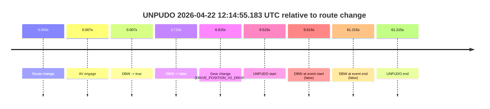
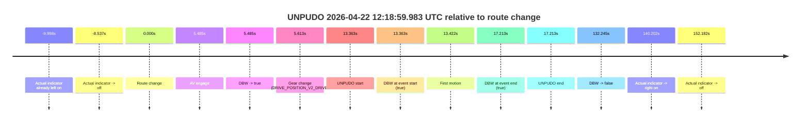
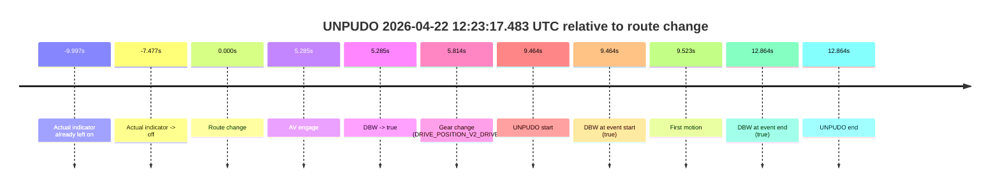

# Run Report: fme20018/2026-04-22--11-49-25--gen2-av-3941ddaf-bcdc-4027-8704-4a13f3321966

| Field | Value |
|---|---|
| Run ID | `fme20018/2026-04-22--11-49-25--gen2-av-3941ddaf-bcdc-4027-8704-4a13f3321966` |
| Date | `2026-04-22` |
| Model(s) | `eel-teal-outspoken` |
| Author | `zak` |
| Event count | `3` |

## unpudo 2026-04-22 12:14:55.183 UTC

| Field | Value |
|---|---|
| Model | `eel-teal-outspoken` |
| Author | `zak` |
| Run ID | `fme20018/2026-04-22--11-49-25--gen2-av-3941ddaf-bcdc-4027-8704-4a13f3321966` |
| Date | `2026-04-22` |
| Time (UTC) | `12:14:55.183` |
| Event type | `unpudo` |
| Disengagement type | `none observed` |
| Route change | `found` |
| Console | [run](https://console.sso.wayve.ai/run/fme20018/2026-04-22--11-49-25--gen2-av-3941ddaf-bcdc-4027-8704-4a13f3321966?id=&time-unixus=1776860095183305) |
| Foxglove | [segment](https://app.foxglove.dev/wayve-on-prem/p/prj_0dX18KZdVHg1fmmI/view?ds=foxglove-stream&ds.deviceName=fme20018&ds.start=2026-04-22T12%3A14%3A35.668351Z&ds.end=2026-04-22T12%3A15%3A56.883298Z&layoutId=lay_0e7VD4WIKDQGU73Y&time=2026-04-22T12%3A14%3A55.183305Z) |

### Event card: fail

- Fail: the credited unpudo does not stay AV-owned. The event window starts with DBW false, and the maneuver outcome lands outside a clean AV-owned segment.

| Event | Time (UTC) | Delta from route change |
|---|---:|---:|
| Route change | 2026-04-22 12:14:45.668 | `0.000s` |
| AV engage | 2026-04-22 12:14:45.674 | `0.007s` |
| DBW -> true | 2026-04-22 12:14:45.674 | `0.007s` |
| DBW -> false | 2026-04-22 12:14:49.385 | `3.718s` |
| Gear change (DRIVE_POSITION_V2_DRIVE) | 2026-04-22 12:14:52.583 | `6.915s` |
| UNPUDO start | 2026-04-22 12:14:55.183 | `9.515s` |
| DBW at event start (false) | 2026-04-22 12:14:55.183 | `9.515s` |
| DBW at event end (false) | 2026-04-22 12:15:46.883 | `61.215s` |
| UNPUDO end | 2026-04-22 12:15:46.883 | `61.215s` |

| Metric | Value |
|---|---|
| Outcome | `fail` |
| Effective failure type | `not_av_owned` |
| Route change status | `found` |
| DBW at event start | `false` |
| DBW at event end | `false` |
| Predicted gear at AV start | `DRIVE_POSITION_V2_PARK` |
| Actual gear at AV start | `DRIVE_POSITION_V2_PARK` |
| Predicted gear at event start | `DRIVE_POSITION_V2_DRIVE` |
| Actual gear at event start | `DRIVE_POSITION_V2_DRIVE` |
| Planned indicator direction | `INDICATORS_STATE_V2_OFF` |
| Controller indicator direction | `INDICATORS_STATE_V2_OFF` |
| Actual indicator direction | `INDICATORS_STATE_V2_OFF` |
| Actual indicator at maneuver end | `INDICATORS_STATE_V2_OFF` |
| Driver accel help in AV | `false` |
| Driver accel help timestamp | `n/a` |
| Max accel pedal pct in AV | `0.0%` |
| Max brake pedal pct in AV | `12.8%` |
| Max speed mps in AV | `0.000` |
| Success timing baseline | `route change` |
| Route -> AV | `0.007s` |
| AV -> event start | `9.508s` |
| AV -> first motion | `n/a` |
| Success baseline -> event start | `9.515s` |
| Success baseline -> first motion | `n/a` |
| AV duration before disengagement | `3.711s` |
| Trajectory waypoint count | `36` |
| Driving-plan step count | `11` |

The scored portion starts from the AV-owned window, not from the pre-AV setup. Route-change search in the stopped pre-event segment was `found`, with the baseline therefore set to route change. At the event anchor the model predicts `DRIVE_POSITION_V2_DRIVE` and the actual gear is `DRIVE_POSITION_V2_DRIVE`. The effective model outcome is `fail` because `not_av_owned.`

### Resolution

| Field | Value |
|---|---|
| Final outcome | `fail` |
| Do we agree with this label? | `yes` |
| Source disengagement type | `none observed` |
| Resolved effective failure type | `not_av_owned` |
| Confidence | `high` |

## unpudo 2026-04-22 12:18:59.983 UTC

| Field | Value |
|---|---|
| Model | `eel-teal-outspoken` |
| Author | `zak` |
| Run ID | `fme20018/2026-04-22--11-49-25--gen2-av-3941ddaf-bcdc-4027-8704-4a13f3321966` |
| Date | `2026-04-22` |
| Time (UTC) | `12:18:59.983` |
| Event type | `unpudo` |
| Disengagement type | `none observed` |
| Route change | `found` |
| Console | [run](https://console.sso.wayve.ai/run/fme20018/2026-04-22--11-49-25--gen2-av-3941ddaf-bcdc-4027-8704-4a13f3321966?id=&time-unixus=1776860339983298) |
| Foxglove | [segment](https://app.foxglove.dev/wayve-on-prem/p/prj_0dX18KZdVHg1fmmI/view?ds=foxglove-stream&ds.deviceName=fme20018&ds.start=2026-04-22T12%3A18%3A36.619981Z&ds.end=2026-04-22T12%3A21%3A08.864719Z&layoutId=lay_0e7VD4WIKDQGU73Y&time=2026-04-22T12%3A18%3A59.983298Z) |

### Event card: pass

- Pass: AV owns the credited unpudo from route change through the official unpudo window, the gear state is aligned at the anchor, and the vehicle moves without driver accelerator help in AV.

| Event | Time (UTC) | Delta from route change |
|---|---:|---:|
| Actual indicator already left on | 2026-04-22 12:18:36.622 | `-9.998s` |
| Actual indicator -> off | 2026-04-22 12:18:38.082 | `-8.537s` |
| Route change | 2026-04-22 12:18:46.619 | `0.000s` |
| AV engage | 2026-04-22 12:18:52.104 | `5.485s` |
| DBW -> true | 2026-04-22 12:18:52.104 | `5.485s` |
| Gear change (DRIVE_POSITION_V2_DRIVE) | 2026-04-22 12:18:52.233 | `5.613s` |
| UNPUDO start | 2026-04-22 12:18:59.983 | `13.363s` |
| DBW at event start (true) | 2026-04-22 12:18:59.983 | `13.363s` |
| First motion | 2026-04-22 12:19:00.042 | `13.422s` |
| DBW at event end (true) | 2026-04-22 12:19:03.833 | `17.213s` |
| UNPUDO end | 2026-04-22 12:19:03.833 | `17.213s` |
| DBW -> false | 2026-04-22 12:20:58.864 | `132.245s` |
| Actual indicator -> right on | 2026-04-22 12:21:06.822 | `140.202s` |
| Actual indicator -> off | 2026-04-22 12:21:18.802 | `152.182s` |

| Metric | Value |
|---|---|
| Outcome | `pass` |
| Effective failure type | `none` |
| Route change status | `found` |
| DBW at event start | `true` |
| DBW at event end | `true` |
| Predicted gear at AV start | `DRIVE_POSITION_V2_DRIVE` |
| Actual gear at AV start | `DRIVE_POSITION_V2_PARK` |
| Predicted gear at event start | `DRIVE_POSITION_V2_DRIVE` |
| Actual gear at event start | `DRIVE_POSITION_V2_DRIVE` |
| Planned indicator direction | `INDICATORS_STATE_V2_RIGHT_ON` |
| Controller indicator direction | `INDICATORS_STATE_V2_RIGHT_ON` |
| Actual indicator direction | `INDICATORS_STATE_V2_OFF` |
| Actual indicator at maneuver end | `INDICATORS_STATE_V2_OFF` |
| Driver accel help in AV | `false` |
| Driver accel help timestamp | `n/a` |
| Max accel pedal pct in AV | `0.0%` |
| Max brake pedal pct in AV | `9.3%` |
| Max speed mps in AV | `4.372` |
| Success timing baseline | `route change` |
| Route -> AV | `5.485s` |
| AV -> event start | `7.878s` |
| AV -> first motion | `7.937s` |
| Success baseline -> event start | `13.363s` |
| Success baseline -> first motion | `13.422s` |
| AV duration before disengagement | `126.760s` |
| Trajectory waypoint count | `36` |
| Driving-plan step count | `11` |

The scored portion starts from the AV-owned window, not from the pre-AV setup. Route-change search in the stopped pre-event segment was `found`, with the baseline therefore set to route change. At the event anchor the model predicts `DRIVE_POSITION_V2_DRIVE` and the actual gear is `DRIVE_POSITION_V2_DRIVE`. The effective model outcome is `pass` because `the credited unpudo stays AV-owned through the official unpudo window.`

### Resolution

| Field | Value |
|---|---|
| Final outcome | `pass` |
| Do we agree with this label? | `yes` |
| Source disengagement type | `none observed` |
| Resolved effective failure type | `none` |
| Confidence | `high` |

## unpudo 2026-04-22 12:23:17.483 UTC

| Field | Value |
|---|---|
| Model | `eel-teal-outspoken` |
| Author | `zak` |
| Run ID | `fme20018/2026-04-22--11-49-25--gen2-av-3941ddaf-bcdc-4027-8704-4a13f3321966` |
| Date | `2026-04-22` |
| Time (UTC) | `12:23:17.483` |
| Event type | `unpudo` |
| Disengagement type | `none observed` |
| Route change | `found` |
| Console | [run](https://console.sso.wayve.ai/run/fme20018/2026-04-22--11-49-25--gen2-av-3941ddaf-bcdc-4027-8704-4a13f3321966?id=&time-unixus=1776860597483302) |
| Foxglove | [segment](https://app.foxglove.dev/wayve-on-prem/p/prj_0dX18KZdVHg1fmmI/view?ds=foxglove-stream&ds.deviceName=fme20018&ds.start=2026-04-22T12%3A22%3A58.019493Z&ds.end=2026-04-22T12%3A23%3A30.883300Z&layoutId=lay_0e7VD4WIKDQGU73Y&time=2026-04-22T12%3A23%3A17.483302Z) |

### Event card: pass

- Pass: AV owns the credited unpudo from route change through the official unpudo window, the gear state is aligned at the anchor, and the vehicle moves without driver accelerator help in AV.

| Event | Time (UTC) | Delta from route change |
|---|---:|---:|
| Actual indicator already left on | 2026-04-22 12:22:58.021 | `-9.997s` |
| Actual indicator -> off | 2026-04-22 12:23:00.542 | `-7.477s` |
| Route change | 2026-04-22 12:23:08.019 | `0.000s` |
| AV engage | 2026-04-22 12:23:13.304 | `5.285s` |
| DBW -> true | 2026-04-22 12:23:13.304 | `5.285s` |
| Gear change (DRIVE_POSITION_V2_DRIVE) | 2026-04-22 12:23:13.833 | `5.814s` |
| UNPUDO start | 2026-04-22 12:23:17.483 | `9.464s` |
| DBW at event start (true) | 2026-04-22 12:23:17.483 | `9.464s` |
| First motion | 2026-04-22 12:23:17.542 | `9.523s` |
| DBW at event end (true) | 2026-04-22 12:23:20.883 | `12.864s` |
| UNPUDO end | 2026-04-22 12:23:20.883 | `12.864s` |

| Metric | Value |
|---|---|
| Outcome | `pass` |
| Effective failure type | `none` |
| Route change status | `found` |
| DBW at event start | `true` |
| DBW at event end | `true` |
| Predicted gear at AV start | `DRIVE_POSITION_V2_DRIVE` |
| Actual gear at AV start | `DRIVE_POSITION_V2_PARK` |
| Predicted gear at event start | `DRIVE_POSITION_V2_DRIVE` |
| Actual gear at event start | `DRIVE_POSITION_V2_DRIVE` |
| Planned indicator direction | `INDICATORS_STATE_V2_RIGHT_ON` |
| Controller indicator direction | `INDICATORS_STATE_V2_RIGHT_ON` |
| Actual indicator direction | `INDICATORS_STATE_V2_OFF` |
| Actual indicator at maneuver end | `INDICATORS_STATE_V2_OFF` |
| Driver accel help in AV | `false` |
| Driver accel help timestamp | `n/a` |
| Max accel pedal pct in AV | `0.0%` |
| Max brake pedal pct in AV | `11.5%` |
| Max speed mps in AV | `4.536` |
| Success timing baseline | `route change` |
| Route -> AV | `5.285s` |
| AV -> event start | `4.178s` |
| AV -> first motion | `4.237s` |
| Success baseline -> event start | `9.464s` |
| Success baseline -> first motion | `9.523s` |
| AV duration before disengagement | `n/a` |
| Trajectory waypoint count | `36` |
| Driving-plan step count | `11` |

The scored portion starts from the AV-owned window, not from the pre-AV setup. Route-change search in the stopped pre-event segment was `found`, with the baseline therefore set to route change. At the event anchor the model predicts `DRIVE_POSITION_V2_DRIVE` and the actual gear is `DRIVE_POSITION_V2_DRIVE`. The effective model outcome is `pass` because `the credited unpudo stays AV-owned through the official unpudo window.`

### Resolution

| Field | Value |
|---|---|
| Final outcome | `pass` |
| Do we agree with this label? | `yes` |
| Source disengagement type | `none observed` |
| Resolved effective failure type | `none` |
| Confidence | `high` |
