# Run Report: fme20030/2026-04-20--08-20-46--gen2-av-6be4d2dd-195b-4e2e-a1bc-ce10ad0880ea

| Field | Value |
|---|---|
| Run ID | `fme20030/2026-04-20--08-20-46--gen2-av-6be4d2dd-195b-4e2e-a1bc-ce10ad0880ea` |
| Date | `2026-04-20` |
| Model(s) | `eel-teal-outspoken` |
| Author | `zak` |
| Event count | `13` |

## unpudo 2026-04-20 08:32:08.983 UTC

| Field | Value |
|---|---|
| Model | `eel-teal-outspoken` |
| Author | `zak` |
| Run ID | `fme20030/2026-04-20--08-20-46--gen2-av-6be4d2dd-195b-4e2e-a1bc-ce10ad0880ea` |
| Date | `2026-04-20` |
| Time (UTC) | `08:32:08.983` |
| Event type | `unpudo` |
| Disengagement type | `none observed` |
| Route change | `found` |
| Console | [run](https://console.sso.wayve.ai/run/fme20030/2026-04-20--08-20-46--gen2-av-6be4d2dd-195b-4e2e-a1bc-ce10ad0880ea?id=&time-unixus=1776673928983295) |
| Foxglove | [segment](https://app.foxglove.dev/wayve-on-prem/p/prj_0dX18KZdVHg1fmmI/view?ds=foxglove-stream&ds.deviceName=fme20030&ds.start=2026-04-20T08%3A31%3A55.168356Z&ds.end=2026-04-20T08%3A32%3A21.553095Z&layoutId=lay_0e7VD4WIKDQGU73Y&time=2026-04-20T08%3A32%3A08.983295Z) |

### Event card: fail

- Fail: this is a short AV stint rather than a durable model-owned maneuver. The vehicle never settles into a long enough AV-owned attempt to credit the model.

| Event | Time (UTC) | Delta from route change |
|---|---:|---:|
| Route change | 2026-04-20 08:32:05.168 | `0.000s` |
| AV engage | 2026-04-20 08:32:05.173 | `0.005s` |
| DBW -> true | 2026-04-20 08:32:05.173 | `0.005s` |
| Gear change (DRIVE_POSITION_V2_DRIVE) | 2026-04-20 08:32:05.383 | `0.215s` |
| UNPUDO start | 2026-04-20 08:32:08.983 | `3.815s` |
| DBW at event start (true) | 2026-04-20 08:32:08.983 | `3.815s` |
| DBW at event end (true) | 2026-04-20 08:32:08.983 | `3.815s` |
| UNPUDO end | 2026-04-20 08:32:08.983 | `3.815s` |
| DBW -> false | 2026-04-20 08:32:11.553 | `6.385s` |
| Actual indicator -> right on | 2026-04-20 08:32:12.962 | `7.794s` |
| Actual indicator -> off | 2026-04-20 08:32:21.942 | `16.774s` |
| Actual indicator -> right on | 2026-04-20 08:32:27.902 | `22.734s` |

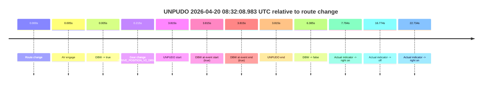

| Metric | Value |
|---|---|
| Outcome | `fail` |
| Effective failure type | `interrupted_handover` |
| Route change status | `found` |
| DBW at event start | `true` |
| DBW at event end | `true` |
| Predicted gear at AV start | `DRIVE_POSITION_V2_PARK` |
| Actual gear at AV start | `DRIVE_POSITION_V2_PARK` |
| Predicted gear at event start | `DRIVE_POSITION_V2_DRIVE` |
| Actual gear at event start | `DRIVE_POSITION_V2_DRIVE` |
| Planned indicator direction | `INDICATORS_STATE_V2_RIGHT_ON` |
| Controller indicator direction | `INDICATORS_STATE_V2_RIGHT_ON` |
| Actual indicator direction | `INDICATORS_STATE_V2_OFF` |
| Actual indicator at maneuver end | `INDICATORS_STATE_V2_OFF` |
| Driver accel help in AV | `false` |
| Driver accel help timestamp | `n/a` |
| Max accel pedal pct in AV | `0.0%` |
| Max brake pedal pct in AV | `9.6%` |
| Max speed mps in AV | `0.000` |
| Success timing baseline | `route change` |
| Route -> AV | `0.005s` |
| AV -> event start | `3.810s` |
| AV -> first motion | `n/a` |
| Success baseline -> event start | `3.815s` |
| Success baseline -> first motion | `n/a` |
| AV duration before disengagement | `6.379s` |
| Trajectory waypoint count | `37` |
| Driving-plan step count | `11` |

The scored portion starts from the AV-owned window, not from the pre-AV setup. Route-change search in the stopped pre-event segment was `found`, with the baseline therefore set to route change. At the event anchor the model predicts `DRIVE_POSITION_V2_DRIVE` and the actual gear is `DRIVE_POSITION_V2_DRIVE`. The effective model outcome is `fail` because `interrupted_handover.`

### Resolution

| Field | Value |
|---|---|
| Final outcome | `fail` |
| Do we agree with this label? | `yes` |
| Source disengagement type | `none observed` |
| Resolved effective failure type | `interrupted_handover` |
| Confidence | `high` |

## unpudo 2026-04-20 08:32:25.333 UTC

| Field | Value |
|---|---|
| Model | `eel-teal-outspoken` |
| Author | `zak` |
| Run ID | `fme20030/2026-04-20--08-20-46--gen2-av-6be4d2dd-195b-4e2e-a1bc-ce10ad0880ea` |
| Date | `2026-04-20` |
| Time (UTC) | `08:32:25.333` |
| Event type | `unpudo` |
| Disengagement type | `none observed` |
| Route change | `found` |
| Console | [run](https://console.sso.wayve.ai/run/fme20030/2026-04-20--08-20-46--gen2-av-6be4d2dd-195b-4e2e-a1bc-ce10ad0880ea?id=&time-unixus=1776673945333313) |
| Foxglove | [segment](https://app.foxglove.dev/wayve-on-prem/p/prj_0dX18KZdVHg1fmmI/view?ds=foxglove-stream&ds.deviceName=fme20030&ds.start=2026-04-20T08%3A31%3A55.168356Z&ds.end=2026-04-20T08%3A32%3A57.533291Z&layoutId=lay_0e7VD4WIKDQGU73Y&time=2026-04-20T08%3A32%3A25.333313Z) |

### Event card: fail

- Fail: the credited unpudo does not stay AV-owned. The event window starts with DBW false, and the maneuver outcome lands outside a clean AV-owned segment.

| Event | Time (UTC) | Delta from route change |
|---|---:|---:|
| Route change | 2026-04-20 08:32:05.168 | `0.000s` |
| AV engage | 2026-04-20 08:32:05.173 | `0.005s` |
| DBW -> true | 2026-04-20 08:32:05.173 | `0.005s` |
| First motion | 2026-04-20 08:32:09.002 | `3.834s` |
| DBW -> false | 2026-04-20 08:32:11.553 | `6.385s` |
| Actual indicator -> right on | 2026-04-20 08:32:12.962 | `7.794s` |
| Gear change (DRIVE_POSITION_V2_REVERSE) | 2026-04-20 08:32:20.483 | `15.315s` |
| Actual indicator -> off | 2026-04-20 08:32:21.942 | `16.774s` |
| UNPUDO start | 2026-04-20 08:32:25.333 | `20.165s` |
| DBW at event start (false) | 2026-04-20 08:32:25.333 | `20.165s` |
| Actual indicator -> right on | 2026-04-20 08:32:27.902 | `22.734s` |
| Actual indicator -> off | 2026-04-20 08:32:35.362 | `30.194s` |
| DBW at event end (false) | 2026-04-20 08:32:47.533 | `42.365s` |
| UNPUDO end | 2026-04-20 08:32:47.533 | `42.365s` |
| Actual indicator -> right on | 2026-04-20 08:32:52.242 | `47.074s` |
| Actual indicator -> off | 2026-04-20 08:32:54.142 | `48.975s` |

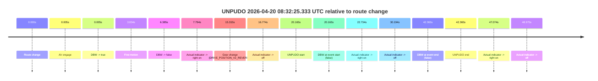

| Metric | Value |
|---|---|
| Outcome | `fail` |
| Effective failure type | `not_av_owned` |
| Route change status | `found` |
| DBW at event start | `false` |
| DBW at event end | `false` |
| Predicted gear at AV start | `DRIVE_POSITION_V2_PARK` |
| Actual gear at AV start | `DRIVE_POSITION_V2_PARK` |
| Predicted gear at event start | `DRIVE_POSITION_V2_REVERSE` |
| Actual gear at event start | `DRIVE_POSITION_V2_REVERSE` |
| Planned indicator direction | `INDICATORS_STATE_V2_OFF` |
| Controller indicator direction | `INDICATORS_STATE_V2_OFF` |
| Actual indicator direction | `INDICATORS_STATE_V2_OFF` |
| Actual indicator at maneuver end | `INDICATORS_STATE_V2_OFF` |
| Driver accel help in AV | `false` |
| Driver accel help timestamp | `n/a` |
| Max accel pedal pct in AV | `0.0%` |
| Max brake pedal pct in AV | `9.6%` |
| Max speed mps in AV | `2.581` |
| Success timing baseline | `route change` |
| Route -> AV | `0.005s` |
| AV -> event start | `20.160s` |
| AV -> first motion | `3.828s` |
| Success baseline -> event start | `20.165s` |
| Success baseline -> first motion | `3.834s` |
| AV duration before disengagement | `6.379s` |
| Trajectory waypoint count | `38` |
| Driving-plan step count | `11` |

The scored portion starts from the AV-owned window, not from the pre-AV setup. Route-change search in the stopped pre-event segment was `found`, with the baseline therefore set to route change. At the event anchor the model predicts `DRIVE_POSITION_V2_REVERSE` and the actual gear is `DRIVE_POSITION_V2_REVERSE`. The effective model outcome is `fail` because `not_av_owned.`

### Resolution

| Field | Value |
|---|---|
| Final outcome | `fail` |
| Do we agree with this label? | `yes` |
| Source disengagement type | `none observed` |
| Resolved effective failure type | `not_av_owned` |
| Confidence | `high` |

## unpudo 2026-04-20 08:36:30.583 UTC

| Field | Value |
|---|---|
| Model | `eel-teal-outspoken` |
| Author | `zak` |
| Run ID | `fme20030/2026-04-20--08-20-46--gen2-av-6be4d2dd-195b-4e2e-a1bc-ce10ad0880ea` |
| Date | `2026-04-20` |
| Time (UTC) | `08:36:30.583` |
| Event type | `unpudo` |
| Disengagement type | `none observed` |
| Route change | `found` |
| Console | [run](https://console.sso.wayve.ai/run/fme20030/2026-04-20--08-20-46--gen2-av-6be4d2dd-195b-4e2e-a1bc-ce10ad0880ea?id=&time-unixus=1776674190583308) |
| Foxglove | [segment](https://app.foxglove.dev/wayve-on-prem/p/prj_0dX18KZdVHg1fmmI/view?ds=foxglove-stream&ds.deviceName=fme20030&ds.start=2026-04-20T08%3A34%3A28.718542Z&ds.end=2026-04-20T08%3A38%3A31.452989Z&layoutId=lay_0e7VD4WIKDQGU73Y&time=2026-04-20T08%3A36%3A30.583308Z) |

### Event card: pass

- Pass: AV owns the credited unpudo from route change through the official unpudo window, the gear state is aligned at the anchor, and the vehicle moves without driver accelerator help in AV.

| Event | Time (UTC) | Delta from route change |
|---|---:|---:|
| Route change | 2026-04-20 08:34:38.718 | `0.000s` |
| AV engage | 2026-04-20 08:34:38.723 | `0.005s` |
| DBW -> true | 2026-04-20 08:34:38.723 | `0.005s` |
| First motion | 2026-04-20 08:34:45.562 | `6.843s` |
| Gear change (DRIVE_POSITION_V2_DRIVE) | 2026-04-20 08:36:21.083 | `102.365s` |
| UNPUDO start | 2026-04-20 08:36:30.583 | `111.865s` |
| DBW at event start (true) | 2026-04-20 08:36:30.583 | `111.865s` |
| DBW at event end (true) | 2026-04-20 08:36:33.983 | `115.265s` |
| UNPUDO end | 2026-04-20 08:36:33.983 | `115.265s` |
| DBW -> false | 2026-04-20 08:38:21.452 | `222.734s` |

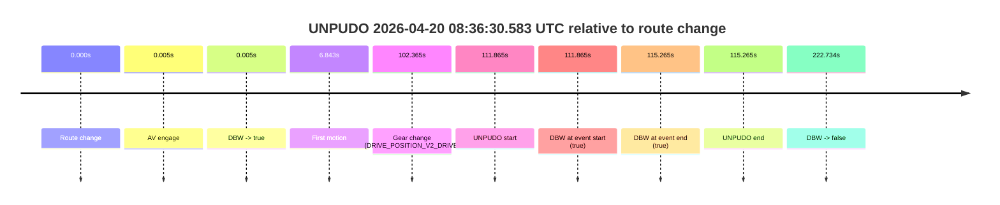

| Metric | Value |
|---|---|
| Outcome | `pass` |
| Effective failure type | `none` |
| Route change status | `found` |
| DBW at event start | `true` |
| DBW at event end | `true` |
| Predicted gear at AV start | `DRIVE_POSITION_V2_PARK` |
| Actual gear at AV start | `DRIVE_POSITION_V2_PARK` |
| Predicted gear at event start | `DRIVE_POSITION_V2_DRIVE` |
| Actual gear at event start | `DRIVE_POSITION_V2_DRIVE` |
| Planned indicator direction | `INDICATORS_STATE_V2_RIGHT_ON` |
| Controller indicator direction | `INDICATORS_STATE_V2_RIGHT_ON` |
| Actual indicator direction | `INDICATORS_STATE_V2_OFF` |
| Actual indicator at maneuver end | `INDICATORS_STATE_V2_OFF` |
| Driver accel help in AV | `false` |
| Driver accel help timestamp | `n/a` |
| Max accel pedal pct in AV | `0.0%` |
| Max brake pedal pct in AV | `18.5%` |
| Max speed mps in AV | `7.711` |
| Success timing baseline | `route change` |
| Route -> AV | `0.005s` |
| AV -> event start | `111.860s` |
| AV -> first motion | `6.839s` |
| Success baseline -> event start | `111.865s` |
| Success baseline -> first motion | `6.843s` |
| AV duration before disengagement | `222.730s` |
| Trajectory waypoint count | `37` |
| Driving-plan step count | `11` |

The scored portion starts from the AV-owned window, not from the pre-AV setup. Route-change search in the stopped pre-event segment was `found`, with the baseline therefore set to route change. At the event anchor the model predicts `DRIVE_POSITION_V2_DRIVE` and the actual gear is `DRIVE_POSITION_V2_DRIVE`. The effective model outcome is `pass` because `the credited unpudo stays AV-owned through the official unpudo window.`

### Resolution

| Field | Value |
|---|---|
| Final outcome | `pass` |
| Do we agree with this label? | `yes` |
| Source disengagement type | `none observed` |
| Resolved effective failure type | `none` |
| Confidence | `high` |

## unpudo 2026-04-20 08:46:54.283 UTC

| Field | Value |
|---|---|
| Model | `eel-teal-outspoken` |
| Author | `zak` |
| Run ID | `fme20030/2026-04-20--08-20-46--gen2-av-6be4d2dd-195b-4e2e-a1bc-ce10ad0880ea` |
| Date | `2026-04-20` |
| Time (UTC) | `08:46:54.283` |
| Event type | `unpudo` |
| Disengagement type | `none observed` |
| Route change | `found` |
| Console | [run](https://console.sso.wayve.ai/run/fme20030/2026-04-20--08-20-46--gen2-av-6be4d2dd-195b-4e2e-a1bc-ce10ad0880ea?id=&time-unixus=1776674814283292) |
| Foxglove | [segment](https://app.foxglove.dev/wayve-on-prem/p/prj_0dX18KZdVHg1fmmI/view?ds=foxglove-stream&ds.deviceName=fme20030&ds.start=2026-04-20T08%3A46%3A30.818270Z&ds.end=2026-04-20T08%3A50%3A11.592921Z&layoutId=lay_0e7VD4WIKDQGU73Y&time=2026-04-20T08%3A46%3A54.283292Z) |

### Event card: pass

- Pass: AV owns the credited unpudo from route change through the official unpudo window, the gear state is aligned at the anchor, and the vehicle moves without driver accelerator help in AV.

| Event | Time (UTC) | Delta from route change |
|---|---:|---:|
| Route change | 2026-04-20 08:46:40.818 | `0.000s` |
| AV engage | 2026-04-20 08:46:50.313 | `9.495s` |
| DBW -> true | 2026-04-20 08:46:50.313 | `9.495s` |
| Gear change (DRIVE_POSITION_V2_DRIVE) | 2026-04-20 08:46:50.783 | `9.965s` |
| UNPUDO start | 2026-04-20 08:46:54.283 | `13.465s` |
| DBW at event start (true) | 2026-04-20 08:46:54.283 | `13.465s` |
| First motion | 2026-04-20 08:46:54.342 | `13.524s` |
| DBW at event end (true) | 2026-04-20 08:46:57.683 | `16.865s` |
| UNPUDO end | 2026-04-20 08:46:57.683 | `16.865s` |
| DBW -> false | 2026-04-20 08:50:01.592 | `200.775s` |
| Actual indicator -> left on | 2026-04-20 08:50:08.101 | `207.284s` |
| Actual indicator -> off | 2026-04-20 08:50:11.942 | `211.124s` |

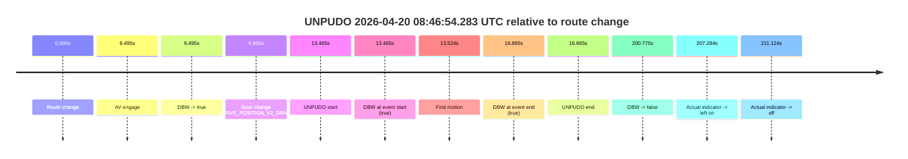

| Metric | Value |
|---|---|
| Outcome | `pass` |
| Effective failure type | `none` |
| Route change status | `found` |
| DBW at event start | `true` |
| DBW at event end | `true` |
| Predicted gear at AV start | `DRIVE_POSITION_V2_DRIVE` |
| Actual gear at AV start | `DRIVE_POSITION_V2_PARK` |
| Predicted gear at event start | `DRIVE_POSITION_V2_DRIVE` |
| Actual gear at event start | `DRIVE_POSITION_V2_DRIVE` |
| Planned indicator direction | `INDICATORS_STATE_V2_RIGHT_ON` |
| Controller indicator direction | `INDICATORS_STATE_V2_RIGHT_ON` |
| Actual indicator direction | `INDICATORS_STATE_V2_OFF` |
| Actual indicator at maneuver end | `INDICATORS_STATE_V2_OFF` |
| Driver accel help in AV | `false` |
| Driver accel help timestamp | `n/a` |
| Max accel pedal pct in AV | `0.0%` |
| Max brake pedal pct in AV | `8.0%` |
| Max speed mps in AV | `5.131` |
| Success timing baseline | `route change` |
| Route -> AV | `9.495s` |
| AV -> event start | `3.970s` |
| AV -> first motion | `4.029s` |
| Success baseline -> event start | `13.465s` |
| Success baseline -> first motion | `13.524s` |
| AV duration before disengagement | `191.280s` |
| Trajectory waypoint count | `37` |
| Driving-plan step count | `11` |

The scored portion starts from the AV-owned window, not from the pre-AV setup. Route-change search in the stopped pre-event segment was `found`, with the baseline therefore set to route change. At the event anchor the model predicts `DRIVE_POSITION_V2_DRIVE` and the actual gear is `DRIVE_POSITION_V2_DRIVE`. The effective model outcome is `pass` because `the credited unpudo stays AV-owned through the official unpudo window.`

### Resolution

| Field | Value |
|---|---|
| Final outcome | `pass` |
| Do we agree with this label? | `yes` |
| Source disengagement type | `none observed` |
| Resolved effective failure type | `none` |
| Confidence | `high` |

## unpudo 2026-04-20 08:50:34.933 UTC

| Field | Value |
|---|---|
| Model | `eel-teal-outspoken` |
| Author | `zak` |
| Run ID | `fme20030/2026-04-20--08-20-46--gen2-av-6be4d2dd-195b-4e2e-a1bc-ce10ad0880ea` |
| Date | `2026-04-20` |
| Time (UTC) | `08:50:34.933` |
| Event type | `unpudo` |
| Disengagement type | `none observed` |
| Route change | `found` |
| Console | [run](https://console.sso.wayve.ai/run/fme20030/2026-04-20--08-20-46--gen2-av-6be4d2dd-195b-4e2e-a1bc-ce10ad0880ea?id=&time-unixus=1776675034933295) |
| Foxglove | [segment](https://app.foxglove.dev/wayve-on-prem/p/prj_0dX18KZdVHg1fmmI/view?ds=foxglove-stream&ds.deviceName=fme20030&ds.start=2026-04-20T08%3A50%3A12.118222Z&ds.end=2026-04-20T08%3A51%3A39.674278Z&layoutId=lay_0e7VD4WIKDQGU73Y&time=2026-04-20T08%3A50%3A34.933295Z) |

### Event card: pass

- Pass: AV owns the credited unpudo from route change through the official unpudo window, the gear state is aligned at the anchor, and the vehicle moves without driver accelerator help in AV.

| Event | Time (UTC) | Delta from route change |
|---|---:|---:|
| Route change | 2026-04-20 08:50:22.118 | `0.000s` |
| AV engage | 2026-04-20 08:50:30.913 | `8.795s` |
| DBW -> true | 2026-04-20 08:50:30.913 | `8.795s` |
| Gear change (DRIVE_POSITION_V2_DRIVE) | 2026-04-20 08:50:31.383 | `9.265s` |
| UNPUDO start | 2026-04-20 08:50:34.933 | `12.815s` |
| DBW at event start (true) | 2026-04-20 08:50:34.933 | `12.815s` |
| First motion | 2026-04-20 08:50:34.982 | `12.864s` |
| DBW at event end (true) | 2026-04-20 08:50:38.333 | `16.215s` |
| UNPUDO end | 2026-04-20 08:50:38.333 | `16.215s` |
| DBW -> false | 2026-04-20 08:51:29.674 | `67.556s` |
| Actual indicator -> right on | 2026-04-20 08:51:30.561 | `68.444s` |
| Actual indicator -> off | 2026-04-20 08:51:33.281 | `71.164s` |

| Metric | Value |
|---|---|
| Outcome | `pass` |
| Effective failure type | `none` |
| Route change status | `found` |
| DBW at event start | `true` |
| DBW at event end | `true` |
| Predicted gear at AV start | `DRIVE_POSITION_V2_DRIVE` |
| Actual gear at AV start | `DRIVE_POSITION_V2_PARK` |
| Predicted gear at event start | `DRIVE_POSITION_V2_DRIVE` |
| Actual gear at event start | `DRIVE_POSITION_V2_DRIVE` |
| Planned indicator direction | `INDICATORS_STATE_V2_RIGHT_ON` |
| Controller indicator direction | `INDICATORS_STATE_V2_RIGHT_ON` |
| Actual indicator direction | `INDICATORS_STATE_V2_OFF` |
| Actual indicator at maneuver end | `INDICATORS_STATE_V2_OFF` |
| Driver accel help in AV | `false` |
| Driver accel help timestamp | `n/a` |
| Max accel pedal pct in AV | `0.0%` |
| Max brake pedal pct in AV | `8.7%` |
| Max speed mps in AV | `5.208` |
| Success timing baseline | `route change` |
| Route -> AV | `8.795s` |
| AV -> event start | `4.020s` |
| AV -> first motion | `4.069s` |
| Success baseline -> event start | `12.815s` |
| Success baseline -> first motion | `12.864s` |
| AV duration before disengagement | `58.761s` |
| Trajectory waypoint count | `38` |
| Driving-plan step count | `11` |

The scored portion starts from the AV-owned window, not from the pre-AV setup. Route-change search in the stopped pre-event segment was `found`, with the baseline therefore set to route change. At the event anchor the model predicts `DRIVE_POSITION_V2_DRIVE` and the actual gear is `DRIVE_POSITION_V2_DRIVE`. The effective model outcome is `pass` because `the credited unpudo stays AV-owned through the official unpudo window.`

### Resolution

| Field | Value |
|---|---|
| Final outcome | `pass` |
| Do we agree with this label? | `yes` |
| Source disengagement type | `none observed` |
| Resolved effective failure type | `none` |
| Confidence | `high` |

## unpudo 2026-04-20 08:51:28.983 UTC

| Field | Value |
|---|---|
| Model | `eel-teal-outspoken` |
| Author | `zak` |
| Run ID | `fme20030/2026-04-20--08-20-46--gen2-av-6be4d2dd-195b-4e2e-a1bc-ce10ad0880ea` |
| Date | `2026-04-20` |
| Time (UTC) | `08:51:28.983` |
| Event type | `unpudo` |
| Disengagement type | `none observed` |
| Route change | `found` |
| Console | [run](https://console.sso.wayve.ai/run/fme20030/2026-04-20--08-20-46--gen2-av-6be4d2dd-195b-4e2e-a1bc-ce10ad0880ea?id=&time-unixus=1776675088983302) |
| Foxglove | [segment](https://app.foxglove.dev/wayve-on-prem/p/prj_0dX18KZdVHg1fmmI/view?ds=foxglove-stream&ds.deviceName=fme20030&ds.start=2026-04-20T08%3A50%3A12.118222Z&ds.end=2026-04-20T08%3A51%3A43.783296Z&layoutId=lay_0e7VD4WIKDQGU73Y&time=2026-04-20T08%3A51%3A28.983302Z) |

### Event card: fail

- Fail: the credited unpudo does not stay AV-owned. The event window starts with DBW true, and the maneuver outcome lands outside a clean AV-owned segment.

| Event | Time (UTC) | Delta from route change |
|---|---:|---:|
| Route change | 2026-04-20 08:50:22.118 | `0.000s` |
| AV engage | 2026-04-20 08:50:30.913 | `8.795s` |
| DBW -> true | 2026-04-20 08:50:30.913 | `8.795s` |
| First motion | 2026-04-20 08:50:34.982 | `12.864s` |
| Gear change (DRIVE_POSITION_V2_DRIVE) | 2026-04-20 08:51:07.583 | `45.465s` |
| UNPUDO start | 2026-04-20 08:51:28.983 | `66.865s` |
| DBW at event start (true) | 2026-04-20 08:51:28.983 | `66.865s` |
| DBW -> false | 2026-04-20 08:51:29.674 | `67.556s` |
| Actual indicator -> right on | 2026-04-20 08:51:30.561 | `68.444s` |
| Actual indicator -> off | 2026-04-20 08:51:33.281 | `71.164s` |
| DBW at event end (false) | 2026-04-20 08:51:33.783 | `71.665s` |
| UNPUDO end | 2026-04-20 08:51:33.783 | `71.665s` |

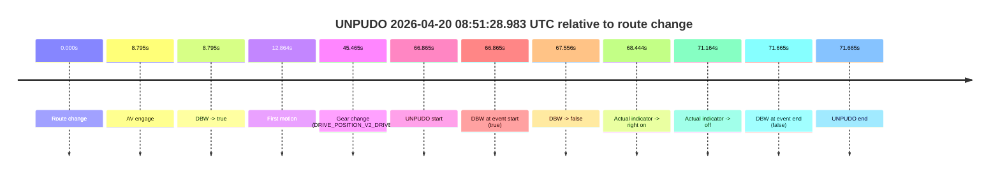

| Metric | Value |
|---|---|
| Outcome | `fail` |
| Effective failure type | `driver_completed_maneuver` |
| Route change status | `found` |
| DBW at event start | `true` |
| DBW at event end | `false` |
| Predicted gear at AV start | `DRIVE_POSITION_V2_DRIVE` |
| Actual gear at AV start | `DRIVE_POSITION_V2_PARK` |
| Predicted gear at event start | `DRIVE_POSITION_V2_DRIVE` |
| Actual gear at event start | `DRIVE_POSITION_V2_DRIVE` |
| Planned indicator direction | `INDICATORS_STATE_V2_RIGHT_ON` |
| Controller indicator direction | `INDICATORS_STATE_V2_RIGHT_ON` |
| Actual indicator direction | `INDICATORS_STATE_V2_OFF` |
| Actual indicator at maneuver end | `INDICATORS_STATE_V2_OFF` |
| Driver accel help in AV | `false` |
| Driver accel help timestamp | `n/a` |
| Max accel pedal pct in AV | `0.0%` |
| Max brake pedal pct in AV | `24.2%` |
| Max speed mps in AV | `6.531` |
| Success timing baseline | `route change` |
| Route -> AV | `8.795s` |
| AV -> event start | `58.070s` |
| AV -> first motion | `4.069s` |
| Success baseline -> event start | `66.865s` |
| Success baseline -> first motion | `12.864s` |
| AV duration before disengagement | `58.761s` |
| Trajectory waypoint count | `37` |
| Driving-plan step count | `11` |

The scored portion starts from the AV-owned window, not from the pre-AV setup. Route-change search in the stopped pre-event segment was `found`, with the baseline therefore set to route change. At the event anchor the model predicts `DRIVE_POSITION_V2_DRIVE` and the actual gear is `DRIVE_POSITION_V2_DRIVE`. The effective model outcome is `fail` because `driver_completed_maneuver.`

### Resolution

| Field | Value |
|---|---|
| Final outcome | `fail` |
| Do we agree with this label? | `yes` |
| Source disengagement type | `none observed` |
| Resolved effective failure type | `driver_completed_maneuver` |
| Confidence | `high` |

## unpudo 2026-04-20 08:55:00.383 UTC

| Field | Value |
|---|---|
| Model | `eel-teal-outspoken` |
| Author | `zak` |
| Run ID | `fme20030/2026-04-20--08-20-46--gen2-av-6be4d2dd-195b-4e2e-a1bc-ce10ad0880ea` |
| Date | `2026-04-20` |
| Time (UTC) | `08:55:00.383` |
| Event type | `unpudo` |
| Disengagement type | `none observed` |
| Route change | `found` |
| Console | [run](https://console.sso.wayve.ai/run/fme20030/2026-04-20--08-20-46--gen2-av-6be4d2dd-195b-4e2e-a1bc-ce10ad0880ea?id=&time-unixus=1776675300383319) |
| Foxglove | [segment](https://app.foxglove.dev/wayve-on-prem/p/prj_0dX18KZdVHg1fmmI/view?ds=foxglove-stream&ds.deviceName=fme20030&ds.start=2026-04-20T08%3A54%3A46.468241Z&ds.end=2026-04-20T08%3A56%3A55.192985Z&layoutId=lay_0e7VD4WIKDQGU73Y&time=2026-04-20T08%3A55%3A00.383319Z) |

### Event card: pass

- Pass: AV owns the credited unpudo from route change through the official unpudo window, the gear state is aligned at the anchor, and the vehicle moves without driver accelerator help in AV.

| Event | Time (UTC) | Delta from route change |
|---|---:|---:|
| Route change | 2026-04-20 08:54:56.468 | `0.000s` |
| AV engage | 2026-04-20 08:54:56.473 | `0.005s` |
| DBW -> true | 2026-04-20 08:54:56.473 | `0.005s` |
| Gear change (DRIVE_POSITION_V2_DRIVE) | 2026-04-20 08:54:56.783 | `0.315s` |
| UNPUDO start | 2026-04-20 08:55:00.383 | `3.915s` |
| DBW at event start (true) | 2026-04-20 08:55:00.383 | `3.915s` |
| First motion | 2026-04-20 08:55:00.422 | `3.954s` |
| DBW at event end (true) | 2026-04-20 08:55:03.783 | `7.315s` |
| UNPUDO end | 2026-04-20 08:55:03.783 | `7.315s` |
| DBW -> false | 2026-04-20 08:56:45.192 | `108.725s` |
| Actual indicator -> right on | 2026-04-20 08:56:45.941 | `109.474s` |
| Actual indicator -> off | 2026-04-20 08:56:50.742 | `114.274s` |

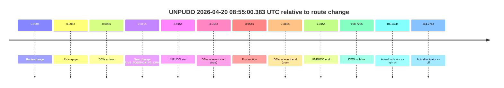

| Metric | Value |
|---|---|
| Outcome | `pass` |
| Effective failure type | `none` |
| Route change status | `found` |
| DBW at event start | `true` |
| DBW at event end | `true` |
| Predicted gear at AV start | `DRIVE_POSITION_V2_PARK` |
| Actual gear at AV start | `DRIVE_POSITION_V2_PARK` |
| Predicted gear at event start | `DRIVE_POSITION_V2_DRIVE` |
| Actual gear at event start | `DRIVE_POSITION_V2_DRIVE` |
| Planned indicator direction | `INDICATORS_STATE_V2_RIGHT_ON` |
| Controller indicator direction | `INDICATORS_STATE_V2_RIGHT_ON` |
| Actual indicator direction | `INDICATORS_STATE_V2_OFF` |
| Actual indicator at maneuver end | `INDICATORS_STATE_V2_OFF` |
| Driver accel help in AV | `false` |
| Driver accel help timestamp | `n/a` |
| Max accel pedal pct in AV | `0.0%` |
| Max brake pedal pct in AV | `8.0%` |
| Max speed mps in AV | `4.569` |
| Success timing baseline | `route change` |
| Route -> AV | `0.005s` |
| AV -> event start | `3.910s` |
| AV -> first motion | `3.949s` |
| Success baseline -> event start | `3.915s` |
| Success baseline -> first motion | `3.954s` |
| AV duration before disengagement | `108.720s` |
| Trajectory waypoint count | `37` |
| Driving-plan step count | `11` |

The scored portion starts from the AV-owned window, not from the pre-AV setup. Route-change search in the stopped pre-event segment was `found`, with the baseline therefore set to route change. At the event anchor the model predicts `DRIVE_POSITION_V2_DRIVE` and the actual gear is `DRIVE_POSITION_V2_DRIVE`. The effective model outcome is `pass` because `the credited unpudo stays AV-owned through the official unpudo window.`

### Resolution

| Field | Value |
|---|---|
| Final outcome | `pass` |
| Do we agree with this label? | `yes` |
| Source disengagement type | `none observed` |
| Resolved effective failure type | `none` |
| Confidence | `high` |

## unpudo 2026-04-20 09:07:16.183 UTC

| Field | Value |
|---|---|
| Model | `eel-teal-outspoken` |
| Author | `zak` |
| Run ID | `fme20030/2026-04-20--08-20-46--gen2-av-6be4d2dd-195b-4e2e-a1bc-ce10ad0880ea` |
| Date | `2026-04-20` |
| Time (UTC) | `09:07:16.183` |
| Event type | `unpudo` |
| Disengagement type | `none observed` |
| Route change | `found` |
| Console | [run](https://console.sso.wayve.ai/run/fme20030/2026-04-20--08-20-46--gen2-av-6be4d2dd-195b-4e2e-a1bc-ce10ad0880ea?id=&time-unixus=1776676036183312) |
| Foxglove | [segment](https://app.foxglove.dev/wayve-on-prem/p/prj_0dX18KZdVHg1fmmI/view?ds=foxglove-stream&ds.deviceName=fme20030&ds.start=2026-04-20T09%3A05%3A48.870025Z&ds.end=2026-04-20T09%3A07%3A26.183312Z&layoutId=lay_0e7VD4WIKDQGU73Y&time=2026-04-20T09%3A07%3A16.183312Z) |

### Event card: fail

- Fail: the credited unpudo does not stay AV-owned. The event window starts with DBW false, and the maneuver outcome lands outside a clean AV-owned segment.

| Event | Time (UTC) | Delta from route change |
|---|---:|---:|
| Route change | 2026-04-20 09:05:58.870 | `0.000s` |
| AV engage | 2026-04-20 09:05:58.873 | `0.003s` |
| DBW -> true | 2026-04-20 09:05:58.873 | `0.003s` |
| DBW -> false | 2026-04-20 09:06:17.335 | `18.465s` |
| Gear change (DRIVE_POSITION_V2_DRIVE) | 2026-04-20 09:07:11.083 | `72.213s` |
| UNPUDO start | 2026-04-20 09:07:16.183 | `77.313s` |
| DBW at event start (false) | 2026-04-20 09:07:16.183 | `77.313s` |
| DBW at event end (false) | 2026-04-20 09:07:16.183 | `77.313s` |
| UNPUDO end | 2026-04-20 09:07:16.183 | `77.313s` |
| Actual indicator -> right on | 2026-04-20 09:07:25.882 | `87.012s` |
| Actual indicator -> off | 2026-04-20 09:07:33.961 | `95.092s` |

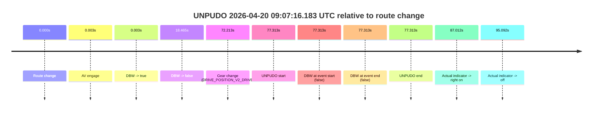

| Metric | Value |
|---|---|
| Outcome | `fail` |
| Effective failure type | `not_av_owned` |
| Route change status | `found` |
| DBW at event start | `false` |
| DBW at event end | `false` |
| Predicted gear at AV start | `DRIVE_POSITION_V2_PARK` |
| Actual gear at AV start | `DRIVE_POSITION_V2_PARK` |
| Predicted gear at event start | `DRIVE_POSITION_V2_DRIVE` |
| Actual gear at event start | `DRIVE_POSITION_V2_DRIVE` |
| Planned indicator direction | `INDICATORS_STATE_V2_LEFT_ON` |
| Controller indicator direction | `INDICATORS_STATE_V2_LEFT_ON` |
| Actual indicator direction | `INDICATORS_STATE_V2_OFF` |
| Actual indicator at maneuver end | `INDICATORS_STATE_V2_OFF` |
| Driver accel help in AV | `false` |
| Driver accel help timestamp | `n/a` |
| Max accel pedal pct in AV | `0.0%` |
| Max brake pedal pct in AV | `8.6%` |
| Max speed mps in AV | `0.000` |
| Success timing baseline | `route change` |
| Route -> AV | `0.003s` |
| AV -> event start | `77.310s` |
| AV -> first motion | `n/a` |
| Success baseline -> event start | `77.313s` |
| Success baseline -> first motion | `n/a` |
| AV duration before disengagement | `18.462s` |
| Trajectory waypoint count | `37` |
| Driving-plan step count | `11` |

The scored portion starts from the AV-owned window, not from the pre-AV setup. Route-change search in the stopped pre-event segment was `found`, with the baseline therefore set to route change. At the event anchor the model predicts `DRIVE_POSITION_V2_DRIVE` and the actual gear is `DRIVE_POSITION_V2_DRIVE`. The effective model outcome is `fail` because `not_av_owned.`

### Resolution

| Field | Value |
|---|---|
| Final outcome | `fail` |
| Do we agree with this label? | `yes` |
| Source disengagement type | `none observed` |
| Resolved effective failure type | `not_av_owned` |
| Confidence | `high` |

## unpudo 2026-04-20 09:38:07.833 UTC

| Field | Value |
|---|---|
| Model | `eel-teal-outspoken` |
| Author | `zak` |
| Run ID | `fme20030/2026-04-20--08-20-46--gen2-av-6be4d2dd-195b-4e2e-a1bc-ce10ad0880ea` |
| Date | `2026-04-20` |
| Time (UTC) | `09:38:07.833` |
| Event type | `unpudo` |
| Disengagement type | `none observed` |
| Route change | `found` |
| Console | [run](https://console.sso.wayve.ai/run/fme20030/2026-04-20--08-20-46--gen2-av-6be4d2dd-195b-4e2e-a1bc-ce10ad0880ea?id=&time-unixus=1776677887833314) |
| Foxglove | [segment](https://app.foxglove.dev/wayve-on-prem/p/prj_0dX18KZdVHg1fmmI/view?ds=foxglove-stream&ds.deviceName=fme20030&ds.start=2026-04-20T09%3A37%3A33.468234Z&ds.end=2026-04-20T09%3A38%3A30.383299Z&layoutId=lay_0e7VD4WIKDQGU73Y&time=2026-04-20T09%3A38%3A07.833314Z) |

### Event card: fail

- Fail: the credited unpudo does not stay AV-owned. The event window starts with DBW false, and the maneuver outcome lands outside a clean AV-owned segment.

| Event | Time (UTC) | Delta from route change |
|---|---:|---:|
| Route change | 2026-04-20 09:37:43.468 | `0.000s` |
| AV engage | 2026-04-20 09:37:43.473 | `0.005s` |
| DBW -> true | 2026-04-20 09:37:43.473 | `0.005s` |
| DBW -> false | 2026-04-20 09:37:56.773 | `13.306s` |
| Gear change (DRIVE_POSITION_V2_DRIVE) | 2026-04-20 09:37:59.483 | `16.015s` |
| Actual indicator -> right on | 2026-04-20 09:38:04.582 | `21.114s` |
| UNPUDO start | 2026-04-20 09:38:07.833 | `24.365s` |
| DBW at event start (false) | 2026-04-20 09:38:07.833 | `24.365s` |
| Actual indicator -> off | 2026-04-20 09:38:13.662 | `30.194s` |
| DBW at event end (false) | 2026-04-20 09:38:20.383 | `36.915s` |
| UNPUDO end | 2026-04-20 09:38:20.383 | `36.915s` |

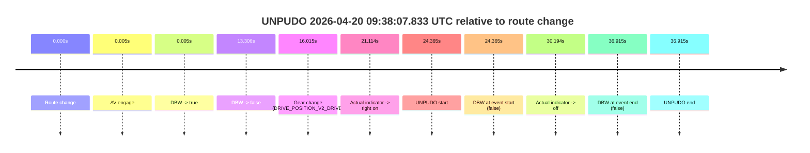

| Metric | Value |
|---|---|
| Outcome | `fail` |
| Effective failure type | `not_av_owned` |
| Route change status | `found` |
| DBW at event start | `false` |
| DBW at event end | `false` |
| Predicted gear at AV start | `DRIVE_POSITION_V2_PARK` |
| Actual gear at AV start | `DRIVE_POSITION_V2_PARK` |
| Predicted gear at event start | `DRIVE_POSITION_V2_DRIVE` |
| Actual gear at event start | `DRIVE_POSITION_V2_DRIVE` |
| Planned indicator direction | `INDICATORS_STATE_V2_RIGHT_ON` |
| Controller indicator direction | `INDICATORS_STATE_V2_RIGHT_ON` |
| Actual indicator direction | `INDICATORS_STATE_V2_RIGHT_ON` |
| Actual indicator at maneuver end | `INDICATORS_STATE_V2_OFF` |
| Driver accel help in AV | `false` |
| Driver accel help timestamp | `n/a` |
| Max accel pedal pct in AV | `0.0%` |
| Max brake pedal pct in AV | `20.1%` |
| Max speed mps in AV | `0.000` |
| Success timing baseline | `route change` |
| Route -> AV | `0.005s` |
| AV -> event start | `24.360s` |
| AV -> first motion | `n/a` |
| Success baseline -> event start | `24.365s` |
| Success baseline -> first motion | `n/a` |
| AV duration before disengagement | `13.301s` |
| Trajectory waypoint count | `38` |
| Driving-plan step count | `11` |

The scored portion starts from the AV-owned window, not from the pre-AV setup. Route-change search in the stopped pre-event segment was `found`, with the baseline therefore set to route change. At the event anchor the model predicts `DRIVE_POSITION_V2_DRIVE` and the actual gear is `DRIVE_POSITION_V2_DRIVE`. The effective model outcome is `fail` because `not_av_owned.`

### Resolution

| Field | Value |
|---|---|
| Final outcome | `fail` |
| Do we agree with this label? | `yes` |
| Source disengagement type | `none observed` |
| Resolved effective failure type | `not_av_owned` |
| Confidence | `high` |

## unpudo 2026-04-20 09:45:00.483 UTC

| Field | Value |
|---|---|
| Model | `eel-teal-outspoken` |
| Author | `zak` |
| Run ID | `fme20030/2026-04-20--08-20-46--gen2-av-6be4d2dd-195b-4e2e-a1bc-ce10ad0880ea` |
| Date | `2026-04-20` |
| Time (UTC) | `09:45:00.483` |
| Event type | `unpudo` |
| Disengagement type | `none observed` |
| Route change | `found` |
| Console | [run](https://console.sso.wayve.ai/run/fme20030/2026-04-20--08-20-46--gen2-av-6be4d2dd-195b-4e2e-a1bc-ce10ad0880ea?id=&time-unixus=1776678300483296) |
| Foxglove | [segment](https://app.foxglove.dev/wayve-on-prem/p/prj_0dX18KZdVHg1fmmI/view?ds=foxglove-stream&ds.deviceName=fme20030&ds.start=2026-04-20T09%3A44%3A46.618258Z&ds.end=2026-04-20T09%3A46%3A10.014083Z&layoutId=lay_0e7VD4WIKDQGU73Y&time=2026-04-20T09%3A45%3A00.483296Z) |

### Event card: pass

- Pass: AV owns the credited unpudo from route change through the official unpudo window, the gear state is aligned at the anchor, and the vehicle moves without driver accelerator help in AV.

| Event | Time (UTC) | Delta from route change |
|---|---:|---:|
| Route change | 2026-04-20 09:44:56.618 | `0.000s` |
| AV engage | 2026-04-20 09:44:56.623 | `0.005s` |
| DBW -> true | 2026-04-20 09:44:56.623 | `0.005s` |
| Gear change (DRIVE_POSITION_V2_DRIVE) | 2026-04-20 09:44:56.933 | `0.315s` |
| UNPUDO start | 2026-04-20 09:45:00.483 | `3.865s` |
| DBW at event start (true) | 2026-04-20 09:45:00.483 | `3.865s` |
| First motion | 2026-04-20 09:45:00.522 | `3.904s` |
| DBW at event end (true) | 2026-04-20 09:45:03.833 | `7.215s` |
| UNPUDO end | 2026-04-20 09:45:03.833 | `7.215s` |
| DBW -> false | 2026-04-20 09:46:00.014 | `63.396s` |
| Actual indicator -> right on | 2026-04-20 09:46:00.602 | `63.984s` |
| Actual indicator -> off | 2026-04-20 09:46:02.361 | `65.744s` |
| Actual indicator -> left on | 2026-04-20 09:46:10.161 | `73.544s` |

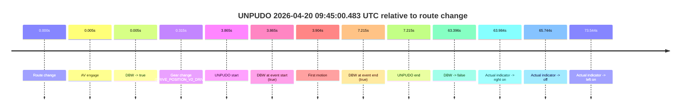

| Metric | Value |
|---|---|
| Outcome | `pass` |
| Effective failure type | `none` |
| Route change status | `found` |
| DBW at event start | `true` |
| DBW at event end | `true` |
| Predicted gear at AV start | `DRIVE_POSITION_V2_PARK` |
| Actual gear at AV start | `DRIVE_POSITION_V2_PARK` |
| Predicted gear at event start | `DRIVE_POSITION_V2_DRIVE` |
| Actual gear at event start | `DRIVE_POSITION_V2_DRIVE` |
| Planned indicator direction | `INDICATORS_STATE_V2_RIGHT_ON` |
| Controller indicator direction | `INDICATORS_STATE_V2_RIGHT_ON` |
| Actual indicator direction | `INDICATORS_STATE_V2_OFF` |
| Actual indicator at maneuver end | `INDICATORS_STATE_V2_OFF` |
| Driver accel help in AV | `false` |
| Driver accel help timestamp | `n/a` |
| Max accel pedal pct in AV | `0.0%` |
| Max brake pedal pct in AV | `8.0%` |
| Max speed mps in AV | `5.731` |
| Success timing baseline | `route change` |
| Route -> AV | `0.005s` |
| AV -> event start | `3.860s` |
| AV -> first motion | `3.899s` |
| Success baseline -> event start | `3.865s` |
| Success baseline -> first motion | `3.904s` |
| AV duration before disengagement | `63.391s` |
| Trajectory waypoint count | `37` |
| Driving-plan step count | `11` |

The scored portion starts from the AV-owned window, not from the pre-AV setup. Route-change search in the stopped pre-event segment was `found`, with the baseline therefore set to route change. At the event anchor the model predicts `DRIVE_POSITION_V2_DRIVE` and the actual gear is `DRIVE_POSITION_V2_DRIVE`. The effective model outcome is `pass` because `the credited unpudo stays AV-owned through the official unpudo window.`

### Resolution

| Field | Value |
|---|---|
| Final outcome | `pass` |
| Do we agree with this label? | `yes` |
| Source disengagement type | `none observed` |
| Resolved effective failure type | `none` |
| Confidence | `high` |

## unpudo 2026-04-20 09:53:35.383 UTC

| Field | Value |
|---|---|
| Model | `eel-teal-outspoken` |
| Author | `zak` |
| Run ID | `fme20030/2026-04-20--08-20-46--gen2-av-6be4d2dd-195b-4e2e-a1bc-ce10ad0880ea` |
| Date | `2026-04-20` |
| Time (UTC) | `09:53:35.383` |
| Event type | `unpudo` |
| Disengagement type | `none observed` |
| Route change | `found` |
| Console | [run](https://console.sso.wayve.ai/run/fme20030/2026-04-20--08-20-46--gen2-av-6be4d2dd-195b-4e2e-a1bc-ce10ad0880ea?id=&time-unixus=1776678815383309) |
| Foxglove | [segment](https://app.foxglove.dev/wayve-on-prem/p/prj_0dX18KZdVHg1fmmI/view?ds=foxglove-stream&ds.deviceName=fme20030&ds.start=2026-04-20T09%3A51%3A40.518254Z&ds.end=2026-04-20T09%3A57%3A20.374904Z&layoutId=lay_0e7VD4WIKDQGU73Y&time=2026-04-20T09%3A53%3A35.383309Z) |

### Event card: pass

- Pass: AV owns the credited unpudo from route change through the official unpudo window, the gear state is aligned at the anchor, and the vehicle moves without driver accelerator help in AV.

| Event | Time (UTC) | Delta from route change |
|---|---:|---:|
| Route change | 2026-04-20 09:51:50.518 | `0.000s` |
| First motion | 2026-04-20 09:51:54.422 | `3.904s` |
| Actual indicator -> right on | 2026-04-20 09:52:48.862 | `58.344s` |
| Actual indicator -> off | 2026-04-20 09:52:52.822 | `62.304s` |
| Actual indicator -> left on | 2026-04-20 09:53:04.681 | `74.164s` |
| Actual indicator -> off | 2026-04-20 09:53:06.261 | `75.744s` |
| AV engage | 2026-04-20 09:53:31.373 | `100.855s` |
| DBW -> true | 2026-04-20 09:53:31.373 | `100.855s` |
| Gear change (DRIVE_POSITION_V2_DRIVE) | 2026-04-20 09:53:31.833 | `101.315s` |
| UNPUDO start | 2026-04-20 09:53:35.383 | `104.865s` |
| DBW at event start (true) | 2026-04-20 09:53:35.383 | `104.865s` |
| DBW at event end (true) | 2026-04-20 09:53:38.983 | `108.465s` |
| UNPUDO end | 2026-04-20 09:53:38.983 | `108.465s` |
| DBW -> false | 2026-04-20 09:57:10.374 | `319.857s` |

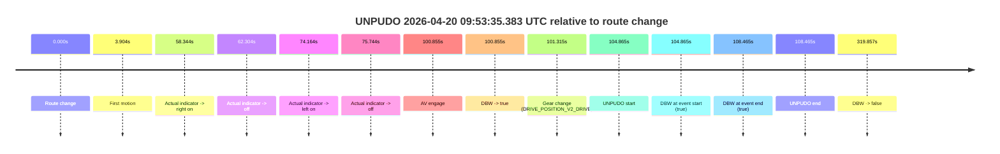

| Metric | Value |
|---|---|
| Outcome | `pass` |
| Effective failure type | `none` |
| Route change status | `found` |
| DBW at event start | `true` |
| DBW at event end | `true` |
| Predicted gear at AV start | `DRIVE_POSITION_V2_DRIVE` |
| Actual gear at AV start | `DRIVE_POSITION_V2_PARK` |
| Predicted gear at event start | `DRIVE_POSITION_V2_DRIVE` |
| Actual gear at event start | `DRIVE_POSITION_V2_DRIVE` |
| Planned indicator direction | `INDICATORS_STATE_V2_RIGHT_ON` |
| Controller indicator direction | `INDICATORS_STATE_V2_RIGHT_ON` |
| Actual indicator direction | `INDICATORS_STATE_V2_OFF` |
| Actual indicator at maneuver end | `INDICATORS_STATE_V2_OFF` |
| Driver accel help in AV | `false` |
| Driver accel help timestamp | `n/a` |
| Max accel pedal pct in AV | `0.0%` |
| Max brake pedal pct in AV | `8.0%` |
| Max speed mps in AV | `4.181` |
| Success timing baseline | `route change` |
| Route -> AV | `100.855s` |
| AV -> event start | `4.010s` |
| AV -> first motion | `-96.951s` |
| Success baseline -> event start | `104.865s` |
| Success baseline -> first motion | `3.904s` |
| AV duration before disengagement | `219.002s` |
| Trajectory waypoint count | `37` |
| Driving-plan step count | `11` |

The scored portion starts from the AV-owned window, not from the pre-AV setup. Route-change search in the stopped pre-event segment was `found`, with the baseline therefore set to route change. At the event anchor the model predicts `DRIVE_POSITION_V2_DRIVE` and the actual gear is `DRIVE_POSITION_V2_DRIVE`. The effective model outcome is `pass` because `the credited unpudo stays AV-owned through the official unpudo window.`

### Resolution

| Field | Value |
|---|---|
| Final outcome | `pass` |
| Do we agree with this label? | `yes` |
| Source disengagement type | `none observed` |
| Resolved effective failure type | `none` |
| Confidence | `high` |

## unpudo 2026-04-20 09:58:42.783 UTC

| Field | Value |
|---|---|
| Model | `eel-teal-outspoken` |
| Author | `zak` |
| Run ID | `fme20030/2026-04-20--08-20-46--gen2-av-6be4d2dd-195b-4e2e-a1bc-ce10ad0880ea` |
| Date | `2026-04-20` |
| Time (UTC) | `09:58:42.783` |
| Event type | `unpudo` |
| Disengagement type | `none observed` |
| Route change | `found` |
| Console | [run](https://console.sso.wayve.ai/run/fme20030/2026-04-20--08-20-46--gen2-av-6be4d2dd-195b-4e2e-a1bc-ce10ad0880ea?id=&time-unixus=1776679122783309) |
| Foxglove | [segment](https://app.foxglove.dev/wayve-on-prem/p/prj_0dX18KZdVHg1fmmI/view?ds=foxglove-stream&ds.deviceName=fme20030&ds.start=2026-04-20T09%3A58%3A27.718300Z&ds.end=2026-04-20T09%3A59%3A46.032975Z&layoutId=lay_0e7VD4WIKDQGU73Y&time=2026-04-20T09%3A58%3A42.783309Z) |

### Event card: pass

- Pass: AV owns the credited unpudo from route change through the official unpudo window, the gear state is aligned at the anchor, and the vehicle moves without driver accelerator help in AV.

| Event | Time (UTC) | Delta from route change |
|---|---:|---:|
| Route change | 2026-04-20 09:58:37.718 | `0.000s` |
| AV engage | 2026-04-20 09:58:37.723 | `0.005s` |
| DBW -> true | 2026-04-20 09:58:37.723 | `0.005s` |
| Gear change (DRIVE_POSITION_V2_DRIVE) | 2026-04-20 09:58:38.033 | `0.315s` |
| UNPUDO start | 2026-04-20 09:58:42.783 | `5.065s` |
| DBW at event start (true) | 2026-04-20 09:58:42.783 | `5.065s` |
| First motion | 2026-04-20 09:58:42.941 | `5.224s` |
| DBW at event end (true) | 2026-04-20 09:58:47.583 | `9.865s` |
| UNPUDO end | 2026-04-20 09:58:47.583 | `9.865s` |
| DBW -> false | 2026-04-20 09:59:36.032 | `58.315s` |
| Actual indicator -> left on | 2026-04-20 09:59:40.201 | `62.484s` |
| Actual indicator -> off | 2026-04-20 09:59:42.222 | `64.504s` |
| Actual indicator -> left on | 2026-04-20 09:59:53.202 | `75.484s` |
| Actual indicator -> off | 2026-04-20 09:59:55.081 | `77.364s` |

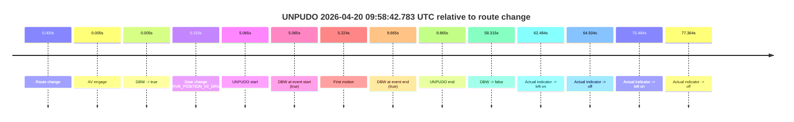

| Metric | Value |
|---|---|
| Outcome | `pass` |
| Effective failure type | `none` |
| Route change status | `found` |
| DBW at event start | `true` |
| DBW at event end | `true` |
| Predicted gear at AV start | `DRIVE_POSITION_V2_PARK` |
| Actual gear at AV start | `DRIVE_POSITION_V2_PARK` |
| Predicted gear at event start | `DRIVE_POSITION_V2_DRIVE` |
| Actual gear at event start | `DRIVE_POSITION_V2_DRIVE` |
| Planned indicator direction | `INDICATORS_STATE_V2_RIGHT_ON` |
| Controller indicator direction | `INDICATORS_STATE_V2_RIGHT_ON` |
| Actual indicator direction | `INDICATORS_STATE_V2_OFF` |
| Actual indicator at maneuver end | `INDICATORS_STATE_V2_OFF` |
| Driver accel help in AV | `false` |
| Driver accel help timestamp | `n/a` |
| Max accel pedal pct in AV | `0.0%` |
| Max brake pedal pct in AV | `8.0%` |
| Max speed mps in AV | `4.247` |
| Success timing baseline | `route change` |
| Route -> AV | `0.005s` |
| AV -> event start | `5.060s` |
| AV -> first motion | `5.219s` |
| Success baseline -> event start | `5.065s` |
| Success baseline -> first motion | `5.224s` |
| AV duration before disengagement | `58.310s` |
| Trajectory waypoint count | `37` |
| Driving-plan step count | `11` |

The scored portion starts from the AV-owned window, not from the pre-AV setup. Route-change search in the stopped pre-event segment was `found`, with the baseline therefore set to route change. At the event anchor the model predicts `DRIVE_POSITION_V2_DRIVE` and the actual gear is `DRIVE_POSITION_V2_DRIVE`. The effective model outcome is `pass` because `the credited unpudo stays AV-owned through the official unpudo window.`

### Resolution

| Field | Value |
|---|---|
| Final outcome | `pass` |
| Do we agree with this label? | `yes` |
| Source disengagement type | `none observed` |
| Resolved effective failure type | `none` |
| Confidence | `high` |

## unpudo 2026-04-20 09:59:55.583 UTC

| Field | Value |
|---|---|
| Model | `eel-teal-outspoken` |
| Author | `zak` |
| Run ID | `fme20030/2026-04-20--08-20-46--gen2-av-6be4d2dd-195b-4e2e-a1bc-ce10ad0880ea` |
| Date | `2026-04-20` |
| Time (UTC) | `09:59:55.583` |
| Event type | `unpudo` |
| Disengagement type | `none observed` |
| Route change | `found` |
| Console | [run](https://console.sso.wayve.ai/run/fme20030/2026-04-20--08-20-46--gen2-av-6be4d2dd-195b-4e2e-a1bc-ce10ad0880ea?id=&time-unixus=1776679195583303) |
| Foxglove | [segment](https://app.foxglove.dev/wayve-on-prem/p/prj_0dX18KZdVHg1fmmI/view?ds=foxglove-stream&ds.deviceName=fme20030&ds.start=2026-04-20T09%3A58%3A27.718300Z&ds.end=2026-04-20T10%3A00%3A05.583303Z&layoutId=lay_0e7VD4WIKDQGU73Y&time=2026-04-20T09%3A59%3A55.583303Z) |

### Event card: fail

- Fail: the credited unpudo does not stay AV-owned. The event window starts with DBW false, and the maneuver outcome lands outside a clean AV-owned segment.

| Event | Time (UTC) | Delta from route change |
|---|---:|---:|
| Route change | 2026-04-20 09:58:37.718 | `0.000s` |
| AV engage | 2026-04-20 09:58:37.723 | `0.005s` |
| DBW -> true | 2026-04-20 09:58:37.723 | `0.005s` |
| First motion | 2026-04-20 09:58:42.941 | `5.224s` |
| DBW -> false | 2026-04-20 09:59:36.032 | `58.315s` |
| Actual indicator -> left on | 2026-04-20 09:59:40.201 | `62.484s` |
| Actual indicator -> off | 2026-04-20 09:59:42.222 | `64.504s` |
| Gear change (DRIVE_POSITION_V2_REVERSE) | 2026-04-20 09:59:50.133 | `72.415s` |
| Actual indicator -> left on | 2026-04-20 09:59:53.202 | `75.484s` |
| Actual indicator -> off | 2026-04-20 09:59:55.081 | `77.364s` |
| UNPUDO start | 2026-04-20 09:59:55.583 | `77.865s` |
| DBW at event start (false) | 2026-04-20 09:59:55.583 | `77.865s` |
| DBW at event end (false) | 2026-04-20 09:59:55.583 | `77.865s` |
| UNPUDO end | 2026-04-20 09:59:55.583 | `77.865s` |

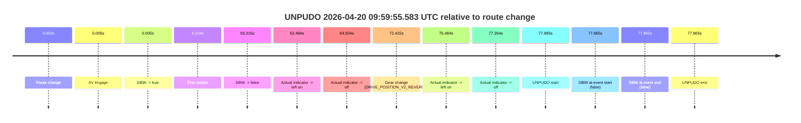

| Metric | Value |
|---|---|
| Outcome | `fail` |
| Effective failure type | `not_av_owned` |
| Route change status | `found` |
| DBW at event start | `false` |
| DBW at event end | `false` |
| Predicted gear at AV start | `DRIVE_POSITION_V2_PARK` |
| Actual gear at AV start | `DRIVE_POSITION_V2_PARK` |
| Predicted gear at event start | `DRIVE_POSITION_V2_REVERSE` |
| Actual gear at event start | `DRIVE_POSITION_V2_REVERSE` |
| Planned indicator direction | `INDICATORS_STATE_V2_OFF` |
| Controller indicator direction | `INDICATORS_STATE_V2_OFF` |
| Actual indicator direction | `INDICATORS_STATE_V2_OFF` |
| Actual indicator at maneuver end | `INDICATORS_STATE_V2_OFF` |
| Driver accel help in AV | `false` |
| Driver accel help timestamp | `n/a` |
| Max accel pedal pct in AV | `0.0%` |
| Max brake pedal pct in AV | `8.0%` |
| Max speed mps in AV | `7.564` |
| Success timing baseline | `route change` |
| Route -> AV | `0.005s` |
| AV -> event start | `77.860s` |
| AV -> first motion | `5.219s` |
| Success baseline -> event start | `77.865s` |
| Success baseline -> first motion | `5.224s` |
| AV duration before disengagement | `58.310s` |
| Trajectory waypoint count | `37` |
| Driving-plan step count | `11` |

The scored portion starts from the AV-owned window, not from the pre-AV setup. Route-change search in the stopped pre-event segment was `found`, with the baseline therefore set to route change. At the event anchor the model predicts `DRIVE_POSITION_V2_REVERSE` and the actual gear is `DRIVE_POSITION_V2_REVERSE`. The effective model outcome is `fail` because `not_av_owned.`

### Resolution

| Field | Value |
|---|---|
| Final outcome | `fail` |
| Do we agree with this label? | `yes` |
| Source disengagement type | `none observed` |
| Resolved effective failure type | `not_av_owned` |
| Confidence | `high` |
