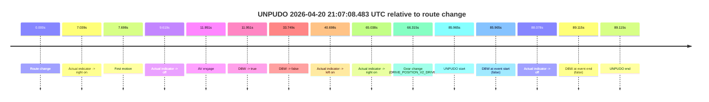

# Run Report: fme20030/2026-04-20--20-36-14--gen2-av-f5497b25-2de7-4b02-ba90-58ad03d3f789

| Field | Value |
|---|---|
| Run ID | `fme20030/2026-04-20--20-36-14--gen2-av-f5497b25-2de7-4b02-ba90-58ad03d3f789` |
| Date | `2026-04-20` |
| Model(s) | `eel-teal-outspoken` |
| Author | `zak` |
| Event count | `1` |

## unpudo 2026-04-20 21:07:08.483 UTC

| Field | Value |
|---|---|
| Model | `eel-teal-outspoken` |
| Author | `zak` |
| Run ID | `fme20030/2026-04-20--20-36-14--gen2-av-f5497b25-2de7-4b02-ba90-58ad03d3f789` |
| Date | `2026-04-20` |
| Time (UTC) | `21:07:08.483` |
| Event type | `unpudo` |
| Disengagement type | `none observed` |
| Route change | `found` |
| Console | [run](https://console.sso.wayve.ai/run/fme20030/2026-04-20--20-36-14--gen2-av-f5497b25-2de7-4b02-ba90-58ad03d3f789?id=&time-unixus=1776719228483310) |
| Foxglove | [segment](https://app.foxglove.dev/wayve-on-prem/p/prj_0dX18KZdVHg1fmmI/view?ds=foxglove-stream&ds.deviceName=fme20030&ds.start=2026-04-20T21%3A05%3A32.518238Z&ds.end=2026-04-20T21%3A07%3A21.633289Z&layoutId=lay_0e7VD4WIKDQGU73Y&time=2026-04-20T21%3A07%3A08.483310Z) |

### Event card: fail

- Fail: the credited unpudo does not stay AV-owned. The event window starts with DBW false, and the maneuver outcome lands outside a clean AV-owned segment.

| Event | Time (UTC) | Delta from route change |
|---|---:|---:|
| Route change | 2026-04-20 21:05:42.518 | `0.000s` |
| Actual indicator -> right on | 2026-04-20 21:05:49.557 | `7.039s` |
| First motion | 2026-04-20 21:05:50.216 | `7.698s` |
| Actual indicator -> off | 2026-04-20 21:05:52.136 | `9.619s` |
| AV engage | 2026-04-20 21:05:54.468 | `11.951s` |
| DBW -> true | 2026-04-20 21:05:54.468 | `11.951s` |
| DBW -> false | 2026-04-20 21:06:16.267 | `33.749s` |
| Actual indicator -> left on | 2026-04-20 21:06:23.216 | `40.698s` |
| Actual indicator -> right on | 2026-04-20 21:06:47.556 | `65.038s` |
| Gear change (DRIVE_POSITION_V2_DRIVE) | 2026-04-20 21:06:48.833 | `66.315s` |
| UNPUDO start | 2026-04-20 21:07:08.483 | `85.965s` |
| DBW at event start (false) | 2026-04-20 21:07:08.483 | `85.965s` |
| Actual indicator -> off | 2026-04-20 21:07:10.596 | `88.078s` |
| DBW at event end (false) | 2026-04-20 21:07:11.633 | `89.115s` |
| UNPUDO end | 2026-04-20 21:07:11.633 | `89.115s` |

| Metric | Value |
|---|---|
| Outcome | `fail` |
| Effective failure type | `completed_outside_av` |
| Route change status | `found` |
| DBW at event start | `false` |
| DBW at event end | `false` |
| Predicted gear at AV start | `DRIVE_POSITION_V2_DRIVE` |
| Actual gear at AV start | `DRIVE_POSITION_V2_DRIVE` |
| Predicted gear at event start | `DRIVE_POSITION_V2_DRIVE` |
| Actual gear at event start | `DRIVE_POSITION_V2_DRIVE` |
| Planned indicator direction | `INDICATORS_STATE_V2_RIGHT_ON` |
| Controller indicator direction | `INDICATORS_STATE_V2_RIGHT_ON` |
| Actual indicator direction | `INDICATORS_STATE_V2_RIGHT_ON` |
| Actual indicator at maneuver end | `INDICATORS_STATE_V2_OFF` |
| Driver accel help in AV | `false` |
| Driver accel help timestamp | `n/a` |
| Max accel pedal pct in AV | `0.0%` |
| Max brake pedal pct in AV | `0.0%` |
| Max speed mps in AV | `8.061` |
| Success timing baseline | `route change` |
| Route -> AV | `11.951s` |
| AV -> event start | `74.014s` |
| AV -> first motion | `-4.252s` |
| Success baseline -> event start | `85.965s` |
| Success baseline -> first motion | `7.698s` |
| AV duration before disengagement | `21.799s` |
| Trajectory waypoint count | `36` |
| Driving-plan step count | `11` |

The scored portion starts from the AV-owned window, not from the pre-AV setup. Route-change search in the stopped pre-event segment was `found`, with the baseline therefore set to route change. At the event anchor the model predicts `DRIVE_POSITION_V2_DRIVE` and the actual gear is `DRIVE_POSITION_V2_DRIVE`. The effective model outcome is `fail` because `completed_outside_av.`

### Resolution

| Field | Value |
|---|---|
| Final outcome | `fail` |
| Do we agree with this label? | `yes` |
| Source disengagement type | `none observed` |
| Resolved effective failure type | `completed_outside_av` |
| Confidence | `high` |
