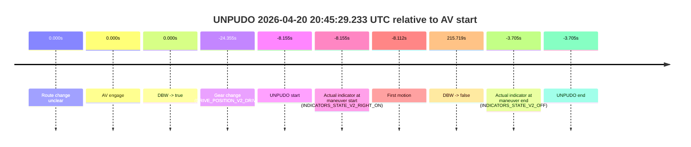
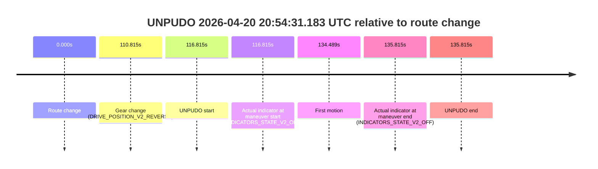
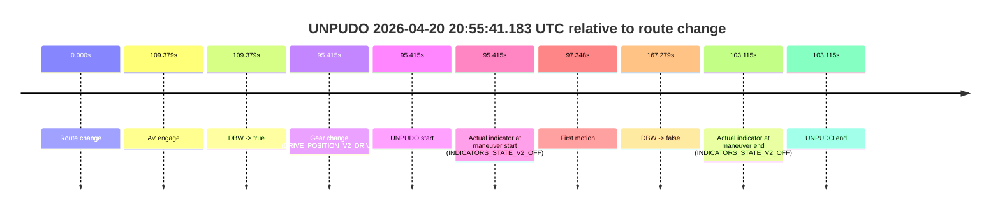
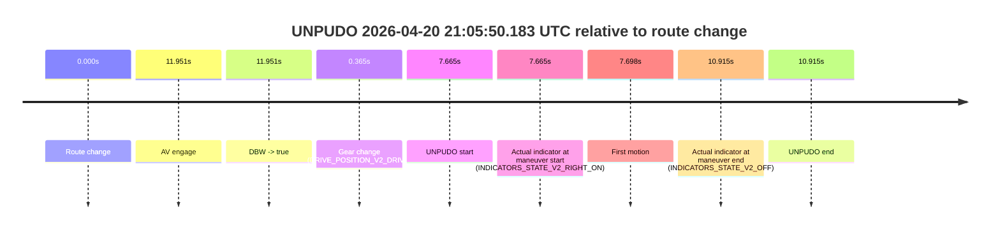

# Run Report: fme20030/2026-04-20--20-36-14--gen2-av-f5497b25-2de7-4b02-ba90-58ad03d3f789

| Field | Value |
|---|---|
| Run ID | `fme20030/2026-04-20--20-36-14--gen2-av-f5497b25-2de7-4b02-ba90-58ad03d3f789` |
| Date | `2026-04-20` |
| Model(s) | `blue-panther-solid` |
| Author | `guy.geva` |
| Event count | `7` |

## unpudo 2026-04-20 20:45:29.233 UTC

| Field | Value |
|---|---|
| Model | `blue-panther-solid` |
| Author | `guy.geva` |
| Run ID | `fme20030/2026-04-20--20-36-14--gen2-av-f5497b25-2de7-4b02-ba90-58ad03d3f789` |
| Date | `2026-04-20` |
| Time (UTC) | `20:45:29.233` |
| Event type | `unpudo` |
| Disengagement type | `none observed` |
| Route change | `unclear` |
| Console | [run](https://console.sso.wayve.ai/run/fme20030/2026-04-20--20-36-14--gen2-av-f5497b25-2de7-4b02-ba90-58ad03d3f789?id=&time-unixus=1776717929233289) |
| Foxglove | [segment](https://app.foxglove.dev/wayve-on-prem/p/prj_0dX18KZdVHg1fmmI/view?ds=foxglove-stream&ds.deviceName=fme20030&ds.start=2026-04-20T20%3A45%3A03.033313Z&ds.end=2026-04-20T20%3A49%3A23.107612Z&layoutId=lay_0e7VD4WIKDQGU73Y&time=2026-04-20T20%3A45%3A29.233289Z) |

### Event card: non-av

- Non-AV: there is no AV-owned portion anywhere inside the detected unpudo timeline, so it is kept for coverage but excluded from model success / failure scoring.

| Event | Time (UTC) | Delta from AV start |
|---|---:|---:|
| Route change unclear | 2026-04-20 20:45:37.388 | `0.000s` |
| AV engage | 2026-04-20 20:45:37.388 | `0.000s` |
| DBW -> true | 2026-04-20 20:45:37.388 | `0.000s` |
| Gear change (DRIVE_POSITION_V2_DRIVE) | 2026-04-20 20:45:13.033 | `-24.355s` |
| UNPUDO start | 2026-04-20 20:45:29.233 | `-8.155s` |
| Actual indicator at maneuver start (INDICATORS_STATE_V2_RIGHT_ON) | 2026-04-20 20:45:29.233 | `-8.155s` |
| First motion | 2026-04-20 20:45:29.276 | `-8.112s` |
| DBW -> false | 2026-04-20 20:49:13.107 | `215.719s` |
| Actual indicator at maneuver end (INDICATORS_STATE_V2_OFF) | 2026-04-20 20:45:33.683 | `-3.705s` |
| UNPUDO end | 2026-04-20 20:45:33.683 | `-3.705s` |

| Metric | Value |
|---|---|
| Outcome | `non-av` |
| Effective failure type | `none` |
| Route change status | `unclear` |
| DBW at event start | `false` |
| DBW at event end | `false` |
| Predicted gear at AV start | `DRIVE_POSITION_V2_DRIVE` |
| Actual gear at AV start | `DRIVE_POSITION_V2_DRIVE` |
| Predicted gear at event start | `DRIVE_POSITION_V2_DRIVE` |
| Actual gear at event start | `DRIVE_POSITION_V2_DRIVE` |
| Planned indicator direction | `INDICATORS_STATE_V2_RIGHT_ON` |
| Controller indicator direction | `INDICATORS_STATE_V2_RIGHT_ON` |
| Actual indicator direction | `INDICATORS_STATE_V2_RIGHT_ON` |
| Actual indicator at maneuver end | `INDICATORS_STATE_V2_OFF` |
| Driver accel help in AV | `false` |
| Driver accel help timestamp | `n/a` |
| Max accel pedal pct in AV | `0.0%` |
| Max brake pedal pct in AV | `0.0%` |
| Max speed mps in AV | `0.000` |
| Route -> AV | `n/a` |
| AV -> event start | `-8.155s` |
| AV -> first motion | `-8.112s` |
| AV duration before disengagement | `215.719s` |
| Trajectory waypoint count | `36` |
| Driving-plan step count | `11` |

The scored portion starts from the AV-owned window, not from the pre-AV setup. Route-change search in the stopped pre-event segment was `unclear`, with the baseline therefore set to AV start. At the event anchor the model predicts `DRIVE_POSITION_V2_DRIVE` and the actual gear is `DRIVE_POSITION_V2_DRIVE`. The effective model outcome is `non-av` because `there is no AV-owned overlap inside the event timeline`.

### Resolution

| Field | Value |
|---|---|
| Final outcome | `non-av` |
| Do we agree with this label? | `yes` |
| Source disengagement type | `none observed` |
| Resolved effective failure type | `none` |
| Confidence | `medium` |

## unpudo 2026-04-20 20:52:47.183 UTC

| Field | Value |
|---|---|
| Model | `blue-panther-solid` |
| Author | `guy.geva` |
| Run ID | `fme20030/2026-04-20--20-36-14--gen2-av-f5497b25-2de7-4b02-ba90-58ad03d3f789` |
| Date | `2026-04-20` |
| Time (UTC) | `20:52:47.183` |
| Event type | `unpudo` |
| Disengagement type | `none observed` |
| Route change | `found` |
| Console | [run](https://console.sso.wayve.ai/run/fme20030/2026-04-20--20-36-14--gen2-av-f5497b25-2de7-4b02-ba90-58ad03d3f789?id=&time-unixus=1776718367183310) |
| Foxglove | [segment](https://app.foxglove.dev/wayve-on-prem/p/prj_0dX18KZdVHg1fmmI/view?ds=foxglove-stream&ds.deviceName=fme20030&ds.start=2026-04-20T20%3A52%3A24.368269Z&ds.end=2026-04-20T20%3A54%3A33.307721Z&layoutId=lay_0e7VD4WIKDQGU73Y&time=2026-04-20T20%3A52%3A47.183310Z) |

### Event card: pass

- Pass: AV owns the credited unpudo through the official event window, the gear state is aligned at the anchor, and the vehicle moves without driver accelerator help in AV.

| Event | Time (UTC) | Delta from route change |
|---|---:|---:|
| Route change | 2026-04-20 20:52:34.368 | `0.000s` |
| AV engage | 2026-04-20 20:52:51.647 | `17.280s` |
| DBW -> true | 2026-04-20 20:52:51.647 | `17.280s` |
| Gear change (DRIVE_POSITION_V2_DRIVE) | 2026-04-20 20:52:38.633 | `4.265s` |
| UNPUDO start | 2026-04-20 20:52:47.183 | `12.815s` |
| Actual indicator at maneuver start (INDICATORS_STATE_V2_RIGHT_ON) | 2026-04-20 20:52:47.183 | `12.815s` |
| First motion | 2026-04-20 20:52:47.276 | `12.908s` |
| DBW -> false | 2026-04-20 20:54:23.307 | `108.939s` |
| Actual indicator at maneuver end (INDICATORS_STATE_V2_OFF) | 2026-04-20 20:52:59.283 | `24.915s` |
| UNPUDO end | 2026-04-20 20:52:59.283 | `24.915s` |

| Metric | Value |
|---|---|
| Outcome | `pass` |
| Effective failure type | `none` |
| Route change status | `found` |
| DBW at event start | `false` |
| DBW at event end | `true` |
| Predicted gear at AV start | `DRIVE_POSITION_V2_DRIVE` |
| Actual gear at AV start | `DRIVE_POSITION_V2_DRIVE` |
| Predicted gear at event start | `DRIVE_POSITION_V2_DRIVE` |
| Actual gear at event start | `DRIVE_POSITION_V2_DRIVE` |
| Planned indicator direction | `INDICATORS_STATE_V2_OFF` |
| Controller indicator direction | `INDICATORS_STATE_V2_OFF` |
| Actual indicator direction | `INDICATORS_STATE_V2_RIGHT_ON` |
| Actual indicator at maneuver end | `INDICATORS_STATE_V2_OFF` |
| Driver accel help in AV | `false` |
| Driver accel help timestamp | `n/a` |
| Max accel pedal pct in AV | `0.0%` |
| Max brake pedal pct in AV | `8.0%` |
| Max speed mps in AV | `3.889` |
| Route -> AV | `17.280s` |
| AV -> event start | `-4.464s` |
| AV -> first motion | `-4.371s` |
| AV duration before disengagement | `91.660s` |
| Trajectory waypoint count | `36` |
| Driving-plan step count | `11` |

The scored portion starts from the AV-owned window, not from the pre-AV setup. Route-change search in the stopped pre-event segment was `found`, with the baseline therefore set to route change. At the event anchor the model predicts `DRIVE_POSITION_V2_DRIVE` and the actual gear is `DRIVE_POSITION_V2_DRIVE`. The effective model outcome is `pass` because `the credited maneuver stays AV-owned through the official event end`.

### Resolution

| Field | Value |
|---|---|
| Final outcome | `pass` |
| Do we agree with this label? | `yes` |
| Source disengagement type | `none observed` |
| Resolved effective failure type | `none` |
| Confidence | `high` |

## unpudo 2026-04-20 20:54:31.183 UTC

| Field | Value |
|---|---|
| Model | `blue-panther-solid` |
| Author | `guy.geva` |
| Run ID | `fme20030/2026-04-20--20-36-14--gen2-av-f5497b25-2de7-4b02-ba90-58ad03d3f789` |
| Date | `2026-04-20` |
| Time (UTC) | `20:54:31.183` |
| Event type | `unpudo` |
| Disengagement type | `none observed` |
| Route change | `found` |
| Console | [run](https://console.sso.wayve.ai/run/fme20030/2026-04-20--20-36-14--gen2-av-f5497b25-2de7-4b02-ba90-58ad03d3f789?id=&time-unixus=1776718471183311) |
| Foxglove | [segment](https://app.foxglove.dev/wayve-on-prem/p/prj_0dX18KZdVHg1fmmI/view?ds=foxglove-stream&ds.deviceName=fme20030&ds.start=2026-04-20T20%3A52%3A24.368269Z&ds.end=2026-04-20T20%3A55%3A00.183309Z&layoutId=lay_0e7VD4WIKDQGU73Y&time=2026-04-20T20%3A54%3A31.183311Z) |

### Event card: non-av

- Non-AV: there is no AV-owned portion anywhere inside the detected unpudo timeline, so it is kept for coverage but excluded from model success / failure scoring.

| Event | Time (UTC) | Delta from route change |
|---|---:|---:|
| Route change | 2026-04-20 20:52:34.368 | `0.000s` |
| Gear change (DRIVE_POSITION_V2_REVERSE) | 2026-04-20 20:54:25.183 | `110.815s` |
| UNPUDO start | 2026-04-20 20:54:31.183 | `116.815s` |
| Actual indicator at maneuver start (INDICATORS_STATE_V2_OFF) | 2026-04-20 20:54:31.183 | `116.815s` |
| First motion | 2026-04-20 20:54:48.857 | `134.489s` |
| Actual indicator at maneuver end (INDICATORS_STATE_V2_OFF) | 2026-04-20 20:54:50.183 | `135.815s` |
| UNPUDO end | 2026-04-20 20:54:50.183 | `135.815s` |

| Metric | Value |
|---|---|
| Outcome | `non-av` |
| Effective failure type | `none` |
| Route change status | `found` |
| DBW at event start | `false` |
| DBW at event end | `false` |
| Predicted gear at AV start | `n/a` |
| Actual gear at AV start | `n/a` |
| Predicted gear at event start | `DRIVE_POSITION_V2_REVERSE` |
| Actual gear at event start | `DRIVE_POSITION_V2_REVERSE` |
| Planned indicator direction | `INDICATORS_STATE_V2_OFF` |
| Controller indicator direction | `INDICATORS_STATE_V2_OFF` |
| Actual indicator direction | `INDICATORS_STATE_V2_OFF` |
| Actual indicator at maneuver end | `INDICATORS_STATE_V2_OFF` |
| Driver accel help in AV | `false` |
| Driver accel help timestamp | `n/a` |
| Max accel pedal pct in AV | `0.0%` |
| Max brake pedal pct in AV | `0.0%` |
| Max speed mps in AV | `0.000` |
| Route -> AV | `n/a` |
| AV -> event start | `n/a` |
| AV -> first motion | `n/a` |
| AV duration before disengagement | `n/a` |
| Trajectory waypoint count | `36` |
| Driving-plan step count | `11` |

The scored portion starts from the AV-owned window, not from the pre-AV setup. Route-change search in the stopped pre-event segment was `found`, with the baseline therefore set to route change. At the event anchor the model predicts `DRIVE_POSITION_V2_REVERSE` and the actual gear is `DRIVE_POSITION_V2_REVERSE`. The effective model outcome is `non-av` because `there is no AV-owned overlap inside the event timeline`.

### Resolution

| Field | Value |
|---|---|
| Final outcome | `non-av` |
| Do we agree with this label? | `yes` |
| Source disengagement type | `none observed` |
| Resolved effective failure type | `none` |
| Confidence | `high` |

## unpudo 2026-04-20 20:55:41.183 UTC

| Field | Value |
|---|---|
| Model | `blue-panther-solid` |
| Author | `guy.geva` |
| Run ID | `fme20030/2026-04-20--20-36-14--gen2-av-f5497b25-2de7-4b02-ba90-58ad03d3f789` |
| Date | `2026-04-20` |
| Time (UTC) | `20:55:41.183` |
| Event type | `unpudo` |
| Disengagement type | `none observed` |
| Route change | `found` |
| Console | [run](https://console.sso.wayve.ai/run/fme20030/2026-04-20--20-36-14--gen2-av-f5497b25-2de7-4b02-ba90-58ad03d3f789?id=&time-unixus=1776718541183286) |
| Foxglove | [segment](https://app.foxglove.dev/wayve-on-prem/p/prj_0dX18KZdVHg1fmmI/view?ds=foxglove-stream&ds.deviceName=fme20030&ds.start=2026-04-20T20%3A53%3A55.768297Z&ds.end=2026-04-20T20%3A57%3A03.047540Z&layoutId=lay_0e7VD4WIKDQGU73Y&time=2026-04-20T20%3A55%3A41.183286Z) |

### Event card: non-av

- Non-AV: there is no AV-owned portion anywhere inside the detected unpudo timeline, so it is kept for coverage but excluded from model success / failure scoring.

| Event | Time (UTC) | Delta from route change |
|---|---:|---:|
| Route change | 2026-04-20 20:54:05.768 | `0.000s` |
| AV engage | 2026-04-20 20:55:55.147 | `109.379s` |
| DBW -> true | 2026-04-20 20:55:55.147 | `109.379s` |
| Gear change (DRIVE_POSITION_V2_DRIVE) | 2026-04-20 20:55:41.183 | `95.415s` |
| UNPUDO start | 2026-04-20 20:55:41.183 | `95.415s` |
| Actual indicator at maneuver start (INDICATORS_STATE_V2_OFF) | 2026-04-20 20:55:41.183 | `95.415s` |
| First motion | 2026-04-20 20:55:43.116 | `97.348s` |
| DBW -> false | 2026-04-20 20:56:53.047 | `167.279s` |
| Actual indicator at maneuver end (INDICATORS_STATE_V2_OFF) | 2026-04-20 20:55:48.883 | `103.115s` |
| UNPUDO end | 2026-04-20 20:55:48.883 | `103.115s` |

| Metric | Value |
|---|---|
| Outcome | `non-av` |
| Effective failure type | `none` |
| Route change status | `found` |
| DBW at event start | `false` |
| DBW at event end | `false` |
| Predicted gear at AV start | `DRIVE_POSITION_V2_DRIVE` |
| Actual gear at AV start | `DRIVE_POSITION_V2_DRIVE` |
| Predicted gear at event start | `DRIVE_POSITION_V2_DRIVE` |
| Actual gear at event start | `DRIVE_POSITION_V2_DRIVE` |
| Planned indicator direction | `INDICATORS_STATE_V2_OFF` |
| Controller indicator direction | `INDICATORS_STATE_V2_OFF` |
| Actual indicator direction | `INDICATORS_STATE_V2_OFF` |
| Actual indicator at maneuver end | `INDICATORS_STATE_V2_OFF` |
| Driver accel help in AV | `false` |
| Driver accel help timestamp | `n/a` |
| Max accel pedal pct in AV | `0.0%` |
| Max brake pedal pct in AV | `0.0%` |
| Max speed mps in AV | `0.000` |
| Route -> AV | `109.379s` |
| AV -> event start | `-13.964s` |
| AV -> first motion | `-12.031s` |
| AV duration before disengagement | `57.900s` |
| Trajectory waypoint count | `37` |
| Driving-plan step count | `11` |

The scored portion starts from the AV-owned window, not from the pre-AV setup. Route-change search in the stopped pre-event segment was `found`, with the baseline therefore set to route change. At the event anchor the model predicts `DRIVE_POSITION_V2_DRIVE` and the actual gear is `DRIVE_POSITION_V2_DRIVE`. The effective model outcome is `non-av` because `there is no AV-owned overlap inside the event timeline`.

### Resolution

| Field | Value |
|---|---|
| Final outcome | `non-av` |
| Do we agree with this label? | `yes` |
| Source disengagement type | `none observed` |
| Resolved effective failure type | `none` |
| Confidence | `high` |

## unpudo 2026-04-20 21:00:28.583 UTC

| Field | Value |
|---|---|
| Model | `blue-panther-solid` |
| Author | `guy.geva` |
| Run ID | `fme20030/2026-04-20--20-36-14--gen2-av-f5497b25-2de7-4b02-ba90-58ad03d3f789` |
| Date | `2026-04-20` |
| Time (UTC) | `21:00:28.583` |
| Event type | `unpudo` |
| Disengagement type | `none observed` |
| Route change | `found` |
| Console | [run](https://console.sso.wayve.ai/run/fme20030/2026-04-20--20-36-14--gen2-av-f5497b25-2de7-4b02-ba90-58ad03d3f789?id=&time-unixus=1776718828583311) |
| Foxglove | [segment](https://app.foxglove.dev/wayve-on-prem/p/prj_0dX18KZdVHg1fmmI/view?ds=foxglove-stream&ds.deviceName=fme20030&ds.start=2026-04-20T21%3A00%3A09.818248Z&ds.end=2026-04-20T21%3A01%3A45.888760Z&layoutId=lay_0e7VD4WIKDQGU73Y&time=2026-04-20T21%3A00%3A28.583311Z) |

### Event card: non-av

- Non-AV: there is no AV-owned portion anywhere inside the detected unpudo timeline, so it is kept for coverage but excluded from model success / failure scoring.

| Event | Time (UTC) | Delta from route change |
|---|---:|---:|
| Route change | 2026-04-20 21:00:19.818 | `0.000s` |
| AV engage | 2026-04-20 21:00:36.707 | `16.889s` |
| DBW -> true | 2026-04-20 21:00:36.707 | `16.889s` |
| Gear change (DRIVE_POSITION_V2_DRIVE) | 2026-04-20 21:00:22.483 | `2.665s` |
| UNPUDO start | 2026-04-20 21:00:28.583 | `8.765s` |
| Actual indicator at maneuver start (INDICATORS_STATE_V2_RIGHT_ON) | 2026-04-20 21:00:28.583 | `8.765s` |
| First motion | 2026-04-20 21:00:28.716 | `8.898s` |
| DBW -> false | 2026-04-20 21:01:35.888 | `76.071s` |
| Actual indicator at maneuver end (INDICATORS_STATE_V2_OFF) | 2026-04-20 21:00:34.683 | `14.865s` |
| UNPUDO end | 2026-04-20 21:00:34.683 | `14.865s` |

| Metric | Value |
|---|---|
| Outcome | `non-av` |
| Effective failure type | `none` |
| Route change status | `found` |
| DBW at event start | `false` |
| DBW at event end | `false` |
| Predicted gear at AV start | `DRIVE_POSITION_V2_DRIVE` |
| Actual gear at AV start | `DRIVE_POSITION_V2_DRIVE` |
| Predicted gear at event start | `DRIVE_POSITION_V2_DRIVE` |
| Actual gear at event start | `DRIVE_POSITION_V2_DRIVE` |
| Planned indicator direction | `INDICATORS_STATE_V2_RIGHT_ON` |
| Controller indicator direction | `INDICATORS_STATE_V2_RIGHT_ON` |
| Actual indicator direction | `INDICATORS_STATE_V2_RIGHT_ON` |
| Actual indicator at maneuver end | `INDICATORS_STATE_V2_OFF` |
| Driver accel help in AV | `false` |
| Driver accel help timestamp | `n/a` |
| Max accel pedal pct in AV | `0.0%` |
| Max brake pedal pct in AV | `0.0%` |
| Max speed mps in AV | `0.000` |
| Route -> AV | `16.889s` |
| AV -> event start | `-8.124s` |
| AV -> first motion | `-7.991s` |
| AV duration before disengagement | `59.181s` |
| Trajectory waypoint count | `36` |
| Driving-plan step count | `11` |

The scored portion starts from the AV-owned window, not from the pre-AV setup. Route-change search in the stopped pre-event segment was `found`, with the baseline therefore set to route change. At the event anchor the model predicts `DRIVE_POSITION_V2_DRIVE` and the actual gear is `DRIVE_POSITION_V2_DRIVE`. The effective model outcome is `non-av` because `there is no AV-owned overlap inside the event timeline`.

### Resolution

| Field | Value |
|---|---|
| Final outcome | `non-av` |
| Do we agree with this label? | `yes` |
| Source disengagement type | `none observed` |
| Resolved effective failure type | `none` |
| Confidence | `high` |

## unpudo 2026-04-20 21:01:36.883 UTC

| Field | Value |
|---|---|
| Model | `blue-panther-solid` |
| Author | `guy.geva` |
| Run ID | `fme20030/2026-04-20--20-36-14--gen2-av-f5497b25-2de7-4b02-ba90-58ad03d3f789` |
| Date | `2026-04-20` |
| Time (UTC) | `21:01:36.883` |
| Event type | `unpudo` |
| Disengagement type | `none observed` |
| Route change | `found` |
| Console | [run](https://console.sso.wayve.ai/run/fme20030/2026-04-20--20-36-14--gen2-av-f5497b25-2de7-4b02-ba90-58ad03d3f789?id=&time-unixus=1776718896883322) |
| Foxglove | [segment](https://app.foxglove.dev/wayve-on-prem/p/prj_0dX18KZdVHg1fmmI/view?ds=foxglove-stream&ds.deviceName=fme20030&ds.start=2026-04-20T21%3A00%3A09.818248Z&ds.end=2026-04-20T21%3A02%3A30.127643Z&layoutId=lay_0e7VD4WIKDQGU73Y&time=2026-04-20T21%3A01%3A36.883322Z) |

### Event card: non-av

- Non-AV: there is no AV-owned portion anywhere inside the detected unpudo timeline, so it is kept for coverage but excluded from model success / failure scoring.

| Event | Time (UTC) | Delta from route change |
|---|---:|---:|
| Route change | 2026-04-20 21:00:19.818 | `0.000s` |
| AV engage | 2026-04-20 21:01:50.368 | `90.551s` |
| DBW -> true | 2026-04-20 21:01:50.368 | `90.551s` |
| Gear change (DRIVE_POSITION_V2_DRIVE) | 2026-04-20 21:01:27.083 | `67.265s` |
| UNPUDO start | 2026-04-20 21:01:36.883 | `77.065s` |
| Actual indicator at maneuver start (INDICATORS_STATE_V2_RIGHT_ON) | 2026-04-20 21:01:36.883 | `77.065s` |
| First motion | 2026-04-20 21:01:36.936 | `77.118s` |
| DBW -> false | 2026-04-20 21:02:20.127 | `120.309s` |
| Actual indicator at maneuver end (INDICATORS_STATE_V2_OFF) | 2026-04-20 21:01:42.433 | `82.615s` |
| UNPUDO end | 2026-04-20 21:01:42.433 | `82.615s` |

| Metric | Value |
|---|---|
| Outcome | `non-av` |
| Effective failure type | `none` |
| Route change status | `found` |
| DBW at event start | `false` |
| DBW at event end | `false` |
| Predicted gear at AV start | `DRIVE_POSITION_V2_DRIVE` |
| Actual gear at AV start | `DRIVE_POSITION_V2_DRIVE` |
| Predicted gear at event start | `DRIVE_POSITION_V2_DRIVE` |
| Actual gear at event start | `DRIVE_POSITION_V2_DRIVE` |
| Planned indicator direction | `INDICATORS_STATE_V2_RIGHT_ON` |
| Controller indicator direction | `INDICATORS_STATE_V2_RIGHT_ON` |
| Actual indicator direction | `INDICATORS_STATE_V2_RIGHT_ON` |
| Actual indicator at maneuver end | `INDICATORS_STATE_V2_OFF` |
| Driver accel help in AV | `false` |
| Driver accel help timestamp | `n/a` |
| Max accel pedal pct in AV | `0.0%` |
| Max brake pedal pct in AV | `0.0%` |
| Max speed mps in AV | `0.000` |
| Route -> AV | `90.551s` |
| AV -> event start | `-13.486s` |
| AV -> first motion | `-13.432s` |
| AV duration before disengagement | `29.759s` |
| Trajectory waypoint count | `36` |
| Driving-plan step count | `11` |

The scored portion starts from the AV-owned window, not from the pre-AV setup. Route-change search in the stopped pre-event segment was `found`, with the baseline therefore set to route change. At the event anchor the model predicts `DRIVE_POSITION_V2_DRIVE` and the actual gear is `DRIVE_POSITION_V2_DRIVE`. The effective model outcome is `non-av` because `there is no AV-owned overlap inside the event timeline`.

### Resolution

| Field | Value |
|---|---|
| Final outcome | `non-av` |
| Do we agree with this label? | `yes` |
| Source disengagement type | `none observed` |
| Resolved effective failure type | `none` |
| Confidence | `high` |

## unpudo 2026-04-20 21:05:50.183 UTC

| Field | Value |
|---|---|
| Model | `blue-panther-solid` |
| Author | `guy.geva` |
| Run ID | `fme20030/2026-04-20--20-36-14--gen2-av-f5497b25-2de7-4b02-ba90-58ad03d3f789` |
| Date | `2026-04-20` |
| Time (UTC) | `21:05:50.183` |
| Event type | `unpudo` |
| Disengagement type | `none observed` |
| Route change | `found` |
| Console | [run](https://console.sso.wayve.ai/run/fme20030/2026-04-20--20-36-14--gen2-av-f5497b25-2de7-4b02-ba90-58ad03d3f789?id=&time-unixus=1776719150183289) |
| Foxglove | [segment](https://app.foxglove.dev/wayve-on-prem/p/prj_0dX18KZdVHg1fmmI/view?ds=foxglove-stream&ds.deviceName=fme20030&ds.start=2026-04-20T21%3A05%3A32.518238Z&ds.end=2026-04-20T21%3A06%3A03.433302Z&layoutId=lay_0e7VD4WIKDQGU73Y&time=2026-04-20T21%3A05%3A50.183289Z) |

### Event card: non-av

- Non-AV: there is no AV-owned portion anywhere inside the detected unpudo timeline, so it is kept for coverage but excluded from model success / failure scoring.

| Event | Time (UTC) | Delta from route change |
|---|---:|---:|
| Route change | 2026-04-20 21:05:42.518 | `0.000s` |
| AV engage | 2026-04-20 21:05:54.468 | `11.951s` |
| DBW -> true | 2026-04-20 21:05:54.468 | `11.951s` |
| Gear change (DRIVE_POSITION_V2_DRIVE) | 2026-04-20 21:05:42.883 | `0.365s` |
| UNPUDO start | 2026-04-20 21:05:50.183 | `7.665s` |
| Actual indicator at maneuver start (INDICATORS_STATE_V2_RIGHT_ON) | 2026-04-20 21:05:50.183 | `7.665s` |
| First motion | 2026-04-20 21:05:50.216 | `7.698s` |
| Actual indicator at maneuver end (INDICATORS_STATE_V2_OFF) | 2026-04-20 21:05:53.433 | `10.915s` |
| UNPUDO end | 2026-04-20 21:05:53.433 | `10.915s` |

| Metric | Value |
|---|---|
| Outcome | `non-av` |
| Effective failure type | `none` |
| Route change status | `found` |
| DBW at event start | `false` |
| DBW at event end | `false` |
| Predicted gear at AV start | `DRIVE_POSITION_V2_DRIVE` |
| Actual gear at AV start | `DRIVE_POSITION_V2_DRIVE` |
| Predicted gear at event start | `DRIVE_POSITION_V2_DRIVE` |
| Actual gear at event start | `DRIVE_POSITION_V2_DRIVE` |
| Planned indicator direction | `INDICATORS_STATE_V2_RIGHT_ON` |
| Controller indicator direction | `INDICATORS_STATE_V2_RIGHT_ON` |
| Actual indicator direction | `INDICATORS_STATE_V2_RIGHT_ON` |
| Actual indicator at maneuver end | `INDICATORS_STATE_V2_OFF` |
| Driver accel help in AV | `false` |
| Driver accel help timestamp | `n/a` |
| Max accel pedal pct in AV | `0.0%` |
| Max brake pedal pct in AV | `0.0%` |
| Max speed mps in AV | `0.000` |
| Route -> AV | `11.951s` |
| AV -> event start | `-4.286s` |
| AV -> first motion | `-4.252s` |
| AV duration before disengagement | `n/a` |
| Trajectory waypoint count | `36` |
| Driving-plan step count | `11` |

The scored portion starts from the AV-owned window, not from the pre-AV setup. Route-change search in the stopped pre-event segment was `found`, with the baseline therefore set to route change. At the event anchor the model predicts `DRIVE_POSITION_V2_DRIVE` and the actual gear is `DRIVE_POSITION_V2_DRIVE`. The effective model outcome is `non-av` because `there is no AV-owned overlap inside the event timeline`.

### Resolution

| Field | Value |
|---|---|
| Final outcome | `non-av` |
| Do we agree with this label? | `yes` |
| Source disengagement type | `none observed` |
| Resolved effective failure type | `none` |
| Confidence | `high` |
