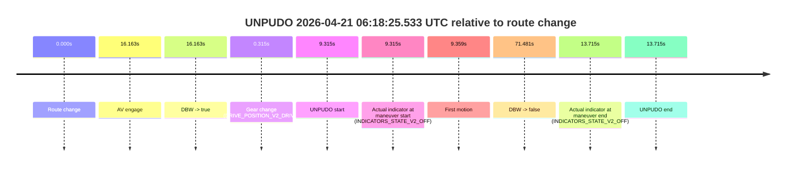
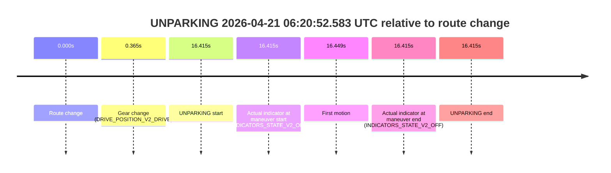

# Run Report: fme20030/2026-04-21--05-59-06--gen2-av-c4de891a-e250-4dc8-8b38-3ae4fc7184b9

| Field | Value |
|---|---|
| Run ID | `fme20030/2026-04-21--05-59-06--gen2-av-c4de891a-e250-4dc8-8b38-3ae4fc7184b9` |
| Date | `2026-04-21` |
| Model(s) | `pink-manta-ray-smooth` |
| Author | `guy.geva` |
| Event count | `2` |

## unpudo 2026-04-21 06:18:25.533 UTC

| Field | Value |
|---|---|
| Model | `pink-manta-ray-smooth` |
| Author | `guy.geva` |
| Run ID | `fme20030/2026-04-21--05-59-06--gen2-av-c4de891a-e250-4dc8-8b38-3ae4fc7184b9` |
| Date | `2026-04-21` |
| Time (UTC) | `06:18:25.533` |
| Event type | `unpudo` |
| Disengagement type | `failed_to_maintain_speed` |
| Route change | `found` |
| Console | [run](https://console.sso.wayve.ai/run/fme20030/2026-04-21--05-59-06--gen2-av-c4de891a-e250-4dc8-8b38-3ae4fc7184b9?id=&time-unixus=1776752305533312) |
| Foxglove | [segment](https://app.foxglove.dev/wayve-on-prem/p/prj_0dX18KZdVHg1fmmI/view?ds=foxglove-stream&ds.deviceName=fme20030&ds.start=2026-04-21T06%3A18%3A06.218354Z&ds.end=2026-04-21T06%3A19%3A37.699611Z&layoutId=lay_0e7VD4WIKDQGU73Y&time=2026-04-21T06%3A18%3A25.533312Z) |

### Event card: non-av

- Non-AV: there is no AV-owned portion anywhere inside the detected unpudo timeline, so it is kept for coverage but excluded from model success / failure scoring.

| Event | Time (UTC) | Delta from route change |
|---|---:|---:|
| Route change | 2026-04-21 06:18:16.218 | `0.000s` |
| AV engage | 2026-04-21 06:18:32.380 | `16.163s` |
| DBW -> true | 2026-04-21 06:18:32.380 | `16.163s` |
| Gear change (DRIVE_POSITION_V2_DRIVE) | 2026-04-21 06:18:16.533 | `0.315s` |
| UNPUDO start | 2026-04-21 06:18:25.533 | `9.315s` |
| Actual indicator at maneuver start (INDICATORS_STATE_V2_OFF) | 2026-04-21 06:18:25.533 | `9.315s` |
| First motion | 2026-04-21 06:18:25.577 | `9.359s` |
| DBW -> false | 2026-04-21 06:19:27.699 | `71.481s` |
| Actual indicator at maneuver end (INDICATORS_STATE_V2_OFF) | 2026-04-21 06:18:29.933 | `13.715s` |
| UNPUDO end | 2026-04-21 06:18:29.933 | `13.715s` |

| Metric | Value |
|---|---|
| Outcome | `non-av` |
| Effective failure type | `none` |
| Route change status | `found` |
| DBW at event start | `false` |
| DBW at event end | `false` |
| Predicted gear at AV start | `DRIVE_POSITION_V2_DRIVE` |
| Actual gear at AV start | `DRIVE_POSITION_V2_DRIVE` |
| Predicted gear at event start | `DRIVE_POSITION_V2_DRIVE` |
| Actual gear at event start | `DRIVE_POSITION_V2_DRIVE` |
| Planned indicator direction | `INDICATORS_STATE_V2_RIGHT_ON` |
| Controller indicator direction | `INDICATORS_STATE_V2_RIGHT_ON` |
| Actual indicator direction | `INDICATORS_STATE_V2_OFF` |
| Actual indicator at maneuver end | `INDICATORS_STATE_V2_OFF` |
| Driver accel help in AV | `false` |
| Driver accel help timestamp | `n/a` |
| Max accel pedal pct in AV | `0.0%` |
| Max brake pedal pct in AV | `0.0%` |
| Max speed mps in AV | `0.000` |
| Route -> AV | `16.163s` |
| AV -> event start | `-6.848s` |
| AV -> first motion | `-6.804s` |
| AV duration before disengagement | `55.319s` |
| Trajectory waypoint count | `38` |
| Driving-plan step count | `11` |

The scored portion starts from the AV-owned window, not from the pre-AV setup. Route-change search in the stopped pre-event segment was `found`, with the baseline therefore set to route change. At the event anchor the model predicts `DRIVE_POSITION_V2_DRIVE` and the actual gear is `DRIVE_POSITION_V2_DRIVE`. The effective model outcome is `non-av` because `there is no AV-owned overlap inside the event timeline`.

### Resolution

| Field | Value |
|---|---|
| Final outcome | `non-av` |
| Do we agree with this label? | `yes` |
| Source disengagement type | `failed_to_maintain_speed` |
| Resolved effective failure type | `none` |
| Confidence | `high` |

## unparking 2026-04-21 06:20:52.583 UTC

| Field | Value |
|---|---|
| Model | `pink-manta-ray-smooth` |
| Author | `guy.geva` |
| Run ID | `fme20030/2026-04-21--05-59-06--gen2-av-c4de891a-e250-4dc8-8b38-3ae4fc7184b9` |
| Date | `2026-04-21` |
| Time (UTC) | `06:20:52.583` |
| Event type | `unparking` |
| Disengagement type | `none observed` |
| Route change | `found` |
| Console | [run](https://console.sso.wayve.ai/run/fme20030/2026-04-21--05-59-06--gen2-av-c4de891a-e250-4dc8-8b38-3ae4fc7184b9?id=&time-unixus=1776752452583296) |
| Foxglove | [segment](https://app.foxglove.dev/wayve-on-prem/p/prj_0dX18KZdVHg1fmmI/view?ds=foxglove-stream&ds.deviceName=fme20030&ds.start=2026-04-21T06%3A20%3A26.168297Z&ds.end=2026-04-21T06%3A21%3A02.583296Z&layoutId=lay_0e7VD4WIKDQGU73Y&time=2026-04-21T06%3A20%3A52.583296Z) |

### Event card: non-av

- Non-AV: there is no AV-owned portion anywhere inside the detected unparking timeline, so it is kept for coverage but excluded from model success / failure scoring.

| Event | Time (UTC) | Delta from route change |
|---|---:|---:|
| Route change | 2026-04-21 06:20:36.168 | `0.000s` |
| Gear change (DRIVE_POSITION_V2_DRIVE) | 2026-04-21 06:20:36.533 | `0.365s` |
| UNPARKING start | 2026-04-21 06:20:52.583 | `16.415s` |
| Actual indicator at maneuver start (INDICATORS_STATE_V2_OFF) | 2026-04-21 06:20:52.583 | `16.415s` |
| First motion | 2026-04-21 06:20:52.616 | `16.449s` |
| Actual indicator at maneuver end (INDICATORS_STATE_V2_OFF) | 2026-04-21 06:20:52.583 | `16.415s` |
| UNPARKING end | 2026-04-21 06:20:52.583 | `16.415s` |

| Metric | Value |
|---|---|
| Outcome | `non-av` |
| Effective failure type | `none` |
| Route change status | `found` |
| DBW at event start | `false` |
| DBW at event end | `false` |
| Predicted gear at AV start | `n/a` |
| Actual gear at AV start | `n/a` |
| Predicted gear at event start | `DRIVE_POSITION_V2_DRIVE` |
| Actual gear at event start | `DRIVE_POSITION_V2_DRIVE` |
| Planned indicator direction | `INDICATORS_STATE_V2_RIGHT_ON` |
| Controller indicator direction | `INDICATORS_STATE_V2_RIGHT_ON` |
| Actual indicator direction | `INDICATORS_STATE_V2_OFF` |
| Actual indicator at maneuver end | `INDICATORS_STATE_V2_OFF` |
| Driver accel help in AV | `false` |
| Driver accel help timestamp | `n/a` |
| Max accel pedal pct in AV | `0.0%` |
| Max brake pedal pct in AV | `0.0%` |
| Max speed mps in AV | `0.000` |
| Route -> AV | `n/a` |
| AV -> event start | `n/a` |
| AV -> first motion | `n/a` |
| AV duration before disengagement | `n/a` |
| Trajectory waypoint count | `37` |
| Driving-plan step count | `11` |

The scored portion starts from the AV-owned window, not from the pre-AV setup. Route-change search in the stopped pre-event segment was `found`, with the baseline therefore set to route change. At the event anchor the model predicts `DRIVE_POSITION_V2_DRIVE` and the actual gear is `DRIVE_POSITION_V2_DRIVE`. The effective model outcome is `non-av` because `there is no AV-owned overlap inside the event timeline`.

### Resolution

| Field | Value |
|---|---|
| Final outcome | `non-av` |
| Do we agree with this label? | `yes` |
| Source disengagement type | `none observed` |
| Resolved effective failure type | `none` |
| Confidence | `high` |
