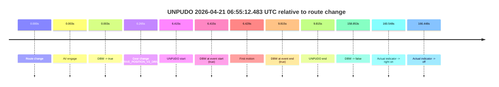
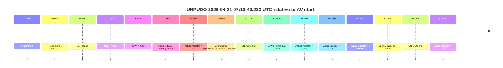

# Run Report: fme20030/2026-04-21--06-49-32--gen2-av-e24472f4-4747-4bf9-acc4-4dc2657fb7d4

| Field | Value |
|---|---|
| Run ID | `fme20030/2026-04-21--06-49-32--gen2-av-e24472f4-4747-4bf9-acc4-4dc2657fb7d4` |
| Date | `2026-04-21` |
| Model(s) | `pink-manta-ray-smooth` |
| Author | `guy.geva` |
| Event count | `2` |

## unpudo 2026-04-21 06:55:12.483 UTC

| Field | Value |
|---|---|
| Model | `pink-manta-ray-smooth` |
| Author | `guy.geva` |
| Run ID | `fme20030/2026-04-21--06-49-32--gen2-av-e24472f4-4747-4bf9-acc4-4dc2657fb7d4` |
| Date | `2026-04-21` |
| Time (UTC) | `06:55:12.483` |
| Event type | `unpudo` |
| Disengagement type | `none observed` |
| Route change | `found` |
| Console | [run](https://console.sso.wayve.ai/run/fme20030/2026-04-21--06-49-32--gen2-av-e24472f4-4747-4bf9-acc4-4dc2657fb7d4?id=&time-unixus=1776754512483316) |
| Foxglove | [segment](https://app.foxglove.dev/wayve-on-prem/p/prj_0dX18KZdVHg1fmmI/view?ds=foxglove-stream&ds.deviceName=fme20030&ds.start=2026-04-21T06%3A54%3A56.068377Z&ds.end=2026-04-21T06%3A57%3A54.921325Z&layoutId=lay_0e7VD4WIKDQGU73Y&time=2026-04-21T06%3A55%3A12.483316Z) |

### Event card: pass

- Pass: AV owns the credited unpudo from route change through the official unpudo window, the gear state is aligned at the anchor, and the vehicle moves without driver accelerator help in AV.

| Event | Time (UTC) | Delta from route change |
|---|---:|---:|
| Route change | 2026-04-21 06:55:06.068 | `0.000s` |
| AV engage | 2026-04-21 06:55:06.071 | `0.003s` |
| DBW -> true | 2026-04-21 06:55:06.071 | `0.003s` |
| Gear change (DRIVE_POSITION_V2_DRIVE) | 2026-04-21 06:55:06.333 | `0.265s` |
| UNPUDO start | 2026-04-21 06:55:12.483 | `6.415s` |
| DBW at event start (true) | 2026-04-21 06:55:12.483 | `6.415s` |
| First motion | 2026-04-21 06:55:12.497 | `6.429s` |
| DBW at event end (true) | 2026-04-21 06:55:15.883 | `9.815s` |
| UNPUDO end | 2026-04-21 06:55:15.883 | `9.815s` |
| DBW -> false | 2026-04-21 06:57:44.921 | `158.853s` |
| Actual indicator -> right on | 2026-04-21 06:57:46.616 | `160.548s` |
| Actual indicator -> off | 2026-04-21 06:57:52.516 | `166.448s` |

| Metric | Value |
|---|---|
| Outcome | `pass` |
| Effective failure type | `none` |
| Route change status | `found` |
| DBW at event start | `true` |
| DBW at event end | `true` |
| Predicted gear at AV start | `DRIVE_POSITION_V2_PARK` |
| Actual gear at AV start | `DRIVE_POSITION_V2_PARK` |
| Predicted gear at event start | `DRIVE_POSITION_V2_DRIVE` |
| Actual gear at event start | `DRIVE_POSITION_V2_DRIVE` |
| Planned indicator direction | `INDICATORS_STATE_V2_LEFT_ON` |
| Controller indicator direction | `INDICATORS_STATE_V2_LEFT_ON` |
| Actual indicator direction | `INDICATORS_STATE_V2_OFF` |
| Actual indicator at maneuver end | `INDICATORS_STATE_V2_OFF` |
| Driver accel help in AV | `false` |
| Driver accel help timestamp | `n/a` |
| Max accel pedal pct in AV | `0.0%` |
| Max brake pedal pct in AV | `8.0%` |
| Max speed mps in AV | `4.867` |
| Success timing baseline | `route change` |
| Route -> AV | `0.003s` |
| AV -> event start | `6.412s` |
| AV -> first motion | `6.426s` |
| Success baseline -> event start | `6.415s` |
| Success baseline -> first motion | `6.429s` |
| AV duration before disengagement | `158.850s` |
| Trajectory waypoint count | `37` |
| Driving-plan step count | `11` |

The scored portion starts from the AV-owned window, not from the pre-AV setup. Route-change search in the stopped pre-event segment was `found`, with the baseline therefore set to route change. At the event anchor the model predicts `DRIVE_POSITION_V2_DRIVE` and the actual gear is `DRIVE_POSITION_V2_DRIVE`. The effective model outcome is `pass` because `the credited unpudo stays AV-owned through the official unpudo window.`

### Resolution

| Field | Value |
|---|---|
| Final outcome | `pass` |
| Do we agree with this label? | `yes` |
| Source disengagement type | `none observed` |
| Resolved effective failure type | `none` |
| Confidence | `high` |

## unpudo 2026-04-21 07:10:43.233 UTC

| Field | Value |
|---|---|
| Model | `pink-manta-ray-smooth` |
| Author | `guy.geva` |
| Run ID | `fme20030/2026-04-21--06-49-32--gen2-av-e24472f4-4747-4bf9-acc4-4dc2657fb7d4` |
| Date | `2026-04-21` |
| Time (UTC) | `07:10:43.233` |
| Event type | `unpudo` |
| Disengagement type | `none observed` |
| Route change | `unclear` |
| Console | [run](https://console.sso.wayve.ai/run/fme20030/2026-04-21--06-49-32--gen2-av-e24472f4-4747-4bf9-acc4-4dc2657fb7d4?id=&time-unixus=1776755443233302) |
| Foxglove | [segment](https://app.foxglove.dev/wayve-on-prem/p/prj_0dX18KZdVHg1fmmI/view?ds=foxglove-stream&ds.deviceName=fme20030&ds.start=2026-04-21T07%3A10%3A02.121660Z&ds.end=2026-04-21T07%3A11%3A22.383295Z&layoutId=lay_0e7VD4WIKDQGU73Y&time=2026-04-21T07%3A10%3A43.233302Z) |

### Event card: fail

- Fail: the credited unpudo does not stay AV-owned. The event window starts with DBW false, and the maneuver outcome lands outside a clean AV-owned segment.

| Event | Time (UTC) | Delta from AV start |
|---|---:|---:|
| First motion | 2026-04-21 07:09:51.256 | `-20.865s` |
| Route change unclear | 2026-04-21 07:10:12.121 | `0.000s` |
| AV engage | 2026-04-21 07:10:12.121 | `0.000s` |
| DBW -> true | 2026-04-21 07:10:12.121 | `0.000s` |
| DBW -> false | 2026-04-21 07:10:18.461 | `6.340s` |
| Actual indicator already left on | 2026-04-21 07:10:33.236 | `21.115s` |
| Actual indicator -> off | 2026-04-21 07:10:36.476 | `24.355s` |
| Gear change (DRIVE_POSITION_V2_REVERSE) | 2026-04-21 07:10:40.183 | `28.062s` |
| UNPUDO start | 2026-04-21 07:10:43.233 | `31.112s` |
| DBW at event start (false) | 2026-04-21 07:10:43.233 | `31.112s` |
| Actual indicator -> right on | 2026-04-21 07:11:05.476 | `53.355s` |
| Actual indicator -> off | 2026-04-21 07:11:07.416 | `55.295s` |
| Actual indicator -> left on | 2026-04-21 07:11:07.517 | `55.396s` |
| DBW at event end (false) | 2026-04-21 07:11:12.383 | `60.262s` |
| UNPUDO end | 2026-04-21 07:11:12.383 | `60.262s` |
| Actual indicator -> off | 2026-04-21 07:11:13.977 | `61.856s` |

| Metric | Value |
|---|---|
| Outcome | `fail` |
| Effective failure type | `completed_outside_av` |
| Route change status | `unclear` |
| DBW at event start | `false` |
| DBW at event end | `false` |
| Predicted gear at AV start | `DRIVE_POSITION_V2_DRIVE` |
| Actual gear at AV start | `DRIVE_POSITION_V2_DRIVE` |
| Predicted gear at event start | `DRIVE_POSITION_V2_REVERSE` |
| Actual gear at event start | `DRIVE_POSITION_V2_REVERSE` |
| Planned indicator direction | `INDICATORS_STATE_V2_OFF` |
| Controller indicator direction | `INDICATORS_STATE_V2_OFF` |
| Actual indicator direction | `INDICATORS_STATE_V2_OFF` |
| Actual indicator at maneuver end | `INDICATORS_STATE_V2_LEFT_ON` |
| Driver accel help in AV | `false` |
| Driver accel help timestamp | `n/a` |
| Max accel pedal pct in AV | `0.0%` |
| Max brake pedal pct in AV | `8.0%` |
| Max speed mps in AV | `0.078` |
| Success timing baseline | `AV start` |
| Route -> AV | `n/a` |
| AV -> event start | `31.112s` |
| AV -> first motion | `-20.865s` |
| Success baseline -> event start | `31.112s` |
| Success baseline -> first motion | `-20.865s` |
| AV duration before disengagement | `6.340s` |
| Trajectory waypoint count | `36` |
| Driving-plan step count | `11` |

The scored portion starts from the AV-owned window, not from the pre-AV setup. Route-change search in the stopped pre-event segment was `unclear`, with the baseline therefore set to AV start. At the event anchor the model predicts `DRIVE_POSITION_V2_REVERSE` and the actual gear is `DRIVE_POSITION_V2_REVERSE`. The effective model outcome is `fail` because `completed_outside_av.`

### Resolution

| Field | Value |
|---|---|
| Final outcome | `fail` |
| Do we agree with this label? | `yes` |
| Source disengagement type | `none observed` |
| Resolved effective failure type | `completed_outside_av` |
| Confidence | `medium` |
