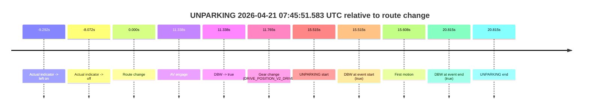

# Run Report: fme20030/2026-04-21--07-40-51--gen2-av-4de6fe33-f7ef-472d-a206-344172f429e4

| Field | Value |
|---|---|
| Run ID | `fme20030/2026-04-21--07-40-51--gen2-av-4de6fe33-f7ef-472d-a206-344172f429e4` |
| Date | `2026-04-21` |
| Model(s) | `eel-teal-outspoken` |
| Author | `zak` |
| Event count | `1` |

## unparking 2026-04-21 07:45:51.583 UTC

| Field | Value |
|---|---|
| Model | `eel-teal-outspoken` |
| Author | `zak` |
| Run ID | `fme20030/2026-04-21--07-40-51--gen2-av-4de6fe33-f7ef-472d-a206-344172f429e4` |
| Date | `2026-04-21` |
| Time (UTC) | `07:45:51.583` |
| Event type | `unparking` |
| Disengagement type | `none observed` |
| Route change | `found` |
| Console | [run](https://console.sso.wayve.ai/run/fme20030/2026-04-21--07-40-51--gen2-av-4de6fe33-f7ef-472d-a206-344172f429e4?id=&time-unixus=1776757551583306) |
| Foxglove | [segment](https://app.foxglove.dev/wayve-on-prem/p/prj_0dX18KZdVHg1fmmI/view?ds=foxglove-stream&ds.deviceName=fme20030&ds.start=2026-04-21T07%3A45%3A26.068334Z&ds.end=2026-04-21T07%3A46%3A06.883321Z&layoutId=lay_0e7VD4WIKDQGU73Y&time=2026-04-21T07%3A45%3A51.583306Z) |

### Event card: pass

- Pass: AV owns the credited unparking through the official event window, the gear state is aligned at the anchor, and the vehicle moves without driver accelerator help in AV.

| Event | Time (UTC) | Delta from route change |
|---|---:|---:|
| Actual indicator -> left on | 2026-04-21 07:45:26.776 | `-9.292s` |
| Actual indicator -> off | 2026-04-21 07:45:27.996 | `-8.072s` |
| Route change | 2026-04-21 07:45:36.068 | `0.000s` |
| AV engage | 2026-04-21 07:45:47.406 | `11.338s` |
| DBW -> true | 2026-04-21 07:45:47.406 | `11.338s` |
| Gear change (DRIVE_POSITION_V2_DRIVE) | 2026-04-21 07:45:47.833 | `11.765s` |
| UNPARKING start | 2026-04-21 07:45:51.583 | `15.515s` |
| DBW at event start (true) | 2026-04-21 07:45:51.583 | `15.515s` |
| First motion | 2026-04-21 07:45:51.676 | `15.608s` |
| DBW at event end (true) | 2026-04-21 07:45:56.883 | `20.815s` |
| UNPARKING end | 2026-04-21 07:45:56.883 | `20.815s` |

| Metric | Value |
|---|---|
| Outcome | `pass` |
| Effective failure type | `none` |
| Route change status | `found` |
| DBW at event start | `true` |
| DBW at event end | `true` |
| Predicted gear at AV start | `DRIVE_POSITION_V2_DRIVE` |
| Actual gear at AV start | `DRIVE_POSITION_V2_PARK` |
| Predicted gear at event start | `DRIVE_POSITION_V2_DRIVE` |
| Actual gear at event start | `DRIVE_POSITION_V2_DRIVE` |
| Planned indicator direction | `INDICATORS_STATE_V2_LEFT_ON` |
| Controller indicator direction | `INDICATORS_STATE_V2_LEFT_ON` |
| Actual indicator direction | `INDICATORS_STATE_V2_OFF` |
| Actual indicator at maneuver end | `INDICATORS_STATE_V2_OFF` |
| Driver accel help in AV | `false` |
| Driver accel help timestamp | `n/a` |
| Max accel pedal pct in AV | `0.0%` |
| Max brake pedal pct in AV | `0.0%` |
| Max speed mps in AV | `2.553` |
| Success timing baseline | `route change` |
| Route -> AV | `11.338s` |
| AV -> event start | `4.177s` |
| AV -> first motion | `4.270s` |
| Success baseline -> event start | `15.515s` |
| Success baseline -> first motion | `15.608s` |
| AV duration before disengagement | `n/a` |
| Trajectory waypoint count | `36` |
| Driving-plan step count | `11` |

The scored portion starts from the AV-owned window, not from the pre-AV setup. Route-change search in the stopped pre-event segment was `found`, with the baseline therefore set to route change. At the event anchor the model predicts `DRIVE_POSITION_V2_DRIVE` and the actual gear is `DRIVE_POSITION_V2_DRIVE`. The effective model outcome is `pass` because `the credited maneuver stays AV-owned through the official event end.`

### Resolution

| Field | Value |
|---|---|
| Final outcome | `pass` |
| Do we agree with this label? | `yes` |
| Source disengagement type | `none observed` |
| Resolved effective failure type | `none` |
| Confidence | `high` |
