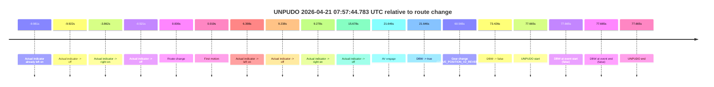

# Run Report: fme20030/2026-04-21--07-53-27--gen2-av-fd3582e1-4118-4df4-b3a2-9f9db0773e25

| Field | Value |
|---|---|
| Run ID | `fme20030/2026-04-21--07-53-27--gen2-av-fd3582e1-4118-4df4-b3a2-9f9db0773e25` |
| Date | `2026-04-21` |
| Model(s) | `eel-teal-outspoken` |
| Author | `zak` |
| Event count | `1` |

## unpudo 2026-04-21 07:57:44.783 UTC

| Field | Value |
|---|---|
| Model | `eel-teal-outspoken` |
| Author | `zak` |
| Run ID | `fme20030/2026-04-21--07-53-27--gen2-av-fd3582e1-4118-4df4-b3a2-9f9db0773e25` |
| Date | `2026-04-21` |
| Time (UTC) | `07:57:44.783` |
| Event type | `unpudo` |
| Disengagement type | `uncategorised` |
| Route change | `found` |
| Console | [run](https://console.sso.wayve.ai/run/fme20030/2026-04-21--07-53-27--gen2-av-fd3582e1-4118-4df4-b3a2-9f9db0773e25?id=&time-unixus=1776758264783316) |
| Foxglove | [segment](https://app.foxglove.dev/wayve-on-prem/p/prj_0dX18KZdVHg1fmmI/view?ds=foxglove-stream&ds.deviceName=fme20030&ds.start=2026-04-21T07%3A56%3A17.118240Z&ds.end=2026-04-21T07%3A57%3A54.783316Z&layoutId=lay_0e7VD4WIKDQGU73Y&time=2026-04-21T07%3A57%3A44.783316Z) |

### Event card: fail

- Fail: AV owns part of the segment, but the event still resolves as a model-performance failure under the AV-only scoring rule.

| Event | Time (UTC) | Delta from route change |
|---|---:|---:|
| Actual indicator already left on | 2026-04-21 07:56:17.136 | `-9.981s` |
| Actual indicator -> off | 2026-04-21 07:56:17.196 | `-9.922s` |
| Actual indicator -> right on | 2026-04-21 07:56:23.256 | `-3.862s` |
| Actual indicator -> off | 2026-04-21 07:56:26.597 | `-0.521s` |
| Route change | 2026-04-21 07:56:27.118 | `0.000s` |
| First motion | 2026-04-21 07:56:27.136 | `0.019s` |
| Actual indicator -> left on | 2026-04-21 07:56:33.516 | `6.398s` |
| Actual indicator -> off | 2026-04-21 07:56:36.356 | `9.238s` |
| Actual indicator -> right on | 2026-04-21 07:56:36.396 | `9.278s` |
| Actual indicator -> off | 2026-04-21 07:56:42.796 | `15.678s` |
| AV engage | 2026-04-21 07:56:48.764 | `21.646s` |
| DBW -> true | 2026-04-21 07:56:48.764 | `21.646s` |
| Gear change (DRIVE_POSITION_V2_REVERSE) | 2026-04-21 07:57:27.683 | `60.565s` |
| DBW -> false | 2026-04-21 07:57:40.544 | `73.426s` |
| UNPUDO start | 2026-04-21 07:57:44.783 | `77.665s` |
| DBW at event start (false) | 2026-04-21 07:57:44.783 | `77.665s` |
| DBW at event end (false) | 2026-04-21 07:57:44.783 | `77.665s` |
| UNPUDO end | 2026-04-21 07:57:44.783 | `77.665s` |

| Metric | Value |
|---|---|
| Outcome | `fail` |
| Effective failure type | `uncategorised` |
| Route change status | `found` |
| DBW at event start | `false` |
| DBW at event end | `false` |
| Predicted gear at AV start | `DRIVE_POSITION_V2_DRIVE` |
| Actual gear at AV start | `DRIVE_POSITION_V2_DRIVE` |
| Predicted gear at event start | `DRIVE_POSITION_V2_REVERSE` |
| Actual gear at event start | `DRIVE_POSITION_V2_REVERSE` |
| Planned indicator direction | `INDICATORS_STATE_V2_OFF` |
| Controller indicator direction | `INDICATORS_STATE_V2_OFF` |
| Actual indicator direction | `INDICATORS_STATE_V2_OFF` |
| Actual indicator at maneuver end | `INDICATORS_STATE_V2_OFF` |
| Driver accel help in AV | `false` |
| Driver accel help timestamp | `n/a` |
| Max accel pedal pct in AV | `0.0%` |
| Max brake pedal pct in AV | `12.6%` |
| Max speed mps in AV | `5.044` |
| Success timing baseline | `route change` |
| Route -> AV | `21.646s` |
| AV -> event start | `56.019s` |
| AV -> first motion | `-21.628s` |
| Success baseline -> event start | `77.665s` |
| Success baseline -> first motion | `0.019s` |
| AV duration before disengagement | `51.780s` |
| Trajectory waypoint count | `37` |
| Driving-plan step count | `11` |

The scored portion starts from the AV-owned window, not from the pre-AV setup. Route-change search in the stopped pre-event segment was `found`, with the baseline therefore set to route change. At the event anchor the model predicts `DRIVE_POSITION_V2_REVERSE` and the actual gear is `DRIVE_POSITION_V2_REVERSE`. The effective model outcome is `fail` because `uncategorised.`

### Resolution

| Field | Value |
|---|---|
| Final outcome | `fail` |
| Do we agree with this label? | `yes` |
| Source disengagement type | `uncategorised` |
| Resolved effective failure type | `uncategorised` |
| Confidence | `high` |
