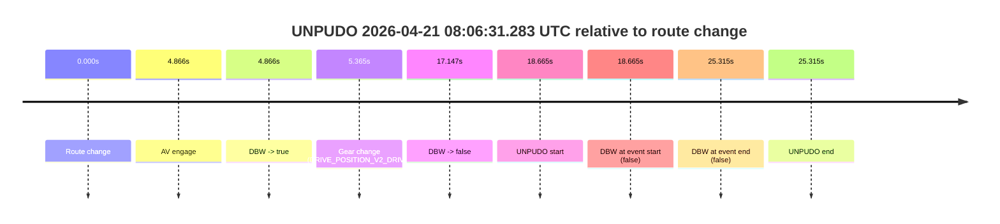

# Run Report: fme20030/2026-04-21--07-53-27--gen2-av-fd3582e1-4118-4df4-b3a2-9f9db0773e25

| Field | Value |
|---|---|
| Run ID | `fme20030/2026-04-21--07-53-27--gen2-av-fd3582e1-4118-4df4-b3a2-9f9db0773e25` |
| Date | `2026-04-21` |
| Model(s) | `pink-manta-ray-smooth` |
| Author | `guy.geva` |
| Event count | `1` |

## unpudo 2026-04-21 08:06:31.283 UTC

| Field | Value |
|---|---|
| Model | `pink-manta-ray-smooth` |
| Author | `guy.geva` |
| Run ID | `fme20030/2026-04-21--07-53-27--gen2-av-fd3582e1-4118-4df4-b3a2-9f9db0773e25` |
| Date | `2026-04-21` |
| Time (UTC) | `08:06:31.283` |
| Event type | `unpudo` |
| Disengagement type | `none observed` |
| Route change | `found` |
| Console | [run](https://console.sso.wayve.ai/run/fme20030/2026-04-21--07-53-27--gen2-av-fd3582e1-4118-4df4-b3a2-9f9db0773e25?id=&time-unixus=1776758791283298) |
| Foxglove | [segment](https://app.foxglove.dev/wayve-on-prem/p/prj_0dX18KZdVHg1fmmI/view?ds=foxglove-stream&ds.deviceName=fme20030&ds.start=2026-04-21T08%3A06%3A02.618269Z&ds.end=2026-04-21T08%3A06%3A47.933300Z&layoutId=lay_0e7VD4WIKDQGU73Y&time=2026-04-21T08%3A06%3A31.283298Z) |

### Event card: fail

- Fail: the credited unpudo does not stay AV-owned. The event window starts with DBW false, and the maneuver outcome lands outside a clean AV-owned segment.

| Event | Time (UTC) | Delta from route change |
|---|---:|---:|
| Route change | 2026-04-21 08:06:12.618 | `0.000s` |
| AV engage | 2026-04-21 08:06:17.484 | `4.866s` |
| DBW -> true | 2026-04-21 08:06:17.484 | `4.866s` |
| Gear change (DRIVE_POSITION_V2_DRIVE) | 2026-04-21 08:06:17.983 | `5.365s` |
| DBW -> false | 2026-04-21 08:06:29.765 | `17.147s` |
| UNPUDO start | 2026-04-21 08:06:31.283 | `18.665s` |
| DBW at event start (false) | 2026-04-21 08:06:31.283 | `18.665s` |
| DBW at event end (false) | 2026-04-21 08:06:37.933 | `25.315s` |
| UNPUDO end | 2026-04-21 08:06:37.933 | `25.315s` |

| Metric | Value |
|---|---|
| Outcome | `fail` |
| Effective failure type | `not_av_owned` |
| Route change status | `found` |
| DBW at event start | `false` |
| DBW at event end | `false` |
| Predicted gear at AV start | `DRIVE_POSITION_V2_DRIVE` |
| Actual gear at AV start | `DRIVE_POSITION_V2_PARK` |
| Predicted gear at event start | `DRIVE_POSITION_V2_DRIVE` |
| Actual gear at event start | `DRIVE_POSITION_V2_DRIVE` |
| Planned indicator direction | `INDICATORS_STATE_V2_LEFT_ON` |
| Controller indicator direction | `INDICATORS_STATE_V2_LEFT_ON` |
| Actual indicator direction | `INDICATORS_STATE_V2_OFF` |
| Actual indicator at maneuver end | `INDICATORS_STATE_V2_OFF` |
| Driver accel help in AV | `false` |
| Driver accel help timestamp | `n/a` |
| Max accel pedal pct in AV | `0.0%` |
| Max brake pedal pct in AV | `8.0%` |
| Max speed mps in AV | `0.000` |
| Success timing baseline | `route change` |
| Route -> AV | `4.866s` |
| AV -> event start | `13.799s` |
| AV -> first motion | `n/a` |
| Success baseline -> event start | `18.665s` |
| Success baseline -> first motion | `n/a` |
| AV duration before disengagement | `12.281s` |
| Trajectory waypoint count | `37` |
| Driving-plan step count | `11` |

The scored portion starts from the AV-owned window, not from the pre-AV setup. Route-change search in the stopped pre-event segment was `found`, with the baseline therefore set to route change. At the event anchor the model predicts `DRIVE_POSITION_V2_DRIVE` and the actual gear is `DRIVE_POSITION_V2_DRIVE`. The effective model outcome is `fail` because `not_av_owned.`

### Resolution

| Field | Value |
|---|---|
| Final outcome | `fail` |
| Do we agree with this label? | `yes` |
| Source disengagement type | `none observed` |
| Resolved effective failure type | `not_av_owned` |
| Confidence | `high` |
