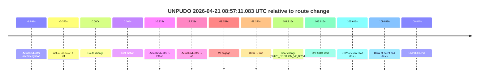

# Run Report: fme20030/2026-04-21--08-46-46--gen2-av-42ce672b-9055-4616-ada6-7ef452149847

| Field | Value |
|---|---|
| Run ID | `fme20030/2026-04-21--08-46-46--gen2-av-42ce672b-9055-4616-ada6-7ef452149847` |
| Date | `2026-04-21` |
| Model(s) | `eel-teal-outspoken` |
| Author | `zak` |
| Event count | `2` |

## unpudo 2026-04-21 08:56:37.683 UTC

| Field | Value |
|---|---|
| Model | `eel-teal-outspoken` |
| Author | `zak` |
| Run ID | `fme20030/2026-04-21--08-46-46--gen2-av-42ce672b-9055-4616-ada6-7ef452149847` |
| Date | `2026-04-21` |
| Time (UTC) | `08:56:37.683` |
| Event type | `unpudo` |
| Disengagement type | `none observed` |
| Route change | `found` |
| Console | [run](https://console.sso.wayve.ai/run/fme20030/2026-04-21--08-46-46--gen2-av-42ce672b-9055-4616-ada6-7ef452149847?id=&time-unixus=1776761797683295) |
| Foxglove | [segment](https://app.foxglove.dev/wayve-on-prem/p/prj_0dX18KZdVHg1fmmI/view?ds=foxglove-stream&ds.deviceName=fme20030&ds.start=2026-04-21T08%3A55%3A15.468559Z&ds.end=2026-04-21T08%3A56%3A51.283298Z&layoutId=lay_0e7VD4WIKDQGU73Y&time=2026-04-21T08%3A56%3A37.683295Z) |

### Event card: pass

- Pass: AV owns the credited unpudo from route change through the official unpudo window, the gear state is aligned at the anchor, and the vehicle moves without driver accelerator help in AV.

| Event | Time (UTC) | Delta from route change |
|---|---:|---:|
| Actual indicator already right on | 2026-04-21 08:55:15.477 | `-9.991s` |
| Actual indicator -> off | 2026-04-21 08:55:25.096 | `-0.372s` |
| Route change | 2026-04-21 08:55:25.468 | `0.000s` |
| First motion | 2026-04-21 08:55:25.476 | `0.008s` |
| Actual indicator -> left on | 2026-04-21 08:55:36.296 | `10.828s` |
| Actual indicator -> off | 2026-04-21 08:55:38.197 | `12.729s` |
| AV engage | 2026-04-21 08:56:33.619 | `68.151s` |
| DBW -> true | 2026-04-21 08:56:33.619 | `68.151s` |
| Gear change (DRIVE_POSITION_V2_DRIVE) | 2026-04-21 08:56:34.083 | `68.615s` |
| UNPUDO start | 2026-04-21 08:56:37.683 | `72.215s` |
| DBW at event start (true) | 2026-04-21 08:56:37.683 | `72.215s` |
| DBW at event end (true) | 2026-04-21 08:56:41.283 | `75.815s` |
| UNPUDO end | 2026-04-21 08:56:41.283 | `75.815s` |

| Metric | Value |
|---|---|
| Outcome | `pass` |
| Effective failure type | `none` |
| Route change status | `found` |
| DBW at event start | `true` |
| DBW at event end | `true` |
| Predicted gear at AV start | `DRIVE_POSITION_V2_DRIVE` |
| Actual gear at AV start | `DRIVE_POSITION_V2_PARK` |
| Predicted gear at event start | `DRIVE_POSITION_V2_DRIVE` |
| Actual gear at event start | `DRIVE_POSITION_V2_DRIVE` |
| Planned indicator direction | `INDICATORS_STATE_V2_RIGHT_ON` |
| Controller indicator direction | `INDICATORS_STATE_V2_RIGHT_ON` |
| Actual indicator direction | `INDICATORS_STATE_V2_OFF` |
| Actual indicator at maneuver end | `INDICATORS_STATE_V2_OFF` |
| Driver accel help in AV | `false` |
| Driver accel help timestamp | `n/a` |
| Max accel pedal pct in AV | `0.0%` |
| Max brake pedal pct in AV | `8.0%` |
| Max speed mps in AV | `4.856` |
| Success timing baseline | `route change` |
| Route -> AV | `68.151s` |
| AV -> event start | `4.064s` |
| AV -> first motion | `-68.143s` |
| Success baseline -> event start | `72.215s` |
| Success baseline -> first motion | `0.008s` |
| AV duration before disengagement | `n/a` |
| Trajectory waypoint count | `37` |
| Driving-plan step count | `11` |

The scored portion starts from the AV-owned window, not from the pre-AV setup. Route-change search in the stopped pre-event segment was `found`, with the baseline therefore set to route change. At the event anchor the model predicts `DRIVE_POSITION_V2_DRIVE` and the actual gear is `DRIVE_POSITION_V2_DRIVE`. The effective model outcome is `pass` because `the credited unpudo stays AV-owned through the official unpudo window.`

### Resolution

| Field | Value |
|---|---|
| Final outcome | `pass` |
| Do we agree with this label? | `yes` |
| Source disengagement type | `none observed` |
| Resolved effective failure type | `none` |
| Confidence | `high` |

## unpudo 2026-04-21 08:57:11.083 UTC

| Field | Value |
|---|---|
| Model | `eel-teal-outspoken` |
| Author | `zak` |
| Run ID | `fme20030/2026-04-21--08-46-46--gen2-av-42ce672b-9055-4616-ada6-7ef452149847` |
| Date | `2026-04-21` |
| Time (UTC) | `08:57:11.083` |
| Event type | `unpudo` |
| Disengagement type | `none observed` |
| Route change | `found` |
| Console | [run](https://console.sso.wayve.ai/run/fme20030/2026-04-21--08-46-46--gen2-av-42ce672b-9055-4616-ada6-7ef452149847?id=&time-unixus=1776761831083310) |
| Foxglove | [segment](https://app.foxglove.dev/wayve-on-prem/p/prj_0dX18KZdVHg1fmmI/view?ds=foxglove-stream&ds.deviceName=fme20030&ds.start=2026-04-21T08%3A55%3A15.468559Z&ds.end=2026-04-21T08%3A57%3A25.283295Z&layoutId=lay_0e7VD4WIKDQGU73Y&time=2026-04-21T08%3A57%3A11.083310Z) |

### Event card: pass

- Pass: AV owns the credited unpudo from route change through the official unpudo window, the gear state is aligned at the anchor, and the vehicle moves without driver accelerator help in AV.

| Event | Time (UTC) | Delta from route change |
|---|---:|---:|
| Actual indicator already right on | 2026-04-21 08:55:15.477 | `-9.991s` |
| Actual indicator -> off | 2026-04-21 08:55:25.096 | `-0.372s` |
| Route change | 2026-04-21 08:55:25.468 | `0.000s` |
| First motion | 2026-04-21 08:55:25.476 | `0.008s` |
| Actual indicator -> left on | 2026-04-21 08:55:36.296 | `10.828s` |
| Actual indicator -> off | 2026-04-21 08:55:38.197 | `12.729s` |
| AV engage | 2026-04-21 08:56:33.619 | `68.151s` |
| DBW -> true | 2026-04-21 08:56:33.619 | `68.151s` |
| Gear change (DRIVE_POSITION_V2_DRIVE) | 2026-04-21 08:57:07.383 | `101.915s` |
| UNPUDO start | 2026-04-21 08:57:11.083 | `105.615s` |
| DBW at event start (true) | 2026-04-21 08:57:11.083 | `105.615s` |
| DBW at event end (true) | 2026-04-21 08:57:15.283 | `109.815s` |
| UNPUDO end | 2026-04-21 08:57:15.283 | `109.815s` |

| Metric | Value |
|---|---|
| Outcome | `pass` |
| Effective failure type | `none` |
| Route change status | `found` |
| DBW at event start | `true` |
| DBW at event end | `true` |
| Predicted gear at AV start | `DRIVE_POSITION_V2_DRIVE` |
| Actual gear at AV start | `DRIVE_POSITION_V2_PARK` |
| Predicted gear at event start | `DRIVE_POSITION_V2_DRIVE` |
| Actual gear at event start | `DRIVE_POSITION_V2_DRIVE` |
| Planned indicator direction | `INDICATORS_STATE_V2_RIGHT_ON` |
| Controller indicator direction | `INDICATORS_STATE_V2_RIGHT_ON` |
| Actual indicator direction | `INDICATORS_STATE_V2_OFF` |
| Actual indicator at maneuver end | `INDICATORS_STATE_V2_OFF` |
| Driver accel help in AV | `false` |
| Driver accel help timestamp | `n/a` |
| Max accel pedal pct in AV | `0.0%` |
| Max brake pedal pct in AV | `14.1%` |
| Max speed mps in AV | `6.953` |
| Success timing baseline | `route change` |
| Route -> AV | `68.151s` |
| AV -> event start | `37.464s` |
| AV -> first motion | `-68.143s` |
| Success baseline -> event start | `105.615s` |
| Success baseline -> first motion | `0.008s` |
| AV duration before disengagement | `n/a` |
| Trajectory waypoint count | `37` |
| Driving-plan step count | `11` |

The scored portion starts from the AV-owned window, not from the pre-AV setup. Route-change search in the stopped pre-event segment was `found`, with the baseline therefore set to route change. At the event anchor the model predicts `DRIVE_POSITION_V2_DRIVE` and the actual gear is `DRIVE_POSITION_V2_DRIVE`. The effective model outcome is `pass` because `the credited unpudo stays AV-owned through the official unpudo window.`

### Resolution

| Field | Value |
|---|---|
| Final outcome | `pass` |
| Do we agree with this label? | `yes` |
| Source disengagement type | `none observed` |
| Resolved effective failure type | `none` |
| Confidence | `high` |
