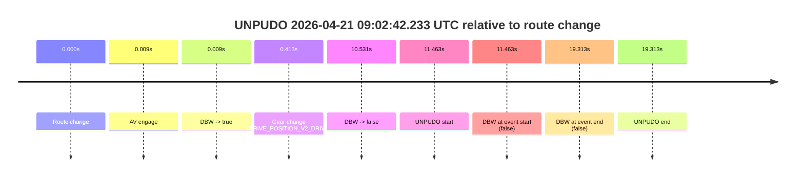
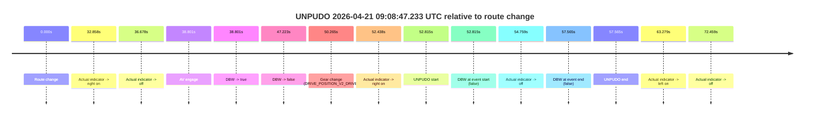
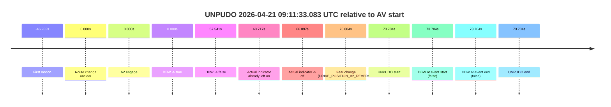

# Run Report: fme20030/2026-04-21--08-46-46--gen2-av-42ce672b-9055-4616-ada6-7ef452149847

| Field | Value |
|---|---|
| Run ID | `fme20030/2026-04-21--08-46-46--gen2-av-42ce672b-9055-4616-ada6-7ef452149847` |
| Date | `2026-04-21` |
| Model(s) | `pink-manta-ray-smooth` |
| Author | `guy.geva` |
| Event count | `3` |

## unpudo 2026-04-21 09:02:42.233 UTC

| Field | Value |
|---|---|
| Model | `pink-manta-ray-smooth` |
| Author | `guy.geva` |
| Run ID | `fme20030/2026-04-21--08-46-46--gen2-av-42ce672b-9055-4616-ada6-7ef452149847` |
| Date | `2026-04-21` |
| Time (UTC) | `09:02:42.233` |
| Event type | `unpudo` |
| Disengagement type | `none observed` |
| Route change | `found` |
| Console | [run](https://console.sso.wayve.ai/run/fme20030/2026-04-21--08-46-46--gen2-av-42ce672b-9055-4616-ada6-7ef452149847?id=&time-unixus=1776762162233315) |
| Foxglove | [segment](https://app.foxglove.dev/wayve-on-prem/p/prj_0dX18KZdVHg1fmmI/view?ds=foxglove-stream&ds.deviceName=fme20030&ds.start=2026-04-21T09%3A02%3A20.770236Z&ds.end=2026-04-21T09%3A03%3A00.083304Z&layoutId=lay_0e7VD4WIKDQGU73Y&time=2026-04-21T09%3A02%3A42.233315Z) |

### Event card: fail

- Fail: the credited unpudo does not stay AV-owned. The event window starts with DBW false, and the maneuver outcome lands outside a clean AV-owned segment.

| Event | Time (UTC) | Delta from route change |
|---|---:|---:|
| Route change | 2026-04-21 09:02:30.770 | `0.000s` |
| AV engage | 2026-04-21 09:02:30.779 | `0.009s` |
| DBW -> true | 2026-04-21 09:02:30.779 | `0.009s` |
| Gear change (DRIVE_POSITION_V2_DRIVE) | 2026-04-21 09:02:31.183 | `0.413s` |
| DBW -> false | 2026-04-21 09:02:41.301 | `10.531s` |
| UNPUDO start | 2026-04-21 09:02:42.233 | `11.463s` |
| DBW at event start (false) | 2026-04-21 09:02:42.233 | `11.463s` |
| DBW at event end (false) | 2026-04-21 09:02:50.083 | `19.313s` |
| UNPUDO end | 2026-04-21 09:02:50.083 | `19.313s` |

| Metric | Value |
|---|---|
| Outcome | `fail` |
| Effective failure type | `not_av_owned` |
| Route change status | `found` |
| DBW at event start | `false` |
| DBW at event end | `false` |
| Predicted gear at AV start | `DRIVE_POSITION_V2_PARK` |
| Actual gear at AV start | `DRIVE_POSITION_V2_PARK` |
| Predicted gear at event start | `DRIVE_POSITION_V2_DRIVE` |
| Actual gear at event start | `DRIVE_POSITION_V2_DRIVE` |
| Planned indicator direction | `INDICATORS_STATE_V2_RIGHT_ON` |
| Controller indicator direction | `INDICATORS_STATE_V2_RIGHT_ON` |
| Actual indicator direction | `INDICATORS_STATE_V2_OFF` |
| Actual indicator at maneuver end | `INDICATORS_STATE_V2_OFF` |
| Driver accel help in AV | `false` |
| Driver accel help timestamp | `n/a` |
| Max accel pedal pct in AV | `0.0%` |
| Max brake pedal pct in AV | `8.0%` |
| Max speed mps in AV | `0.000` |
| Success timing baseline | `route change` |
| Route -> AV | `0.009s` |
| AV -> event start | `11.454s` |
| AV -> first motion | `n/a` |
| Success baseline -> event start | `11.463s` |
| Success baseline -> first motion | `n/a` |
| AV duration before disengagement | `10.522s` |
| Trajectory waypoint count | `38` |
| Driving-plan step count | `11` |

The scored portion starts from the AV-owned window, not from the pre-AV setup. Route-change search in the stopped pre-event segment was `found`, with the baseline therefore set to route change. At the event anchor the model predicts `DRIVE_POSITION_V2_DRIVE` and the actual gear is `DRIVE_POSITION_V2_DRIVE`. The effective model outcome is `fail` because `not_av_owned.`

### Resolution

| Field | Value |
|---|---|
| Final outcome | `fail` |
| Do we agree with this label? | `yes` |
| Source disengagement type | `none observed` |
| Resolved effective failure type | `not_av_owned` |
| Confidence | `high` |

## unpudo 2026-04-21 09:08:47.233 UTC

| Field | Value |
|---|---|
| Model | `pink-manta-ray-smooth` |
| Author | `guy.geva` |
| Run ID | `fme20030/2026-04-21--08-46-46--gen2-av-42ce672b-9055-4616-ada6-7ef452149847` |
| Date | `2026-04-21` |
| Time (UTC) | `09:08:47.233` |
| Event type | `unpudo` |
| Disengagement type | `none observed` |
| Route change | `found` |
| Console | [run](https://console.sso.wayve.ai/run/fme20030/2026-04-21--08-46-46--gen2-av-42ce672b-9055-4616-ada6-7ef452149847?id=&time-unixus=1776762527233309) |
| Foxglove | [segment](https://app.foxglove.dev/wayve-on-prem/p/prj_0dX18KZdVHg1fmmI/view?ds=foxglove-stream&ds.deviceName=fme20030&ds.start=2026-04-21T09%3A07%3A44.418264Z&ds.end=2026-04-21T09%3A09%3A01.983297Z&layoutId=lay_0e7VD4WIKDQGU73Y&time=2026-04-21T09%3A08%3A47.233309Z) |

### Event card: fail

- Fail: the credited unpudo does not stay AV-owned. The event window starts with DBW false, and the maneuver outcome lands outside a clean AV-owned segment.

| Event | Time (UTC) | Delta from route change |
|---|---:|---:|
| Route change | 2026-04-21 09:07:54.418 | `0.000s` |
| Actual indicator -> right on | 2026-04-21 09:08:27.276 | `32.858s` |
| Actual indicator -> off | 2026-04-21 09:08:31.096 | `36.678s` |
| AV engage | 2026-04-21 09:08:33.219 | `38.801s` |
| DBW -> true | 2026-04-21 09:08:33.219 | `38.801s` |
| DBW -> false | 2026-04-21 09:08:41.641 | `47.223s` |
| Gear change (DRIVE_POSITION_V2_DRIVE) | 2026-04-21 09:08:44.683 | `50.265s` |
| Actual indicator -> right on | 2026-04-21 09:08:46.856 | `52.438s` |
| UNPUDO start | 2026-04-21 09:08:47.233 | `52.815s` |
| DBW at event start (false) | 2026-04-21 09:08:47.233 | `52.815s` |
| Actual indicator -> off | 2026-04-21 09:08:49.177 | `54.759s` |
| DBW at event end (false) | 2026-04-21 09:08:51.983 | `57.565s` |
| UNPUDO end | 2026-04-21 09:08:51.983 | `57.565s` |
| Actual indicator -> left on | 2026-04-21 09:08:57.697 | `63.279s` |
| Actual indicator -> off | 2026-04-21 09:09:06.877 | `72.459s` |

| Metric | Value |
|---|---|
| Outcome | `fail` |
| Effective failure type | `not_av_owned` |
| Route change status | `found` |
| DBW at event start | `false` |
| DBW at event end | `false` |
| Predicted gear at AV start | `DRIVE_POSITION_V2_DRIVE` |
| Actual gear at AV start | `DRIVE_POSITION_V2_PARK` |
| Predicted gear at event start | `DRIVE_POSITION_V2_DRIVE` |
| Actual gear at event start | `DRIVE_POSITION_V2_DRIVE` |
| Planned indicator direction | `INDICATORS_STATE_V2_RIGHT_ON` |
| Controller indicator direction | `INDICATORS_STATE_V2_RIGHT_ON` |
| Actual indicator direction | `INDICATORS_STATE_V2_RIGHT_ON` |
| Actual indicator at maneuver end | `INDICATORS_STATE_V2_OFF` |
| Driver accel help in AV | `false` |
| Driver accel help timestamp | `n/a` |
| Max accel pedal pct in AV | `0.0%` |
| Max brake pedal pct in AV | `8.0%` |
| Max speed mps in AV | `0.000` |
| Success timing baseline | `route change` |
| Route -> AV | `38.801s` |
| AV -> event start | `14.014s` |
| AV -> first motion | `n/a` |
| Success baseline -> event start | `52.815s` |
| Success baseline -> first motion | `n/a` |
| AV duration before disengagement | `8.422s` |
| Trajectory waypoint count | `36` |
| Driving-plan step count | `11` |

The scored portion starts from the AV-owned window, not from the pre-AV setup. Route-change search in the stopped pre-event segment was `found`, with the baseline therefore set to route change. At the event anchor the model predicts `DRIVE_POSITION_V2_DRIVE` and the actual gear is `DRIVE_POSITION_V2_DRIVE`. The effective model outcome is `fail` because `not_av_owned.`

### Resolution

| Field | Value |
|---|---|
| Final outcome | `fail` |
| Do we agree with this label? | `yes` |
| Source disengagement type | `none observed` |
| Resolved effective failure type | `not_av_owned` |
| Confidence | `high` |

## unpudo 2026-04-21 09:11:33.083 UTC

| Field | Value |
|---|---|
| Model | `pink-manta-ray-smooth` |
| Author | `guy.geva` |
| Run ID | `fme20030/2026-04-21--08-46-46--gen2-av-42ce672b-9055-4616-ada6-7ef452149847` |
| Date | `2026-04-21` |
| Time (UTC) | `09:11:33.083` |
| Event type | `unpudo` |
| Disengagement type | `none observed` |
| Route change | `unclear` |
| Console | [run](https://console.sso.wayve.ai/run/fme20030/2026-04-21--08-46-46--gen2-av-42ce672b-9055-4616-ada6-7ef452149847?id=&time-unixus=1776762693083307) |
| Foxglove | [segment](https://app.foxglove.dev/wayve-on-prem/p/prj_0dX18KZdVHg1fmmI/view?ds=foxglove-stream&ds.deviceName=fme20030&ds.start=2026-04-21T09%3A10%3A09.379395Z&ds.end=2026-04-21T09%3A11%3A43.083307Z&layoutId=lay_0e7VD4WIKDQGU73Y&time=2026-04-21T09%3A11%3A33.083307Z) |

### Event card: fail

- Fail: the credited unpudo does not stay AV-owned. The event window starts with DBW false, and the maneuver outcome lands outside a clean AV-owned segment.

| Event | Time (UTC) | Delta from AV start |
|---|---:|---:|
| First motion | 2026-04-21 09:09:33.096 | `-46.283s` |
| Route change unclear | 2026-04-21 09:10:19.379 | `0.000s` |
| AV engage | 2026-04-21 09:10:19.379 | `0.000s` |
| DBW -> true | 2026-04-21 09:10:19.379 | `0.000s` |
| DBW -> false | 2026-04-21 09:11:16.920 | `57.541s` |
| Actual indicator already left on | 2026-04-21 09:11:23.096 | `63.717s` |
| Actual indicator -> off | 2026-04-21 09:11:25.476 | `66.097s` |
| Gear change (DRIVE_POSITION_V2_REVERSE) | 2026-04-21 09:11:30.183 | `70.804s` |
| UNPUDO start | 2026-04-21 09:11:33.083 | `73.704s` |
| DBW at event start (false) | 2026-04-21 09:11:33.083 | `73.704s` |
| DBW at event end (false) | 2026-04-21 09:11:33.083 | `73.704s` |
| UNPUDO end | 2026-04-21 09:11:33.083 | `73.704s` |

| Metric | Value |
|---|---|
| Outcome | `fail` |
| Effective failure type | `completed_outside_av` |
| Route change status | `unclear` |
| DBW at event start | `false` |
| DBW at event end | `false` |
| Predicted gear at AV start | `DRIVE_POSITION_V2_DRIVE` |
| Actual gear at AV start | `DRIVE_POSITION_V2_DRIVE` |
| Predicted gear at event start | `DRIVE_POSITION_V2_REVERSE` |
| Actual gear at event start | `DRIVE_POSITION_V2_REVERSE` |
| Planned indicator direction | `INDICATORS_STATE_V2_OFF` |
| Controller indicator direction | `INDICATORS_STATE_V2_OFF` |
| Actual indicator direction | `INDICATORS_STATE_V2_OFF` |
| Actual indicator at maneuver end | `INDICATORS_STATE_V2_OFF` |
| Driver accel help in AV | `false` |
| Driver accel help timestamp | `n/a` |
| Max accel pedal pct in AV | `0.0%` |
| Max brake pedal pct in AV | `9.8%` |
| Max speed mps in AV | `7.514` |
| Success timing baseline | `AV start` |
| Route -> AV | `n/a` |
| AV -> event start | `73.704s` |
| AV -> first motion | `-46.283s` |
| Success baseline -> event start | `73.704s` |
| Success baseline -> first motion | `-46.283s` |
| AV duration before disengagement | `57.541s` |
| Trajectory waypoint count | `37` |
| Driving-plan step count | `11` |

The scored portion starts from the AV-owned window, not from the pre-AV setup. Route-change search in the stopped pre-event segment was `unclear`, with the baseline therefore set to AV start. At the event anchor the model predicts `DRIVE_POSITION_V2_REVERSE` and the actual gear is `DRIVE_POSITION_V2_REVERSE`. The effective model outcome is `fail` because `completed_outside_av.`

### Resolution

| Field | Value |
|---|---|
| Final outcome | `fail` |
| Do we agree with this label? | `yes` |
| Source disengagement type | `none observed` |
| Resolved effective failure type | `completed_outside_av` |
| Confidence | `medium` |
