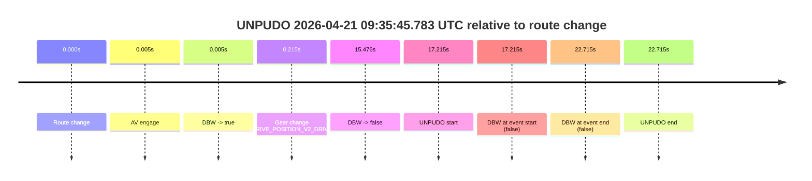
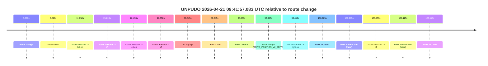
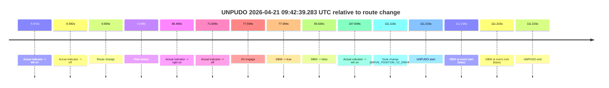
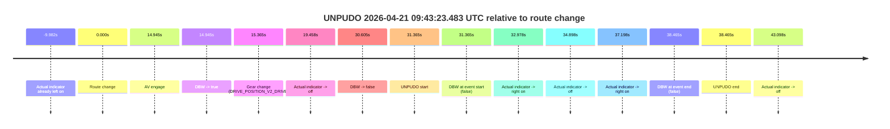

# Run Report: fme20030/2026-04-21--09-30-58--gen2-av-c9c6b863-5119-4456-a6ed-aecf82e5c33d

| Field | Value |
|---|---|
| Run ID | `fme20030/2026-04-21--09-30-58--gen2-av-c9c6b863-5119-4456-a6ed-aecf82e5c33d` |
| Date | `2026-04-21` |
| Model(s) | `pink-manta-ray-smooth` |
| Author | `guy.geva` |
| Event count | `4` |

## unpudo 2026-04-21 09:35:45.783 UTC

| Field | Value |
|---|---|
| Model | `pink-manta-ray-smooth` |
| Author | `guy.geva` |
| Run ID | `fme20030/2026-04-21--09-30-58--gen2-av-c9c6b863-5119-4456-a6ed-aecf82e5c33d` |
| Date | `2026-04-21` |
| Time (UTC) | `09:35:45.783` |
| Event type | `unpudo` |
| Disengagement type | `uncategorised` |
| Route change | `found` |
| Console | [run](https://console.sso.wayve.ai/run/fme20030/2026-04-21--09-30-58--gen2-av-c9c6b863-5119-4456-a6ed-aecf82e5c33d?id=&time-unixus=1776764145783313) |
| Foxglove | [segment](https://app.foxglove.dev/wayve-on-prem/p/prj_0dX18KZdVHg1fmmI/view?ds=foxglove-stream&ds.deviceName=fme20030&ds.start=2026-04-21T09%3A35%3A18.568249Z&ds.end=2026-04-21T09%3A36%3A01.283300Z&layoutId=lay_0e7VD4WIKDQGU73Y&time=2026-04-21T09%3A35%3A45.783313Z) |

### Event card: fail

- Fail: AV owns part of the segment, but the event still resolves as a model-performance failure under the AV-only scoring rule.

| Event | Time (UTC) | Delta from route change |
|---|---:|---:|
| Route change | 2026-04-21 09:35:28.568 | `0.000s` |
| AV engage | 2026-04-21 09:35:28.572 | `0.005s` |
| DBW -> true | 2026-04-21 09:35:28.572 | `0.005s` |
| Gear change (DRIVE_POSITION_V2_DRIVE) | 2026-04-21 09:35:28.783 | `0.215s` |
| DBW -> false | 2026-04-21 09:35:44.044 | `15.476s` |
| UNPUDO start | 2026-04-21 09:35:45.783 | `17.215s` |
| DBW at event start (false) | 2026-04-21 09:35:45.783 | `17.215s` |
| DBW at event end (false) | 2026-04-21 09:35:51.283 | `22.715s` |
| UNPUDO end | 2026-04-21 09:35:51.283 | `22.715s` |

| Metric | Value |
|---|---|
| Outcome | `fail` |
| Effective failure type | `uncategorised` |
| Route change status | `found` |
| DBW at event start | `false` |
| DBW at event end | `false` |
| Predicted gear at AV start | `DRIVE_POSITION_V2_PARK` |
| Actual gear at AV start | `DRIVE_POSITION_V2_PARK` |
| Predicted gear at event start | `DRIVE_POSITION_V2_DRIVE` |
| Actual gear at event start | `DRIVE_POSITION_V2_DRIVE` |
| Planned indicator direction | `INDICATORS_STATE_V2_LEFT_ON` |
| Controller indicator direction | `INDICATORS_STATE_V2_LEFT_ON` |
| Actual indicator direction | `INDICATORS_STATE_V2_OFF` |
| Actual indicator at maneuver end | `INDICATORS_STATE_V2_OFF` |
| Driver accel help in AV | `false` |
| Driver accel help timestamp | `n/a` |
| Max accel pedal pct in AV | `0.0%` |
| Max brake pedal pct in AV | `8.0%` |
| Max speed mps in AV | `0.000` |
| Success timing baseline | `route change` |
| Route -> AV | `0.005s` |
| AV -> event start | `17.210s` |
| AV -> first motion | `n/a` |
| Success baseline -> event start | `17.215s` |
| Success baseline -> first motion | `n/a` |
| AV duration before disengagement | `15.471s` |
| Trajectory waypoint count | `37` |
| Driving-plan step count | `11` |

The scored portion starts from the AV-owned window, not from the pre-AV setup. Route-change search in the stopped pre-event segment was `found`, with the baseline therefore set to route change. At the event anchor the model predicts `DRIVE_POSITION_V2_DRIVE` and the actual gear is `DRIVE_POSITION_V2_DRIVE`. The effective model outcome is `fail` because `uncategorised.`

### Resolution

| Field | Value |
|---|---|
| Final outcome | `fail` |
| Do we agree with this label? | `yes` |
| Source disengagement type | `uncategorised` |
| Resolved effective failure type | `uncategorised` |
| Confidence | `high` |

## unpudo 2026-04-21 09:41:57.083 UTC

| Field | Value |
|---|---|
| Model | `pink-manta-ray-smooth` |
| Author | `guy.geva` |
| Run ID | `fme20030/2026-04-21--09-30-58--gen2-av-c9c6b863-5119-4456-a6ed-aecf82e5c33d` |
| Date | `2026-04-21` |
| Time (UTC) | `09:41:57.083` |
| Event type | `unpudo` |
| Disengagement type | `none observed` |
| Route change | `found` |
| Console | [run](https://console.sso.wayve.ai/run/fme20030/2026-04-21--09-30-58--gen2-av-c9c6b863-5119-4456-a6ed-aecf82e5c33d?id=&time-unixus=1776764517083298) |
| Foxglove | [segment](https://app.foxglove.dev/wayve-on-prem/p/prj_0dX18KZdVHg1fmmI/view?ds=foxglove-stream&ds.deviceName=fme20030&ds.start=2026-04-21T09%3A40%3A06.118238Z&ds.end=2026-04-21T09%3A42%3A12.233311Z&layoutId=lay_0e7VD4WIKDQGU73Y&time=2026-04-21T09%3A41%3A57.083298Z) |

### Event card: fail

- Fail: the credited unpudo does not stay AV-owned. The event window starts with DBW false, and the maneuver outcome lands outside a clean AV-owned segment.

| Event | Time (UTC) | Delta from route change |
|---|---:|---:|
| Route change | 2026-04-21 09:40:16.118 | `0.000s` |
| First motion | 2026-04-21 09:40:16.137 | `0.019s` |
| Actual indicator -> left on | 2026-04-21 09:40:27.776 | `11.658s` |
| Actual indicator -> off | 2026-04-21 09:40:31.336 | `15.218s` |
| Actual indicator -> left on | 2026-04-21 09:40:38.596 | `22.478s` |
| Actual indicator -> off | 2026-04-21 09:40:42.476 | `26.358s` |
| AV engage | 2026-04-21 09:41:25.162 | `69.045s` |
| DBW -> true | 2026-04-21 09:41:25.162 | `69.045s` |
| DBW -> false | 2026-04-21 09:41:41.424 | `85.306s` |
| Gear change (DRIVE_POSITION_V2_DRIVE) | 2026-04-21 09:41:48.483 | `92.365s` |
| Actual indicator -> right on | 2026-04-21 09:41:54.537 | `98.419s` |
| UNPUDO start | 2026-04-21 09:41:57.083 | `100.965s` |
| DBW at event start (false) | 2026-04-21 09:41:57.083 | `100.965s` |
| Actual indicator -> off | 2026-04-21 09:41:59.577 | `103.459s` |
| DBW at event end (false) | 2026-04-21 09:42:02.233 | `106.115s` |
| UNPUDO end | 2026-04-21 09:42:02.233 | `106.115s` |

| Metric | Value |
|---|---|
| Outcome | `fail` |
| Effective failure type | `completed_outside_av` |
| Route change status | `found` |
| DBW at event start | `false` |
| DBW at event end | `false` |
| Predicted gear at AV start | `DRIVE_POSITION_V2_DRIVE` |
| Actual gear at AV start | `DRIVE_POSITION_V2_PARK` |
| Predicted gear at event start | `DRIVE_POSITION_V2_DRIVE` |
| Actual gear at event start | `DRIVE_POSITION_V2_DRIVE` |
| Planned indicator direction | `INDICATORS_STATE_V2_RIGHT_ON` |
| Controller indicator direction | `INDICATORS_STATE_V2_RIGHT_ON` |
| Actual indicator direction | `INDICATORS_STATE_V2_RIGHT_ON` |
| Actual indicator at maneuver end | `INDICATORS_STATE_V2_OFF` |
| Driver accel help in AV | `false` |
| Driver accel help timestamp | `n/a` |
| Max accel pedal pct in AV | `0.0%` |
| Max brake pedal pct in AV | `8.0%` |
| Max speed mps in AV | `0.000` |
| Success timing baseline | `route change` |
| Route -> AV | `69.045s` |
| AV -> event start | `31.920s` |
| AV -> first motion | `-69.026s` |
| Success baseline -> event start | `100.965s` |
| Success baseline -> first motion | `0.019s` |
| AV duration before disengagement | `16.262s` |
| Trajectory waypoint count | `37` |
| Driving-plan step count | `11` |

The scored portion starts from the AV-owned window, not from the pre-AV setup. Route-change search in the stopped pre-event segment was `found`, with the baseline therefore set to route change. At the event anchor the model predicts `DRIVE_POSITION_V2_DRIVE` and the actual gear is `DRIVE_POSITION_V2_DRIVE`. The effective model outcome is `fail` because `completed_outside_av.`

### Resolution

| Field | Value |
|---|---|
| Final outcome | `fail` |
| Do we agree with this label? | `yes` |
| Source disengagement type | `none observed` |
| Resolved effective failure type | `completed_outside_av` |
| Confidence | `high` |

## unpudo 2026-04-21 09:42:39.283 UTC

| Field | Value |
|---|---|
| Model | `pink-manta-ray-smooth` |
| Author | `guy.geva` |
| Run ID | `fme20030/2026-04-21--09-30-58--gen2-av-c9c6b863-5119-4456-a6ed-aecf82e5c33d` |
| Date | `2026-04-21` |
| Time (UTC) | `09:42:39.283` |
| Event type | `unpudo` |
| Disengagement type | `none observed` |
| Route change | `found` |
| Console | [run](https://console.sso.wayve.ai/run/fme20030/2026-04-21--09-30-58--gen2-av-c9c6b863-5119-4456-a6ed-aecf82e5c33d?id=&time-unixus=1776764559283306) |
| Foxglove | [segment](https://app.foxglove.dev/wayve-on-prem/p/prj_0dX18KZdVHg1fmmI/view?ds=foxglove-stream&ds.deviceName=fme20030&ds.start=2026-04-21T09%3A40%3A38.068297Z&ds.end=2026-04-21T09%3A42%3A49.283306Z&layoutId=lay_0e7VD4WIKDQGU73Y&time=2026-04-21T09%3A42%3A39.283306Z) |

### Event card: fail

- Fail: the credited unpudo does not stay AV-owned. The event window starts with DBW false, and the maneuver outcome lands outside a clean AV-owned segment.

| Event | Time (UTC) | Delta from route change |
|---|---:|---:|
| Actual indicator -> left on | 2026-04-21 09:40:38.596 | `-9.472s` |
| Actual indicator -> off | 2026-04-21 09:40:42.476 | `-5.592s` |
| Route change | 2026-04-21 09:40:48.068 | `0.000s` |
| First motion | 2026-04-21 09:40:48.076 | `0.008s` |
| Actual indicator -> right on | 2026-04-21 09:41:54.537 | `66.469s` |
| Actual indicator -> off | 2026-04-21 09:41:59.577 | `71.509s` |
| AV engage | 2026-04-21 09:42:05.662 | `77.594s` |
| DBW -> true | 2026-04-21 09:42:05.662 | `77.594s` |
| DBW -> false | 2026-04-21 09:42:21.702 | `93.634s` |
| Actual indicator -> left on | 2026-04-21 09:42:35.716 | `107.649s` |
| Gear change (DRIVE_POSITION_V2_DRIVE) | 2026-04-21 09:42:39.183 | `111.115s` |
| UNPUDO start | 2026-04-21 09:42:39.283 | `111.215s` |
| DBW at event start (false) | 2026-04-21 09:42:39.283 | `111.215s` |
| DBW at event end (false) | 2026-04-21 09:42:39.283 | `111.215s` |
| UNPUDO end | 2026-04-21 09:42:39.283 | `111.215s` |

| Metric | Value |
|---|---|
| Outcome | `fail` |
| Effective failure type | `completed_outside_av` |
| Route change status | `found` |
| DBW at event start | `false` |
| DBW at event end | `false` |
| Predicted gear at AV start | `DRIVE_POSITION_V2_DRIVE` |
| Actual gear at AV start | `DRIVE_POSITION_V2_DRIVE` |
| Predicted gear at event start | `DRIVE_POSITION_V2_DRIVE` |
| Actual gear at event start | `DRIVE_POSITION_V2_DRIVE` |
| Planned indicator direction | `INDICATORS_STATE_V2_OFF` |
| Controller indicator direction | `INDICATORS_STATE_V2_OFF` |
| Actual indicator direction | `INDICATORS_STATE_V2_LEFT_ON` |
| Actual indicator at maneuver end | `INDICATORS_STATE_V2_LEFT_ON` |
| Driver accel help in AV | `false` |
| Driver accel help timestamp | `n/a` |
| Max accel pedal pct in AV | `0.0%` |
| Max brake pedal pct in AV | `10.2%` |
| Max speed mps in AV | `7.697` |
| Success timing baseline | `route change` |
| Route -> AV | `77.594s` |
| AV -> event start | `33.621s` |
| AV -> first motion | `-77.586s` |
| Success baseline -> event start | `111.215s` |
| Success baseline -> first motion | `0.008s` |
| AV duration before disengagement | `16.040s` |
| Trajectory waypoint count | `37` |
| Driving-plan step count | `11` |

The scored portion starts from the AV-owned window, not from the pre-AV setup. Route-change search in the stopped pre-event segment was `found`, with the baseline therefore set to route change. At the event anchor the model predicts `DRIVE_POSITION_V2_DRIVE` and the actual gear is `DRIVE_POSITION_V2_DRIVE`. The effective model outcome is `fail` because `completed_outside_av.`

### Resolution

| Field | Value |
|---|---|
| Final outcome | `fail` |
| Do we agree with this label? | `yes` |
| Source disengagement type | `none observed` |
| Resolved effective failure type | `completed_outside_av` |
| Confidence | `high` |

## unpudo 2026-04-21 09:43:23.483 UTC

| Field | Value |
|---|---|
| Model | `pink-manta-ray-smooth` |
| Author | `guy.geva` |
| Run ID | `fme20030/2026-04-21--09-30-58--gen2-av-c9c6b863-5119-4456-a6ed-aecf82e5c33d` |
| Date | `2026-04-21` |
| Time (UTC) | `09:43:23.483` |
| Event type | `unpudo` |
| Disengagement type | `none observed` |
| Route change | `found` |
| Console | [run](https://console.sso.wayve.ai/run/fme20030/2026-04-21--09-30-58--gen2-av-c9c6b863-5119-4456-a6ed-aecf82e5c33d?id=&time-unixus=1776764603483295) |
| Foxglove | [segment](https://app.foxglove.dev/wayve-on-prem/p/prj_0dX18KZdVHg1fmmI/view?ds=foxglove-stream&ds.deviceName=fme20030&ds.start=2026-04-21T09%3A42%3A42.118250Z&ds.end=2026-04-21T09%3A43%3A40.583316Z&layoutId=lay_0e7VD4WIKDQGU73Y&time=2026-04-21T09%3A43%3A23.483295Z) |

### Event card: fail

- Fail: the credited unpudo does not stay AV-owned. The event window starts with DBW false, and the maneuver outcome lands outside a clean AV-owned segment.

| Event | Time (UTC) | Delta from route change |
|---|---:|---:|
| Actual indicator already left on | 2026-04-21 09:42:42.136 | `-9.982s` |
| Route change | 2026-04-21 09:42:52.118 | `0.000s` |
| AV engage | 2026-04-21 09:43:07.062 | `14.945s` |
| DBW -> true | 2026-04-21 09:43:07.062 | `14.945s` |
| Gear change (DRIVE_POSITION_V2_DRIVE) | 2026-04-21 09:43:07.483 | `15.365s` |
| Actual indicator -> off | 2026-04-21 09:43:11.576 | `19.458s` |
| DBW -> false | 2026-04-21 09:43:22.722 | `30.605s` |
| UNPUDO start | 2026-04-21 09:43:23.483 | `31.365s` |
| DBW at event start (false) | 2026-04-21 09:43:23.483 | `31.365s` |
| Actual indicator -> right on | 2026-04-21 09:43:25.096 | `32.978s` |
| Actual indicator -> off | 2026-04-21 09:43:27.016 | `34.898s` |
| Actual indicator -> right on | 2026-04-21 09:43:29.316 | `37.198s` |
| DBW at event end (false) | 2026-04-21 09:43:30.583 | `38.465s` |
| UNPUDO end | 2026-04-21 09:43:30.583 | `38.465s` |
| Actual indicator -> off | 2026-04-21 09:43:35.216 | `43.098s` |

| Metric | Value |
|---|---|
| Outcome | `fail` |
| Effective failure type | `not_av_owned` |
| Route change status | `found` |
| DBW at event start | `false` |
| DBW at event end | `false` |
| Predicted gear at AV start | `DRIVE_POSITION_V2_DRIVE` |
| Actual gear at AV start | `DRIVE_POSITION_V2_PARK` |
| Predicted gear at event start | `DRIVE_POSITION_V2_DRIVE` |
| Actual gear at event start | `DRIVE_POSITION_V2_DRIVE` |
| Planned indicator direction | `INDICATORS_STATE_V2_RIGHT_ON` |
| Controller indicator direction | `INDICATORS_STATE_V2_RIGHT_ON` |
| Actual indicator direction | `INDICATORS_STATE_V2_OFF` |
| Actual indicator at maneuver end | `INDICATORS_STATE_V2_RIGHT_ON` |
| Driver accel help in AV | `false` |
| Driver accel help timestamp | `n/a` |
| Max accel pedal pct in AV | `0.0%` |
| Max brake pedal pct in AV | `28.4%` |
| Max speed mps in AV | `0.000` |
| Success timing baseline | `route change` |
| Route -> AV | `14.945s` |
| AV -> event start | `16.420s` |
| AV -> first motion | `n/a` |
| Success baseline -> event start | `31.365s` |
| Success baseline -> first motion | `n/a` |
| AV duration before disengagement | `15.660s` |
| Trajectory waypoint count | `37` |
| Driving-plan step count | `11` |

The scored portion starts from the AV-owned window, not from the pre-AV setup. Route-change search in the stopped pre-event segment was `found`, with the baseline therefore set to route change. At the event anchor the model predicts `DRIVE_POSITION_V2_DRIVE` and the actual gear is `DRIVE_POSITION_V2_DRIVE`. The effective model outcome is `fail` because `not_av_owned.`

### Resolution

| Field | Value |
|---|---|
| Final outcome | `fail` |
| Do we agree with this label? | `yes` |
| Source disengagement type | `none observed` |
| Resolved effective failure type | `not_av_owned` |
| Confidence | `high` |
