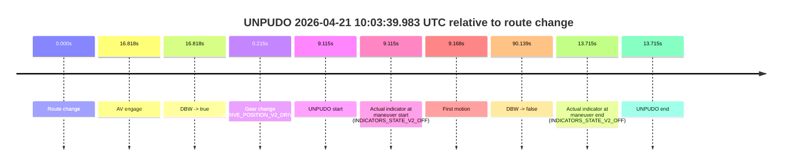
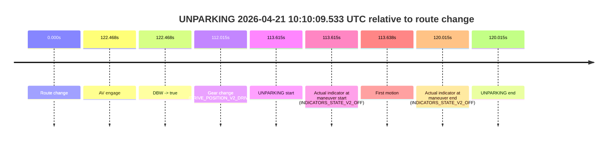

# Run Report: fme20030/2026-04-21--09-59-27--gen2-av-62c0d314-d910-493d-9c8d-e02454ae6679

| Field | Value |
|---|---|
| Run ID | `fme20030/2026-04-21--09-59-27--gen2-av-62c0d314-d910-493d-9c8d-e02454ae6679` |
| Date | `2026-04-21` |
| Model(s) | `pink-manta-ray-smooth` |
| Author | `guy.geva` |
| Event count | `3` |

## unpudo 2026-04-21 10:03:39.983 UTC

| Field | Value |
|---|---|
| Model | `pink-manta-ray-smooth` |
| Author | `guy.geva` |
| Run ID | `fme20030/2026-04-21--09-59-27--gen2-av-62c0d314-d910-493d-9c8d-e02454ae6679` |
| Date | `2026-04-21` |
| Time (UTC) | `10:03:39.983` |
| Event type | `unpudo` |
| Disengagement type | `uncategorised` |
| Route change | `found` |
| Console | [run](https://console.sso.wayve.ai/run/fme20030/2026-04-21--09-59-27--gen2-av-62c0d314-d910-493d-9c8d-e02454ae6679?id=&time-unixus=1776765819983308) |
| Foxglove | [segment](https://app.foxglove.dev/wayve-on-prem/p/prj_0dX18KZdVHg1fmmI/view?ds=foxglove-stream&ds.deviceName=fme20030&ds.start=2026-04-21T10%3A03%3A20.868430Z&ds.end=2026-04-21T10%3A05%3A11.007739Z&layoutId=lay_0e7VD4WIKDQGU73Y&time=2026-04-21T10%3A03%3A39.983308Z) |

### Event card: accidental

- Accidental: AV ownership is present for less than `2s`, so this is treated as an accidental brush with the maneuver rather than a meaningful model attempt.

| Event | Time (UTC) | Delta from route change |
|---|---:|---:|
| Route change | 2026-04-21 10:03:30.868 | `0.000s` |
| AV engage | 2026-04-21 10:03:47.686 | `16.818s` |
| DBW -> true | 2026-04-21 10:03:47.686 | `16.818s` |
| Gear change (DRIVE_POSITION_V2_DRIVE) | 2026-04-21 10:03:31.083 | `0.215s` |
| UNPUDO start | 2026-04-21 10:03:39.983 | `9.115s` |
| Actual indicator at maneuver start (INDICATORS_STATE_V2_OFF) | 2026-04-21 10:03:39.983 | `9.115s` |
| First motion | 2026-04-21 10:03:40.036 | `9.168s` |
| DBW -> false | 2026-04-21 10:05:01.007 | `90.139s` |
| Actual indicator at maneuver end (INDICATORS_STATE_V2_OFF) | 2026-04-21 10:03:44.583 | `13.715s` |
| UNPUDO end | 2026-04-21 10:03:44.583 | `13.715s` |

| Metric | Value |
|---|---|
| Outcome | `accidental` |
| Effective failure type | `none` |
| Route change status | `found` |
| DBW at event start | `false` |
| DBW at event end | `false` |
| Predicted gear at AV start | `DRIVE_POSITION_V2_DRIVE` |
| Actual gear at AV start | `DRIVE_POSITION_V2_DRIVE` |
| Predicted gear at event start | `DRIVE_POSITION_V2_DRIVE` |
| Actual gear at event start | `DRIVE_POSITION_V2_DRIVE` |
| Planned indicator direction | `INDICATORS_STATE_V2_RIGHT_ON` |
| Controller indicator direction | `INDICATORS_STATE_V2_RIGHT_ON` |
| Actual indicator direction | `INDICATORS_STATE_V2_OFF` |
| Actual indicator at maneuver end | `INDICATORS_STATE_V2_OFF` |
| Driver accel help in AV | `false` |
| Driver accel help timestamp | `n/a` |
| Max accel pedal pct in AV | `0.0%` |
| Max brake pedal pct in AV | `0.0%` |
| Max speed mps in AV | `0.000` |
| Route -> AV | `16.818s` |
| AV -> event start | `-7.703s` |
| AV -> first motion | `-7.650s` |
| AV duration before disengagement | `73.321s` |
| Trajectory waypoint count | `36` |
| Driving-plan step count | `11` |

The scored portion starts from the AV-owned window, not from the pre-AV setup. Route-change search in the stopped pre-event segment was `found`, with the baseline therefore set to route change. At the event anchor the model predicts `DRIVE_POSITION_V2_DRIVE` and the actual gear is `DRIVE_POSITION_V2_DRIVE`. The effective model outcome is `accidental` because `the AV-owned portion is shorter than 2s`.

### Resolution

| Field | Value |
|---|---|
| Final outcome | `accidental` |
| Do we agree with this label? | `yes` |
| Source disengagement type | `uncategorised` |
| Resolved effective failure type | `none` |
| Confidence | `high` |

## unpudo 2026-04-21 10:08:38.683 UTC

| Field | Value |
|---|---|
| Model | `pink-manta-ray-smooth` |
| Author | `guy.geva` |
| Run ID | `fme20030/2026-04-21--09-59-27--gen2-av-62c0d314-d910-493d-9c8d-e02454ae6679` |
| Date | `2026-04-21` |
| Time (UTC) | `10:08:38.683` |
| Event type | `unpudo` |
| Disengagement type | `none observed` |
| Route change | `found` |
| Console | [run](https://console.sso.wayve.ai/run/fme20030/2026-04-21--09-59-27--gen2-av-62c0d314-d910-493d-9c8d-e02454ae6679?id=&time-unixus=1776766118683300) |
| Foxglove | [segment](https://app.foxglove.dev/wayve-on-prem/p/prj_0dX18KZdVHg1fmmI/view?ds=foxglove-stream&ds.deviceName=fme20030&ds.start=2026-04-21T10%3A06%3A52.118546Z&ds.end=2026-04-21T10%3A10%3A18.425705Z&layoutId=lay_0e7VD4WIKDQGU73Y&time=2026-04-21T10%3A08%3A38.683300Z) |

### Event card: non-av

- Non-AV: the detected unpudo starts outside AV ownership, so it is kept for coverage but excluded from model success / failure scoring.

| Event | Time (UTC) | Delta from route change |
|---|---:|---:|
| Route change | 2026-04-21 10:07:02.118 | `0.000s` |
| AV engage | 2026-04-21 10:09:05.986 | `123.868s` |
| DBW -> true | 2026-04-21 10:09:05.986 | `123.868s` |
| Gear change (DRIVE_POSITION_V2_REVERSE) | 2026-04-21 10:08:33.683 | `91.565s` |
| UNPUDO start | 2026-04-21 10:08:38.683 | `96.565s` |
| Actual indicator at maneuver start (INDICATORS_STATE_V2_OFF) | 2026-04-21 10:08:38.683 | `96.565s` |
| First motion | 2026-04-21 10:09:15.816 | `133.698s` |
| DBW -> false | 2026-04-21 10:10:08.425 | `186.307s` |
| Actual indicator at maneuver end (INDICATORS_STATE_V2_OFF) | 2026-04-21 10:09:18.533 | `136.415s` |
| UNPUDO end | 2026-04-21 10:09:18.533 | `136.415s` |

| Metric | Value |
|---|---|
| Outcome | `non-av` |
| Effective failure type | `none` |
| Route change status | `found` |
| DBW at event start | `false` |
| DBW at event end | `true` |
| Predicted gear at AV start | `DRIVE_POSITION_V2_DRIVE` |
| Actual gear at AV start | `DRIVE_POSITION_V2_DRIVE` |
| Predicted gear at event start | `DRIVE_POSITION_V2_REVERSE` |
| Actual gear at event start | `DRIVE_POSITION_V2_REVERSE` |
| Planned indicator direction | `INDICATORS_STATE_V2_OFF` |
| Controller indicator direction | `INDICATORS_STATE_V2_OFF` |
| Actual indicator direction | `INDICATORS_STATE_V2_OFF` |
| Actual indicator at maneuver end | `INDICATORS_STATE_V2_OFF` |
| Driver accel help in AV | `false` |
| Driver accel help timestamp | `n/a` |
| Max accel pedal pct in AV | `0.0%` |
| Max brake pedal pct in AV | `8.0%` |
| Max speed mps in AV | `4.817` |
| Route -> AV | `123.868s` |
| AV -> event start | `-27.303s` |
| AV -> first motion | `9.830s` |
| AV duration before disengagement | `62.440s` |
| Trajectory waypoint count | `36` |
| Driving-plan step count | `11` |

The scored portion starts from the AV-owned window, not from the pre-AV setup. Route-change search in the stopped pre-event segment was `found`, with the baseline therefore set to route change. At the event anchor the model predicts `DRIVE_POSITION_V2_REVERSE` and the actual gear is `DRIVE_POSITION_V2_REVERSE`. The effective model outcome is `non-av` because `the event does not begin in AV ownership`.

### Resolution

| Field | Value |
|---|---|
| Final outcome | `non-av` |
| Do we agree with this label? | `yes` |
| Source disengagement type | `none observed` |
| Resolved effective failure type | `none` |
| Confidence | `high` |

## unparking 2026-04-21 10:10:09.533 UTC

| Field | Value |
|---|---|
| Model | `pink-manta-ray-smooth` |
| Author | `guy.geva` |
| Run ID | `fme20030/2026-04-21--09-59-27--gen2-av-62c0d314-d910-493d-9c8d-e02454ae6679` |
| Date | `2026-04-21` |
| Time (UTC) | `10:10:09.533` |
| Event type | `unparking` |
| Disengagement type | `none observed` |
| Route change | `found` |
| Console | [run](https://console.sso.wayve.ai/run/fme20030/2026-04-21--09-59-27--gen2-av-62c0d314-d910-493d-9c8d-e02454ae6679?id=&time-unixus=1776766209533303) |
| Foxglove | [segment](https://app.foxglove.dev/wayve-on-prem/p/prj_0dX18KZdVHg1fmmI/view?ds=foxglove-stream&ds.deviceName=fme20030&ds.start=2026-04-21T10%3A08%3A05.918384Z&ds.end=2026-04-21T10%3A10%3A25.933301Z&layoutId=lay_0e7VD4WIKDQGU73Y&time=2026-04-21T10%3A10%3A09.533303Z) |

### Event card: accidental

- Accidental: AV ownership is present for less than `2s`, so this is treated as an accidental brush with the maneuver rather than a meaningful model attempt.

| Event | Time (UTC) | Delta from route change |
|---|---:|---:|
| Route change | 2026-04-21 10:08:15.918 | `0.000s` |
| AV engage | 2026-04-21 10:10:18.386 | `122.468s` |
| DBW -> true | 2026-04-21 10:10:18.386 | `122.468s` |
| Gear change (DRIVE_POSITION_V2_DRIVE) | 2026-04-21 10:10:07.933 | `112.015s` |
| UNPARKING start | 2026-04-21 10:10:09.533 | `113.615s` |
| Actual indicator at maneuver start (INDICATORS_STATE_V2_OFF) | 2026-04-21 10:10:09.533 | `113.615s` |
| First motion | 2026-04-21 10:10:09.556 | `113.638s` |
| Actual indicator at maneuver end (INDICATORS_STATE_V2_OFF) | 2026-04-21 10:10:15.933 | `120.015s` |
| UNPARKING end | 2026-04-21 10:10:15.933 | `120.015s` |

| Metric | Value |
|---|---|
| Outcome | `accidental` |
| Effective failure type | `none` |
| Route change status | `found` |
| DBW at event start | `false` |
| DBW at event end | `false` |
| Predicted gear at AV start | `DRIVE_POSITION_V2_DRIVE` |
| Actual gear at AV start | `DRIVE_POSITION_V2_DRIVE` |
| Predicted gear at event start | `DRIVE_POSITION_V2_DRIVE` |
| Actual gear at event start | `DRIVE_POSITION_V2_DRIVE` |
| Planned indicator direction | `INDICATORS_STATE_V2_RIGHT_ON` |
| Controller indicator direction | `INDICATORS_STATE_V2_RIGHT_ON` |
| Actual indicator direction | `INDICATORS_STATE_V2_OFF` |
| Actual indicator at maneuver end | `INDICATORS_STATE_V2_OFF` |
| Driver accel help in AV | `false` |
| Driver accel help timestamp | `n/a` |
| Max accel pedal pct in AV | `0.0%` |
| Max brake pedal pct in AV | `0.0%` |
| Max speed mps in AV | `0.000` |
| Route -> AV | `122.468s` |
| AV -> event start | `-8.853s` |
| AV -> first motion | `-8.830s` |
| AV duration before disengagement | `n/a` |
| Trajectory waypoint count | `35` |
| Driving-plan step count | `11` |

The scored portion starts from the AV-owned window, not from the pre-AV setup. Route-change search in the stopped pre-event segment was `found`, with the baseline therefore set to route change. At the event anchor the model predicts `DRIVE_POSITION_V2_DRIVE` and the actual gear is `DRIVE_POSITION_V2_DRIVE`. The effective model outcome is `accidental` because `the AV-owned portion is shorter than 2s`.

### Resolution

| Field | Value |
|---|---|
| Final outcome | `accidental` |
| Do we agree with this label? | `yes` |
| Source disengagement type | `none observed` |
| Resolved effective failure type | `none` |
| Confidence | `high` |
