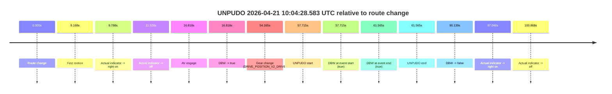
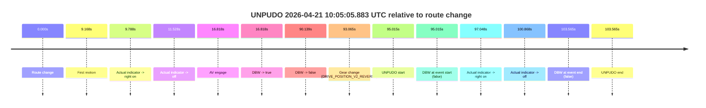

# Run Report: fme20030/2026-04-21--09-59-27--gen2-av-62c0d314-d910-493d-9c8d-e02454ae6679

| Field | Value |
|---|---|
| Run ID | `fme20030/2026-04-21--09-59-27--gen2-av-62c0d314-d910-493d-9c8d-e02454ae6679` |
| Date | `2026-04-21` |
| Model(s) | `eel-teal-outspoken` |
| Author | `zak` |
| Event count | `2` |

## unpudo 2026-04-21 10:04:28.583 UTC

| Field | Value |
|---|---|
| Model | `eel-teal-outspoken` |
| Author | `zak` |
| Run ID | `fme20030/2026-04-21--09-59-27--gen2-av-62c0d314-d910-493d-9c8d-e02454ae6679` |
| Date | `2026-04-21` |
| Time (UTC) | `10:04:28.583` |
| Event type | `unpudo` |
| Disengagement type | `none observed` |
| Route change | `found` |
| Console | [run](https://console.sso.wayve.ai/run/fme20030/2026-04-21--09-59-27--gen2-av-62c0d314-d910-493d-9c8d-e02454ae6679?id=&time-unixus=1776765868583302) |
| Foxglove | [segment](https://app.foxglove.dev/wayve-on-prem/p/prj_0dX18KZdVHg1fmmI/view?ds=foxglove-stream&ds.deviceName=fme20030&ds.start=2026-04-21T10%3A03%3A20.868430Z&ds.end=2026-04-21T10%3A05%3A11.007739Z&layoutId=lay_0e7VD4WIKDQGU73Y&time=2026-04-21T10%3A04%3A28.583302Z) |

### Event card: pass

- Pass: AV owns the credited unpudo from route change through the official unpudo window, the gear state is aligned at the anchor, and the vehicle moves without driver accelerator help in AV.

| Event | Time (UTC) | Delta from route change |
|---|---:|---:|
| Route change | 2026-04-21 10:03:30.868 | `0.000s` |
| First motion | 2026-04-21 10:03:40.036 | `9.168s` |
| Actual indicator -> right on | 2026-04-21 10:03:40.656 | `9.788s` |
| Actual indicator -> off | 2026-04-21 10:03:42.396 | `11.528s` |
| AV engage | 2026-04-21 10:03:47.686 | `16.818s` |
| DBW -> true | 2026-04-21 10:03:47.686 | `16.818s` |
| Gear change (DRIVE_POSITION_V2_DRIVE) | 2026-04-21 10:04:25.033 | `54.165s` |
| UNPUDO start | 2026-04-21 10:04:28.583 | `57.715s` |
| DBW at event start (true) | 2026-04-21 10:04:28.583 | `57.715s` |
| DBW at event end (true) | 2026-04-21 10:04:32.433 | `61.565s` |
| UNPUDO end | 2026-04-21 10:04:32.433 | `61.565s` |
| DBW -> false | 2026-04-21 10:05:01.007 | `90.139s` |
| Actual indicator -> right on | 2026-04-21 10:05:07.916 | `97.048s` |
| Actual indicator -> off | 2026-04-21 10:05:11.736 | `100.868s` |

| Metric | Value |
|---|---|
| Outcome | `pass` |
| Effective failure type | `none` |
| Route change status | `found` |
| DBW at event start | `true` |
| DBW at event end | `true` |
| Predicted gear at AV start | `DRIVE_POSITION_V2_DRIVE` |
| Actual gear at AV start | `DRIVE_POSITION_V2_DRIVE` |
| Predicted gear at event start | `DRIVE_POSITION_V2_DRIVE` |
| Actual gear at event start | `DRIVE_POSITION_V2_DRIVE` |
| Planned indicator direction | `INDICATORS_STATE_V2_RIGHT_ON` |
| Controller indicator direction | `INDICATORS_STATE_V2_RIGHT_ON` |
| Actual indicator direction | `INDICATORS_STATE_V2_OFF` |
| Actual indicator at maneuver end | `INDICATORS_STATE_V2_OFF` |
| Driver accel help in AV | `false` |
| Driver accel help timestamp | `n/a` |
| Max accel pedal pct in AV | `0.0%` |
| Max brake pedal pct in AV | `25.8%` |
| Max speed mps in AV | `8.311` |
| Success timing baseline | `route change` |
| Route -> AV | `16.818s` |
| AV -> event start | `40.897s` |
| AV -> first motion | `-7.650s` |
| Success baseline -> event start | `57.715s` |
| Success baseline -> first motion | `9.168s` |
| AV duration before disengagement | `73.321s` |
| Trajectory waypoint count | `36` |
| Driving-plan step count | `11` |

The scored portion starts from the AV-owned window, not from the pre-AV setup. Route-change search in the stopped pre-event segment was `found`, with the baseline therefore set to route change. At the event anchor the model predicts `DRIVE_POSITION_V2_DRIVE` and the actual gear is `DRIVE_POSITION_V2_DRIVE`. The effective model outcome is `pass` because `the credited unpudo stays AV-owned through the official unpudo window.`

### Resolution

| Field | Value |
|---|---|
| Final outcome | `pass` |
| Do we agree with this label? | `yes` |
| Source disengagement type | `none observed` |
| Resolved effective failure type | `none` |
| Confidence | `high` |

## unpudo 2026-04-21 10:05:05.883 UTC

| Field | Value |
|---|---|
| Model | `eel-teal-outspoken` |
| Author | `zak` |
| Run ID | `fme20030/2026-04-21--09-59-27--gen2-av-62c0d314-d910-493d-9c8d-e02454ae6679` |
| Date | `2026-04-21` |
| Time (UTC) | `10:05:05.883` |
| Event type | `unpudo` |
| Disengagement type | `none observed` |
| Route change | `found` |
| Console | [run](https://console.sso.wayve.ai/run/fme20030/2026-04-21--09-59-27--gen2-av-62c0d314-d910-493d-9c8d-e02454ae6679?id=&time-unixus=1776765905883317) |
| Foxglove | [segment](https://app.foxglove.dev/wayve-on-prem/p/prj_0dX18KZdVHg1fmmI/view?ds=foxglove-stream&ds.deviceName=fme20030&ds.start=2026-04-21T10%3A03%3A20.868430Z&ds.end=2026-04-21T10%3A05%3A24.433304Z&layoutId=lay_0e7VD4WIKDQGU73Y&time=2026-04-21T10%3A05%3A05.883317Z) |

### Event card: fail

- Fail: the credited unpudo does not stay AV-owned. The event window starts with DBW false, and the maneuver outcome lands outside a clean AV-owned segment.

| Event | Time (UTC) | Delta from route change |
|---|---:|---:|
| Route change | 2026-04-21 10:03:30.868 | `0.000s` |
| First motion | 2026-04-21 10:03:40.036 | `9.168s` |
| Actual indicator -> right on | 2026-04-21 10:03:40.656 | `9.788s` |
| Actual indicator -> off | 2026-04-21 10:03:42.396 | `11.528s` |
| AV engage | 2026-04-21 10:03:47.686 | `16.818s` |
| DBW -> true | 2026-04-21 10:03:47.686 | `16.818s` |
| DBW -> false | 2026-04-21 10:05:01.007 | `90.139s` |
| Gear change (DRIVE_POSITION_V2_REVERSE) | 2026-04-21 10:05:03.933 | `93.065s` |
| UNPUDO start | 2026-04-21 10:05:05.883 | `95.015s` |
| DBW at event start (false) | 2026-04-21 10:05:05.883 | `95.015s` |
| Actual indicator -> right on | 2026-04-21 10:05:07.916 | `97.048s` |
| Actual indicator -> off | 2026-04-21 10:05:11.736 | `100.868s` |
| DBW at event end (false) | 2026-04-21 10:05:14.433 | `103.565s` |
| UNPUDO end | 2026-04-21 10:05:14.433 | `103.565s` |

| Metric | Value |
|---|---|
| Outcome | `fail` |
| Effective failure type | `completed_outside_av` |
| Route change status | `found` |
| DBW at event start | `false` |
| DBW at event end | `false` |
| Predicted gear at AV start | `DRIVE_POSITION_V2_DRIVE` |
| Actual gear at AV start | `DRIVE_POSITION_V2_DRIVE` |
| Predicted gear at event start | `DRIVE_POSITION_V2_REVERSE` |
| Actual gear at event start | `DRIVE_POSITION_V2_REVERSE` |
| Planned indicator direction | `INDICATORS_STATE_V2_OFF` |
| Controller indicator direction | `INDICATORS_STATE_V2_OFF` |
| Actual indicator direction | `INDICATORS_STATE_V2_OFF` |
| Actual indicator at maneuver end | `INDICATORS_STATE_V2_OFF` |
| Driver accel help in AV | `false` |
| Driver accel help timestamp | `n/a` |
| Max accel pedal pct in AV | `0.0%` |
| Max brake pedal pct in AV | `25.8%` |
| Max speed mps in AV | `8.311` |
| Success timing baseline | `route change` |
| Route -> AV | `16.818s` |
| AV -> event start | `78.197s` |
| AV -> first motion | `-7.650s` |
| Success baseline -> event start | `95.015s` |
| Success baseline -> first motion | `9.168s` |
| AV duration before disengagement | `73.321s` |
| Trajectory waypoint count | `36` |
| Driving-plan step count | `11` |

The scored portion starts from the AV-owned window, not from the pre-AV setup. Route-change search in the stopped pre-event segment was `found`, with the baseline therefore set to route change. At the event anchor the model predicts `DRIVE_POSITION_V2_REVERSE` and the actual gear is `DRIVE_POSITION_V2_REVERSE`. The effective model outcome is `fail` because `completed_outside_av.`

### Resolution

| Field | Value |
|---|---|
| Final outcome | `fail` |
| Do we agree with this label? | `yes` |
| Source disengagement type | `none observed` |
| Resolved effective failure type | `completed_outside_av` |
| Confidence | `high` |
