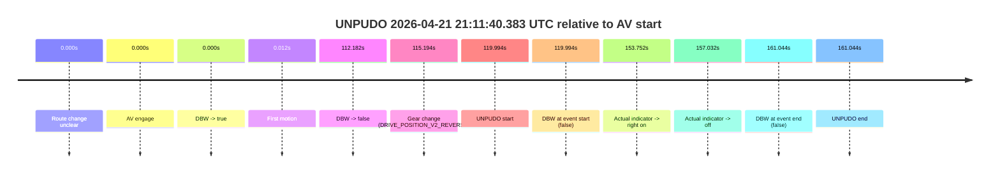
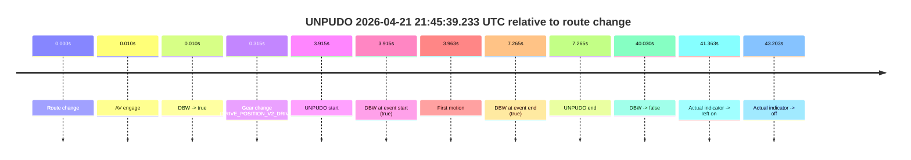

# Run Report: fme20030/2026-04-21--20-33-00--gen2-av-8bb894cc-54ad-4a3c-92b2-cbd1f7f874f5

| Field | Value |
|---|---|
| Run ID | `fme20030/2026-04-21--20-33-00--gen2-av-8bb894cc-54ad-4a3c-92b2-cbd1f7f874f5` |
| Date | `2026-04-21` |
| Model(s) | `eel-teal-outspoken` |
| Author | `zak` |
| Event count | `4` |

## unpudo 2026-04-21 21:11:40.383 UTC

| Field | Value |
|---|---|
| Model | `eel-teal-outspoken` |
| Author | `zak` |
| Run ID | `fme20030/2026-04-21--20-33-00--gen2-av-8bb894cc-54ad-4a3c-92b2-cbd1f7f874f5` |
| Date | `2026-04-21` |
| Time (UTC) | `21:11:40.383` |
| Event type | `unpudo` |
| Disengagement type | `none observed` |
| Route change | `unclear` |
| Console | [run](https://console.sso.wayve.ai/run/fme20030/2026-04-21--20-33-00--gen2-av-8bb894cc-54ad-4a3c-92b2-cbd1f7f874f5?id=&time-unixus=1776805900383317) |
| Foxglove | [segment](https://app.foxglove.dev/wayve-on-prem/p/prj_0dX18KZdVHg1fmmI/view?ds=foxglove-stream&ds.deviceName=fme20030&ds.start=2026-04-21T21%3A09%3A30.388915Z&ds.end=2026-04-21T21%3A12%3A31.433310Z&layoutId=lay_0e7VD4WIKDQGU73Y&time=2026-04-21T21%3A11%3A40.383317Z) |

### Event card: fail

- Fail: the credited unpudo does not stay AV-owned. The event window starts with DBW false, and the maneuver outcome lands outside a clean AV-owned segment.

| Event | Time (UTC) | Delta from AV start |
|---|---:|---:|
| Route change unclear | 2026-04-21 21:09:40.388 | `0.000s` |
| AV engage | 2026-04-21 21:09:40.388 | `0.000s` |
| DBW -> true | 2026-04-21 21:09:40.388 | `0.000s` |
| First motion | 2026-04-21 21:09:40.400 | `0.012s` |
| DBW -> false | 2026-04-21 21:11:32.570 | `112.182s` |
| Gear change (DRIVE_POSITION_V2_REVERSE) | 2026-04-21 21:11:35.583 | `115.194s` |
| UNPUDO start | 2026-04-21 21:11:40.383 | `119.994s` |
| DBW at event start (false) | 2026-04-21 21:11:40.383 | `119.994s` |
| Actual indicator -> right on | 2026-04-21 21:12:14.140 | `153.752s` |
| Actual indicator -> off | 2026-04-21 21:12:17.420 | `157.032s` |
| DBW at event end (false) | 2026-04-21 21:12:21.433 | `161.044s` |
| UNPUDO end | 2026-04-21 21:12:21.433 | `161.044s` |

| Metric | Value |
|---|---|
| Outcome | `fail` |
| Effective failure type | `not_av_owned` |
| Route change status | `unclear` |
| DBW at event start | `false` |
| DBW at event end | `false` |
| Predicted gear at AV start | `DRIVE_POSITION_V2_DRIVE` |
| Actual gear at AV start | `DRIVE_POSITION_V2_DRIVE` |
| Predicted gear at event start | `DRIVE_POSITION_V2_REVERSE` |
| Actual gear at event start | `DRIVE_POSITION_V2_REVERSE` |
| Planned indicator direction | `INDICATORS_STATE_V2_OFF` |
| Controller indicator direction | `INDICATORS_STATE_V2_OFF` |
| Actual indicator direction | `INDICATORS_STATE_V2_OFF` |
| Actual indicator at maneuver end | `INDICATORS_STATE_V2_OFF` |
| Driver accel help in AV | `false` |
| Driver accel help timestamp | `n/a` |
| Max accel pedal pct in AV | `0.0%` |
| Max brake pedal pct in AV | `8.0%` |
| Max speed mps in AV | `7.825` |
| Success timing baseline | `AV start` |
| Route -> AV | `n/a` |
| AV -> event start | `119.994s` |
| AV -> first motion | `0.012s` |
| Success baseline -> event start | `119.994s` |
| Success baseline -> first motion | `0.012s` |
| AV duration before disengagement | `112.182s` |
| Trajectory waypoint count | `36` |
| Driving-plan step count | `11` |

The scored portion starts from the AV-owned window, not from the pre-AV setup. Route-change search in the stopped pre-event segment was `unclear`, with the baseline therefore set to AV start. At the event anchor the model predicts `DRIVE_POSITION_V2_REVERSE` and the actual gear is `DRIVE_POSITION_V2_REVERSE`. The effective model outcome is `fail` because `not_av_owned.`

### Resolution

| Field | Value |
|---|---|
| Final outcome | `fail` |
| Do we agree with this label? | `yes` |
| Source disengagement type | `none observed` |
| Resolved effective failure type | `not_av_owned` |
| Confidence | `medium` |

## unpudo 2026-04-21 21:39:36.783 UTC

| Field | Value |
|---|---|
| Model | `eel-teal-outspoken` |
| Author | `zak` |
| Run ID | `fme20030/2026-04-21--20-33-00--gen2-av-8bb894cc-54ad-4a3c-92b2-cbd1f7f874f5` |
| Date | `2026-04-21` |
| Time (UTC) | `21:39:36.783` |
| Event type | `unpudo` |
| Disengagement type | `none observed` |
| Route change | `found` |
| Console | [run](https://console.sso.wayve.ai/run/fme20030/2026-04-21--20-33-00--gen2-av-8bb894cc-54ad-4a3c-92b2-cbd1f7f874f5?id=&time-unixus=1776807576783308) |
| Foxglove | [segment](https://app.foxglove.dev/wayve-on-prem/p/prj_0dX18KZdVHg1fmmI/view?ds=foxglove-stream&ds.deviceName=fme20030&ds.start=2026-04-21T21%3A38%3A09.168230Z&ds.end=2026-04-21T21%3A40%3A24.847639Z&layoutId=lay_0e7VD4WIKDQGU73Y&time=2026-04-21T21%3A39%3A36.783308Z) |

### Event card: pass

- Pass: AV owns the credited unpudo from route change through the official unpudo window, the gear state is aligned at the anchor, and the vehicle moves without driver accelerator help in AV.

| Event | Time (UTC) | Delta from route change |
|---|---:|---:|
| Route change | 2026-04-21 21:38:19.168 | `0.000s` |
| AV engage | 2026-04-21 21:39:30.747 | `71.580s` |
| DBW -> true | 2026-04-21 21:39:30.747 | `71.580s` |
| Gear change (DRIVE_POSITION_V2_DRIVE) | 2026-04-21 21:39:31.133 | `71.965s` |
| UNPUDO start | 2026-04-21 21:39:36.783 | `77.615s` |
| DBW at event start (true) | 2026-04-21 21:39:36.783 | `77.615s` |
| First motion | 2026-04-21 21:39:36.840 | `77.673s` |
| DBW at event end (true) | 2026-04-21 21:39:40.283 | `81.115s` |
| UNPUDO end | 2026-04-21 21:39:40.283 | `81.115s` |
| DBW -> false | 2026-04-21 21:40:14.847 | `115.679s` |
| Actual indicator -> right on | 2026-04-21 21:40:16.080 | `116.913s` |
| Actual indicator -> off | 2026-04-21 21:40:20.300 | `121.133s` |

| Metric | Value |
|---|---|
| Outcome | `pass` |
| Effective failure type | `none` |
| Route change status | `found` |
| DBW at event start | `true` |
| DBW at event end | `true` |
| Predicted gear at AV start | `DRIVE_POSITION_V2_DRIVE` |
| Actual gear at AV start | `DRIVE_POSITION_V2_PARK` |
| Predicted gear at event start | `DRIVE_POSITION_V2_DRIVE` |
| Actual gear at event start | `DRIVE_POSITION_V2_DRIVE` |
| Planned indicator direction | `INDICATORS_STATE_V2_RIGHT_ON` |
| Controller indicator direction | `INDICATORS_STATE_V2_RIGHT_ON` |
| Actual indicator direction | `INDICATORS_STATE_V2_OFF` |
| Actual indicator at maneuver end | `INDICATORS_STATE_V2_OFF` |
| Driver accel help in AV | `false` |
| Driver accel help timestamp | `n/a` |
| Max accel pedal pct in AV | `0.0%` |
| Max brake pedal pct in AV | `8.0%` |
| Max speed mps in AV | `4.492` |
| Success timing baseline | `route change` |
| Route -> AV | `71.580s` |
| AV -> event start | `6.036s` |
| AV -> first motion | `6.093s` |
| Success baseline -> event start | `77.615s` |
| Success baseline -> first motion | `77.673s` |
| AV duration before disengagement | `44.100s` |
| Trajectory waypoint count | `36` |
| Driving-plan step count | `11` |

The scored portion starts from the AV-owned window, not from the pre-AV setup. Route-change search in the stopped pre-event segment was `found`, with the baseline therefore set to route change. At the event anchor the model predicts `DRIVE_POSITION_V2_DRIVE` and the actual gear is `DRIVE_POSITION_V2_DRIVE`. The effective model outcome is `pass` because `the credited unpudo stays AV-owned through the official unpudo window.`

### Resolution

| Field | Value |
|---|---|
| Final outcome | `pass` |
| Do we agree with this label? | `yes` |
| Source disengagement type | `none observed` |
| Resolved effective failure type | `none` |
| Confidence | `high` |

## unpudo 2026-04-21 21:45:39.233 UTC

| Field | Value |
|---|---|
| Model | `eel-teal-outspoken` |
| Author | `zak` |
| Run ID | `fme20030/2026-04-21--20-33-00--gen2-av-8bb894cc-54ad-4a3c-92b2-cbd1f7f874f5` |
| Date | `2026-04-21` |
| Time (UTC) | `21:45:39.233` |
| Event type | `unpudo` |
| Disengagement type | `none observed` |
| Route change | `found` |
| Console | [run](https://console.sso.wayve.ai/run/fme20030/2026-04-21--20-33-00--gen2-av-8bb894cc-54ad-4a3c-92b2-cbd1f7f874f5?id=&time-unixus=1776807939233311) |
| Foxglove | [segment](https://app.foxglove.dev/wayve-on-prem/p/prj_0dX18KZdVHg1fmmI/view?ds=foxglove-stream&ds.deviceName=fme20030&ds.start=2026-04-21T21%3A45%3A25.318309Z&ds.end=2026-04-21T21%3A46%3A25.347912Z&layoutId=lay_0e7VD4WIKDQGU73Y&time=2026-04-21T21%3A45%3A39.233311Z) |

### Event card: pass

- Pass: AV owns the credited unpudo from route change through the official unpudo window, the gear state is aligned at the anchor, and the vehicle moves without driver accelerator help in AV.

| Event | Time (UTC) | Delta from route change |
|---|---:|---:|
| Route change | 2026-04-21 21:45:35.318 | `0.000s` |
| AV engage | 2026-04-21 21:45:35.327 | `0.010s` |
| DBW -> true | 2026-04-21 21:45:35.327 | `0.010s` |
| Gear change (DRIVE_POSITION_V2_DRIVE) | 2026-04-21 21:45:35.633 | `0.315s` |
| UNPUDO start | 2026-04-21 21:45:39.233 | `3.915s` |
| DBW at event start (true) | 2026-04-21 21:45:39.233 | `3.915s` |
| First motion | 2026-04-21 21:45:39.280 | `3.963s` |
| DBW at event end (true) | 2026-04-21 21:45:42.583 | `7.265s` |
| UNPUDO end | 2026-04-21 21:45:42.583 | `7.265s` |
| DBW -> false | 2026-04-21 21:46:15.347 | `40.030s` |
| Actual indicator -> left on | 2026-04-21 21:46:16.680 | `41.363s` |
| Actual indicator -> off | 2026-04-21 21:46:18.520 | `43.203s` |

| Metric | Value |
|---|---|
| Outcome | `pass` |
| Effective failure type | `none` |
| Route change status | `found` |
| DBW at event start | `true` |
| DBW at event end | `true` |
| Predicted gear at AV start | `DRIVE_POSITION_V2_PARK` |
| Actual gear at AV start | `DRIVE_POSITION_V2_PARK` |
| Predicted gear at event start | `DRIVE_POSITION_V2_DRIVE` |
| Actual gear at event start | `DRIVE_POSITION_V2_DRIVE` |
| Planned indicator direction | `INDICATORS_STATE_V2_RIGHT_ON` |
| Controller indicator direction | `INDICATORS_STATE_V2_RIGHT_ON` |
| Actual indicator direction | `INDICATORS_STATE_V2_OFF` |
| Actual indicator at maneuver end | `INDICATORS_STATE_V2_OFF` |
| Driver accel help in AV | `false` |
| Driver accel help timestamp | `n/a` |
| Max accel pedal pct in AV | `0.0%` |
| Max brake pedal pct in AV | `10.4%` |
| Max speed mps in AV | `5.681` |
| Success timing baseline | `route change` |
| Route -> AV | `0.010s` |
| AV -> event start | `3.905s` |
| AV -> first motion | `3.953s` |
| Success baseline -> event start | `3.915s` |
| Success baseline -> first motion | `3.963s` |
| AV duration before disengagement | `40.020s` |
| Trajectory waypoint count | `38` |
| Driving-plan step count | `11` |

The scored portion starts from the AV-owned window, not from the pre-AV setup. Route-change search in the stopped pre-event segment was `found`, with the baseline therefore set to route change. At the event anchor the model predicts `DRIVE_POSITION_V2_DRIVE` and the actual gear is `DRIVE_POSITION_V2_DRIVE`. The effective model outcome is `pass` because `the credited unpudo stays AV-owned through the official unpudo window.`

### Resolution

| Field | Value |
|---|---|
| Final outcome | `pass` |
| Do we agree with this label? | `yes` |
| Source disengagement type | `none observed` |
| Resolved effective failure type | `none` |
| Confidence | `high` |

## unpudo 2026-04-21 22:00:10.683 UTC

| Field | Value |
|---|---|
| Model | `eel-teal-outspoken` |
| Author | `zak` |
| Run ID | `fme20030/2026-04-21--20-33-00--gen2-av-8bb894cc-54ad-4a3c-92b2-cbd1f7f874f5` |
| Date | `2026-04-21` |
| Time (UTC) | `22:00:10.683` |
| Event type | `unpudo` |
| Disengagement type | `none observed` |
| Route change | `found` |
| Console | [run](https://console.sso.wayve.ai/run/fme20030/2026-04-21--20-33-00--gen2-av-8bb894cc-54ad-4a3c-92b2-cbd1f7f874f5?id=&time-unixus=1776808810683306) |
| Foxglove | [segment](https://app.foxglove.dev/wayve-on-prem/p/prj_0dX18KZdVHg1fmmI/view?ds=foxglove-stream&ds.deviceName=fme20030&ds.start=2026-04-21T21%3A59%3A56.768240Z&ds.end=2026-04-21T22%3A00%3A36.668945Z&layoutId=lay_0e7VD4WIKDQGU73Y&time=2026-04-21T22%3A00%3A10.683306Z) |

### Event card: pass

- Pass: AV owns the credited unpudo from route change through the official unpudo window, the gear state is aligned at the anchor, and the vehicle moves without driver accelerator help in AV.

| Event | Time (UTC) | Delta from route change |
|---|---:|---:|
| Route change | 2026-04-21 22:00:06.768 | `0.000s` |
| AV engage | 2026-04-21 22:00:06.777 | `0.010s` |
| DBW -> true | 2026-04-21 22:00:06.777 | `0.010s` |
| Gear change (DRIVE_POSITION_V2_DRIVE) | 2026-04-21 22:00:07.133 | `0.365s` |
| UNPUDO start | 2026-04-21 22:00:10.683 | `3.915s` |
| DBW at event start (true) | 2026-04-21 22:00:10.683 | `3.915s` |
| First motion | 2026-04-21 22:00:10.740 | `3.972s` |
| DBW at event end (true) | 2026-04-21 22:00:14.133 | `7.365s` |
| UNPUDO end | 2026-04-21 22:00:14.133 | `7.365s` |
| DBW -> false | 2026-04-21 22:00:26.668 | `19.901s` |
| Actual indicator -> left on | 2026-04-21 22:00:28.340 | `21.573s` |
| Actual indicator -> off | 2026-04-21 22:00:30.580 | `23.812s` |

| Metric | Value |
|---|---|
| Outcome | `pass` |
| Effective failure type | `none` |
| Route change status | `found` |
| DBW at event start | `true` |
| DBW at event end | `true` |
| Predicted gear at AV start | `DRIVE_POSITION_V2_PARK` |
| Actual gear at AV start | `DRIVE_POSITION_V2_PARK` |
| Predicted gear at event start | `DRIVE_POSITION_V2_DRIVE` |
| Actual gear at event start | `DRIVE_POSITION_V2_DRIVE` |
| Planned indicator direction | `INDICATORS_STATE_V2_RIGHT_ON` |
| Controller indicator direction | `INDICATORS_STATE_V2_RIGHT_ON` |
| Actual indicator direction | `INDICATORS_STATE_V2_OFF` |
| Actual indicator at maneuver end | `INDICATORS_STATE_V2_OFF` |
| Driver accel help in AV | `false` |
| Driver accel help timestamp | `n/a` |
| Max accel pedal pct in AV | `0.0%` |
| Max brake pedal pct in AV | `8.0%` |
| Max speed mps in AV | `4.864` |
| Success timing baseline | `route change` |
| Route -> AV | `0.010s` |
| AV -> event start | `3.905s` |
| AV -> first motion | `3.963s` |
| Success baseline -> event start | `3.915s` |
| Success baseline -> first motion | `3.972s` |
| AV duration before disengagement | `19.891s` |
| Trajectory waypoint count | `36` |
| Driving-plan step count | `11` |

The scored portion starts from the AV-owned window, not from the pre-AV setup. Route-change search in the stopped pre-event segment was `found`, with the baseline therefore set to route change. At the event anchor the model predicts `DRIVE_POSITION_V2_DRIVE` and the actual gear is `DRIVE_POSITION_V2_DRIVE`. The effective model outcome is `pass` because `the credited unpudo stays AV-owned through the official unpudo window.`

### Resolution

| Field | Value |
|---|---|
| Final outcome | `pass` |
| Do we agree with this label? | `yes` |
| Source disengagement type | `none observed` |
| Resolved effective failure type | `none` |
| Confidence | `high` |
