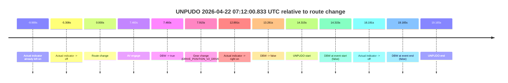
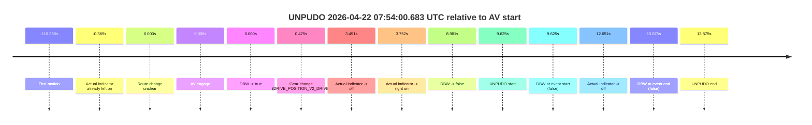

# Run Report: fme20030/2026-04-22--06-09-20--gen2-av-c27c49e5-a980-4763-9814-f0b74abf9699

| Field | Value |
|---|---|
| Run ID | `fme20030/2026-04-22--06-09-20--gen2-av-c27c49e5-a980-4763-9814-f0b74abf9699` |
| Date | `2026-04-22` |
| Model(s) | `eel-teal-outspoken` |
| Author | `zak` |
| Event count | `2` |

## unpudo 2026-04-22 07:12:00.833 UTC

| Field | Value |
|---|---|
| Model | `eel-teal-outspoken` |
| Author | `zak` |
| Run ID | `fme20030/2026-04-22--06-09-20--gen2-av-c27c49e5-a980-4763-9814-f0b74abf9699` |
| Date | `2026-04-22` |
| Time (UTC) | `07:12:00.833` |
| Event type | `unpudo` |
| Disengagement type | `failed_to_unpudo` |
| Route change | `found` |
| Console | [run](https://console.sso.wayve.ai/run/fme20030/2026-04-22--06-09-20--gen2-av-c27c49e5-a980-4763-9814-f0b74abf9699?id=&time-unixus=1776841920833302) |
| Foxglove | [segment](https://app.foxglove.dev/wayve-on-prem/p/prj_0dX18KZdVHg1fmmI/view?ds=foxglove-stream&ds.deviceName=fme20030&ds.start=2026-04-22T07%3A11%3A36.518241Z&ds.end=2026-04-22T07%3A12%3A15.683312Z&layoutId=lay_0e7VD4WIKDQGU73Y&time=2026-04-22T07%3A12%3A00.833302Z) |

### Event card: fail

- Fail: AV owns part of the segment, but the event still resolves as a model-performance failure under the AV-only scoring rule.

| Event | Time (UTC) | Delta from route change |
|---|---:|---:|
| Actual indicator already left on | 2026-04-22 07:11:36.529 | `-9.989s` |
| Actual indicator -> off | 2026-04-22 07:11:41.209 | `-5.308s` |
| Route change | 2026-04-22 07:11:46.518 | `0.000s` |
| AV engage | 2026-04-22 07:11:53.978 | `7.460s` |
| DBW -> true | 2026-04-22 07:11:53.978 | `7.460s` |
| Gear change (DRIVE_POSITION_V2_DRIVE) | 2026-04-22 07:11:54.433 | `7.915s` |
| Actual indicator -> right on | 2026-04-22 07:11:59.409 | `12.891s` |
| DBW -> false | 2026-04-22 07:11:59.799 | `13.281s` |
| UNPUDO start | 2026-04-22 07:12:00.833 | `14.315s` |
| DBW at event start (false) | 2026-04-22 07:12:00.833 | `14.315s` |
| Actual indicator -> off | 2026-04-22 07:12:02.709 | `16.191s` |
| DBW at event end (false) | 2026-04-22 07:12:05.683 | `19.165s` |
| UNPUDO end | 2026-04-22 07:12:05.683 | `19.165s` |

| Metric | Value |
|---|---|
| Outcome | `fail` |
| Effective failure type | `failed_to_unpudo` |
| Route change status | `found` |
| DBW at event start | `false` |
| DBW at event end | `false` |
| Predicted gear at AV start | `DRIVE_POSITION_V2_DRIVE` |
| Actual gear at AV start | `DRIVE_POSITION_V2_PARK` |
| Predicted gear at event start | `DRIVE_POSITION_V2_DRIVE` |
| Actual gear at event start | `DRIVE_POSITION_V2_DRIVE` |
| Planned indicator direction | `INDICATORS_STATE_V2_RIGHT_ON` |
| Controller indicator direction | `INDICATORS_STATE_V2_RIGHT_ON` |
| Actual indicator direction | `INDICATORS_STATE_V2_RIGHT_ON` |
| Actual indicator at maneuver end | `INDICATORS_STATE_V2_OFF` |
| Driver accel help in AV | `false` |
| Driver accel help timestamp | `n/a` |
| Max accel pedal pct in AV | `0.0%` |
| Max brake pedal pct in AV | `9.3%` |
| Max speed mps in AV | `0.000` |
| Success timing baseline | `route change` |
| Route -> AV | `7.460s` |
| AV -> event start | `6.855s` |
| AV -> first motion | `n/a` |
| Success baseline -> event start | `14.315s` |
| Success baseline -> first motion | `n/a` |
| AV duration before disengagement | `5.821s` |
| Trajectory waypoint count | `38` |
| Driving-plan step count | `11` |

The scored portion starts from the AV-owned window, not from the pre-AV setup. Route-change search in the stopped pre-event segment was `found`, with the baseline therefore set to route change. At the event anchor the model predicts `DRIVE_POSITION_V2_DRIVE` and the actual gear is `DRIVE_POSITION_V2_DRIVE`. The effective model outcome is `fail` because `failed_to_unpudo.`

### Resolution

| Field | Value |
|---|---|
| Final outcome | `fail` |
| Do we agree with this label? | `yes` |
| Source disengagement type | `failed_to_unpudo` |
| Resolved effective failure type | `failed_to_unpudo` |
| Confidence | `high` |

## unpudo 2026-04-22 07:54:00.683 UTC

| Field | Value |
|---|---|
| Model | `eel-teal-outspoken` |
| Author | `zak` |
| Run ID | `fme20030/2026-04-22--06-09-20--gen2-av-c27c49e5-a980-4763-9814-f0b74abf9699` |
| Date | `2026-04-22` |
| Time (UTC) | `07:54:00.683` |
| Event type | `unpudo` |
| Disengagement type | `failed_to_unpudo` |
| Route change | `unclear` |
| Console | [run](https://console.sso.wayve.ai/run/fme20030/2026-04-22--06-09-20--gen2-av-c27c49e5-a980-4763-9814-f0b74abf9699?id=&time-unixus=1776844440683299) |
| Foxglove | [segment](https://app.foxglove.dev/wayve-on-prem/p/prj_0dX18KZdVHg1fmmI/view?ds=foxglove-stream&ds.deviceName=fme20030&ds.start=2026-04-22T07%3A53%3A41.058291Z&ds.end=2026-04-22T07%3A54%3A14.933302Z&layoutId=lay_0e7VD4WIKDQGU73Y&time=2026-04-22T07%3A54%3A00.683299Z) |

### Event card: fail

- Fail: AV owns part of the segment, but the event still resolves as a model-performance failure under the AV-only scoring rule.

| Event | Time (UTC) | Delta from AV start |
|---|---:|---:|
| First motion | 2026-04-22 07:52:00.689 | `-110.369s` |
| Actual indicator already left on | 2026-04-22 07:53:50.689 | `-0.369s` |
| Route change unclear | 2026-04-22 07:53:51.058 | `0.000s` |
| AV engage | 2026-04-22 07:53:51.058 | `0.000s` |
| DBW -> true | 2026-04-22 07:53:51.058 | `0.000s` |
| Gear change (DRIVE_POSITION_V2_DRIVE) | 2026-04-22 07:53:51.533 | `0.475s` |
| Actual indicator -> off | 2026-04-22 07:53:54.549 | `3.491s` |
| Actual indicator -> right on | 2026-04-22 07:53:54.809 | `3.752s` |
| DBW -> false | 2026-04-22 07:54:00.039 | `8.981s` |
| UNPUDO start | 2026-04-22 07:54:00.683 | `9.625s` |
| DBW at event start (false) | 2026-04-22 07:54:00.683 | `9.625s` |
| Actual indicator -> off | 2026-04-22 07:54:03.709 | `12.651s` |
| DBW at event end (false) | 2026-04-22 07:54:04.933 | `13.875s` |
| UNPUDO end | 2026-04-22 07:54:04.933 | `13.875s` |

| Metric | Value |
|---|---|
| Outcome | `fail` |
| Effective failure type | `failed_to_unpudo` |
| Route change status | `unclear` |
| DBW at event start | `false` |
| DBW at event end | `false` |
| Predicted gear at AV start | `DRIVE_POSITION_V2_DRIVE` |
| Actual gear at AV start | `DRIVE_POSITION_V2_PARK` |
| Predicted gear at event start | `DRIVE_POSITION_V2_DRIVE` |
| Actual gear at event start | `DRIVE_POSITION_V2_DRIVE` |
| Planned indicator direction | `INDICATORS_STATE_V2_RIGHT_ON` |
| Controller indicator direction | `INDICATORS_STATE_V2_RIGHT_ON` |
| Actual indicator direction | `INDICATORS_STATE_V2_RIGHT_ON` |
| Actual indicator at maneuver end | `INDICATORS_STATE_V2_OFF` |
| Driver accel help in AV | `false` |
| Driver accel help timestamp | `n/a` |
| Max accel pedal pct in AV | `0.0%` |
| Max brake pedal pct in AV | `8.0%` |
| Max speed mps in AV | `0.000` |
| Success timing baseline | `AV start` |
| Route -> AV | `n/a` |
| AV -> event start | `9.625s` |
| AV -> first motion | `-110.369s` |
| Success baseline -> event start | `9.625s` |
| Success baseline -> first motion | `-110.369s` |
| AV duration before disengagement | `8.981s` |
| Trajectory waypoint count | `37` |
| Driving-plan step count | `11` |

The scored portion starts from the AV-owned window, not from the pre-AV setup. Route-change search in the stopped pre-event segment was `unclear`, with the baseline therefore set to AV start. At the event anchor the model predicts `DRIVE_POSITION_V2_DRIVE` and the actual gear is `DRIVE_POSITION_V2_DRIVE`. The effective model outcome is `fail` because `failed_to_unpudo.`

### Resolution

| Field | Value |
|---|---|
| Final outcome | `fail` |
| Do we agree with this label? | `yes` |
| Source disengagement type | `failed_to_unpudo` |
| Resolved effective failure type | `failed_to_unpudo` |
| Confidence | `medium` |
