# Run Report: fme20030/2026-04-22--06-09-20--gen2-av-c27c49e5-a980-4763-9814-f0b74abf9699

| Field | Value |
|---|---|
| Run ID | `fme20030/2026-04-22--06-09-20--gen2-av-c27c49e5-a980-4763-9814-f0b74abf9699` |
| Date | `2026-04-22` |
| Model(s) | `pink-manta-ray-smooth` |
| Author | `guy.geva` |
| Event count | `11` |

## unpudo 2026-04-22 06:18:33.333 UTC

| Field | Value |
|---|---|
| Model | `pink-manta-ray-smooth` |
| Author | `guy.geva` |
| Run ID | `fme20030/2026-04-22--06-09-20--gen2-av-c27c49e5-a980-4763-9814-f0b74abf9699` |
| Date | `2026-04-22` |
| Time (UTC) | `06:18:33.333` |
| Event type | `unpudo` |
| Disengagement type | `failed_to_unpudo` |
| Route change | `found` |
| Console | [run](https://console.sso.wayve.ai/run/fme20030/2026-04-22--06-09-20--gen2-av-c27c49e5-a980-4763-9814-f0b74abf9699?id=&time-unixus=1776838713333291) |
| Foxglove | [segment](https://app.foxglove.dev/wayve-on-prem/p/prj_0dX18KZdVHg1fmmI/view?ds=foxglove-stream&ds.deviceName=fme20030&ds.start=2026-04-22T06%3A18%3A03.868377Z&ds.end=2026-04-22T06%3A18%3A47.333292Z&layoutId=lay_0e7VD4WIKDQGU73Y&time=2026-04-22T06%3A18%3A33.333291Z) |

### Event card: fail

- Fail: AV owns part of the segment, but the event still resolves as a model-performance failure under the AV-only scoring rule.

| Event | Time (UTC) | Delta from route change |
|---|---:|---:|
| Actual indicator already left on | 2026-04-22 06:18:03.869 | `-9.999s` |
| Actual indicator -> off | 2026-04-22 06:18:10.209 | `-3.659s` |
| Route change | 2026-04-22 06:18:13.868 | `0.000s` |
| AV engage | 2026-04-22 06:18:24.618 | `10.750s` |
| DBW -> true | 2026-04-22 06:18:24.618 | `10.750s` |
| Gear change (DRIVE_POSITION_V2_DRIVE) | 2026-04-22 06:18:25.033 | `11.165s` |
| DBW -> false | 2026-04-22 06:18:32.639 | `18.771s` |
| Actual indicator -> right on | 2026-04-22 06:18:32.909 | `19.041s` |
| UNPUDO start | 2026-04-22 06:18:33.333 | `19.465s` |
| DBW at event start (false) | 2026-04-22 06:18:33.333 | `19.465s` |
| Actual indicator -> off | 2026-04-22 06:18:36.709 | `22.841s` |
| DBW at event end (false) | 2026-04-22 06:18:37.333 | `23.465s` |
| UNPUDO end | 2026-04-22 06:18:37.333 | `23.465s` |

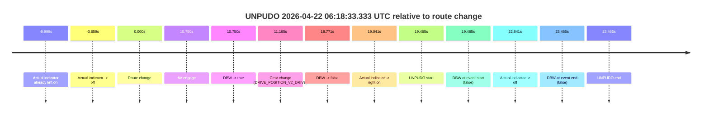

| Metric | Value |
|---|---|
| Outcome | `fail` |
| Effective failure type | `failed_to_unpudo` |
| Route change status | `found` |
| DBW at event start | `false` |
| DBW at event end | `false` |
| Predicted gear at AV start | `DRIVE_POSITION_V2_DRIVE` |
| Actual gear at AV start | `DRIVE_POSITION_V2_PARK` |
| Predicted gear at event start | `DRIVE_POSITION_V2_DRIVE` |
| Actual gear at event start | `DRIVE_POSITION_V2_DRIVE` |
| Planned indicator direction | `INDICATORS_STATE_V2_RIGHT_ON` |
| Controller indicator direction | `INDICATORS_STATE_V2_RIGHT_ON` |
| Actual indicator direction | `INDICATORS_STATE_V2_RIGHT_ON` |
| Actual indicator at maneuver end | `INDICATORS_STATE_V2_OFF` |
| Driver accel help in AV | `false` |
| Driver accel help timestamp | `n/a` |
| Max accel pedal pct in AV | `0.0%` |
| Max brake pedal pct in AV | `8.9%` |
| Max speed mps in AV | `0.000` |
| Success timing baseline | `route change` |
| Route -> AV | `10.750s` |
| AV -> event start | `8.715s` |
| AV -> first motion | `n/a` |
| Success baseline -> event start | `19.465s` |
| Success baseline -> first motion | `n/a` |
| AV duration before disengagement | `8.021s` |
| Trajectory waypoint count | `38` |
| Driving-plan step count | `11` |

The scored portion starts from the AV-owned window, not from the pre-AV setup. Route-change search in the stopped pre-event segment was `found`, with the baseline therefore set to route change. At the event anchor the model predicts `DRIVE_POSITION_V2_DRIVE` and the actual gear is `DRIVE_POSITION_V2_DRIVE`. The effective model outcome is `fail` because `failed_to_unpudo.`

### Resolution

| Field | Value |
|---|---|
| Final outcome | `fail` |
| Do we agree with this label? | `yes` |
| Source disengagement type | `failed_to_unpudo` |
| Resolved effective failure type | `failed_to_unpudo` |
| Confidence | `high` |

## unpudo 2026-04-22 06:21:21.133 UTC

| Field | Value |
|---|---|
| Model | `pink-manta-ray-smooth` |
| Author | `guy.geva` |
| Run ID | `fme20030/2026-04-22--06-09-20--gen2-av-c27c49e5-a980-4763-9814-f0b74abf9699` |
| Date | `2026-04-22` |
| Time (UTC) | `06:21:21.133` |
| Event type | `unpudo` |
| Disengagement type | `failed_to_unpudo` |
| Route change | `found` |
| Console | [run](https://console.sso.wayve.ai/run/fme20030/2026-04-22--06-09-20--gen2-av-c27c49e5-a980-4763-9814-f0b74abf9699?id=&time-unixus=1776838881133317) |
| Foxglove | [segment](https://app.foxglove.dev/wayve-on-prem/p/prj_0dX18KZdVHg1fmmI/view?ds=foxglove-stream&ds.deviceName=fme20030&ds.start=2026-04-22T06%3A20%3A52.868440Z&ds.end=2026-04-22T06%3A21%3A31.133317Z&layoutId=lay_0e7VD4WIKDQGU73Y&time=2026-04-22T06%3A21%3A21.133317Z) |

### Event card: fail

- Fail: AV owns part of the segment, but the event still resolves as a model-performance failure under the AV-only scoring rule.

| Event | Time (UTC) | Delta from route change |
|---|---:|---:|
| Route change | 2026-04-22 06:21:02.868 | `0.000s` |
| AV engage | 2026-04-22 06:21:12.178 | `9.310s` |
| DBW -> true | 2026-04-22 06:21:12.178 | `9.310s` |
| Gear change (DRIVE_POSITION_V2_DRIVE) | 2026-04-22 06:21:12.833 | `9.965s` |
| Actual indicator -> left on | 2026-04-22 06:21:17.649 | `14.781s` |
| DBW -> false | 2026-04-22 06:21:20.119 | `17.251s` |
| UNPUDO start | 2026-04-22 06:21:21.133 | `18.265s` |
| DBW at event start (false) | 2026-04-22 06:21:21.133 | `18.265s` |
| DBW at event end (false) | 2026-04-22 06:21:21.133 | `18.265s` |
| UNPUDO end | 2026-04-22 06:21:21.133 | `18.265s` |
| Actual indicator -> off | 2026-04-22 06:21:25.549 | `22.681s` |
| Actual indicator -> right on | 2026-04-22 06:21:27.209 | `24.341s` |

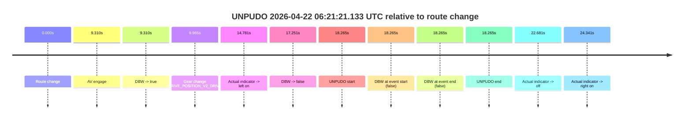

| Metric | Value |
|---|---|
| Outcome | `fail` |
| Effective failure type | `failed_to_unpudo` |
| Route change status | `found` |
| DBW at event start | `false` |
| DBW at event end | `false` |
| Predicted gear at AV start | `DRIVE_POSITION_V2_DRIVE` |
| Actual gear at AV start | `DRIVE_POSITION_V2_PARK` |
| Predicted gear at event start | `DRIVE_POSITION_V2_DRIVE` |
| Actual gear at event start | `DRIVE_POSITION_V2_DRIVE` |
| Planned indicator direction | `INDICATORS_STATE_V2_OFF` |
| Controller indicator direction | `INDICATORS_STATE_V2_OFF` |
| Actual indicator direction | `INDICATORS_STATE_V2_LEFT_ON` |
| Actual indicator at maneuver end | `INDICATORS_STATE_V2_LEFT_ON` |
| Driver accel help in AV | `false` |
| Driver accel help timestamp | `n/a` |
| Max accel pedal pct in AV | `0.0%` |
| Max brake pedal pct in AV | `8.0%` |
| Max speed mps in AV | `0.000` |
| Success timing baseline | `route change` |
| Route -> AV | `9.310s` |
| AV -> event start | `8.955s` |
| AV -> first motion | `n/a` |
| Success baseline -> event start | `18.265s` |
| Success baseline -> first motion | `n/a` |
| AV duration before disengagement | `7.941s` |
| Trajectory waypoint count | `38` |
| Driving-plan step count | `11` |

The scored portion starts from the AV-owned window, not from the pre-AV setup. Route-change search in the stopped pre-event segment was `found`, with the baseline therefore set to route change. At the event anchor the model predicts `DRIVE_POSITION_V2_DRIVE` and the actual gear is `DRIVE_POSITION_V2_DRIVE`. The effective model outcome is `fail` because `failed_to_unpudo.`

### Resolution

| Field | Value |
|---|---|
| Final outcome | `fail` |
| Do we agree with this label? | `yes` |
| Source disengagement type | `failed_to_unpudo` |
| Resolved effective failure type | `failed_to_unpudo` |
| Confidence | `high` |

## unpudo 2026-04-22 06:31:20.533 UTC

| Field | Value |
|---|---|
| Model | `pink-manta-ray-smooth` |
| Author | `guy.geva` |
| Run ID | `fme20030/2026-04-22--06-09-20--gen2-av-c27c49e5-a980-4763-9814-f0b74abf9699` |
| Date | `2026-04-22` |
| Time (UTC) | `06:31:20.533` |
| Event type | `unpudo` |
| Disengagement type | `failed_to_unpudo` |
| Route change | `found` |
| Console | [run](https://console.sso.wayve.ai/run/fme20030/2026-04-22--06-09-20--gen2-av-c27c49e5-a980-4763-9814-f0b74abf9699?id=&time-unixus=1776839480533290) |
| Foxglove | [segment](https://app.foxglove.dev/wayve-on-prem/p/prj_0dX18KZdVHg1fmmI/view?ds=foxglove-stream&ds.deviceName=fme20030&ds.start=2026-04-22T06%3A30%3A58.018273Z&ds.end=2026-04-22T06%3A31%3A34.583321Z&layoutId=lay_0e7VD4WIKDQGU73Y&time=2026-04-22T06%3A31%3A20.533290Z) |

### Event card: fail

- Fail: AV owns part of the segment, but the event still resolves as a model-performance failure under the AV-only scoring rule.

| Event | Time (UTC) | Delta from route change |
|---|---:|---:|
| Actual indicator already left on | 2026-04-22 06:30:58.029 | `-9.989s` |
| Actual indicator -> off | 2026-04-22 06:31:00.849 | `-7.169s` |
| Route change | 2026-04-22 06:31:08.018 | `0.000s` |
| AV engage | 2026-04-22 06:31:11.838 | `3.820s` |
| DBW -> true | 2026-04-22 06:31:11.838 | `3.820s` |
| Gear change (DRIVE_POSITION_V2_DRIVE) | 2026-04-22 06:31:12.333 | `4.315s` |
| DBW -> false | 2026-04-22 06:31:19.659 | `11.642s` |
| UNPUDO start | 2026-04-22 06:31:20.533 | `12.515s` |
| DBW at event start (false) | 2026-04-22 06:31:20.533 | `12.515s` |
| Actual indicator -> right on | 2026-04-22 06:31:20.669 | `12.651s` |
| Actual indicator -> off | 2026-04-22 06:31:22.929 | `14.911s` |
| DBW at event end (false) | 2026-04-22 06:31:24.583 | `16.565s` |
| UNPUDO end | 2026-04-22 06:31:24.583 | `16.565s` |

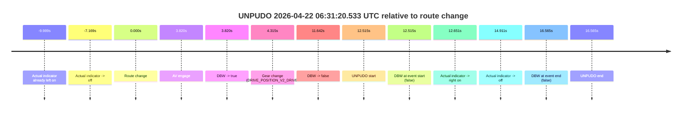

| Metric | Value |
|---|---|
| Outcome | `fail` |
| Effective failure type | `failed_to_unpudo` |
| Route change status | `found` |
| DBW at event start | `false` |
| DBW at event end | `false` |
| Predicted gear at AV start | `DRIVE_POSITION_V2_DRIVE` |
| Actual gear at AV start | `DRIVE_POSITION_V2_PARK` |
| Predicted gear at event start | `DRIVE_POSITION_V2_DRIVE` |
| Actual gear at event start | `DRIVE_POSITION_V2_DRIVE` |
| Planned indicator direction | `INDICATORS_STATE_V2_RIGHT_ON` |
| Controller indicator direction | `INDICATORS_STATE_V2_RIGHT_ON` |
| Actual indicator direction | `INDICATORS_STATE_V2_OFF` |
| Actual indicator at maneuver end | `INDICATORS_STATE_V2_OFF` |
| Driver accel help in AV | `false` |
| Driver accel help timestamp | `n/a` |
| Max accel pedal pct in AV | `0.0%` |
| Max brake pedal pct in AV | `8.0%` |
| Max speed mps in AV | `0.000` |
| Success timing baseline | `route change` |
| Route -> AV | `3.820s` |
| AV -> event start | `8.695s` |
| AV -> first motion | `n/a` |
| Success baseline -> event start | `12.515s` |
| Success baseline -> first motion | `n/a` |
| AV duration before disengagement | `7.822s` |
| Trajectory waypoint count | `36` |
| Driving-plan step count | `11` |

The scored portion starts from the AV-owned window, not from the pre-AV setup. Route-change search in the stopped pre-event segment was `found`, with the baseline therefore set to route change. At the event anchor the model predicts `DRIVE_POSITION_V2_DRIVE` and the actual gear is `DRIVE_POSITION_V2_DRIVE`. The effective model outcome is `fail` because `failed_to_unpudo.`

### Resolution

| Field | Value |
|---|---|
| Final outcome | `fail` |
| Do we agree with this label? | `yes` |
| Source disengagement type | `failed_to_unpudo` |
| Resolved effective failure type | `failed_to_unpudo` |
| Confidence | `high` |

## unpudo 2026-04-22 06:36:44.733 UTC

| Field | Value |
|---|---|
| Model | `pink-manta-ray-smooth` |
| Author | `guy.geva` |
| Run ID | `fme20030/2026-04-22--06-09-20--gen2-av-c27c49e5-a980-4763-9814-f0b74abf9699` |
| Date | `2026-04-22` |
| Time (UTC) | `06:36:44.733` |
| Event type | `unpudo` |
| Disengagement type | `failed_to_unpudo` |
| Route change | `found` |
| Console | [run](https://console.sso.wayve.ai/run/fme20030/2026-04-22--06-09-20--gen2-av-c27c49e5-a980-4763-9814-f0b74abf9699?id=&time-unixus=1776839804733315) |
| Foxglove | [segment](https://app.foxglove.dev/wayve-on-prem/p/prj_0dX18KZdVHg1fmmI/view?ds=foxglove-stream&ds.deviceName=fme20030&ds.start=2026-04-22T06%3A36%3A25.518264Z&ds.end=2026-04-22T06%3A36%3A59.183319Z&layoutId=lay_0e7VD4WIKDQGU73Y&time=2026-04-22T06%3A36%3A44.733315Z) |

### Event card: fail

- Fail: AV owns part of the segment, but the event still resolves as a model-performance failure under the AV-only scoring rule.

| Event | Time (UTC) | Delta from route change |
|---|---:|---:|
| Route change | 2026-04-22 06:36:35.518 | `0.000s` |
| AV engage | 2026-04-22 06:36:38.838 | `3.320s` |
| DBW -> true | 2026-04-22 06:36:38.838 | `3.320s` |
| Gear change (DRIVE_POSITION_V2_DRIVE) | 2026-04-22 06:36:39.333 | `3.815s` |
| DBW -> false | 2026-04-22 06:36:43.699 | `8.181s` |
| Actual indicator -> right on | 2026-04-22 06:36:43.829 | `8.311s` |
| UNPUDO start | 2026-04-22 06:36:44.733 | `9.215s` |
| DBW at event start (false) | 2026-04-22 06:36:44.733 | `9.215s` |
| Actual indicator -> off | 2026-04-22 06:36:46.269 | `10.751s` |
| DBW at event end (false) | 2026-04-22 06:36:49.183 | `13.665s` |
| UNPUDO end | 2026-04-22 06:36:49.183 | `13.665s` |

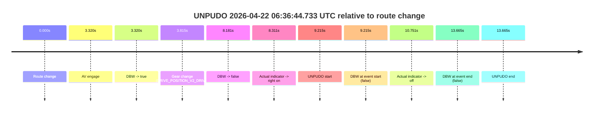

| Metric | Value |
|---|---|
| Outcome | `fail` |
| Effective failure type | `failed_to_unpudo` |
| Route change status | `found` |
| DBW at event start | `false` |
| DBW at event end | `false` |
| Predicted gear at AV start | `DRIVE_POSITION_V2_DRIVE` |
| Actual gear at AV start | `DRIVE_POSITION_V2_PARK` |
| Predicted gear at event start | `DRIVE_POSITION_V2_DRIVE` |
| Actual gear at event start | `DRIVE_POSITION_V2_DRIVE` |
| Planned indicator direction | `INDICATORS_STATE_V2_RIGHT_ON` |
| Controller indicator direction | `INDICATORS_STATE_V2_RIGHT_ON` |
| Actual indicator direction | `INDICATORS_STATE_V2_RIGHT_ON` |
| Actual indicator at maneuver end | `INDICATORS_STATE_V2_OFF` |
| Driver accel help in AV | `false` |
| Driver accel help timestamp | `n/a` |
| Max accel pedal pct in AV | `0.0%` |
| Max brake pedal pct in AV | `8.0%` |
| Max speed mps in AV | `0.000` |
| Success timing baseline | `route change` |
| Route -> AV | `3.320s` |
| AV -> event start | `5.895s` |
| AV -> first motion | `n/a` |
| Success baseline -> event start | `9.215s` |
| Success baseline -> first motion | `n/a` |
| AV duration before disengagement | `4.861s` |
| Trajectory waypoint count | `36` |
| Driving-plan step count | `11` |

The scored portion starts from the AV-owned window, not from the pre-AV setup. Route-change search in the stopped pre-event segment was `found`, with the baseline therefore set to route change. At the event anchor the model predicts `DRIVE_POSITION_V2_DRIVE` and the actual gear is `DRIVE_POSITION_V2_DRIVE`. The effective model outcome is `fail` because `failed_to_unpudo.`

### Resolution

| Field | Value |
|---|---|
| Final outcome | `fail` |
| Do we agree with this label? | `yes` |
| Source disengagement type | `failed_to_unpudo` |
| Resolved effective failure type | `failed_to_unpudo` |
| Confidence | `high` |

## unpudo 2026-04-22 06:44:48.233 UTC

| Field | Value |
|---|---|
| Model | `pink-manta-ray-smooth` |
| Author | `guy.geva` |
| Run ID | `fme20030/2026-04-22--06-09-20--gen2-av-c27c49e5-a980-4763-9814-f0b74abf9699` |
| Date | `2026-04-22` |
| Time (UTC) | `06:44:48.233` |
| Event type | `unpudo` |
| Disengagement type | `failed_to_unpudo` |
| Route change | `found` |
| Console | [run](https://console.sso.wayve.ai/run/fme20030/2026-04-22--06-09-20--gen2-av-c27c49e5-a980-4763-9814-f0b74abf9699?id=&time-unixus=1776840288233305) |
| Foxglove | [segment](https://app.foxglove.dev/wayve-on-prem/p/prj_0dX18KZdVHg1fmmI/view?ds=foxglove-stream&ds.deviceName=fme20030&ds.start=2026-04-22T06%3A44%3A09.919592Z&ds.end=2026-04-22T06%3A45%3A04.633300Z&layoutId=lay_0e7VD4WIKDQGU73Y&time=2026-04-22T06%3A44%3A48.233305Z) |

### Event card: fail

- Fail: AV owns part of the segment, but the event still resolves as a model-performance failure under the AV-only scoring rule.

| Event | Time (UTC) | Delta from route change |
|---|---:|---:|
| Actual indicator already left on | 2026-04-22 06:44:09.929 | `-9.990s` |
| Route change | 2026-04-22 06:44:19.919 | `0.000s` |
| Actual indicator -> off | 2026-04-22 06:44:39.989 | `20.070s` |
| AV engage | 2026-04-22 06:44:44.498 | `24.579s` |
| DBW -> true | 2026-04-22 06:44:44.498 | `24.579s` |
| Gear change (DRIVE_POSITION_V2_DRIVE) | 2026-04-22 06:44:44.933 | `25.014s` |
| DBW -> false | 2026-04-22 06:44:47.379 | `27.460s` |
| UNPUDO start | 2026-04-22 06:44:48.233 | `28.314s` |
| DBW at event start (false) | 2026-04-22 06:44:48.233 | `28.314s` |
| DBW at event end (false) | 2026-04-22 06:44:54.633 | `34.714s` |
| UNPUDO end | 2026-04-22 06:44:54.633 | `34.714s` |

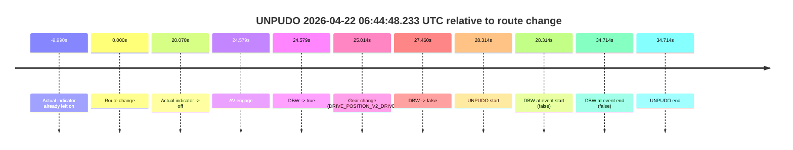

| Metric | Value |
|---|---|
| Outcome | `fail` |
| Effective failure type | `failed_to_unpudo` |
| Route change status | `found` |
| DBW at event start | `false` |
| DBW at event end | `false` |
| Predicted gear at AV start | `DRIVE_POSITION_V2_DRIVE` |
| Actual gear at AV start | `DRIVE_POSITION_V2_PARK` |
| Predicted gear at event start | `DRIVE_POSITION_V2_DRIVE` |
| Actual gear at event start | `DRIVE_POSITION_V2_DRIVE` |
| Planned indicator direction | `INDICATORS_STATE_V2_RIGHT_ON` |
| Controller indicator direction | `INDICATORS_STATE_V2_RIGHT_ON` |
| Actual indicator direction | `INDICATORS_STATE_V2_OFF` |
| Actual indicator at maneuver end | `INDICATORS_STATE_V2_OFF` |
| Driver accel help in AV | `false` |
| Driver accel help timestamp | `n/a` |
| Max accel pedal pct in AV | `0.0%` |
| Max brake pedal pct in AV | `11.3%` |
| Max speed mps in AV | `0.000` |
| Success timing baseline | `route change` |
| Route -> AV | `24.579s` |
| AV -> event start | `3.735s` |
| AV -> first motion | `n/a` |
| Success baseline -> event start | `28.314s` |
| Success baseline -> first motion | `n/a` |
| AV duration before disengagement | `2.881s` |
| Trajectory waypoint count | `36` |
| Driving-plan step count | `11` |

The scored portion starts from the AV-owned window, not from the pre-AV setup. Route-change search in the stopped pre-event segment was `found`, with the baseline therefore set to route change. At the event anchor the model predicts `DRIVE_POSITION_V2_DRIVE` and the actual gear is `DRIVE_POSITION_V2_DRIVE`. The effective model outcome is `fail` because `failed_to_unpudo.`

### Resolution

| Field | Value |
|---|---|
| Final outcome | `fail` |
| Do we agree with this label? | `yes` |
| Source disengagement type | `failed_to_unpudo` |
| Resolved effective failure type | `failed_to_unpudo` |
| Confidence | `high` |

## unpudo 2026-04-22 07:13:06.883 UTC

| Field | Value |
|---|---|
| Model | `pink-manta-ray-smooth` |
| Author | `guy.geva` |
| Run ID | `fme20030/2026-04-22--06-09-20--gen2-av-c27c49e5-a980-4763-9814-f0b74abf9699` |
| Date | `2026-04-22` |
| Time (UTC) | `07:13:06.883` |
| Event type | `unpudo` |
| Disengagement type | `failed_to_accelerate` |
| Route change | `found` |
| Console | [run](https://console.sso.wayve.ai/run/fme20030/2026-04-22--06-09-20--gen2-av-c27c49e5-a980-4763-9814-f0b74abf9699?id=&time-unixus=1776841986883321) |
| Foxglove | [segment](https://app.foxglove.dev/wayve-on-prem/p/prj_0dX18KZdVHg1fmmI/view?ds=foxglove-stream&ds.deviceName=fme20030&ds.start=2026-04-22T07%3A11%3A36.518241Z&ds.end=2026-04-22T07%3A13%3A45.033310Z&layoutId=lay_0e7VD4WIKDQGU73Y&time=2026-04-22T07%3A13%3A06.883321Z) |

### Event card: fail

- Fail: AV owns part of the segment, but the event still resolves as a model-performance failure under the AV-only scoring rule.

| Event | Time (UTC) | Delta from route change |
|---|---:|---:|
| Actual indicator already left on | 2026-04-22 07:11:36.529 | `-9.989s` |
| Actual indicator -> off | 2026-04-22 07:11:41.209 | `-5.308s` |
| Route change | 2026-04-22 07:11:46.518 | `0.000s` |
| Actual indicator -> right on | 2026-04-22 07:11:59.409 | `12.891s` |
| First motion | 2026-04-22 07:12:00.949 | `14.431s` |
| Actual indicator -> off | 2026-04-22 07:12:02.709 | `16.191s` |
| Actual indicator -> left on | 2026-04-22 07:12:31.489 | `44.971s` |
| Actual indicator -> off | 2026-04-22 07:12:38.629 | `52.111s` |
| AV engage | 2026-04-22 07:12:55.718 | `69.200s` |
| DBW -> true | 2026-04-22 07:12:55.718 | `69.200s` |
| Gear change (DRIVE_POSITION_V2_DRIVE) | 2026-04-22 07:12:56.233 | `69.715s` |
| Actual indicator -> right on | 2026-04-22 07:12:58.989 | `72.471s` |
| UNPUDO start | 2026-04-22 07:13:06.883 | `80.365s` |
| DBW at event start (true) | 2026-04-22 07:13:06.883 | `80.365s` |
| Actual indicator -> off | 2026-04-22 07:13:09.429 | `82.912s` |
| DBW -> false | 2026-04-22 07:13:33.439 | `106.921s` |
| DBW at event end (false) | 2026-04-22 07:13:35.033 | `108.515s` |
| UNPUDO end | 2026-04-22 07:13:35.033 | `108.515s` |

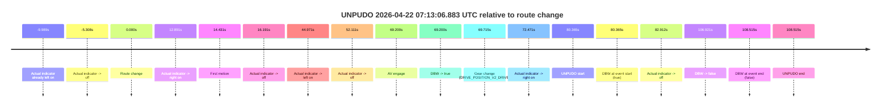

| Metric | Value |
|---|---|
| Outcome | `fail` |
| Effective failure type | `failed_to_accelerate` |
| Route change status | `found` |
| DBW at event start | `true` |
| DBW at event end | `false` |
| Predicted gear at AV start | `DRIVE_POSITION_V2_DRIVE` |
| Actual gear at AV start | `DRIVE_POSITION_V2_PARK` |
| Predicted gear at event start | `DRIVE_POSITION_V2_DRIVE` |
| Actual gear at event start | `DRIVE_POSITION_V2_DRIVE` |
| Planned indicator direction | `INDICATORS_STATE_V2_RIGHT_ON` |
| Controller indicator direction | `INDICATORS_STATE_V2_RIGHT_ON` |
| Actual indicator direction | `INDICATORS_STATE_V2_RIGHT_ON` |
| Actual indicator at maneuver end | `INDICATORS_STATE_V2_OFF` |
| Driver accel help in AV | `false` |
| Driver accel help timestamp | `n/a` |
| Max accel pedal pct in AV | `0.0%` |
| Max brake pedal pct in AV | `9.3%` |
| Max speed mps in AV | `2.139` |
| Success timing baseline | `route change` |
| Route -> AV | `69.200s` |
| AV -> event start | `11.165s` |
| AV -> first motion | `-54.769s` |
| Success baseline -> event start | `80.365s` |
| Success baseline -> first motion | `14.431s` |
| AV duration before disengagement | `37.721s` |
| Trajectory waypoint count | `37` |
| Driving-plan step count | `11` |

The scored portion starts from the AV-owned window, not from the pre-AV setup. Route-change search in the stopped pre-event segment was `found`, with the baseline therefore set to route change. At the event anchor the model predicts `DRIVE_POSITION_V2_DRIVE` and the actual gear is `DRIVE_POSITION_V2_DRIVE`. The effective model outcome is `fail` because `failed_to_accelerate.`

### Resolution

| Field | Value |
|---|---|
| Final outcome | `fail` |
| Do we agree with this label? | `yes` |
| Source disengagement type | `failed_to_accelerate` |
| Resolved effective failure type | `failed_to_accelerate` |
| Confidence | `high` |

## unpudo 2026-04-22 07:16:54.433 UTC

| Field | Value |
|---|---|
| Model | `pink-manta-ray-smooth` |
| Author | `guy.geva` |
| Run ID | `fme20030/2026-04-22--06-09-20--gen2-av-c27c49e5-a980-4763-9814-f0b74abf9699` |
| Date | `2026-04-22` |
| Time (UTC) | `07:16:54.433` |
| Event type | `unpudo` |
| Disengagement type | `failed_to_unpudo` |
| Route change | `found` |
| Console | [run](https://console.sso.wayve.ai/run/fme20030/2026-04-22--06-09-20--gen2-av-c27c49e5-a980-4763-9814-f0b74abf9699?id=&time-unixus=1776842214433305) |
| Foxglove | [segment](https://app.foxglove.dev/wayve-on-prem/p/prj_0dX18KZdVHg1fmmI/view?ds=foxglove-stream&ds.deviceName=fme20030&ds.start=2026-04-22T07%3A16%3A25.720691Z&ds.end=2026-04-22T07%3A17%3A11.533311Z&layoutId=lay_0e7VD4WIKDQGU73Y&time=2026-04-22T07%3A16%3A54.433305Z) |

### Event card: fail

- Fail: AV owns part of the segment, but the event still resolves as a model-performance failure under the AV-only scoring rule.

| Event | Time (UTC) | Delta from route change |
|---|---:|---:|
| Actual indicator already left on | 2026-04-22 07:16:25.729 | `-9.991s` |
| Actual indicator -> off | 2026-04-22 07:16:28.549 | `-7.171s` |
| Route change | 2026-04-22 07:16:35.720 | `0.000s` |
| AV engage | 2026-04-22 07:16:42.778 | `7.058s` |
| DBW -> true | 2026-04-22 07:16:42.778 | `7.058s` |
| Gear change (DRIVE_POSITION_V2_DRIVE) | 2026-04-22 07:16:43.133 | `7.413s` |
| DBW -> false | 2026-04-22 07:16:53.599 | `17.879s` |
| UNPUDO start | 2026-04-22 07:16:54.433 | `18.713s` |
| DBW at event start (false) | 2026-04-22 07:16:54.433 | `18.713s` |
| Actual indicator -> right on | 2026-04-22 07:16:54.509 | `18.789s` |
| DBW at event end (false) | 2026-04-22 07:17:01.533 | `25.813s` |
| UNPUDO end | 2026-04-22 07:17:01.533 | `25.813s` |
| Actual indicator -> off | 2026-04-22 07:17:12.729 | `37.009s` |
| Actual indicator -> left on | 2026-04-22 07:17:14.889 | `39.169s` |
| Actual indicator -> off | 2026-04-22 07:17:17.709 | `41.989s` |
| Actual indicator -> right on | 2026-04-22 07:17:18.909 | `43.189s` |
| Actual indicator -> off | 2026-04-22 07:17:20.949 | `45.229s` |

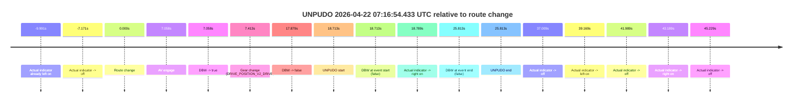

| Metric | Value |
|---|---|
| Outcome | `fail` |
| Effective failure type | `failed_to_unpudo` |
| Route change status | `found` |
| DBW at event start | `false` |
| DBW at event end | `false` |
| Predicted gear at AV start | `DRIVE_POSITION_V2_DRIVE` |
| Actual gear at AV start | `DRIVE_POSITION_V2_PARK` |
| Predicted gear at event start | `DRIVE_POSITION_V2_DRIVE` |
| Actual gear at event start | `DRIVE_POSITION_V2_DRIVE` |
| Planned indicator direction | `INDICATORS_STATE_V2_RIGHT_ON` |
| Controller indicator direction | `INDICATORS_STATE_V2_RIGHT_ON` |
| Actual indicator direction | `INDICATORS_STATE_V2_OFF` |
| Actual indicator at maneuver end | `INDICATORS_STATE_V2_RIGHT_ON` |
| Driver accel help in AV | `false` |
| Driver accel help timestamp | `n/a` |
| Max accel pedal pct in AV | `0.0%` |
| Max brake pedal pct in AV | `8.0%` |
| Max speed mps in AV | `0.000` |
| Success timing baseline | `route change` |
| Route -> AV | `7.058s` |
| AV -> event start | `11.655s` |
| AV -> first motion | `n/a` |
| Success baseline -> event start | `18.713s` |
| Success baseline -> first motion | `n/a` |
| AV duration before disengagement | `10.822s` |
| Trajectory waypoint count | `36` |
| Driving-plan step count | `11` |

The scored portion starts from the AV-owned window, not from the pre-AV setup. Route-change search in the stopped pre-event segment was `found`, with the baseline therefore set to route change. At the event anchor the model predicts `DRIVE_POSITION_V2_DRIVE` and the actual gear is `DRIVE_POSITION_V2_DRIVE`. The effective model outcome is `fail` because `failed_to_unpudo.`

### Resolution

| Field | Value |
|---|---|
| Final outcome | `fail` |
| Do we agree with this label? | `yes` |
| Source disengagement type | `failed_to_unpudo` |
| Resolved effective failure type | `failed_to_unpudo` |
| Confidence | `high` |

## unpudo 2026-04-22 07:18:58.883 UTC

| Field | Value |
|---|---|
| Model | `pink-manta-ray-smooth` |
| Author | `guy.geva` |
| Run ID | `fme20030/2026-04-22--06-09-20--gen2-av-c27c49e5-a980-4763-9814-f0b74abf9699` |
| Date | `2026-04-22` |
| Time (UTC) | `07:18:58.883` |
| Event type | `unpudo` |
| Disengagement type | `failed_to_unpudo` |
| Route change | `found` |
| Console | [run](https://console.sso.wayve.ai/run/fme20030/2026-04-22--06-09-20--gen2-av-c27c49e5-a980-4763-9814-f0b74abf9699?id=&time-unixus=1776842338883302) |
| Foxglove | [segment](https://app.foxglove.dev/wayve-on-prem/p/prj_0dX18KZdVHg1fmmI/view?ds=foxglove-stream&ds.deviceName=fme20030&ds.start=2026-04-22T07%3A18%3A35.868303Z&ds.end=2026-04-22T07%3A19%3A15.283298Z&layoutId=lay_0e7VD4WIKDQGU73Y&time=2026-04-22T07%3A18%3A58.883302Z) |

### Event card: fail

- Fail: AV owns part of the segment, but the event still resolves as a model-performance failure under the AV-only scoring rule.

| Event | Time (UTC) | Delta from route change |
|---|---:|---:|
| Actual indicator already left on | 2026-04-22 07:18:35.869 | `-9.999s` |
| Route change | 2026-04-22 07:18:45.868 | `0.000s` |
| AV engage | 2026-04-22 07:18:50.218 | `4.350s` |
| DBW -> true | 2026-04-22 07:18:50.218 | `4.350s` |
| Gear change (DRIVE_POSITION_V2_DRIVE) | 2026-04-22 07:18:50.633 | `4.765s` |
| Actual indicator -> off | 2026-04-22 07:18:52.209 | `6.341s` |
| DBW -> false | 2026-04-22 07:18:57.899 | `12.031s` |
| Actual indicator -> right on | 2026-04-22 07:18:58.209 | `12.341s` |
| UNPUDO start | 2026-04-22 07:18:58.883 | `13.015s` |
| DBW at event start (false) | 2026-04-22 07:18:58.883 | `13.015s` |
| Actual indicator -> off | 2026-04-22 07:19:02.409 | `16.542s` |
| DBW at event end (false) | 2026-04-22 07:19:05.283 | `19.415s` |
| UNPUDO end | 2026-04-22 07:19:05.283 | `19.415s` |

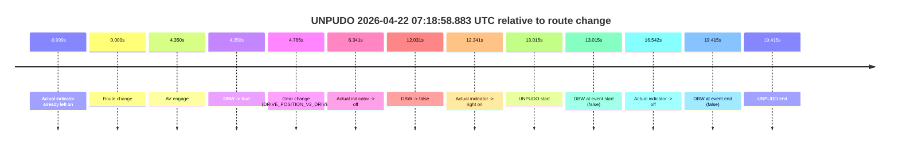

| Metric | Value |
|---|---|
| Outcome | `fail` |
| Effective failure type | `failed_to_unpudo` |
| Route change status | `found` |
| DBW at event start | `false` |
| DBW at event end | `false` |
| Predicted gear at AV start | `DRIVE_POSITION_V2_DRIVE` |
| Actual gear at AV start | `DRIVE_POSITION_V2_PARK` |
| Predicted gear at event start | `DRIVE_POSITION_V2_DRIVE` |
| Actual gear at event start | `DRIVE_POSITION_V2_DRIVE` |
| Planned indicator direction | `INDICATORS_STATE_V2_RIGHT_ON` |
| Controller indicator direction | `INDICATORS_STATE_V2_RIGHT_ON` |
| Actual indicator direction | `INDICATORS_STATE_V2_RIGHT_ON` |
| Actual indicator at maneuver end | `INDICATORS_STATE_V2_OFF` |
| Driver accel help in AV | `false` |
| Driver accel help timestamp | `n/a` |
| Max accel pedal pct in AV | `0.0%` |
| Max brake pedal pct in AV | `8.0%` |
| Max speed mps in AV | `0.000` |
| Success timing baseline | `route change` |
| Route -> AV | `4.350s` |
| AV -> event start | `8.665s` |
| AV -> first motion | `n/a` |
| Success baseline -> event start | `13.015s` |
| Success baseline -> first motion | `n/a` |
| AV duration before disengagement | `7.681s` |
| Trajectory waypoint count | `37` |
| Driving-plan step count | `11` |

The scored portion starts from the AV-owned window, not from the pre-AV setup. Route-change search in the stopped pre-event segment was `found`, with the baseline therefore set to route change. At the event anchor the model predicts `DRIVE_POSITION_V2_DRIVE` and the actual gear is `DRIVE_POSITION_V2_DRIVE`. The effective model outcome is `fail` because `failed_to_unpudo.`

### Resolution

| Field | Value |
|---|---|
| Final outcome | `fail` |
| Do we agree with this label? | `yes` |
| Source disengagement type | `failed_to_unpudo` |
| Resolved effective failure type | `failed_to_unpudo` |
| Confidence | `high` |

## unpudo 2026-04-22 07:24:49.733 UTC

| Field | Value |
|---|---|
| Model | `pink-manta-ray-smooth` |
| Author | `guy.geva` |
| Run ID | `fme20030/2026-04-22--06-09-20--gen2-av-c27c49e5-a980-4763-9814-f0b74abf9699` |
| Date | `2026-04-22` |
| Time (UTC) | `07:24:49.733` |
| Event type | `unpudo` |
| Disengagement type | `failed_to_unpudo` |
| Route change | `unclear` |
| Console | [run](https://console.sso.wayve.ai/run/fme20030/2026-04-22--06-09-20--gen2-av-c27c49e5-a980-4763-9814-f0b74abf9699?id=&time-unixus=1776842689733311) |
| Foxglove | [segment](https://app.foxglove.dev/wayve-on-prem/p/prj_0dX18KZdVHg1fmmI/view?ds=foxglove-stream&ds.deviceName=fme20030&ds.start=2026-04-22T07%3A24%3A34.578261Z&ds.end=2026-04-22T07%3A25%3A15.533317Z&layoutId=lay_0e7VD4WIKDQGU73Y&time=2026-04-22T07%3A24%3A49.733311Z) |

### Event card: fail

- Fail: AV owns part of the segment, but the event still resolves as a model-performance failure under the AV-only scoring rule.

| Event | Time (UTC) | Delta from AV start |
|---|---:|---:|
| First motion | 2026-04-22 07:22:49.749 | `-114.829s` |
| Route change unclear | 2026-04-22 07:24:44.578 | `0.000s` |
| AV engage | 2026-04-22 07:24:44.578 | `0.000s` |
| DBW -> true | 2026-04-22 07:24:44.578 | `0.000s` |
| Gear change (DRIVE_POSITION_V2_DRIVE) | 2026-04-22 07:24:45.033 | `0.455s` |
| Actual indicator -> right on | 2026-04-22 07:24:48.729 | `4.152s` |
| DBW -> false | 2026-04-22 07:24:48.879 | `4.301s` |
| UNPUDO start | 2026-04-22 07:24:49.733 | `5.155s` |
| DBW at event start (false) | 2026-04-22 07:24:49.733 | `5.155s` |
| Actual indicator -> off | 2026-04-22 07:24:53.789 | `9.211s` |
| DBW at event end (false) | 2026-04-22 07:25:05.533 | `20.955s` |
| UNPUDO end | 2026-04-22 07:25:05.533 | `20.955s` |
| Actual indicator -> right on | 2026-04-22 07:25:08.949 | `24.371s` |
| Actual indicator -> off | 2026-04-22 07:25:23.409 | `38.831s` |

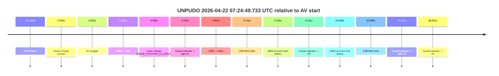

| Metric | Value |
|---|---|
| Outcome | `fail` |
| Effective failure type | `failed_to_unpudo` |
| Route change status | `unclear` |
| DBW at event start | `false` |
| DBW at event end | `false` |
| Predicted gear at AV start | `DRIVE_POSITION_V2_DRIVE` |
| Actual gear at AV start | `DRIVE_POSITION_V2_PARK` |
| Predicted gear at event start | `DRIVE_POSITION_V2_DRIVE` |
| Actual gear at event start | `DRIVE_POSITION_V2_DRIVE` |
| Planned indicator direction | `INDICATORS_STATE_V2_OFF` |
| Controller indicator direction | `INDICATORS_STATE_V2_OFF` |
| Actual indicator direction | `INDICATORS_STATE_V2_RIGHT_ON` |
| Actual indicator at maneuver end | `INDICATORS_STATE_V2_OFF` |
| Driver accel help in AV | `false` |
| Driver accel help timestamp | `n/a` |
| Max accel pedal pct in AV | `0.0%` |
| Max brake pedal pct in AV | `8.0%` |
| Max speed mps in AV | `0.000` |
| Success timing baseline | `AV start` |
| Route -> AV | `n/a` |
| AV -> event start | `5.155s` |
| AV -> first motion | `-114.829s` |
| Success baseline -> event start | `5.155s` |
| Success baseline -> first motion | `-114.829s` |
| AV duration before disengagement | `4.301s` |
| Trajectory waypoint count | `38` |
| Driving-plan step count | `11` |

The scored portion starts from the AV-owned window, not from the pre-AV setup. Route-change search in the stopped pre-event segment was `unclear`, with the baseline therefore set to AV start. At the event anchor the model predicts `DRIVE_POSITION_V2_DRIVE` and the actual gear is `DRIVE_POSITION_V2_DRIVE`. The effective model outcome is `fail` because `failed_to_unpudo.`

### Resolution

| Field | Value |
|---|---|
| Final outcome | `fail` |
| Do we agree with this label? | `yes` |
| Source disengagement type | `failed_to_unpudo` |
| Resolved effective failure type | `failed_to_unpudo` |
| Confidence | `medium` |

## unpudo 2026-04-22 07:43:21.983 UTC

| Field | Value |
|---|---|
| Model | `pink-manta-ray-smooth` |
| Author | `guy.geva` |
| Run ID | `fme20030/2026-04-22--06-09-20--gen2-av-c27c49e5-a980-4763-9814-f0b74abf9699` |
| Date | `2026-04-22` |
| Time (UTC) | `07:43:21.983` |
| Event type | `unpudo` |
| Disengagement type | `failed_to_unpudo` |
| Route change | `found` |
| Console | [run](https://console.sso.wayve.ai/run/fme20030/2026-04-22--06-09-20--gen2-av-c27c49e5-a980-4763-9814-f0b74abf9699?id=&time-unixus=1776843801983310) |
| Foxglove | [segment](https://app.foxglove.dev/wayve-on-prem/p/prj_0dX18KZdVHg1fmmI/view?ds=foxglove-stream&ds.deviceName=fme20030&ds.start=2026-04-22T07%3A42%3A59.918257Z&ds.end=2026-04-22T07%3A44%3A00.233294Z&layoutId=lay_0e7VD4WIKDQGU73Y&time=2026-04-22T07%3A43%3A21.983310Z) |

### Event card: fail

- Fail: AV owns part of the segment, but the event still resolves as a model-performance failure under the AV-only scoring rule.

| Event | Time (UTC) | Delta from route change |
|---|---:|---:|
| Actual indicator already left on | 2026-04-22 07:42:59.929 | `-9.989s` |
| Actual indicator -> off | 2026-04-22 07:43:06.589 | `-3.329s` |
| Route change | 2026-04-22 07:43:09.918 | `0.000s` |
| AV engage | 2026-04-22 07:43:12.158 | `2.240s` |
| DBW -> true | 2026-04-22 07:43:12.158 | `2.240s` |
| Gear change (DRIVE_POSITION_V2_DRIVE) | 2026-04-22 07:43:12.633 | `2.715s` |
| Actual indicator -> right on | 2026-04-22 07:43:19.229 | `9.311s` |
| Actual indicator -> off | 2026-04-22 07:43:20.729 | `10.812s` |
| DBW -> false | 2026-04-22 07:43:21.359 | `11.441s` |
| UNPUDO start | 2026-04-22 07:43:21.983 | `12.065s` |
| DBW at event start (false) | 2026-04-22 07:43:21.983 | `12.065s` |
| Actual indicator -> right on | 2026-04-22 07:43:24.589 | `14.671s` |
| Actual indicator -> off | 2026-04-22 07:43:25.829 | `15.911s` |
| Actual indicator -> right on | 2026-04-22 07:43:26.489 | `16.571s` |
| Actual indicator -> off | 2026-04-22 07:43:49.729 | `39.812s` |
| DBW at event end (false) | 2026-04-22 07:43:50.233 | `40.315s` |
| UNPUDO end | 2026-04-22 07:43:50.233 | `40.315s` |
| Actual indicator -> right on | 2026-04-22 07:43:53.189 | `43.272s` |
| Actual indicator -> off | 2026-04-22 07:44:03.429 | `53.511s` |

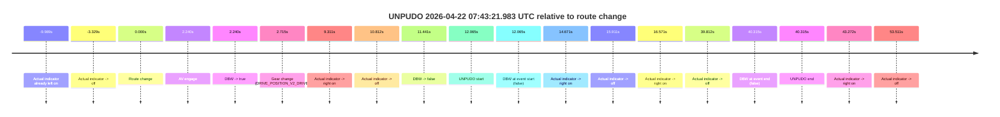

| Metric | Value |
|---|---|
| Outcome | `fail` |
| Effective failure type | `failed_to_unpudo` |
| Route change status | `found` |
| DBW at event start | `false` |
| DBW at event end | `false` |
| Predicted gear at AV start | `DRIVE_POSITION_V2_DRIVE` |
| Actual gear at AV start | `DRIVE_POSITION_V2_PARK` |
| Predicted gear at event start | `DRIVE_POSITION_V2_DRIVE` |
| Actual gear at event start | `DRIVE_POSITION_V2_DRIVE` |
| Planned indicator direction | `INDICATORS_STATE_V2_RIGHT_ON` |
| Controller indicator direction | `INDICATORS_STATE_V2_RIGHT_ON` |
| Actual indicator direction | `INDICATORS_STATE_V2_OFF` |
| Actual indicator at maneuver end | `INDICATORS_STATE_V2_OFF` |
| Driver accel help in AV | `false` |
| Driver accel help timestamp | `n/a` |
| Max accel pedal pct in AV | `0.0%` |
| Max brake pedal pct in AV | `11.1%` |
| Max speed mps in AV | `0.000` |
| Success timing baseline | `route change` |
| Route -> AV | `2.240s` |
| AV -> event start | `9.825s` |
| AV -> first motion | `n/a` |
| Success baseline -> event start | `12.065s` |
| Success baseline -> first motion | `n/a` |
| AV duration before disengagement | `9.201s` |
| Trajectory waypoint count | `37` |
| Driving-plan step count | `11` |

The scored portion starts from the AV-owned window, not from the pre-AV setup. Route-change search in the stopped pre-event segment was `found`, with the baseline therefore set to route change. At the event anchor the model predicts `DRIVE_POSITION_V2_DRIVE` and the actual gear is `DRIVE_POSITION_V2_DRIVE`. The effective model outcome is `fail` because `failed_to_unpudo.`

### Resolution

| Field | Value |
|---|---|
| Final outcome | `fail` |
| Do we agree with this label? | `yes` |
| Source disengagement type | `failed_to_unpudo` |
| Resolved effective failure type | `failed_to_unpudo` |
| Confidence | `high` |

## unpudo 2026-04-22 07:48:20.233 UTC

| Field | Value |
|---|---|
| Model | `pink-manta-ray-smooth` |
| Author | `guy.geva` |
| Run ID | `fme20030/2026-04-22--06-09-20--gen2-av-c27c49e5-a980-4763-9814-f0b74abf9699` |
| Date | `2026-04-22` |
| Time (UTC) | `07:48:20.233` |
| Event type | `unpudo` |
| Disengagement type | `failed_to_unpudo` |
| Route change | `found` |
| Console | [run](https://console.sso.wayve.ai/run/fme20030/2026-04-22--06-09-20--gen2-av-c27c49e5-a980-4763-9814-f0b74abf9699?id=&time-unixus=1776844100233298) |
| Foxglove | [segment](https://app.foxglove.dev/wayve-on-prem/p/prj_0dX18KZdVHg1fmmI/view?ds=foxglove-stream&ds.deviceName=fme20030&ds.start=2026-04-22T07%3A48%3A01.268237Z&ds.end=2026-04-22T07%3A48%3A34.833304Z&layoutId=lay_0e7VD4WIKDQGU73Y&time=2026-04-22T07%3A48%3A20.233298Z) |

### Event card: fail

- Fail: AV owns part of the segment, but the event still resolves as a model-performance failure under the AV-only scoring rule.

| Event | Time (UTC) | Delta from route change |
|---|---:|---:|
| Actual indicator already left on | 2026-04-22 07:48:01.269 | `-9.999s` |
| Route change | 2026-04-22 07:48:11.268 | `0.000s` |
| AV engage | 2026-04-22 07:48:14.998 | `3.730s` |
| DBW -> true | 2026-04-22 07:48:14.998 | `3.730s` |
| Gear change (DRIVE_POSITION_V2_DRIVE) | 2026-04-22 07:48:15.333 | `4.065s` |
| Actual indicator -> off | 2026-04-22 07:48:17.229 | `5.962s` |
| Actual indicator -> right on | 2026-04-22 07:48:17.329 | `6.061s` |
| DBW -> false | 2026-04-22 07:48:19.238 | `7.971s` |
| UNPUDO start | 2026-04-22 07:48:20.233 | `8.965s` |
| DBW at event start (false) | 2026-04-22 07:48:20.233 | `8.965s` |
| Actual indicator -> off | 2026-04-22 07:48:22.089 | `10.821s` |
| DBW at event end (false) | 2026-04-22 07:48:24.833 | `13.565s` |
| UNPUDO end | 2026-04-22 07:48:24.833 | `13.565s` |

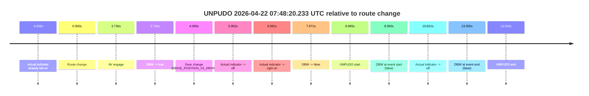

| Metric | Value |
|---|---|
| Outcome | `fail` |
| Effective failure type | `failed_to_unpudo` |
| Route change status | `found` |
| DBW at event start | `false` |
| DBW at event end | `false` |
| Predicted gear at AV start | `DRIVE_POSITION_V2_DRIVE` |
| Actual gear at AV start | `DRIVE_POSITION_V2_PARK` |
| Predicted gear at event start | `DRIVE_POSITION_V2_DRIVE` |
| Actual gear at event start | `DRIVE_POSITION_V2_DRIVE` |
| Planned indicator direction | `INDICATORS_STATE_V2_RIGHT_ON` |
| Controller indicator direction | `INDICATORS_STATE_V2_RIGHT_ON` |
| Actual indicator direction | `INDICATORS_STATE_V2_RIGHT_ON` |
| Actual indicator at maneuver end | `INDICATORS_STATE_V2_OFF` |
| Driver accel help in AV | `false` |
| Driver accel help timestamp | `n/a` |
| Max accel pedal pct in AV | `0.0%` |
| Max brake pedal pct in AV | `8.0%` |
| Max speed mps in AV | `0.000` |
| Success timing baseline | `route change` |
| Route -> AV | `3.730s` |
| AV -> event start | `5.235s` |
| AV -> first motion | `n/a` |
| Success baseline -> event start | `8.965s` |
| Success baseline -> first motion | `n/a` |
| AV duration before disengagement | `4.241s` |
| Trajectory waypoint count | `36` |
| Driving-plan step count | `11` |

The scored portion starts from the AV-owned window, not from the pre-AV setup. Route-change search in the stopped pre-event segment was `found`, with the baseline therefore set to route change. At the event anchor the model predicts `DRIVE_POSITION_V2_DRIVE` and the actual gear is `DRIVE_POSITION_V2_DRIVE`. The effective model outcome is `fail` because `failed_to_unpudo.`

### Resolution

| Field | Value |
|---|---|
| Final outcome | `fail` |
| Do we agree with this label? | `yes` |
| Source disengagement type | `failed_to_unpudo` |
| Resolved effective failure type | `failed_to_unpudo` |
| Confidence | `high` |
