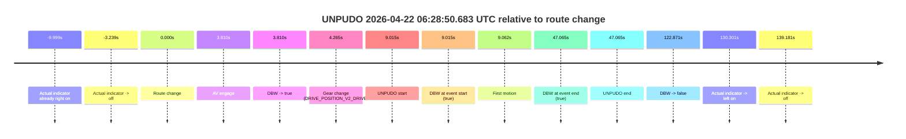
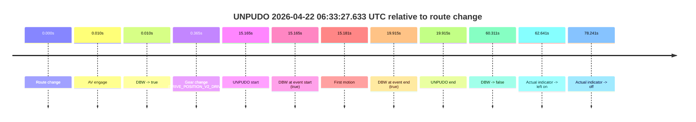
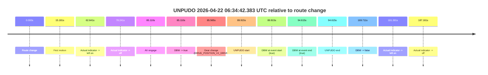
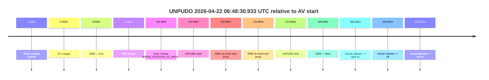
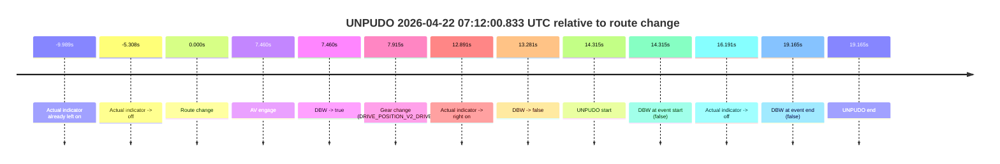
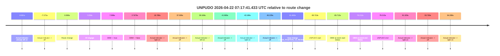
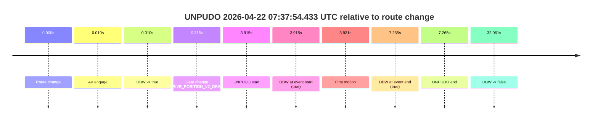
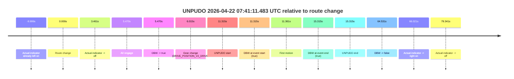
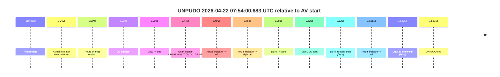
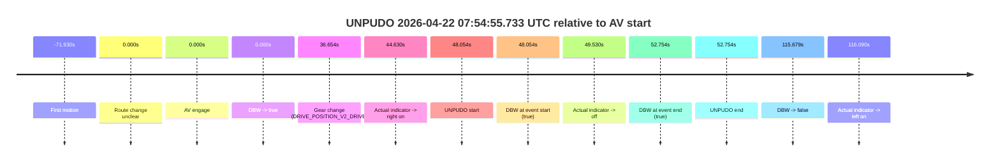

# Run Report: fme20030/2026-04-22--06-09-20--gen2-av-c27c49e5-a980-4763-9814-f0b74abf9699

| Field | Value |
|---|---|
| Run ID | `fme20030/2026-04-22--06-09-20--gen2-av-c27c49e5-a980-4763-9814-f0b74abf9699` |
| Date | `2026-04-22` |
| Model(s) | `eel-teal-outspoken` |
| Author | `zak` |
| Event count | `11` |

## unpudo 2026-04-22 06:28:50.683 UTC

| Field | Value |
|---|---|
| Model | `eel-teal-outspoken` |
| Author | `zak` |
| Run ID | `fme20030/2026-04-22--06-09-20--gen2-av-c27c49e5-a980-4763-9814-f0b74abf9699` |
| Date | `2026-04-22` |
| Time (UTC) | `06:28:50.683` |
| Event type | `unpudo` |
| Disengagement type | `none observed` |
| Route change | `found` |
| Console | [run](https://console.sso.wayve.ai/run/fme20030/2026-04-22--06-09-20--gen2-av-c27c49e5-a980-4763-9814-f0b74abf9699?id=&time-unixus=1776839330683297) |
| Foxglove | [segment](https://app.foxglove.dev/wayve-on-prem/p/prj_0dX18KZdVHg1fmmI/view?ds=foxglove-stream&ds.deviceName=fme20030&ds.start=2026-04-22T06%3A28%3A31.668332Z&ds.end=2026-04-22T06%3A30%3A54.538887Z&layoutId=lay_0e7VD4WIKDQGU73Y&time=2026-04-22T06%3A28%3A50.683297Z) |

### Event card: pass

- Pass: AV owns the credited unpudo from route change through the official unpudo window, the gear state is aligned at the anchor, and the vehicle moves without driver accelerator help in AV.

| Event | Time (UTC) | Delta from route change |
|---|---:|---:|
| Actual indicator already right on | 2026-04-22 06:28:31.669 | `-9.999s` |
| Actual indicator -> off | 2026-04-22 06:28:38.429 | `-3.239s` |
| Route change | 2026-04-22 06:28:41.668 | `0.000s` |
| AV engage | 2026-04-22 06:28:45.478 | `3.810s` |
| DBW -> true | 2026-04-22 06:28:45.478 | `3.810s` |
| Gear change (DRIVE_POSITION_V2_DRIVE) | 2026-04-22 06:28:45.933 | `4.265s` |
| UNPUDO start | 2026-04-22 06:28:50.683 | `9.015s` |
| DBW at event start (true) | 2026-04-22 06:28:50.683 | `9.015s` |
| First motion | 2026-04-22 06:28:50.729 | `9.062s` |
| DBW at event end (true) | 2026-04-22 06:29:28.733 | `47.065s` |
| UNPUDO end | 2026-04-22 06:29:28.733 | `47.065s` |
| DBW -> false | 2026-04-22 06:30:44.538 | `122.871s` |
| Actual indicator -> left on | 2026-04-22 06:30:51.969 | `130.301s` |
| Actual indicator -> off | 2026-04-22 06:31:00.849 | `139.181s` |

| Metric | Value |
|---|---|
| Outcome | `pass` |
| Effective failure type | `none` |
| Route change status | `found` |
| DBW at event start | `true` |
| DBW at event end | `true` |
| Predicted gear at AV start | `DRIVE_POSITION_V2_DRIVE` |
| Actual gear at AV start | `DRIVE_POSITION_V2_PARK` |
| Predicted gear at event start | `DRIVE_POSITION_V2_DRIVE` |
| Actual gear at event start | `DRIVE_POSITION_V2_DRIVE` |
| Planned indicator direction | `INDICATORS_STATE_V2_LEFT_ON` |
| Controller indicator direction | `INDICATORS_STATE_V2_LEFT_ON` |
| Actual indicator direction | `INDICATORS_STATE_V2_OFF` |
| Actual indicator at maneuver end | `INDICATORS_STATE_V2_OFF` |
| Driver accel help in AV | `false` |
| Driver accel help timestamp | `n/a` |
| Max accel pedal pct in AV | `0.0%` |
| Max brake pedal pct in AV | `8.9%` |
| Max speed mps in AV | `2.306` |
| Success timing baseline | `route change` |
| Route -> AV | `3.810s` |
| AV -> event start | `5.205s` |
| AV -> first motion | `5.252s` |
| Success baseline -> event start | `9.015s` |
| Success baseline -> first motion | `9.062s` |
| AV duration before disengagement | `119.061s` |
| Trajectory waypoint count | `37` |
| Driving-plan step count | `11` |

The scored portion starts from the AV-owned window, not from the pre-AV setup. Route-change search in the stopped pre-event segment was `found`, with the baseline therefore set to route change. At the event anchor the model predicts `DRIVE_POSITION_V2_DRIVE` and the actual gear is `DRIVE_POSITION_V2_DRIVE`. The effective model outcome is `pass` because `the credited unpudo stays AV-owned through the official unpudo window.`

### Resolution

| Field | Value |
|---|---|
| Final outcome | `pass` |
| Do we agree with this label? | `yes` |
| Source disengagement type | `none observed` |
| Resolved effective failure type | `none` |
| Confidence | `high` |

## unpudo 2026-04-22 06:33:27.633 UTC

| Field | Value |
|---|---|
| Model | `eel-teal-outspoken` |
| Author | `zak` |
| Run ID | `fme20030/2026-04-22--06-09-20--gen2-av-c27c49e5-a980-4763-9814-f0b74abf9699` |
| Date | `2026-04-22` |
| Time (UTC) | `06:33:27.633` |
| Event type | `unpudo` |
| Disengagement type | `none observed` |
| Route change | `found` |
| Console | [run](https://console.sso.wayve.ai/run/fme20030/2026-04-22--06-09-20--gen2-av-c27c49e5-a980-4763-9814-f0b74abf9699?id=&time-unixus=1776839607633296) |
| Foxglove | [segment](https://app.foxglove.dev/wayve-on-prem/p/prj_0dX18KZdVHg1fmmI/view?ds=foxglove-stream&ds.deviceName=fme20030&ds.start=2026-04-22T06%3A33%3A02.468253Z&ds.end=2026-04-22T06%3A34%3A22.778762Z&layoutId=lay_0e7VD4WIKDQGU73Y&time=2026-04-22T06%3A33%3A27.633296Z) |

### Event card: pass

- Pass: AV owns the credited unpudo from route change through the official unpudo window, the gear state is aligned at the anchor, and the vehicle moves without driver accelerator help in AV.

| Event | Time (UTC) | Delta from route change |
|---|---:|---:|
| Route change | 2026-04-22 06:33:12.468 | `0.000s` |
| AV engage | 2026-04-22 06:33:12.478 | `0.010s` |
| DBW -> true | 2026-04-22 06:33:12.478 | `0.010s` |
| Gear change (DRIVE_POSITION_V2_DRIVE) | 2026-04-22 06:33:12.833 | `0.365s` |
| UNPUDO start | 2026-04-22 06:33:27.633 | `15.165s` |
| DBW at event start (true) | 2026-04-22 06:33:27.633 | `15.165s` |
| First motion | 2026-04-22 06:33:27.649 | `15.181s` |
| DBW at event end (true) | 2026-04-22 06:33:32.383 | `19.915s` |
| UNPUDO end | 2026-04-22 06:33:32.383 | `19.915s` |
| DBW -> false | 2026-04-22 06:34:12.778 | `60.311s` |
| Actual indicator -> left on | 2026-04-22 06:34:15.109 | `62.641s` |
| Actual indicator -> off | 2026-04-22 06:34:30.709 | `78.241s` |

| Metric | Value |
|---|---|
| Outcome | `pass` |
| Effective failure type | `none` |
| Route change status | `found` |
| DBW at event start | `true` |
| DBW at event end | `true` |
| Predicted gear at AV start | `DRIVE_POSITION_V2_PARK` |
| Actual gear at AV start | `DRIVE_POSITION_V2_PARK` |
| Predicted gear at event start | `DRIVE_POSITION_V2_DRIVE` |
| Actual gear at event start | `DRIVE_POSITION_V2_DRIVE` |
| Planned indicator direction | `INDICATORS_STATE_V2_RIGHT_ON` |
| Controller indicator direction | `INDICATORS_STATE_V2_RIGHT_ON` |
| Actual indicator direction | `INDICATORS_STATE_V2_OFF` |
| Actual indicator at maneuver end | `INDICATORS_STATE_V2_OFF` |
| Driver accel help in AV | `false` |
| Driver accel help timestamp | `n/a` |
| Max accel pedal pct in AV | `0.0%` |
| Max brake pedal pct in AV | `9.7%` |
| Max speed mps in AV | `4.450` |
| Success timing baseline | `route change` |
| Route -> AV | `0.010s` |
| AV -> event start | `15.155s` |
| AV -> first motion | `15.171s` |
| Success baseline -> event start | `15.165s` |
| Success baseline -> first motion | `15.181s` |
| AV duration before disengagement | `60.301s` |
| Trajectory waypoint count | `38` |
| Driving-plan step count | `11` |

The scored portion starts from the AV-owned window, not from the pre-AV setup. Route-change search in the stopped pre-event segment was `found`, with the baseline therefore set to route change. At the event anchor the model predicts `DRIVE_POSITION_V2_DRIVE` and the actual gear is `DRIVE_POSITION_V2_DRIVE`. The effective model outcome is `pass` because `the credited unpudo stays AV-owned through the official unpudo window.`

### Resolution

| Field | Value |
|---|---|
| Final outcome | `pass` |
| Do we agree with this label? | `yes` |
| Source disengagement type | `none observed` |
| Resolved effective failure type | `none` |
| Confidence | `high` |

## unpudo 2026-04-22 06:34:42.383 UTC

| Field | Value |
|---|---|
| Model | `eel-teal-outspoken` |
| Author | `zak` |
| Run ID | `fme20030/2026-04-22--06-09-20--gen2-av-c27c49e5-a980-4763-9814-f0b74abf9699` |
| Date | `2026-04-22` |
| Time (UTC) | `06:34:42.383` |
| Event type | `unpudo` |
| Disengagement type | `none observed` |
| Route change | `found` |
| Console | [run](https://console.sso.wayve.ai/run/fme20030/2026-04-22--06-09-20--gen2-av-c27c49e5-a980-4763-9814-f0b74abf9699?id=&time-unixus=1776839682383312) |
| Foxglove | [segment](https://app.foxglove.dev/wayve-on-prem/p/prj_0dX18KZdVHg1fmmI/view?ds=foxglove-stream&ds.deviceName=fme20030&ds.start=2026-04-22T06%3A33%3A02.468253Z&ds.end=2026-04-22T06%3A36%3A12.178786Z&layoutId=lay_0e7VD4WIKDQGU73Y&time=2026-04-22T06%3A34%3A42.383312Z) |

### Event card: pass

- Pass: AV owns the credited unpudo from route change through the official unpudo window, the gear state is aligned at the anchor, and the vehicle moves without driver accelerator help in AV.

| Event | Time (UTC) | Delta from route change |
|---|---:|---:|
| Route change | 2026-04-22 06:33:12.468 | `0.000s` |
| First motion | 2026-04-22 06:33:27.649 | `15.181s` |
| Actual indicator -> left on | 2026-04-22 06:34:15.109 | `62.641s` |
| Actual indicator -> off | 2026-04-22 06:34:30.709 | `78.241s` |
| AV engage | 2026-04-22 06:34:37.578 | `85.110s` |
| DBW -> true | 2026-04-22 06:34:37.578 | `85.110s` |
| Gear change (DRIVE_POSITION_V2_DRIVE) | 2026-04-22 06:34:38.033 | `85.565s` |
| UNPUDO start | 2026-04-22 06:34:42.383 | `89.915s` |
| DBW at event start (true) | 2026-04-22 06:34:42.383 | `89.915s` |
| DBW at event end (true) | 2026-04-22 06:34:47.083 | `94.615s` |
| UNPUDO end | 2026-04-22 06:34:47.083 | `94.615s` |
| DBW -> false | 2026-04-22 06:36:02.178 | `169.711s` |
| Actual indicator -> left on | 2026-04-22 06:36:13.849 | `181.381s` |
| Actual indicator -> off | 2026-04-22 06:36:19.629 | `187.161s` |

| Metric | Value |
|---|---|
| Outcome | `pass` |
| Effective failure type | `none` |
| Route change status | `found` |
| DBW at event start | `true` |
| DBW at event end | `true` |
| Predicted gear at AV start | `DRIVE_POSITION_V2_DRIVE` |
| Actual gear at AV start | `DRIVE_POSITION_V2_PARK` |
| Predicted gear at event start | `DRIVE_POSITION_V2_DRIVE` |
| Actual gear at event start | `DRIVE_POSITION_V2_DRIVE` |
| Planned indicator direction | `INDICATORS_STATE_V2_RIGHT_ON` |
| Controller indicator direction | `INDICATORS_STATE_V2_RIGHT_ON` |
| Actual indicator direction | `INDICATORS_STATE_V2_OFF` |
| Actual indicator at maneuver end | `INDICATORS_STATE_V2_OFF` |
| Driver accel help in AV | `false` |
| Driver accel help timestamp | `n/a` |
| Max accel pedal pct in AV | `0.0%` |
| Max brake pedal pct in AV | `11.1%` |
| Max speed mps in AV | `4.714` |
| Success timing baseline | `route change` |
| Route -> AV | `85.110s` |
| AV -> event start | `4.805s` |
| AV -> first motion | `-69.929s` |
| Success baseline -> event start | `89.915s` |
| Success baseline -> first motion | `15.181s` |
| AV duration before disengagement | `84.601s` |
| Trajectory waypoint count | `37` |
| Driving-plan step count | `11` |

The scored portion starts from the AV-owned window, not from the pre-AV setup. Route-change search in the stopped pre-event segment was `found`, with the baseline therefore set to route change. At the event anchor the model predicts `DRIVE_POSITION_V2_DRIVE` and the actual gear is `DRIVE_POSITION_V2_DRIVE`. The effective model outcome is `pass` because `the credited unpudo stays AV-owned through the official unpudo window.`

### Resolution

| Field | Value |
|---|---|
| Final outcome | `pass` |
| Do we agree with this label? | `yes` |
| Source disengagement type | `none observed` |
| Resolved effective failure type | `none` |
| Confidence | `high` |

## unpudo 2026-04-22 06:48:30.933 UTC

| Field | Value |
|---|---|
| Model | `eel-teal-outspoken` |
| Author | `zak` |
| Run ID | `fme20030/2026-04-22--06-09-20--gen2-av-c27c49e5-a980-4763-9814-f0b74abf9699` |
| Date | `2026-04-22` |
| Time (UTC) | `06:48:30.933` |
| Event type | `unpudo` |
| Disengagement type | `none observed` |
| Route change | `unclear` |
| Console | [run](https://console.sso.wayve.ai/run/fme20030/2026-04-22--06-09-20--gen2-av-c27c49e5-a980-4763-9814-f0b74abf9699?id=&time-unixus=1776840510933306) |
| Foxglove | [segment](https://app.foxglove.dev/wayve-on-prem/p/prj_0dX18KZdVHg1fmmI/view?ds=foxglove-stream&ds.deviceName=fme20030&ds.start=2026-04-22T06%3A46%3A20.938845Z&ds.end=2026-04-22T06%3A50%3A00.598783Z&layoutId=lay_0e7VD4WIKDQGU73Y&time=2026-04-22T06%3A48%3A30.933306Z) |

### Event card: pass

- Pass: AV owns the credited unpudo from route change through the official unpudo window, the gear state is aligned at the anchor, and the vehicle moves without driver accelerator help in AV.

| Event | Time (UTC) | Delta from AV start |
|---|---:|---:|
| Route change unclear | 2026-04-22 06:46:30.938 | `0.000s` |
| AV engage | 2026-04-22 06:46:30.938 | `0.000s` |
| DBW -> true | 2026-04-22 06:46:30.938 | `0.000s` |
| First motion | 2026-04-22 06:46:30.949 | `0.011s` |
| Gear change (DRIVE_POSITION_V2_DRIVE) | 2026-04-22 06:48:27.333 | `116.394s` |
| UNPUDO start | 2026-04-22 06:48:30.933 | `119.994s` |
| DBW at event start (true) | 2026-04-22 06:48:30.933 | `119.994s` |
| DBW at event end (true) | 2026-04-22 06:48:34.833 | `123.894s` |
| UNPUDO end | 2026-04-22 06:48:34.833 | `123.894s` |
| DBW -> false | 2026-04-22 06:49:50.598 | `199.660s` |
| Actual indicator -> right on | 2026-04-22 06:49:53.189 | `202.251s` |
| Actual indicator -> off | 2026-04-22 06:49:56.969 | `206.031s` |
| Actual indicator -> left on | 2026-04-22 06:49:57.169 | `206.231s` |

| Metric | Value |
|---|---|
| Outcome | `pass` |
| Effective failure type | `none` |
| Route change status | `unclear` |
| DBW at event start | `true` |
| DBW at event end | `true` |
| Predicted gear at AV start | `DRIVE_POSITION_V2_DRIVE` |
| Actual gear at AV start | `DRIVE_POSITION_V2_DRIVE` |
| Predicted gear at event start | `DRIVE_POSITION_V2_DRIVE` |
| Actual gear at event start | `DRIVE_POSITION_V2_DRIVE` |
| Planned indicator direction | `INDICATORS_STATE_V2_RIGHT_ON` |
| Controller indicator direction | `INDICATORS_STATE_V2_RIGHT_ON` |
| Actual indicator direction | `INDICATORS_STATE_V2_OFF` |
| Actual indicator at maneuver end | `INDICATORS_STATE_V2_OFF` |
| Driver accel help in AV | `false` |
| Driver accel help timestamp | `n/a` |
| Max accel pedal pct in AV | `0.0%` |
| Max brake pedal pct in AV | `12.8%` |
| Max speed mps in AV | `7.803` |
| Success timing baseline | `AV start` |
| Route -> AV | `n/a` |
| AV -> event start | `119.994s` |
| AV -> first motion | `0.011s` |
| Success baseline -> event start | `119.994s` |
| Success baseline -> first motion | `0.011s` |
| AV duration before disengagement | `199.660s` |
| Trajectory waypoint count | `38` |
| Driving-plan step count | `11` |

The scored portion starts from the AV-owned window, not from the pre-AV setup. Route-change search in the stopped pre-event segment was `unclear`, with the baseline therefore set to AV start. At the event anchor the model predicts `DRIVE_POSITION_V2_DRIVE` and the actual gear is `DRIVE_POSITION_V2_DRIVE`. The effective model outcome is `pass` because `the credited unpudo stays AV-owned through the official unpudo window.`

### Resolution

| Field | Value |
|---|---|
| Final outcome | `pass` |
| Do we agree with this label? | `yes` |
| Source disengagement type | `none observed` |
| Resolved effective failure type | `none` |
| Confidence | `medium` |

## unpudo 2026-04-22 07:12:00.833 UTC

| Field | Value |
|---|---|
| Model | `eel-teal-outspoken` |
| Author | `zak` |
| Run ID | `fme20030/2026-04-22--06-09-20--gen2-av-c27c49e5-a980-4763-9814-f0b74abf9699` |
| Date | `2026-04-22` |
| Time (UTC) | `07:12:00.833` |
| Event type | `unpudo` |
| Disengagement type | `failed_to_unpudo` |
| Route change | `found` |
| Console | [run](https://console.sso.wayve.ai/run/fme20030/2026-04-22--06-09-20--gen2-av-c27c49e5-a980-4763-9814-f0b74abf9699?id=&time-unixus=1776841920833302) |
| Foxglove | [segment](https://app.foxglove.dev/wayve-on-prem/p/prj_0dX18KZdVHg1fmmI/view?ds=foxglove-stream&ds.deviceName=fme20030&ds.start=2026-04-22T07%3A11%3A36.518241Z&ds.end=2026-04-22T07%3A12%3A15.683312Z&layoutId=lay_0e7VD4WIKDQGU73Y&time=2026-04-22T07%3A12%3A00.833302Z) |

### Event card: fail

- Fail: AV owns part of the segment, but the event still resolves as a model-performance failure under the AV-only scoring rule.

| Event | Time (UTC) | Delta from route change |
|---|---:|---:|
| Actual indicator already left on | 2026-04-22 07:11:36.529 | `-9.989s` |
| Actual indicator -> off | 2026-04-22 07:11:41.209 | `-5.308s` |
| Route change | 2026-04-22 07:11:46.518 | `0.000s` |
| AV engage | 2026-04-22 07:11:53.978 | `7.460s` |
| DBW -> true | 2026-04-22 07:11:53.978 | `7.460s` |
| Gear change (DRIVE_POSITION_V2_DRIVE) | 2026-04-22 07:11:54.433 | `7.915s` |
| Actual indicator -> right on | 2026-04-22 07:11:59.409 | `12.891s` |
| DBW -> false | 2026-04-22 07:11:59.799 | `13.281s` |
| UNPUDO start | 2026-04-22 07:12:00.833 | `14.315s` |
| DBW at event start (false) | 2026-04-22 07:12:00.833 | `14.315s` |
| Actual indicator -> off | 2026-04-22 07:12:02.709 | `16.191s` |
| DBW at event end (false) | 2026-04-22 07:12:05.683 | `19.165s` |
| UNPUDO end | 2026-04-22 07:12:05.683 | `19.165s` |

| Metric | Value |
|---|---|
| Outcome | `fail` |
| Effective failure type | `failed_to_unpudo` |
| Route change status | `found` |
| DBW at event start | `false` |
| DBW at event end | `false` |
| Predicted gear at AV start | `DRIVE_POSITION_V2_DRIVE` |
| Actual gear at AV start | `DRIVE_POSITION_V2_PARK` |
| Predicted gear at event start | `DRIVE_POSITION_V2_DRIVE` |
| Actual gear at event start | `DRIVE_POSITION_V2_DRIVE` |
| Planned indicator direction | `INDICATORS_STATE_V2_RIGHT_ON` |
| Controller indicator direction | `INDICATORS_STATE_V2_RIGHT_ON` |
| Actual indicator direction | `INDICATORS_STATE_V2_RIGHT_ON` |
| Actual indicator at maneuver end | `INDICATORS_STATE_V2_OFF` |
| Driver accel help in AV | `false` |
| Driver accel help timestamp | `n/a` |
| Max accel pedal pct in AV | `0.0%` |
| Max brake pedal pct in AV | `9.3%` |
| Max speed mps in AV | `0.000` |
| Success timing baseline | `route change` |
| Route -> AV | `7.460s` |
| AV -> event start | `6.855s` |
| AV -> first motion | `n/a` |
| Success baseline -> event start | `14.315s` |
| Success baseline -> first motion | `n/a` |
| AV duration before disengagement | `5.821s` |
| Trajectory waypoint count | `38` |
| Driving-plan step count | `11` |

The scored portion starts from the AV-owned window, not from the pre-AV setup. Route-change search in the stopped pre-event segment was `found`, with the baseline therefore set to route change. At the event anchor the model predicts `DRIVE_POSITION_V2_DRIVE` and the actual gear is `DRIVE_POSITION_V2_DRIVE`. The effective model outcome is `fail` because `failed_to_unpudo.`

### Resolution

| Field | Value |
|---|---|
| Final outcome | `fail` |
| Do we agree with this label? | `yes` |
| Source disengagement type | `failed_to_unpudo` |
| Resolved effective failure type | `failed_to_unpudo` |
| Confidence | `high` |

## unpudo 2026-04-22 07:17:41.433 UTC

| Field | Value |
|---|---|
| Model | `eel-teal-outspoken` |
| Author | `zak` |
| Run ID | `fme20030/2026-04-22--06-09-20--gen2-av-c27c49e5-a980-4763-9814-f0b74abf9699` |
| Date | `2026-04-22` |
| Time (UTC) | `07:17:41.433` |
| Event type | `unpudo` |
| Disengagement type | `none observed` |
| Route change | `found` |
| Console | [run](https://console.sso.wayve.ai/run/fme20030/2026-04-22--06-09-20--gen2-av-c27c49e5-a980-4763-9814-f0b74abf9699?id=&time-unixus=1776842261433307) |
| Foxglove | [segment](https://app.foxglove.dev/wayve-on-prem/p/prj_0dX18KZdVHg1fmmI/view?ds=foxglove-stream&ds.deviceName=fme20030&ds.start=2026-04-22T07%3A16%3A25.720691Z&ds.end=2026-04-22T07%3A18%3A04.933309Z&layoutId=lay_0e7VD4WIKDQGU73Y&time=2026-04-22T07%3A17%3A41.433307Z) |

### Event card: fail

- Fail: the credited unpudo does not stay AV-owned. The event window starts with DBW false, and the maneuver outcome lands outside a clean AV-owned segment.

| Event | Time (UTC) | Delta from route change |
|---|---:|---:|
| Actual indicator already left on | 2026-04-22 07:16:25.729 | `-9.991s` |
| Actual indicator -> off | 2026-04-22 07:16:28.549 | `-7.171s` |
| Route change | 2026-04-22 07:16:35.720 | `0.000s` |
| AV engage | 2026-04-22 07:16:42.778 | `7.058s` |
| DBW -> true | 2026-04-22 07:16:42.778 | `7.058s` |
| DBW -> false | 2026-04-22 07:16:53.599 | `17.879s` |
| Actual indicator -> right on | 2026-04-22 07:16:54.509 | `18.789s` |
| Actual indicator -> off | 2026-04-22 07:17:12.729 | `37.009s` |
| Actual indicator -> left on | 2026-04-22 07:17:14.889 | `39.169s` |
| Actual indicator -> off | 2026-04-22 07:17:17.709 | `41.989s` |
| Actual indicator -> right on | 2026-04-22 07:17:18.909 | `43.189s` |
| Actual indicator -> off | 2026-04-22 07:17:20.949 | `45.229s` |
| Gear change (DRIVE_POSITION_V2_REVERSE) | 2026-04-22 07:17:37.183 | `61.463s` |
| UNPUDO start | 2026-04-22 07:17:41.433 | `65.713s` |
| DBW at event start (false) | 2026-04-22 07:17:41.433 | `65.713s` |
| DBW at event end (false) | 2026-04-22 07:17:54.933 | `79.213s` |
| UNPUDO end | 2026-04-22 07:17:54.933 | `79.213s` |
| Actual indicator -> right on | 2026-04-22 07:18:06.749 | `91.029s` |
| Actual indicator -> off | 2026-04-22 07:18:09.489 | `93.769s` |
| Actual indicator -> right on | 2026-04-22 07:18:10.009 | `94.289s` |

| Metric | Value |
|---|---|
| Outcome | `fail` |
| Effective failure type | `not_av_owned` |
| Route change status | `found` |
| DBW at event start | `false` |
| DBW at event end | `false` |
| Predicted gear at AV start | `DRIVE_POSITION_V2_DRIVE` |
| Actual gear at AV start | `DRIVE_POSITION_V2_PARK` |
| Predicted gear at event start | `DRIVE_POSITION_V2_REVERSE` |
| Actual gear at event start | `DRIVE_POSITION_V2_REVERSE` |
| Planned indicator direction | `INDICATORS_STATE_V2_OFF` |
| Controller indicator direction | `INDICATORS_STATE_V2_OFF` |
| Actual indicator direction | `INDICATORS_STATE_V2_OFF` |
| Actual indicator at maneuver end | `INDICATORS_STATE_V2_OFF` |
| Driver accel help in AV | `false` |
| Driver accel help timestamp | `n/a` |
| Max accel pedal pct in AV | `0.0%` |
| Max brake pedal pct in AV | `8.0%` |
| Max speed mps in AV | `0.000` |
| Success timing baseline | `route change` |
| Route -> AV | `7.058s` |
| AV -> event start | `58.655s` |
| AV -> first motion | `n/a` |
| Success baseline -> event start | `65.713s` |
| Success baseline -> first motion | `n/a` |
| AV duration before disengagement | `10.822s` |
| Trajectory waypoint count | `38` |
| Driving-plan step count | `11` |

The scored portion starts from the AV-owned window, not from the pre-AV setup. Route-change search in the stopped pre-event segment was `found`, with the baseline therefore set to route change. At the event anchor the model predicts `DRIVE_POSITION_V2_REVERSE` and the actual gear is `DRIVE_POSITION_V2_REVERSE`. The effective model outcome is `fail` because `not_av_owned.`

### Resolution

| Field | Value |
|---|---|
| Final outcome | `fail` |
| Do we agree with this label? | `yes` |
| Source disengagement type | `none observed` |
| Resolved effective failure type | `not_av_owned` |
| Confidence | `high` |

## unpudo 2026-04-22 07:29:21.483 UTC

| Field | Value |
|---|---|
| Model | `eel-teal-outspoken` |
| Author | `zak` |
| Run ID | `fme20030/2026-04-22--06-09-20--gen2-av-c27c49e5-a980-4763-9814-f0b74abf9699` |
| Date | `2026-04-22` |
| Time (UTC) | `07:29:21.483` |
| Event type | `unpudo` |
| Disengagement type | `none observed` |
| Route change | `found` |
| Console | [run](https://console.sso.wayve.ai/run/fme20030/2026-04-22--06-09-20--gen2-av-c27c49e5-a980-4763-9814-f0b74abf9699?id=&time-unixus=1776842961483314) |
| Foxglove | [segment](https://app.foxglove.dev/wayve-on-prem/p/prj_0dX18KZdVHg1fmmI/view?ds=foxglove-stream&ds.deviceName=fme20030&ds.start=2026-04-22T07%3A28%3A49.518274Z&ds.end=2026-04-22T07%3A30%3A04.218767Z&layoutId=lay_0e7VD4WIKDQGU73Y&time=2026-04-22T07%3A29%3A21.483314Z) |

### Event card: pass

- Pass: AV owns the credited unpudo from route change through the official unpudo window, the gear state is aligned at the anchor, and the vehicle moves without driver accelerator help in AV.

| Event | Time (UTC) | Delta from route change |
|---|---:|---:|
| Actual indicator already left on | 2026-04-22 07:28:49.529 | `-9.988s` |
| Actual indicator -> off | 2026-04-22 07:28:50.469 | `-9.049s` |
| Route change | 2026-04-22 07:28:59.518 | `0.000s` |
| AV engage | 2026-04-22 07:29:08.938 | `9.420s` |
| DBW -> true | 2026-04-22 07:29:08.938 | `9.420s` |
| Gear change (DRIVE_POSITION_V2_DRIVE) | 2026-04-22 07:29:09.433 | `9.915s` |
| UNPUDO start | 2026-04-22 07:29:21.483 | `21.965s` |
| DBW at event start (true) | 2026-04-22 07:29:21.483 | `21.965s` |
| First motion | 2026-04-22 07:29:21.509 | `21.991s` |
| DBW at event end (true) | 2026-04-22 07:29:26.133 | `26.615s` |
| UNPUDO end | 2026-04-22 07:29:26.133 | `26.615s` |
| DBW -> false | 2026-04-22 07:29:54.218 | `54.700s` |
| Actual indicator -> right on | 2026-04-22 07:29:59.129 | `59.611s` |
| Actual indicator -> off | 2026-04-22 07:30:06.769 | `67.251s` |

| Metric | Value |
|---|---|
| Outcome | `pass` |
| Effective failure type | `none` |
| Route change status | `found` |
| DBW at event start | `true` |
| DBW at event end | `true` |
| Predicted gear at AV start | `DRIVE_POSITION_V2_DRIVE` |
| Actual gear at AV start | `DRIVE_POSITION_V2_PARK` |
| Predicted gear at event start | `DRIVE_POSITION_V2_DRIVE` |
| Actual gear at event start | `DRIVE_POSITION_V2_DRIVE` |
| Planned indicator direction | `INDICATORS_STATE_V2_RIGHT_ON` |
| Controller indicator direction | `INDICATORS_STATE_V2_RIGHT_ON` |
| Actual indicator direction | `INDICATORS_STATE_V2_OFF` |
| Actual indicator at maneuver end | `INDICATORS_STATE_V2_OFF` |
| Driver accel help in AV | `false` |
| Driver accel help timestamp | `n/a` |
| Max accel pedal pct in AV | `0.0%` |
| Max brake pedal pct in AV | `8.0%` |
| Max speed mps in AV | `4.019` |
| Success timing baseline | `route change` |
| Route -> AV | `9.420s` |
| AV -> event start | `12.545s` |
| AV -> first motion | `12.571s` |
| Success baseline -> event start | `21.965s` |
| Success baseline -> first motion | `21.991s` |
| AV duration before disengagement | `45.281s` |
| Trajectory waypoint count | `37` |
| Driving-plan step count | `11` |

The scored portion starts from the AV-owned window, not from the pre-AV setup. Route-change search in the stopped pre-event segment was `found`, with the baseline therefore set to route change. At the event anchor the model predicts `DRIVE_POSITION_V2_DRIVE` and the actual gear is `DRIVE_POSITION_V2_DRIVE`. The effective model outcome is `pass` because `the credited unpudo stays AV-owned through the official unpudo window.`

### Resolution

| Field | Value |
|---|---|
| Final outcome | `pass` |
| Do we agree with this label? | `yes` |
| Source disengagement type | `none observed` |
| Resolved effective failure type | `none` |
| Confidence | `high` |

## unpudo 2026-04-22 07:37:54.433 UTC

| Field | Value |
|---|---|
| Model | `eel-teal-outspoken` |
| Author | `zak` |
| Run ID | `fme20030/2026-04-22--06-09-20--gen2-av-c27c49e5-a980-4763-9814-f0b74abf9699` |
| Date | `2026-04-22` |
| Time (UTC) | `07:37:54.433` |
| Event type | `unpudo` |
| Disengagement type | `none observed` |
| Route change | `found` |
| Console | [run](https://console.sso.wayve.ai/run/fme20030/2026-04-22--06-09-20--gen2-av-c27c49e5-a980-4763-9814-f0b74abf9699?id=&time-unixus=1776843474433313) |
| Foxglove | [segment](https://app.foxglove.dev/wayve-on-prem/p/prj_0dX18KZdVHg1fmmI/view?ds=foxglove-stream&ds.deviceName=fme20030&ds.start=2026-04-22T07%3A37%3A40.518257Z&ds.end=2026-04-22T07%3A38%3A32.578803Z&layoutId=lay_0e7VD4WIKDQGU73Y&time=2026-04-22T07%3A37%3A54.433313Z) |

### Event card: pass

- Pass: AV owns the credited unpudo from route change through the official unpudo window, the gear state is aligned at the anchor, and the vehicle moves without driver accelerator help in AV.

| Event | Time (UTC) | Delta from route change |
|---|---:|---:|
| Route change | 2026-04-22 07:37:50.518 | `0.000s` |
| AV engage | 2026-04-22 07:37:50.528 | `0.010s` |
| DBW -> true | 2026-04-22 07:37:50.528 | `0.010s` |
| Gear change (DRIVE_POSITION_V2_DRIVE) | 2026-04-22 07:37:50.833 | `0.315s` |
| UNPUDO start | 2026-04-22 07:37:54.433 | `3.915s` |
| DBW at event start (true) | 2026-04-22 07:37:54.433 | `3.915s` |
| First motion | 2026-04-22 07:37:54.449 | `3.931s` |
| DBW at event end (true) | 2026-04-22 07:37:57.783 | `7.265s` |
| UNPUDO end | 2026-04-22 07:37:57.783 | `7.265s` |
| DBW -> false | 2026-04-22 07:38:22.578 | `32.061s` |

| Metric | Value |
|---|---|
| Outcome | `pass` |
| Effective failure type | `none` |
| Route change status | `found` |
| DBW at event start | `true` |
| DBW at event end | `true` |
| Predicted gear at AV start | `DRIVE_POSITION_V2_PARK` |
| Actual gear at AV start | `DRIVE_POSITION_V2_PARK` |
| Predicted gear at event start | `DRIVE_POSITION_V2_DRIVE` |
| Actual gear at event start | `DRIVE_POSITION_V2_DRIVE` |
| Planned indicator direction | `INDICATORS_STATE_V2_RIGHT_ON` |
| Controller indicator direction | `INDICATORS_STATE_V2_RIGHT_ON` |
| Actual indicator direction | `INDICATORS_STATE_V2_OFF` |
| Actual indicator at maneuver end | `INDICATORS_STATE_V2_OFF` |
| Driver accel help in AV | `false` |
| Driver accel help timestamp | `n/a` |
| Max accel pedal pct in AV | `0.0%` |
| Max brake pedal pct in AV | `8.0%` |
| Max speed mps in AV | `5.147` |
| Success timing baseline | `route change` |
| Route -> AV | `0.010s` |
| AV -> event start | `3.905s` |
| AV -> first motion | `3.921s` |
| Success baseline -> event start | `3.915s` |
| Success baseline -> first motion | `3.931s` |
| AV duration before disengagement | `32.051s` |
| Trajectory waypoint count | `38` |
| Driving-plan step count | `11` |

The scored portion starts from the AV-owned window, not from the pre-AV setup. Route-change search in the stopped pre-event segment was `found`, with the baseline therefore set to route change. At the event anchor the model predicts `DRIVE_POSITION_V2_DRIVE` and the actual gear is `DRIVE_POSITION_V2_DRIVE`. The effective model outcome is `pass` because `the credited unpudo stays AV-owned through the official unpudo window.`

### Resolution

| Field | Value |
|---|---|
| Final outcome | `pass` |
| Do we agree with this label? | `yes` |
| Source disengagement type | `none observed` |
| Resolved effective failure type | `none` |
| Confidence | `high` |

## unpudo 2026-04-22 07:41:11.483 UTC

| Field | Value |
|---|---|
| Model | `eel-teal-outspoken` |
| Author | `zak` |
| Run ID | `fme20030/2026-04-22--06-09-20--gen2-av-c27c49e5-a980-4763-9814-f0b74abf9699` |
| Date | `2026-04-22` |
| Time (UTC) | `07:41:11.483` |
| Event type | `unpudo` |
| Disengagement type | `none observed` |
| Route change | `found` |
| Console | [run](https://console.sso.wayve.ai/run/fme20030/2026-04-22--06-09-20--gen2-av-c27c49e5-a980-4763-9814-f0b74abf9699?id=&time-unixus=1776843671483299) |
| Foxglove | [segment](https://app.foxglove.dev/wayve-on-prem/p/prj_0dX18KZdVHg1fmmI/view?ds=foxglove-stream&ds.deviceName=fme20030&ds.start=2026-04-22T07%3A40%3A50.168257Z&ds.end=2026-04-22T07%3A42%3A14.699055Z&layoutId=lay_0e7VD4WIKDQGU73Y&time=2026-04-22T07%3A41%3A11.483299Z) |

### Event card: pass

- Pass: AV owns the credited unpudo from route change through the official unpudo window, the gear state is aligned at the anchor, and the vehicle moves without driver accelerator help in AV.

| Event | Time (UTC) | Delta from route change |
|---|---:|---:|
| Actual indicator already left on | 2026-04-22 07:40:50.169 | `-9.999s` |
| Route change | 2026-04-22 07:41:00.168 | `0.000s` |
| Actual indicator -> off | 2026-04-22 07:41:03.629 | `3.461s` |
| AV engage | 2026-04-22 07:41:05.638 | `5.470s` |
| DBW -> true | 2026-04-22 07:41:05.638 | `5.470s` |
| Gear change (DRIVE_POSITION_V2_DRIVE) | 2026-04-22 07:41:06.183 | `6.015s` |
| UNPUDO start | 2026-04-22 07:41:11.483 | `11.315s` |
| DBW at event start (true) | 2026-04-22 07:41:11.483 | `11.315s` |
| First motion | 2026-04-22 07:41:11.529 | `11.361s` |
| DBW at event end (true) | 2026-04-22 07:41:15.483 | `15.315s` |
| UNPUDO end | 2026-04-22 07:41:15.483 | `15.315s` |
| DBW -> false | 2026-04-22 07:42:04.699 | `64.531s` |
| Actual indicator -> right on | 2026-04-22 07:42:06.189 | `66.021s` |
| Actual indicator -> off | 2026-04-22 07:42:19.509 | `79.341s` |

| Metric | Value |
|---|---|
| Outcome | `pass` |
| Effective failure type | `none` |
| Route change status | `found` |
| DBW at event start | `true` |
| DBW at event end | `true` |
| Predicted gear at AV start | `DRIVE_POSITION_V2_DRIVE` |
| Actual gear at AV start | `DRIVE_POSITION_V2_PARK` |
| Predicted gear at event start | `DRIVE_POSITION_V2_DRIVE` |
| Actual gear at event start | `DRIVE_POSITION_V2_DRIVE` |
| Planned indicator direction | `INDICATORS_STATE_V2_RIGHT_ON` |
| Controller indicator direction | `INDICATORS_STATE_V2_RIGHT_ON` |
| Actual indicator direction | `INDICATORS_STATE_V2_OFF` |
| Actual indicator at maneuver end | `INDICATORS_STATE_V2_OFF` |
| Driver accel help in AV | `false` |
| Driver accel help timestamp | `n/a` |
| Max accel pedal pct in AV | `0.0%` |
| Max brake pedal pct in AV | `8.0%` |
| Max speed mps in AV | `4.017` |
| Success timing baseline | `route change` |
| Route -> AV | `5.470s` |
| AV -> event start | `5.845s` |
| AV -> first motion | `5.891s` |
| Success baseline -> event start | `11.315s` |
| Success baseline -> first motion | `11.361s` |
| AV duration before disengagement | `59.061s` |
| Trajectory waypoint count | `37` |
| Driving-plan step count | `11` |

The scored portion starts from the AV-owned window, not from the pre-AV setup. Route-change search in the stopped pre-event segment was `found`, with the baseline therefore set to route change. At the event anchor the model predicts `DRIVE_POSITION_V2_DRIVE` and the actual gear is `DRIVE_POSITION_V2_DRIVE`. The effective model outcome is `pass` because `the credited unpudo stays AV-owned through the official unpudo window.`

### Resolution

| Field | Value |
|---|---|
| Final outcome | `pass` |
| Do we agree with this label? | `yes` |
| Source disengagement type | `none observed` |
| Resolved effective failure type | `none` |
| Confidence | `high` |

## unpudo 2026-04-22 07:54:00.683 UTC

| Field | Value |
|---|---|
| Model | `eel-teal-outspoken` |
| Author | `zak` |
| Run ID | `fme20030/2026-04-22--06-09-20--gen2-av-c27c49e5-a980-4763-9814-f0b74abf9699` |
| Date | `2026-04-22` |
| Time (UTC) | `07:54:00.683` |
| Event type | `unpudo` |
| Disengagement type | `failed_to_unpudo` |
| Route change | `unclear` |
| Console | [run](https://console.sso.wayve.ai/run/fme20030/2026-04-22--06-09-20--gen2-av-c27c49e5-a980-4763-9814-f0b74abf9699?id=&time-unixus=1776844440683299) |
| Foxglove | [segment](https://app.foxglove.dev/wayve-on-prem/p/prj_0dX18KZdVHg1fmmI/view?ds=foxglove-stream&ds.deviceName=fme20030&ds.start=2026-04-22T07%3A53%3A41.058291Z&ds.end=2026-04-22T07%3A54%3A14.933302Z&layoutId=lay_0e7VD4WIKDQGU73Y&time=2026-04-22T07%3A54%3A00.683299Z) |

### Event card: fail

- Fail: AV owns part of the segment, but the event still resolves as a model-performance failure under the AV-only scoring rule.

| Event | Time (UTC) | Delta from AV start |
|---|---:|---:|
| First motion | 2026-04-22 07:52:00.689 | `-110.369s` |
| Actual indicator already left on | 2026-04-22 07:53:50.689 | `-0.369s` |
| Route change unclear | 2026-04-22 07:53:51.058 | `0.000s` |
| AV engage | 2026-04-22 07:53:51.058 | `0.000s` |
| DBW -> true | 2026-04-22 07:53:51.058 | `0.000s` |
| Gear change (DRIVE_POSITION_V2_DRIVE) | 2026-04-22 07:53:51.533 | `0.475s` |
| Actual indicator -> off | 2026-04-22 07:53:54.549 | `3.491s` |
| Actual indicator -> right on | 2026-04-22 07:53:54.809 | `3.752s` |
| DBW -> false | 2026-04-22 07:54:00.039 | `8.981s` |
| UNPUDO start | 2026-04-22 07:54:00.683 | `9.625s` |
| DBW at event start (false) | 2026-04-22 07:54:00.683 | `9.625s` |
| Actual indicator -> off | 2026-04-22 07:54:03.709 | `12.651s` |
| DBW at event end (false) | 2026-04-22 07:54:04.933 | `13.875s` |
| UNPUDO end | 2026-04-22 07:54:04.933 | `13.875s` |

| Metric | Value |
|---|---|
| Outcome | `fail` |
| Effective failure type | `failed_to_unpudo` |
| Route change status | `unclear` |
| DBW at event start | `false` |
| DBW at event end | `false` |
| Predicted gear at AV start | `DRIVE_POSITION_V2_DRIVE` |
| Actual gear at AV start | `DRIVE_POSITION_V2_PARK` |
| Predicted gear at event start | `DRIVE_POSITION_V2_DRIVE` |
| Actual gear at event start | `DRIVE_POSITION_V2_DRIVE` |
| Planned indicator direction | `INDICATORS_STATE_V2_RIGHT_ON` |
| Controller indicator direction | `INDICATORS_STATE_V2_RIGHT_ON` |
| Actual indicator direction | `INDICATORS_STATE_V2_RIGHT_ON` |
| Actual indicator at maneuver end | `INDICATORS_STATE_V2_OFF` |
| Driver accel help in AV | `false` |
| Driver accel help timestamp | `n/a` |
| Max accel pedal pct in AV | `0.0%` |
| Max brake pedal pct in AV | `8.0%` |
| Max speed mps in AV | `0.000` |
| Success timing baseline | `AV start` |
| Route -> AV | `n/a` |
| AV -> event start | `9.625s` |
| AV -> first motion | `-110.369s` |
| Success baseline -> event start | `9.625s` |
| Success baseline -> first motion | `-110.369s` |
| AV duration before disengagement | `8.981s` |
| Trajectory waypoint count | `37` |
| Driving-plan step count | `11` |

The scored portion starts from the AV-owned window, not from the pre-AV setup. Route-change search in the stopped pre-event segment was `unclear`, with the baseline therefore set to AV start. At the event anchor the model predicts `DRIVE_POSITION_V2_DRIVE` and the actual gear is `DRIVE_POSITION_V2_DRIVE`. The effective model outcome is `fail` because `failed_to_unpudo.`

### Resolution

| Field | Value |
|---|---|
| Final outcome | `fail` |
| Do we agree with this label? | `yes` |
| Source disengagement type | `failed_to_unpudo` |
| Resolved effective failure type | `failed_to_unpudo` |
| Confidence | `medium` |

## unpudo 2026-04-22 07:54:55.733 UTC

| Field | Value |
|---|---|
| Model | `eel-teal-outspoken` |
| Author | `zak` |
| Run ID | `fme20030/2026-04-22--06-09-20--gen2-av-c27c49e5-a980-4763-9814-f0b74abf9699` |
| Date | `2026-04-22` |
| Time (UTC) | `07:54:55.733` |
| Event type | `unpudo` |
| Disengagement type | `none observed` |
| Route change | `unclear` |
| Console | [run](https://console.sso.wayve.ai/run/fme20030/2026-04-22--06-09-20--gen2-av-c27c49e5-a980-4763-9814-f0b74abf9699?id=&time-unixus=1776844495733304) |
| Foxglove | [segment](https://app.foxglove.dev/wayve-on-prem/p/prj_0dX18KZdVHg1fmmI/view?ds=foxglove-stream&ds.deviceName=fme20030&ds.start=2026-04-22T07%3A53%3A57.679679Z&ds.end=2026-04-22T07%3A56%3A13.358764Z&layoutId=lay_0e7VD4WIKDQGU73Y&time=2026-04-22T07%3A54%3A55.733304Z) |

### Event card: pass

- Pass: AV owns the credited unpudo from route change through the official unpudo window, the gear state is aligned at the anchor, and the vehicle moves without driver accelerator help in AV.

| Event | Time (UTC) | Delta from AV start |
|---|---:|---:|
| First motion | 2026-04-22 07:52:55.749 | `-71.930s` |
| Route change unclear | 2026-04-22 07:54:07.679 | `0.000s` |
| AV engage | 2026-04-22 07:54:07.679 | `0.000s` |
| DBW -> true | 2026-04-22 07:54:07.679 | `0.000s` |
| Gear change (DRIVE_POSITION_V2_DRIVE) | 2026-04-22 07:54:44.333 | `36.654s` |
| Actual indicator -> right on | 2026-04-22 07:54:52.309 | `44.630s` |
| UNPUDO start | 2026-04-22 07:54:55.733 | `48.054s` |
| DBW at event start (true) | 2026-04-22 07:54:55.733 | `48.054s` |
| Actual indicator -> off | 2026-04-22 07:54:57.209 | `49.530s` |
| DBW at event end (true) | 2026-04-22 07:55:00.433 | `52.754s` |
| UNPUDO end | 2026-04-22 07:55:00.433 | `52.754s` |
| DBW -> false | 2026-04-22 07:56:03.358 | `115.679s` |
| Actual indicator -> left on | 2026-04-22 07:56:03.769 | `116.090s` |

| Metric | Value |
|---|---|
| Outcome | `pass` |
| Effective failure type | `none` |
| Route change status | `unclear` |
| DBW at event start | `true` |
| DBW at event end | `true` |
| Predicted gear at AV start | `DRIVE_POSITION_V2_DRIVE` |
| Actual gear at AV start | `DRIVE_POSITION_V2_DRIVE` |
| Predicted gear at event start | `DRIVE_POSITION_V2_DRIVE` |
| Actual gear at event start | `DRIVE_POSITION_V2_DRIVE` |
| Planned indicator direction | `INDICATORS_STATE_V2_RIGHT_ON` |
| Controller indicator direction | `INDICATORS_STATE_V2_RIGHT_ON` |
| Actual indicator direction | `INDICATORS_STATE_V2_RIGHT_ON` |
| Actual indicator at maneuver end | `INDICATORS_STATE_V2_OFF` |
| Driver accel help in AV | `false` |
| Driver accel help timestamp | `n/a` |
| Max accel pedal pct in AV | `0.0%` |
| Max brake pedal pct in AV | `8.0%` |
| Max speed mps in AV | `5.964` |
| Success timing baseline | `AV start` |
| Route -> AV | `n/a` |
| AV -> event start | `48.054s` |
| AV -> first motion | `-71.930s` |
| Success baseline -> event start | `48.054s` |
| Success baseline -> first motion | `-71.930s` |
| AV duration before disengagement | `115.679s` |
| Trajectory waypoint count | `38` |
| Driving-plan step count | `11` |

The scored portion starts from the AV-owned window, not from the pre-AV setup. Route-change search in the stopped pre-event segment was `unclear`, with the baseline therefore set to AV start. At the event anchor the model predicts `DRIVE_POSITION_V2_DRIVE` and the actual gear is `DRIVE_POSITION_V2_DRIVE`. The effective model outcome is `pass` because `the credited unpudo stays AV-owned through the official unpudo window.`

### Resolution

| Field | Value |
|---|---|
| Final outcome | `pass` |
| Do we agree with this label? | `yes` |
| Source disengagement type | `none observed` |
| Resolved effective failure type | `none` |
| Confidence | `medium` |
