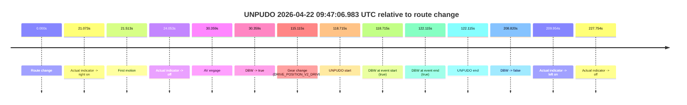
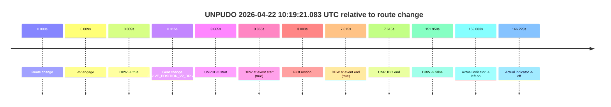
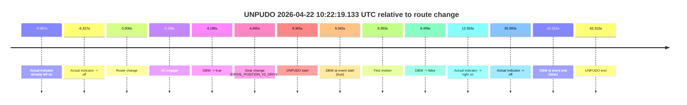

# Run Report: fme20030/2026-04-22--09-13-22--gen2-av-ef4a0c73-16a8-4466-a9ac-5d7ebd1cfbf4

| Field | Value |
|---|---|
| Run ID | `fme20030/2026-04-22--09-13-22--gen2-av-ef4a0c73-16a8-4466-a9ac-5d7ebd1cfbf4` |
| Date | `2026-04-22` |
| Model(s) | `eel-teal-outspoken` |
| Author | `zak` |
| Event count | `3` |

## unpudo 2026-04-22 09:47:06.983 UTC

| Field | Value |
|---|---|
| Model | `eel-teal-outspoken` |
| Author | `zak` |
| Run ID | `fme20030/2026-04-22--09-13-22--gen2-av-ef4a0c73-16a8-4466-a9ac-5d7ebd1cfbf4` |
| Date | `2026-04-22` |
| Time (UTC) | `09:47:06.983` |
| Event type | `unpudo` |
| Disengagement type | `none observed` |
| Route change | `found` |
| Console | [run](https://console.sso.wayve.ai/run/fme20030/2026-04-22--09-13-22--gen2-av-ef4a0c73-16a8-4466-a9ac-5d7ebd1cfbf4?id=&time-unixus=1776851226983322) |
| Foxglove | [segment](https://app.foxglove.dev/wayve-on-prem/p/prj_0dX18KZdVHg1fmmI/view?ds=foxglove-stream&ds.deviceName=fme20030&ds.start=2026-04-22T09%3A44%3A58.268237Z&ds.end=2026-04-22T09%3A48%3A47.087802Z&layoutId=lay_0e7VD4WIKDQGU73Y&time=2026-04-22T09%3A47%3A06.983322Z) |

### Event card: pass

- Pass: AV owns the credited unpudo from route change through the official unpudo window, the gear state is aligned at the anchor, and the vehicle moves without driver accelerator help in AV.

| Event | Time (UTC) | Delta from route change |
|---|---:|---:|
| Route change | 2026-04-22 09:45:08.268 | `0.000s` |
| Actual indicator -> right on | 2026-04-22 09:45:29.341 | `21.073s` |
| First motion | 2026-04-22 09:45:29.781 | `21.513s` |
| Actual indicator -> off | 2026-04-22 09:45:32.321 | `24.053s` |
| AV engage | 2026-04-22 09:45:38.627 | `30.359s` |
| DBW -> true | 2026-04-22 09:45:38.627 | `30.359s` |
| Gear change (DRIVE_POSITION_V2_DRIVE) | 2026-04-22 09:47:03.383 | `115.115s` |
| UNPUDO start | 2026-04-22 09:47:06.983 | `118.715s` |
| DBW at event start (true) | 2026-04-22 09:47:06.983 | `118.715s` |
| DBW at event end (true) | 2026-04-22 09:47:10.383 | `122.115s` |
| UNPUDO end | 2026-04-22 09:47:10.383 | `122.115s` |
| DBW -> false | 2026-04-22 09:48:37.087 | `208.820s` |
| Actual indicator -> left on | 2026-04-22 09:48:38.221 | `209.954s` |
| Actual indicator -> off | 2026-04-22 09:48:56.022 | `227.754s` |

| Metric | Value |
|---|---|
| Outcome | `pass` |
| Effective failure type | `none` |
| Route change status | `found` |
| DBW at event start | `true` |
| DBW at event end | `true` |
| Predicted gear at AV start | `DRIVE_POSITION_V2_DRIVE` |
| Actual gear at AV start | `DRIVE_POSITION_V2_DRIVE` |
| Predicted gear at event start | `DRIVE_POSITION_V2_DRIVE` |
| Actual gear at event start | `DRIVE_POSITION_V2_DRIVE` |
| Planned indicator direction | `INDICATORS_STATE_V2_RIGHT_ON` |
| Controller indicator direction | `INDICATORS_STATE_V2_RIGHT_ON` |
| Actual indicator direction | `INDICATORS_STATE_V2_OFF` |
| Actual indicator at maneuver end | `INDICATORS_STATE_V2_OFF` |
| Driver accel help in AV | `false` |
| Driver accel help timestamp | `n/a` |
| Max accel pedal pct in AV | `0.0%` |
| Max brake pedal pct in AV | `16.6%` |
| Max speed mps in AV | `8.128` |
| Success timing baseline | `route change` |
| Route -> AV | `30.359s` |
| AV -> event start | `88.356s` |
| AV -> first motion | `-8.846s` |
| Success baseline -> event start | `118.715s` |
| Success baseline -> first motion | `21.513s` |
| AV duration before disengagement | `178.461s` |
| Trajectory waypoint count | `36` |
| Driving-plan step count | `11` |

The scored portion starts from the AV-owned window, not from the pre-AV setup. Route-change search in the stopped pre-event segment was `found`, with the baseline therefore set to route change. At the event anchor the model predicts `DRIVE_POSITION_V2_DRIVE` and the actual gear is `DRIVE_POSITION_V2_DRIVE`. The effective model outcome is `pass` because `the credited unpudo stays AV-owned through the official unpudo window.`

### Resolution

| Field | Value |
|---|---|
| Final outcome | `pass` |
| Do we agree with this label? | `yes` |
| Source disengagement type | `none observed` |
| Resolved effective failure type | `none` |
| Confidence | `high` |

## unpudo 2026-04-22 10:19:21.083 UTC

| Field | Value |
|---|---|
| Model | `eel-teal-outspoken` |
| Author | `zak` |
| Run ID | `fme20030/2026-04-22--09-13-22--gen2-av-ef4a0c73-16a8-4466-a9ac-5d7ebd1cfbf4` |
| Date | `2026-04-22` |
| Time (UTC) | `10:19:21.083` |
| Event type | `unpudo` |
| Disengagement type | `none observed` |
| Route change | `found` |
| Console | [run](https://console.sso.wayve.ai/run/fme20030/2026-04-22--09-13-22--gen2-av-ef4a0c73-16a8-4466-a9ac-5d7ebd1cfbf4?id=&time-unixus=1776853161083303) |
| Foxglove | [segment](https://app.foxglove.dev/wayve-on-prem/p/prj_0dX18KZdVHg1fmmI/view?ds=foxglove-stream&ds.deviceName=fme20030&ds.start=2026-04-22T10%3A19%3A07.218281Z&ds.end=2026-04-22T10%3A21%3A59.167945Z&layoutId=lay_0e7VD4WIKDQGU73Y&time=2026-04-22T10%3A19%3A21.083303Z) |

### Event card: pass

- Pass: AV owns the credited unpudo from route change through the official unpudo window, the gear state is aligned at the anchor, and the vehicle moves without driver accelerator help in AV.

| Event | Time (UTC) | Delta from route change |
|---|---:|---:|
| Route change | 2026-04-22 10:19:17.218 | `0.000s` |
| AV engage | 2026-04-22 10:19:17.226 | `0.009s` |
| DBW -> true | 2026-04-22 10:19:17.226 | `0.009s` |
| Gear change (DRIVE_POSITION_V2_DRIVE) | 2026-04-22 10:19:17.533 | `0.315s` |
| UNPUDO start | 2026-04-22 10:19:21.083 | `3.865s` |
| DBW at event start (true) | 2026-04-22 10:19:21.083 | `3.865s` |
| First motion | 2026-04-22 10:19:21.101 | `3.883s` |
| DBW at event end (true) | 2026-04-22 10:19:24.833 | `7.615s` |
| UNPUDO end | 2026-04-22 10:19:24.833 | `7.615s` |
| DBW -> false | 2026-04-22 10:21:49.167 | `151.950s` |
| Actual indicator -> left on | 2026-04-22 10:21:50.301 | `153.083s` |
| Actual indicator -> off | 2026-04-22 10:22:03.441 | `166.223s` |

| Metric | Value |
|---|---|
| Outcome | `pass` |
| Effective failure type | `none` |
| Route change status | `found` |
| DBW at event start | `true` |
| DBW at event end | `true` |
| Predicted gear at AV start | `DRIVE_POSITION_V2_PARK` |
| Actual gear at AV start | `DRIVE_POSITION_V2_PARK` |
| Predicted gear at event start | `DRIVE_POSITION_V2_DRIVE` |
| Actual gear at event start | `DRIVE_POSITION_V2_DRIVE` |
| Planned indicator direction | `INDICATORS_STATE_V2_RIGHT_ON` |
| Controller indicator direction | `INDICATORS_STATE_V2_RIGHT_ON` |
| Actual indicator direction | `INDICATORS_STATE_V2_OFF` |
| Actual indicator at maneuver end | `INDICATORS_STATE_V2_OFF` |
| Driver accel help in AV | `false` |
| Driver accel help timestamp | `n/a` |
| Max accel pedal pct in AV | `0.0%` |
| Max brake pedal pct in AV | `8.0%` |
| Max speed mps in AV | `4.686` |
| Success timing baseline | `route change` |
| Route -> AV | `0.009s` |
| AV -> event start | `3.856s` |
| AV -> first motion | `3.875s` |
| Success baseline -> event start | `3.865s` |
| Success baseline -> first motion | `3.883s` |
| AV duration before disengagement | `151.941s` |
| Trajectory waypoint count | `36` |
| Driving-plan step count | `11` |

The scored portion starts from the AV-owned window, not from the pre-AV setup. Route-change search in the stopped pre-event segment was `found`, with the baseline therefore set to route change. At the event anchor the model predicts `DRIVE_POSITION_V2_DRIVE` and the actual gear is `DRIVE_POSITION_V2_DRIVE`. The effective model outcome is `pass` because `the credited unpudo stays AV-owned through the official unpudo window.`

### Resolution

| Field | Value |
|---|---|
| Final outcome | `pass` |
| Do we agree with this label? | `yes` |
| Source disengagement type | `none observed` |
| Resolved effective failure type | `none` |
| Confidence | `high` |

## unpudo 2026-04-22 10:22:19.133 UTC

| Field | Value |
|---|---|
| Model | `eel-teal-outspoken` |
| Author | `zak` |
| Run ID | `fme20030/2026-04-22--09-13-22--gen2-av-ef4a0c73-16a8-4466-a9ac-5d7ebd1cfbf4` |
| Date | `2026-04-22` |
| Time (UTC) | `10:22:19.133` |
| Event type | `unpudo` |
| Disengagement type | `none observed` |
| Route change | `found` |
| Console | [run](https://console.sso.wayve.ai/run/fme20030/2026-04-22--09-13-22--gen2-av-ef4a0c73-16a8-4466-a9ac-5d7ebd1cfbf4?id=&time-unixus=1776853339133293) |
| Foxglove | [segment](https://app.foxglove.dev/wayve-on-prem/p/prj_0dX18KZdVHg1fmmI/view?ds=foxglove-stream&ds.deviceName=fme20030&ds.start=2026-04-22T10%3A21%3A59.768298Z&ds.end=2026-04-22T10%3A23%3A22.083314Z&layoutId=lay_0e7VD4WIKDQGU73Y&time=2026-04-22T10%3A22%3A19.133293Z) |

### Event card: fail

- Fail: this is a short AV stint rather than a durable model-owned maneuver. The vehicle never settles into a long enough AV-owned attempt to credit the model.

| Event | Time (UTC) | Delta from route change |
|---|---:|---:|
| Actual indicator already left on | 2026-04-22 10:21:59.781 | `-9.987s` |
| Actual indicator -> off | 2026-04-22 10:22:03.441 | `-6.327s` |
| Route change | 2026-04-22 10:22:09.768 | `0.000s` |
| AV engage | 2026-04-22 10:22:13.966 | `4.198s` |
| DBW -> true | 2026-04-22 10:22:13.966 | `4.198s` |
| Gear change (DRIVE_POSITION_V2_DRIVE) | 2026-04-22 10:22:14.433 | `4.665s` |
| UNPUDO start | 2026-04-22 10:22:19.133 | `9.365s` |
| DBW at event start (true) | 2026-04-22 10:22:19.133 | `9.365s` |
| First motion | 2026-04-22 10:22:19.161 | `9.393s` |
| DBW -> false | 2026-04-22 10:22:19.267 | `9.499s` |
| Actual indicator -> right on | 2026-04-22 10:22:22.361 | `12.593s` |
| Actual indicator -> off | 2026-04-22 10:23:05.761 | `55.993s` |
| DBW at event end (false) | 2026-04-22 10:23:12.083 | `62.315s` |
| UNPUDO end | 2026-04-22 10:23:12.083 | `62.315s` |

| Metric | Value |
|---|---|
| Outcome | `fail` |
| Effective failure type | `interrupted_handover` |
| Route change status | `found` |
| DBW at event start | `true` |
| DBW at event end | `false` |
| Predicted gear at AV start | `DRIVE_POSITION_V2_DRIVE` |
| Actual gear at AV start | `DRIVE_POSITION_V2_PARK` |
| Predicted gear at event start | `DRIVE_POSITION_V2_DRIVE` |
| Actual gear at event start | `DRIVE_POSITION_V2_DRIVE` |
| Planned indicator direction | `INDICATORS_STATE_V2_RIGHT_ON` |
| Controller indicator direction | `INDICATORS_STATE_V2_RIGHT_ON` |
| Actual indicator direction | `INDICATORS_STATE_V2_OFF` |
| Actual indicator at maneuver end | `INDICATORS_STATE_V2_OFF` |
| Driver accel help in AV | `false` |
| Driver accel help timestamp | `n/a` |
| Max accel pedal pct in AV | `0.0%` |
| Max brake pedal pct in AV | `8.0%` |
| Max speed mps in AV | `0.503` |
| Success timing baseline | `route change` |
| Route -> AV | `4.198s` |
| AV -> event start | `5.167s` |
| AV -> first motion | `5.195s` |
| Success baseline -> event start | `9.365s` |
| Success baseline -> first motion | `9.393s` |
| AV duration before disengagement | `5.301s` |
| Trajectory waypoint count | `37` |
| Driving-plan step count | `11` |

The scored portion starts from the AV-owned window, not from the pre-AV setup. Route-change search in the stopped pre-event segment was `found`, with the baseline therefore set to route change. At the event anchor the model predicts `DRIVE_POSITION_V2_DRIVE` and the actual gear is `DRIVE_POSITION_V2_DRIVE`. The effective model outcome is `fail` because `interrupted_handover.`

### Resolution

| Field | Value |
|---|---|
| Final outcome | `fail` |
| Do we agree with this label? | `yes` |
| Source disengagement type | `none observed` |
| Resolved effective failure type | `interrupted_handover` |
| Confidence | `high` |
