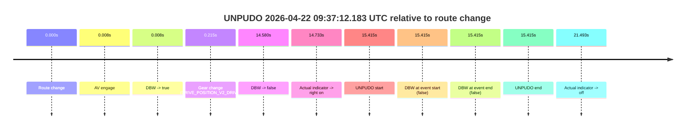
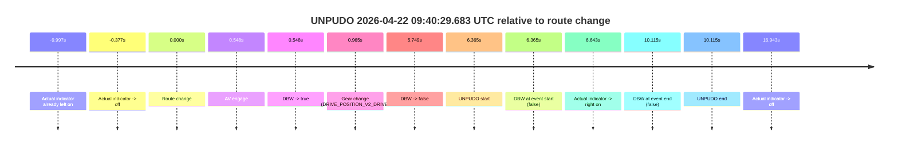
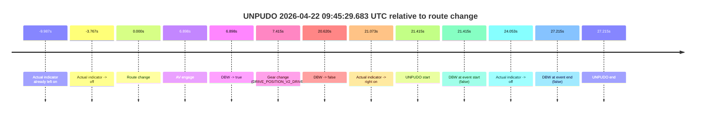
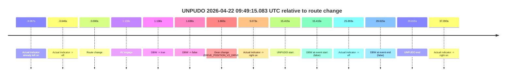
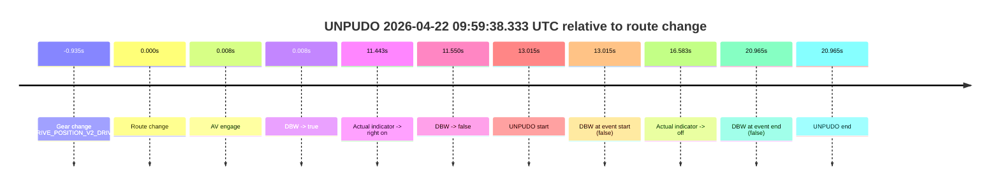
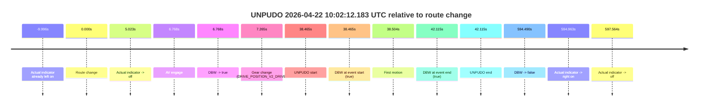
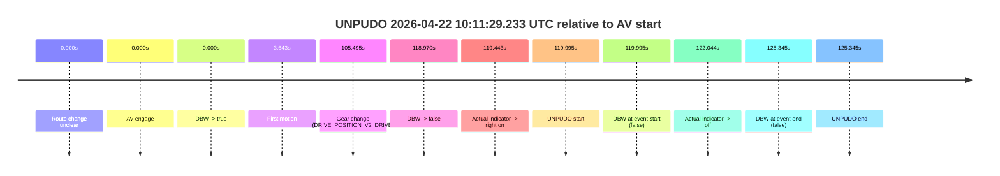
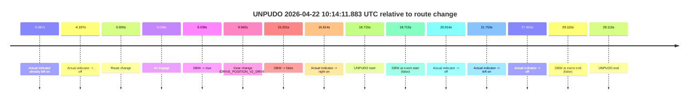
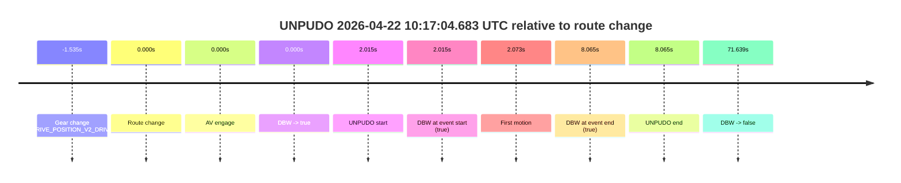
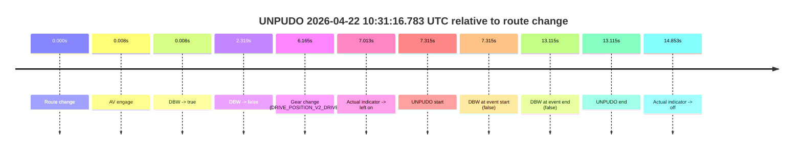

# Run Report: fme20030/2026-04-22--09-13-22--gen2-av-ef4a0c73-16a8-4466-a9ac-5d7ebd1cfbf4

| Field | Value |
|---|---|
| Run ID | `fme20030/2026-04-22--09-13-22--gen2-av-ef4a0c73-16a8-4466-a9ac-5d7ebd1cfbf4` |
| Date | `2026-04-22` |
| Model(s) | `pink-manta-ray-smooth` |
| Author | `guy.geva` |
| Event count | `10` |

## unpudo 2026-04-22 09:37:12.183 UTC

| Field | Value |
|---|---|
| Model | `pink-manta-ray-smooth` |
| Author | `guy.geva` |
| Run ID | `fme20030/2026-04-22--09-13-22--gen2-av-ef4a0c73-16a8-4466-a9ac-5d7ebd1cfbf4` |
| Date | `2026-04-22` |
| Time (UTC) | `09:37:12.183` |
| Event type | `unpudo` |
| Disengagement type | `none observed` |
| Route change | `found` |
| Console | [run](https://console.sso.wayve.ai/run/fme20030/2026-04-22--09-13-22--gen2-av-ef4a0c73-16a8-4466-a9ac-5d7ebd1cfbf4?id=&time-unixus=1776850632183294) |
| Foxglove | [segment](https://app.foxglove.dev/wayve-on-prem/p/prj_0dX18KZdVHg1fmmI/view?ds=foxglove-stream&ds.deviceName=fme20030&ds.start=2026-04-22T09%3A36%3A46.768254Z&ds.end=2026-04-22T09%3A37%3A22.183294Z&layoutId=lay_0e7VD4WIKDQGU73Y&time=2026-04-22T09%3A37%3A12.183294Z) |

### Event card: fail

- Fail: the credited unpudo does not stay AV-owned. The event window starts with DBW false, and the maneuver outcome lands outside a clean AV-owned segment.

| Event | Time (UTC) | Delta from route change |
|---|---:|---:|
| Route change | 2026-04-22 09:36:56.768 | `0.000s` |
| AV engage | 2026-04-22 09:36:56.776 | `0.008s` |
| DBW -> true | 2026-04-22 09:36:56.776 | `0.008s` |
| Gear change (DRIVE_POSITION_V2_DRIVE) | 2026-04-22 09:36:56.983 | `0.215s` |
| DBW -> false | 2026-04-22 09:37:11.347 | `14.580s` |
| Actual indicator -> right on | 2026-04-22 09:37:11.501 | `14.733s` |
| UNPUDO start | 2026-04-22 09:37:12.183 | `15.415s` |
| DBW at event start (false) | 2026-04-22 09:37:12.183 | `15.415s` |
| DBW at event end (false) | 2026-04-22 09:37:12.183 | `15.415s` |
| UNPUDO end | 2026-04-22 09:37:12.183 | `15.415s` |
| Actual indicator -> off | 2026-04-22 09:37:18.261 | `21.493s` |

| Metric | Value |
|---|---|
| Outcome | `fail` |
| Effective failure type | `not_av_owned` |
| Route change status | `found` |
| DBW at event start | `false` |
| DBW at event end | `false` |
| Predicted gear at AV start | `DRIVE_POSITION_V2_PARK` |
| Actual gear at AV start | `DRIVE_POSITION_V2_PARK` |
| Predicted gear at event start | `DRIVE_POSITION_V2_DRIVE` |
| Actual gear at event start | `DRIVE_POSITION_V2_DRIVE` |
| Planned indicator direction | `INDICATORS_STATE_V2_OFF` |
| Controller indicator direction | `INDICATORS_STATE_V2_OFF` |
| Actual indicator direction | `INDICATORS_STATE_V2_RIGHT_ON` |
| Actual indicator at maneuver end | `INDICATORS_STATE_V2_RIGHT_ON` |
| Driver accel help in AV | `false` |
| Driver accel help timestamp | `n/a` |
| Max accel pedal pct in AV | `0.0%` |
| Max brake pedal pct in AV | `9.6%` |
| Max speed mps in AV | `0.000` |
| Success timing baseline | `route change` |
| Route -> AV | `0.008s` |
| AV -> event start | `15.407s` |
| AV -> first motion | `n/a` |
| Success baseline -> event start | `15.415s` |
| Success baseline -> first motion | `n/a` |
| AV duration before disengagement | `14.571s` |
| Trajectory waypoint count | `36` |
| Driving-plan step count | `11` |

The scored portion starts from the AV-owned window, not from the pre-AV setup. Route-change search in the stopped pre-event segment was `found`, with the baseline therefore set to route change. At the event anchor the model predicts `DRIVE_POSITION_V2_DRIVE` and the actual gear is `DRIVE_POSITION_V2_DRIVE`. The effective model outcome is `fail` because `not_av_owned.`

### Resolution

| Field | Value |
|---|---|
| Final outcome | `fail` |
| Do we agree with this label? | `yes` |
| Source disengagement type | `none observed` |
| Resolved effective failure type | `not_av_owned` |
| Confidence | `high` |

## unpudo 2026-04-22 09:40:29.683 UTC

| Field | Value |
|---|---|
| Model | `pink-manta-ray-smooth` |
| Author | `guy.geva` |
| Run ID | `fme20030/2026-04-22--09-13-22--gen2-av-ef4a0c73-16a8-4466-a9ac-5d7ebd1cfbf4` |
| Date | `2026-04-22` |
| Time (UTC) | `09:40:29.683` |
| Event type | `unpudo` |
| Disengagement type | `none observed` |
| Route change | `found` |
| Console | [run](https://console.sso.wayve.ai/run/fme20030/2026-04-22--09-13-22--gen2-av-ef4a0c73-16a8-4466-a9ac-5d7ebd1cfbf4?id=&time-unixus=1776850829683316) |
| Foxglove | [segment](https://app.foxglove.dev/wayve-on-prem/p/prj_0dX18KZdVHg1fmmI/view?ds=foxglove-stream&ds.deviceName=fme20030&ds.start=2026-04-22T09%3A40%3A13.318265Z&ds.end=2026-04-22T09%3A40%3A43.433296Z&layoutId=lay_0e7VD4WIKDQGU73Y&time=2026-04-22T09%3A40%3A29.683316Z) |

### Event card: fail

- Fail: the credited unpudo does not stay AV-owned. The event window starts with DBW false, and the maneuver outcome lands outside a clean AV-owned segment.

| Event | Time (UTC) | Delta from route change |
|---|---:|---:|
| Actual indicator already left on | 2026-04-22 09:40:13.321 | `-9.997s` |
| Actual indicator -> off | 2026-04-22 09:40:22.941 | `-0.377s` |
| Route change | 2026-04-22 09:40:23.318 | `0.000s` |
| AV engage | 2026-04-22 09:40:23.866 | `0.548s` |
| DBW -> true | 2026-04-22 09:40:23.866 | `0.548s` |
| Gear change (DRIVE_POSITION_V2_DRIVE) | 2026-04-22 09:40:24.283 | `0.965s` |
| DBW -> false | 2026-04-22 09:40:29.067 | `5.749s` |
| UNPUDO start | 2026-04-22 09:40:29.683 | `6.365s` |
| DBW at event start (false) | 2026-04-22 09:40:29.683 | `6.365s` |
| Actual indicator -> right on | 2026-04-22 09:40:29.961 | `6.643s` |
| DBW at event end (false) | 2026-04-22 09:40:33.433 | `10.115s` |
| UNPUDO end | 2026-04-22 09:40:33.433 | `10.115s` |
| Actual indicator -> off | 2026-04-22 09:40:40.261 | `16.943s` |

| Metric | Value |
|---|---|
| Outcome | `fail` |
| Effective failure type | `not_av_owned` |
| Route change status | `found` |
| DBW at event start | `false` |
| DBW at event end | `false` |
| Predicted gear at AV start | `DRIVE_POSITION_V2_DRIVE` |
| Actual gear at AV start | `DRIVE_POSITION_V2_PARK` |
| Predicted gear at event start | `DRIVE_POSITION_V2_DRIVE` |
| Actual gear at event start | `DRIVE_POSITION_V2_DRIVE` |
| Planned indicator direction | `INDICATORS_STATE_V2_RIGHT_ON` |
| Controller indicator direction | `INDICATORS_STATE_V2_RIGHT_ON` |
| Actual indicator direction | `INDICATORS_STATE_V2_OFF` |
| Actual indicator at maneuver end | `INDICATORS_STATE_V2_RIGHT_ON` |
| Driver accel help in AV | `false` |
| Driver accel help timestamp | `n/a` |
| Max accel pedal pct in AV | `0.0%` |
| Max brake pedal pct in AV | `8.0%` |
| Max speed mps in AV | `0.000` |
| Success timing baseline | `route change` |
| Route -> AV | `0.548s` |
| AV -> event start | `5.817s` |
| AV -> first motion | `n/a` |
| Success baseline -> event start | `6.365s` |
| Success baseline -> first motion | `n/a` |
| AV duration before disengagement | `5.201s` |
| Trajectory waypoint count | `36` |
| Driving-plan step count | `11` |

The scored portion starts from the AV-owned window, not from the pre-AV setup. Route-change search in the stopped pre-event segment was `found`, with the baseline therefore set to route change. At the event anchor the model predicts `DRIVE_POSITION_V2_DRIVE` and the actual gear is `DRIVE_POSITION_V2_DRIVE`. The effective model outcome is `fail` because `not_av_owned.`

### Resolution

| Field | Value |
|---|---|
| Final outcome | `fail` |
| Do we agree with this label? | `yes` |
| Source disengagement type | `none observed` |
| Resolved effective failure type | `not_av_owned` |
| Confidence | `high` |

## unpudo 2026-04-22 09:45:29.683 UTC

| Field | Value |
|---|---|
| Model | `pink-manta-ray-smooth` |
| Author | `guy.geva` |
| Run ID | `fme20030/2026-04-22--09-13-22--gen2-av-ef4a0c73-16a8-4466-a9ac-5d7ebd1cfbf4` |
| Date | `2026-04-22` |
| Time (UTC) | `09:45:29.683` |
| Event type | `unpudo` |
| Disengagement type | `none observed` |
| Route change | `found` |
| Console | [run](https://console.sso.wayve.ai/run/fme20030/2026-04-22--09-13-22--gen2-av-ef4a0c73-16a8-4466-a9ac-5d7ebd1cfbf4?id=&time-unixus=1776851129683311) |
| Foxglove | [segment](https://app.foxglove.dev/wayve-on-prem/p/prj_0dX18KZdVHg1fmmI/view?ds=foxglove-stream&ds.deviceName=fme20030&ds.start=2026-04-22T09%3A44%3A58.268237Z&ds.end=2026-04-22T09%3A45%3A45.483297Z&layoutId=lay_0e7VD4WIKDQGU73Y&time=2026-04-22T09%3A45%3A29.683311Z) |

### Event card: fail

- Fail: the credited unpudo does not stay AV-owned. The event window starts with DBW false, and the maneuver outcome lands outside a clean AV-owned segment.

| Event | Time (UTC) | Delta from route change |
|---|---:|---:|
| Actual indicator already left on | 2026-04-22 09:44:58.281 | `-9.987s` |
| Actual indicator -> off | 2026-04-22 09:45:04.501 | `-3.767s` |
| Route change | 2026-04-22 09:45:08.268 | `0.000s` |
| AV engage | 2026-04-22 09:45:15.166 | `6.898s` |
| DBW -> true | 2026-04-22 09:45:15.166 | `6.898s` |
| Gear change (DRIVE_POSITION_V2_DRIVE) | 2026-04-22 09:45:15.683 | `7.415s` |
| DBW -> false | 2026-04-22 09:45:28.888 | `20.620s` |
| Actual indicator -> right on | 2026-04-22 09:45:29.341 | `21.073s` |
| UNPUDO start | 2026-04-22 09:45:29.683 | `21.415s` |
| DBW at event start (false) | 2026-04-22 09:45:29.683 | `21.415s` |
| Actual indicator -> off | 2026-04-22 09:45:32.321 | `24.053s` |
| DBW at event end (false) | 2026-04-22 09:45:35.483 | `27.215s` |
| UNPUDO end | 2026-04-22 09:45:35.483 | `27.215s` |

| Metric | Value |
|---|---|
| Outcome | `fail` |
| Effective failure type | `not_av_owned` |
| Route change status | `found` |
| DBW at event start | `false` |
| DBW at event end | `false` |
| Predicted gear at AV start | `DRIVE_POSITION_V2_REVERSE` |
| Actual gear at AV start | `DRIVE_POSITION_V2_PARK` |
| Predicted gear at event start | `DRIVE_POSITION_V2_DRIVE` |
| Actual gear at event start | `DRIVE_POSITION_V2_DRIVE` |
| Planned indicator direction | `INDICATORS_STATE_V2_RIGHT_ON` |
| Controller indicator direction | `INDICATORS_STATE_V2_RIGHT_ON` |
| Actual indicator direction | `INDICATORS_STATE_V2_RIGHT_ON` |
| Actual indicator at maneuver end | `INDICATORS_STATE_V2_OFF` |
| Driver accel help in AV | `false` |
| Driver accel help timestamp | `n/a` |
| Max accel pedal pct in AV | `0.0%` |
| Max brake pedal pct in AV | `8.0%` |
| Max speed mps in AV | `0.000` |
| Success timing baseline | `route change` |
| Route -> AV | `6.898s` |
| AV -> event start | `14.517s` |
| AV -> first motion | `n/a` |
| Success baseline -> event start | `21.415s` |
| Success baseline -> first motion | `n/a` |
| AV duration before disengagement | `13.722s` |
| Trajectory waypoint count | `36` |
| Driving-plan step count | `11` |

The scored portion starts from the AV-owned window, not from the pre-AV setup. Route-change search in the stopped pre-event segment was `found`, with the baseline therefore set to route change. At the event anchor the model predicts `DRIVE_POSITION_V2_DRIVE` and the actual gear is `DRIVE_POSITION_V2_DRIVE`. The effective model outcome is `fail` because `not_av_owned.`

### Resolution

| Field | Value |
|---|---|
| Final outcome | `fail` |
| Do we agree with this label? | `yes` |
| Source disengagement type | `none observed` |
| Resolved effective failure type | `not_av_owned` |
| Confidence | `high` |

## unpudo 2026-04-22 09:49:15.083 UTC

| Field | Value |
|---|---|
| Model | `pink-manta-ray-smooth` |
| Author | `guy.geva` |
| Run ID | `fme20030/2026-04-22--09-13-22--gen2-av-ef4a0c73-16a8-4466-a9ac-5d7ebd1cfbf4` |
| Date | `2026-04-22` |
| Time (UTC) | `09:49:15.083` |
| Event type | `unpudo` |
| Disengagement type | `none observed` |
| Route change | `found` |
| Console | [run](https://console.sso.wayve.ai/run/fme20030/2026-04-22--09-13-22--gen2-av-ef4a0c73-16a8-4466-a9ac-5d7ebd1cfbf4?id=&time-unixus=1776851355083293) |
| Foxglove | [segment](https://app.foxglove.dev/wayve-on-prem/p/prj_0dX18KZdVHg1fmmI/view?ds=foxglove-stream&ds.deviceName=fme20030&ds.start=2026-04-22T09%3A48%3A49.668595Z&ds.end=2026-04-22T09%3A49%3A39.283302Z&layoutId=lay_0e7VD4WIKDQGU73Y&time=2026-04-22T09%3A49%3A15.083293Z) |

### Event card: accidental

- Accidental: AV ownership is present for less than `2s`, so this is treated as an accidental brush with the maneuver rather than a meaningful model attempt.

| Event | Time (UTC) | Delta from route change |
|---|---:|---:|
| Actual indicator already left on | 2026-04-22 09:48:49.681 | `-9.987s` |
| Actual indicator -> off | 2026-04-22 09:48:56.022 | `-3.646s` |
| Route change | 2026-04-22 09:48:59.668 | `0.000s` |
| AV engage | 2026-04-22 09:49:00.806 | `1.138s` |
| DBW -> true | 2026-04-22 09:49:00.806 | `1.138s` |
| DBW -> false | 2026-04-22 09:49:01.306 | `1.638s` |
| Gear change (DRIVE_POSITION_V2_DRIVE) | 2026-04-22 09:49:01.333 | `1.665s` |
| Actual indicator -> right on | 2026-04-22 09:49:04.741 | `5.073s` |
| UNPUDO start | 2026-04-22 09:49:15.083 | `15.415s` |
| DBW at event start (false) | 2026-04-22 09:49:15.083 | `15.415s` |
| Actual indicator -> off | 2026-04-22 09:49:25.562 | `25.893s` |
| DBW at event end (false) | 2026-04-22 09:49:29.283 | `29.615s` |
| UNPUDO end | 2026-04-22 09:49:29.283 | `29.615s` |
| Actual indicator -> right on | 2026-04-22 09:49:36.761 | `37.093s` |

| Metric | Value |
|---|---|
| Outcome | `accidental` |
| Effective failure type | `none` |
| Route change status | `found` |
| DBW at event start | `false` |
| DBW at event end | `false` |
| Predicted gear at AV start | `DRIVE_POSITION_V2_DRIVE` |
| Actual gear at AV start | `DRIVE_POSITION_V2_PARK` |
| Predicted gear at event start | `DRIVE_POSITION_V2_DRIVE` |
| Actual gear at event start | `DRIVE_POSITION_V2_DRIVE` |
| Planned indicator direction | `INDICATORS_STATE_V2_RIGHT_ON` |
| Controller indicator direction | `INDICATORS_STATE_V2_RIGHT_ON` |
| Actual indicator direction | `INDICATORS_STATE_V2_RIGHT_ON` |
| Actual indicator at maneuver end | `INDICATORS_STATE_V2_OFF` |
| Driver accel help in AV | `false` |
| Driver accel help timestamp | `n/a` |
| Max accel pedal pct in AV | `0.0%` |
| Max brake pedal pct in AV | `8.0%` |
| Max speed mps in AV | `0.000` |
| Success timing baseline | `route change` |
| Route -> AV | `1.138s` |
| AV -> event start | `14.277s` |
| AV -> first motion | `n/a` |
| Success baseline -> event start | `15.415s` |
| Success baseline -> first motion | `n/a` |
| AV duration before disengagement | `0.500s` |
| Trajectory waypoint count | `36` |
| Driving-plan step count | `11` |

The scored portion starts from the AV-owned window, not from the pre-AV setup. Route-change search in the stopped pre-event segment was `found`, with the baseline therefore set to route change. At the event anchor the model predicts `DRIVE_POSITION_V2_DRIVE` and the actual gear is `DRIVE_POSITION_V2_DRIVE`. The effective model outcome is `accidental` because `the AV-owned portion is shorter than 2s.`

### Resolution

| Field | Value |
|---|---|
| Final outcome | `accidental` |
| Do we agree with this label? | `yes` |
| Source disengagement type | `none observed` |
| Resolved effective failure type | `none` |
| Confidence | `high` |

## unpudo 2026-04-22 09:59:38.333 UTC

| Field | Value |
|---|---|
| Model | `pink-manta-ray-smooth` |
| Author | `guy.geva` |
| Run ID | `fme20030/2026-04-22--09-13-22--gen2-av-ef4a0c73-16a8-4466-a9ac-5d7ebd1cfbf4` |
| Date | `2026-04-22` |
| Time (UTC) | `09:59:38.333` |
| Event type | `unpudo` |
| Disengagement type | `none observed` |
| Route change | `found` |
| Console | [run](https://console.sso.wayve.ai/run/fme20030/2026-04-22--09-13-22--gen2-av-ef4a0c73-16a8-4466-a9ac-5d7ebd1cfbf4?id=&time-unixus=1776851978333294) |
| Foxglove | [segment](https://app.foxglove.dev/wayve-on-prem/p/prj_0dX18KZdVHg1fmmI/view?ds=foxglove-stream&ds.deviceName=fme20030&ds.start=2026-04-22T09%3A59%3A14.383302Z&ds.end=2026-04-22T09%3A59%3A56.283298Z&layoutId=lay_0e7VD4WIKDQGU73Y&time=2026-04-22T09%3A59%3A38.333294Z) |

### Event card: fail

- Fail: the credited unpudo does not stay AV-owned. The event window starts with DBW false, and the maneuver outcome lands outside a clean AV-owned segment.

| Event | Time (UTC) | Delta from route change |
|---|---:|---:|
| Gear change (DRIVE_POSITION_V2_DRIVE) | 2026-04-22 09:59:24.383 | `-0.935s` |
| Route change | 2026-04-22 09:59:25.318 | `0.000s` |
| AV engage | 2026-04-22 09:59:25.326 | `0.008s` |
| DBW -> true | 2026-04-22 09:59:25.326 | `0.008s` |
| Actual indicator -> right on | 2026-04-22 09:59:36.761 | `11.443s` |
| DBW -> false | 2026-04-22 09:59:36.867 | `11.550s` |
| UNPUDO start | 2026-04-22 09:59:38.333 | `13.015s` |
| DBW at event start (false) | 2026-04-22 09:59:38.333 | `13.015s` |
| Actual indicator -> off | 2026-04-22 09:59:41.901 | `16.583s` |
| DBW at event end (false) | 2026-04-22 09:59:46.283 | `20.965s` |
| UNPUDO end | 2026-04-22 09:59:46.283 | `20.965s` |

| Metric | Value |
|---|---|
| Outcome | `fail` |
| Effective failure type | `not_av_owned` |
| Route change status | `found` |
| DBW at event start | `false` |
| DBW at event end | `false` |
| Predicted gear at AV start | `DRIVE_POSITION_V2_REVERSE` |
| Actual gear at AV start | `DRIVE_POSITION_V2_REVERSE` |
| Predicted gear at event start | `DRIVE_POSITION_V2_DRIVE` |
| Actual gear at event start | `DRIVE_POSITION_V2_DRIVE` |
| Planned indicator direction | `INDICATORS_STATE_V2_RIGHT_ON` |
| Controller indicator direction | `INDICATORS_STATE_V2_RIGHT_ON` |
| Actual indicator direction | `INDICATORS_STATE_V2_RIGHT_ON` |
| Actual indicator at maneuver end | `INDICATORS_STATE_V2_OFF` |
| Driver accel help in AV | `false` |
| Driver accel help timestamp | `n/a` |
| Max accel pedal pct in AV | `0.0%` |
| Max brake pedal pct in AV | `8.0%` |
| Max speed mps in AV | `0.000` |
| Success timing baseline | `route change` |
| Route -> AV | `0.008s` |
| AV -> event start | `13.007s` |
| AV -> first motion | `n/a` |
| Success baseline -> event start | `13.015s` |
| Success baseline -> first motion | `n/a` |
| AV duration before disengagement | `11.541s` |
| Trajectory waypoint count | `37` |
| Driving-plan step count | `11` |

The scored portion starts from the AV-owned window, not from the pre-AV setup. Route-change search in the stopped pre-event segment was `found`, with the baseline therefore set to route change. At the event anchor the model predicts `DRIVE_POSITION_V2_DRIVE` and the actual gear is `DRIVE_POSITION_V2_DRIVE`. The effective model outcome is `fail` because `not_av_owned.`

### Resolution

| Field | Value |
|---|---|
| Final outcome | `fail` |
| Do we agree with this label? | `yes` |
| Source disengagement type | `none observed` |
| Resolved effective failure type | `not_av_owned` |
| Confidence | `high` |

## unpudo 2026-04-22 10:02:12.183 UTC

| Field | Value |
|---|---|
| Model | `pink-manta-ray-smooth` |
| Author | `guy.geva` |
| Run ID | `fme20030/2026-04-22--09-13-22--gen2-av-ef4a0c73-16a8-4466-a9ac-5d7ebd1cfbf4` |
| Date | `2026-04-22` |
| Time (UTC) | `10:02:12.183` |
| Event type | `unpudo` |
| Disengagement type | `none observed` |
| Route change | `found` |
| Console | [run](https://console.sso.wayve.ai/run/fme20030/2026-04-22--09-13-22--gen2-av-ef4a0c73-16a8-4466-a9ac-5d7ebd1cfbf4?id=&time-unixus=1776852132183313) |
| Foxglove | [segment](https://app.foxglove.dev/wayve-on-prem/p/prj_0dX18KZdVHg1fmmI/view?ds=foxglove-stream&ds.deviceName=fme20030&ds.start=2026-04-22T10%3A01%3A23.718268Z&ds.end=2026-04-22T10%3A11%3A38.207869Z&layoutId=lay_0e7VD4WIKDQGU73Y&time=2026-04-22T10%3A02%3A12.183313Z) |

### Event card: pass

- Pass: AV owns the credited unpudo from route change through the official unpudo window, the gear state is aligned at the anchor, and the vehicle moves without driver accelerator help in AV.

| Event | Time (UTC) | Delta from route change |
|---|---:|---:|
| Actual indicator already left on | 2026-04-22 10:01:23.722 | `-9.996s` |
| Route change | 2026-04-22 10:01:33.718 | `0.000s` |
| Actual indicator -> off | 2026-04-22 10:01:38.741 | `5.023s` |
| AV engage | 2026-04-22 10:01:40.486 | `6.768s` |
| DBW -> true | 2026-04-22 10:01:40.486 | `6.768s` |
| Gear change (DRIVE_POSITION_V2_DRIVE) | 2026-04-22 10:01:40.983 | `7.265s` |
| UNPUDO start | 2026-04-22 10:02:12.183 | `38.465s` |
| DBW at event start (true) | 2026-04-22 10:02:12.183 | `38.465s` |
| First motion | 2026-04-22 10:02:12.221 | `38.504s` |
| DBW at event end (true) | 2026-04-22 10:02:15.833 | `42.115s` |
| UNPUDO end | 2026-04-22 10:02:15.833 | `42.115s` |
| DBW -> false | 2026-04-22 10:11:28.207 | `594.490s` |
| Actual indicator -> right on | 2026-04-22 10:11:28.681 | `594.963s` |
| Actual indicator -> off | 2026-04-22 10:11:31.282 | `597.564s` |

| Metric | Value |
|---|---|
| Outcome | `pass` |
| Effective failure type | `none` |
| Route change status | `found` |
| DBW at event start | `true` |
| DBW at event end | `true` |
| Predicted gear at AV start | `DRIVE_POSITION_V2_DRIVE` |
| Actual gear at AV start | `DRIVE_POSITION_V2_PARK` |
| Predicted gear at event start | `DRIVE_POSITION_V2_DRIVE` |
| Actual gear at event start | `DRIVE_POSITION_V2_DRIVE` |
| Planned indicator direction | `INDICATORS_STATE_V2_OFF` |
| Controller indicator direction | `INDICATORS_STATE_V2_OFF` |
| Actual indicator direction | `INDICATORS_STATE_V2_OFF` |
| Actual indicator at maneuver end | `INDICATORS_STATE_V2_OFF` |
| Driver accel help in AV | `false` |
| Driver accel help timestamp | `n/a` |
| Max accel pedal pct in AV | `0.0%` |
| Max brake pedal pct in AV | `8.0%` |
| Max speed mps in AV | `3.667` |
| Success timing baseline | `route change` |
| Route -> AV | `6.768s` |
| AV -> event start | `31.697s` |
| AV -> first motion | `31.735s` |
| Success baseline -> event start | `38.465s` |
| Success baseline -> first motion | `38.504s` |
| AV duration before disengagement | `587.721s` |
| Trajectory waypoint count | `36` |
| Driving-plan step count | `11` |

The scored portion starts from the AV-owned window, not from the pre-AV setup. Route-change search in the stopped pre-event segment was `found`, with the baseline therefore set to route change. At the event anchor the model predicts `DRIVE_POSITION_V2_DRIVE` and the actual gear is `DRIVE_POSITION_V2_DRIVE`. The effective model outcome is `pass` because `the credited unpudo stays AV-owned through the official unpudo window.`

### Resolution

| Field | Value |
|---|---|
| Final outcome | `pass` |
| Do we agree with this label? | `yes` |
| Source disengagement type | `none observed` |
| Resolved effective failure type | `none` |
| Confidence | `high` |

## unpudo 2026-04-22 10:11:29.233 UTC

| Field | Value |
|---|---|
| Model | `pink-manta-ray-smooth` |
| Author | `guy.geva` |
| Run ID | `fme20030/2026-04-22--09-13-22--gen2-av-ef4a0c73-16a8-4466-a9ac-5d7ebd1cfbf4` |
| Date | `2026-04-22` |
| Time (UTC) | `10:11:29.233` |
| Event type | `unpudo` |
| Disengagement type | `none observed` |
| Route change | `unclear` |
| Console | [run](https://console.sso.wayve.ai/run/fme20030/2026-04-22--09-13-22--gen2-av-ef4a0c73-16a8-4466-a9ac-5d7ebd1cfbf4?id=&time-unixus=1776852689233303) |
| Foxglove | [segment](https://app.foxglove.dev/wayve-on-prem/p/prj_0dX18KZdVHg1fmmI/view?ds=foxglove-stream&ds.deviceName=fme20030&ds.start=2026-04-22T10%3A09%3A19.238346Z&ds.end=2026-04-22T10%3A11%3A44.583318Z&layoutId=lay_0e7VD4WIKDQGU73Y&time=2026-04-22T10%3A11%3A29.233303Z) |

### Event card: fail

- Fail: the credited unpudo does not stay AV-owned. The event window starts with DBW false, and the maneuver outcome lands outside a clean AV-owned segment.

| Event | Time (UTC) | Delta from AV start |
|---|---:|---:|
| Route change unclear | 2026-04-22 10:09:29.238 | `0.000s` |
| AV engage | 2026-04-22 10:09:29.238 | `0.000s` |
| DBW -> true | 2026-04-22 10:09:29.238 | `0.000s` |
| First motion | 2026-04-22 10:09:32.881 | `3.643s` |
| Gear change (DRIVE_POSITION_V2_DRIVE) | 2026-04-22 10:11:14.733 | `105.495s` |
| DBW -> false | 2026-04-22 10:11:28.207 | `118.970s` |
| Actual indicator -> right on | 2026-04-22 10:11:28.681 | `119.443s` |
| UNPUDO start | 2026-04-22 10:11:29.233 | `119.995s` |
| DBW at event start (false) | 2026-04-22 10:11:29.233 | `119.995s` |
| Actual indicator -> off | 2026-04-22 10:11:31.282 | `122.044s` |
| DBW at event end (false) | 2026-04-22 10:11:34.583 | `125.345s` |
| UNPUDO end | 2026-04-22 10:11:34.583 | `125.345s` |

| Metric | Value |
|---|---|
| Outcome | `fail` |
| Effective failure type | `not_av_owned` |
| Route change status | `unclear` |
| DBW at event start | `false` |
| DBW at event end | `false` |
| Predicted gear at AV start | `DRIVE_POSITION_V2_DRIVE` |
| Actual gear at AV start | `DRIVE_POSITION_V2_DRIVE` |
| Predicted gear at event start | `DRIVE_POSITION_V2_DRIVE` |
| Actual gear at event start | `DRIVE_POSITION_V2_DRIVE` |
| Planned indicator direction | `INDICATORS_STATE_V2_RIGHT_ON` |
| Controller indicator direction | `INDICATORS_STATE_V2_RIGHT_ON` |
| Actual indicator direction | `INDICATORS_STATE_V2_RIGHT_ON` |
| Actual indicator at maneuver end | `INDICATORS_STATE_V2_OFF` |
| Driver accel help in AV | `false` |
| Driver accel help timestamp | `n/a` |
| Max accel pedal pct in AV | `0.0%` |
| Max brake pedal pct in AV | `9.5%` |
| Max speed mps in AV | `7.939` |
| Success timing baseline | `AV start` |
| Route -> AV | `n/a` |
| AV -> event start | `119.995s` |
| AV -> first motion | `3.643s` |
| Success baseline -> event start | `119.995s` |
| Success baseline -> first motion | `3.643s` |
| AV duration before disengagement | `118.970s` |
| Trajectory waypoint count | `37` |
| Driving-plan step count | `11` |

The scored portion starts from the AV-owned window, not from the pre-AV setup. Route-change search in the stopped pre-event segment was `unclear`, with the baseline therefore set to AV start. At the event anchor the model predicts `DRIVE_POSITION_V2_DRIVE` and the actual gear is `DRIVE_POSITION_V2_DRIVE`. The effective model outcome is `fail` because `not_av_owned.`

### Resolution

| Field | Value |
|---|---|
| Final outcome | `fail` |
| Do we agree with this label? | `yes` |
| Source disengagement type | `none observed` |
| Resolved effective failure type | `not_av_owned` |
| Confidence | `medium` |

## unpudo 2026-04-22 10:14:11.883 UTC

| Field | Value |
|---|---|
| Model | `pink-manta-ray-smooth` |
| Author | `guy.geva` |
| Run ID | `fme20030/2026-04-22--09-13-22--gen2-av-ef4a0c73-16a8-4466-a9ac-5d7ebd1cfbf4` |
| Date | `2026-04-22` |
| Time (UTC) | `10:14:11.883` |
| Event type | `unpudo` |
| Disengagement type | `none observed` |
| Route change | `found` |
| Console | [run](https://console.sso.wayve.ai/run/fme20030/2026-04-22--09-13-22--gen2-av-ef4a0c73-16a8-4466-a9ac-5d7ebd1cfbf4?id=&time-unixus=1776852851883319) |
| Foxglove | [segment](https://app.foxglove.dev/wayve-on-prem/p/prj_0dX18KZdVHg1fmmI/view?ds=foxglove-stream&ds.deviceName=fme20030&ds.start=2026-04-22T10%3A13%3A43.168290Z&ds.end=2026-04-22T10%3A14%3A32.283294Z&layoutId=lay_0e7VD4WIKDQGU73Y&time=2026-04-22T10%3A14%3A11.883319Z) |

### Event card: fail

- Fail: the credited unpudo does not stay AV-owned. The event window starts with DBW false, and the maneuver outcome lands outside a clean AV-owned segment.

| Event | Time (UTC) | Delta from route change |
|---|---:|---:|
| Actual indicator already left on | 2026-04-22 10:13:43.181 | `-9.987s` |
| Actual indicator -> off | 2026-04-22 10:13:49.061 | `-4.107s` |
| Route change | 2026-04-22 10:13:53.168 | `0.000s` |
| AV engage | 2026-04-22 10:14:02.206 | `9.038s` |
| DBW -> true | 2026-04-22 10:14:02.206 | `9.038s` |
| Gear change (DRIVE_POSITION_V2_DRIVE) | 2026-04-22 10:14:02.733 | `9.565s` |
| DBW -> false | 2026-04-22 10:14:08.369 | `15.201s` |
| Actual indicator -> right on | 2026-04-22 10:14:09.981 | `16.814s` |
| UNPUDO start | 2026-04-22 10:14:11.883 | `18.715s` |
| DBW at event start (false) | 2026-04-22 10:14:11.883 | `18.715s` |
| Actual indicator -> off | 2026-04-22 10:14:14.081 | `20.914s` |
| Actual indicator -> left on | 2026-04-22 10:14:14.921 | `21.753s` |
| Actual indicator -> off | 2026-04-22 10:14:21.121 | `27.953s` |
| DBW at event end (false) | 2026-04-22 10:14:22.283 | `29.115s` |
| UNPUDO end | 2026-04-22 10:14:22.283 | `29.115s` |

| Metric | Value |
|---|---|
| Outcome | `fail` |
| Effective failure type | `not_av_owned` |
| Route change status | `found` |
| DBW at event start | `false` |
| DBW at event end | `false` |
| Predicted gear at AV start | `DRIVE_POSITION_V2_DRIVE` |
| Actual gear at AV start | `DRIVE_POSITION_V2_PARK` |
| Predicted gear at event start | `DRIVE_POSITION_V2_DRIVE` |
| Actual gear at event start | `DRIVE_POSITION_V2_DRIVE` |
| Planned indicator direction | `INDICATORS_STATE_V2_RIGHT_ON` |
| Controller indicator direction | `INDICATORS_STATE_V2_RIGHT_ON` |
| Actual indicator direction | `INDICATORS_STATE_V2_RIGHT_ON` |
| Actual indicator at maneuver end | `INDICATORS_STATE_V2_OFF` |
| Driver accel help in AV | `false` |
| Driver accel help timestamp | `n/a` |
| Max accel pedal pct in AV | `0.0%` |
| Max brake pedal pct in AV | `8.0%` |
| Max speed mps in AV | `0.000` |
| Success timing baseline | `route change` |
| Route -> AV | `9.038s` |
| AV -> event start | `9.677s` |
| AV -> first motion | `n/a` |
| Success baseline -> event start | `18.715s` |
| Success baseline -> first motion | `n/a` |
| AV duration before disengagement | `6.163s` |
| Trajectory waypoint count | `36` |
| Driving-plan step count | `11` |

The scored portion starts from the AV-owned window, not from the pre-AV setup. Route-change search in the stopped pre-event segment was `found`, with the baseline therefore set to route change. At the event anchor the model predicts `DRIVE_POSITION_V2_DRIVE` and the actual gear is `DRIVE_POSITION_V2_DRIVE`. The effective model outcome is `fail` because `not_av_owned.`

### Resolution

| Field | Value |
|---|---|
| Final outcome | `fail` |
| Do we agree with this label? | `yes` |
| Source disengagement type | `none observed` |
| Resolved effective failure type | `not_av_owned` |
| Confidence | `high` |

## unpudo 2026-04-22 10:17:04.683 UTC

| Field | Value |
|---|---|
| Model | `pink-manta-ray-smooth` |
| Author | `guy.geva` |
| Run ID | `fme20030/2026-04-22--09-13-22--gen2-av-ef4a0c73-16a8-4466-a9ac-5d7ebd1cfbf4` |
| Date | `2026-04-22` |
| Time (UTC) | `10:17:04.683` |
| Event type | `unpudo` |
| Disengagement type | `none observed` |
| Route change | `found` |
| Console | [run](https://console.sso.wayve.ai/run/fme20030/2026-04-22--09-13-22--gen2-av-ef4a0c73-16a8-4466-a9ac-5d7ebd1cfbf4?id=&time-unixus=1776853024683322) |
| Foxglove | [segment](https://app.foxglove.dev/wayve-on-prem/p/prj_0dX18KZdVHg1fmmI/view?ds=foxglove-stream&ds.deviceName=fme20030&ds.start=2026-04-22T10%3A16%3A51.133304Z&ds.end=2026-04-22T10%3A18%3A24.307204Z&layoutId=lay_0e7VD4WIKDQGU73Y&time=2026-04-22T10%3A17%3A04.683322Z) |

### Event card: pass

- Pass: AV owns the credited unpudo from route change through the official unpudo window, the gear state is aligned at the anchor, and the vehicle moves without driver accelerator help in AV.

| Event | Time (UTC) | Delta from route change |
|---|---:|---:|
| Gear change (DRIVE_POSITION_V2_DRIVE) | 2026-04-22 10:17:01.133 | `-1.535s` |
| Route change | 2026-04-22 10:17:02.668 | `0.000s` |
| AV engage | 2026-04-22 10:17:02.668 | `0.000s` |
| DBW -> true | 2026-04-22 10:17:02.668 | `0.000s` |
| UNPUDO start | 2026-04-22 10:17:04.683 | `2.015s` |
| DBW at event start (true) | 2026-04-22 10:17:04.683 | `2.015s` |
| First motion | 2026-04-22 10:17:04.741 | `2.073s` |
| DBW at event end (true) | 2026-04-22 10:17:10.733 | `8.065s` |
| UNPUDO end | 2026-04-22 10:17:10.733 | `8.065s` |
| DBW -> false | 2026-04-22 10:18:14.307 | `71.639s` |

| Metric | Value |
|---|---|
| Outcome | `pass` |
| Effective failure type | `none` |
| Route change status | `found` |
| DBW at event start | `true` |
| DBW at event end | `true` |
| Predicted gear at AV start | `DRIVE_POSITION_V2_DRIVE` |
| Actual gear at AV start | `DRIVE_POSITION_V2_DRIVE` |
| Predicted gear at event start | `DRIVE_POSITION_V2_DRIVE` |
| Actual gear at event start | `DRIVE_POSITION_V2_DRIVE` |
| Planned indicator direction | `INDICATORS_STATE_V2_OFF` |
| Controller indicator direction | `INDICATORS_STATE_V2_OFF` |
| Actual indicator direction | `INDICATORS_STATE_V2_OFF` |
| Actual indicator at maneuver end | `INDICATORS_STATE_V2_OFF` |
| Driver accel help in AV | `false` |
| Driver accel help timestamp | `n/a` |
| Max accel pedal pct in AV | `0.0%` |
| Max brake pedal pct in AV | `8.0%` |
| Max speed mps in AV | `2.244` |
| Success timing baseline | `route change` |
| Route -> AV | `0.000s` |
| AV -> event start | `2.015s` |
| AV -> first motion | `2.073s` |
| Success baseline -> event start | `2.015s` |
| Success baseline -> first motion | `2.073s` |
| AV duration before disengagement | `71.639s` |
| Trajectory waypoint count | `36` |
| Driving-plan step count | `11` |

The scored portion starts from the AV-owned window, not from the pre-AV setup. Route-change search in the stopped pre-event segment was `found`, with the baseline therefore set to route change. At the event anchor the model predicts `DRIVE_POSITION_V2_DRIVE` and the actual gear is `DRIVE_POSITION_V2_DRIVE`. The effective model outcome is `pass` because `the credited unpudo stays AV-owned through the official unpudo window.`

### Resolution

| Field | Value |
|---|---|
| Final outcome | `pass` |
| Do we agree with this label? | `yes` |
| Source disengagement type | `none observed` |
| Resolved effective failure type | `none` |
| Confidence | `high` |

## unpudo 2026-04-22 10:31:16.783 UTC

| Field | Value |
|---|---|
| Model | `pink-manta-ray-smooth` |
| Author | `guy.geva` |
| Run ID | `fme20030/2026-04-22--09-13-22--gen2-av-ef4a0c73-16a8-4466-a9ac-5d7ebd1cfbf4` |
| Date | `2026-04-22` |
| Time (UTC) | `10:31:16.783` |
| Event type | `unpudo` |
| Disengagement type | `none observed` |
| Route change | `found` |
| Console | [run](https://console.sso.wayve.ai/run/fme20030/2026-04-22--09-13-22--gen2-av-ef4a0c73-16a8-4466-a9ac-5d7ebd1cfbf4?id=&time-unixus=1776853876783319) |
| Foxglove | [segment](https://app.foxglove.dev/wayve-on-prem/p/prj_0dX18KZdVHg1fmmI/view?ds=foxglove-stream&ds.deviceName=fme20030&ds.start=2026-04-22T10%3A30%3A59.468260Z&ds.end=2026-04-22T10%3A31%3A32.583318Z&layoutId=lay_0e7VD4WIKDQGU73Y&time=2026-04-22T10%3A31%3A16.783319Z) |

### Event card: fail

- Fail: the credited unpudo does not stay AV-owned. The event window starts with DBW false, and the maneuver outcome lands outside a clean AV-owned segment.

| Event | Time (UTC) | Delta from route change |
|---|---:|---:|
| Route change | 2026-04-22 10:31:09.468 | `0.000s` |
| AV engage | 2026-04-22 10:31:09.476 | `0.008s` |
| DBW -> true | 2026-04-22 10:31:09.476 | `0.008s` |
| DBW -> false | 2026-04-22 10:31:11.787 | `2.319s` |
| Gear change (DRIVE_POSITION_V2_DRIVE) | 2026-04-22 10:31:15.633 | `6.165s` |
| Actual indicator -> left on | 2026-04-22 10:31:16.481 | `7.013s` |
| UNPUDO start | 2026-04-22 10:31:16.783 | `7.315s` |
| DBW at event start (false) | 2026-04-22 10:31:16.783 | `7.315s` |
| DBW at event end (false) | 2026-04-22 10:31:22.583 | `13.115s` |
| UNPUDO end | 2026-04-22 10:31:22.583 | `13.115s` |
| Actual indicator -> off | 2026-04-22 10:31:24.321 | `14.853s` |

| Metric | Value |
|---|---|
| Outcome | `fail` |
| Effective failure type | `not_av_owned` |
| Route change status | `found` |
| DBW at event start | `false` |
| DBW at event end | `false` |
| Predicted gear at AV start | `DRIVE_POSITION_V2_PARK` |
| Actual gear at AV start | `DRIVE_POSITION_V2_PARK` |
| Predicted gear at event start | `DRIVE_POSITION_V2_DRIVE` |
| Actual gear at event start | `DRIVE_POSITION_V2_DRIVE` |
| Planned indicator direction | `INDICATORS_STATE_V2_LEFT_ON` |
| Controller indicator direction | `INDICATORS_STATE_V2_LEFT_ON` |
| Actual indicator direction | `INDICATORS_STATE_V2_LEFT_ON` |
| Actual indicator at maneuver end | `INDICATORS_STATE_V2_LEFT_ON` |
| Driver accel help in AV | `false` |
| Driver accel help timestamp | `n/a` |
| Max accel pedal pct in AV | `0.0%` |
| Max brake pedal pct in AV | `8.0%` |
| Max speed mps in AV | `0.000` |
| Success timing baseline | `route change` |
| Route -> AV | `0.008s` |
| AV -> event start | `7.307s` |
| AV -> first motion | `n/a` |
| Success baseline -> event start | `7.315s` |
| Success baseline -> first motion | `n/a` |
| AV duration before disengagement | `2.311s` |
| Trajectory waypoint count | `36` |
| Driving-plan step count | `11` |

The scored portion starts from the AV-owned window, not from the pre-AV setup. Route-change search in the stopped pre-event segment was `found`, with the baseline therefore set to route change. At the event anchor the model predicts `DRIVE_POSITION_V2_DRIVE` and the actual gear is `DRIVE_POSITION_V2_DRIVE`. The effective model outcome is `fail` because `not_av_owned.`

### Resolution

| Field | Value |
|---|---|
| Final outcome | `fail` |
| Do we agree with this label? | `yes` |
| Source disengagement type | `none observed` |
| Resolved effective failure type | `not_av_owned` |
| Confidence | `high` |
