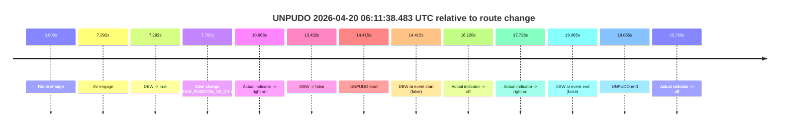
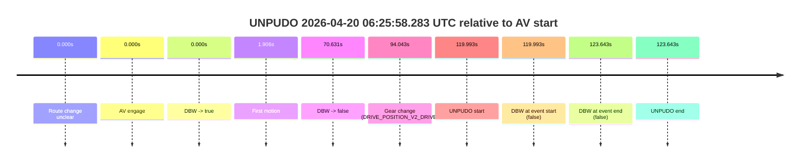
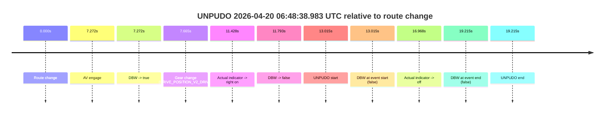
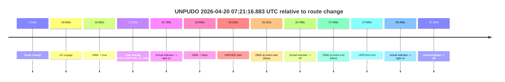

# Run Report: fme20031/2026-04-20--06-05-31--gen2-av-1a5a97bc-616d-489d-9c58-1fdeb3320708

| Field | Value |
|---|---|
| Run ID | `fme20031/2026-04-20--06-05-31--gen2-av-1a5a97bc-616d-489d-9c58-1fdeb3320708` |
| Date | `2026-04-20` |
| Model(s) | `pink-manta-ray-smooth` |
| Author | `guy.geva` |
| Event count | `5` |

## unpudo 2026-04-20 06:11:38.483 UTC

| Field | Value |
|---|---|
| Model | `pink-manta-ray-smooth` |
| Author | `guy.geva` |
| Run ID | `fme20031/2026-04-20--06-05-31--gen2-av-1a5a97bc-616d-489d-9c58-1fdeb3320708` |
| Date | `2026-04-20` |
| Time (UTC) | `06:11:38.483` |
| Event type | `unpudo` |
| Disengagement type | `none observed` |
| Route change | `found` |
| Console | [run](https://console.sso.wayve.ai/run/fme20031/2026-04-20--06-05-31--gen2-av-1a5a97bc-616d-489d-9c58-1fdeb3320708?id=&time-unixus=1776665498483290) |
| Foxglove | [segment](https://app.foxglove.dev/wayve-on-prem/p/prj_0dX18KZdVHg1fmmI/view?ds=foxglove-stream&ds.deviceName=fme20031&ds.start=2026-04-20T06%3A11%3A14.068451Z&ds.end=2026-04-20T06%3A11%3A53.133308Z&layoutId=lay_0e7VD4WIKDQGU73Y&time=2026-04-20T06%3A11%3A38.483290Z) |

### Event card: fail

- Fail: the credited unpudo does not stay AV-owned. The event window starts with DBW false, and the maneuver outcome lands outside a clean AV-owned segment.

| Event | Time (UTC) | Delta from route change |
|---|---:|---:|
| Route change | 2026-04-20 06:11:24.068 | `0.000s` |
| AV engage | 2026-04-20 06:11:31.360 | `7.292s` |
| DBW -> true | 2026-04-20 06:11:31.360 | `7.292s` |
| Gear change (DRIVE_POSITION_V2_DRIVE) | 2026-04-20 06:11:31.833 | `7.765s` |
| Actual indicator -> right on | 2026-04-20 06:11:35.036 | `10.968s` |
| DBW -> false | 2026-04-20 06:11:37.520 | `13.452s` |
| UNPUDO start | 2026-04-20 06:11:38.483 | `14.415s` |
| DBW at event start (false) | 2026-04-20 06:11:38.483 | `14.415s` |
| Actual indicator -> off | 2026-04-20 06:11:40.196 | `16.128s` |
| Actual indicator -> right on | 2026-04-20 06:11:41.796 | `17.728s` |
| DBW at event end (false) | 2026-04-20 06:11:43.133 | `19.065s` |
| UNPUDO end | 2026-04-20 06:11:43.133 | `19.065s` |
| Actual indicator -> off | 2026-04-20 06:11:49.857 | `25.789s` |

| Metric | Value |
|---|---|
| Outcome | `fail` |
| Effective failure type | `not_av_owned` |
| Route change status | `found` |
| DBW at event start | `false` |
| DBW at event end | `false` |
| Predicted gear at AV start | `DRIVE_POSITION_V2_DRIVE` |
| Actual gear at AV start | `DRIVE_POSITION_V2_PARK` |
| Predicted gear at event start | `DRIVE_POSITION_V2_DRIVE` |
| Actual gear at event start | `DRIVE_POSITION_V2_DRIVE` |
| Planned indicator direction | `INDICATORS_STATE_V2_RIGHT_ON` |
| Controller indicator direction | `INDICATORS_STATE_V2_RIGHT_ON` |
| Actual indicator direction | `INDICATORS_STATE_V2_RIGHT_ON` |
| Actual indicator at maneuver end | `INDICATORS_STATE_V2_RIGHT_ON` |
| Driver accel help in AV | `false` |
| Driver accel help timestamp | `n/a` |
| Max accel pedal pct in AV | `0.0%` |
| Max brake pedal pct in AV | `10.4%` |
| Max speed mps in AV | `0.000` |
| Success timing baseline | `route change` |
| Route -> AV | `7.292s` |
| AV -> event start | `7.123s` |
| AV -> first motion | `n/a` |
| Success baseline -> event start | `14.415s` |
| Success baseline -> first motion | `n/a` |
| AV duration before disengagement | `6.160s` |
| Trajectory waypoint count | `37` |
| Driving-plan step count | `11` |

The scored portion starts from the AV-owned window, not from the pre-AV setup. Route-change search in the stopped pre-event segment was `found`, with the baseline therefore set to route change. At the event anchor the model predicts `DRIVE_POSITION_V2_DRIVE` and the actual gear is `DRIVE_POSITION_V2_DRIVE`. The effective model outcome is `fail` because `not_av_owned.`

### Resolution

| Field | Value |
|---|---|
| Final outcome | `fail` |
| Do we agree with this label? | `yes` |
| Source disengagement type | `none observed` |
| Resolved effective failure type | `not_av_owned` |
| Confidence | `high` |

## unpudo 2026-04-20 06:19:48.133 UTC

| Field | Value |
|---|---|
| Model | `pink-manta-ray-smooth` |
| Author | `guy.geva` |
| Run ID | `fme20031/2026-04-20--06-05-31--gen2-av-1a5a97bc-616d-489d-9c58-1fdeb3320708` |
| Date | `2026-04-20` |
| Time (UTC) | `06:19:48.133` |
| Event type | `unpudo` |
| Disengagement type | `none observed` |
| Route change | `found` |
| Console | [run](https://console.sso.wayve.ai/run/fme20031/2026-04-20--06-05-31--gen2-av-1a5a97bc-616d-489d-9c58-1fdeb3320708?id=&time-unixus=1776665988133302) |
| Foxglove | [segment](https://app.foxglove.dev/wayve-on-prem/p/prj_0dX18KZdVHg1fmmI/view?ds=foxglove-stream&ds.deviceName=fme20031&ds.start=2026-04-20T06%3A19%3A23.618257Z&ds.end=2026-04-20T06%3A20%3A02.233307Z&layoutId=lay_0e7VD4WIKDQGU73Y&time=2026-04-20T06%3A19%3A48.133302Z) |

### Event card: fail

- Fail: the credited unpudo does not stay AV-owned. The event window starts with DBW false, and the maneuver outcome lands outside a clean AV-owned segment.

| Event | Time (UTC) | Delta from route change |
|---|---:|---:|
| Route change | 2026-04-20 06:19:33.618 | `0.000s` |
| AV engage | 2026-04-20 06:19:38.280 | `4.662s` |
| DBW -> true | 2026-04-20 06:19:38.280 | `4.662s` |
| Gear change (DRIVE_POSITION_V2_DRIVE) | 2026-04-20 06:19:38.783 | `5.165s` |
| Actual indicator -> right on | 2026-04-20 06:19:42.816 | `9.198s` |
| DBW -> false | 2026-04-20 06:19:47.541 | `13.923s` |
| UNPUDO start | 2026-04-20 06:19:48.133 | `14.515s` |
| DBW at event start (false) | 2026-04-20 06:19:48.133 | `14.515s` |
| Actual indicator -> off | 2026-04-20 06:19:49.996 | `16.378s` |
| DBW at event end (false) | 2026-04-20 06:19:52.233 | `18.615s` |
| UNPUDO end | 2026-04-20 06:19:52.233 | `18.615s` |

| Metric | Value |
|---|---|
| Outcome | `fail` |
| Effective failure type | `not_av_owned` |
| Route change status | `found` |
| DBW at event start | `false` |
| DBW at event end | `false` |
| Predicted gear at AV start | `DRIVE_POSITION_V2_DRIVE` |
| Actual gear at AV start | `DRIVE_POSITION_V2_PARK` |
| Predicted gear at event start | `DRIVE_POSITION_V2_DRIVE` |
| Actual gear at event start | `DRIVE_POSITION_V2_DRIVE` |
| Planned indicator direction | `INDICATORS_STATE_V2_LEFT_ON` |
| Controller indicator direction | `INDICATORS_STATE_V2_LEFT_ON` |
| Actual indicator direction | `INDICATORS_STATE_V2_RIGHT_ON` |
| Actual indicator at maneuver end | `INDICATORS_STATE_V2_OFF` |
| Driver accel help in AV | `false` |
| Driver accel help timestamp | `n/a` |
| Max accel pedal pct in AV | `0.0%` |
| Max brake pedal pct in AV | `8.0%` |
| Max speed mps in AV | `0.000` |
| Success timing baseline | `route change` |
| Route -> AV | `4.662s` |
| AV -> event start | `9.853s` |
| AV -> first motion | `n/a` |
| Success baseline -> event start | `14.515s` |
| Success baseline -> first motion | `n/a` |
| AV duration before disengagement | `9.261s` |
| Trajectory waypoint count | `36` |
| Driving-plan step count | `11` |

The scored portion starts from the AV-owned window, not from the pre-AV setup. Route-change search in the stopped pre-event segment was `found`, with the baseline therefore set to route change. At the event anchor the model predicts `DRIVE_POSITION_V2_DRIVE` and the actual gear is `DRIVE_POSITION_V2_DRIVE`. The effective model outcome is `fail` because `not_av_owned.`

### Resolution

| Field | Value |
|---|---|
| Final outcome | `fail` |
| Do we agree with this label? | `yes` |
| Source disengagement type | `none observed` |
| Resolved effective failure type | `not_av_owned` |
| Confidence | `high` |

## unpudo 2026-04-20 06:25:58.283 UTC

| Field | Value |
|---|---|
| Model | `pink-manta-ray-smooth` |
| Author | `guy.geva` |
| Run ID | `fme20031/2026-04-20--06-05-31--gen2-av-1a5a97bc-616d-489d-9c58-1fdeb3320708` |
| Date | `2026-04-20` |
| Time (UTC) | `06:25:58.283` |
| Event type | `unpudo` |
| Disengagement type | `none observed` |
| Route change | `unclear` |
| Console | [run](https://console.sso.wayve.ai/run/fme20031/2026-04-20--06-05-31--gen2-av-1a5a97bc-616d-489d-9c58-1fdeb3320708?id=&time-unixus=1776666358283301) |
| Foxglove | [segment](https://app.foxglove.dev/wayve-on-prem/p/prj_0dX18KZdVHg1fmmI/view?ds=foxglove-stream&ds.deviceName=fme20031&ds.start=2026-04-20T06%3A23%3A48.290317Z&ds.end=2026-04-20T06%3A26%3A11.933306Z&layoutId=lay_0e7VD4WIKDQGU73Y&time=2026-04-20T06%3A25%3A58.283301Z) |

### Event card: fail

- Fail: the credited unpudo does not stay AV-owned. The event window starts with DBW false, and the maneuver outcome lands outside a clean AV-owned segment.

| Event | Time (UTC) | Delta from AV start |
|---|---:|---:|
| Route change unclear | 2026-04-20 06:23:58.290 | `0.000s` |
| AV engage | 2026-04-20 06:23:58.290 | `0.000s` |
| DBW -> true | 2026-04-20 06:23:58.290 | `0.000s` |
| First motion | 2026-04-20 06:24:00.196 | `1.906s` |
| DBW -> false | 2026-04-20 06:25:08.921 | `70.631s` |
| Gear change (DRIVE_POSITION_V2_DRIVE) | 2026-04-20 06:25:32.333 | `94.043s` |
| UNPUDO start | 2026-04-20 06:25:58.283 | `119.993s` |
| DBW at event start (false) | 2026-04-20 06:25:58.283 | `119.993s` |
| DBW at event end (false) | 2026-04-20 06:26:01.933 | `123.643s` |
| UNPUDO end | 2026-04-20 06:26:01.933 | `123.643s` |

| Metric | Value |
|---|---|
| Outcome | `fail` |
| Effective failure type | `not_av_owned` |
| Route change status | `unclear` |
| DBW at event start | `false` |
| DBW at event end | `false` |
| Predicted gear at AV start | `DRIVE_POSITION_V2_DRIVE` |
| Actual gear at AV start | `DRIVE_POSITION_V2_DRIVE` |
| Predicted gear at event start | `DRIVE_POSITION_V2_DRIVE` |
| Actual gear at event start | `DRIVE_POSITION_V2_DRIVE` |
| Planned indicator direction | `INDICATORS_STATE_V2_OFF` |
| Controller indicator direction | `INDICATORS_STATE_V2_OFF` |
| Actual indicator direction | `INDICATORS_STATE_V2_OFF` |
| Actual indicator at maneuver end | `INDICATORS_STATE_V2_OFF` |
| Driver accel help in AV | `false` |
| Driver accel help timestamp | `n/a` |
| Max accel pedal pct in AV | `0.0%` |
| Max brake pedal pct in AV | `8.0%` |
| Max speed mps in AV | `8.061` |
| Success timing baseline | `AV start` |
| Route -> AV | `n/a` |
| AV -> event start | `119.993s` |
| AV -> first motion | `1.906s` |
| Success baseline -> event start | `119.993s` |
| Success baseline -> first motion | `1.906s` |
| AV duration before disengagement | `70.631s` |
| Trajectory waypoint count | `37` |
| Driving-plan step count | `11` |

The scored portion starts from the AV-owned window, not from the pre-AV setup. Route-change search in the stopped pre-event segment was `unclear`, with the baseline therefore set to AV start. At the event anchor the model predicts `DRIVE_POSITION_V2_DRIVE` and the actual gear is `DRIVE_POSITION_V2_DRIVE`. The effective model outcome is `fail` because `not_av_owned.`

### Resolution

| Field | Value |
|---|---|
| Final outcome | `fail` |
| Do we agree with this label? | `yes` |
| Source disengagement type | `none observed` |
| Resolved effective failure type | `not_av_owned` |
| Confidence | `medium` |

## unpudo 2026-04-20 06:48:38.983 UTC

| Field | Value |
|---|---|
| Model | `pink-manta-ray-smooth` |
| Author | `guy.geva` |
| Run ID | `fme20031/2026-04-20--06-05-31--gen2-av-1a5a97bc-616d-489d-9c58-1fdeb3320708` |
| Date | `2026-04-20` |
| Time (UTC) | `06:48:38.983` |
| Event type | `unpudo` |
| Disengagement type | `none observed` |
| Route change | `found` |
| Console | [run](https://console.sso.wayve.ai/run/fme20031/2026-04-20--06-05-31--gen2-av-1a5a97bc-616d-489d-9c58-1fdeb3320708?id=&time-unixus=1776667718983310) |
| Foxglove | [segment](https://app.foxglove.dev/wayve-on-prem/p/prj_0dX18KZdVHg1fmmI/view?ds=foxglove-stream&ds.deviceName=fme20031&ds.start=2026-04-20T06%3A48%3A15.968285Z&ds.end=2026-04-20T06%3A48%3A55.183314Z&layoutId=lay_0e7VD4WIKDQGU73Y&time=2026-04-20T06%3A48%3A38.983310Z) |

### Event card: fail

- Fail: the credited unpudo does not stay AV-owned. The event window starts with DBW false, and the maneuver outcome lands outside a clean AV-owned segment.

| Event | Time (UTC) | Delta from route change |
|---|---:|---:|
| Route change | 2026-04-20 06:48:25.968 | `0.000s` |
| AV engage | 2026-04-20 06:48:33.240 | `7.272s` |
| DBW -> true | 2026-04-20 06:48:33.240 | `7.272s` |
| Gear change (DRIVE_POSITION_V2_DRIVE) | 2026-04-20 06:48:33.633 | `7.665s` |
| Actual indicator -> right on | 2026-04-20 06:48:37.396 | `11.428s` |
| DBW -> false | 2026-04-20 06:48:37.761 | `11.793s` |
| UNPUDO start | 2026-04-20 06:48:38.983 | `13.015s` |
| DBW at event start (false) | 2026-04-20 06:48:38.983 | `13.015s` |
| Actual indicator -> off | 2026-04-20 06:48:42.936 | `16.968s` |
| DBW at event end (false) | 2026-04-20 06:48:45.183 | `19.215s` |
| UNPUDO end | 2026-04-20 06:48:45.183 | `19.215s` |

| Metric | Value |
|---|---|
| Outcome | `fail` |
| Effective failure type | `not_av_owned` |
| Route change status | `found` |
| DBW at event start | `false` |
| DBW at event end | `false` |
| Predicted gear at AV start | `DRIVE_POSITION_V2_DRIVE` |
| Actual gear at AV start | `DRIVE_POSITION_V2_PARK` |
| Predicted gear at event start | `DRIVE_POSITION_V2_DRIVE` |
| Actual gear at event start | `DRIVE_POSITION_V2_DRIVE` |
| Planned indicator direction | `INDICATORS_STATE_V2_OFF` |
| Controller indicator direction | `INDICATORS_STATE_V2_OFF` |
| Actual indicator direction | `INDICATORS_STATE_V2_RIGHT_ON` |
| Actual indicator at maneuver end | `INDICATORS_STATE_V2_OFF` |
| Driver accel help in AV | `false` |
| Driver accel help timestamp | `n/a` |
| Max accel pedal pct in AV | `0.0%` |
| Max brake pedal pct in AV | `11.0%` |
| Max speed mps in AV | `0.000` |
| Success timing baseline | `route change` |
| Route -> AV | `7.272s` |
| AV -> event start | `5.743s` |
| AV -> first motion | `n/a` |
| Success baseline -> event start | `13.015s` |
| Success baseline -> first motion | `n/a` |
| AV duration before disengagement | `4.521s` |
| Trajectory waypoint count | `37` |
| Driving-plan step count | `11` |

The scored portion starts from the AV-owned window, not from the pre-AV setup. Route-change search in the stopped pre-event segment was `found`, with the baseline therefore set to route change. At the event anchor the model predicts `DRIVE_POSITION_V2_DRIVE` and the actual gear is `DRIVE_POSITION_V2_DRIVE`. The effective model outcome is `fail` because `not_av_owned.`

### Resolution

| Field | Value |
|---|---|
| Final outcome | `fail` |
| Do we agree with this label? | `yes` |
| Source disengagement type | `none observed` |
| Resolved effective failure type | `not_av_owned` |
| Confidence | `high` |

## unpudo 2026-04-20 07:21:16.883 UTC

| Field | Value |
|---|---|
| Model | `pink-manta-ray-smooth` |
| Author | `guy.geva` |
| Run ID | `fme20031/2026-04-20--06-05-31--gen2-av-1a5a97bc-616d-489d-9c58-1fdeb3320708` |
| Date | `2026-04-20` |
| Time (UTC) | `07:21:16.883` |
| Event type | `unpudo` |
| Disengagement type | `none observed` |
| Route change | `found` |
| Console | [run](https://console.sso.wayve.ai/run/fme20031/2026-04-20--06-05-31--gen2-av-1a5a97bc-616d-489d-9c58-1fdeb3320708?id=&time-unixus=1776669676883309) |
| Foxglove | [segment](https://app.foxglove.dev/wayve-on-prem/p/prj_0dX18KZdVHg1fmmI/view?ds=foxglove-stream&ds.deviceName=fme20031&ds.start=2026-04-20T07%3A20%3A43.568287Z&ds.end=2026-04-20T07%3A21%3A30.633300Z&layoutId=lay_0e7VD4WIKDQGU73Y&time=2026-04-20T07%3A21%3A16.883309Z) |

### Event card: fail

- Fail: the credited unpudo does not stay AV-owned. The event window starts with DBW false, and the maneuver outcome lands outside a clean AV-owned segment.

| Event | Time (UTC) | Delta from route change |
|---|---:|---:|
| Route change | 2026-04-20 07:20:53.568 | `0.000s` |
| AV engage | 2026-04-20 07:21:10.260 | `16.692s` |
| DBW -> true | 2026-04-20 07:21:10.260 | `16.692s` |
| Gear change (DRIVE_POSITION_V2_DRIVE) | 2026-04-20 07:21:10.633 | `17.065s` |
| Actual indicator -> right on | 2026-04-20 07:21:15.356 | `21.789s` |
| DBW -> false | 2026-04-20 07:21:16.162 | `22.594s` |
| UNPUDO start | 2026-04-20 07:21:16.883 | `23.315s` |
| DBW at event start (false) | 2026-04-20 07:21:16.883 | `23.315s` |
| Actual indicator -> off | 2026-04-20 07:21:18.356 | `24.788s` |
| DBW at event end (false) | 2026-04-20 07:21:20.633 | `27.065s` |
| UNPUDO end | 2026-04-20 07:21:20.633 | `27.065s` |
| Actual indicator -> right on | 2026-04-20 07:21:28.976 | `35.408s` |
| Actual indicator -> off | 2026-04-20 07:21:30.876 | `37.308s` |

| Metric | Value |
|---|---|
| Outcome | `fail` |
| Effective failure type | `not_av_owned` |
| Route change status | `found` |
| DBW at event start | `false` |
| DBW at event end | `false` |
| Predicted gear at AV start | `DRIVE_POSITION_V2_DRIVE` |
| Actual gear at AV start | `DRIVE_POSITION_V2_PARK` |
| Predicted gear at event start | `DRIVE_POSITION_V2_DRIVE` |
| Actual gear at event start | `DRIVE_POSITION_V2_DRIVE` |
| Planned indicator direction | `INDICATORS_STATE_V2_OFF` |
| Controller indicator direction | `INDICATORS_STATE_V2_OFF` |
| Actual indicator direction | `INDICATORS_STATE_V2_RIGHT_ON` |
| Actual indicator at maneuver end | `INDICATORS_STATE_V2_OFF` |
| Driver accel help in AV | `false` |
| Driver accel help timestamp | `n/a` |
| Max accel pedal pct in AV | `0.0%` |
| Max brake pedal pct in AV | `8.0%` |
| Max speed mps in AV | `0.000` |
| Success timing baseline | `route change` |
| Route -> AV | `16.692s` |
| AV -> event start | `6.623s` |
| AV -> first motion | `n/a` |
| Success baseline -> event start | `23.315s` |
| Success baseline -> first motion | `n/a` |
| AV duration before disengagement | `5.902s` |
| Trajectory waypoint count | `37` |
| Driving-plan step count | `11` |

The scored portion starts from the AV-owned window, not from the pre-AV setup. Route-change search in the stopped pre-event segment was `found`, with the baseline therefore set to route change. At the event anchor the model predicts `DRIVE_POSITION_V2_DRIVE` and the actual gear is `DRIVE_POSITION_V2_DRIVE`. The effective model outcome is `fail` because `not_av_owned.`

### Resolution

| Field | Value |
|---|---|
| Final outcome | `fail` |
| Do we agree with this label? | `yes` |
| Source disengagement type | `none observed` |
| Resolved effective failure type | `not_av_owned` |
| Confidence | `high` |
