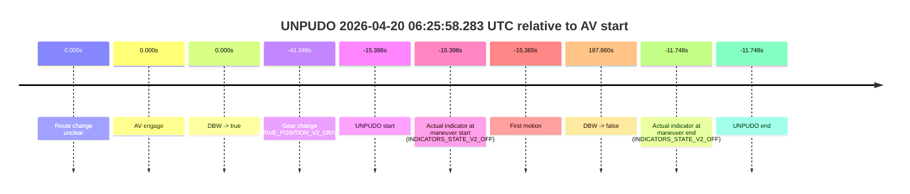
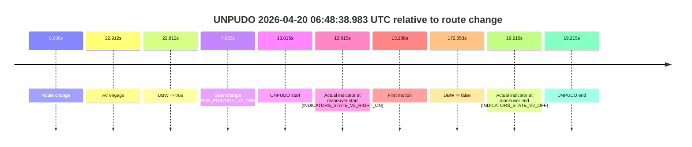
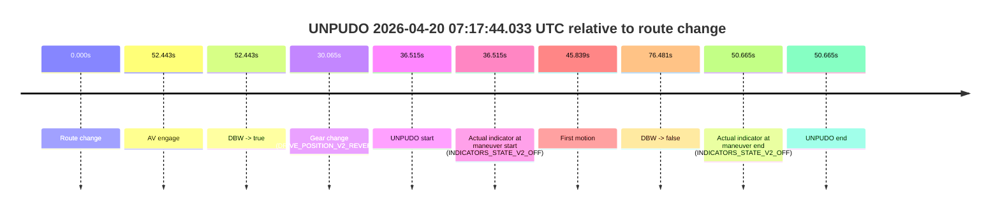
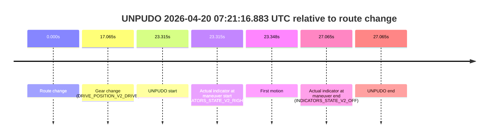
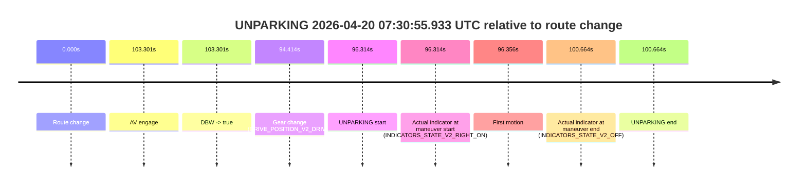

# Run Report: fme20031/2026-04-20--06-05-31--gen2-av-1a5a97bc-616d-489d-9c58-1fdeb3320708

| Field | Value |
|---|---|
| Run ID | `fme20031/2026-04-20--06-05-31--gen2-av-1a5a97bc-616d-489d-9c58-1fdeb3320708` |
| Date | `2026-04-20` |
| Model(s) | `pink-manta-ray-smooth` |
| Author | `guy.geva` |
| Event count | `7` |

## unpudo 2026-04-20 06:11:38.483 UTC

| Field | Value |
|---|---|
| Model | `pink-manta-ray-smooth` |
| Author | `guy.geva` |
| Run ID | `fme20031/2026-04-20--06-05-31--gen2-av-1a5a97bc-616d-489d-9c58-1fdeb3320708` |
| Date | `2026-04-20` |
| Time (UTC) | `06:11:38.483` |
| Event type | `unpudo` |
| Disengagement type | `none observed` |
| Route change | `found` |
| Console | [run](https://console.sso.wayve.ai/run/fme20031/2026-04-20--06-05-31--gen2-av-1a5a97bc-616d-489d-9c58-1fdeb3320708?id=&time-unixus=1776665498483290) |
| Foxglove | [segment](https://app.foxglove.dev/wayve-on-prem/p/prj_0dX18KZdVHg1fmmI/view?ds=foxglove-stream&ds.deviceName=fme20031&ds.start=2026-04-20T06%3A11%3A14.068451Z&ds.end=2026-04-20T06%3A12%3A16.881209Z&layoutId=lay_0e7VD4WIKDQGU73Y&time=2026-04-20T06%3A11%3A38.483290Z) |

### Event card: accidental

- Accidental: AV ownership is present for less than `2s`, so this is treated as an accidental brush with the maneuver rather than a meaningful model attempt.

| Event | Time (UTC) | Delta from route change |
|---|---:|---:|
| Route change | 2026-04-20 06:11:24.068 | `0.000s` |
| AV engage | 2026-04-20 06:11:58.220 | `34.152s` |
| DBW -> true | 2026-04-20 06:11:58.220 | `34.152s` |
| Gear change (DRIVE_POSITION_V2_DRIVE) | 2026-04-20 06:11:31.833 | `7.765s` |
| UNPUDO start | 2026-04-20 06:11:38.483 | `14.415s` |
| Actual indicator at maneuver start (INDICATORS_STATE_V2_RIGHT_ON) | 2026-04-20 06:11:38.483 | `14.415s` |
| First motion | 2026-04-20 06:11:38.496 | `14.428s` |
| DBW -> false | 2026-04-20 06:12:06.881 | `42.813s` |
| Actual indicator at maneuver end (INDICATORS_STATE_V2_RIGHT_ON) | 2026-04-20 06:11:43.133 | `19.065s` |
| UNPUDO end | 2026-04-20 06:11:43.133 | `19.065s` |

| Metric | Value |
|---|---|
| Outcome | `accidental` |
| Effective failure type | `none` |
| Route change status | `found` |
| DBW at event start | `false` |
| DBW at event end | `false` |
| Predicted gear at AV start | `DRIVE_POSITION_V2_DRIVE` |
| Actual gear at AV start | `DRIVE_POSITION_V2_DRIVE` |
| Predicted gear at event start | `DRIVE_POSITION_V2_DRIVE` |
| Actual gear at event start | `DRIVE_POSITION_V2_DRIVE` |
| Planned indicator direction | `INDICATORS_STATE_V2_RIGHT_ON` |
| Controller indicator direction | `INDICATORS_STATE_V2_RIGHT_ON` |
| Actual indicator direction | `INDICATORS_STATE_V2_RIGHT_ON` |
| Actual indicator at maneuver end | `INDICATORS_STATE_V2_RIGHT_ON` |
| Driver accel help in AV | `false` |
| Driver accel help timestamp | `n/a` |
| Max accel pedal pct in AV | `0.0%` |
| Max brake pedal pct in AV | `0.0%` |
| Max speed mps in AV | `0.000` |
| Route -> AV | `34.152s` |
| AV -> event start | `-19.737s` |
| AV -> first motion | `-19.724s` |
| AV duration before disengagement | `8.661s` |
| Trajectory waypoint count | `37` |
| Driving-plan step count | `11` |

The scored portion starts from the AV-owned window, not from the pre-AV setup. Route-change search in the stopped pre-event segment was `found`, with the baseline therefore set to route change. At the event anchor the model predicts `DRIVE_POSITION_V2_DRIVE` and the actual gear is `DRIVE_POSITION_V2_DRIVE`. The effective model outcome is `accidental` because `the AV-owned portion is shorter than 2s`.

### Resolution

| Field | Value |
|---|---|
| Final outcome | `accidental` |
| Do we agree with this label? | `yes` |
| Source disengagement type | `none observed` |
| Resolved effective failure type | `none` |
| Confidence | `high` |

## unpudo 2026-04-20 06:19:48.133 UTC

| Field | Value |
|---|---|
| Model | `pink-manta-ray-smooth` |
| Author | `guy.geva` |
| Run ID | `fme20031/2026-04-20--06-05-31--gen2-av-1a5a97bc-616d-489d-9c58-1fdeb3320708` |
| Date | `2026-04-20` |
| Time (UTC) | `06:19:48.133` |
| Event type | `unpudo` |
| Disengagement type | `none observed` |
| Route change | `found` |
| Console | [run](https://console.sso.wayve.ai/run/fme20031/2026-04-20--06-05-31--gen2-av-1a5a97bc-616d-489d-9c58-1fdeb3320708?id=&time-unixus=1776665988133302) |
| Foxglove | [segment](https://app.foxglove.dev/wayve-on-prem/p/prj_0dX18KZdVHg1fmmI/view?ds=foxglove-stream&ds.deviceName=fme20031&ds.start=2026-04-20T06%3A19%3A23.618257Z&ds.end=2026-04-20T06%3A21%3A29.580087Z&layoutId=lay_0e7VD4WIKDQGU73Y&time=2026-04-20T06%3A19%3A48.133302Z) |

### Event card: accidental

- Accidental: AV ownership is present for less than `2s`, so this is treated as an accidental brush with the maneuver rather than a meaningful model attempt.

| Event | Time (UTC) | Delta from route change |
|---|---:|---:|
| Route change | 2026-04-20 06:19:33.618 | `0.000s` |
| AV engage | 2026-04-20 06:19:55.499 | `21.882s` |
| DBW -> true | 2026-04-20 06:19:55.499 | `21.882s` |
| Gear change (DRIVE_POSITION_V2_DRIVE) | 2026-04-20 06:19:38.783 | `5.165s` |
| UNPUDO start | 2026-04-20 06:19:48.133 | `14.515s` |
| Actual indicator at maneuver start (INDICATORS_STATE_V2_RIGHT_ON) | 2026-04-20 06:19:48.133 | `14.515s` |
| First motion | 2026-04-20 06:19:48.156 | `14.538s` |
| DBW -> false | 2026-04-20 06:21:19.580 | `105.962s` |
| Actual indicator at maneuver end (INDICATORS_STATE_V2_OFF) | 2026-04-20 06:19:52.233 | `18.615s` |
| UNPUDO end | 2026-04-20 06:19:52.233 | `18.615s` |

| Metric | Value |
|---|---|
| Outcome | `accidental` |
| Effective failure type | `none` |
| Route change status | `found` |
| DBW at event start | `false` |
| DBW at event end | `false` |
| Predicted gear at AV start | `DRIVE_POSITION_V2_DRIVE` |
| Actual gear at AV start | `DRIVE_POSITION_V2_DRIVE` |
| Predicted gear at event start | `DRIVE_POSITION_V2_DRIVE` |
| Actual gear at event start | `DRIVE_POSITION_V2_DRIVE` |
| Planned indicator direction | `INDICATORS_STATE_V2_LEFT_ON` |
| Controller indicator direction | `INDICATORS_STATE_V2_LEFT_ON` |
| Actual indicator direction | `INDICATORS_STATE_V2_RIGHT_ON` |
| Actual indicator at maneuver end | `INDICATORS_STATE_V2_OFF` |
| Driver accel help in AV | `false` |
| Driver accel help timestamp | `n/a` |
| Max accel pedal pct in AV | `0.0%` |
| Max brake pedal pct in AV | `0.0%` |
| Max speed mps in AV | `0.000` |
| Route -> AV | `21.882s` |
| AV -> event start | `-7.367s` |
| AV -> first motion | `-7.344s` |
| AV duration before disengagement | `84.080s` |
| Trajectory waypoint count | `36` |
| Driving-plan step count | `11` |

The scored portion starts from the AV-owned window, not from the pre-AV setup. Route-change search in the stopped pre-event segment was `found`, with the baseline therefore set to route change. At the event anchor the model predicts `DRIVE_POSITION_V2_DRIVE` and the actual gear is `DRIVE_POSITION_V2_DRIVE`. The effective model outcome is `accidental` because `the AV-owned portion is shorter than 2s`.

### Resolution

| Field | Value |
|---|---|
| Final outcome | `accidental` |
| Do we agree with this label? | `yes` |
| Source disengagement type | `none observed` |
| Resolved effective failure type | `none` |
| Confidence | `high` |

## unpudo 2026-04-20 06:25:58.283 UTC

| Field | Value |
|---|---|
| Model | `pink-manta-ray-smooth` |
| Author | `guy.geva` |
| Run ID | `fme20031/2026-04-20--06-05-31--gen2-av-1a5a97bc-616d-489d-9c58-1fdeb3320708` |
| Date | `2026-04-20` |
| Time (UTC) | `06:25:58.283` |
| Event type | `unpudo` |
| Disengagement type | `none observed` |
| Route change | `unclear` |
| Console | [run](https://console.sso.wayve.ai/run/fme20031/2026-04-20--06-05-31--gen2-av-1a5a97bc-616d-489d-9c58-1fdeb3320708?id=&time-unixus=1776666358283301) |
| Foxglove | [segment](https://app.foxglove.dev/wayve-on-prem/p/prj_0dX18KZdVHg1fmmI/view?ds=foxglove-stream&ds.deviceName=fme20031&ds.start=2026-04-20T06%3A25%3A22.333293Z&ds.end=2026-04-20T06%3A29%3A31.541200Z&layoutId=lay_0e7VD4WIKDQGU73Y&time=2026-04-20T06%3A25%3A58.283301Z) |

### Event card: accidental

- Accidental: AV ownership is present for less than `2s`, so this is treated as an accidental brush with the maneuver rather than a meaningful model attempt.

| Event | Time (UTC) | Delta from AV start |
|---|---:|---:|
| Route change unclear | 2026-04-20 06:26:13.681 | `0.000s` |
| AV engage | 2026-04-20 06:26:13.681 | `0.000s` |
| DBW -> true | 2026-04-20 06:26:13.681 | `0.000s` |
| Gear change (DRIVE_POSITION_V2_DRIVE) | 2026-04-20 06:25:32.333 | `-41.348s` |
| UNPUDO start | 2026-04-20 06:25:58.283 | `-15.398s` |
| Actual indicator at maneuver start (INDICATORS_STATE_V2_OFF) | 2026-04-20 06:25:58.283 | `-15.398s` |
| First motion | 2026-04-20 06:25:58.316 | `-15.365s` |
| DBW -> false | 2026-04-20 06:29:21.541 | `187.860s` |
| Actual indicator at maneuver end (INDICATORS_STATE_V2_OFF) | 2026-04-20 06:26:01.933 | `-11.748s` |
| UNPUDO end | 2026-04-20 06:26:01.933 | `-11.748s` |

| Metric | Value |
|---|---|
| Outcome | `accidental` |
| Effective failure type | `none` |
| Route change status | `unclear` |
| DBW at event start | `false` |
| DBW at event end | `false` |
| Predicted gear at AV start | `DRIVE_POSITION_V2_DRIVE` |
| Actual gear at AV start | `DRIVE_POSITION_V2_DRIVE` |
| Predicted gear at event start | `DRIVE_POSITION_V2_DRIVE` |
| Actual gear at event start | `DRIVE_POSITION_V2_DRIVE` |
| Planned indicator direction | `INDICATORS_STATE_V2_OFF` |
| Controller indicator direction | `INDICATORS_STATE_V2_OFF` |
| Actual indicator direction | `INDICATORS_STATE_V2_OFF` |
| Actual indicator at maneuver end | `INDICATORS_STATE_V2_OFF` |
| Driver accel help in AV | `false` |
| Driver accel help timestamp | `n/a` |
| Max accel pedal pct in AV | `0.0%` |
| Max brake pedal pct in AV | `0.0%` |
| Max speed mps in AV | `0.000` |
| Route -> AV | `n/a` |
| AV -> event start | `-15.398s` |
| AV -> first motion | `-15.365s` |
| AV duration before disengagement | `187.860s` |
| Trajectory waypoint count | `37` |
| Driving-plan step count | `11` |

The scored portion starts from the AV-owned window, not from the pre-AV setup. Route-change search in the stopped pre-event segment was `unclear`, with the baseline therefore set to AV start. At the event anchor the model predicts `DRIVE_POSITION_V2_DRIVE` and the actual gear is `DRIVE_POSITION_V2_DRIVE`. The effective model outcome is `accidental` because `the AV-owned portion is shorter than 2s`.

### Resolution

| Field | Value |
|---|---|
| Final outcome | `accidental` |
| Do we agree with this label? | `yes` |
| Source disengagement type | `none observed` |
| Resolved effective failure type | `none` |
| Confidence | `medium` |

## unpudo 2026-04-20 06:48:38.983 UTC

| Field | Value |
|---|---|
| Model | `pink-manta-ray-smooth` |
| Author | `guy.geva` |
| Run ID | `fme20031/2026-04-20--06-05-31--gen2-av-1a5a97bc-616d-489d-9c58-1fdeb3320708` |
| Date | `2026-04-20` |
| Time (UTC) | `06:48:38.983` |
| Event type | `unpudo` |
| Disengagement type | `none observed` |
| Route change | `found` |
| Console | [run](https://console.sso.wayve.ai/run/fme20031/2026-04-20--06-05-31--gen2-av-1a5a97bc-616d-489d-9c58-1fdeb3320708?id=&time-unixus=1776667718983310) |
| Foxglove | [segment](https://app.foxglove.dev/wayve-on-prem/p/prj_0dX18KZdVHg1fmmI/view?ds=foxglove-stream&ds.deviceName=fme20031&ds.start=2026-04-20T06%3A48%3A15.968285Z&ds.end=2026-04-20T06%3A51%3A28.621205Z&layoutId=lay_0e7VD4WIKDQGU73Y&time=2026-04-20T06%3A48%3A38.983310Z) |

### Event card: accidental

- Accidental: AV ownership is present for less than `2s`, so this is treated as an accidental brush with the maneuver rather than a meaningful model attempt.

| Event | Time (UTC) | Delta from route change |
|---|---:|---:|
| Route change | 2026-04-20 06:48:25.968 | `0.000s` |
| AV engage | 2026-04-20 06:48:48.879 | `22.912s` |
| DBW -> true | 2026-04-20 06:48:48.879 | `22.912s` |
| Gear change (DRIVE_POSITION_V2_DRIVE) | 2026-04-20 06:48:33.633 | `7.665s` |
| UNPUDO start | 2026-04-20 06:48:38.983 | `13.015s` |
| Actual indicator at maneuver start (INDICATORS_STATE_V2_RIGHT_ON) | 2026-04-20 06:48:38.983 | `13.015s` |
| First motion | 2026-04-20 06:48:39.156 | `13.188s` |
| DBW -> false | 2026-04-20 06:51:18.621 | `172.653s` |
| Actual indicator at maneuver end (INDICATORS_STATE_V2_OFF) | 2026-04-20 06:48:45.183 | `19.215s` |
| UNPUDO end | 2026-04-20 06:48:45.183 | `19.215s` |

| Metric | Value |
|---|---|
| Outcome | `accidental` |
| Effective failure type | `none` |
| Route change status | `found` |
| DBW at event start | `false` |
| DBW at event end | `false` |
| Predicted gear at AV start | `DRIVE_POSITION_V2_DRIVE` |
| Actual gear at AV start | `DRIVE_POSITION_V2_DRIVE` |
| Predicted gear at event start | `DRIVE_POSITION_V2_DRIVE` |
| Actual gear at event start | `DRIVE_POSITION_V2_DRIVE` |
| Planned indicator direction | `INDICATORS_STATE_V2_OFF` |
| Controller indicator direction | `INDICATORS_STATE_V2_OFF` |
| Actual indicator direction | `INDICATORS_STATE_V2_RIGHT_ON` |
| Actual indicator at maneuver end | `INDICATORS_STATE_V2_OFF` |
| Driver accel help in AV | `false` |
| Driver accel help timestamp | `n/a` |
| Max accel pedal pct in AV | `0.0%` |
| Max brake pedal pct in AV | `0.0%` |
| Max speed mps in AV | `0.000` |
| Route -> AV | `22.912s` |
| AV -> event start | `-9.897s` |
| AV -> first motion | `-9.724s` |
| AV duration before disengagement | `149.741s` |
| Trajectory waypoint count | `37` |
| Driving-plan step count | `11` |

The scored portion starts from the AV-owned window, not from the pre-AV setup. Route-change search in the stopped pre-event segment was `found`, with the baseline therefore set to route change. At the event anchor the model predicts `DRIVE_POSITION_V2_DRIVE` and the actual gear is `DRIVE_POSITION_V2_DRIVE`. The effective model outcome is `accidental` because `the AV-owned portion is shorter than 2s`.

### Resolution

| Field | Value |
|---|---|
| Final outcome | `accidental` |
| Do we agree with this label? | `yes` |
| Source disengagement type | `none observed` |
| Resolved effective failure type | `none` |
| Confidence | `high` |

## unpudo 2026-04-20 07:17:44.033 UTC

| Field | Value |
|---|---|
| Model | `pink-manta-ray-smooth` |
| Author | `guy.geva` |
| Run ID | `fme20031/2026-04-20--06-05-31--gen2-av-1a5a97bc-616d-489d-9c58-1fdeb3320708` |
| Date | `2026-04-20` |
| Time (UTC) | `07:17:44.033` |
| Event type | `unpudo` |
| Disengagement type | `none observed` |
| Route change | `found` |
| Console | [run](https://console.sso.wayve.ai/run/fme20031/2026-04-20--06-05-31--gen2-av-1a5a97bc-616d-489d-9c58-1fdeb3320708?id=&time-unixus=1776669464033324) |
| Foxglove | [segment](https://app.foxglove.dev/wayve-on-prem/p/prj_0dX18KZdVHg1fmmI/view?ds=foxglove-stream&ds.deviceName=fme20031&ds.start=2026-04-20T07%3A16%3A57.518279Z&ds.end=2026-04-20T07%3A18%3A33.999411Z&layoutId=lay_0e7VD4WIKDQGU73Y&time=2026-04-20T07%3A17%3A44.033324Z) |

### Event card: accidental

- Accidental: AV ownership is present for less than `2s`, so this is treated as an accidental brush with the maneuver rather than a meaningful model attempt.

| Event | Time (UTC) | Delta from route change |
|---|---:|---:|
| Route change | 2026-04-20 07:17:07.518 | `0.000s` |
| AV engage | 2026-04-20 07:17:59.961 | `52.443s` |
| DBW -> true | 2026-04-20 07:17:59.961 | `52.443s` |
| Gear change (DRIVE_POSITION_V2_REVERSE) | 2026-04-20 07:17:37.583 | `30.065s` |
| UNPUDO start | 2026-04-20 07:17:44.033 | `36.515s` |
| Actual indicator at maneuver start (INDICATORS_STATE_V2_OFF) | 2026-04-20 07:17:44.033 | `36.515s` |
| First motion | 2026-04-20 07:17:53.357 | `45.839s` |
| DBW -> false | 2026-04-20 07:18:23.999 | `76.481s` |
| Actual indicator at maneuver end (INDICATORS_STATE_V2_OFF) | 2026-04-20 07:17:58.183 | `50.665s` |
| UNPUDO end | 2026-04-20 07:17:58.183 | `50.665s` |

| Metric | Value |
|---|---|
| Outcome | `accidental` |
| Effective failure type | `none` |
| Route change status | `found` |
| DBW at event start | `false` |
| DBW at event end | `false` |
| Predicted gear at AV start | `DRIVE_POSITION_V2_DRIVE` |
| Actual gear at AV start | `DRIVE_POSITION_V2_DRIVE` |
| Predicted gear at event start | `DRIVE_POSITION_V2_REVERSE` |
| Actual gear at event start | `DRIVE_POSITION_V2_REVERSE` |
| Planned indicator direction | `INDICATORS_STATE_V2_RIGHT_ON` |
| Controller indicator direction | `INDICATORS_STATE_V2_RIGHT_ON` |
| Actual indicator direction | `INDICATORS_STATE_V2_OFF` |
| Actual indicator at maneuver end | `INDICATORS_STATE_V2_OFF` |
| Driver accel help in AV | `false` |
| Driver accel help timestamp | `n/a` |
| Max accel pedal pct in AV | `0.0%` |
| Max brake pedal pct in AV | `0.0%` |
| Max speed mps in AV | `0.000` |
| Route -> AV | `52.443s` |
| AV -> event start | `-15.928s` |
| AV -> first motion | `-6.604s` |
| AV duration before disengagement | `24.038s` |
| Trajectory waypoint count | `36` |
| Driving-plan step count | `11` |

The scored portion starts from the AV-owned window, not from the pre-AV setup. Route-change search in the stopped pre-event segment was `found`, with the baseline therefore set to route change. At the event anchor the model predicts `DRIVE_POSITION_V2_REVERSE` and the actual gear is `DRIVE_POSITION_V2_REVERSE`. The effective model outcome is `accidental` because `the AV-owned portion is shorter than 2s`.

### Resolution

| Field | Value |
|---|---|
| Final outcome | `accidental` |
| Do we agree with this label? | `yes` |
| Source disengagement type | `none observed` |
| Resolved effective failure type | `none` |
| Confidence | `high` |

## unpudo 2026-04-20 07:21:16.883 UTC

| Field | Value |
|---|---|
| Model | `pink-manta-ray-smooth` |
| Author | `guy.geva` |
| Run ID | `fme20031/2026-04-20--06-05-31--gen2-av-1a5a97bc-616d-489d-9c58-1fdeb3320708` |
| Date | `2026-04-20` |
| Time (UTC) | `07:21:16.883` |
| Event type | `unpudo` |
| Disengagement type | `none observed` |
| Route change | `found` |
| Console | [run](https://console.sso.wayve.ai/run/fme20031/2026-04-20--06-05-31--gen2-av-1a5a97bc-616d-489d-9c58-1fdeb3320708?id=&time-unixus=1776669676883309) |
| Foxglove | [segment](https://app.foxglove.dev/wayve-on-prem/p/prj_0dX18KZdVHg1fmmI/view?ds=foxglove-stream&ds.deviceName=fme20031&ds.start=2026-04-20T07%3A20%3A43.568287Z&ds.end=2026-04-20T07%3A21%3A30.633300Z&layoutId=lay_0e7VD4WIKDQGU73Y&time=2026-04-20T07%3A21%3A16.883309Z) |

### Event card: non-av

- Non-AV: the detected unpudo starts outside AV ownership, so it is kept for coverage but excluded from model success / failure scoring.

| Event | Time (UTC) | Delta from route change |
|---|---:|---:|
| Route change | 2026-04-20 07:20:53.568 | `0.000s` |
| Gear change (DRIVE_POSITION_V2_DRIVE) | 2026-04-20 07:21:10.633 | `17.065s` |
| UNPUDO start | 2026-04-20 07:21:16.883 | `23.315s` |
| Actual indicator at maneuver start (INDICATORS_STATE_V2_RIGHT_ON) | 2026-04-20 07:21:16.883 | `23.315s` |
| First motion | 2026-04-20 07:21:16.916 | `23.348s` |
| Actual indicator at maneuver end (INDICATORS_STATE_V2_OFF) | 2026-04-20 07:21:20.633 | `27.065s` |
| UNPUDO end | 2026-04-20 07:21:20.633 | `27.065s` |

| Metric | Value |
|---|---|
| Outcome | `non-av` |
| Effective failure type | `none` |
| Route change status | `found` |
| DBW at event start | `false` |
| DBW at event end | `false` |
| Predicted gear at AV start | `n/a` |
| Actual gear at AV start | `n/a` |
| Predicted gear at event start | `DRIVE_POSITION_V2_DRIVE` |
| Actual gear at event start | `DRIVE_POSITION_V2_DRIVE` |
| Planned indicator direction | `INDICATORS_STATE_V2_OFF` |
| Controller indicator direction | `INDICATORS_STATE_V2_OFF` |
| Actual indicator direction | `INDICATORS_STATE_V2_RIGHT_ON` |
| Actual indicator at maneuver end | `INDICATORS_STATE_V2_OFF` |
| Driver accel help in AV | `false` |
| Driver accel help timestamp | `n/a` |
| Max accel pedal pct in AV | `0.0%` |
| Max brake pedal pct in AV | `0.0%` |
| Max speed mps in AV | `0.000` |
| Route -> AV | `n/a` |
| AV -> event start | `n/a` |
| AV -> first motion | `n/a` |
| AV duration before disengagement | `n/a` |
| Trajectory waypoint count | `37` |
| Driving-plan step count | `11` |

The scored portion starts from the AV-owned window, not from the pre-AV setup. Route-change search in the stopped pre-event segment was `found`, with the baseline therefore set to route change. At the event anchor the model predicts `DRIVE_POSITION_V2_DRIVE` and the actual gear is `DRIVE_POSITION_V2_DRIVE`. The effective model outcome is `non-av` because `the event does not begin in AV ownership`.

### Resolution

| Field | Value |
|---|---|
| Final outcome | `non-av` |
| Do we agree with this label? | `yes` |
| Source disengagement type | `none observed` |
| Resolved effective failure type | `none` |
| Confidence | `high` |

## unparking 2026-04-20 07:30:55.933 UTC

| Field | Value |
|---|---|
| Model | `pink-manta-ray-smooth` |
| Author | `guy.geva` |
| Run ID | `fme20031/2026-04-20--06-05-31--gen2-av-1a5a97bc-616d-489d-9c58-1fdeb3320708` |
| Date | `2026-04-20` |
| Time (UTC) | `07:30:55.933` |
| Event type | `unparking` |
| Disengagement type | `none observed` |
| Route change | `found` |
| Console | [run](https://console.sso.wayve.ai/run/fme20031/2026-04-20--06-05-31--gen2-av-1a5a97bc-616d-489d-9c58-1fdeb3320708?id=&time-unixus=1776670255933299) |
| Foxglove | [segment](https://app.foxglove.dev/wayve-on-prem/p/prj_0dX18KZdVHg1fmmI/view?ds=foxglove-stream&ds.deviceName=fme20031&ds.start=2026-04-20T07%3A29%3A09.619750Z&ds.end=2026-04-20T07%3A31%3A10.283298Z&layoutId=lay_0e7VD4WIKDQGU73Y&time=2026-04-20T07%3A30%3A55.933299Z) |

### Event card: accidental

- Accidental: AV ownership is present for less than `2s`, so this is treated as an accidental brush with the maneuver rather than a meaningful model attempt.

| Event | Time (UTC) | Delta from route change |
|---|---:|---:|
| Route change | 2026-04-20 07:29:19.619 | `0.000s` |
| AV engage | 2026-04-20 07:31:02.921 | `103.301s` |
| DBW -> true | 2026-04-20 07:31:02.921 | `103.301s` |
| Gear change (DRIVE_POSITION_V2_DRIVE) | 2026-04-20 07:30:54.033 | `94.414s` |
| UNPARKING start | 2026-04-20 07:30:55.933 | `96.314s` |
| Actual indicator at maneuver start (INDICATORS_STATE_V2_RIGHT_ON) | 2026-04-20 07:30:55.933 | `96.314s` |
| First motion | 2026-04-20 07:30:55.976 | `96.356s` |
| Actual indicator at maneuver end (INDICATORS_STATE_V2_OFF) | 2026-04-20 07:31:00.283 | `100.664s` |
| UNPARKING end | 2026-04-20 07:31:00.283 | `100.664s` |

| Metric | Value |
|---|---|
| Outcome | `accidental` |
| Effective failure type | `none` |
| Route change status | `found` |
| DBW at event start | `false` |
| DBW at event end | `false` |
| Predicted gear at AV start | `DRIVE_POSITION_V2_DRIVE` |
| Actual gear at AV start | `DRIVE_POSITION_V2_DRIVE` |
| Predicted gear at event start | `DRIVE_POSITION_V2_DRIVE` |
| Actual gear at event start | `DRIVE_POSITION_V2_DRIVE` |
| Planned indicator direction | `INDICATORS_STATE_V2_RIGHT_ON` |
| Controller indicator direction | `INDICATORS_STATE_V2_RIGHT_ON` |
| Actual indicator direction | `INDICATORS_STATE_V2_RIGHT_ON` |
| Actual indicator at maneuver end | `INDICATORS_STATE_V2_OFF` |
| Driver accel help in AV | `false` |
| Driver accel help timestamp | `n/a` |
| Max accel pedal pct in AV | `0.0%` |
| Max brake pedal pct in AV | `0.0%` |
| Max speed mps in AV | `0.000` |
| Route -> AV | `103.301s` |
| AV -> event start | `-6.988s` |
| AV -> first motion | `-6.945s` |
| AV duration before disengagement | `n/a` |
| Trajectory waypoint count | `36` |
| Driving-plan step count | `11` |

The scored portion starts from the AV-owned window, not from the pre-AV setup. Route-change search in the stopped pre-event segment was `found`, with the baseline therefore set to route change. At the event anchor the model predicts `DRIVE_POSITION_V2_DRIVE` and the actual gear is `DRIVE_POSITION_V2_DRIVE`. The effective model outcome is `accidental` because `the AV-owned portion is shorter than 2s`.

### Resolution

| Field | Value |
|---|---|
| Final outcome | `accidental` |
| Do we agree with this label? | `yes` |
| Source disengagement type | `none observed` |
| Resolved effective failure type | `none` |
| Confidence | `high` |
