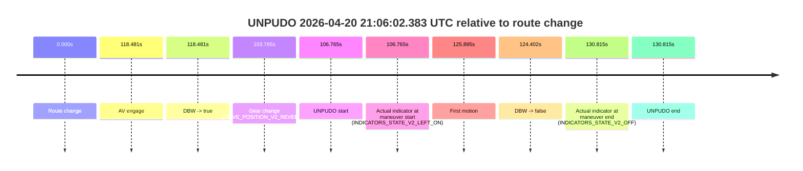
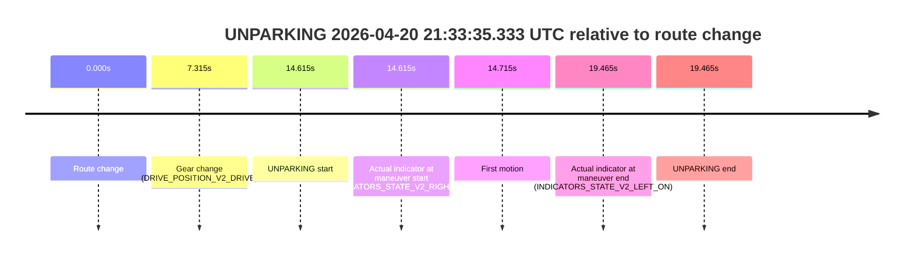
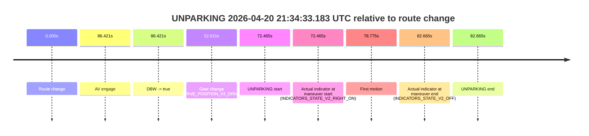

# Run Report: fme20031/2026-04-20--20-55-34--gen2-av-a43251d1-6a0c-4e02-93c5-50d3a5a6063f

| Field | Value |
|---|---|
| Run ID | `fme20031/2026-04-20--20-55-34--gen2-av-a43251d1-6a0c-4e02-93c5-50d3a5a6063f` |
| Date | `2026-04-20` |
| Model(s) | `blue-panther-solid` |
| Author | `guy.geva` |
| Event count | `3` |

## unpudo 2026-04-20 21:06:02.383 UTC

| Field | Value |
|---|---|
| Model | `blue-panther-solid` |
| Author | `guy.geva` |
| Run ID | `fme20031/2026-04-20--20-55-34--gen2-av-a43251d1-6a0c-4e02-93c5-50d3a5a6063f` |
| Date | `2026-04-20` |
| Time (UTC) | `21:06:02.383` |
| Event type | `unpudo` |
| Disengagement type | `none observed` |
| Route change | `found` |
| Console | [run](https://console.sso.wayve.ai/run/fme20031/2026-04-20--20-55-34--gen2-av-a43251d1-6a0c-4e02-93c5-50d3a5a6063f?id=&time-unixus=1776719162383312) |
| Foxglove | [segment](https://app.foxglove.dev/wayve-on-prem/p/prj_0dX18KZdVHg1fmmI/view?ds=foxglove-stream&ds.deviceName=fme20031&ds.start=2026-04-20T21%3A04%3A05.618252Z&ds.end=2026-04-20T21%3A06%3A36.433316Z&layoutId=lay_0e7VD4WIKDQGU73Y&time=2026-04-20T21%3A06%3A02.383312Z) |

### Event card: fail

- Fail: the credited unpudo does not stay AV-owned. The event window starts with DBW false, and the maneuver outcome lands outside a clean AV-owned segment.

| Event | Time (UTC) | Delta from route change |
|---|---:|---:|
| Route change | 2026-04-20 21:04:15.618 | `0.000s` |
| AV engage | 2026-04-20 21:06:14.099 | `118.481s` |
| DBW -> true | 2026-04-20 21:06:14.099 | `118.481s` |
| Gear change (DRIVE_POSITION_V2_REVERSE) | 2026-04-20 21:05:59.383 | `103.765s` |
| UNPUDO start | 2026-04-20 21:06:02.383 | `106.765s` |
| Actual indicator at maneuver start (INDICATORS_STATE_V2_LEFT_ON) | 2026-04-20 21:06:02.383 | `106.765s` |
| First motion | 2026-04-20 21:06:21.513 | `125.895s` |
| DBW -> false | 2026-04-20 21:06:20.020 | `124.402s` |
| Actual indicator at maneuver end (INDICATORS_STATE_V2_OFF) | 2026-04-20 21:06:26.433 | `130.815s` |
| UNPUDO end | 2026-04-20 21:06:26.433 | `130.815s` |

| Metric | Value |
|---|---|
| Outcome | `fail` |
| Effective failure type | `not_av_owned` |
| Route change status | `found` |
| DBW at event start | `false` |
| DBW at event end | `false` |
| Predicted gear at AV start | `DRIVE_POSITION_V2_DRIVE` |
| Actual gear at AV start | `DRIVE_POSITION_V2_PARK` |
| Predicted gear at event start | `DRIVE_POSITION_V2_REVERSE` |
| Actual gear at event start | `DRIVE_POSITION_V2_REVERSE` |
| Planned indicator direction | `INDICATORS_STATE_V2_RIGHT_ON` |
| Controller indicator direction | `INDICATORS_STATE_V2_RIGHT_ON` |
| Actual indicator direction | `INDICATORS_STATE_V2_LEFT_ON` |
| Actual indicator at maneuver end | `INDICATORS_STATE_V2_OFF` |
| Driver accel help in AV | `false` |
| Driver accel help timestamp | `n/a` |
| Max accel pedal pct in AV | `0.0%` |
| Max brake pedal pct in AV | `8.0%` |
| Max speed mps in AV | `0.000` |
| Route -> AV | `118.481s` |
| AV -> event start | `-11.716s` |
| AV -> first motion | `7.414s` |
| AV duration before disengagement | `5.921s` |
| Trajectory waypoint count | `37` |
| Driving-plan step count | `11` |

The scored portion starts from the AV-owned window, not from the pre-AV setup. Route-change search in the stopped pre-event segment was `found`, with the baseline therefore set to route change. At the event anchor the model predicts `DRIVE_POSITION_V2_REVERSE` and the actual gear is `DRIVE_POSITION_V2_REVERSE`. The effective model outcome is `fail` because `not_av_owned`.

### Resolution

| Field | Value |
|---|---|
| Final outcome | `fail` |
| Do we agree with this label? | `yes` |
| Source disengagement type | `none observed` |
| Resolved effective failure type | `not_av_owned` |
| Confidence | `high` |

## unparking 2026-04-20 21:33:35.333 UTC

| Field | Value |
|---|---|
| Model | `blue-panther-solid` |
| Author | `guy.geva` |
| Run ID | `fme20031/2026-04-20--20-55-34--gen2-av-a43251d1-6a0c-4e02-93c5-50d3a5a6063f` |
| Date | `2026-04-20` |
| Time (UTC) | `21:33:35.333` |
| Event type | `unparking` |
| Disengagement type | `none observed` |
| Route change | `found` |
| Console | [run](https://console.sso.wayve.ai/run/fme20031/2026-04-20--20-55-34--gen2-av-a43251d1-6a0c-4e02-93c5-50d3a5a6063f?id=&time-unixus=1776720815333310) |
| Foxglove | [segment](https://app.foxglove.dev/wayve-on-prem/p/prj_0dX18KZdVHg1fmmI/view?ds=foxglove-stream&ds.deviceName=fme20031&ds.start=2026-04-20T21%3A33%3A10.718320Z&ds.end=2026-04-20T21%3A33%3A50.183299Z&layoutId=lay_0e7VD4WIKDQGU73Y&time=2026-04-20T21%3A33%3A35.333310Z) |

### Event card: non-av

- Non-AV: there is no AV-owned portion anywhere inside the detected unparking timeline, so it is kept for coverage but excluded from model success / failure scoring.

| Event | Time (UTC) | Delta from route change |
|---|---:|---:|
| Route change | 2026-04-20 21:33:20.718 | `0.000s` |
| Gear change (DRIVE_POSITION_V2_DRIVE) | 2026-04-20 21:33:28.033 | `7.315s` |
| UNPARKING start | 2026-04-20 21:33:35.333 | `14.615s` |
| Actual indicator at maneuver start (INDICATORS_STATE_V2_RIGHT_ON) | 2026-04-20 21:33:35.333 | `14.615s` |
| First motion | 2026-04-20 21:33:35.433 | `14.715s` |
| Actual indicator at maneuver end (INDICATORS_STATE_V2_LEFT_ON) | 2026-04-20 21:33:40.183 | `19.465s` |
| UNPARKING end | 2026-04-20 21:33:40.183 | `19.465s` |

| Metric | Value |
|---|---|
| Outcome | `non-av` |
| Effective failure type | `none` |
| Route change status | `found` |
| DBW at event start | `false` |
| DBW at event end | `false` |
| Predicted gear at AV start | `n/a` |
| Actual gear at AV start | `n/a` |
| Predicted gear at event start | `DRIVE_POSITION_V2_DRIVE` |
| Actual gear at event start | `DRIVE_POSITION_V2_DRIVE` |
| Planned indicator direction | `INDICATORS_STATE_V2_RIGHT_ON` |
| Controller indicator direction | `INDICATORS_STATE_V2_RIGHT_ON` |
| Actual indicator direction | `INDICATORS_STATE_V2_RIGHT_ON` |
| Actual indicator at maneuver end | `INDICATORS_STATE_V2_LEFT_ON` |
| Driver accel help in AV | `false` |
| Driver accel help timestamp | `n/a` |
| Max accel pedal pct in AV | `0.0%` |
| Max brake pedal pct in AV | `0.0%` |
| Max speed mps in AV | `0.000` |
| Route -> AV | `n/a` |
| AV -> event start | `n/a` |
| AV -> first motion | `n/a` |
| AV duration before disengagement | `n/a` |
| Trajectory waypoint count | `36` |
| Driving-plan step count | `11` |

The scored portion starts from the AV-owned window, not from the pre-AV setup. Route-change search in the stopped pre-event segment was `found`, with the baseline therefore set to route change. At the event anchor the model predicts `DRIVE_POSITION_V2_DRIVE` and the actual gear is `DRIVE_POSITION_V2_DRIVE`. The effective model outcome is `non-av` because `there is no AV-owned overlap inside the event timeline`.

### Resolution

| Field | Value |
|---|---|
| Final outcome | `non-av` |
| Do we agree with this label? | `yes` |
| Source disengagement type | `none observed` |
| Resolved effective failure type | `none` |
| Confidence | `high` |

## unparking 2026-04-20 21:34:33.183 UTC

| Field | Value |
|---|---|
| Model | `blue-panther-solid` |
| Author | `guy.geva` |
| Run ID | `fme20031/2026-04-20--20-55-34--gen2-av-a43251d1-6a0c-4e02-93c5-50d3a5a6063f` |
| Date | `2026-04-20` |
| Time (UTC) | `21:34:33.183` |
| Event type | `unparking` |
| Disengagement type | `none observed` |
| Route change | `found` |
| Console | [run](https://console.sso.wayve.ai/run/fme20031/2026-04-20--20-55-34--gen2-av-a43251d1-6a0c-4e02-93c5-50d3a5a6063f?id=&time-unixus=1776720873183307) |
| Foxglove | [segment](https://app.foxglove.dev/wayve-on-prem/p/prj_0dX18KZdVHg1fmmI/view?ds=foxglove-stream&ds.deviceName=fme20031&ds.start=2026-04-20T21%3A33%3A10.718320Z&ds.end=2026-04-20T21%3A34%3A53.383291Z&layoutId=lay_0e7VD4WIKDQGU73Y&time=2026-04-20T21%3A34%3A33.183307Z) |

### Event card: non-av

- Non-AV: there is no AV-owned portion anywhere inside the detected unparking timeline, so it is kept for coverage but excluded from model success / failure scoring.

| Event | Time (UTC) | Delta from route change |
|---|---:|---:|
| Route change | 2026-04-20 21:33:20.718 | `0.000s` |
| AV engage | 2026-04-20 21:34:47.139 | `86.421s` |
| DBW -> true | 2026-04-20 21:34:47.139 | `86.421s` |
| Gear change (DRIVE_POSITION_V2_DRIVE) | 2026-04-20 21:34:13.533 | `52.815s` |
| UNPARKING start | 2026-04-20 21:34:33.183 | `72.465s` |
| Actual indicator at maneuver start (INDICATORS_STATE_V2_RIGHT_ON) | 2026-04-20 21:34:33.183 | `72.465s` |
| First motion | 2026-04-20 21:34:39.493 | `78.775s` |
| Actual indicator at maneuver end (INDICATORS_STATE_V2_OFF) | 2026-04-20 21:34:43.383 | `82.665s` |
| UNPARKING end | 2026-04-20 21:34:43.383 | `82.665s` |

| Metric | Value |
|---|---|
| Outcome | `non-av` |
| Effective failure type | `none` |
| Route change status | `found` |
| DBW at event start | `false` |
| DBW at event end | `false` |
| Predicted gear at AV start | `DRIVE_POSITION_V2_DRIVE` |
| Actual gear at AV start | `DRIVE_POSITION_V2_DRIVE` |
| Predicted gear at event start | `DRIVE_POSITION_V2_DRIVE` |
| Actual gear at event start | `DRIVE_POSITION_V2_DRIVE` |
| Planned indicator direction | `INDICATORS_STATE_V2_RIGHT_ON` |
| Controller indicator direction | `INDICATORS_STATE_V2_RIGHT_ON` |
| Actual indicator direction | `INDICATORS_STATE_V2_RIGHT_ON` |
| Actual indicator at maneuver end | `INDICATORS_STATE_V2_OFF` |
| Driver accel help in AV | `false` |
| Driver accel help timestamp | `n/a` |
| Max accel pedal pct in AV | `0.0%` |
| Max brake pedal pct in AV | `0.0%` |
| Max speed mps in AV | `0.000` |
| Route -> AV | `86.421s` |
| AV -> event start | `-13.956s` |
| AV -> first motion | `-7.645s` |
| AV duration before disengagement | `n/a` |
| Trajectory waypoint count | `37` |
| Driving-plan step count | `11` |

The scored portion starts from the AV-owned window, not from the pre-AV setup. Route-change search in the stopped pre-event segment was `found`, with the baseline therefore set to route change. At the event anchor the model predicts `DRIVE_POSITION_V2_DRIVE` and the actual gear is `DRIVE_POSITION_V2_DRIVE`. The effective model outcome is `non-av` because `there is no AV-owned overlap inside the event timeline`.

### Resolution

| Field | Value |
|---|---|
| Final outcome | `non-av` |
| Do we agree with this label? | `yes` |
| Source disengagement type | `none observed` |
| Resolved effective failure type | `none` |
| Confidence | `high` |
