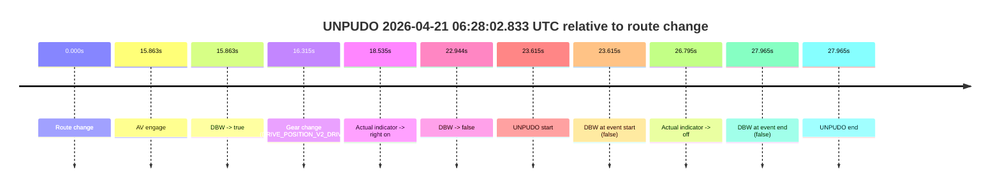
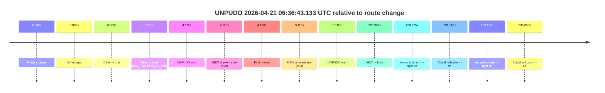
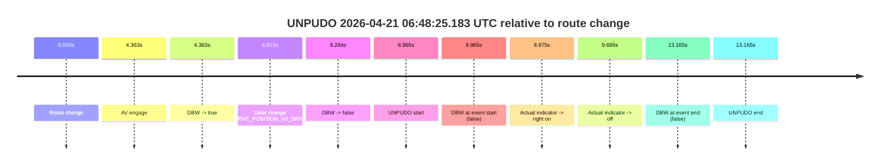
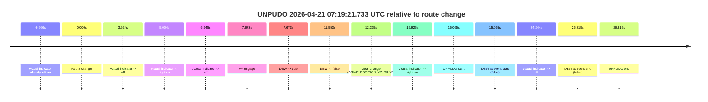

# Run Report: fme20031/2026-04-21--06-19-02--gen2-av-be2ad99b-5967-471c-a413-80a21809f1a2

| Field | Value |
|---|---|
| Run ID | `fme20031/2026-04-21--06-19-02--gen2-av-be2ad99b-5967-471c-a413-80a21809f1a2` |
| Date | `2026-04-21` |
| Model(s) | `pink-manta-ray-smooth` |
| Author | `guy.geva` |
| Event count | `4` |

## unpudo 2026-04-21 06:28:02.833 UTC

| Field | Value |
|---|---|
| Model | `pink-manta-ray-smooth` |
| Author | `guy.geva` |
| Run ID | `fme20031/2026-04-21--06-19-02--gen2-av-be2ad99b-5967-471c-a413-80a21809f1a2` |
| Date | `2026-04-21` |
| Time (UTC) | `06:28:02.833` |
| Event type | `unpudo` |
| Disengagement type | `failed_to_unpudo` |
| Route change | `found` |
| Console | [run](https://console.sso.wayve.ai/run/fme20031/2026-04-21--06-19-02--gen2-av-be2ad99b-5967-471c-a413-80a21809f1a2?id=&time-unixus=1776752882833300) |
| Foxglove | [segment](https://app.foxglove.dev/wayve-on-prem/p/prj_0dX18KZdVHg1fmmI/view?ds=foxglove-stream&ds.deviceName=fme20031&ds.start=2026-04-21T06%3A27%3A29.218336Z&ds.end=2026-04-21T06%3A28%3A17.183290Z&layoutId=lay_0e7VD4WIKDQGU73Y&time=2026-04-21T06%3A28%3A02.833300Z) |

### Event card: fail

- Fail: AV owns part of the segment, but the event still resolves as a model-performance failure under the AV-only scoring rule.

| Event | Time (UTC) | Delta from route change |
|---|---:|---:|
| Route change | 2026-04-21 06:27:39.218 | `0.000s` |
| AV engage | 2026-04-21 06:27:55.081 | `15.863s` |
| DBW -> true | 2026-04-21 06:27:55.081 | `15.863s` |
| Gear change (DRIVE_POSITION_V2_DRIVE) | 2026-04-21 06:27:55.533 | `16.315s` |
| Actual indicator -> right on | 2026-04-21 06:27:57.753 | `18.535s` |
| DBW -> false | 2026-04-21 06:28:02.162 | `22.944s` |
| UNPUDO start | 2026-04-21 06:28:02.833 | `23.615s` |
| DBW at event start (false) | 2026-04-21 06:28:02.833 | `23.615s` |
| Actual indicator -> off | 2026-04-21 06:28:06.013 | `26.795s` |
| DBW at event end (false) | 2026-04-21 06:28:07.183 | `27.965s` |
| UNPUDO end | 2026-04-21 06:28:07.183 | `27.965s` |

| Metric | Value |
|---|---|
| Outcome | `fail` |
| Effective failure type | `failed_to_unpudo` |
| Route change status | `found` |
| DBW at event start | `false` |
| DBW at event end | `false` |
| Predicted gear at AV start | `DRIVE_POSITION_V2_DRIVE` |
| Actual gear at AV start | `DRIVE_POSITION_V2_PARK` |
| Predicted gear at event start | `DRIVE_POSITION_V2_DRIVE` |
| Actual gear at event start | `DRIVE_POSITION_V2_DRIVE` |
| Planned indicator direction | `INDICATORS_STATE_V2_LEFT_ON` |
| Controller indicator direction | `INDICATORS_STATE_V2_LEFT_ON` |
| Actual indicator direction | `INDICATORS_STATE_V2_RIGHT_ON` |
| Actual indicator at maneuver end | `INDICATORS_STATE_V2_OFF` |
| Driver accel help in AV | `false` |
| Driver accel help timestamp | `n/a` |
| Max accel pedal pct in AV | `0.0%` |
| Max brake pedal pct in AV | `8.3%` |
| Max speed mps in AV | `0.000` |
| Success timing baseline | `route change` |
| Route -> AV | `15.863s` |
| AV -> event start | `7.752s` |
| AV -> first motion | `n/a` |
| Success baseline -> event start | `23.615s` |
| Success baseline -> first motion | `n/a` |
| AV duration before disengagement | `7.081s` |
| Trajectory waypoint count | `36` |
| Driving-plan step count | `11` |

The scored portion starts from the AV-owned window, not from the pre-AV setup. Route-change search in the stopped pre-event segment was `found`, with the baseline therefore set to route change. At the event anchor the model predicts `DRIVE_POSITION_V2_DRIVE` and the actual gear is `DRIVE_POSITION_V2_DRIVE`. The effective model outcome is `fail` because `failed_to_unpudo.`

### Resolution

| Field | Value |
|---|---|
| Final outcome | `fail` |
| Do we agree with this label? | `yes` |
| Source disengagement type | `failed_to_unpudo` |
| Resolved effective failure type | `failed_to_unpudo` |
| Confidence | `high` |

## unpudo 2026-04-21 06:36:43.133 UTC

| Field | Value |
|---|---|
| Model | `pink-manta-ray-smooth` |
| Author | `guy.geva` |
| Run ID | `fme20031/2026-04-21--06-19-02--gen2-av-be2ad99b-5967-471c-a413-80a21809f1a2` |
| Date | `2026-04-21` |
| Time (UTC) | `06:36:43.133` |
| Event type | `unpudo` |
| Disengagement type | `none observed` |
| Route change | `found` |
| Console | [run](https://console.sso.wayve.ai/run/fme20031/2026-04-21--06-19-02--gen2-av-be2ad99b-5967-471c-a413-80a21809f1a2?id=&time-unixus=1776753403133297) |
| Foxglove | [segment](https://app.foxglove.dev/wayve-on-prem/p/prj_0dX18KZdVHg1fmmI/view?ds=foxglove-stream&ds.deviceName=fme20031&ds.start=2026-04-21T06%3A36%3A29.018284Z&ds.end=2026-04-21T06%3A40%3A37.941316Z&layoutId=lay_0e7VD4WIKDQGU73Y&time=2026-04-21T06%3A36%3A43.133297Z) |

### Event card: pass

- Pass: AV owns the credited unpudo from route change through the official unpudo window, the gear state is aligned at the anchor, and the vehicle moves without driver accelerator help in AV.

| Event | Time (UTC) | Delta from route change |
|---|---:|---:|
| Route change | 2026-04-21 06:36:39.018 | `0.000s` |
| AV engage | 2026-04-21 06:36:39.021 | `0.003s` |
| DBW -> true | 2026-04-21 06:36:39.021 | `0.003s` |
| Gear change (DRIVE_POSITION_V2_DRIVE) | 2026-04-21 06:36:39.333 | `0.315s` |
| UNPUDO start | 2026-04-21 06:36:43.133 | `4.115s` |
| DBW at event start (true) | 2026-04-21 06:36:43.133 | `4.115s` |
| First motion | 2026-04-21 06:36:43.213 | `4.196s` |
| DBW at event end (true) | 2026-04-21 06:36:48.133 | `9.115s` |
| UNPUDO end | 2026-04-21 06:36:48.133 | `9.115s` |
| DBW -> false | 2026-04-21 06:40:27.941 | `228.923s` |
| Actual indicator -> right on | 2026-04-21 06:40:29.293 | `230.275s` |
| Actual indicator -> off | 2026-04-21 06:40:30.133 | `231.115s` |
| Actual indicator -> right on | 2026-04-21 06:40:32.173 | `233.155s` |
| Actual indicator -> off | 2026-04-21 06:40:35.873 | `236.855s` |

| Metric | Value |
|---|---|
| Outcome | `pass` |
| Effective failure type | `none` |
| Route change status | `found` |
| DBW at event start | `true` |
| DBW at event end | `true` |
| Predicted gear at AV start | `DRIVE_POSITION_V2_PARK` |
| Actual gear at AV start | `DRIVE_POSITION_V2_PARK` |
| Predicted gear at event start | `DRIVE_POSITION_V2_DRIVE` |
| Actual gear at event start | `DRIVE_POSITION_V2_DRIVE` |
| Planned indicator direction | `INDICATORS_STATE_V2_LEFT_ON` |
| Controller indicator direction | `INDICATORS_STATE_V2_LEFT_ON` |
| Actual indicator direction | `INDICATORS_STATE_V2_OFF` |
| Actual indicator at maneuver end | `INDICATORS_STATE_V2_OFF` |
| Driver accel help in AV | `false` |
| Driver accel help timestamp | `n/a` |
| Max accel pedal pct in AV | `0.0%` |
| Max brake pedal pct in AV | `8.0%` |
| Max speed mps in AV | `2.833` |
| Success timing baseline | `route change` |
| Route -> AV | `0.003s` |
| AV -> event start | `4.112s` |
| AV -> first motion | `4.193s` |
| Success baseline -> event start | `4.115s` |
| Success baseline -> first motion | `4.196s` |
| AV duration before disengagement | `228.920s` |
| Trajectory waypoint count | `36` |
| Driving-plan step count | `11` |

The scored portion starts from the AV-owned window, not from the pre-AV setup. Route-change search in the stopped pre-event segment was `found`, with the baseline therefore set to route change. At the event anchor the model predicts `DRIVE_POSITION_V2_DRIVE` and the actual gear is `DRIVE_POSITION_V2_DRIVE`. The effective model outcome is `pass` because `the credited unpudo stays AV-owned through the official unpudo window.`

### Resolution

| Field | Value |
|---|---|
| Final outcome | `pass` |
| Do we agree with this label? | `yes` |
| Source disengagement type | `none observed` |
| Resolved effective failure type | `none` |
| Confidence | `high` |

## unpudo 2026-04-21 06:48:25.183 UTC

| Field | Value |
|---|---|
| Model | `pink-manta-ray-smooth` |
| Author | `guy.geva` |
| Run ID | `fme20031/2026-04-21--06-19-02--gen2-av-be2ad99b-5967-471c-a413-80a21809f1a2` |
| Date | `2026-04-21` |
| Time (UTC) | `06:48:25.183` |
| Event type | `unpudo` |
| Disengagement type | `failed_to_unpudo` |
| Route change | `found` |
| Console | [run](https://console.sso.wayve.ai/run/fme20031/2026-04-21--06-19-02--gen2-av-be2ad99b-5967-471c-a413-80a21809f1a2?id=&time-unixus=1776754105183297) |
| Foxglove | [segment](https://app.foxglove.dev/wayve-on-prem/p/prj_0dX18KZdVHg1fmmI/view?ds=foxglove-stream&ds.deviceName=fme20031&ds.start=2026-04-21T06%3A48%3A06.218276Z&ds.end=2026-04-21T06%3A48%3A39.383303Z&layoutId=lay_0e7VD4WIKDQGU73Y&time=2026-04-21T06%3A48%3A25.183297Z) |

### Event card: fail

- Fail: AV owns part of the segment, but the event still resolves as a model-performance failure under the AV-only scoring rule.

| Event | Time (UTC) | Delta from route change |
|---|---:|---:|
| Route change | 2026-04-21 06:48:16.218 | `0.000s` |
| AV engage | 2026-04-21 06:48:20.581 | `4.363s` |
| DBW -> true | 2026-04-21 06:48:20.581 | `4.363s` |
| Gear change (DRIVE_POSITION_V2_DRIVE) | 2026-04-21 06:48:21.033 | `4.815s` |
| DBW -> false | 2026-04-21 06:48:24.501 | `8.284s` |
| UNPUDO start | 2026-04-21 06:48:25.183 | `8.965s` |
| DBW at event start (false) | 2026-04-21 06:48:25.183 | `8.965s` |
| Actual indicator -> right on | 2026-04-21 06:48:25.193 | `8.975s` |
| Actual indicator -> off | 2026-04-21 06:48:25.913 | `9.695s` |
| DBW at event end (false) | 2026-04-21 06:48:29.383 | `13.165s` |
| UNPUDO end | 2026-04-21 06:48:29.383 | `13.165s` |

| Metric | Value |
|---|---|
| Outcome | `fail` |
| Effective failure type | `failed_to_unpudo` |
| Route change status | `found` |
| DBW at event start | `false` |
| DBW at event end | `false` |
| Predicted gear at AV start | `DRIVE_POSITION_V2_DRIVE` |
| Actual gear at AV start | `DRIVE_POSITION_V2_PARK` |
| Predicted gear at event start | `DRIVE_POSITION_V2_DRIVE` |
| Actual gear at event start | `DRIVE_POSITION_V2_DRIVE` |
| Planned indicator direction | `INDICATORS_STATE_V2_RIGHT_ON` |
| Controller indicator direction | `INDICATORS_STATE_V2_RIGHT_ON` |
| Actual indicator direction | `INDICATORS_STATE_V2_RIGHT_ON` |
| Actual indicator at maneuver end | `INDICATORS_STATE_V2_OFF` |
| Driver accel help in AV | `false` |
| Driver accel help timestamp | `n/a` |
| Max accel pedal pct in AV | `0.0%` |
| Max brake pedal pct in AV | `8.0%` |
| Max speed mps in AV | `0.000` |
| Success timing baseline | `route change` |
| Route -> AV | `4.363s` |
| AV -> event start | `4.602s` |
| AV -> first motion | `n/a` |
| Success baseline -> event start | `8.965s` |
| Success baseline -> first motion | `n/a` |
| AV duration before disengagement | `3.921s` |
| Trajectory waypoint count | `37` |
| Driving-plan step count | `11` |

The scored portion starts from the AV-owned window, not from the pre-AV setup. Route-change search in the stopped pre-event segment was `found`, with the baseline therefore set to route change. At the event anchor the model predicts `DRIVE_POSITION_V2_DRIVE` and the actual gear is `DRIVE_POSITION_V2_DRIVE`. The effective model outcome is `fail` because `failed_to_unpudo.`

### Resolution

| Field | Value |
|---|---|
| Final outcome | `fail` |
| Do we agree with this label? | `yes` |
| Source disengagement type | `failed_to_unpudo` |
| Resolved effective failure type | `failed_to_unpudo` |
| Confidence | `high` |

## unpudo 2026-04-21 07:19:21.733 UTC

| Field | Value |
|---|---|
| Model | `pink-manta-ray-smooth` |
| Author | `guy.geva` |
| Run ID | `fme20031/2026-04-21--06-19-02--gen2-av-be2ad99b-5967-471c-a413-80a21809f1a2` |
| Date | `2026-04-21` |
| Time (UTC) | `07:19:21.733` |
| Event type | `unpudo` |
| Disengagement type | `failed_to_unpudo` |
| Route change | `found` |
| Console | [run](https://console.sso.wayve.ai/run/fme20031/2026-04-21--06-19-02--gen2-av-be2ad99b-5967-471c-a413-80a21809f1a2?id=&time-unixus=1776755961733311) |
| Foxglove | [segment](https://app.foxglove.dev/wayve-on-prem/p/prj_0dX18KZdVHg1fmmI/view?ds=foxglove-stream&ds.deviceName=fme20031&ds.start=2026-04-21T07%3A18%3A56.668643Z&ds.end=2026-04-21T07%3A19%3A43.483301Z&layoutId=lay_0e7VD4WIKDQGU73Y&time=2026-04-21T07%3A19%3A21.733311Z) |

### Event card: fail

- Fail: AV owns part of the segment, but the event still resolves as a model-performance failure under the AV-only scoring rule.

| Event | Time (UTC) | Delta from route change |
|---|---:|---:|
| Actual indicator already left on | 2026-04-21 07:18:56.673 | `-9.996s` |
| Route change | 2026-04-21 07:19:06.668 | `0.000s` |
| Actual indicator -> off | 2026-04-21 07:19:10.593 | `3.924s` |
| Actual indicator -> right on | 2026-04-21 07:19:11.673 | `5.004s` |
| Actual indicator -> off | 2026-04-21 07:19:13.313 | `6.645s` |
| AV engage | 2026-04-21 07:19:14.341 | `7.673s` |
| DBW -> true | 2026-04-21 07:19:14.341 | `7.673s` |
| DBW -> false | 2026-04-21 07:19:18.222 | `11.553s` |
| Gear change (DRIVE_POSITION_V2_DRIVE) | 2026-04-21 07:19:18.883 | `12.215s` |
| Actual indicator -> right on | 2026-04-21 07:19:19.593 | `12.925s` |
| UNPUDO start | 2026-04-21 07:19:21.733 | `15.065s` |
| DBW at event start (false) | 2026-04-21 07:19:21.733 | `15.065s` |
| Actual indicator -> off | 2026-04-21 07:19:30.913 | `24.244s` |
| DBW at event end (false) | 2026-04-21 07:19:33.483 | `26.815s` |
| UNPUDO end | 2026-04-21 07:19:33.483 | `26.815s` |

| Metric | Value |
|---|---|
| Outcome | `fail` |
| Effective failure type | `failed_to_unpudo` |
| Route change status | `found` |
| DBW at event start | `false` |
| DBW at event end | `false` |
| Predicted gear at AV start | `DRIVE_POSITION_V2_REVERSE` |
| Actual gear at AV start | `DRIVE_POSITION_V2_PARK` |
| Predicted gear at event start | `DRIVE_POSITION_V2_DRIVE` |
| Actual gear at event start | `DRIVE_POSITION_V2_DRIVE` |
| Planned indicator direction | `INDICATORS_STATE_V2_OFF` |
| Controller indicator direction | `INDICATORS_STATE_V2_OFF` |
| Actual indicator direction | `INDICATORS_STATE_V2_RIGHT_ON` |
| Actual indicator at maneuver end | `INDICATORS_STATE_V2_OFF` |
| Driver accel help in AV | `false` |
| Driver accel help timestamp | `n/a` |
| Max accel pedal pct in AV | `0.0%` |
| Max brake pedal pct in AV | `8.0%` |
| Max speed mps in AV | `0.000` |
| Success timing baseline | `route change` |
| Route -> AV | `7.673s` |
| AV -> event start | `7.392s` |
| AV -> first motion | `n/a` |
| Success baseline -> event start | `15.065s` |
| Success baseline -> first motion | `n/a` |
| AV duration before disengagement | `3.881s` |
| Trajectory waypoint count | `36` |
| Driving-plan step count | `11` |

The scored portion starts from the AV-owned window, not from the pre-AV setup. Route-change search in the stopped pre-event segment was `found`, with the baseline therefore set to route change. At the event anchor the model predicts `DRIVE_POSITION_V2_DRIVE` and the actual gear is `DRIVE_POSITION_V2_DRIVE`. The effective model outcome is `fail` because `failed_to_unpudo.`

### Resolution

| Field | Value |
|---|---|
| Final outcome | `fail` |
| Do we agree with this label? | `yes` |
| Source disengagement type | `failed_to_unpudo` |
| Resolved effective failure type | `failed_to_unpudo` |
| Confidence | `high` |
