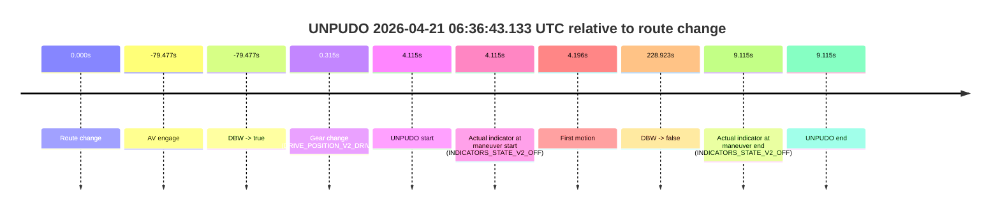
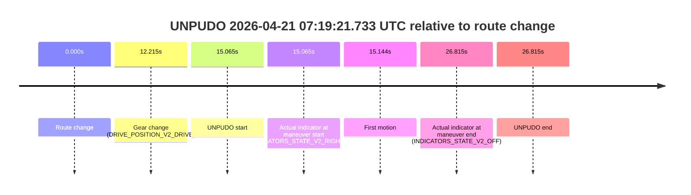

# Run Report: fme20031/2026-04-21--06-19-02--gen2-av-be2ad99b-5967-471c-a413-80a21809f1a2

| Field | Value |
|---|---|
| Run ID | `fme20031/2026-04-21--06-19-02--gen2-av-be2ad99b-5967-471c-a413-80a21809f1a2` |
| Date | `2026-04-21` |
| Model(s) | `pink-manta-ray-smooth` |
| Author | `guy.geva` |
| Event count | `4` |

## unpudo 2026-04-21 06:28:02.833 UTC

| Field | Value |
|---|---|
| Model | `pink-manta-ray-smooth` |
| Author | `guy.geva` |
| Run ID | `fme20031/2026-04-21--06-19-02--gen2-av-be2ad99b-5967-471c-a413-80a21809f1a2` |
| Date | `2026-04-21` |
| Time (UTC) | `06:28:02.833` |
| Event type | `unpudo` |
| Disengagement type | `failed_to_unpudo` |
| Route change | `found` |
| Console | [run](https://console.sso.wayve.ai/run/fme20031/2026-04-21--06-19-02--gen2-av-be2ad99b-5967-471c-a413-80a21809f1a2?id=&time-unixus=1776752882833300) |
| Foxglove | [segment](https://app.foxglove.dev/wayve-on-prem/p/prj_0dX18KZdVHg1fmmI/view?ds=foxglove-stream&ds.deviceName=fme20031&ds.start=2026-04-21T06%3A27%3A29.218336Z&ds.end=2026-04-21T06%3A32%3A40.202404Z&layoutId=lay_0e7VD4WIKDQGU73Y&time=2026-04-21T06%3A28%3A02.833300Z) |

### Event card: non-av

- Non-AV: there is no AV-owned portion anywhere inside the detected unpudo timeline, so it is kept for coverage but excluded from model success / failure scoring.

| Event | Time (UTC) | Delta from route change |
|---|---:|---:|
| Route change | 2026-04-21 06:27:39.218 | `0.000s` |
| AV engage | 2026-04-21 06:28:10.581 | `31.364s` |
| DBW -> true | 2026-04-21 06:28:10.581 | `31.364s` |
| Gear change (DRIVE_POSITION_V2_DRIVE) | 2026-04-21 06:27:55.533 | `16.315s` |
| UNPUDO start | 2026-04-21 06:28:02.833 | `23.615s` |
| Actual indicator at maneuver start (INDICATORS_STATE_V2_RIGHT_ON) | 2026-04-21 06:28:02.833 | `23.615s` |
| First motion | 2026-04-21 06:28:02.893 | `23.675s` |
| DBW -> false | 2026-04-21 06:32:30.202 | `290.984s` |
| Actual indicator at maneuver end (INDICATORS_STATE_V2_OFF) | 2026-04-21 06:28:07.183 | `27.965s` |
| UNPUDO end | 2026-04-21 06:28:07.183 | `27.965s` |

| Metric | Value |
|---|---|
| Outcome | `non-av` |
| Effective failure type | `none` |
| Route change status | `found` |
| DBW at event start | `false` |
| DBW at event end | `false` |
| Predicted gear at AV start | `DRIVE_POSITION_V2_DRIVE` |
| Actual gear at AV start | `DRIVE_POSITION_V2_DRIVE` |
| Predicted gear at event start | `DRIVE_POSITION_V2_DRIVE` |
| Actual gear at event start | `DRIVE_POSITION_V2_DRIVE` |
| Planned indicator direction | `INDICATORS_STATE_V2_LEFT_ON` |
| Controller indicator direction | `INDICATORS_STATE_V2_LEFT_ON` |
| Actual indicator direction | `INDICATORS_STATE_V2_RIGHT_ON` |
| Actual indicator at maneuver end | `INDICATORS_STATE_V2_OFF` |
| Driver accel help in AV | `false` |
| Driver accel help timestamp | `n/a` |
| Max accel pedal pct in AV | `0.0%` |
| Max brake pedal pct in AV | `0.0%` |
| Max speed mps in AV | `0.000` |
| Route -> AV | `31.364s` |
| AV -> event start | `-7.749s` |
| AV -> first motion | `-7.689s` |
| AV duration before disengagement | `259.620s` |
| Trajectory waypoint count | `36` |
| Driving-plan step count | `11` |

The scored portion starts from the AV-owned window, not from the pre-AV setup. Route-change search in the stopped pre-event segment was `found`, with the baseline therefore set to route change. At the event anchor the model predicts `DRIVE_POSITION_V2_DRIVE` and the actual gear is `DRIVE_POSITION_V2_DRIVE`. The effective model outcome is `non-av` because `there is no AV-owned overlap inside the event timeline`.

### Resolution

| Field | Value |
|---|---|
| Final outcome | `non-av` |
| Do we agree with this label? | `yes` |
| Source disengagement type | `failed_to_unpudo` |
| Resolved effective failure type | `none` |
| Confidence | `high` |

## unpudo 2026-04-21 06:36:43.133 UTC

| Field | Value |
|---|---|
| Model | `pink-manta-ray-smooth` |
| Author | `guy.geva` |
| Run ID | `fme20031/2026-04-21--06-19-02--gen2-av-be2ad99b-5967-471c-a413-80a21809f1a2` |
| Date | `2026-04-21` |
| Time (UTC) | `06:36:43.133` |
| Event type | `unpudo` |
| Disengagement type | `none observed` |
| Route change | `found` |
| Console | [run](https://console.sso.wayve.ai/run/fme20031/2026-04-21--06-19-02--gen2-av-be2ad99b-5967-471c-a413-80a21809f1a2?id=&time-unixus=1776753403133297) |
| Foxglove | [segment](https://app.foxglove.dev/wayve-on-prem/p/prj_0dX18KZdVHg1fmmI/view?ds=foxglove-stream&ds.deviceName=fme20031&ds.start=2026-04-21T06%3A35%3A09.541091Z&ds.end=2026-04-21T06%3A40%3A37.941316Z&layoutId=lay_0e7VD4WIKDQGU73Y&time=2026-04-21T06%3A36%3A43.133297Z) |

### Event card: pass

- Pass: AV owns the credited unpudo through the official event window, the gear state is aligned at the anchor, and the vehicle moves without driver accelerator help in AV.

| Event | Time (UTC) | Delta from route change |
|---|---:|---:|
| Route change | 2026-04-21 06:36:39.018 | `0.000s` |
| AV engage | 2026-04-21 06:35:19.541 | `-79.477s` |
| DBW -> true | 2026-04-21 06:35:19.541 | `-79.477s` |
| Gear change (DRIVE_POSITION_V2_DRIVE) | 2026-04-21 06:36:39.333 | `0.315s` |
| UNPUDO start | 2026-04-21 06:36:43.133 | `4.115s` |
| Actual indicator at maneuver start (INDICATORS_STATE_V2_OFF) | 2026-04-21 06:36:43.133 | `4.115s` |
| First motion | 2026-04-21 06:36:43.213 | `4.196s` |
| DBW -> false | 2026-04-21 06:40:27.941 | `228.923s` |
| Actual indicator at maneuver end (INDICATORS_STATE_V2_OFF) | 2026-04-21 06:36:48.133 | `9.115s` |
| UNPUDO end | 2026-04-21 06:36:48.133 | `9.115s` |

| Metric | Value |
|---|---|
| Outcome | `pass` |
| Effective failure type | `none` |
| Route change status | `found` |
| DBW at event start | `true` |
| DBW at event end | `true` |
| Predicted gear at AV start | `DRIVE_POSITION_V2_DRIVE` |
| Actual gear at AV start | `DRIVE_POSITION_V2_DRIVE` |
| Predicted gear at event start | `DRIVE_POSITION_V2_DRIVE` |
| Actual gear at event start | `DRIVE_POSITION_V2_DRIVE` |
| Planned indicator direction | `INDICATORS_STATE_V2_LEFT_ON` |
| Controller indicator direction | `INDICATORS_STATE_V2_LEFT_ON` |
| Actual indicator direction | `INDICATORS_STATE_V2_OFF` |
| Actual indicator at maneuver end | `INDICATORS_STATE_V2_OFF` |
| Driver accel help in AV | `false` |
| Driver accel help timestamp | `n/a` |
| Max accel pedal pct in AV | `0.0%` |
| Max brake pedal pct in AV | `0.0%` |
| Max speed mps in AV | `2.833` |
| Route -> AV | `-79.477s` |
| AV -> event start | `83.592s` |
| AV -> first motion | `83.673s` |
| AV duration before disengagement | `308.400s` |
| Trajectory waypoint count | `36` |
| Driving-plan step count | `11` |

The scored portion starts from the AV-owned window, not from the pre-AV setup. Route-change search in the stopped pre-event segment was `found`, with the baseline therefore set to route change. At the event anchor the model predicts `DRIVE_POSITION_V2_DRIVE` and the actual gear is `DRIVE_POSITION_V2_DRIVE`. The effective model outcome is `pass` because `the credited maneuver stays AV-owned through the official event end`.

### Resolution

| Field | Value |
|---|---|
| Final outcome | `pass` |
| Do we agree with this label? | `yes` |
| Source disengagement type | `none observed` |
| Resolved effective failure type | `none` |
| Confidence | `high` |

## unpudo 2026-04-21 06:48:25.183 UTC

| Field | Value |
|---|---|
| Model | `pink-manta-ray-smooth` |
| Author | `guy.geva` |
| Run ID | `fme20031/2026-04-21--06-19-02--gen2-av-be2ad99b-5967-471c-a413-80a21809f1a2` |
| Date | `2026-04-21` |
| Time (UTC) | `06:48:25.183` |
| Event type | `unpudo` |
| Disengagement type | `failed_to_unpudo` |
| Route change | `found` |
| Console | [run](https://console.sso.wayve.ai/run/fme20031/2026-04-21--06-19-02--gen2-av-be2ad99b-5967-471c-a413-80a21809f1a2?id=&time-unixus=1776754105183297) |
| Foxglove | [segment](https://app.foxglove.dev/wayve-on-prem/p/prj_0dX18KZdVHg1fmmI/view?ds=foxglove-stream&ds.deviceName=fme20031&ds.start=2026-04-21T06%3A48%3A06.218276Z&ds.end=2026-04-21T06%3A49%3A07.420627Z&layoutId=lay_0e7VD4WIKDQGU73Y&time=2026-04-21T06%3A48%3A25.183297Z) |

### Event card: non-av

- Non-AV: there is no AV-owned portion anywhere inside the detected unpudo timeline, so it is kept for coverage but excluded from model success / failure scoring.

| Event | Time (UTC) | Delta from route change |
|---|---:|---:|
| Route change | 2026-04-21 06:48:16.218 | `0.000s` |
| AV engage | 2026-04-21 06:48:30.401 | `14.184s` |
| DBW -> true | 2026-04-21 06:48:30.401 | `14.184s` |
| Gear change (DRIVE_POSITION_V2_DRIVE) | 2026-04-21 06:48:21.033 | `4.815s` |
| UNPUDO start | 2026-04-21 06:48:25.183 | `8.965s` |
| Actual indicator at maneuver start (INDICATORS_STATE_V2_RIGHT_ON) | 2026-04-21 06:48:25.183 | `8.965s` |
| First motion | 2026-04-21 06:48:25.213 | `8.995s` |
| DBW -> false | 2026-04-21 06:48:57.420 | `41.202s` |
| Actual indicator at maneuver end (INDICATORS_STATE_V2_OFF) | 2026-04-21 06:48:29.383 | `13.165s` |
| UNPUDO end | 2026-04-21 06:48:29.383 | `13.165s` |

| Metric | Value |
|---|---|
| Outcome | `non-av` |
| Effective failure type | `none` |
| Route change status | `found` |
| DBW at event start | `false` |
| DBW at event end | `false` |
| Predicted gear at AV start | `DRIVE_POSITION_V2_DRIVE` |
| Actual gear at AV start | `DRIVE_POSITION_V2_DRIVE` |
| Predicted gear at event start | `DRIVE_POSITION_V2_DRIVE` |
| Actual gear at event start | `DRIVE_POSITION_V2_DRIVE` |
| Planned indicator direction | `INDICATORS_STATE_V2_RIGHT_ON` |
| Controller indicator direction | `INDICATORS_STATE_V2_RIGHT_ON` |
| Actual indicator direction | `INDICATORS_STATE_V2_RIGHT_ON` |
| Actual indicator at maneuver end | `INDICATORS_STATE_V2_OFF` |
| Driver accel help in AV | `false` |
| Driver accel help timestamp | `n/a` |
| Max accel pedal pct in AV | `0.0%` |
| Max brake pedal pct in AV | `0.0%` |
| Max speed mps in AV | `0.000` |
| Route -> AV | `14.184s` |
| AV -> event start | `-5.219s` |
| AV -> first motion | `-5.189s` |
| AV duration before disengagement | `27.019s` |
| Trajectory waypoint count | `37` |
| Driving-plan step count | `11` |

The scored portion starts from the AV-owned window, not from the pre-AV setup. Route-change search in the stopped pre-event segment was `found`, with the baseline therefore set to route change. At the event anchor the model predicts `DRIVE_POSITION_V2_DRIVE` and the actual gear is `DRIVE_POSITION_V2_DRIVE`. The effective model outcome is `non-av` because `there is no AV-owned overlap inside the event timeline`.

### Resolution

| Field | Value |
|---|---|
| Final outcome | `non-av` |
| Do we agree with this label? | `yes` |
| Source disengagement type | `failed_to_unpudo` |
| Resolved effective failure type | `none` |
| Confidence | `high` |

## unpudo 2026-04-21 07:19:21.733 UTC

| Field | Value |
|---|---|
| Model | `pink-manta-ray-smooth` |
| Author | `guy.geva` |
| Run ID | `fme20031/2026-04-21--06-19-02--gen2-av-be2ad99b-5967-471c-a413-80a21809f1a2` |
| Date | `2026-04-21` |
| Time (UTC) | `07:19:21.733` |
| Event type | `unpudo` |
| Disengagement type | `failed_to_unpudo` |
| Route change | `found` |
| Console | [run](https://console.sso.wayve.ai/run/fme20031/2026-04-21--06-19-02--gen2-av-be2ad99b-5967-471c-a413-80a21809f1a2?id=&time-unixus=1776755961733311) |
| Foxglove | [segment](https://app.foxglove.dev/wayve-on-prem/p/prj_0dX18KZdVHg1fmmI/view?ds=foxglove-stream&ds.deviceName=fme20031&ds.start=2026-04-21T07%3A18%3A56.668643Z&ds.end=2026-04-21T07%3A19%3A43.483301Z&layoutId=lay_0e7VD4WIKDQGU73Y&time=2026-04-21T07%3A19%3A21.733311Z) |

### Event card: non-av

- Non-AV: there is no AV-owned portion anywhere inside the detected unpudo timeline, so it is kept for coverage but excluded from model success / failure scoring.

| Event | Time (UTC) | Delta from route change |
|---|---:|---:|
| Route change | 2026-04-21 07:19:06.668 | `0.000s` |
| Gear change (DRIVE_POSITION_V2_DRIVE) | 2026-04-21 07:19:18.883 | `12.215s` |
| UNPUDO start | 2026-04-21 07:19:21.733 | `15.065s` |
| Actual indicator at maneuver start (INDICATORS_STATE_V2_RIGHT_ON) | 2026-04-21 07:19:21.733 | `15.065s` |
| First motion | 2026-04-21 07:19:21.813 | `15.144s` |
| Actual indicator at maneuver end (INDICATORS_STATE_V2_OFF) | 2026-04-21 07:19:33.483 | `26.815s` |
| UNPUDO end | 2026-04-21 07:19:33.483 | `26.815s` |

| Metric | Value |
|---|---|
| Outcome | `non-av` |
| Effective failure type | `none` |
| Route change status | `found` |
| DBW at event start | `false` |
| DBW at event end | `false` |
| Predicted gear at AV start | `n/a` |
| Actual gear at AV start | `n/a` |
| Predicted gear at event start | `DRIVE_POSITION_V2_DRIVE` |
| Actual gear at event start | `DRIVE_POSITION_V2_DRIVE` |
| Planned indicator direction | `INDICATORS_STATE_V2_OFF` |
| Controller indicator direction | `INDICATORS_STATE_V2_OFF` |
| Actual indicator direction | `INDICATORS_STATE_V2_RIGHT_ON` |
| Actual indicator at maneuver end | `INDICATORS_STATE_V2_OFF` |
| Driver accel help in AV | `false` |
| Driver accel help timestamp | `n/a` |
| Max accel pedal pct in AV | `0.0%` |
| Max brake pedal pct in AV | `0.0%` |
| Max speed mps in AV | `0.000` |
| Route -> AV | `n/a` |
| AV -> event start | `n/a` |
| AV -> first motion | `n/a` |
| AV duration before disengagement | `n/a` |
| Trajectory waypoint count | `36` |
| Driving-plan step count | `11` |

The scored portion starts from the AV-owned window, not from the pre-AV setup. Route-change search in the stopped pre-event segment was `found`, with the baseline therefore set to route change. At the event anchor the model predicts `DRIVE_POSITION_V2_DRIVE` and the actual gear is `DRIVE_POSITION_V2_DRIVE`. The effective model outcome is `non-av` because `there is no AV-owned overlap inside the event timeline`.

### Resolution

| Field | Value |
|---|---|
| Final outcome | `non-av` |
| Do we agree with this label? | `yes` |
| Source disengagement type | `failed_to_unpudo` |
| Resolved effective failure type | `none` |
| Confidence | `high` |
