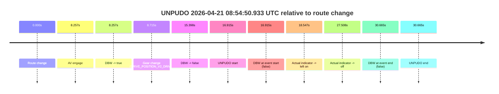
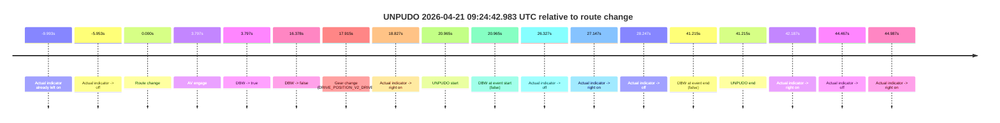
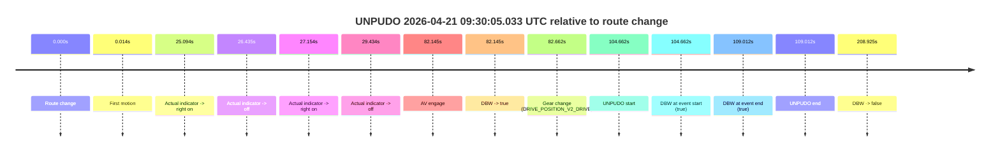
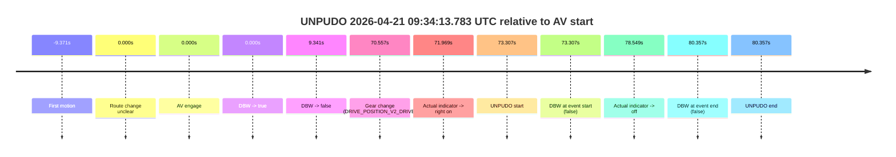

# Run Report: fme20031/2026-04-21--08-38-33--gen2-av-06e51cdb-6c4f-452c-9972-f5a2806c88db

| Field | Value |
|---|---|
| Run ID | `fme20031/2026-04-21--08-38-33--gen2-av-06e51cdb-6c4f-452c-9972-f5a2806c88db` |
| Date | `2026-04-21` |
| Model(s) | `pink-manta-ray-smooth` |
| Author | `guy.geva` |
| Event count | `5` |

## unpudo 2026-04-21 08:54:50.933 UTC

| Field | Value |
|---|---|
| Model | `pink-manta-ray-smooth` |
| Author | `guy.geva` |
| Run ID | `fme20031/2026-04-21--08-38-33--gen2-av-06e51cdb-6c4f-452c-9972-f5a2806c88db` |
| Date | `2026-04-21` |
| Time (UTC) | `08:54:50.933` |
| Event type | `unpudo` |
| Disengagement type | `failed_to_unpudo` |
| Route change | `found` |
| Console | [run](https://console.sso.wayve.ai/run/fme20031/2026-04-21--08-38-33--gen2-av-06e51cdb-6c4f-452c-9972-f5a2806c88db?id=&time-unixus=1776761690933321) |
| Foxglove | [segment](https://app.foxglove.dev/wayve-on-prem/p/prj_0dX18KZdVHg1fmmI/view?ds=foxglove-stream&ds.deviceName=fme20031&ds.start=2026-04-21T08%3A54%3A24.018336Z&ds.end=2026-04-21T08%3A55%3A14.683308Z&layoutId=lay_0e7VD4WIKDQGU73Y&time=2026-04-21T08%3A54%3A50.933321Z) |

### Event card: fail

- Fail: AV owns part of the segment, but the event still resolves as a model-performance failure under the AV-only scoring rule.

| Event | Time (UTC) | Delta from route change |
|---|---:|---:|
| Route change | 2026-04-21 08:54:34.018 | `0.000s` |
| AV engage | 2026-04-21 08:54:42.275 | `8.257s` |
| DBW -> true | 2026-04-21 08:54:42.275 | `8.257s` |
| Gear change (DRIVE_POSITION_V2_DRIVE) | 2026-04-21 08:54:42.733 | `8.715s` |
| DBW -> false | 2026-04-21 08:54:49.415 | `15.398s` |
| UNPUDO start | 2026-04-21 08:54:50.933 | `16.915s` |
| DBW at event start (false) | 2026-04-21 08:54:50.933 | `16.915s` |
| Actual indicator -> left on | 2026-04-21 08:54:52.565 | `18.547s` |
| Actual indicator -> off | 2026-04-21 08:55:01.525 | `27.508s` |
| DBW at event end (false) | 2026-04-21 08:55:04.683 | `30.665s` |
| UNPUDO end | 2026-04-21 08:55:04.683 | `30.665s` |

| Metric | Value |
|---|---|
| Outcome | `fail` |
| Effective failure type | `failed_to_unpudo` |
| Route change status | `found` |
| DBW at event start | `false` |
| DBW at event end | `false` |
| Predicted gear at AV start | `DRIVE_POSITION_V2_DRIVE` |
| Actual gear at AV start | `DRIVE_POSITION_V2_PARK` |
| Predicted gear at event start | `DRIVE_POSITION_V2_DRIVE` |
| Actual gear at event start | `DRIVE_POSITION_V2_DRIVE` |
| Planned indicator direction | `INDICATORS_STATE_V2_LEFT_ON` |
| Controller indicator direction | `INDICATORS_STATE_V2_LEFT_ON` |
| Actual indicator direction | `INDICATORS_STATE_V2_OFF` |
| Actual indicator at maneuver end | `INDICATORS_STATE_V2_OFF` |
| Driver accel help in AV | `false` |
| Driver accel help timestamp | `n/a` |
| Max accel pedal pct in AV | `0.0%` |
| Max brake pedal pct in AV | `8.6%` |
| Max speed mps in AV | `0.000` |
| Success timing baseline | `route change` |
| Route -> AV | `8.257s` |
| AV -> event start | `8.658s` |
| AV -> first motion | `n/a` |
| Success baseline -> event start | `16.915s` |
| Success baseline -> first motion | `n/a` |
| AV duration before disengagement | `7.140s` |
| Trajectory waypoint count | `35` |
| Driving-plan step count | `11` |

The scored portion starts from the AV-owned window, not from the pre-AV setup. Route-change search in the stopped pre-event segment was `found`, with the baseline therefore set to route change. At the event anchor the model predicts `DRIVE_POSITION_V2_DRIVE` and the actual gear is `DRIVE_POSITION_V2_DRIVE`. The effective model outcome is `fail` because `failed_to_unpudo.`

### Resolution

| Field | Value |
|---|---|
| Final outcome | `fail` |
| Do we agree with this label? | `yes` |
| Source disengagement type | `failed_to_unpudo` |
| Resolved effective failure type | `failed_to_unpudo` |
| Confidence | `high` |

## unpudo 2026-04-21 09:24:42.983 UTC

| Field | Value |
|---|---|
| Model | `pink-manta-ray-smooth` |
| Author | `guy.geva` |
| Run ID | `fme20031/2026-04-21--08-38-33--gen2-av-06e51cdb-6c4f-452c-9972-f5a2806c88db` |
| Date | `2026-04-21` |
| Time (UTC) | `09:24:42.983` |
| Event type | `unpudo` |
| Disengagement type | `failed_to_unpudo` |
| Route change | `found` |
| Console | [run](https://console.sso.wayve.ai/run/fme20031/2026-04-21--08-38-33--gen2-av-06e51cdb-6c4f-452c-9972-f5a2806c88db?id=&time-unixus=1776763482983298) |
| Foxglove | [segment](https://app.foxglove.dev/wayve-on-prem/p/prj_0dX18KZdVHg1fmmI/view?ds=foxglove-stream&ds.deviceName=fme20031&ds.start=2026-04-21T09%3A24%3A12.018243Z&ds.end=2026-04-21T09%3A25%3A13.233304Z&layoutId=lay_0e7VD4WIKDQGU73Y&time=2026-04-21T09%3A24%3A42.983298Z) |

### Event card: fail

- Fail: AV owns part of the segment, but the event still resolves as a model-performance failure under the AV-only scoring rule.

| Event | Time (UTC) | Delta from route change |
|---|---:|---:|
| Actual indicator already left on | 2026-04-21 09:24:12.025 | `-9.993s` |
| Actual indicator -> off | 2026-04-21 09:24:16.065 | `-5.953s` |
| Route change | 2026-04-21 09:24:22.018 | `0.000s` |
| AV engage | 2026-04-21 09:24:25.815 | `3.797s` |
| DBW -> true | 2026-04-21 09:24:25.815 | `3.797s` |
| DBW -> false | 2026-04-21 09:24:38.396 | `16.378s` |
| Gear change (DRIVE_POSITION_V2_DRIVE) | 2026-04-21 09:24:39.933 | `17.915s` |
| Actual indicator -> right on | 2026-04-21 09:24:40.845 | `18.827s` |
| UNPUDO start | 2026-04-21 09:24:42.983 | `20.965s` |
| DBW at event start (false) | 2026-04-21 09:24:42.983 | `20.965s` |
| Actual indicator -> off | 2026-04-21 09:24:48.345 | `26.327s` |
| Actual indicator -> right on | 2026-04-21 09:24:49.165 | `27.147s` |
| Actual indicator -> off | 2026-04-21 09:24:50.265 | `28.247s` |
| DBW at event end (false) | 2026-04-21 09:25:03.233 | `41.215s` |
| UNPUDO end | 2026-04-21 09:25:03.233 | `41.215s` |
| Actual indicator -> right on | 2026-04-21 09:25:04.204 | `42.187s` |
| Actual indicator -> off | 2026-04-21 09:25:06.485 | `44.467s` |
| Actual indicator -> right on | 2026-04-21 09:25:07.005 | `44.987s` |

| Metric | Value |
|---|---|
| Outcome | `fail` |
| Effective failure type | `failed_to_unpudo` |
| Route change status | `found` |
| DBW at event start | `false` |
| DBW at event end | `false` |
| Predicted gear at AV start | `DRIVE_POSITION_V2_REVERSE` |
| Actual gear at AV start | `DRIVE_POSITION_V2_PARK` |
| Predicted gear at event start | `DRIVE_POSITION_V2_DRIVE` |
| Actual gear at event start | `DRIVE_POSITION_V2_DRIVE` |
| Planned indicator direction | `INDICATORS_STATE_V2_RIGHT_ON` |
| Controller indicator direction | `INDICATORS_STATE_V2_RIGHT_ON` |
| Actual indicator direction | `INDICATORS_STATE_V2_RIGHT_ON` |
| Actual indicator at maneuver end | `INDICATORS_STATE_V2_OFF` |
| Driver accel help in AV | `false` |
| Driver accel help timestamp | `n/a` |
| Max accel pedal pct in AV | `0.0%` |
| Max brake pedal pct in AV | `8.0%` |
| Max speed mps in AV | `0.000` |
| Success timing baseline | `route change` |
| Route -> AV | `3.797s` |
| AV -> event start | `17.168s` |
| AV -> first motion | `n/a` |
| Success baseline -> event start | `20.965s` |
| Success baseline -> first motion | `n/a` |
| AV duration before disengagement | `12.581s` |
| Trajectory waypoint count | `36` |
| Driving-plan step count | `11` |

The scored portion starts from the AV-owned window, not from the pre-AV setup. Route-change search in the stopped pre-event segment was `found`, with the baseline therefore set to route change. At the event anchor the model predicts `DRIVE_POSITION_V2_DRIVE` and the actual gear is `DRIVE_POSITION_V2_DRIVE`. The effective model outcome is `fail` because `failed_to_unpudo.`

### Resolution

| Field | Value |
|---|---|
| Final outcome | `fail` |
| Do we agree with this label? | `yes` |
| Source disengagement type | `failed_to_unpudo` |
| Resolved effective failure type | `failed_to_unpudo` |
| Confidence | `high` |

## unpudo 2026-04-21 09:30:05.033 UTC

| Field | Value |
|---|---|
| Model | `pink-manta-ray-smooth` |
| Author | `guy.geva` |
| Run ID | `fme20031/2026-04-21--08-38-33--gen2-av-06e51cdb-6c4f-452c-9972-f5a2806c88db` |
| Date | `2026-04-21` |
| Time (UTC) | `09:30:05.033` |
| Event type | `unpudo` |
| Disengagement type | `none observed` |
| Route change | `found` |
| Console | [run](https://console.sso.wayve.ai/run/fme20031/2026-04-21--08-38-33--gen2-av-06e51cdb-6c4f-452c-9972-f5a2806c88db?id=&time-unixus=1776763805033310) |
| Foxglove | [segment](https://app.foxglove.dev/wayve-on-prem/p/prj_0dX18KZdVHg1fmmI/view?ds=foxglove-stream&ds.deviceName=fme20031&ds.start=2026-04-21T09%3A28%3A10.370824Z&ds.end=2026-04-21T09%3A31%3A59.295499Z&layoutId=lay_0e7VD4WIKDQGU73Y&time=2026-04-21T09%3A30%3A05.033310Z) |

### Event card: pass

- Pass: AV owns the credited unpudo from route change through the official unpudo window, the gear state is aligned at the anchor, and the vehicle moves without driver accelerator help in AV.

| Event | Time (UTC) | Delta from route change |
|---|---:|---:|
| Route change | 2026-04-21 09:28:20.370 | `0.000s` |
| First motion | 2026-04-21 09:28:20.385 | `0.014s` |
| Actual indicator -> right on | 2026-04-21 09:28:45.464 | `25.094s` |
| Actual indicator -> off | 2026-04-21 09:28:46.805 | `26.435s` |
| Actual indicator -> right on | 2026-04-21 09:28:47.525 | `27.154s` |
| Actual indicator -> off | 2026-04-21 09:28:49.805 | `29.434s` |
| AV engage | 2026-04-21 09:29:42.515 | `82.145s` |
| DBW -> true | 2026-04-21 09:29:42.515 | `82.145s` |
| Gear change (DRIVE_POSITION_V2_DRIVE) | 2026-04-21 09:29:43.033 | `82.662s` |
| UNPUDO start | 2026-04-21 09:30:05.033 | `104.662s` |
| DBW at event start (true) | 2026-04-21 09:30:05.033 | `104.662s` |
| DBW at event end (true) | 2026-04-21 09:30:09.383 | `109.012s` |
| UNPUDO end | 2026-04-21 09:30:09.383 | `109.012s` |
| DBW -> false | 2026-04-21 09:31:49.295 | `208.925s` |

| Metric | Value |
|---|---|
| Outcome | `pass` |
| Effective failure type | `none` |
| Route change status | `found` |
| DBW at event start | `true` |
| DBW at event end | `true` |
| Predicted gear at AV start | `DRIVE_POSITION_V2_DRIVE` |
| Actual gear at AV start | `DRIVE_POSITION_V2_PARK` |
| Predicted gear at event start | `DRIVE_POSITION_V2_DRIVE` |
| Actual gear at event start | `DRIVE_POSITION_V2_DRIVE` |
| Planned indicator direction | `INDICATORS_STATE_V2_LEFT_ON` |
| Controller indicator direction | `INDICATORS_STATE_V2_LEFT_ON` |
| Actual indicator direction | `INDICATORS_STATE_V2_OFF` |
| Actual indicator at maneuver end | `INDICATORS_STATE_V2_OFF` |
| Driver accel help in AV | `false` |
| Driver accel help timestamp | `n/a` |
| Max accel pedal pct in AV | `0.0%` |
| Max brake pedal pct in AV | `8.2%` |
| Max speed mps in AV | `3.736` |
| Success timing baseline | `route change` |
| Route -> AV | `82.145s` |
| AV -> event start | `22.518s` |
| AV -> first motion | `-82.130s` |
| Success baseline -> event start | `104.662s` |
| Success baseline -> first motion | `0.014s` |
| AV duration before disengagement | `126.780s` |
| Trajectory waypoint count | `35` |
| Driving-plan step count | `11` |

The scored portion starts from the AV-owned window, not from the pre-AV setup. Route-change search in the stopped pre-event segment was `found`, with the baseline therefore set to route change. At the event anchor the model predicts `DRIVE_POSITION_V2_DRIVE` and the actual gear is `DRIVE_POSITION_V2_DRIVE`. The effective model outcome is `pass` because `the credited unpudo stays AV-owned through the official unpudo window.`

### Resolution

| Field | Value |
|---|---|
| Final outcome | `pass` |
| Do we agree with this label? | `yes` |
| Source disengagement type | `none observed` |
| Resolved effective failure type | `none` |
| Confidence | `high` |

## unpudo 2026-04-21 09:32:51.083 UTC

| Field | Value |
|---|---|
| Model | `pink-manta-ray-smooth` |
| Author | `guy.geva` |
| Run ID | `fme20031/2026-04-21--08-38-33--gen2-av-06e51cdb-6c4f-452c-9972-f5a2806c88db` |
| Date | `2026-04-21` |
| Time (UTC) | `09:32:51.083` |
| Event type | `unpudo` |
| Disengagement type | `failed_to_unpudo` |
| Route change | `found` |
| Console | [run](https://console.sso.wayve.ai/run/fme20031/2026-04-21--08-38-33--gen2-av-06e51cdb-6c4f-452c-9972-f5a2806c88db?id=&time-unixus=1776763971083316) |
| Foxglove | [segment](https://app.foxglove.dev/wayve-on-prem/p/prj_0dX18KZdVHg1fmmI/view?ds=foxglove-stream&ds.deviceName=fme20031&ds.start=2026-04-21T09%3A31%3A51.168397Z&ds.end=2026-04-21T09%3A33%3A07.033306Z&layoutId=lay_0e7VD4WIKDQGU73Y&time=2026-04-21T09%3A32%3A51.083316Z) |

### Event card: fail

- Fail: AV owns part of the segment, but the event still resolves as a model-performance failure under the AV-only scoring rule.

| Event | Time (UTC) | Delta from route change |
|---|---:|---:|
| Route change | 2026-04-21 09:32:01.168 | `0.000s` |
| AV engage | 2026-04-21 09:32:45.315 | `44.147s` |
| DBW -> true | 2026-04-21 09:32:45.315 | `44.147s` |
| Gear change (DRIVE_POSITION_V2_DRIVE) | 2026-04-21 09:32:45.783 | `44.615s` |
| DBW -> false | 2026-04-21 09:32:50.376 | `49.208s` |
| UNPUDO start | 2026-04-21 09:32:51.083 | `49.915s` |
| DBW at event start (false) | 2026-04-21 09:32:51.083 | `49.915s` |
| Actual indicator -> right on | 2026-04-21 09:32:53.226 | `52.058s` |
| Actual indicator -> off | 2026-04-21 09:32:54.125 | `52.957s` |
| DBW at event end (false) | 2026-04-21 09:32:57.033 | `55.865s` |
| UNPUDO end | 2026-04-21 09:32:57.033 | `55.865s` |

| Metric | Value |
|---|---|
| Outcome | `fail` |
| Effective failure type | `failed_to_unpudo` |
| Route change status | `found` |
| DBW at event start | `false` |
| DBW at event end | `false` |
| Predicted gear at AV start | `DRIVE_POSITION_V2_DRIVE` |
| Actual gear at AV start | `DRIVE_POSITION_V2_PARK` |
| Predicted gear at event start | `DRIVE_POSITION_V2_DRIVE` |
| Actual gear at event start | `DRIVE_POSITION_V2_DRIVE` |
| Planned indicator direction | `INDICATORS_STATE_V2_RIGHT_ON` |
| Controller indicator direction | `INDICATORS_STATE_V2_RIGHT_ON` |
| Actual indicator direction | `INDICATORS_STATE_V2_OFF` |
| Actual indicator at maneuver end | `INDICATORS_STATE_V2_OFF` |
| Driver accel help in AV | `false` |
| Driver accel help timestamp | `n/a` |
| Max accel pedal pct in AV | `0.0%` |
| Max brake pedal pct in AV | `8.0%` |
| Max speed mps in AV | `0.000` |
| Success timing baseline | `route change` |
| Route -> AV | `44.147s` |
| AV -> event start | `5.768s` |
| AV -> first motion | `n/a` |
| Success baseline -> event start | `49.915s` |
| Success baseline -> first motion | `n/a` |
| AV duration before disengagement | `5.061s` |
| Trajectory waypoint count | `36` |
| Driving-plan step count | `11` |

The scored portion starts from the AV-owned window, not from the pre-AV setup. Route-change search in the stopped pre-event segment was `found`, with the baseline therefore set to route change. At the event anchor the model predicts `DRIVE_POSITION_V2_DRIVE` and the actual gear is `DRIVE_POSITION_V2_DRIVE`. The effective model outcome is `fail` because `failed_to_unpudo.`

### Resolution

| Field | Value |
|---|---|
| Final outcome | `fail` |
| Do we agree with this label? | `yes` |
| Source disengagement type | `failed_to_unpudo` |
| Resolved effective failure type | `failed_to_unpudo` |
| Confidence | `high` |

## unpudo 2026-04-21 09:34:13.783 UTC

| Field | Value |
|---|---|
| Model | `pink-manta-ray-smooth` |
| Author | `guy.geva` |
| Run ID | `fme20031/2026-04-21--08-38-33--gen2-av-06e51cdb-6c4f-452c-9972-f5a2806c88db` |
| Date | `2026-04-21` |
| Time (UTC) | `09:34:13.783` |
| Event type | `unpudo` |
| Disengagement type | `none observed` |
| Route change | `unclear` |
| Console | [run](https://console.sso.wayve.ai/run/fme20031/2026-04-21--08-38-33--gen2-av-06e51cdb-6c4f-452c-9972-f5a2806c88db?id=&time-unixus=1776764053783326) |
| Foxglove | [segment](https://app.foxglove.dev/wayve-on-prem/p/prj_0dX18KZdVHg1fmmI/view?ds=foxglove-stream&ds.deviceName=fme20031&ds.start=2026-04-21T09%3A32%3A50.475920Z&ds.end=2026-04-21T09%3A34%3A30.833299Z&layoutId=lay_0e7VD4WIKDQGU73Y&time=2026-04-21T09%3A34%3A13.783326Z) |

### Event card: fail

- Fail: the credited unpudo does not stay AV-owned. The event window starts with DBW false, and the maneuver outcome lands outside a clean AV-owned segment.

| Event | Time (UTC) | Delta from AV start |
|---|---:|---:|
| First motion | 2026-04-21 09:32:51.105 | `-9.371s` |
| Route change unclear | 2026-04-21 09:33:00.475 | `0.000s` |
| AV engage | 2026-04-21 09:33:00.475 | `0.000s` |
| DBW -> true | 2026-04-21 09:33:00.475 | `0.000s` |
| DBW -> false | 2026-04-21 09:33:09.816 | `9.341s` |
| Gear change (DRIVE_POSITION_V2_DRIVE) | 2026-04-21 09:34:11.033 | `70.557s` |
| Actual indicator -> right on | 2026-04-21 09:34:12.445 | `71.969s` |
| UNPUDO start | 2026-04-21 09:34:13.783 | `73.307s` |
| DBW at event start (false) | 2026-04-21 09:34:13.783 | `73.307s` |
| Actual indicator -> off | 2026-04-21 09:34:19.025 | `78.549s` |
| DBW at event end (false) | 2026-04-21 09:34:20.833 | `80.357s` |
| UNPUDO end | 2026-04-21 09:34:20.833 | `80.357s` |

| Metric | Value |
|---|---|
| Outcome | `fail` |
| Effective failure type | `completed_outside_av` |
| Route change status | `unclear` |
| DBW at event start | `false` |
| DBW at event end | `false` |
| Predicted gear at AV start | `DRIVE_POSITION_V2_DRIVE` |
| Actual gear at AV start | `DRIVE_POSITION_V2_DRIVE` |
| Predicted gear at event start | `DRIVE_POSITION_V2_DRIVE` |
| Actual gear at event start | `DRIVE_POSITION_V2_DRIVE` |
| Planned indicator direction | `INDICATORS_STATE_V2_OFF` |
| Controller indicator direction | `INDICATORS_STATE_V2_OFF` |
| Actual indicator direction | `INDICATORS_STATE_V2_RIGHT_ON` |
| Actual indicator at maneuver end | `INDICATORS_STATE_V2_OFF` |
| Driver accel help in AV | `false` |
| Driver accel help timestamp | `n/a` |
| Max accel pedal pct in AV | `0.0%` |
| Max brake pedal pct in AV | `0.0%` |
| Max speed mps in AV | `5.933` |
| Success timing baseline | `AV start` |
| Route -> AV | `n/a` |
| AV -> event start | `73.307s` |
| AV -> first motion | `-9.371s` |
| Success baseline -> event start | `73.307s` |
| Success baseline -> first motion | `-9.371s` |
| AV duration before disengagement | `9.341s` |
| Trajectory waypoint count | `36` |
| Driving-plan step count | `11` |

The scored portion starts from the AV-owned window, not from the pre-AV setup. Route-change search in the stopped pre-event segment was `unclear`, with the baseline therefore set to AV start. At the event anchor the model predicts `DRIVE_POSITION_V2_DRIVE` and the actual gear is `DRIVE_POSITION_V2_DRIVE`. The effective model outcome is `fail` because `completed_outside_av.`

### Resolution

| Field | Value |
|---|---|
| Final outcome | `fail` |
| Do we agree with this label? | `yes` |
| Source disengagement type | `none observed` |
| Resolved effective failure type | `completed_outside_av` |
| Confidence | `medium` |
