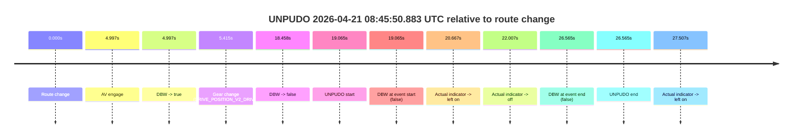
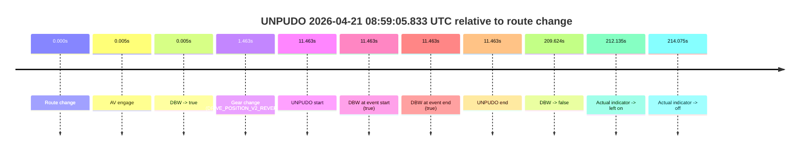
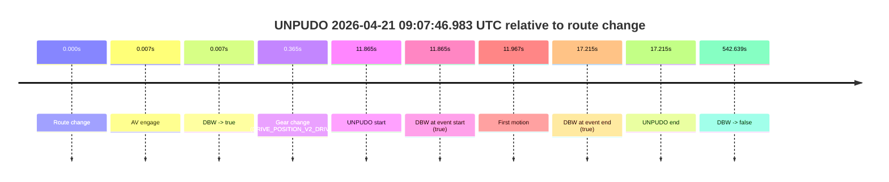
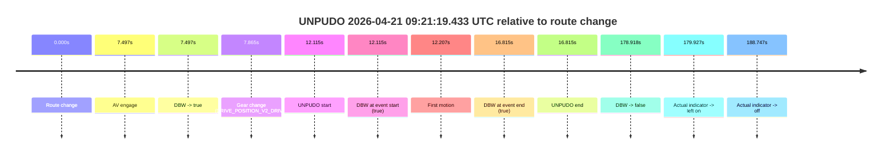
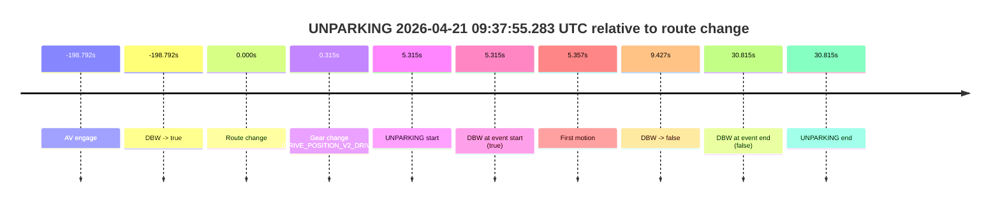

# Run Report: fme20031/2026-04-21--08-38-33--gen2-av-06e51cdb-6c4f-452c-9972-f5a2806c88db

| Field | Value |
|---|---|
| Run ID | `fme20031/2026-04-21--08-38-33--gen2-av-06e51cdb-6c4f-452c-9972-f5a2806c88db` |
| Date | `2026-04-21` |
| Model(s) | `eel-teal-outspoken` |
| Author | `zak` |
| Event count | `6` |

## unpudo 2026-04-21 08:45:50.883 UTC

| Field | Value |
|---|---|
| Model | `eel-teal-outspoken` |
| Author | `zak` |
| Run ID | `fme20031/2026-04-21--08-38-33--gen2-av-06e51cdb-6c4f-452c-9972-f5a2806c88db` |
| Date | `2026-04-21` |
| Time (UTC) | `08:45:50.883` |
| Event type | `unpudo` |
| Disengagement type | `failed_to_unpudo` |
| Route change | `found` |
| Console | [run](https://console.sso.wayve.ai/run/fme20031/2026-04-21--08-38-33--gen2-av-06e51cdb-6c4f-452c-9972-f5a2806c88db?id=&time-unixus=1776761150883302) |
| Foxglove | [segment](https://app.foxglove.dev/wayve-on-prem/p/prj_0dX18KZdVHg1fmmI/view?ds=foxglove-stream&ds.deviceName=fme20031&ds.start=2026-04-21T08%3A45%3A21.818263Z&ds.end=2026-04-21T08%3A46%3A08.383296Z&layoutId=lay_0e7VD4WIKDQGU73Y&time=2026-04-21T08%3A45%3A50.883302Z) |

### Event card: fail

- Fail: AV owns part of the segment, but the event still resolves as a model-performance failure under the AV-only scoring rule.

| Event | Time (UTC) | Delta from route change |
|---|---:|---:|
| Route change | 2026-04-21 08:45:31.818 | `0.000s` |
| AV engage | 2026-04-21 08:45:36.815 | `4.997s` |
| DBW -> true | 2026-04-21 08:45:36.815 | `4.997s` |
| Gear change (DRIVE_POSITION_V2_DRIVE) | 2026-04-21 08:45:37.233 | `5.415s` |
| DBW -> false | 2026-04-21 08:45:50.275 | `18.458s` |
| UNPUDO start | 2026-04-21 08:45:50.883 | `19.065s` |
| DBW at event start (false) | 2026-04-21 08:45:50.883 | `19.065s` |
| Actual indicator -> left on | 2026-04-21 08:45:52.485 | `20.667s` |
| Actual indicator -> off | 2026-04-21 08:45:53.825 | `22.007s` |
| DBW at event end (false) | 2026-04-21 08:45:58.383 | `26.565s` |
| UNPUDO end | 2026-04-21 08:45:58.383 | `26.565s` |
| Actual indicator -> left on | 2026-04-21 08:45:59.325 | `27.507s` |

| Metric | Value |
|---|---|
| Outcome | `fail` |
| Effective failure type | `failed_to_unpudo` |
| Route change status | `found` |
| DBW at event start | `false` |
| DBW at event end | `false` |
| Predicted gear at AV start | `DRIVE_POSITION_V2_DRIVE` |
| Actual gear at AV start | `DRIVE_POSITION_V2_PARK` |
| Predicted gear at event start | `DRIVE_POSITION_V2_DRIVE` |
| Actual gear at event start | `DRIVE_POSITION_V2_DRIVE` |
| Planned indicator direction | `INDICATORS_STATE_V2_LEFT_ON` |
| Controller indicator direction | `INDICATORS_STATE_V2_LEFT_ON` |
| Actual indicator direction | `INDICATORS_STATE_V2_OFF` |
| Actual indicator at maneuver end | `INDICATORS_STATE_V2_OFF` |
| Driver accel help in AV | `false` |
| Driver accel help timestamp | `n/a` |
| Max accel pedal pct in AV | `0.0%` |
| Max brake pedal pct in AV | `10.4%` |
| Max speed mps in AV | `0.000` |
| Success timing baseline | `route change` |
| Route -> AV | `4.997s` |
| AV -> event start | `14.068s` |
| AV -> first motion | `n/a` |
| Success baseline -> event start | `19.065s` |
| Success baseline -> first motion | `n/a` |
| AV duration before disengagement | `13.460s` |
| Trajectory waypoint count | `36` |
| Driving-plan step count | `11` |

The scored portion starts from the AV-owned window, not from the pre-AV setup. Route-change search in the stopped pre-event segment was `found`, with the baseline therefore set to route change. At the event anchor the model predicts `DRIVE_POSITION_V2_DRIVE` and the actual gear is `DRIVE_POSITION_V2_DRIVE`. The effective model outcome is `fail` because `failed_to_unpudo.`

### Resolution

| Field | Value |
|---|---|
| Final outcome | `fail` |
| Do we agree with this label? | `yes` |
| Source disengagement type | `failed_to_unpudo` |
| Resolved effective failure type | `failed_to_unpudo` |
| Confidence | `high` |

## unpudo 2026-04-21 08:59:05.833 UTC

| Field | Value |
|---|---|
| Model | `eel-teal-outspoken` |
| Author | `zak` |
| Run ID | `fme20031/2026-04-21--08-38-33--gen2-av-06e51cdb-6c4f-452c-9972-f5a2806c88db` |
| Date | `2026-04-21` |
| Time (UTC) | `08:59:05.833` |
| Event type | `unpudo` |
| Disengagement type | `none observed` |
| Route change | `found` |
| Console | [run](https://console.sso.wayve.ai/run/fme20031/2026-04-21--08-38-33--gen2-av-06e51cdb-6c4f-452c-9972-f5a2806c88db?id=&time-unixus=1776761945833303) |
| Foxglove | [segment](https://app.foxglove.dev/wayve-on-prem/p/prj_0dX18KZdVHg1fmmI/view?ds=foxglove-stream&ds.deviceName=fme20031&ds.start=2026-04-21T08%3A58%3A44.370697Z&ds.end=2026-04-21T09%3A02%3A33.994732Z&layoutId=lay_0e7VD4WIKDQGU73Y&time=2026-04-21T08%3A59%3A05.833303Z) |

### Event card: fail

- Fail: AV owns part of the segment, but the event still resolves as a model-performance failure under the AV-only scoring rule.

| Event | Time (UTC) | Delta from route change |
|---|---:|---:|
| Route change | 2026-04-21 08:58:54.370 | `0.000s` |
| AV engage | 2026-04-21 08:58:54.375 | `0.005s` |
| DBW -> true | 2026-04-21 08:58:54.375 | `0.005s` |
| Gear change (DRIVE_POSITION_V2_REVERSE) | 2026-04-21 08:58:55.833 | `1.463s` |
| UNPUDO start | 2026-04-21 08:59:05.833 | `11.463s` |
| DBW at event start (true) | 2026-04-21 08:59:05.833 | `11.463s` |
| DBW at event end (true) | 2026-04-21 08:59:05.833 | `11.463s` |
| UNPUDO end | 2026-04-21 08:59:05.833 | `11.463s` |
| DBW -> false | 2026-04-21 09:02:23.994 | `209.624s` |
| Actual indicator -> left on | 2026-04-21 09:02:26.505 | `212.135s` |
| Actual indicator -> off | 2026-04-21 09:02:28.445 | `214.075s` |

| Metric | Value |
|---|---|
| Outcome | `fail` |
| Effective failure type | `unknown_needs_review` |
| Route change status | `found` |
| DBW at event start | `true` |
| DBW at event end | `true` |
| Predicted gear at AV start | `DRIVE_POSITION_V2_PARK` |
| Actual gear at AV start | `DRIVE_POSITION_V2_PARK` |
| Predicted gear at event start | `DRIVE_POSITION_V2_REVERSE` |
| Actual gear at event start | `DRIVE_POSITION_V2_REVERSE` |
| Planned indicator direction | `INDICATORS_STATE_V2_OFF` |
| Controller indicator direction | `INDICATORS_STATE_V2_OFF` |
| Actual indicator direction | `INDICATORS_STATE_V2_OFF` |
| Actual indicator at maneuver end | `INDICATORS_STATE_V2_OFF` |
| Driver accel help in AV | `false` |
| Driver accel help timestamp | `n/a` |
| Max accel pedal pct in AV | `0.0%` |
| Max brake pedal pct in AV | `8.0%` |
| Max speed mps in AV | `0.000` |
| Success timing baseline | `route change` |
| Route -> AV | `0.005s` |
| AV -> event start | `11.458s` |
| AV -> first motion | `n/a` |
| Success baseline -> event start | `11.463s` |
| Success baseline -> first motion | `n/a` |
| AV duration before disengagement | `209.619s` |
| Trajectory waypoint count | `37` |
| Driving-plan step count | `11` |

The scored portion starts from the AV-owned window, not from the pre-AV setup. Route-change search in the stopped pre-event segment was `found`, with the baseline therefore set to route change. At the event anchor the model predicts `DRIVE_POSITION_V2_REVERSE` and the actual gear is `DRIVE_POSITION_V2_REVERSE`. The effective model outcome is `fail` because `unknown_needs_review.`

### Resolution

| Field | Value |
|---|---|
| Final outcome | `fail` |
| Do we agree with this label? | `yes` |
| Source disengagement type | `none observed` |
| Resolved effective failure type | `unknown_needs_review` |
| Confidence | `high` |

## unpudo 2026-04-21 09:04:25.583 UTC

| Field | Value |
|---|---|
| Model | `eel-teal-outspoken` |
| Author | `zak` |
| Run ID | `fme20031/2026-04-21--08-38-33--gen2-av-06e51cdb-6c4f-452c-9972-f5a2806c88db` |
| Date | `2026-04-21` |
| Time (UTC) | `09:04:25.583` |
| Event type | `unpudo` |
| Disengagement type | `none observed` |
| Route change | `found` |
| Console | [run](https://console.sso.wayve.ai/run/fme20031/2026-04-21--08-38-33--gen2-av-06e51cdb-6c4f-452c-9972-f5a2806c88db?id=&time-unixus=1776762265583309) |
| Foxglove | [segment](https://app.foxglove.dev/wayve-on-prem/p/prj_0dX18KZdVHg1fmmI/view?ds=foxglove-stream&ds.deviceName=fme20031&ds.start=2026-04-21T09%3A03%3A56.918347Z&ds.end=2026-04-21T09%3A16%3A47.757266Z&layoutId=lay_0e7VD4WIKDQGU73Y&time=2026-04-21T09%3A04%3A25.583309Z) |

### Event card: pass

- Pass: AV owns the credited unpudo from route change through the official unpudo window, the gear state is aligned at the anchor, and the vehicle moves without driver accelerator help in AV.

| Event | Time (UTC) | Delta from route change |
|---|---:|---:|
| Route change | 2026-04-21 09:04:06.918 | `0.000s` |
| AV engage | 2026-04-21 09:04:06.925 | `0.007s` |
| DBW -> true | 2026-04-21 09:04:06.925 | `0.007s` |
| Gear change (DRIVE_POSITION_V2_DRIVE) | 2026-04-21 09:04:07.283 | `0.365s` |
| UNPUDO start | 2026-04-21 09:04:25.583 | `18.665s` |
| DBW at event start (true) | 2026-04-21 09:04:25.583 | `18.665s` |
| First motion | 2026-04-21 09:04:25.605 | `18.687s` |
| DBW at event end (true) | 2026-04-21 09:04:29.933 | `23.015s` |
| UNPUDO end | 2026-04-21 09:04:29.933 | `23.015s` |
| DBW -> false | 2026-04-21 09:16:37.757 | `750.839s` |

| Metric | Value |
|---|---|
| Outcome | `pass` |
| Effective failure type | `none` |
| Route change status | `found` |
| DBW at event start | `true` |
| DBW at event end | `true` |
| Predicted gear at AV start | `DRIVE_POSITION_V2_PARK` |
| Actual gear at AV start | `DRIVE_POSITION_V2_PARK` |
| Predicted gear at event start | `DRIVE_POSITION_V2_DRIVE` |
| Actual gear at event start | `DRIVE_POSITION_V2_DRIVE` |
| Planned indicator direction | `INDICATORS_STATE_V2_RIGHT_ON` |
| Controller indicator direction | `INDICATORS_STATE_V2_RIGHT_ON` |
| Actual indicator direction | `INDICATORS_STATE_V2_OFF` |
| Actual indicator at maneuver end | `INDICATORS_STATE_V2_OFF` |
| Driver accel help in AV | `false` |
| Driver accel help timestamp | `n/a` |
| Max accel pedal pct in AV | `0.0%` |
| Max brake pedal pct in AV | `8.0%` |
| Max speed mps in AV | `4.406` |
| Success timing baseline | `route change` |
| Route -> AV | `0.007s` |
| AV -> event start | `18.658s` |
| AV -> first motion | `18.680s` |
| Success baseline -> event start | `18.665s` |
| Success baseline -> first motion | `18.687s` |
| AV duration before disengagement | `750.832s` |
| Trajectory waypoint count | `36` |
| Driving-plan step count | `11` |

The scored portion starts from the AV-owned window, not from the pre-AV setup. Route-change search in the stopped pre-event segment was `found`, with the baseline therefore set to route change. At the event anchor the model predicts `DRIVE_POSITION_V2_DRIVE` and the actual gear is `DRIVE_POSITION_V2_DRIVE`. The effective model outcome is `pass` because `the credited unpudo stays AV-owned through the official unpudo window.`

### Resolution

| Field | Value |
|---|---|
| Final outcome | `pass` |
| Do we agree with this label? | `yes` |
| Source disengagement type | `none observed` |
| Resolved effective failure type | `none` |
| Confidence | `high` |

## unpudo 2026-04-21 09:07:46.983 UTC

| Field | Value |
|---|---|
| Model | `eel-teal-outspoken` |
| Author | `zak` |
| Run ID | `fme20031/2026-04-21--08-38-33--gen2-av-06e51cdb-6c4f-452c-9972-f5a2806c88db` |
| Date | `2026-04-21` |
| Time (UTC) | `09:07:46.983` |
| Event type | `unpudo` |
| Disengagement type | `none observed` |
| Route change | `found` |
| Console | [run](https://console.sso.wayve.ai/run/fme20031/2026-04-21--08-38-33--gen2-av-06e51cdb-6c4f-452c-9972-f5a2806c88db?id=&time-unixus=1776762466983316) |
| Foxglove | [segment](https://app.foxglove.dev/wayve-on-prem/p/prj_0dX18KZdVHg1fmmI/view?ds=foxglove-stream&ds.deviceName=fme20031&ds.start=2026-04-21T09%3A07%3A25.118440Z&ds.end=2026-04-21T09%3A16%3A47.757266Z&layoutId=lay_0e7VD4WIKDQGU73Y&time=2026-04-21T09%3A07%3A46.983316Z) |

### Event card: pass

- Pass: AV owns the credited unpudo from route change through the official unpudo window, the gear state is aligned at the anchor, and the vehicle moves without driver accelerator help in AV.

| Event | Time (UTC) | Delta from route change |
|---|---:|---:|
| Route change | 2026-04-21 09:07:35.118 | `0.000s` |
| AV engage | 2026-04-21 09:07:35.125 | `0.007s` |
| DBW -> true | 2026-04-21 09:07:35.125 | `0.007s` |
| Gear change (DRIVE_POSITION_V2_DRIVE) | 2026-04-21 09:07:35.483 | `0.365s` |
| UNPUDO start | 2026-04-21 09:07:46.983 | `11.865s` |
| DBW at event start (true) | 2026-04-21 09:07:46.983 | `11.865s` |
| First motion | 2026-04-21 09:07:47.085 | `11.967s` |
| DBW at event end (true) | 2026-04-21 09:07:52.333 | `17.215s` |
| UNPUDO end | 2026-04-21 09:07:52.333 | `17.215s` |
| DBW -> false | 2026-04-21 09:16:37.757 | `542.639s` |

| Metric | Value |
|---|---|
| Outcome | `pass` |
| Effective failure type | `none` |
| Route change status | `found` |
| DBW at event start | `true` |
| DBW at event end | `true` |
| Predicted gear at AV start | `DRIVE_POSITION_V2_PARK` |
| Actual gear at AV start | `DRIVE_POSITION_V2_PARK` |
| Predicted gear at event start | `DRIVE_POSITION_V2_DRIVE` |
| Actual gear at event start | `DRIVE_POSITION_V2_DRIVE` |
| Planned indicator direction | `INDICATORS_STATE_V2_RIGHT_ON` |
| Controller indicator direction | `INDICATORS_STATE_V2_RIGHT_ON` |
| Actual indicator direction | `INDICATORS_STATE_V2_OFF` |
| Actual indicator at maneuver end | `INDICATORS_STATE_V2_OFF` |
| Driver accel help in AV | `false` |
| Driver accel help timestamp | `n/a` |
| Max accel pedal pct in AV | `0.0%` |
| Max brake pedal pct in AV | `8.0%` |
| Max speed mps in AV | `2.914` |
| Success timing baseline | `route change` |
| Route -> AV | `0.007s` |
| AV -> event start | `11.858s` |
| AV -> first motion | `11.960s` |
| Success baseline -> event start | `11.865s` |
| Success baseline -> first motion | `11.967s` |
| AV duration before disengagement | `542.632s` |
| Trajectory waypoint count | `36` |
| Driving-plan step count | `11` |

The scored portion starts from the AV-owned window, not from the pre-AV setup. Route-change search in the stopped pre-event segment was `found`, with the baseline therefore set to route change. At the event anchor the model predicts `DRIVE_POSITION_V2_DRIVE` and the actual gear is `DRIVE_POSITION_V2_DRIVE`. The effective model outcome is `pass` because `the credited unpudo stays AV-owned through the official unpudo window.`

### Resolution

| Field | Value |
|---|---|
| Final outcome | `pass` |
| Do we agree with this label? | `yes` |
| Source disengagement type | `none observed` |
| Resolved effective failure type | `none` |
| Confidence | `high` |

## unpudo 2026-04-21 09:21:19.433 UTC

| Field | Value |
|---|---|
| Model | `eel-teal-outspoken` |
| Author | `zak` |
| Run ID | `fme20031/2026-04-21--08-38-33--gen2-av-06e51cdb-6c4f-452c-9972-f5a2806c88db` |
| Date | `2026-04-21` |
| Time (UTC) | `09:21:19.433` |
| Event type | `unpudo` |
| Disengagement type | `none observed` |
| Route change | `found` |
| Console | [run](https://console.sso.wayve.ai/run/fme20031/2026-04-21--08-38-33--gen2-av-06e51cdb-6c4f-452c-9972-f5a2806c88db?id=&time-unixus=1776763279433315) |
| Foxglove | [segment](https://app.foxglove.dev/wayve-on-prem/p/prj_0dX18KZdVHg1fmmI/view?ds=foxglove-stream&ds.deviceName=fme20031&ds.start=2026-04-21T09%3A20%3A57.318409Z&ds.end=2026-04-21T09%3A24%3A16.236682Z&layoutId=lay_0e7VD4WIKDQGU73Y&time=2026-04-21T09%3A21%3A19.433315Z) |

### Event card: pass

- Pass: AV owns the credited unpudo from route change through the official unpudo window, the gear state is aligned at the anchor, and the vehicle moves without driver accelerator help in AV.

| Event | Time (UTC) | Delta from route change |
|---|---:|---:|
| Route change | 2026-04-21 09:21:07.318 | `0.000s` |
| AV engage | 2026-04-21 09:21:14.815 | `7.497s` |
| DBW -> true | 2026-04-21 09:21:14.815 | `7.497s` |
| Gear change (DRIVE_POSITION_V2_DRIVE) | 2026-04-21 09:21:15.183 | `7.865s` |
| UNPUDO start | 2026-04-21 09:21:19.433 | `12.115s` |
| DBW at event start (true) | 2026-04-21 09:21:19.433 | `12.115s` |
| First motion | 2026-04-21 09:21:19.525 | `12.207s` |
| DBW at event end (true) | 2026-04-21 09:21:24.133 | `16.815s` |
| UNPUDO end | 2026-04-21 09:21:24.133 | `16.815s` |
| DBW -> false | 2026-04-21 09:24:06.236 | `178.918s` |
| Actual indicator -> left on | 2026-04-21 09:24:07.244 | `179.927s` |
| Actual indicator -> off | 2026-04-21 09:24:16.065 | `188.747s` |

| Metric | Value |
|---|---|
| Outcome | `pass` |
| Effective failure type | `none` |
| Route change status | `found` |
| DBW at event start | `true` |
| DBW at event end | `true` |
| Predicted gear at AV start | `DRIVE_POSITION_V2_DRIVE` |
| Actual gear at AV start | `DRIVE_POSITION_V2_PARK` |
| Predicted gear at event start | `DRIVE_POSITION_V2_DRIVE` |
| Actual gear at event start | `DRIVE_POSITION_V2_DRIVE` |
| Planned indicator direction | `INDICATORS_STATE_V2_RIGHT_ON` |
| Controller indicator direction | `INDICATORS_STATE_V2_RIGHT_ON` |
| Actual indicator direction | `INDICATORS_STATE_V2_OFF` |
| Actual indicator at maneuver end | `INDICATORS_STATE_V2_OFF` |
| Driver accel help in AV | `false` |
| Driver accel help timestamp | `n/a` |
| Max accel pedal pct in AV | `0.0%` |
| Max brake pedal pct in AV | `8.0%` |
| Max speed mps in AV | `4.019` |
| Success timing baseline | `route change` |
| Route -> AV | `7.497s` |
| AV -> event start | `4.618s` |
| AV -> first motion | `4.710s` |
| Success baseline -> event start | `12.115s` |
| Success baseline -> first motion | `12.207s` |
| AV duration before disengagement | `171.421s` |
| Trajectory waypoint count | `37` |
| Driving-plan step count | `11` |

The scored portion starts from the AV-owned window, not from the pre-AV setup. Route-change search in the stopped pre-event segment was `found`, with the baseline therefore set to route change. At the event anchor the model predicts `DRIVE_POSITION_V2_DRIVE` and the actual gear is `DRIVE_POSITION_V2_DRIVE`. The effective model outcome is `pass` because `the credited unpudo stays AV-owned through the official unpudo window.`

### Resolution

| Field | Value |
|---|---|
| Final outcome | `pass` |
| Do we agree with this label? | `yes` |
| Source disengagement type | `none observed` |
| Resolved effective failure type | `none` |
| Confidence | `high` |

## unparking 2026-04-21 09:37:55.283 UTC

| Field | Value |
|---|---|
| Model | `eel-teal-outspoken` |
| Author | `zak` |
| Run ID | `fme20031/2026-04-21--08-38-33--gen2-av-06e51cdb-6c4f-452c-9972-f5a2806c88db` |
| Date | `2026-04-21` |
| Time (UTC) | `09:37:55.283` |
| Event type | `unparking` |
| Disengagement type | `failed_to_slow` |
| Route change | `found` |
| Console | [run](https://console.sso.wayve.ai/run/fme20031/2026-04-21--08-38-33--gen2-av-06e51cdb-6c4f-452c-9972-f5a2806c88db?id=&time-unixus=1776764275283321) |
| Foxglove | [segment](https://app.foxglove.dev/wayve-on-prem/p/prj_0dX18KZdVHg1fmmI/view?ds=foxglove-stream&ds.deviceName=fme20031&ds.start=2026-04-21T09%3A34%3A21.176160Z&ds.end=2026-04-21T09%3A38%3A30.783323Z&layoutId=lay_0e7VD4WIKDQGU73Y&time=2026-04-21T09%3A37%3A55.283321Z) |

### Event card: fail

- Fail: AV owns part of the segment, but the event still resolves as a model-performance failure under the AV-only scoring rule.

| Event | Time (UTC) | Delta from route change |
|---|---:|---:|
| AV engage | 2026-04-21 09:34:31.176 | `-198.792s` |
| DBW -> true | 2026-04-21 09:34:31.176 | `-198.792s` |
| Route change | 2026-04-21 09:37:49.968 | `0.000s` |
| Gear change (DRIVE_POSITION_V2_DRIVE) | 2026-04-21 09:37:50.283 | `0.315s` |
| UNPARKING start | 2026-04-21 09:37:55.283 | `5.315s` |
| DBW at event start (true) | 2026-04-21 09:37:55.283 | `5.315s` |
| First motion | 2026-04-21 09:37:55.325 | `5.357s` |
| DBW -> false | 2026-04-21 09:37:59.395 | `9.427s` |
| DBW at event end (false) | 2026-04-21 09:38:20.783 | `30.815s` |
| UNPARKING end | 2026-04-21 09:38:20.783 | `30.815s` |

| Metric | Value |
|---|---|
| Outcome | `fail` |
| Effective failure type | `failed_to_slow` |
| Route change status | `found` |
| DBW at event start | `true` |
| DBW at event end | `false` |
| Predicted gear at AV start | `DRIVE_POSITION_V2_DRIVE` |
| Actual gear at AV start | `DRIVE_POSITION_V2_DRIVE` |
| Predicted gear at event start | `DRIVE_POSITION_V2_DRIVE` |
| Actual gear at event start | `DRIVE_POSITION_V2_DRIVE` |
| Planned indicator direction | `INDICATORS_STATE_V2_RIGHT_ON` |
| Controller indicator direction | `INDICATORS_STATE_V2_RIGHT_ON` |
| Actual indicator direction | `INDICATORS_STATE_V2_OFF` |
| Actual indicator at maneuver end | `INDICATORS_STATE_V2_OFF` |
| Driver accel help in AV | `false` |
| Driver accel help timestamp | `n/a` |
| Max accel pedal pct in AV | `0.0%` |
| Max brake pedal pct in AV | `0.0%` |
| Max speed mps in AV | `1.622` |
| Success timing baseline | `AV start` |
| Route -> AV | `-198.792s` |
| AV -> event start | `204.107s` |
| AV -> first motion | `204.149s` |
| Success baseline -> event start | `204.107s` |
| Success baseline -> first motion | `204.149s` |
| AV duration before disengagement | `208.219s` |
| Trajectory waypoint count | `36` |
| Driving-plan step count | `11` |

The scored portion starts from the AV-owned window, not from the pre-AV setup. Route-change search in the stopped pre-event segment was `found`, with the baseline therefore set to route change. At the event anchor the model predicts `DRIVE_POSITION_V2_DRIVE` and the actual gear is `DRIVE_POSITION_V2_DRIVE`. The effective model outcome is `fail` because `failed_to_slow.`

### Resolution

| Field | Value |
|---|---|
| Final outcome | `fail` |
| Do we agree with this label? | `yes` |
| Source disengagement type | `failed_to_slow` |
| Resolved effective failure type | `failed_to_slow` |
| Confidence | `high` |
