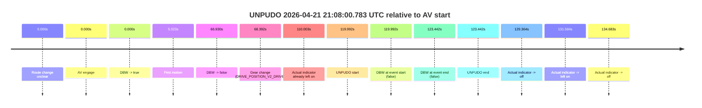
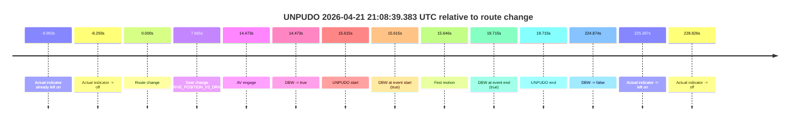
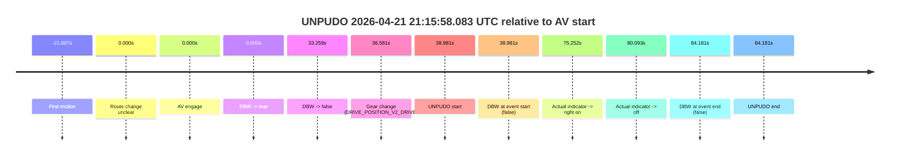
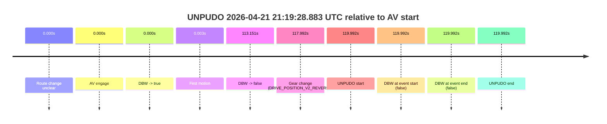

# Run Report: fme20031/2026-04-21--20-55-03--gen2-av-6012f067-7eac-4c54-af80-fe1b295980aa

| Field | Value |
|---|---|
| Run ID | `fme20031/2026-04-21--20-55-03--gen2-av-6012f067-7eac-4c54-af80-fe1b295980aa` |
| Date | `2026-04-21` |
| Model(s) | `pink-manta-ray-smooth` |
| Author | `guy.geva` |
| Event count | `4` |

## unpudo 2026-04-21 21:08:00.783 UTC

| Field | Value |
|---|---|
| Model | `pink-manta-ray-smooth` |
| Author | `guy.geva` |
| Run ID | `fme20031/2026-04-21--20-55-03--gen2-av-6012f067-7eac-4c54-af80-fe1b295980aa` |
| Date | `2026-04-21` |
| Time (UTC) | `21:08:00.783` |
| Event type | `unpudo` |
| Disengagement type | `none observed` |
| Route change | `unclear` |
| Console | [run](https://console.sso.wayve.ai/run/fme20031/2026-04-21--20-55-03--gen2-av-6012f067-7eac-4c54-af80-fe1b295980aa?id=&time-unixus=1776805680783311) |
| Foxglove | [segment](https://app.foxglove.dev/wayve-on-prem/p/prj_0dX18KZdVHg1fmmI/view?ds=foxglove-stream&ds.deviceName=fme20031&ds.start=2026-04-21T21%3A05%3A50.791557Z&ds.end=2026-04-21T21%3A08%3A14.233321Z&layoutId=lay_0e7VD4WIKDQGU73Y&time=2026-04-21T21%3A08%3A00.783311Z) |

### Event card: fail

- Fail: the credited unpudo does not stay AV-owned. The event window starts with DBW false, and the maneuver outcome lands outside a clean AV-owned segment.

| Event | Time (UTC) | Delta from AV start |
|---|---:|---:|
| Route change unclear | 2026-04-21 21:06:00.791 | `0.000s` |
| AV engage | 2026-04-21 21:06:00.791 | `0.000s` |
| DBW -> true | 2026-04-21 21:06:00.791 | `0.000s` |
| First motion | 2026-04-21 21:06:05.814 | `5.023s` |
| DBW -> false | 2026-04-21 21:07:07.721 | `66.930s` |
| Gear change (DRIVE_POSITION_V2_DRIVE) | 2026-04-21 21:07:09.183 | `68.392s` |
| Actual indicator already left on | 2026-04-21 21:07:50.794 | `110.003s` |
| UNPUDO start | 2026-04-21 21:08:00.783 | `119.992s` |
| DBW at event start (false) | 2026-04-21 21:08:00.783 | `119.992s` |
| DBW at event end (false) | 2026-04-21 21:08:04.233 | `123.442s` |
| UNPUDO end | 2026-04-21 21:08:04.233 | `123.442s` |
| Actual indicator -> off | 2026-04-21 21:08:10.155 | `129.364s` |
| Actual indicator -> left on | 2026-04-21 21:08:12.375 | `131.584s` |
| Actual indicator -> off | 2026-04-21 21:08:15.474 | `134.683s` |

| Metric | Value |
|---|---|
| Outcome | `fail` |
| Effective failure type | `not_av_owned` |
| Route change status | `unclear` |
| DBW at event start | `false` |
| DBW at event end | `false` |
| Predicted gear at AV start | `DRIVE_POSITION_V2_DRIVE` |
| Actual gear at AV start | `DRIVE_POSITION_V2_DRIVE` |
| Predicted gear at event start | `DRIVE_POSITION_V2_DRIVE` |
| Actual gear at event start | `DRIVE_POSITION_V2_DRIVE` |
| Planned indicator direction | `INDICATORS_STATE_V2_OFF` |
| Controller indicator direction | `INDICATORS_STATE_V2_OFF` |
| Actual indicator direction | `INDICATORS_STATE_V2_LEFT_ON` |
| Actual indicator at maneuver end | `INDICATORS_STATE_V2_LEFT_ON` |
| Driver accel help in AV | `false` |
| Driver accel help timestamp | `n/a` |
| Max accel pedal pct in AV | `0.0%` |
| Max brake pedal pct in AV | `8.5%` |
| Max speed mps in AV | `7.672` |
| Success timing baseline | `AV start` |
| Route -> AV | `n/a` |
| AV -> event start | `119.992s` |
| AV -> first motion | `5.023s` |
| Success baseline -> event start | `119.992s` |
| Success baseline -> first motion | `5.023s` |
| AV duration before disengagement | `66.930s` |
| Trajectory waypoint count | `37` |
| Driving-plan step count | `11` |

The scored portion starts from the AV-owned window, not from the pre-AV setup. Route-change search in the stopped pre-event segment was `unclear`, with the baseline therefore set to AV start. At the event anchor the model predicts `DRIVE_POSITION_V2_DRIVE` and the actual gear is `DRIVE_POSITION_V2_DRIVE`. The effective model outcome is `fail` because `not_av_owned.`

### Resolution

| Field | Value |
|---|---|
| Final outcome | `fail` |
| Do we agree with this label? | `yes` |
| Source disengagement type | `none observed` |
| Resolved effective failure type | `not_av_owned` |
| Confidence | `medium` |

## unpudo 2026-04-21 21:08:39.383 UTC

| Field | Value |
|---|---|
| Model | `pink-manta-ray-smooth` |
| Author | `guy.geva` |
| Run ID | `fme20031/2026-04-21--20-55-03--gen2-av-6012f067-7eac-4c54-af80-fe1b295980aa` |
| Date | `2026-04-21` |
| Time (UTC) | `21:08:39.383` |
| Event type | `unpudo` |
| Disengagement type | `none observed` |
| Route change | `found` |
| Console | [run](https://console.sso.wayve.ai/run/fme20031/2026-04-21--20-55-03--gen2-av-6012f067-7eac-4c54-af80-fe1b295980aa?id=&time-unixus=1776805719383317) |
| Foxglove | [segment](https://app.foxglove.dev/wayve-on-prem/p/prj_0dX18KZdVHg1fmmI/view?ds=foxglove-stream&ds.deviceName=fme20031&ds.start=2026-04-21T21%3A08%3A13.768372Z&ds.end=2026-04-21T21%3A12%3A18.642316Z&layoutId=lay_0e7VD4WIKDQGU73Y&time=2026-04-21T21%3A08%3A39.383317Z) |

### Event card: pass

- Pass: AV owns the credited unpudo from route change through the official unpudo window, the gear state is aligned at the anchor, and the vehicle moves without driver accelerator help in AV.

| Event | Time (UTC) | Delta from route change |
|---|---:|---:|
| Actual indicator already left on | 2026-04-21 21:08:13.774 | `-9.993s` |
| Actual indicator -> off | 2026-04-21 21:08:15.474 | `-8.293s` |
| Route change | 2026-04-21 21:08:23.768 | `0.000s` |
| Gear change (DRIVE_POSITION_V2_DRIVE) | 2026-04-21 21:08:31.433 | `7.665s` |
| AV engage | 2026-04-21 21:08:38.241 | `14.473s` |
| DBW -> true | 2026-04-21 21:08:38.241 | `14.473s` |
| UNPUDO start | 2026-04-21 21:08:39.383 | `15.615s` |
| DBW at event start (true) | 2026-04-21 21:08:39.383 | `15.615s` |
| First motion | 2026-04-21 21:08:39.414 | `15.646s` |
| DBW at event end (true) | 2026-04-21 21:08:43.483 | `19.715s` |
| UNPUDO end | 2026-04-21 21:08:43.483 | `19.715s` |
| DBW -> false | 2026-04-21 21:12:08.642 | `224.874s` |
| Actual indicator -> left on | 2026-04-21 21:12:09.155 | `225.387s` |
| Actual indicator -> off | 2026-04-21 21:12:12.594 | `228.826s` |

| Metric | Value |
|---|---|
| Outcome | `pass` |
| Effective failure type | `none` |
| Route change status | `found` |
| DBW at event start | `true` |
| DBW at event end | `true` |
| Predicted gear at AV start | `DRIVE_POSITION_V2_DRIVE` |
| Actual gear at AV start | `DRIVE_POSITION_V2_DRIVE` |
| Predicted gear at event start | `DRIVE_POSITION_V2_DRIVE` |
| Actual gear at event start | `DRIVE_POSITION_V2_DRIVE` |
| Planned indicator direction | `INDICATORS_STATE_V2_RIGHT_ON` |
| Controller indicator direction | `INDICATORS_STATE_V2_RIGHT_ON` |
| Actual indicator direction | `INDICATORS_STATE_V2_OFF` |
| Actual indicator at maneuver end | `INDICATORS_STATE_V2_OFF` |
| Driver accel help in AV | `false` |
| Driver accel help timestamp | `n/a` |
| Max accel pedal pct in AV | `0.0%` |
| Max brake pedal pct in AV | `8.0%` |
| Max speed mps in AV | `3.086` |
| Success timing baseline | `route change` |
| Route -> AV | `14.473s` |
| AV -> event start | `1.142s` |
| AV -> first motion | `1.173s` |
| Success baseline -> event start | `15.615s` |
| Success baseline -> first motion | `15.646s` |
| AV duration before disengagement | `210.401s` |
| Trajectory waypoint count | `37` |
| Driving-plan step count | `11` |

The scored portion starts from the AV-owned window, not from the pre-AV setup. Route-change search in the stopped pre-event segment was `found`, with the baseline therefore set to route change. At the event anchor the model predicts `DRIVE_POSITION_V2_DRIVE` and the actual gear is `DRIVE_POSITION_V2_DRIVE`. The effective model outcome is `pass` because `the credited unpudo stays AV-owned through the official unpudo window.`

### Resolution

| Field | Value |
|---|---|
| Final outcome | `pass` |
| Do we agree with this label? | `yes` |
| Source disengagement type | `none observed` |
| Resolved effective failure type | `none` |
| Confidence | `high` |

## unpudo 2026-04-21 21:15:58.083 UTC

| Field | Value |
|---|---|
| Model | `pink-manta-ray-smooth` |
| Author | `guy.geva` |
| Run ID | `fme20031/2026-04-21--20-55-03--gen2-av-6012f067-7eac-4c54-af80-fe1b295980aa` |
| Date | `2026-04-21` |
| Time (UTC) | `21:15:58.083` |
| Event type | `unpudo` |
| Disengagement type | `none observed` |
| Route change | `unclear` |
| Console | [run](https://console.sso.wayve.ai/run/fme20031/2026-04-21--20-55-03--gen2-av-6012f067-7eac-4c54-af80-fe1b295980aa?id=&time-unixus=1776806158083298) |
| Foxglove | [segment](https://app.foxglove.dev/wayve-on-prem/p/prj_0dX18KZdVHg1fmmI/view?ds=foxglove-stream&ds.deviceName=fme20031&ds.start=2026-04-21T21%3A15%3A09.102352Z&ds.end=2026-04-21T21%3A16%3A53.283305Z&layoutId=lay_0e7VD4WIKDQGU73Y&time=2026-04-21T21%3A15%3A58.083298Z) |

### Event card: fail

- Fail: the credited unpudo does not stay AV-owned. The event window starts with DBW false, and the maneuver outcome lands outside a clean AV-owned segment.

| Event | Time (UTC) | Delta from AV start |
|---|---:|---:|
| First motion | 2026-04-21 21:14:57.215 | `-21.887s` |
| Route change unclear | 2026-04-21 21:15:19.102 | `0.000s` |
| AV engage | 2026-04-21 21:15:19.102 | `0.000s` |
| DBW -> true | 2026-04-21 21:15:19.102 | `0.000s` |
| DBW -> false | 2026-04-21 21:15:52.361 | `33.259s` |
| Gear change (DRIVE_POSITION_V2_DRIVE) | 2026-04-21 21:15:55.683 | `36.581s` |
| UNPUDO start | 2026-04-21 21:15:58.083 | `38.981s` |
| DBW at event start (false) | 2026-04-21 21:15:58.083 | `38.981s` |
| Actual indicator -> right on | 2026-04-21 21:16:34.354 | `75.252s` |
| Actual indicator -> off | 2026-04-21 21:16:39.194 | `80.093s` |
| DBW at event end (false) | 2026-04-21 21:16:43.283 | `84.181s` |
| UNPUDO end | 2026-04-21 21:16:43.283 | `84.181s` |

| Metric | Value |
|---|---|
| Outcome | `fail` |
| Effective failure type | `completed_outside_av` |
| Route change status | `unclear` |
| DBW at event start | `false` |
| DBW at event end | `false` |
| Predicted gear at AV start | `DRIVE_POSITION_V2_DRIVE` |
| Actual gear at AV start | `DRIVE_POSITION_V2_DRIVE` |
| Predicted gear at event start | `DRIVE_POSITION_V2_DRIVE` |
| Actual gear at event start | `DRIVE_POSITION_V2_DRIVE` |
| Planned indicator direction | `INDICATORS_STATE_V2_OFF` |
| Controller indicator direction | `INDICATORS_STATE_V2_OFF` |
| Actual indicator direction | `INDICATORS_STATE_V2_OFF` |
| Actual indicator at maneuver end | `INDICATORS_STATE_V2_OFF` |
| Driver accel help in AV | `false` |
| Driver accel help timestamp | `n/a` |
| Max accel pedal pct in AV | `0.0%` |
| Max brake pedal pct in AV | `8.0%` |
| Max speed mps in AV | `7.722` |
| Success timing baseline | `AV start` |
| Route -> AV | `n/a` |
| AV -> event start | `38.981s` |
| AV -> first motion | `-21.887s` |
| Success baseline -> event start | `38.981s` |
| Success baseline -> first motion | `-21.887s` |
| AV duration before disengagement | `33.259s` |
| Trajectory waypoint count | `37` |
| Driving-plan step count | `11` |

The scored portion starts from the AV-owned window, not from the pre-AV setup. Route-change search in the stopped pre-event segment was `unclear`, with the baseline therefore set to AV start. At the event anchor the model predicts `DRIVE_POSITION_V2_DRIVE` and the actual gear is `DRIVE_POSITION_V2_DRIVE`. The effective model outcome is `fail` because `completed_outside_av.`

### Resolution

| Field | Value |
|---|---|
| Final outcome | `fail` |
| Do we agree with this label? | `yes` |
| Source disengagement type | `none observed` |
| Resolved effective failure type | `completed_outside_av` |
| Confidence | `medium` |

## unpudo 2026-04-21 21:19:28.883 UTC

| Field | Value |
|---|---|
| Model | `pink-manta-ray-smooth` |
| Author | `guy.geva` |
| Run ID | `fme20031/2026-04-21--20-55-03--gen2-av-6012f067-7eac-4c54-af80-fe1b295980aa` |
| Date | `2026-04-21` |
| Time (UTC) | `21:19:28.883` |
| Event type | `unpudo` |
| Disengagement type | `none observed` |
| Route change | `unclear` |
| Console | [run](https://console.sso.wayve.ai/run/fme20031/2026-04-21--20-55-03--gen2-av-6012f067-7eac-4c54-af80-fe1b295980aa?id=&time-unixus=1776806368883304) |
| Foxglove | [segment](https://app.foxglove.dev/wayve-on-prem/p/prj_0dX18KZdVHg1fmmI/view?ds=foxglove-stream&ds.deviceName=fme20031&ds.start=2026-04-21T21%3A17%3A18.891578Z&ds.end=2026-04-21T21%3A19%3A38.883304Z&layoutId=lay_0e7VD4WIKDQGU73Y&time=2026-04-21T21%3A19%3A28.883304Z) |

### Event card: fail

- Fail: the credited unpudo does not stay AV-owned. The event window starts with DBW false, and the maneuver outcome lands outside a clean AV-owned segment.

| Event | Time (UTC) | Delta from AV start |
|---|---:|---:|
| Route change unclear | 2026-04-21 21:17:28.891 | `0.000s` |
| AV engage | 2026-04-21 21:17:28.891 | `0.000s` |
| DBW -> true | 2026-04-21 21:17:28.891 | `0.000s` |
| First motion | 2026-04-21 21:17:28.894 | `0.003s` |
| DBW -> false | 2026-04-21 21:19:22.042 | `113.151s` |
| Gear change (DRIVE_POSITION_V2_REVERSE) | 2026-04-21 21:19:26.883 | `117.992s` |
| UNPUDO start | 2026-04-21 21:19:28.883 | `119.992s` |
| DBW at event start (false) | 2026-04-21 21:19:28.883 | `119.992s` |
| DBW at event end (false) | 2026-04-21 21:19:28.883 | `119.992s` |
| UNPUDO end | 2026-04-21 21:19:28.883 | `119.992s` |

| Metric | Value |
|---|---|
| Outcome | `fail` |
| Effective failure type | `not_av_owned` |
| Route change status | `unclear` |
| DBW at event start | `false` |
| DBW at event end | `false` |
| Predicted gear at AV start | `DRIVE_POSITION_V2_DRIVE` |
| Actual gear at AV start | `DRIVE_POSITION_V2_DRIVE` |
| Predicted gear at event start | `DRIVE_POSITION_V2_REVERSE` |
| Actual gear at event start | `DRIVE_POSITION_V2_REVERSE` |
| Planned indicator direction | `INDICATORS_STATE_V2_OFF` |
| Controller indicator direction | `INDICATORS_STATE_V2_OFF` |
| Actual indicator direction | `INDICATORS_STATE_V2_OFF` |
| Actual indicator at maneuver end | `INDICATORS_STATE_V2_OFF` |
| Driver accel help in AV | `false` |
| Driver accel help timestamp | `n/a` |
| Max accel pedal pct in AV | `0.0%` |
| Max brake pedal pct in AV | `11.5%` |
| Max speed mps in AV | `8.036` |
| Success timing baseline | `AV start` |
| Route -> AV | `n/a` |
| AV -> event start | `119.992s` |
| AV -> first motion | `0.003s` |
| Success baseline -> event start | `119.992s` |
| Success baseline -> first motion | `0.003s` |
| AV duration before disengagement | `113.151s` |
| Trajectory waypoint count | `37` |
| Driving-plan step count | `11` |

The scored portion starts from the AV-owned window, not from the pre-AV setup. Route-change search in the stopped pre-event segment was `unclear`, with the baseline therefore set to AV start. At the event anchor the model predicts `DRIVE_POSITION_V2_REVERSE` and the actual gear is `DRIVE_POSITION_V2_REVERSE`. The effective model outcome is `fail` because `not_av_owned.`

### Resolution

| Field | Value |
|---|---|
| Final outcome | `fail` |
| Do we agree with this label? | `yes` |
| Source disengagement type | `none observed` |
| Resolved effective failure type | `not_av_owned` |
| Confidence | `medium` |
