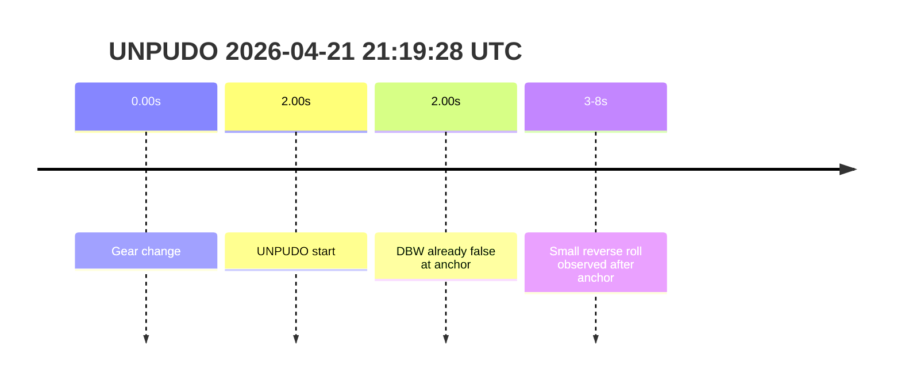
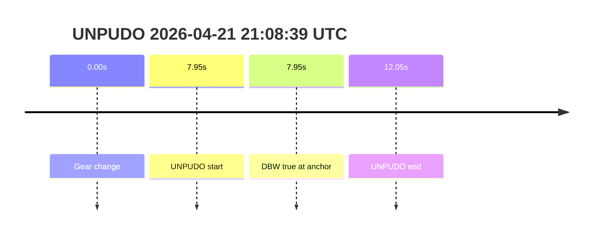

# Run Report: fme20031/2026-04-21--20-55-03--gen2-av-6012f067-7eac-4c54-af80-fe1b295980aa

| Field | Value |
|---|---|
| Run ID | `fme20031/2026-04-21--20-55-03--gen2-av-6012f067-7eac-4c54-af80-fe1b295980aa` |
| Date | `2026-04-21` |
| Model(s) | `pink-manta-ray-smooth` |

## unpudo 2026-04-21 21:19:28 UTC

| Field | Value |
|---|---|
| Model | `pink-manta-ray-smooth` |
| Author | `boris.indelman` |
| Run ID | `fme20031/2026-04-21--20-55-03--gen2-av-6012f067-7eac-4c54-af80-fe1b295980aa` |
| Date | `2026-04-21` |
| Time (UTC) | `21:19:28` |
| Event type | `unpudo` |
| Disengagement type | `none` |
| Console | [run](https://console.sso.wayve.ai/run/fme20031/2026-04-21--20-55-03--gen2-av-6012f067-7eac-4c54-af80-fe1b295980aa?id=&time-unixus=1776806368883304) |
| Foxglove | [segment](https://app.foxglove.dev/wayve-on-prem/p/prj_0dX18KZdVHg1fmmI/view?ds=foxglove-stream&ds.deviceName=fme20031&ds.end=2026-04-21T21%3A20%3A08.883Z&ds.start=2026-04-21T21%3A18%3A48.883Z&layoutId=lay_0e7VD4WIKDQGU73Y&time=2026-04-21T21%3A19%3A28.883Z) |

- Fail: the anchor lands after DBW ownership has already dropped out. `trajectory_controller_state.is_drive_by_wire` is `False` at the anchor, there is no detected UNPUDO end boundary, and the local vehicle trace rolls from near-zero speed into a small reverse drift rather than an AV-owned completion.

| Event | Time (UTC) | Delta from gear change |
|---|---:|---:|
| Gear change | 2026-04-21 21:19:26 | 0.00s |
| UNPUDO start | 2026-04-21 21:19:28 | 2.00s |
| UNPUDO end | not detected | n/a |

| Metric | Value |
|---|---|
| Scoring baseline | `event anchor / AV-start fallback (no validated route reassignment)` |
| Predicted gear at event start | `DRIVE_POSITION_V2_DRIVE` |
| Actual gear at event start | `DRIVE_POSITION_V2_DRIVE` |
| Trajectory DBW at anchor | `false` |
| Trajectory waypoint count | `36` |
| Driving plan step count | `11` |
| Event duration | `not materialized` |
| Gear change -> UNPUDO start | `2.00s` |
| Main disengagement flag | `0` |
| Gear-to-start disengagement | `0` |
| Before-gearchange-10s disengagement | `0` |

This looks like an interrupted or abandoned attempt rather than a completed AV-owned UNPUDO. The event table gives a clean gear-change-to-start interval, but the boundary never materializes and the anchor itself is already outside DBW ownership. The maneuver therefore should not be scored as a model-owned success.

## unpudo 2026-04-21 21:15:58 UTC

| Field | Value |
|---|---|
| Model | `pink-manta-ray-smooth` |
| Author | `boris.indelman` |
| Run ID | `fme20031/2026-04-21--20-55-03--gen2-av-6012f067-7eac-4c54-af80-fe1b295980aa` |
| Date | `2026-04-21` |
| Time (UTC) | `21:15:58` |
| Event type | `unpudo` |
| Disengagement type | `none` |
| Console | [run](https://console.sso.wayve.ai/run/fme20031/2026-04-21--20-55-03--gen2-av-6012f067-7eac-4c54-af80-fe1b295980aa?id=&time-unixus=1776806158083298) |
| Foxglove | [segment](https://app.foxglove.dev/wayve-on-prem/p/prj_0dX18KZdVHg1fmmI/view?ds=foxglove-stream&ds.deviceName=fme20031&ds.end=2026-04-21T21%3A16%3A38.083Z&ds.start=2026-04-21T21%3A15%3A18.083Z&layoutId=lay_0e7VD4WIKDQGU73Y&time=2026-04-21T21%3A15%3A58.083Z) |

- Fail: the UNPUDO anchor is outside AV ownership. The nearest trajectory snapshot at the anchor is `is_drive_by_wire = False`, the event only starts about `2.40s` after the gear change, and the vehicle state near the anchor is dominated by brake application and a return to zero speed before the long event boundary resolves.

| Event | Time (UTC) | Delta from gear change |
|---|---:|---:|
| Gear change | 2026-04-21 21:15:55 | 0.00s |
| UNPUDO start | 2026-04-21 21:15:58 | 2.40s |
| UNPUDO end | 2026-04-21 21:16:43 | 47.60s |

| Metric | Value |
|---|---|
| Scoring baseline | `event anchor / AV-start fallback (no validated route reassignment)` |
| Predicted gear at event start | `DRIVE_POSITION_V2_DRIVE` |
| Actual gear at event start | `DRIVE_POSITION_V2_DRIVE` |
| Trajectory DBW at anchor | `false` |
| Trajectory waypoint count | `36` |
| Driving plan step count | `11` |
| Event duration | `45.20s` |
| Gear change -> UNPUDO start | `2.40s` |
| UNPUDO start -> end | `45.20s` |
| Main disengagement flag | `0` |
| Gear-to-start disengagement | `0` |
| Before-gearchange-10s disengagement | `0` |
| Local brake spike near anchor | `8.0%` |

This row is best read as a handover or interrupted setup rather than a clean model-owned gear or execution failure. The plan and vehicle are both in drive, but the anchor snapshot is already outside DBW ownership and the event resolves much later without any disengagement label. That makes it a failure for AV-owned UNPUDO scoring, but not a strong signal of a stable controller defect.

## unpudo 2026-04-21 21:08:39 UTC

| Field | Value |
|---|---|
| Model | `pink-manta-ray-smooth` |
| Author | `boris.indelman` |
| Run ID | `fme20031/2026-04-21--20-55-03--gen2-av-6012f067-7eac-4c54-af80-fe1b295980aa` |
| Date | `2026-04-21` |
| Time (UTC) | `21:08:39` |
| Event type | `unpudo` |
| Disengagement type | `none` |
| Console | [run](https://console.sso.wayve.ai/run/fme20031/2026-04-21--20-55-03--gen2-av-6012f067-7eac-4c54-af80-fe1b295980aa?id=&time-unixus=1776805719383317) |
| Foxglove | [segment](https://app.foxglove.dev/wayve-on-prem/p/prj_0dX18KZdVHg1fmmI/view?ds=foxglove-stream&ds.deviceName=fme20031&ds.end=2026-04-21T21%3A09%3A19.383Z&ds.start=2026-04-21T21%3A07%3A59.383Z&layoutId=lay_0e7VD4WIKDQGU73Y&time=2026-04-21T21%3A08%3A39.383Z) |

- Pass: this is the one clearly AV-owned UNPUDO in the requested sample. `trajectory_controller_state.is_drive_by_wire` is `True` at the anchor, the event closes in about `4.10s`, and there are no main-window or pre-window disengagement flags.

| Event | Time (UTC) | Delta from gear change |
|---|---:|---:|
| Gear change | 2026-04-21 21:08:31 | 0.00s |
| UNPUDO start | 2026-04-21 21:08:39 | 7.95s |
| UNPUDO end | 2026-04-21 21:08:43 | 12.05s |

| Metric | Value |
|---|---|
| Scoring baseline | `event anchor / AV-owned at anchor` |
| Predicted gear at event start | `DRIVE_POSITION_V2_DRIVE` |
| Actual gear at event start | `DRIVE_POSITION_V2_DRIVE` |
| Trajectory DBW at anchor | `true` |
| Trajectory waypoint count | `36` |
| Driving plan step count | `11` |
| Event duration | `4.10s` |
| Gear change -> UNPUDO start | `7.95s` |
| UNPUDO start -> end | `4.10s` |
| Main disengagement flag | `0` |
| Gear-to-start disengagement | `0` |
| Before-gearchange-10s disengagement | `0` |
| Local brake spike near anchor | `8.0%` |

This is a short event, but unlike the later anchors in the run it is still under DBW ownership at the point that the UNPUDO row fires. The event starts, closes quickly, and never picks up a disengagement label. On the evidence available here, this is a legitimate AV-owned success rather than an interrupted setup.
