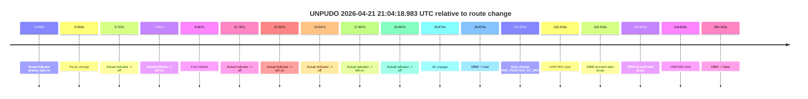
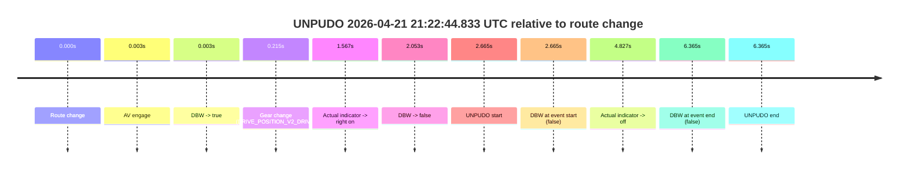
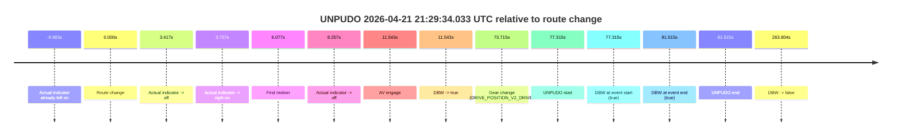

# Run Report: fme20031/2026-04-21--20-55-03--gen2-av-6012f067-7eac-4c54-af80-fe1b295980aa

| Field | Value |
|---|---|
| Run ID | `fme20031/2026-04-21--20-55-03--gen2-av-6012f067-7eac-4c54-af80-fe1b295980aa` |
| Date | `2026-04-21` |
| Model(s) | `eel-teal-outspoken` |
| Author | `zak` |
| Event count | `3` |

## unpudo 2026-04-21 21:04:18.983 UTC

| Field | Value |
|---|---|
| Model | `eel-teal-outspoken` |
| Author | `zak` |
| Run ID | `fme20031/2026-04-21--20-55-03--gen2-av-6012f067-7eac-4c54-af80-fe1b295980aa` |
| Date | `2026-04-21` |
| Time (UTC) | `21:04:18.983` |
| Event type | `unpudo` |
| Disengagement type | `none observed` |
| Route change | `found` |
| Console | [run](https://console.sso.wayve.ai/run/fme20031/2026-04-21--20-55-03--gen2-av-6012f067-7eac-4c54-af80-fe1b295980aa?id=&time-unixus=1776805458983303) |
| Foxglove | [segment](https://app.foxglove.dev/wayve-on-prem/p/prj_0dX18KZdVHg1fmmI/view?ds=foxglove-stream&ds.deviceName=fme20031&ds.start=2026-04-21T21%3A02%3A13.568259Z&ds.end=2026-04-21T21%3A07%3A17.721290Z&layoutId=lay_0e7VD4WIKDQGU73Y&time=2026-04-21T21%3A04%3A18.983303Z) |

### Event card: pass

- Pass: AV owns the credited unpudo from route change through the official unpudo window, the gear state is aligned at the anchor, and the vehicle moves without driver accelerator help in AV.

| Event | Time (UTC) | Delta from route change |
|---|---:|---:|
| Actual indicator already right on | 2026-04-21 21:02:13.574 | `-9.993s` |
| Route change | 2026-04-21 21:02:23.568 | `0.000s` |
| Actual indicator -> off | 2026-04-21 21:02:29.275 | `5.707s` |
| Actual indicator -> left on | 2026-04-21 21:02:31.475 | `7.907s` |
| First motion | 2026-04-21 21:02:33.134 | `9.567s` |
| Actual indicator -> off | 2026-04-21 21:02:35.334 | `11.767s` |
| Actual indicator -> left on | 2026-04-21 21:02:36.475 | `12.907s` |
| Actual indicator -> off | 2026-04-21 21:02:37.614 | `14.047s` |
| Actual indicator -> left on | 2026-04-21 21:02:41.174 | `17.607s` |
| Actual indicator -> off | 2026-04-21 21:02:48.175 | `24.607s` |
| AV engage | 2026-04-21 21:02:53.442 | `29.874s` |
| DBW -> true | 2026-04-21 21:02:53.442 | `29.874s` |
| Gear change (DRIVE_POSITION_V2_DRIVE) | 2026-04-21 21:04:15.383 | `111.815s` |
| UNPUDO start | 2026-04-21 21:04:18.983 | `115.415s` |
| DBW at event start (true) | 2026-04-21 21:04:18.983 | `115.415s` |
| DBW at event end (true) | 2026-04-21 21:04:22.383 | `118.815s` |
| UNPUDO end | 2026-04-21 21:04:22.383 | `118.815s` |
| DBW -> false | 2026-04-21 21:07:07.721 | `284.153s` |

| Metric | Value |
|---|---|
| Outcome | `pass` |
| Effective failure type | `none` |
| Route change status | `found` |
| DBW at event start | `true` |
| DBW at event end | `true` |
| Predicted gear at AV start | `DRIVE_POSITION_V2_DRIVE` |
| Actual gear at AV start | `DRIVE_POSITION_V2_DRIVE` |
| Predicted gear at event start | `DRIVE_POSITION_V2_DRIVE` |
| Actual gear at event start | `DRIVE_POSITION_V2_DRIVE` |
| Planned indicator direction | `INDICATORS_STATE_V2_RIGHT_ON` |
| Controller indicator direction | `INDICATORS_STATE_V2_RIGHT_ON` |
| Actual indicator direction | `INDICATORS_STATE_V2_OFF` |
| Actual indicator at maneuver end | `INDICATORS_STATE_V2_OFF` |
| Driver accel help in AV | `false` |
| Driver accel help timestamp | `n/a` |
| Max accel pedal pct in AV | `0.0%` |
| Max brake pedal pct in AV | `13.6%` |
| Max speed mps in AV | `7.806` |
| Success timing baseline | `route change` |
| Route -> AV | `29.874s` |
| AV -> event start | `85.541s` |
| AV -> first motion | `-20.308s` |
| Success baseline -> event start | `115.415s` |
| Success baseline -> first motion | `9.567s` |
| AV duration before disengagement | `254.279s` |
| Trajectory waypoint count | `37` |
| Driving-plan step count | `11` |

The scored portion starts from the AV-owned window, not from the pre-AV setup. Route-change search in the stopped pre-event segment was `found`, with the baseline therefore set to route change. At the event anchor the model predicts `DRIVE_POSITION_V2_DRIVE` and the actual gear is `DRIVE_POSITION_V2_DRIVE`. The effective model outcome is `pass` because `the credited unpudo stays AV-owned through the official unpudo window.`

### Resolution

| Field | Value |
|---|---|
| Final outcome | `pass` |
| Do we agree with this label? | `yes` |
| Source disengagement type | `none observed` |
| Resolved effective failure type | `none` |
| Confidence | `high` |

## unpudo 2026-04-21 21:22:44.833 UTC

| Field | Value |
|---|---|
| Model | `eel-teal-outspoken` |
| Author | `zak` |
| Run ID | `fme20031/2026-04-21--20-55-03--gen2-av-6012f067-7eac-4c54-af80-fe1b295980aa` |
| Date | `2026-04-21` |
| Time (UTC) | `21:22:44.833` |
| Event type | `unpudo` |
| Disengagement type | `none observed` |
| Route change | `found` |
| Console | [run](https://console.sso.wayve.ai/run/fme20031/2026-04-21--20-55-03--gen2-av-6012f067-7eac-4c54-af80-fe1b295980aa?id=&time-unixus=1776806564833315) |
| Foxglove | [segment](https://app.foxglove.dev/wayve-on-prem/p/prj_0dX18KZdVHg1fmmI/view?ds=foxglove-stream&ds.deviceName=fme20031&ds.start=2026-04-21T21%3A22%3A32.168281Z&ds.end=2026-04-21T21%3A22%3A58.533318Z&layoutId=lay_0e7VD4WIKDQGU73Y&time=2026-04-21T21%3A22%3A44.833315Z) |

### Event card: fail

- Fail: the credited unpudo does not stay AV-owned. The event window starts with DBW false, and the maneuver outcome lands outside a clean AV-owned segment.

| Event | Time (UTC) | Delta from route change |
|---|---:|---:|
| Route change | 2026-04-21 21:22:42.168 | `0.000s` |
| AV engage | 2026-04-21 21:22:42.171 | `0.003s` |
| DBW -> true | 2026-04-21 21:22:42.171 | `0.003s` |
| Gear change (DRIVE_POSITION_V2_DRIVE) | 2026-04-21 21:22:42.383 | `0.215s` |
| Actual indicator -> right on | 2026-04-21 21:22:43.734 | `1.567s` |
| DBW -> false | 2026-04-21 21:22:44.221 | `2.053s` |
| UNPUDO start | 2026-04-21 21:22:44.833 | `2.665s` |
| DBW at event start (false) | 2026-04-21 21:22:44.833 | `2.665s` |
| Actual indicator -> off | 2026-04-21 21:22:46.994 | `4.827s` |
| DBW at event end (false) | 2026-04-21 21:22:48.533 | `6.365s` |
| UNPUDO end | 2026-04-21 21:22:48.533 | `6.365s` |

| Metric | Value |
|---|---|
| Outcome | `fail` |
| Effective failure type | `not_av_owned` |
| Route change status | `found` |
| DBW at event start | `false` |
| DBW at event end | `false` |
| Predicted gear at AV start | `DRIVE_POSITION_V2_PARK` |
| Actual gear at AV start | `DRIVE_POSITION_V2_PARK` |
| Predicted gear at event start | `DRIVE_POSITION_V2_DRIVE` |
| Actual gear at event start | `DRIVE_POSITION_V2_DRIVE` |
| Planned indicator direction | `INDICATORS_STATE_V2_RIGHT_ON` |
| Controller indicator direction | `INDICATORS_STATE_V2_RIGHT_ON` |
| Actual indicator direction | `INDICATORS_STATE_V2_RIGHT_ON` |
| Actual indicator at maneuver end | `INDICATORS_STATE_V2_OFF` |
| Driver accel help in AV | `false` |
| Driver accel help timestamp | `n/a` |
| Max accel pedal pct in AV | `0.0%` |
| Max brake pedal pct in AV | `8.0%` |
| Max speed mps in AV | `0.000` |
| Success timing baseline | `route change` |
| Route -> AV | `0.003s` |
| AV -> event start | `2.662s` |
| AV -> first motion | `n/a` |
| Success baseline -> event start | `2.665s` |
| Success baseline -> first motion | `n/a` |
| AV duration before disengagement | `2.050s` |
| Trajectory waypoint count | `38` |
| Driving-plan step count | `11` |

The scored portion starts from the AV-owned window, not from the pre-AV setup. Route-change search in the stopped pre-event segment was `found`, with the baseline therefore set to route change. At the event anchor the model predicts `DRIVE_POSITION_V2_DRIVE` and the actual gear is `DRIVE_POSITION_V2_DRIVE`. The effective model outcome is `fail` because `not_av_owned.`

### Resolution

| Field | Value |
|---|---|
| Final outcome | `fail` |
| Do we agree with this label? | `yes` |
| Source disengagement type | `none observed` |
| Resolved effective failure type | `not_av_owned` |
| Confidence | `high` |

## unpudo 2026-04-21 21:29:34.033 UTC

| Field | Value |
|---|---|
| Model | `eel-teal-outspoken` |
| Author | `zak` |
| Run ID | `fme20031/2026-04-21--20-55-03--gen2-av-6012f067-7eac-4c54-af80-fe1b295980aa` |
| Date | `2026-04-21` |
| Time (UTC) | `21:29:34.033` |
| Event type | `unpudo` |
| Disengagement type | `none observed` |
| Route change | `found` |
| Console | [run](https://console.sso.wayve.ai/run/fme20031/2026-04-21--20-55-03--gen2-av-6012f067-7eac-4c54-af80-fe1b295980aa?id=&time-unixus=1776806974033323) |
| Foxglove | [segment](https://app.foxglove.dev/wayve-on-prem/p/prj_0dX18KZdVHg1fmmI/view?ds=foxglove-stream&ds.deviceName=fme20031&ds.start=2026-04-21T21%3A28%3A06.718259Z&ds.end=2026-04-21T21%3A32%3A50.522270Z&layoutId=lay_0e7VD4WIKDQGU73Y&time=2026-04-21T21%3A29%3A34.033323Z) |

### Event card: pass

- Pass: AV owns the credited unpudo from route change through the official unpudo window, the gear state is aligned at the anchor, and the vehicle moves without driver accelerator help in AV.

| Event | Time (UTC) | Delta from route change |
|---|---:|---:|
| Actual indicator already left on | 2026-04-21 21:28:06.734 | `-9.983s` |
| Route change | 2026-04-21 21:28:16.718 | `0.000s` |
| Actual indicator -> off | 2026-04-21 21:28:20.134 | `3.417s` |
| Actual indicator -> right on | 2026-04-21 21:28:20.475 | `3.757s` |
| First motion | 2026-04-21 21:28:22.795 | `6.077s` |
| Actual indicator -> off | 2026-04-21 21:28:24.975 | `8.257s` |
| AV engage | 2026-04-21 21:28:28.261 | `11.543s` |
| DBW -> true | 2026-04-21 21:28:28.261 | `11.543s` |
| Gear change (DRIVE_POSITION_V2_DRIVE) | 2026-04-21 21:29:30.433 | `73.715s` |
| UNPUDO start | 2026-04-21 21:29:34.033 | `77.315s` |
| DBW at event start (true) | 2026-04-21 21:29:34.033 | `77.315s` |
| DBW at event end (true) | 2026-04-21 21:29:38.233 | `81.515s` |
| UNPUDO end | 2026-04-21 21:29:38.233 | `81.515s` |
| DBW -> false | 2026-04-21 21:32:40.522 | `263.804s` |

| Metric | Value |
|---|---|
| Outcome | `pass` |
| Effective failure type | `none` |
| Route change status | `found` |
| DBW at event start | `true` |
| DBW at event end | `true` |
| Predicted gear at AV start | `DRIVE_POSITION_V2_DRIVE` |
| Actual gear at AV start | `DRIVE_POSITION_V2_DRIVE` |
| Predicted gear at event start | `DRIVE_POSITION_V2_DRIVE` |
| Actual gear at event start | `DRIVE_POSITION_V2_DRIVE` |
| Planned indicator direction | `INDICATORS_STATE_V2_RIGHT_ON` |
| Controller indicator direction | `INDICATORS_STATE_V2_RIGHT_ON` |
| Actual indicator direction | `INDICATORS_STATE_V2_OFF` |
| Actual indicator at maneuver end | `INDICATORS_STATE_V2_OFF` |
| Driver accel help in AV | `false` |
| Driver accel help timestamp | `n/a` |
| Max accel pedal pct in AV | `0.0%` |
| Max brake pedal pct in AV | `10.1%` |
| Max speed mps in AV | `8.014` |
| Success timing baseline | `route change` |
| Route -> AV | `11.543s` |
| AV -> event start | `65.772s` |
| AV -> first motion | `-5.466s` |
| Success baseline -> event start | `77.315s` |
| Success baseline -> first motion | `6.077s` |
| AV duration before disengagement | `252.261s` |
| Trajectory waypoint count | `38` |
| Driving-plan step count | `11` |

The scored portion starts from the AV-owned window, not from the pre-AV setup. Route-change search in the stopped pre-event segment was `found`, with the baseline therefore set to route change. At the event anchor the model predicts `DRIVE_POSITION_V2_DRIVE` and the actual gear is `DRIVE_POSITION_V2_DRIVE`. The effective model outcome is `pass` because `the credited unpudo stays AV-owned through the official unpudo window.`

### Resolution

| Field | Value |
|---|---|
| Final outcome | `pass` |
| Do we agree with this label? | `yes` |
| Source disengagement type | `none observed` |
| Resolved effective failure type | `none` |
| Confidence | `high` |
