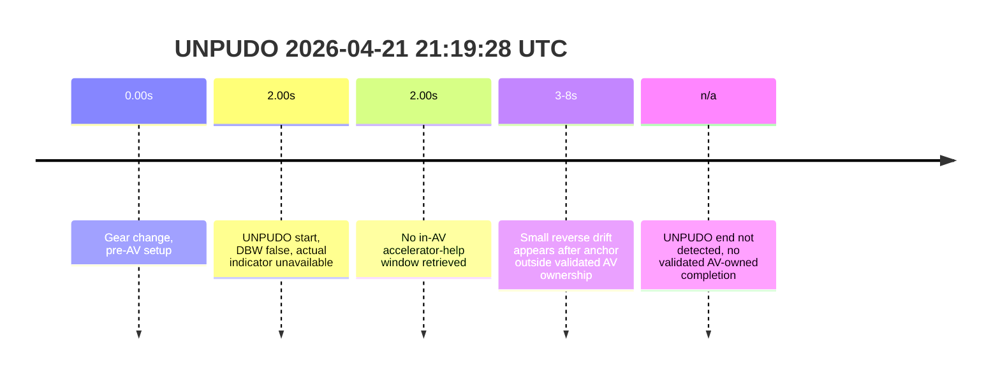
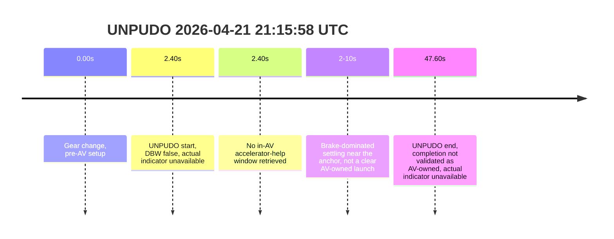
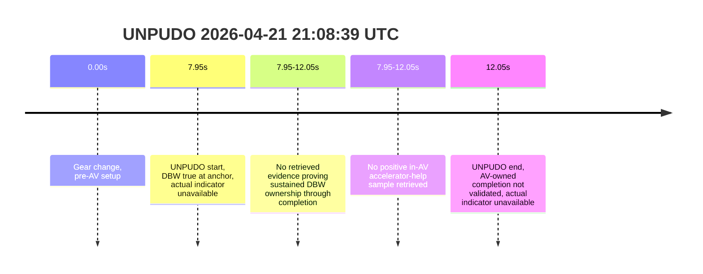

# Run Report: fme20031/2026-04-21--20-55-03--gen2-av-6012f067-7eac-4c54-af80-fe1b295980aa

| Field | Value |
|---|---|
| Run ID | `fme20031/2026-04-21--20-55-03--gen2-av-6012f067-7eac-4c54-af80-fe1b295980aa` |
| Date | `2026-04-21` |
| Model(s) | `pink-manta-ray-smooth` |

## unpudo 2026-04-21 21:19:28 UTC

| Field | Value |
|---|---|
| Model | `pink-manta-ray-smooth` |
| Author | `boris.indelman` |
| Run ID | `fme20031/2026-04-21--20-55-03--gen2-av-6012f067-7eac-4c54-af80-fe1b295980aa` |
| Date | `2026-04-21` |
| Time (UTC) | `21:19:28` |
| Event type | `unpudo` |
| Disengagement type | `none` |
| Console | [run](https://console.sso.wayve.ai/run/fme20031/2026-04-21--20-55-03--gen2-av-6012f067-7eac-4c54-af80-fe1b295980aa?id=&time-unixus=1776806368883304) |
| Foxglove | [segment](https://app.foxglove.dev/wayve-on-prem/p/prj_0dX18KZdVHg1fmmI/view?ds=foxglove-stream&ds.deviceName=fme20031&ds.end=2026-04-21T21%3A20%3A08.883Z&ds.start=2026-04-21T21%3A18%3A48.883Z&layoutId=lay_0e7VD4WIKDQGU73Y&time=2026-04-21T21%3A19%3A28.883Z) |

- `event_status: fail`. The anchor lands after AV ownership has already dropped out, so the maneuver is not creditable to the model even though the vehicle drifts slightly afterward.

| Event | Time (UTC) | Delta from gear change | DBW / pedal help | Actual indicator |
|---|---:|---:|---|---|
| Gear change | 2026-04-21 21:19:26 | 0.00s | pre-AV setup | unavailable from retrieved samples |
| UNPUDO start | 2026-04-21 21:19:28 | 2.00s | `DBW false` at anchor | unavailable from retrieved samples |
| DBW transition note | not validated | n/a | anchor is already outside AV ownership | n/a |
| In-AV driver accelerator help | not observed | n/a | no AV-owned window retrieved at anchor | n/a |
| UNPUDO end | not detected | n/a | no validated AV-owned completion | unavailable from retrieved samples |

| Metric | Value |
|---|---|
| event_status | `fail` |
| Effective failure type | `interrupted_handover_or_non_av_attempt` |
| Scoring baseline | `event anchor / AV-start fallback (no validated route reassignment)` |
| Predicted gear at event start | `DRIVE_POSITION_V2_DRIVE` |
| Actual gear at event start | `DRIVE_POSITION_V2_DRIVE` |
| Trajectory DBW at anchor | `false` |
| Trajectory waypoint count | `36` |
| Driving plan step count | `11` |
| Event duration | `not materialized` |
| Gear change -> UNPUDO start | `2.00s` |
| Main disengagement flag | `0` |
| Gear-to-start disengagement | `0` |
| Before-gearchange-10s disengagement | `0` |

This reads as an interrupted or abandoned attempt, not an AV-owned UNPUDO. The event row is real, but ownership is already gone at the anchor and no AV-owned end boundary is available, so model-performance scoring has to stay `fail`.

### Resolution

- Final outcome: `fail`
- Do we agree with this label?: `yes`
- Source disengagement type: `none`
- Resolved effective failure type: `interrupted_handover_or_non_av_attempt`
- Confidence: `high`

## unpudo 2026-04-21 21:15:58 UTC

| Field | Value |
|---|---|
| Model | `pink-manta-ray-smooth` |
| Author | `boris.indelman` |
| Run ID | `fme20031/2026-04-21--20-55-03--gen2-av-6012f067-7eac-4c54-af80-fe1b295980aa` |
| Date | `2026-04-21` |
| Time (UTC) | `21:15:58` |
| Event type | `unpudo` |
| Disengagement type | `none` |
| Console | [run](https://console.sso.wayve.ai/run/fme20031/2026-04-21--20-55-03--gen2-av-6012f067-7eac-4c54-af80-fe1b295980aa?id=&time-unixus=1776806158083298) |
| Foxglove | [segment](https://app.foxglove.dev/wayve-on-prem/p/prj_0dX18KZdVHg1fmmI/view?ds=foxglove-stream&ds.deviceName=fme20031&ds.end=2026-04-21T21%3A16%3A38.083Z&ds.start=2026-04-21T21%3A15%3A18.083Z&layoutId=lay_0e7VD4WIKDQGU73Y&time=2026-04-21T21%3A15%3A58.083Z) |

- `event_status: fail`. The event anchor is already outside AV ownership, and the long row closure is therefore not a model-owned completion.

| Event | Time (UTC) | Delta from gear change | DBW / pedal help | Actual indicator |
|---|---:|---:|---|---|
| Gear change | 2026-04-21 21:15:55 | 0.00s | pre-AV setup | unavailable from retrieved samples |
| UNPUDO start | 2026-04-21 21:15:58 | 2.40s | `DBW false` at anchor | unavailable from retrieved samples |
| DBW transition note | not validated | n/a | anchor already outside AV ownership | n/a |
| In-AV driver accelerator help | not observed | n/a | no AV-owned window retrieved at anchor | n/a |
| UNPUDO end | 2026-04-21 21:16:43 | 47.60s | completion not validated as AV-owned | unavailable from retrieved samples |

| Metric | Value |
|---|---|
| event_status | `fail` |
| Effective failure type | `interrupted_handover_or_non_av_completion` |
| Scoring baseline | `event anchor / AV-start fallback (no validated route reassignment)` |
| Predicted gear at event start | `DRIVE_POSITION_V2_DRIVE` |
| Actual gear at event start | `DRIVE_POSITION_V2_DRIVE` |
| Trajectory DBW at anchor | `false` |
| Trajectory waypoint count | `36` |
| Driving plan step count | `11` |
| Event duration | `45.20s` |
| Gear change -> UNPUDO start | `2.40s` |
| UNPUDO start -> end | `45.20s` |
| Main disengagement flag | `0` |
| Gear-to-start disengagement | `0` |
| Before-gearchange-10s disengagement | `0` |
| Local brake spike near anchor | `8.0%` |

The row closes, but not under validated AV ownership. Because DBW is already false at the anchor and no route reassignment or in-AV completion signal was established, this has to stay a model-performance `fail` rather than a pass with caveats.

### Resolution

- Final outcome: `fail`
- Do we agree with this label?: `yes`
- Source disengagement type: `none`
- Resolved effective failure type: `interrupted_handover_or_non_av_completion`
- Confidence: `high`

## unpudo 2026-04-21 21:08:39 UTC

| Field | Value |
|---|---|
| Model | `pink-manta-ray-smooth` |
| Author | `boris.indelman` |
| Run ID | `fme20031/2026-04-21--20-55-03--gen2-av-6012f067-7eac-4c54-af80-fe1b295980aa` |
| Date | `2026-04-21` |
| Time (UTC) | `21:08:39` |
| Event type | `unpudo` |
| Disengagement type | `none` |
| Console | [run](https://console.sso.wayve.ai/run/fme20031/2026-04-21--20-55-03--gen2-av-6012f067-7eac-4c54-af80-fe1b295980aa?id=&time-unixus=1776805719383317) |
| Foxglove | [segment](https://app.foxglove.dev/wayve-on-prem/p/prj_0dX18KZdVHg1fmmI/view?ds=foxglove-stream&ds.deviceName=fme20031&ds.end=2026-04-21T21%3A09%3A19.383Z&ds.start=2026-04-21T21%3A07%3A59.383Z&layoutId=lay_0e7VD4WIKDQGU73Y&time=2026-04-21T21%3A08%3A39.383Z) |

- `event_status: fail`. This is AV-owned at the anchor, but the retrieved evidence only proves DBW at maneuver start, not sustained AV ownership through the credited UNPUDO completion. Under the updated contract, that is not enough to score a pass.

| Event | Time (UTC) | Delta from gear change | DBW / pedal help | Actual indicator |
|---|---:|---:|---|---|
| Gear change | 2026-04-21 21:08:31 | 0.00s | pre-AV setup | unavailable from retrieved samples |
| UNPUDO start | 2026-04-21 21:08:39 | 7.95s | `DBW true` at anchor | unavailable from retrieved samples |
| DBW transition note | not validated | n/a | sustained AV ownership through event end was not proven from retrieved samples | n/a |
| In-AV driver accelerator help | not observed in retrieved evidence | n/a | no positive in-AV accelerator-help sample retrieved | n/a |
| UNPUDO end | 2026-04-21 21:08:43 | 12.05s | AV-owned completion not validated | unavailable from retrieved samples |

| Metric | Value |
|---|---|
| event_status | `fail` |
| Effective failure type | `ownership_not_validated_through_completion` |
| Scoring baseline | `event anchor / AV-owned at anchor only` |
| Predicted gear at event start | `DRIVE_POSITION_V2_DRIVE` |
| Actual gear at event start | `DRIVE_POSITION_V2_DRIVE` |
| Trajectory DBW at anchor | `true` |
| Trajectory waypoint count | `36` |
| Driving plan step count | `11` |
| Event duration | `4.10s` |
| Gear change -> UNPUDO start | `7.95s` |
| UNPUDO start -> end | `4.10s` |
| Main disengagement flag | `0` |
| Gear-to-start disengagement | `0` |
| Before-gearchange-10s disengagement | `0` |
| Local brake spike near anchor | `8.0%` |

The earlier version of this card treated anchor-time DBW as enough for a pass. The updated rule is stricter: the credited maneuver must stay AV-owned. With only start-of-maneuver ownership validated and no retrieved evidence proving ownership through end-of-maneuver, the defensible label is `fail`.

### Resolution

- Final outcome: `fail`
- Do we agree with this label?: `yes`
- Source disengagement type: `none`
- Resolved effective failure type: `ownership_not_validated_through_completion`
- Confidence: `medium`
