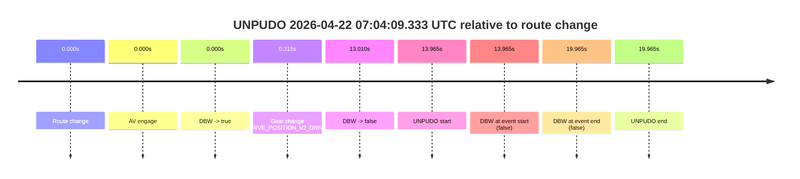
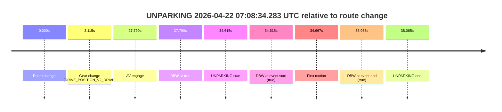

# Run Report: fme20031/2026-04-22--06-41-27--gen2-av-cc2f11b2-09c0-4612-988c-dc2b047f0358

| Field | Value |
|---|---|
| Run ID | `fme20031/2026-04-22--06-41-27--gen2-av-cc2f11b2-09c0-4612-988c-dc2b047f0358` |
| Date | `2026-04-22` |
| Model(s) | `eel-teal-outspoken` |
| Author | `zak` |
| Event count | `2` |

## unpudo 2026-04-22 07:04:09.333 UTC

| Field | Value |
|---|---|
| Model | `eel-teal-outspoken` |
| Author | `zak` |
| Run ID | `fme20031/2026-04-22--06-41-27--gen2-av-cc2f11b2-09c0-4612-988c-dc2b047f0358` |
| Date | `2026-04-22` |
| Time (UTC) | `07:04:09.333` |
| Event type | `unpudo` |
| Disengagement type | `none observed` |
| Route change | `found` |
| Console | [run](https://console.sso.wayve.ai/run/fme20031/2026-04-22--06-41-27--gen2-av-cc2f11b2-09c0-4612-988c-dc2b047f0358?id=&time-unixus=1776841449333296) |
| Foxglove | [segment](https://app.foxglove.dev/wayve-on-prem/p/prj_0dX18KZdVHg1fmmI/view?ds=foxglove-stream&ds.deviceName=fme20031&ds.start=2026-04-22T07%3A03%3A45.368262Z&ds.end=2026-04-22T07%3A04%3A25.333307Z&layoutId=lay_0e7VD4WIKDQGU73Y&time=2026-04-22T07%3A04%3A09.333296Z) |

### Event card: fail

- Fail: the credited unpudo does not stay AV-owned. The event window starts with DBW false, and the maneuver outcome lands outside a clean AV-owned segment.

| Event | Time (UTC) | Delta from route change |
|---|---:|---:|
| Route change | 2026-04-22 07:03:55.368 | `0.000s` |
| AV engage | 2026-04-22 07:03:55.368 | `0.000s` |
| DBW -> true | 2026-04-22 07:03:55.368 | `0.000s` |
| Gear change (DRIVE_POSITION_V2_DRIVE) | 2026-04-22 07:03:55.683 | `0.315s` |
| DBW -> false | 2026-04-22 07:04:08.378 | `13.010s` |
| UNPUDO start | 2026-04-22 07:04:09.333 | `13.965s` |
| DBW at event start (false) | 2026-04-22 07:04:09.333 | `13.965s` |
| DBW at event end (false) | 2026-04-22 07:04:15.333 | `19.965s` |
| UNPUDO end | 2026-04-22 07:04:15.333 | `19.965s` |

| Metric | Value |
|---|---|
| Outcome | `fail` |
| Effective failure type | `not_av_owned` |
| Route change status | `found` |
| DBW at event start | `false` |
| DBW at event end | `false` |
| Predicted gear at AV start | `DRIVE_POSITION_V2_PARK` |
| Actual gear at AV start | `DRIVE_POSITION_V2_PARK` |
| Predicted gear at event start | `DRIVE_POSITION_V2_DRIVE` |
| Actual gear at event start | `DRIVE_POSITION_V2_DRIVE` |
| Planned indicator direction | `INDICATORS_STATE_V2_OFF` |
| Controller indicator direction | `INDICATORS_STATE_V2_OFF` |
| Actual indicator direction | `INDICATORS_STATE_V2_OFF` |
| Actual indicator at maneuver end | `INDICATORS_STATE_V2_OFF` |
| Driver accel help in AV | `false` |
| Driver accel help timestamp | `n/a` |
| Max accel pedal pct in AV | `0.0%` |
| Max brake pedal pct in AV | `8.0%` |
| Max speed mps in AV | `0.000` |
| Success timing baseline | `route change` |
| Route -> AV | `0.000s` |
| AV -> event start | `13.965s` |
| AV -> first motion | `n/a` |
| Success baseline -> event start | `13.965s` |
| Success baseline -> first motion | `n/a` |
| AV duration before disengagement | `13.010s` |
| Trajectory waypoint count | `37` |
| Driving-plan step count | `11` |

The scored portion starts from the AV-owned window, not from the pre-AV setup. Route-change search in the stopped pre-event segment was `found`, with the baseline therefore set to route change. At the event anchor the model predicts `DRIVE_POSITION_V2_DRIVE` and the actual gear is `DRIVE_POSITION_V2_DRIVE`. The effective model outcome is `fail` because `not_av_owned.`

### Resolution

| Field | Value |
|---|---|
| Final outcome | `fail` |
| Do we agree with this label? | `yes` |
| Source disengagement type | `none observed` |
| Resolved effective failure type | `not_av_owned` |
| Confidence | `high` |

## unparking 2026-04-22 07:08:34.283 UTC

| Field | Value |
|---|---|
| Model | `eel-teal-outspoken` |
| Author | `zak` |
| Run ID | `fme20031/2026-04-22--06-41-27--gen2-av-cc2f11b2-09c0-4612-988c-dc2b047f0358` |
| Date | `2026-04-22` |
| Time (UTC) | `07:08:34.283` |
| Event type | `unparking` |
| Disengagement type | `none observed` |
| Route change | `found` |
| Console | [run](https://console.sso.wayve.ai/run/fme20031/2026-04-22--06-41-27--gen2-av-cc2f11b2-09c0-4612-988c-dc2b047f0358?id=&time-unixus=1776841714283316) |
| Foxglove | [segment](https://app.foxglove.dev/wayve-on-prem/p/prj_0dX18KZdVHg1fmmI/view?ds=foxglove-stream&ds.deviceName=fme20031&ds.start=2026-04-22T07%3A07%3A49.668287Z&ds.end=2026-04-22T07%3A08%3A47.733301Z&layoutId=lay_0e7VD4WIKDQGU73Y&time=2026-04-22T07%3A08%3A34.283316Z) |

### Event card: pass

- Pass: AV owns the credited unparking through the official event window, the gear state is aligned at the anchor, and the vehicle moves without driver accelerator help in AV.

| Event | Time (UTC) | Delta from route change |
|---|---:|---:|
| Route change | 2026-04-22 07:07:59.668 | `0.000s` |
| Gear change (DRIVE_POSITION_V2_DRIVE) | 2026-04-22 07:08:02.783 | `3.115s` |
| AV engage | 2026-04-22 07:08:27.458 | `27.790s` |
| DBW -> true | 2026-04-22 07:08:27.458 | `27.790s` |
| UNPARKING start | 2026-04-22 07:08:34.283 | `34.615s` |
| DBW at event start (true) | 2026-04-22 07:08:34.283 | `34.615s` |
| First motion | 2026-04-22 07:08:34.334 | `34.667s` |
| DBW at event end (true) | 2026-04-22 07:08:37.733 | `38.065s` |
| UNPARKING end | 2026-04-22 07:08:37.733 | `38.065s` |

| Metric | Value |
|---|---|
| Outcome | `pass` |
| Effective failure type | `none` |
| Route change status | `found` |
| DBW at event start | `true` |
| DBW at event end | `true` |
| Predicted gear at AV start | `DRIVE_POSITION_V2_DRIVE` |
| Actual gear at AV start | `DRIVE_POSITION_V2_DRIVE` |
| Predicted gear at event start | `DRIVE_POSITION_V2_DRIVE` |
| Actual gear at event start | `DRIVE_POSITION_V2_DRIVE` |
| Planned indicator direction | `INDICATORS_STATE_V2_OFF` |
| Controller indicator direction | `INDICATORS_STATE_V2_OFF` |
| Actual indicator direction | `INDICATORS_STATE_V2_OFF` |
| Actual indicator at maneuver end | `INDICATORS_STATE_V2_OFF` |
| Driver accel help in AV | `false` |
| Driver accel help timestamp | `n/a` |
| Max accel pedal pct in AV | `0.0%` |
| Max brake pedal pct in AV | `0.0%` |
| Max speed mps in AV | `4.900` |
| Success timing baseline | `route change` |
| Route -> AV | `27.790s` |
| AV -> event start | `6.825s` |
| AV -> first motion | `6.877s` |
| Success baseline -> event start | `34.615s` |
| Success baseline -> first motion | `34.667s` |
| AV duration before disengagement | `n/a` |
| Trajectory waypoint count | `37` |
| Driving-plan step count | `11` |

The scored portion starts from the AV-owned window, not from the pre-AV setup. Route-change search in the stopped pre-event segment was `found`, with the baseline therefore set to route change. At the event anchor the model predicts `DRIVE_POSITION_V2_DRIVE` and the actual gear is `DRIVE_POSITION_V2_DRIVE`. The effective model outcome is `pass` because `the credited maneuver stays AV-owned through the official event end.`

### Resolution

| Field | Value |
|---|---|
| Final outcome | `pass` |
| Do we agree with this label? | `yes` |
| Source disengagement type | `none observed` |
| Resolved effective failure type | `none` |
| Confidence | `high` |
