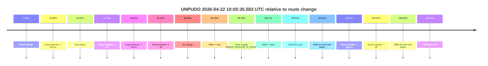
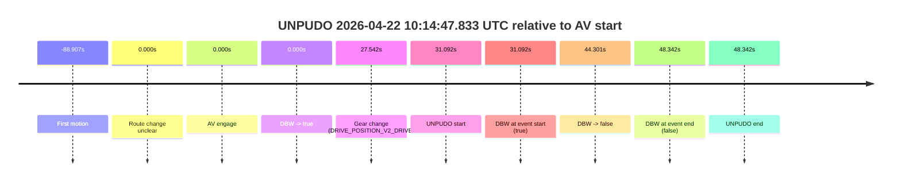

# Run Report: fme20031/2026-04-22--09-31-25--gen2-av-0c95d3db-5acf-4ce2-8629-93c6ca255148

| Field | Value |
|---|---|
| Run ID | `fme20031/2026-04-22--09-31-25--gen2-av-0c95d3db-5acf-4ce2-8629-93c6ca255148` |
| Date | `2026-04-22` |
| Model(s) | `eel-teal-outspoken` |
| Author | `zak` |
| Event count | `2` |

## unpudo 2026-04-22 10:00:35.583 UTC

| Field | Value |
|---|---|
| Model | `eel-teal-outspoken` |
| Author | `zak` |
| Run ID | `fme20031/2026-04-22--09-31-25--gen2-av-0c95d3db-5acf-4ce2-8629-93c6ca255148` |
| Date | `2026-04-22` |
| Time (UTC) | `10:00:35.583` |
| Event type | `unpudo` |
| Disengagement type | `none observed` |
| Route change | `found` |
| Console | [run](https://console.sso.wayve.ai/run/fme20031/2026-04-22--09-31-25--gen2-av-0c95d3db-5acf-4ce2-8629-93c6ca255148?id=&time-unixus=1776852035583305) |
| Foxglove | [segment](https://app.foxglove.dev/wayve-on-prem/p/prj_0dX18KZdVHg1fmmI/view?ds=foxglove-stream&ds.deviceName=fme20031&ds.start=2026-04-22T09%3A58%3A46.568373Z&ds.end=2026-04-22T10%3A00%3A54.583295Z&layoutId=lay_0e7VD4WIKDQGU73Y&time=2026-04-22T10%3A00%3A35.583305Z) |

### Event card: fail

- Fail: the credited unpudo does not stay AV-owned. The event window starts with DBW false, and the maneuver outcome lands outside a clean AV-owned segment.

| Event | Time (UTC) | Delta from route change |
|---|---:|---:|
| Route change | 2026-04-22 09:58:56.568 | `0.000s` |
| Actual indicator -> left on | 2026-04-22 09:59:08.955 | `12.387s` |
| First motion | 2026-04-22 09:59:12.994 | `16.427s` |
| Actual indicator -> off | 2026-04-22 09:59:14.874 | `18.306s` |
| Actual indicator -> left on | 2026-04-22 09:59:57.175 | `60.607s` |
| Actual indicator -> off | 2026-04-22 09:59:59.075 | `62.507s` |
| AV engage | 2026-04-22 10:00:22.821 | `86.253s` |
| DBW -> true | 2026-04-22 10:00:22.821 | `86.253s` |
| Gear change (DRIVE_POSITION_V2_DRIVE) | 2026-04-22 10:00:23.333 | `86.765s` |
| DBW -> false | 2026-04-22 10:00:34.640 | `98.073s` |
| UNPUDO start | 2026-04-22 10:00:35.583 | `99.015s` |
| DBW at event start (false) | 2026-04-22 10:00:35.583 | `99.015s` |
| Actual indicator -> right on | 2026-04-22 10:00:36.455 | `99.887s` |
| Actual indicator -> off | 2026-04-22 10:00:40.695 | `104.127s` |
| DBW at event end (false) | 2026-04-22 10:00:44.583 | `108.015s` |
| UNPUDO end | 2026-04-22 10:00:44.583 | `108.015s` |

| Metric | Value |
|---|---|
| Outcome | `fail` |
| Effective failure type | `completed_outside_av` |
| Route change status | `found` |
| DBW at event start | `false` |
| DBW at event end | `false` |
| Predicted gear at AV start | `DRIVE_POSITION_V2_DRIVE` |
| Actual gear at AV start | `DRIVE_POSITION_V2_PARK` |
| Predicted gear at event start | `DRIVE_POSITION_V2_DRIVE` |
| Actual gear at event start | `DRIVE_POSITION_V2_DRIVE` |
| Planned indicator direction | `INDICATORS_STATE_V2_RIGHT_ON` |
| Controller indicator direction | `INDICATORS_STATE_V2_RIGHT_ON` |
| Actual indicator direction | `INDICATORS_STATE_V2_OFF` |
| Actual indicator at maneuver end | `INDICATORS_STATE_V2_OFF` |
| Driver accel help in AV | `false` |
| Driver accel help timestamp | `n/a` |
| Max accel pedal pct in AV | `0.0%` |
| Max brake pedal pct in AV | `8.3%` |
| Max speed mps in AV | `0.000` |
| Success timing baseline | `route change` |
| Route -> AV | `86.253s` |
| AV -> event start | `12.762s` |
| AV -> first motion | `-69.827s` |
| Success baseline -> event start | `99.015s` |
| Success baseline -> first motion | `16.427s` |
| AV duration before disengagement | `11.819s` |
| Trajectory waypoint count | `37` |
| Driving-plan step count | `11` |

The scored portion starts from the AV-owned window, not from the pre-AV setup. Route-change search in the stopped pre-event segment was `found`, with the baseline therefore set to route change. At the event anchor the model predicts `DRIVE_POSITION_V2_DRIVE` and the actual gear is `DRIVE_POSITION_V2_DRIVE`. The effective model outcome is `fail` because `completed_outside_av.`

### Resolution

| Field | Value |
|---|---|
| Final outcome | `fail` |
| Do we agree with this label? | `yes` |
| Source disengagement type | `none observed` |
| Resolved effective failure type | `completed_outside_av` |
| Confidence | `high` |

## unpudo 2026-04-22 10:14:47.833 UTC

| Field | Value |
|---|---|
| Model | `eel-teal-outspoken` |
| Author | `zak` |
| Run ID | `fme20031/2026-04-22--09-31-25--gen2-av-0c95d3db-5acf-4ce2-8629-93c6ca255148` |
| Date | `2026-04-22` |
| Time (UTC) | `10:14:47.833` |
| Event type | `unpudo` |
| Disengagement type | `none observed` |
| Route change | `unclear` |
| Console | [run](https://console.sso.wayve.ai/run/fme20031/2026-04-22--09-31-25--gen2-av-0c95d3db-5acf-4ce2-8629-93c6ca255148?id=&time-unixus=1776852887833308) |
| Foxglove | [segment](https://app.foxglove.dev/wayve-on-prem/p/prj_0dX18KZdVHg1fmmI/view?ds=foxglove-stream&ds.deviceName=fme20031&ds.start=2026-04-22T10%3A14%3A06.741761Z&ds.end=2026-04-22T10%3A15%3A15.083304Z&layoutId=lay_0e7VD4WIKDQGU73Y&time=2026-04-22T10%3A14%3A47.833308Z) |

### Event card: fail

- Fail: the credited unpudo does not stay AV-owned. The event window starts with DBW true, and the maneuver outcome lands outside a clean AV-owned segment.

| Event | Time (UTC) | Delta from AV start |
|---|---:|---:|
| First motion | 2026-04-22 10:12:47.835 | `-88.907s` |
| Route change unclear | 2026-04-22 10:14:16.741 | `0.000s` |
| AV engage | 2026-04-22 10:14:16.741 | `0.000s` |
| DBW -> true | 2026-04-22 10:14:16.741 | `0.000s` |
| Gear change (DRIVE_POSITION_V2_DRIVE) | 2026-04-22 10:14:44.283 | `27.542s` |
| UNPUDO start | 2026-04-22 10:14:47.833 | `31.092s` |
| DBW at event start (true) | 2026-04-22 10:14:47.833 | `31.092s` |
| DBW -> false | 2026-04-22 10:15:01.042 | `44.301s` |
| DBW at event end (false) | 2026-04-22 10:15:05.083 | `48.342s` |
| UNPUDO end | 2026-04-22 10:15:05.083 | `48.342s` |

| Metric | Value |
|---|---|
| Outcome | `fail` |
| Effective failure type | `driver_completed_maneuver` |
| Route change status | `unclear` |
| DBW at event start | `true` |
| DBW at event end | `false` |
| Predicted gear at AV start | `DRIVE_POSITION_V2_DRIVE` |
| Actual gear at AV start | `DRIVE_POSITION_V2_PARK` |
| Predicted gear at event start | `DRIVE_POSITION_V2_DRIVE` |
| Actual gear at event start | `DRIVE_POSITION_V2_DRIVE` |
| Planned indicator direction | `INDICATORS_STATE_V2_OFF` |
| Controller indicator direction | `INDICATORS_STATE_V2_OFF` |
| Actual indicator direction | `INDICATORS_STATE_V2_OFF` |
| Actual indicator at maneuver end | `INDICATORS_STATE_V2_OFF` |
| Driver accel help in AV | `false` |
| Driver accel help timestamp | `n/a` |
| Max accel pedal pct in AV | `0.0%` |
| Max brake pedal pct in AV | `27.7%` |
| Max speed mps in AV | `6.650` |
| Success timing baseline | `AV start` |
| Route -> AV | `n/a` |
| AV -> event start | `31.092s` |
| AV -> first motion | `-88.907s` |
| Success baseline -> event start | `31.092s` |
| Success baseline -> first motion | `-88.907s` |
| AV duration before disengagement | `44.301s` |
| Trajectory waypoint count | `38` |
| Driving-plan step count | `11` |

The scored portion starts from the AV-owned window, not from the pre-AV setup. Route-change search in the stopped pre-event segment was `unclear`, with the baseline therefore set to AV start. At the event anchor the model predicts `DRIVE_POSITION_V2_DRIVE` and the actual gear is `DRIVE_POSITION_V2_DRIVE`. The effective model outcome is `fail` because `driver_completed_maneuver.`

### Resolution

| Field | Value |
|---|---|
| Final outcome | `fail` |
| Do we agree with this label? | `yes` |
| Source disengagement type | `none observed` |
| Resolved effective failure type | `driver_completed_maneuver` |
| Confidence | `medium` |
